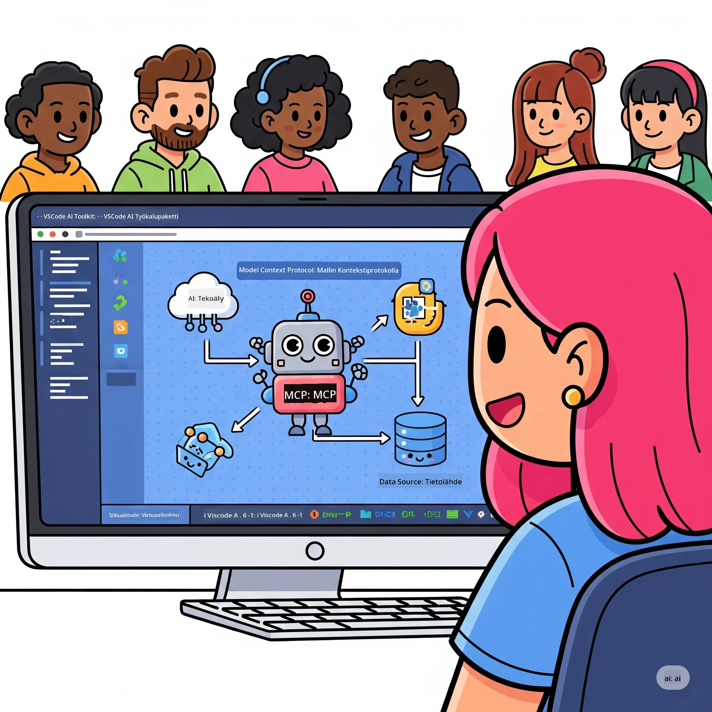
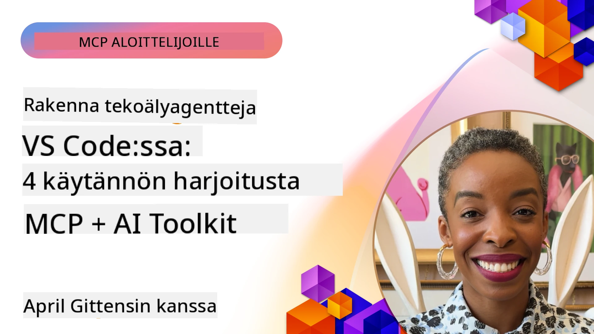

# Tekoälyn työnkulkujen virtaviivaistaminen: MCP-palvelimen rakentaminen Microsoft Foundry Toolkitilla

## 🎯 Yleiskuvaus

_(Napsauta yllä olevaa kuvaa nähdäksesi tämän oppitunnin videon)_

Tervetuloa **Model Context Protocol (MCP) -työpajaan**! Tämä kattava käytännön työpaja yhdistää kaksi huippuluokan teknologiaa mullistaakseen tekoälysovellusten kehityksen:

> **Yhteensopivuusohje:** työpajan koodi on rakennettu ja testattu MCP:n
> `2025-11-25` version kanssa, kuten yllä oleva merkki osoittaa. Käytä
> [nykyistä `2026-07-28` spesifikaatiota](https://modelcontextprotocol.io/specification/2026-07-28/)
> uusissa protokollan toteutuksissa ja tarkista SDK:n julkaisutiedot ennen
> laboratorioiden siirtoa.

- **🔗 Model Context Protocol (MCP)**: Avoin standardi saumattomaan tekoälytyökalujen integrointiin
- **🛠️ Microsoft Foundry Toolkit -laajennus VS Codeen**: Microsoftin tehokas tekoälyn kehitystyökalu

### 🎓 Mitä opit

Tämän työpajan jälkeen hallitset älykkäiden sovellusten rakentamisen, jotka yhdistävät tekoälymallit todellisiin työkaluihin ja palveluihin. Automaattisesta testauksesta räätälöityihin API-integraatioihin saat käytännön taitoja monimutkaisten liiketoimintahaasteiden ratkaisuun.

## 🏗️ Teknologiakokonaisuus

### 🔌 Model Context Protocol (MCP)

MCP on **"USB-C tekoälylle"** – universaali standardi, joka yhdistää tekoälymallit ulkoisiin työkaluihin ja tietolähteisiin.

**✨ Keskeiset ominaisuudet:**

- 🔄 **Standardoitu integraatio**: Universaali rajapinta tekoäly- ja työkaluyhteyksille
- 🏛️ **Joustava arkkitehtuuri**: Paikalliset ja etäpalvelimet stdio/SSE-siirrolla
- 🧰 **Rikas ekosysteemi**: Työkalut, komennot ja resurssit yhteen protokollaan
- 🔒 **Yritystason valmius**: Sisäänrakennettu turvallisuus ja luotettavuus

**🎯 Miksi MCP on tärkeä:**
Aivan kuten USB-C poisti kaoskaapelit, MCP poistaa tekoälyn integraatioiden monimutkaisuuden. Yksi protokolla, lukemattomat mahdollisuudet.

### 🤖 Microsoft Foundry Toolkit -laajennus VS Codeen

Microsoftin lippulaivalaajennus tekoälyn kehitykseen, joka muuttaa VS Coden tekoälyvoimakeskukseksi.

**🚀 Keskeiset ominaisuudet:**

- 📦 **Malliluettelo**: Pääsy malleihin Azure AI:sta, GitHubista, Hugging Facesta, Ollamasta
- ⚡ **Paikallinen päättely**: ONNX-optimoitu CPU/GPU/NPU-suoritus
- 🏗️ **Agenttirakentaja**: Visuaalinen tekoälyagenttien kehitys MCP-integraatiolla
- 🎭 **Monimuotoinen**: Teksti-, näkö- ja rakenteisen tulosteen tuki

**💡 Kehityksen edut:**

- Mallin käyttöönotto ilman konfigurointia
- Visuaalinen kehoteinsinöörityö
- Reaaliaikainen testausympäristö
- Saumaton MCP-palvelimen integraatio

## 📚 Oppimispolku

### [🚀 Jakso 1: Microsoft Foundry Toolkitin perusteet](./lab1/README.md)

**Kesto**: 15 minuuttia

- 🛠️ Asenna ja konfiguroi Microsoft Foundry Toolkit VS Codeen
- 🗂️ Tutustu Malliluetteloon (100+ mallia GitHubista, ONNX:stä, OpenAI:sta, Anthropista, Googlesta)
- 🎮 Hallitse Interaktiivinen Leikkikenttä reaaliaikaiseen mallin testaukseen
- 🤖 Rakenna ensimmäinen tekoälyagenttisi Agenttirakentajalla
- 📊 Arvioi mallin suorituskyky sisäänrakennetuilla mittareilla (F1, relevanssi, samankaltaisuus, johdonmukaisuus)
- ⚡ Opettele eräprosessointi ja monimuotoisuuden tukeminen

**🎯 Oppimistavoite**: Luo toimiva tekoälyagentti Microsoft Foundry Toolkitin ominaisuuksilla

### [🌐 Jakso 2: MCP Microsoft Foundry Toolkitin perusteilla](./lab2/README.md)

**Kesto**: 20 minuuttia

- 🧠 Hallitse Model Context Protocol (MCP) -arkkitehtuuri ja käsitteet
- 🌐 Tutustu Microsoftin MCP-palvelinen ekosysteemiin
- 🤖 Rakenna selainautomaatiovelho Playwright MCP -palvelimella
- 🔧 Integroi MCP-palvelimet Microsoft Foundry Toolkit Agent Builderiin
- 📊 Konfiguroi ja testaa MCP-työkaluja agenteissasi
- 🚀 Vie ja ota MCP-vahvistetut agentit tuotantoon

**🎯 Oppimistavoite**: Ota käyttöön AI-agentti, joka on tehostettu ulkoisilla työkaluilla MCP:n kautta

### [🔧 Jakso 3: Edistynyt MCP-kehitys Microsoft Foundry Toolkitilla](./lab3/README.md)

**Kesto**: 20 minuuttia

- 💻 Luo räätälöityjä MCP-palvelimia käyttäen Microsoft Foundry Toolkitia
- 🐍 Konfiguroi ja käytä uusinta MCP Python SDK:ta (v1.9.3)
- 🔍 Ota käyttöön MCP Inspector virheenkorjausta varten
- 🛠️ Rakenna Sää MCP-palvelin ammattimaisin virheenkorjausprosessein
- 🧪 Virheenkorjaa MCP-palvelimia sekä Agent Builder- että Inspector-ympäristöissä

**🎯 Oppimistavoite**: Kehitä ja virheenkorjaa räätälöityjä MCP-palvelimia moderneilla työkaluilla

### [🐙 Jakso 4: Käytännön MCP-kehitys - Räätälöity GitHub Clone -palvelin](./lab4/README.md)

**Kesto**: 30 minuuttia

- 🏗️ Rakenna todellisen maailman GitHub Clone MCP -palvelin kehitystyönkuluille
- 🔄 Toteuta älykäs repositorion kloonaus validoinnilla ja virhehandlauksella
- 📁 Luo älykäs hakemistonhallinta ja VS Code -integraatio
- 🤖 Käytä GitHub Copilot Agent Modea räätälöityjen MCP-työkalujen kanssa
- 🛡️ Ota käyttöön tuotantovalmiit luotettavuus- ja monialustayhteensopivuusratkaisut

**🎯 Oppimistavoite**: Ota käyttöön tuotantovalmiiksi MCP-palvelimeksi, joka virtaviivaistaa aitoja kehityksen työnkulkuja

## 💡 Käytännön sovellukset ja vaikutukset

### 🏢 Yrityskäyttötapaukset

#### 🔄 DevOps-automaatio

Muuta kehitystyönkulku älykkäällä automaatiolla:

- **Älykäs repositorionhallinta**: Tekoälyn ohjaama koodin arviointi ja yhdistämispäätökset
- **Älykäs CI/CD**: Koodimuutoksiin perustuva automaattinen putkien optimointi
- **Virheiden lajittelu**: Automaattinen bugiluokittelu ja -määritys

#### 🧪 Laadunvarmistuksen mullistus

Nosta testaus uudelle tasolle tekoälypohjaisella automaatiolla:

- **Älykäs testien luonti**: Luo kattavat testiautomaatit automaattisesti
- **Visuaalinen regressiotestaus**: Tekoälypohjainen käyttöliittymän muutosten havaitseminen
- **Suorituskyvyn seuranta**: Ennakoiva ongelmien tunnistus ja korjaus

#### 📊 Tiedonputken älykkyys

Rakenna älykkäämpiä tiedonkäsittelyn työnkulkuja:

- **Mukautuva ETL-prosessi**: Itseoptimoituvat tiedonmuunnokset
- **Poikkeamien tunnistus**: Reaaliaikainen tiedon laadun seuranta
- **Älykäs reititys**: Älykäs tiedon kulun hallinta

#### 🎧 Asiakaskokemuksen parantaminen

Luo poikkeuksellisia asiakaskohtaamisia:

- **Kontekstitietoinen tuki**: Tekoälyagentit pääsylajeen asiakashistoriaan
- **Ennakoiva ongelmanratkaisu**: Ennustava asiakaspalvelu
- **Monikanavainen integraatio**: Yhtenäinen tekoälykokemus kaikilla alustoilla

## 🛠️ Esivaatimukset ja asennus

### 💻 Järjestelmävaatimukset

| Osa          | Vaatimus         | Huomautukset                      |
|--------------|------------------|---------------------------------|
| **Käyttöjärjestelmä** | Windows 10+, macOS 10.15+, Linux | Mikä tahansa nykyaikainen OS     |
| **Visual Studio Code** | Viimeisin vakaa versio | Vaaditaan Microsoft Foundry Toolkitille |
| **Node.js**    | v18.0+ ja npm    | MCP-palvelimen kehitykseen       |
| **Python**    | 3.10+            | Valinnainen Python MCP -palvelimille |
| **Muisti**     | Vähintään 8GB RAM | 16GB suositellaan paikallisille malleille |

### 🔧 Kehitysympäristö

#### Suositellut VS Code -laajennukset

- **Microsoft Foundry Toolkit** (ms-windows-ai-studio.windows-ai-studio)
- **Python** (ms-python.python)
- **Python Debugger** (ms-python.debugpy)
- **GitHub Copilot** (GitHub.copilot) - Valinnainen, mutta hyödyllinen

#### Valinnaiset työkalut

- **uv**: Moderni Python-pakettien hallinta
- **MCP Inspector**: Visuaalinen virheenkorjaustyökalu MCP-palvelimille
- **Playwright**: Web-automaatiokokeiluihin

## 🎖️ Oppimistulokset & Sertifiointipolku

### 🏆 Taitojen hallinnan tarkistuslista

Tämän työpajan suorittamisen jälkeen hallitset:

#### 🎯 Keskeiset osaamiset

- [ ] **MCP-protokollan hallinta**: Syvällinen arkkitehtuurin ja toteutusmallien ymmärrys
- [ ] **Microsoft Foundry Toolkitin osaaminen**: Asiantuntijatasoinen käyttö nopeassa kehityksessä
- [ ] **Räätälöityjen palvelinten kehitys**: Rakennus, käyttöönotto ja ylläpito tuotantopalvelimille
- [ ] **Työkalujen integroinnin erinomaisuus**: Saumaton tekoälyn yhdistäminen nykyisiin kehitystyönkulkuihin
- [ ] **Ongelmanratkaisun soveltaminen**: Opittujen taitojen soveltaminen aidossa liiketoimintaympäristössä

#### 🔧 Tekninen osaaminen

- [ ] Asenna ja konfiguroi Microsoft Foundry Toolkit VS Codessa
- [ ] Suunnittele ja toteuta räätälöityjä MCP-palvelimia
- [ ] Integroi GitHub-mallit MCP-arkkitehtuuriin
- [ ] Rakenna automatisoituja testausprosesseja Playwrightilla
- [ ] Ota tekoälyagentit käyttöön tuotannossa
- [ ] Virheenkorjaa ja optimoi MCP-palvelimen suorituskykyä

#### 🚀 Edistyneet kyvyt

- [ ] Suunnittele yritystason tekoälyintegraatioiden arkkitehtuuri
- [ ] Toteuta tekoälysovellusten parhaat tietoturvakäytännöt
- [ ] Rakenna skaalautuvia MCP-palvelinarkkitehtuureja
- [ ] Luo räätälöityjä työkaluketjuja spesifisiin käyttötarkoituksiin
- [ ] Mentoroi muita natiivissa tekoälyn kehityksessä

## 📖 Lisäresurssit

- [MCP-spesifikaatio (2026-07-28)](https://modelcontextprotocol.io/specification/2026-07-28/)
- [Microsoft Foundry Toolkitin GitHub-repositorio](https://github.com/microsoft/vscode-ai-toolkit)
- [Esimerkkimallit MCP-palvelimista](https://github.com/modelcontextprotocol/servers)
- [Parhaat käytännöt -opas](https://modelcontextprotocol.io/docs/best-practices)
- [OWASP MCP Top 10](https://microsoft.github.io/mcp-azure-security-guide/mcp/) - Turvallisuuden parhaat käytännöt

---

**🚀 Valmiina mullistamaan tekoälykehityksen työnkulku?**

Rakennetaan yhdessä älykkäiden sovellusten tulevaisuus MCP:n ja Microsoft Foundry Toolkitin avulla!

## Mitä seuraavaksi

Jatka: [Jakso 11: MCP-palvelimen käytännön laboratoriot](../11-MCPServerHandsOnLabs/README.md)

---

<!-- CO-OP TRANSLATOR DISCLAIMER START -->
**Vastuuvapauslauseke**:
Tämä asiakirja on käännetty käyttämällä tekoälypohjaista käännöspalvelua [Co-op Translator](https://github.com/Azure/co-op-translator). Vaikka pyrimme tarkkuuteen, otathan huomioon, että automaattiset käännökset saattavat sisältää virheitä tai epätarkkuuksia. Alkuperäinen asiakirja sen alkuperäiskielellä on virallinen lähde. Tärkeissä asioissa suositellaan ammattimaista ihmiskäännöstä. Emme ole vastuussa tämän käännöksen käytöstä aiheutuvista väärinymmärryksistä tai tulkinnoista.
<!-- CO-OP TRANSLATOR DISCLAIMER END -->