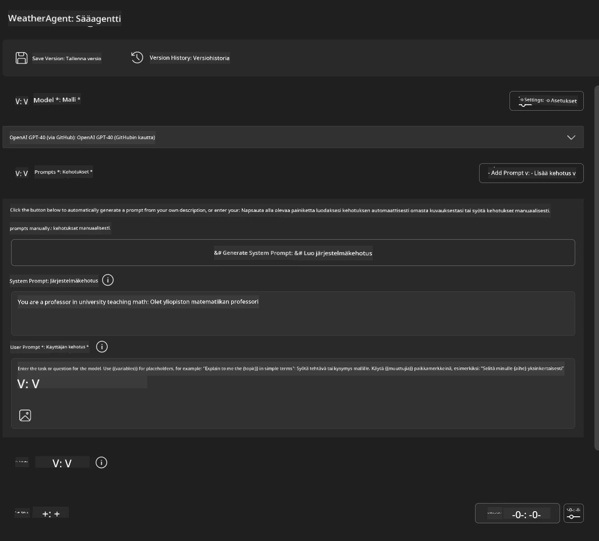
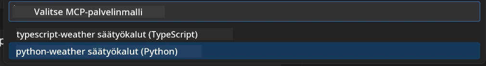
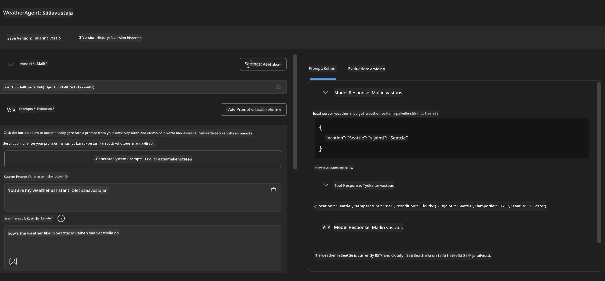
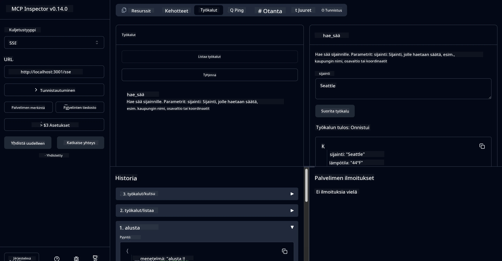

# 🔧 Moduuli 3: Edistynyt MCP-kehitys Microsoft Foundry Toolkitin avulla

> [!NOTE]
> Tässä harjoituksessa Inspectorin URL-osoitteet käyttävät perinteistä `/sse`-päätepistettä ja kohdistuvat lukittuihin MCP SDK:n `1.9.3` ja Inspectorin `0.14.0` riippuvuuksiin. Ne eivät ole nykyisiä `2026-07-28` Streamable HTTP -esimerkkejä.
> 
> 


## 🎯 Oppimistavoitteet

Tämän harjoituksen lopuksi osaat:

- ✅ Luoda räätälöityjä MCP-palvelimia Microsoft Foundry Toolkitin avulla
- ✅ Määrittää ja käyttää uusinta MCP Python SDK:ta (v1.9.3)
- ✅ Ottaa käyttöön ja hyödyntää MCP Inspectoria virheenkorjaukseen
- ✅ Virheenkorjata MCP-palvelimia sekä Agent Builder- että Inspector-ympäristöissä
- ✅ Ymmärtää edistyneitä MCP-palvelimen kehitystyönkulkuja

## 📋 Esivaatimukset

- Lab 2 (MCP Perusteet) suorittaminen
- VS Code Microsoft Foundry Toolkit -laajennuksella asennettuna
- Python 3.10+ -ympäristö
- Node.js ja npm Inspectorin käyttöönottoa varten

## 🏗️ Mitä rakennat

Tässä harjoituksessa luot **Sää-MCP-palvelimen**, joka demonstroi:
- Räätälöity MCP-palvelimen toteutus
- Integroinnin Microsoft Foundry Toolkit Agent Builderiin
- Ammattimaisia virheenkorjaustyönkulkuja
- Modernin MCP SDK:n käyttötapoja

---

## 🔧 Ydinkomponentit yleiskatsaus

### 🐍 MCP Python SDK
Model Context Protocol Python SDK muodostaa perustan räätälöityjen MCP-palvelimien rakentamiselle. Käytät versiota 1.9.3 parannetuilla virheenkorjausominaisuuksilla.

### 🔍 MCP Inspector
Tehokas virheenkorjaustyökalu, joka tarjoaa:
- Reaaliaikaisen palvelimen valvonnan
- Työkalujen suorituksen visualisoinnin
- Verkkopyyntöjen ja -vastauksien tarkastelun
- Interaktiivisen testausympäristön

---

## 📖 Vaiheittainen toteutus

### Vaihe 1: Luo WeatherAgent Agent Builderissä

1. **Käynnistä Agent Builder** VS Codessa Microsoft Foundry Toolkit -laajennuksen kautta
2. **Luo uusi agentti** seuraavilla asetuksilla:
   - Agentin nimi: `WeatherAgent`



### Vaihe 2: Alusta MCP-palvelinprojekti

1. **Navigoi Tools-valikossa** → **Add Tool** Agent Builderissä
2. **Valitse "MCP Server"** tarjotuista vaihtoehdoista
3. **Valitse "Create A new MCP Server"**
4. **Valitse `python-weather`-pohja**
5. **Nimeä palvelimesi:** `weather_mcp`



### Vaihe 3: Avaa ja tutki projektia

1. **Avaa luotu projekti** VS Codessa
2. **Tarkastele projektin rakennetta:**
   ```
   weather_mcp/
   ├── src/
   │   ├── __init__.py
   │   └── server.py
   ├── inspector/
   │   ├── package.json
   │   └── package-lock.json
   ├── .vscode/
   │   ├── launch.json
   │   └── tasks.json
   ├── pyproject.toml
   └── README.md
   ```

### Vaihe 4: Päivitä uusimpaan MCP SDK:hon

> **🔍 Miksi päivittää?** Haluamme hyödyntää uusinta MCP SDK:ta (v1.9.3) ja Inspector-palvelua (0.14.0) parempien ominaisuuksien ja virheenkorjausmahdollisuuksien vuoksi.

#### 4a. Päivitä Python-riippuvuudet

**Muokkaa `pyproject.toml`:** päivitä [./code/weather_mcp/pyproject.toml](../../../../10-StreamliningAIWorkflowsBuildingAnMCPServerWithAIToolkit/lab3/code/weather_mcp/pyproject.toml)


#### 4b. Päivitä Inspectorin konfiguraatio

**Muokkaa `inspector/package.json`:** päivitä [./code/weather_mcp/inspector/package.json](../../../../10-StreamliningAIWorkflowsBuildingAnMCPServerWithAIToolkit/lab3/code/weather_mcp/inspector/package.json)

#### 4c. Päivitä Inspectorin riippuvuudet

**Muokkaa `inspector/package-lock.json`:** päivitä [./code/weather_mcp/inspector/package-lock.json](../../../../10-StreamliningAIWorkflowsBuildingAnMCPServerWithAIToolkit/lab3/code/weather_mcp/inspector/package-lock.json)

> **📝 Huom:** Tämä tiedosto sisältää laajat riippuvuuksien määrittelyt. Alla on olennaisin rakenne - koko sisältö varmistaa riippuvuuksien oikean ratkaisun.


> **⚡ Koko package-lock:** Täysi package-lock.json sisältää ~3000 riviä riippuvuuksien määrittelyjä. Yllä näkyy päärakenne - käytä annettua tiedostoa täydelliseen riippuvuuksien ratkaisuun.

### Vaihe 5: Määritä VS Code -virheenkorjaus

*Huom: Kopioi määritetty tiedosto annettuun polkuun korvaamaan paikallinen tiedosto*

#### 5a. Päivitä käynnistyskonfiguraatio

**Muokkaa `.vscode/launch.json`:**

```json
{
  "version": "0.2.0",
  "configurations": [
    {
      "name": "Attach to Local MCP",
      "type": "debugpy",
      "request": "attach",
      "connect": {
        "host": "localhost",
        "port": 5678
      },
      "presentation": {
        "hidden": true
      },
      "internalConsoleOptions": "neverOpen",
      "postDebugTask": "Terminate All Tasks"
    },
    {
      "name": "Launch Inspector (Edge)",
      "type": "msedge",
      "request": "launch",
      "url": "http://localhost:6274?timeout=60000&serverUrl=http://localhost:3001/sse#tools",
      "cascadeTerminateToConfigurations": [
        "Attach to Local MCP"
      ],
      "presentation": {
        "hidden": true
      },
      "internalConsoleOptions": "neverOpen"
    },
    {
      "name": "Launch Inspector (Chrome)",
      "type": "chrome",
      "request": "launch",
      "url": "http://localhost:6274?timeout=60000&serverUrl=http://localhost:3001/sse#tools",
      "cascadeTerminateToConfigurations": [
        "Attach to Local MCP"
      ],
      "presentation": {
        "hidden": true
      },
      "internalConsoleOptions": "neverOpen"
    }
  ],
  "compounds": [
    {
      "name": "Debug in Agent Builder",
      "configurations": [
        "Attach to Local MCP"
      ],
      "preLaunchTask": "Open Agent Builder",
    },
    {
      "name": "Debug in Inspector (Edge)",
      "configurations": [
        "Launch Inspector (Edge)",
        "Attach to Local MCP"
      ],
      "preLaunchTask": "Start MCP Inspector",
      "stopAll": true
    },
    {
      "name": "Debug in Inspector (Chrome)",
      "configurations": [
        "Launch Inspector (Chrome)",
        "Attach to Local MCP"
      ],
      "preLaunchTask": "Start MCP Inspector",
      "stopAll": true
    }
  ]
}
```

**Muokkaa `.vscode/tasks.json`:**

```
{
  "version": "2.0.0",
  "tasks": [
    {
      "label": "Start MCP Server",
      "type": "shell",
      "command": "python -m debugpy --listen 127.0.0.1:5678 src/__init__.py sse",
      "isBackground": true,
      "options": {
        "cwd": "${workspaceFolder}",
        "env": {
          "PORT": "3001"
        }
      },
      "problemMatcher": {
        "pattern": [
          {
            "regexp": "^.*$",
            "file": 0,
            "location": 1,
            "message": 2
          }
        ],
        "background": {
          "activeOnStart": true,
          "beginsPattern": ".*",
          "endsPattern": "Application startup complete|running"
        }
      }
    },
    {
      "label": "Start MCP Inspector",
      "type": "shell",
      "command": "npm run dev:inspector",
      "isBackground": true,
      "options": {
        "cwd": "${workspaceFolder}/inspector",
        "env": {
          "CLIENT_PORT": "6274",
          "SERVER_PORT": "6277",
        }
      },
      "problemMatcher": {
        "pattern": [
          {
            "regexp": "^.*$",
            "file": 0,
            "location": 1,
            "message": 2
          }
        ],
        "background": {
          "activeOnStart": true,
          "beginsPattern": "Starting MCP inspector",
          "endsPattern": "Proxy server listening on port"
        }
      },
      "dependsOn": [
        "Start MCP Server"
      ]
    },
    {
      "label": "Open Agent Builder",
      "type": "shell",
      "command": "echo ${input:openAgentBuilder}",
      "presentation": {
        "reveal": "never"
      },
      "dependsOn": [
        "Start MCP Server"
      ],
    },
    {
      "label": "Terminate All Tasks",
      "command": "echo ${input:terminate}",
      "type": "shell",
      "problemMatcher": []
    }
  ],
  "inputs": [
    {
      "id": "openAgentBuilder",
      "type": "command",
      "command": "ai-mlstudio.agentBuilder",
      "args": {
        "initialMCPs": [ "local-server-weather_mcp" ],
        "triggeredFrom": "vsc-tasks"
      }
    },
    {
      "id": "terminate",
      "type": "command",
      "command": "workbench.action.tasks.terminate",
      "args": "terminateAll"
    }
  ]
}
```


---

## 🚀 MCP-palvelimen käynnistys ja testaus

### Vaihe 6: Asenna riippuvuudet

Konfiguraatiomuutosten jälkeen suorita seuraavat komennot:

**Asenna Python-riippuvuudet:**
```bash
uv sync
```

**Asenna Inspector-riippuvuudet:**
```bash
cd inspector
npm install
```

### Vaihe 7: Virheenkorjaus Agent Builderissa

1. **Paina F5** tai käytä **"Debug in Agent Builder"** -konfiguraatiota
2. **Valitse yhdistetty konfiguraatio** virheenkorjauspaneelista
3. **Odota palvelimen käynnistymistä** ja Agent Builderin avaamista
4. **Testaa sää-MCP-palvelintasi** luonnollisella kielellä tehdyillä kyselyillä

Syöttökehotteena esimerkiksi

SYSTEM_PROMPT

```
You are my weather assistant
```

USER_PROMPT

```
How's the weather like in Seattle
```



### Vaihe 8: Virheenkorjaus MCP Inspectorilla

1. **Käytä "Debug in Inspector"** -konfiguraatiota (Edge tai Chrome)
2. **Avaa Inspector-käyttöliittymä** osoitteessa `http://localhost:6274`
3. **Tutki interaktiivista testausympäristöä:**
   - Katso käytettävissä olevat työkalut
   - Testaa työkalujen suoritusta
   - Seuraa verkkopyyntöjä
   - Virheenkorjaa palvelinvastauksia



---

## 🎯 Keskeiset oppimistulokset

Tämän harjoituksen suorittamalla olet:

- [x] **Luonut räätälöidyn MCP-palvelimen** Microsoft Foundry Toolkit -pohjien avulla
- [x] **Päivittänyt uusimpaan MCP SDK:hon** (v1.9.3) parannetun toiminnallisuuden vuoksi
- [x] **Määrittänyt ammattimaiset virheenkorjaustyönkulut** sekä Agent Builderille että Inspectorille
- [x] **Ottanut MCP Inspectorin käyttöön** interaktiiviseen palvelimen testaukseen
- [x] **Hallinnut VS Code -virheenkorjausasetukset** MCP-kehitystä varten

## 🔧 Tutkitut edistyneet ominaisuudet

| Ominaisuus | Kuvaus | Käyttötapaus |
|---------|-------------|----------|
| **MCP Python SDK v1.9.3** | Uusin protokollatoteutus | Moderni palvelinkehitys |
| **MCP Inspector 0.14.0** | Interaktiivinen virheenkorjaustyökalu | Reaaliaikainen palvelimen testaus |
| **VS Code Debugging** | Integroitu kehitysympäristö | Ammattimainen virheenkorjaustyönkulku |
| **Agent Builder -integraatio** | Suora yhteys Microsoft Foundry Toolkitiin | Agentin kokonaisvaltainen testaus |

## 📚 Lisäresurssit

- [MCP Python SDK Dokumentaatio](https://modelcontextprotocol.io/docs/sdk/python)
- [Microsoft Foundry Toolkit Laajennusopas](https://code.visualstudio.com/docs/ai/ai-toolkit)
- [VS Code Virheenkorjauksen dokumentaatio](https://code.visualstudio.com/docs/editor/debugging)
- [Model Context Protocol Määrittely](https://modelcontextprotocol.io/docs/concepts/architecture)

---

**🎉 Onnittelut!** Olet suorittanut moduulin 3 ja osaat nyt luoda, virheenkorjata ja ottaa käyttöön räätälöityjä MCP-palvelimia ammattimaisten kehitystyönkulkujen mukaisesti.

### 🔜 Jatka seuraavaan moduuliin

Valmis soveltamaan MCP-taitojasi todellisen kehitystyönkulun parissa? Jatka **[Moduuliin 4: Käytännön MCP-kehitys - Räätälöity GitHub-klonauspalvelin](../lab4/README.md)**, jossa:
- Rakennat tuotantovalmiin MCP-palvelimen, joka automatisoi GitHub-repositorion toiminnot
- Toteutat GitHub-repositorion kloonaustoiminnallisuuden MCP:n kautta
- Integroi räätälöidyt MCP-palvelimet VS Codeen ja GitHub Copilot Agent Modeen
- Testaa ja ota käyttöön räätälöityjä MCP-palvelimia tuotantoympäristöissä
- Opit käytännön työnkulkujen automatisointia kehittäjille

---

<!-- CO-OP TRANSLATOR DISCLAIMER START -->
**Vastuuvapauslauseke**:
Tämä asiakirja on käännetty käyttämällä tekoälypohjaista käännöspalvelua [Co-op Translator](https://github.com/Azure/co-op-translator). Vaikka pyrimme tarkkuuteen, otathan huomioon, että automaattiset käännökset saattavat sisältää virheitä tai epätarkkuuksia. Alkuperäinen asiakirja sen alkuperäiskielellä on virallinen lähde. Tärkeissä asioissa suositellaan ammattimaista ihmiskäännöstä. Emme ole vastuussa tämän käännöksen käytöstä aiheutuvista väärinymmärryksistä tai tulkinnoista.
<!-- CO-OP TRANSLATOR DISCLAIMER END -->