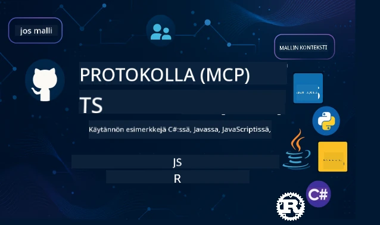

 

[](https://GitHub.com/microsoft/mcp-for-beginners/graphs/contributors)
[](https://GitHub.com/microsoft/mcp-for-beginners/issues)
[](https://GitHub.com/microsoft/mcp-for-beginners/pulls)
[](http://makeapullrequest.com)

[](https://GitHub.com/microsoft/mcp-for-beginners/watchers)
[](https://GitHub.com/microsoft/mcp-for-beginners/fork)
[](https://GitHub.com/microsoft/mcp-for-beginners/stargazers)


[](https://discord.gg/nTYy5BXMWG)

Seuraa näitä vaiheita aloittaaksesi näiden resurssien käytön:
1. **Haarauta varasto**: Klikkaa [](https://GitHub.com/microsoft/mcp-for-beginners/fork)
2. **Kloonaa varasto**:   `git clone https://github.com/microsoft/mcp-for-beginners.git`
3. **Liity mukaan** [](https://discord.gg/nTYy5BXMWG)


### 🌐 Monikielinen tuki

#### Tuettu GitHub Actionin kautta (Automaattinen & aina ajan tasalla)

<!-- CO-OP TRANSLATOR LANGUAGES TABLE START -->
[Arabia](../ar/README.md) | [Bengali](../bn/README.md) | [Bulgaria](../bg/README.md) | [Burma (Myanmar)](../my/README.md) | [Kiina (yksinkertaistettu)](../zh-CN/README.md) | [Kiina (perinteinen, Hongkong)](../zh-HK/README.md) | [Kiina (perinteinen, Macao)](../zh-MO/README.md) | [Kiina (perinteinen, Taiwan)](../zh-TW/README.md) | [Kroatia](../hr/README.md) | [Tšekki](../cs/README.md) | [Tanska](../da/README.md) | [Hollanti](../nl/README.md) | [Viro](../et/README.md) | [Suomi](./README.md) | [Ranska](../fr/README.md) | [Saksa](../de/README.md) | [Kreikka](../el/README.md) | [Heprea](../he/README.md) | [Hindi](../hi/README.md) | [Unkari](../hu/README.md) | [Indonesia](../id/README.md) | [Italia](../it/README.md) | [Japani](../ja/README.md) | [Kannada](../kn/README.md) | [Korea](../ko/README.md) | [Liettua](../lt/README.md) | [Malaiji](../ms/README.md) | [Malayalam](../ml/README.md) | [Marathi](../mr/README.md) | [Nepali](../ne/README.md) | [Nigerian Pidgin](../pcm/README.md) | [Norja](../no/README.md) | [Persia (Farsi)](../fa/README.md) | [Puola](../pl/README.md) | [Portugali (Brasilia)](../pt-BR/README.md) | [Portugali (Portugali)](../pt-PT/README.md) | [Punjabi (Gurmukhi)](../pa/README.md) | [Romania](../ro/README.md) | [Venäjä](../ru/README.md) | [Serbia (kyrillinen)](../sr/README.md) | [Slovakki](../sk/README.md) | [Sloveeni](../sl/README.md) | [Espanja](../es/README.md) | [Swahili](../sw/README.md) | [Ruotsi](../sv/README.md) | [Tagalog (Filipino)](../tl/README.md) | [Tamili](../ta/README.md) | [Telugu](../te/README.md) | [Thai](../th/README.md) | [Turkki](../tr/README.md) | [Ukraina](../uk/README.md) | [Urdu](../ur/README.md) | [Vietnam](../vi/README.md)

> **Haluatko mieluummin kloonata paikallisesti?**

> Tämä varasto sisältää yli 50 kieliversiota, mikä lisää merkittävästi ladattavan koon. Kloonaa ilman käännöksiä käyttämällä sparse checkout -toimintoa:
> ```bash
> git clone --filter=blob:none --sparse https://github.com/microsoft/mcp-for-beginners.git
> cd mcp-for-beginners
> git sparse-checkout set --no-cone '/*' '!translations' '!translated_images'
> ```
> Näin saat kaiken tarvittavan kurssin suorittamiseen paljon nopeammalla latausajalla.
<!-- CO-OP TRANSLATOR LANGUAGES TABLE END -->

# 🚀 Model Context Protocol (MCP) -oppimateriaali aloittelijoille

## **Opiskele MCP: tä käytännön koodiesimerkkien avulla C#:llä, Javalla, JavaScriptilä, Rustilla, Pythonilla ja TypeScriptillä**

## 🧠 Yleiskatsaus Model Context Protocol -oppimateriaaliin
Tervetuloa matkallesi Model Context Protocolin maailmaan! Jos olet koskaan miettinyt, miten tekoälysovellukset kommunikoivat erilaisten työkalujen ja palveluiden kanssa, olet kohta löytämässä elegantin ratkaisun, joka muuttaa tapaa, jolla kehittäjät rakentavat älykkäitä järjestelmiä.

Ajattele MCP:tä universaalina kääntäjänä tekoälysovelluksille – aivan kuten USB-portit mahdollistavat minkä tahansa laitteen liittämisen tietokoneeseesi, MCP antaa tekoälymalleille mahdollisuuden yhdistää minkä tahansa työkalun tai palvelun standardoidulla tavalla. Rakennatpa sitten ensimmäistä chatbotiasi tai työskentelet monimutkaisissa tekoälytyönkuluissa, MCP:n ymmärtäminen antaa sinulle voimaa luoda kykenevämpiä ja joustavampia sovelluksia.

Tämä oppimateriaali on suunniteltu kärsivällisesti ja huolellisesti oppimisprosessiasi ajatellen. Aloitamme yksinkertaisilla käsitteillä, jotka tunnet jo, ja rakennamme asiantuntijuuttasi vaihe vaiheelta käytännön harjoitusten avulla suosikkiohjelmointikielessäsi. Jokainen vaihe sisältää selkeitä selityksiä, käytännön esimerkkejä ja runsaasti kannustusta matkan varrella.

Kun saavutat tämän matkan loppuun, sinulla on itsevarmuutta rakentaa omia MCP-palvelimia, integroida ne suosittuihin tekoälyalustoihin ja ymmärtää, miten tämä teknologia muovaa tekoälyn kehityksen tulevaisuutta. Aloitetaan tämä jännittävä seikkailu yhdessä!

### Viralliset dokumentaatiot ja spesifikaatiot

Nämä resurssit ovat entistä arvokkaampia ymmärryksesi kasvaessa, mutta älä tunne painetta lukea kaikkea heti. Aloita niistä osa-alueista, jotka kiinnostavat sinua eniten!
- 📘 [MCP-dokumentaatio](https://modelcontextprotocol.io/) – Tämä on ensisijainen resurssisi askel askeleelta -opetusohjelmiin ja käyttäjän oppaisiin. Dokumentaatio on kirjoitettu aloittelijat mielessä, tarjoamalla selkeitä esimerkkejä, joita voit seurata omaan tahtiisi.
- 📜 [MCP-spesifikaatio](https://modelcontextprotocol.io/docs/) – Ajattele tätä kattavana viitemanuaalina. Kun työskentelet oppimateriaalin läpi, tulet palaamaan tänne etsimään tiettyjä yksityiskohtia ja tutkimaan edistyneitä ominaisuuksia.
- 📜 [Alkuperäinen MCP-spesifikaatio](https://modelcontextprotocol.io/specification/versioning) – Tämä sisältää lisäteknisiä yksityiskohtia, jotka voivat olla hyödyllisiä kehittyneissä toteutuksissa. Se on saatavilla tarvittaessa, mutta älä stressaa siitä aloittaessasi.
- 🧑‍💻 [MCP GitHub-varasto](https://github.com/modelcontextprotocol) – Täältä löydät SDK:t, työkalut ja koodiesimerkkejä useilla ohjelmointikielillä. Se on kuin aarrearkku käytännön esimerkkejä ja valmiita komponentteja.
- 🌐 [MCP-yhteisö](https://github.com/orgs/modelcontextprotocol/discussions) – Liity mukaan oppijoiden ja kokeneiden kehittäjien keskusteluihin MCP:stä. Se on kannustava yhteisö, jossa kysymyksiä saa esittää ja tietoa jaetaan vapaasti.
  
## Oppimistavoitteet

Tämän oppimateriaalin lopussa tunnet olosi itsevarmaksi ja innostuneeksi uusista taidoistasi. Tässä mitä saavutat:

• **Ymmärrä MCP:n perusteet**: Ymmärrät, mitä Model Context Protocol on ja miksi se mullistaa tekoälysovellusten yhteistyön, käyttämällä ymmärrettäviä vertauskuvia ja esimerkkejä.

• **Rakenna ensimmäinen MCP-palvelimesi**: Luot toimivan MCP-palvelimen valitsemallasi ohjelmointikielellä, aloittaen yksinkertaisista esimerkeistä ja laajentaen taitojasi askel askeleelta.

• **Yhdistä tekoälymalleja aitoihin työkaluihin**: Opit miten yhdistää tekoälymallit todellisiin palveluihin, antaen sovelluksillesi tehokkaita uusia kykyjä.

• **Ota käyttöön turvallisen toteutuksen parhaat käytännöt**: Ymmärrät, miten pitää MCP-toteutuksesi turvallisena ja suojata sekä sovelluksiasi että käyttäjiäsi.

• **Ota käyttöön luottavaisin mielin**: Tiedät, miten siirtää MCP-projektisi kehityksestä tuotantoon käytännöllisten, toimivien käyttöönottojen avulla.

• **Liity MCP-yhteisöön**: Tulet osaksi kasvavaa kehittäjäyhteisöä, joka muovaa tekoälysovelluskehityksen tulevaisuutta. 

## Välttämätön taustatieto

Ennen kuin sukellamme MCP:n erityispiirteisiin, varmistetaan, että tunnet olosi mukavaksi joidenkin perusteiden kanssa. Älä huoli, vaikka et olisi asiantuntija näissä aiheissa – selitämme kaiken tarvittavan matkan varrella!

### Ymmärrä protokollat (Perusta)

Ajattele protokollaa kuin sääntöinä keskustelulle. Kun soitat ystävällesi, tiedätte molemmat sanoa "hei" vastatessanne, puhua vuorotellen ja sanoa "hei hei" lopuksi. Tietokoneohjelmien täytyy noudattaa samankaltaisia sääntöjä kommunikoidakseen tehokkaasti.

MCP on protokolla – sovittu sääntökokoelma, joka auttaa tekoälymalleja ja sovelluksia käymään tuottavia "keskusteluja" työkalujen ja palveluiden kanssa. Aivan kuten keskustelusäännöt tekevät ihmisten viestinnästä sujuvampaa, MCP tekee tekoälysovellusten kommunikoinnista luotettavampaa ja tehokkaampaa.

### Asiakas-palvelin -suhteet (Miten ohjelmat toimivat yhdessä)

Käytät asiakas-palvelin -suhteita joka päivä! Kun käytät verkkoselainta (asiakas) vieraillaksesi verkkosivulla, yhdistyt verkkopalvelimeen, joka lähettää sinulle sivun sisällön. Selain osaa pyytää tietoa, ja palvelin osaa vastata.

MCP:ssä meillä on samanlainen suhde: tekoälymallit toimivat asiakkaina, jotka pyytävät tietoa tai toimintoja, kun taas MCP-palvelimet tarjoavat näitä kykyjä. Se on kuin avulias avustaja (palvelin), johon tekoäly voi pyytää tehtävien suorittamista.

### Miksi standardisointi on tärkeää (Yhteensopivuuden varmistaminen)

Kuvittele, jos jokainen autonvalmistaja käyttäisi eri muotoisia bensapumppuja – tarvitset erilaisen adapterin jokaiselle autolle! Standardisointi tarkoittaa yhteisistä sopimuksista kiinnipitämistä, jotta asiat toimivat saumattomasti yhdessä.

MCP tarjoaa tämän standardisoinnin tekoälysovelluksille. Sen sijaan, että jokainen tekoälymalli tarvitsee räätälöityä koodia toimimaan joka työkalun kanssa, MCP luo yleismaailmallisen tavan kommunikoida. Tämä tarkoittaa, että kehittäjät voivat rakentaa työkaluja kerran ja saada ne toimimaan monien eri tekoälyjärjestelmien kanssa.

## 🧭 Oppimispolkusi yleiskatsaus

MCP-matkasi on huolellisesti jäsennelty rakentamaan itsevarmuuttasi ja taitojasi asteittain. Jokainen vaihe esittelee uusia käsitteitä samalla kun vahvistaa jo opittua.

### 🌱 Perusvaihe: Perusteiden ymmärtäminen (Moduulit 0–2)

Täällä seikkailusi alkaa! Esittelemme MCP-käsitteitä tutuilla vertauskuvilla ja yksinkertaisilla esimerkeillä. Ymmärrät, mitä MCP on, miksi se on olemassa ja miten se sopii laajempaan tekoälyn kehityksen maailmaan.

• **Moduuli 0 – Johdanto MCP:hen**: Alamme tutkimalla, mitä MCP on ja miksi se on niin tärkeä nykyaikaisille tekoälysovelluksille. Näet MCP:n toiminnan todellisissa esimerkeissä ja ymmärrät, miten se ratkaisee kehittäjien yleisiä ongelmia.

• **Moduuli 1 – Peruskäsitteiden selitys**: Tässä opit MCP:n olennaiset rakennuspalikat. Käytämme runsaasti vertauskuvia ja visuaalisia esimerkkejä varmistaaksemme, että käsitteet tuntuvat luonnollisilta ja ymmärrettäviltä.

• **Moduuli 2 – Turvallisuus MCP:ssä**: Turvallisuus saattaa kuulostaa pelottavalta, mutta näytämme, kuinka MCP sisältää sisäänrakennettuja turvaominaisuuksia ja opetamme sinulle parhaat käytännöt, jotka suojaavat sovelluksiasi alusta alkaen.

### 🔨 Rakennusvaihe: Ensimmäisten toteutusten luominen (Moduuli 3)

Nyt alkaa todellinen hauskuus! Saat käytännön kokemusta varsinaisten MCP-palvelimien ja -asiakkaiden rakentamisesta. Älä huoli – aloitetaan yksinkertaisesta ja opastamme sinua joka vaiheessa.

Tämä moduuli sisältää useita käytännön oppaita, joiden avulla voit harjoitella valitsemallasi ohjelmointikielellä. Luot ensimmäisen palvelimesi, rakennat asiakkaan yhdistymään siihen, ja jopa integroituu suosittuihin kehitystyökaluihin kuten VS Code.
Jokainen opas sisältää täydellisiä koodiesimerkkejä, vianmääritysvinkkejä ja selityksiä siitä, miksi teemme tietyt suunnitteluratkaisut. Tämän vaiheen lopussa sinulla on toimivia MCP-toteutuksia, joista voit olla ylpeä!

### 🚀 Kasvuvaihe: Edistyneet konseptit ja käytännön sovellukset (Moduulit 4-5)

Perusteet hallittuasi olet valmis tutkimaan kehittyneempiä MCP-ominaisuuksia. Käsittelemme käytännön toteutusstrategioita, virheenkorjaustekniikoita ja edistyneitä aiheita, kuten multimodaalista tekoälyintegraatiota.

Opit myös skaalamaan MCP-toteutuksiasi tuotantokäyttöön ja integroimaan ne pilvialustoihin, kuten Azureen. Nämä moduulit valmistavat sinut rakentamaan MCP-ratkaisuja, jotka kestävät todellisia vaatimuksia.

### 🌟 Hallintavaihe: Yhteisö ja erikoistuminen (Moduulit 6-11)

Viimeinen vaihe keskittyy liittymiseen MCP-yhteisöön ja erikoistumiseen sinua eniten kiinnostaviin alueisiin. Opit osallistumaan avoimen lähdekoodin MCP-projekteihin, toteuttamaan edistyneitä autentikointimalleja ja rakentamaan kokonaisvaltaisia tietokantaintegroituja ratkaisuja.

Moduuli 11 ansaitsee erityismaininnan – se on täysi 13-luokan käytännön oppimispolku, jossa opetellaan rakentamaan tuotantovalmiita MCP-palvelimia PostgreSQL-integraatiolla. Se on kuin päättötyöprojekti, joka kokoaa yhteen kaiken oppimasi!

### 📚 Koko opetussuunnitelman rakenne

| Moduuli | Aihe | Kuvaus | Linkki |
|--------|-------|-------------|------|
| **Moduulit 1-3: Perusteet** | | | |
| 00 | Johdatus MCP:hen | Yleiskuva Model Context Protocolista ja sen merkityksestä tekoälyputkissa | [Lue lisää](./00-Introduction/README.md) |
| 01 | Keskeiset käsitteet | Syvällinen tarkastelu MCP:n ydinperiaatteisiin | [Lue lisää](./01-CoreConcepts/README.md) |
| 02 | Turvallisuus MCP:ssä | Turvauhat ja parhaat käytännöt | [Lue lisää](./02-Security/README.md) |
| 03 | MCP:n käytön aloitus | Ympäristön valmistelu, peruspalvelimet/asiakkaat, integraatio | [Lue lisää](./03-GettingStarted/README.md) |
| **Moduuli 3: Ensimmäisen palvelimen ja asiakkaan rakentaminen** | | | |
| 3.1 | Ensimmäinen palvelin | Luo ensimmäinen MCP-palvelimesi | [Opas](./03-GettingStarted/01-first-server/README.md) |
| 3.2 | Ensimmäinen asiakas | Kehitä perus MCP-asiakas | [Opas](./03-GettingStarted/02-client/README.md) |
| 3.3 | Asiakas LLM:llä | Integroi suuret kielimallit | [Opas](./03-GettingStarted/03-llm-client/README.md) |
| 3.4 | VS Code -integraatio | Kuluta MCP-palvelimia VS Codessa | [Opas](./03-GettingStarted/04-vscode/README.md) |
| 3.5 | stdio-palvelin | Luo palvelimet stdio-siirron avulla | [Opas](./03-GettingStarted/05-stdio-server/README.md) |
| 3.6 | HTTP-suoratoisto | Toteuta HTTP-suoratoisto MCP:ssä | [Opas](./03-GettingStarted/06-http-streaming/README.md) |
| 3.7 | AI-työkalupakki | Käytä AI-työkalupakkia MCP:n kanssa | [Opas](./03-GettingStarted/07-aitk/README.md) |
| 3.8 | Testaus | Testaa MCP-palvelintoteutustasi | [Opas](./03-GettingStarted/08-testing/README.md) |
| 3.9 | Käyttöönotto | Ota MCP-palvelimet tuotantoon | [Opas](./03-GettingStarted/09-deployment/README.md) |
| 3.10 | Edistynyt palvelimen käyttö | Käytä edistyneitä palvelimia kehittyneempiin ominaisuuksiin ja parannettuun arkkitehtuuriin | [Opas](./03-GettingStarted/10-advanced/README.md) |
| 3.11 | Yksinkertainen autentikointi | Luku, joka näyttää autentikoinnin alusta alkaen ja RBAC:n | [Opas](./03-GettingStarted/11-simple-auth/README.md) |
| **Moduulit 4-5: Käytännön ja edistynyt** | | | |
| 04 | Käytännön toteutus | SDK:t, virheenkorjaus, testaus, uudelleenkäytettävät kehotemallit | [Lue lisää](./04-PracticalImplementation/README.md) |
| 05 | Edistyneet MCP-aiheet | Multimodaalinen tekoäly, skaalaus, yrityskäyttö | [Lue lisää](./05-AdvancedTopics/README.md) |
| 5.1 | Azure-integraatio | MCP-integraatio Azuren kanssa | [Opas](./05-AdvancedTopics/mcp-integration/README.md) |
| 5.2 | Multimodaalisuus | Työskentely useiden modaliteettien kanssa | [Opas](./05-AdvancedTopics/mcp-multi-modality/README.md) |
| 5.3 | OAuth2-esittely | OAuth2-autentikoinnin toteutus | [Opas](./05-AdvancedTopics/mcp-oauth2-demo/README.md) |
| 5.4 | Juuri-kontekstit | Ymmärrä ja toteuta juuri-kontekstit | [Opas](./05-AdvancedTopics/mcp-root-contexts/README.md) |
| 5.5 | Reititys | MCP:n reititystrategiat | [Opas](./05-AdvancedTopics/mcp-routing/README.md) |
| 5.6 | Näytteistys | Näytteistystekniikat MCP:ssä | [Opas](./05-AdvancedTopics/mcp-sampling/README.md) |
| 5.7 | Skaalaus | Skaalaa MCP-toteutuksia | [Opas](./05-AdvancedTopics/mcp-scaling/README.md) |
| 5.8 | Turvallisuus | Edistyneet turvallisuusnäkökulmat | [Opas](./05-AdvancedTopics/mcp-security/README.md) |
| 5.9 | Verkkohaku | Verkkohakuominaisuuksien toteutus | [Opas](./05-AdvancedTopics/web-search-mcp/README.md) |
| 5.10 | Reaaliaikainen suoratoisto | Rakennetaan reaaliaikaisen suoratoiston toiminnallisuus | [Opas](./05-AdvancedTopics/mcp-realtimestreaming/README.md) |
| 5.11 | Reaaliaikainen haku | Toteuta reaaliaikainen haku | [Opas](./05-AdvancedTopics/mcp-realtimesearch/README.md) |
| 5.12 | Entra ID -autentikointi | Autentikointi Microsoft Entra ID:n kanssa | [Opas](./05-AdvancedTopics/mcp-security-entra/README.md) |
| 5.13 | Foundry-integraatio | Integrointi Azure AI Foundryn kanssa | [Opas](./05-AdvancedTopics/mcp-foundry-agent-integration/README.md) |
| 5.14 | Konteksti-insinööritaito | Tekniikoita tehokkaaseen kontekstisuunnitteluun | [Opas](./05-AdvancedTopics/mcp-contextengineering/README.md) |
| 5.15 | MCP:n mukautettu siirto | Mukautettujen siirtoratkaisujen toteutukset | [Opas](./05-AdvancedTopics/mcp-transport/README.md) |
| **Moduulit 6-10: Yhteisö ja parhaat käytännöt** | | | |
| 06 | Yhteisön panostukset | Kuinka osallistua MCP-ekosysteemiin | [Opas](./06-CommunityContributions/README.md) |
| 07 | Oppeja varhaisesta käyttöönotosta | Käytännön toteutustarinoita | [Opas](./07-LessonsFromEarlyAdoption/README.md) |
| 08 | MCP:n parhaat käytännöt | Suorituskyky, vikasietoisuus, kestävyys | [Opas](./08-BestPractices/README.md) |
| 09 | MCP- tapaustutkimukset | Käytännön toteutusesimerkit | [Opas](./09-CaseStudy/README.md) |
| 10 | Käytännön työpaja | MCP-palvelimen rakentaminen AI-työkalupakin kanssa | [Lab](./10-StreamliningAIWorkflowsBuildingAnMCPServerWithAIToolkit/README.md) |
| **Moduuli 11: MCP-palvelin käytännössä** | | | |
| 11 | MCP-palvelimen tietokantaintegraatio | Kattava 13-luokan käytännön oppimispolku PostgreSQL-integraatioon | [Labit](./11-MCPServerHandsOnLabs/README.md) |
| 11.1 | Johdanto | Yleiskatsaus MCP:hen tietokantaintegraatiolla ja vähittäiskaupan analytiikkatapauksella | [Lab 00](./11-MCPServerHandsOnLabs/00-Introduction/README.md) |
| 11.2 | Ydinarkkitehtuuri | MCP-palvelinarkkitehtuurin, tietokantakerrosten ja turvallisuusmallien ymmärtäminen | [Lab 01](./11-MCPServerHandsOnLabs/01-Architecture/README.md) |
| 11.3 | Turvallisuus ja monivuokraus | Rivitasoturvallisuus, autentikointi ja monivuokralaisten datan käyttöoikeudet | [Lab 02](./11-MCPServerHandsOnLabs/02-Security/README.md) |
| 11.4 | Ympäristön valmistelu | Kehitysympäristön, Dockerin ja Azure-resurssien valmistelu | [Lab 03](./11-MCPServerHandsOnLabs/03-Setup/README.md) |
| 11.5 | Tietokantasunnittelu | PostgreSQL-asennus, vähittäiskaupan skeeman suunnittelu ja esimerkkidata | [Lab 04](./11-MCPServerHandsOnLabs/04-Database/README.md) |
| 11.6 | MCP-palvelimen toteutus | FastMCP-palvelimen rakentaminen tietokantaintegraatiolla | [Lab 05](./11-MCPServerHandsOnLabs/05-MCP-Server/README.md) |
| 11.7 | Työkalujen kehitys | Tietokantakyselytyökalujen ja skeemojen introspektio | [Lab 06](./11-MCPServerHandsOnLabs/06-Tools/README.md) |
| 11.8 | Semanttinen haku | Vektoripohjaisten upotusten toteutus Azure OpenAI:n ja pgvectorin avulla | [Lab 07](./11-MCPServerHandsOnLabs/07-Semantic-Search/README.md) |
| 11.9 | Testaus ja virheenkorjaus | Testausstrategiat, virheenkorjaustyökalut ja validointimenetelmät | [Lab 08](./11-MCPServerHandsOnLabs/08-Testing/README.md) |
| 11.10 | VS Code -integraatio | VS Code MCP -integraation ja AI-chatin käyttöönotto | [Lab 09](./11-MCPServerHandsOnLabs/09-VS-Code/README.md) |
| 11.11 | Käyttöönotto-strategiat | Docker-käyttöönotto, Azure Container Apps ja skaalausnäkökohdat | [Lab 10](./11-MCPServerHandsOnLabs/10-Deployment/README.md) |
| 11.12 | Monitorointi | Sovelluksen Insights, lokitus, suorituskyvyn seuranta | [Lab 11](./11-MCPServerHandsOnLabs/11-Monitoring/README.md) |
| 11.13 | Parhaat käytännöt | Suorituskyvyn optimointi, turvallisuuden vahvistaminen ja tuotantovinkit | [Lab 12](./11-MCPServerHandsOnLabs/12-Best-Practices/README.md) |

### 💻 Koodiesimerkkiprojektit

Yksi MCP:n oppimisen jännittävimmistä osista on nähdä koodaintaitojen kehittyminen vaiheittain. Olemme suunnitelleet koodiesimerkkimme alkamaan yksinkertaisista ja kehittyvän, kun ymmärryksesi syvenee. Näin esittelemme käsitteitä – koodin, joka on helppo ymmärtää, mutta joka havainnollistaa todellisia MCP-periaatteita; ymmärrät siis paitsi mitä tämä koodi tekee, myös miksi se on järjestetty näin ja miten se sopii laajempiin MCP-sovelluksiin.

#### Perus MCP-laskinmallit

| Kieli | Kuvaus | Linkki |
|----------|-------------|------|
| C# | MCP-palvelin esimerkki | [Näytä koodi](./03-GettingStarted/samples/csharp/README.md) |
| Java | MCP-laskin | [Näytä koodi](./03-GettingStarted/samples/java/calculator/README.md) |
| JavaScript | MCP-demo | [Näytä koodi](./03-GettingStarted/samples/javascript/README.md) |
| Python | MCP-palvelin | [Näytä koodi](../../03-GettingStarted/samples/python/mcp_calculator_server.py) |
| TypeScript | MCP-esimerkki | [Näytä koodi](./03-GettingStarted/samples/typescript/README.md) |
| Rust | MCP-esimerkki | [Näytä koodi](./03-GettingStarted/samples/rust/README.md) |

#### Edistyneet MCP-toteutukset

| Kieli | Kuvaus | Linkki |
|----------|-------------|------|
| C# | Edistynyt malli | [Näytä koodi](./04-PracticalImplementation/samples/csharp/README.md) |
| Java Springillä | Container-sovellus esimerkki | [Näytä koodi](./04-PracticalImplementation/samples/java/containerapp/README.md) |
| JavaScript | Edistynyt malli | [Näytä koodi](./04-PracticalImplementation/samples/javascript/README.md) |
| Python | Monimutkainen toteutus | [Näytä koodi](../../04-PracticalImplementation/samples/python/READMEmd) |
| TypeScript | Container-malli | [Näytä koodi](./04-PracticalImplementation/samples/typescript/README.md) |


## 🎯 MCP:n oppimisen edellytykset

Jotta saat tästä opetussuunnitelmasta parhaan hyödyn, sinulla tulisi olla:

- Perustiedot ohjelmoinnista ainakin yhdessä seuraavista kielistä: C#, Java, JavaScript, Python tai TypeScript
- Ymmärrys asiakas-palvelin-mallista ja API:sta
- Tuntemus REST- ja HTTP-käsitteistä
- (Valinnainen) Tausta tekoäly- ja koneoppimiskäsitteissä

- Osallistuminen yhteisömme keskusteluihin tukea varten

## 📚 Opas ja resurssit

Tämä arkisto sisältää useita resursseja, jotka auttavat sinua navigoimaan ja oppimaan tehokkaasti:

### Opas

Laaja [Opas](./study_guide.md) auttaa sinua liikkumaan tässä arkistossa tehokkaasti. Tämä visuaalinen opetussuunnitelmakartta näyttää, miten kaikki aiheet liittyvät toisiinsa ja tarjoaa ohjeita näytteenprojektien tehokkaaseen käyttöön. Se on erityisen hyödyllinen visuaalisille oppijoille, jotka haluavat nähdä kokonaisuuden.

Opas sisältää:
- Visuaalinen opetussuunnitelmakartta kaikista käsitellyistä aiheista
- Yksityiskohtaisen jaon jokaisesta arkiston osasta
- Ohjeet näytteenprojektien käyttöön
- Suositellut oppimispolut eri taitotasoille
- Lisäresursseja oppimismatkasi tueksi

### Muutokset

Pidämme yllä yksityiskohtaista [Muutokset](./changelog.md) -dokumenttia, joka seuraa kaikkia merkittäviä päivityksiä opetussuunnitelmamateriaaleihin, jotta pysyt ajan tasalla uusimmista parannuksista ja lisäyksistä.
- Uudet sisältölisäykset
- Rakenteelliset muutokset
- Ominaisuusparannukset
- Dokumentaatiopäivitykset

## 🛠️ Kuinka käyttää tätä opetussuunnitelmaa tehokkaasti

Jokainen tämän oppaan oppitunti sisältää:
1. Selkeät selitykset MCP-konsepteista  
2. Live-koodiesimerkkejä useilla kielillä  
3. Harjoituksia oikeiden MCP-sovellusten rakentamiseksi  
4. Lisäresursseja edistyneille oppijoille

## Tilattava sisältö

### [MCP Dev Days heinäkuu 2025](https://developer.microsoft.com/en-us/reactor/series/S-1563/)
#### [➡️Katso tilattuna - MCP Dev Days](https://developer.microsoft.com/en-us/reactor/series/S-1563/)
Valmistaudu kahteen päivään syvällistä teknistä tietoa, yhteisön kohtaamisia ja käytännön oppimista MCP Dev Days -virtuaalitapahtumassa, joka on omistettu Model Context Protocolille (MCP) — nousevalle standardille, joka yhdistää tekoälymallit ja niitä tukevat työkalut.
Voit katsoa MCP Dev Days -tapahtumaa rekisteröitymällä tapahtumasivullamme: https://aka.ms/mcpdevdays.

#### [Päivä 1: MCP-tuottavuus, DevTools ja yhteisö:](https://developer.microsoft.com/en-us/reactor/series/S-1563/)

Keskittyy kehittäjien valtuuttamiseen käyttämään MCP:tä kehittäjätyövirtaansa ja upean MCP-yhteisön juhlistamiseen. Yhdistymme yhteisön jäsenten ja kumppaneiden, kuten Arcaden, Blockin, Oktan ja Neonin, kanssa nähdäksesi, miten he tekevät yhteistyötä Microsoftin kanssa rakentaakseen avointa, laajennettavaa MCP-ekosysteemiä. Todellisia demoja VS Codessa, Visual Studiossa, GitHub Copilotissa ja suosituissa yhteisötyökaluissa
Käytännönläheisiä, kontekstiin perustuvia kehitystyövirtoja
Yhteisön johtamia istuntoja ja oivalluksia
Olitpa vasta aloittamassa MCP:n kanssa tai jo rakentamassa sillä, Päivä 1 tarjoaa inspiraatiota ja käytännön oppeja.

#### [Päivä 2: Rakenna MCP-palvelimia luottavaisin mielin](https://developer.microsoft.com/en-us/reactor/series/S-1563/)

On tarkoitettu MCP-rakentajille. Käymme syvällisesti läpi toteutusstrategioita ja parhaita käytäntöjä MCP-palvelimien luomiseen ja MCP:n integroimiseen tekoälytyövirtaasi.

#### Aiheet sisältävät:

- MCP-palvelimien rakentamisen ja integroimisen agenttikokemuksiin  
- Kehityksen ohjaaminen kehotteilla  
- Turvallisuuden parhaat käytännöt  
- Rakennuspalikoiden kuten Functions, ACA ja API Management käyttö  
- Rekisterin yhdenmukaisuus ja työkalut (1P + 3P)  

Jos olet kehittäjä, työkalujen rakentaja tai tekoälytuotestrategi, tämä päivä on täynnä näkemyksiä, joita tarvitset skaalautuvien, turvallisten ja tulevaisuuden tarpeisiin sopivien MCP-ratkaisujen rakentamiseen.

### MCP Boot Camp elokuu 2025
Opiskele intensiivisissä videosessioissa MCP-palvelinten luomista, VS Coden integrointia ja ammattimaista käyttöönottoa Azurella MCP for Beginners -opintokokonaisuuden sisällön pohjalta. Saat käytännön taitoja teknologiassa, jota suuret yritykset jo käyttävät.

#### [➡️Katso tilattuna MCP Bootcamp | Englanti](https://developer.microsoft.com/en-us/reactor/series/s-1568/)
#### [➡️Katso tilattuna MCP Bootcamp | Brasilia](https://developer.microsoft.com/en-us/reactor/series/S-1566/)
#### [➡️Katso tilattuna MCP Bootcamp | Espanja](https://developer.microsoft.com/en-us/reactor/series/S-1567/)

### Opitaan MCP C#:llä - Tutoriaalisarja
Opitaan Model Context Protocol (MCP) - uudenaikainen kehys, joka standardisoi tekoälymallien ja asiakassovellusten väliset vuorovaikutukset. Tässä aloittelijaystävällisessä sessiossa tutustumme MCP:hen ja opastamme sinut luomaan ensimmäisen MCP-palvelimesi.
#### C#: [https://aka.ms/letslearnmcp-csharp](https://aka.ms/letslearnmcp-csharp)
#### Java: [https://aka.ms/letslearnmcp-java](https://aka.ms/letslearnmcp-java)
#### JavaScript: [https://aka.ms/letslearnmcp-javascript](https://aka.ms/letslearnmcp-javascript)
#### Python: [https://aka.ms/letslearnmcp-python](https://aka.ms/letslearnmcp-python)

## 🎓 MCP-matkasi alkaa

Onnittelut! Olet juuri ottanut ensimmäisen askeleen jännittävään matkaan, joka laajentaa ohjelmointitaitojasi ja yhdistää sinut tekoälyn kehityksen huippuun.

### Mitä olet jo saavuttanut

Lukemalla tämän johdatuksen olet jo aloittanut MCP-tietopohjasi rakentamisen. Ymmärrät, mitä MCP on, miksi se on tärkeää ja miten tämä opintokokonaisuus tukee oppimistasi. Se on merkittävä saavutus ja asiantuntemuksesi alku tässä tärkeässä teknologiassa.

### Edessä oleva seikkailu

Kun etenet moduuleissa, muista, että jokainen asiantuntija on ollut joskus aloittelija. Konseptit, jotka voivat nyt tuntua monimutkaisilta, muuttuvat toiseksi luonnoksi harjoittelemalla ja soveltamalla niitä. Jokainen pieni askel rakentaa voimakkaita kykyjä, jotka palvelevat sinua koko kehitysurasi ajan.

### Tukiverkkosi

Liityt oppijoiden ja asiantuntijoiden yhteisöön, joka on intohimoinen MCP:stä ja halukas auttamaan muita menestymään. Olitpa jumissa koodaushaasteessa tai innostunut jakamaan läpimurron, yhteisö tukee matkaasi.

Jos jäät jumiin tai sinulla on kysyttävää tekoälysovellusten rakentamisesta, liity muiden oppijoiden ja kokeneiden kehittäjien keskusteluihin MCP:stä. Se on tukeva yhteisö, jossa kysymyksiä saa esittää ja tietoa jaetaan vapaasti.

[](https://discord.gg/nTYy5BXMWG)

Jos sinulla on tuotepalaute tai kohtaat virheitä rakentaessasi, käy:

[](https://aka.ms/foundry/forum)

### Oletko valmis aloittamaan?

MCP-seikkailusi alkaa nyt! Aloita moduulista 0, jossa sukellat ensimmäisiin käytännön MCP-kokemuksiisi, tai tutustu esimerkkiprojekteihin nähdäksesi, mitä aiot rakentaa. Muista – jokainen asiantuntija on aloittanut juuri siitä, missä sinä nyt olet, ja kärsivällisyydellä ja harjoittelulla hämmästyt siitä, mitä voit saavuttaa.

Tervetuloa Model Context Protocol -kehityksen maailmaan. Rakennetaan jotain upeaa yhdessä!

## 🤝 Valtava panos oppimisyhteisöön

Tämä opintokokonaisuus vahvistuu oppijoiden kaltaisten sinun panostuksillasi! Olipa kyse kirjoitusvirheen korjaamisesta, selkeämmän selityksen ehdottamisesta tai uuden esimerkin lisäämisestä, panoksesi auttavat muita aloittelijoita menestymään.

Kiitos Microsoft Valued Professionalille [Shivam Goyal](https://www.linkedin.com/in/shivam2003/) koodiesimerkkien tarjoamisesta.

Osallistumisprosessi on suunniteltu tervetulleeksi ja tukevaksi. Useimmat panokset vaativat Contributor License Agreement (CLA) -sopimuksen, mutta automaattiset työkalut ohjaavat sinua prosessissa sujuvasti.

## 📜 Avoimen lähdekoodin oppiminen

Tämä koko opintokokonaisuus on saatavilla MIT-lisenssillä [LICENSE](../../LICENSE), mikä tarkoittaa, että voit käyttää, muokata ja jakaa sitä vapaasti. Tämä tukee tehtäväämme tehdä MCP-tietoisuus kehittäjien saataville kaikkialla.
## 🤝 Osallistumissäännöt

Tämä projekti toivottaa tervetulleiksi panokset ja ehdotukset. Useimmat panokset vaativat sinun hyväksyvän
Contributor License Agreement (CLA) -sopimuksen, jossa ilmoitat, että sinulla on oikeus, ja todella annat,
meille oikeudet käyttää panostasi. Lisätietoja on osoitteessa <https://cla.opensource.microsoft.com>.

Kun lähetät pull requestin, CLA-botti määrittää automaattisesti, tarvitsetko toimittamaan
CLA:n ja koristaa PR:n asianmukaisesti (esim. tilantarkistus, kommentti). Noudata vain botin
ohjeita. Tätä tarvitsee tehdä vain kerran kaikissa CLA:a käyttäviä repoja varten.

Tämä projekti on omaksunut [Microsoftin avoimen lähdekoodin käyttäytymissäännöt](https://opensource.microsoft.com/codeofconduct/).
Lisätietoja löytyy [käyttäytymissäännöt UKK](https://opensource.microsoft.com/codeofconduct/faq/) -sivulta tai
ota yhteyttä osoitteeseen [opencode@microsoft.com](mailto:opencode@microsoft.com) jos sinulla on lisäkysymyksiä tai kommentteja.

---

*Valmis aloittamaan MCP-matkasi? Aloita [Moduuli 00 - Johdatus MCP:hen](./00-Introduction/README.md) ja ota ensimmäiset askeleesi Model Context Protocol -kehityksen maailmaan!*

## 🎒 Muut Kurssit
Tiimimme tuottaa muitakin kursseja! Katso:

<!-- CO-OP TRANSLATOR OTHER COURSES START -->
### LangChain
[](https://aka.ms/langchain4j-for-beginners)
[](https://aka.ms/langchainjs-for-beginners?WT.mc_id=m365-94501-dwahlin)

---

### Azure / Edge / MCP / Agentit
[](https://github.com/microsoft/AZD-for-beginners?WT.mc_id=academic-105485-koreyst)
[](https://github.com/microsoft/edgeai-for-beginners?WT.mc_id=academic-105485-koreyst)
[](https://github.com/microsoft/mcp-for-beginners?WT.mc_id=academic-105485-koreyst)
[](https://github.com/microsoft/ai-agents-for-beginners?WT.mc_id=academic-105485-koreyst)

---

### Generatiivinen AI-sarja
[](https://github.com/microsoft/generative-ai-for-beginners?WT.mc_id=academic-105485-koreyst)
[-9333EA?style=for-the-badge&labelColor=E5E7EB&color=9333EA)](https://github.com/microsoft/Generative-AI-for-beginners-dotnet?WT.mc_id=academic-105485-koreyst)
[-C084FC?style=for-the-badge&labelColor=E5E7EB&color=C084FC)](https://github.com/microsoft/generative-ai-for-beginners-java?WT.mc_id=academic-105485-koreyst)
[-E879F9?style=for-the-badge&labelColor=E5E7EB&color=E879F9)](https://github.com/microsoft/generative-ai-with-javascript?WT.mc_id=academic-105485-koreyst)

---

### Perusteet
[](https://aka.ms/ml-beginners?WT.mc_id=academic-105485-koreyst)
[](https://aka.ms/datascience-beginners?WT.mc_id=academic-105485-koreyst)
[](https://aka.ms/ai-beginners?WT.mc_id=academic-105485-koreyst)
[](https://github.com/microsoft/Security-101?WT.mc_id=academic-96948-sayoung)
[](https://aka.ms/webdev-beginners?WT.mc_id=academic-105485-koreyst)
[](https://aka.ms/iot-beginners?WT.mc_id=academic-105485-koreyst)
[](https://github.com/microsoft/xr-development-for-beginners?WT.mc_id=academic-105485-koreyst)

---
 
### Copilot-sarja
[](https://aka.ms/GitHubCopilotAI?WT.mc_id=academic-105485-koreyst)
[](https://github.com/microsoft/mastering-github-copilot-for-dotnet-csharp-developers?WT.mc_id=academic-105485-koreyst)
[](https://github.com/microsoft/CopilotAdventures?WT.mc_id=academic-105485-koreyst)
<!-- CO-OP TRANSLATOR OTHER COURSES END -->

---

<!-- CO-OP TRANSLATOR DISCLAIMER START -->
**Vastuuvapauslauseke**:
Tämä asiakirja on käännetty käyttämällä tekoälypohjaista käännöspalvelua [Co-op Translator](https://github.com/Azure/co-op-translator). Vaikka pyrimme tarkkuuteen, ota huomioon, että automaattiset käännökset saattavat sisältää virheitä tai epätarkkuuksia. Alkuperäistä asiakirjaa sen alkuperäiskielellä tulee pitää virallisena lähteenä. Tärkeiden tietojen osalta suositellaan ammattimaista ihmiskääntäjää. Emme ole vastuussa tästä käännöksestä aiheutuvista väärinymmärryksistä tai virhetulkinnoista.
<!-- CO-OP TRANSLATOR DISCLAIMER END -->