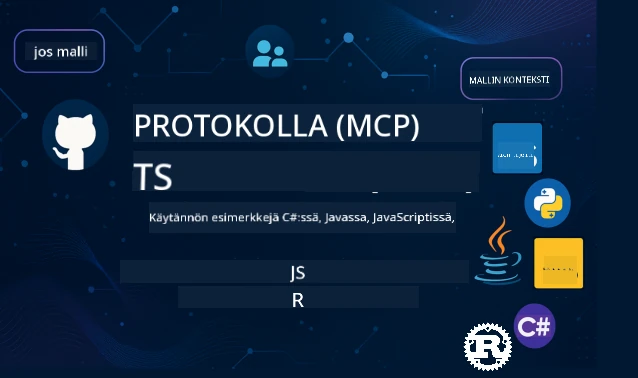

 

[](https://GitHub.com/microsoft/mcp-for-beginners/graphs/contributors)
[](https://GitHub.com/microsoft/mcp-for-beginners/issues)
[](https://GitHub.com/microsoft/mcp-for-beginners/pulls)
[](http://makeapullrequest.com)

[](https://GitHub.com/microsoft/mcp-for-beginners/watchers)
[](https://GitHub.com/microsoft/mcp-for-beginners/fork)
[](https://GitHub.com/microsoft/mcp-for-beginners/stargazers)


[](https://discord.gg/nTYy5BXMWG)

Seuraa näitä vaiheita aloittaaksesi näiden resurssien käytön:
1. **Forkkaa repositorio**: Klikkaa [](https://GitHub.com/microsoft/mcp-for-beginners/fork)
2. **Kloonaa repositorio**:   `git clone https://github.com/microsoft/mcp-for-beginners.git`
3. **Liity** [](https://discord.gg/nTYy5BXMWG)


### 🌐 Monikielinen tuki

#### Tuettu GitHub-toiminnolla (Automaattinen & Aina ajan tasalla)

<!-- CO-OP TRANSLATOR LANGUAGES TABLE START -->
[Arabic](../ar/README.md) | [Bengali](../bn/README.md) | [Bulgarian](../bg/README.md) | [Burmese (Myanmar)](../my/README.md) | [Chinese (Simplified)](../zh-CN/README.md) | [Chinese (Traditional, Hong Kong)](../zh-HK/README.md) | [Chinese (Traditional, Macau)](../zh-MO/README.md) | [Chinese (Traditional, Taiwan)](../zh-TW/README.md) | [Croatian](../hr/README.md) | [Czech](../cs/README.md) | [Danish](../da/README.md) | [Dutch](../nl/README.md) | [Estonian](../et/README.md) | [Finnish](./README.md) | [French](../fr/README.md) | [German](../de/README.md) | [Greek](../el/README.md) | [Hebrew](../he/README.md) | [Hindi](../hi/README.md) | [Hungarian](../hu/README.md) | [Indonesian](../id/README.md) | [Italian](../it/README.md) | [Japanese](../ja/README.md) | [Kannada](../kn/README.md) | [Korean](../ko/README.md) | [Lithuanian](../lt/README.md) | [Malay](../ms/README.md) | [Malayalam](../ml/README.md) | [Marathi](../mr/README.md) | [Nepali](../ne/README.md) | [Nigerian Pidgin](../pcm/README.md) | [Norwegian](../no/README.md) | [Persian (Farsi)](../fa/README.md) | [Polish](../pl/README.md) | [Portuguese (Brazil)](../pt-BR/README.md) | [Portuguese (Portugal)](../pt-PT/README.md) | [Punjabi (Gurmukhi)](../pa/README.md) | [Romanian](../ro/README.md) | [Russian](../ru/README.md) | [Serbian (Cyrillic)](../sr/README.md) | [Slovak](../sk/README.md) | [Slovenian](../sl/README.md) | [Spanish](../es/README.md) | [Swahili](../sw/README.md) | [Swedish](../sv/README.md) | [Tagalog (Filipino)](../tl/README.md) | [Tamil](../ta/README.md) | [Telugu](../te/README.md) | [Thai](../th/README.md) | [Turkish](../tr/README.md) | [Ukrainian](../uk/README.md) | [Urdu](../ur/README.md) | [Vietnamese](../vi/README.md)

> **Haluatko kloonata paikallisesti?**
>
> Tämä repositorio sisältää yli 50 kieliversiota, mikä lisää merkittävästi latauskokoa. Kloonataksesi ilman käännöksiä, käytä sparse checkout -ominaisuutta:
>
> **Bash / macOS / Linux:**
> ```bash
> git clone --filter=blob:none --sparse https://github.com/microsoft/mcp-for-beginners.git
> cd mcp-for-beginners
> git sparse-checkout set --no-cone '/*' '!translations' '!translated_images'
> ```
>
> **CMD (Windows):**
> ```cmd
> git clone --filter=blob:none --sparse https://github.com/microsoft/mcp-for-beginners.git
> cd mcp-for-beginners
> git sparse-checkout set --no-cone "/*" "!translations" "!translated_images"
> ```
>
> Tämä antaa sinulle kaiken tarvittavan kurssin suorittamiseen huomattavasti nopeammalla latauksella.
<!-- CO-OP TRANSLATOR LANGUAGES TABLE END -->

# 🚀 Model Context Protocol (MCP) -oppimateriaali aloittelijoille

## **Opi MCP käytännön koodiesimerkkien kautta C#:ssa, Javassa, JavaScriptissä, Rustissa, Pythonissa ja TypeScriptissä**

## 🧠 Yleiskatsaus Model Context Protocol -oppimateriaaliin
Tervetuloa matkallesi Model Context Protocolin maailmaan! Jos olet koskaan miettinyt, miten tekoälysovellukset kommunikoivat eri työkalujen ja palveluiden kanssa, olet nyt löytämässä elegantin ratkaisun, joka muuttaa tapaa, jolla kehittäjät rakentavat älykkäitä järjestelmiä.

Ajattele MCP:tä universaalina kääntäjänä tekoälysovelluksille – aivan kuten USB-portit antavat sinun liittää minkä tahansa laitteen tietokoneeseesi, MCP mahdollistaa tekoälymalleille liittää minkä tahansa työkalun tai palvelun standardoidulla tavalla. Olitpa rakentamassa ensimmäistä chatbottiasi tai työskentelemässä monimutkaisten tekoälytyönkulkujen parissa, MCP:n ymmärtäminen antaa sinulle valtuudet luoda kykenevämpiä ja joustavampia sovelluksia.

Tämä oppimateriaali on suunniteltu kärsivällisyydellä ja huolella oppimispolkuasi varten. Aloitamme yksinkertaisilla käsitteillä, jotka tunnet, ja rakennamme asiantuntemustasi asteittain käytännön harjoitusten avulla suosimallasi ohjelmointikielellä. Jokainen vaihe sisältää selkeitä selityksiä, käytännön esimerkkejä ja runsaasti kannustusta matkan varrella.

Kun olet suorittanut tämän matkan, sinulla on varmuus rakentaa omia MCP-palvelimia, integroida ne suosittuihin tekoälyalustoihin ja ymmärtää, miten tämä teknologia muokkaa tekoälykehityksen tulevaisuutta. Aloitetaan tämä jännittävä seikkailu yhdessä!

### Virallinen dokumentaatio ja spesifikaatiot

Tämä oppimateriaali on linjassa **MCP Specification 2025-11-25** -version (uusin vakaa julkaisu) kanssa. MCP-spesifikaatio käyttää päivämääräpohjaista versiointia (VVVV-KK-PP-muodossa) selkeän protokollaversion seurannan varmistamiseksi.

Nämä resurssit muuttuvat arvokkaammiksi sitä mukaa kun ymmärryksesi kasvaa, mutta älä tunne painetta lukea kaikkea heti. Aloita niistä osa-alueista, jotka kiinnostavat sinua eniten!
- 📘 [MCP-dokumentaatio](https://modelcontextprotocol.io/) – Tämä on ensisijainen resurssisi askel askeleelta -oppaisiin ja käyttäjäohjeisiin. Dokumentaatio on kirjoitettu aloittelijat mielessä, tarjoten selkeitä esimerkkejä, joita voit seurata omaan tahtiisi.
- 📜 [MCP-spesifikaatio](https://modelcontextprotocol.io/specification/2025-11-25) – Tämä on kattava viitemanuaalisi. Kun etenet oppimateriaalissa, tulet palaamaan tänne katsomaan yksityiskohtia ja tutustumaan edistyneisiin ominaisuuksiin.
- 📜 [MCP-spesifikaation versiointi](https://modelcontextprotocol.io/specification/versioning) – Sisältää tietoa protokollan versiohistoriasta ja siitä, miten MCP käyttää päivämääräpohjaista versiointia (VVVV-KK-PP-muodossa).
- 🧑‍💻 [MCP GitHub-repositorio](https://github.com/modelcontextprotocol) – Täältä löydät SDK:t, työkalut ja koodiesimerkit useissa ohjelmointikielissä. Se on kuin aarrearkku käytännön esimerkkejä ja valmiita komponentteja.
- 🌐 [MCP-yhteisö](https://github.com/orgs/modelcontextprotocol/discussions) – Liity muiden oppijoiden ja kokeneiden kehittäjien keskusteluihin MCP:stä. Se on tukevainen yhteisö, jossa kysymykset ovat tervetulleita ja tieto jaetaan vapaasti.
  
## Oppimistavoitteet

Tämän materiaalin lopussa tunnet olosi varmaksi ja innostuneeksi uusista taidoistasi. Tässä mitä saavut:

• **Ymmärrä MCP:n perusteet**: Ymmärrät, mitä Model Context Protocol on ja miksi se mullistaa tekoälysovellusten yhteistyön, käyttäen vertauksia ja esimerkkejä, jotka ovat helposti ymmärrettäviä.

• **Rakenna ensimmäinen MCP-palvelimesi**: Luot toimivan MCP-palvelimen omalla suosikkiohjelmointikielelläsi, aloittaen yksinkertaisista esimerkeistä ja kehittäen taitojasi vaihe vaiheelta.

• **Yhdistä tekoälymalleja todellisiin työkaluihin**: Opit rakentamaan sillan tekoälymallien ja todellisten palveluiden välille, antaen sovelluksillesi uusia tehokkaita mahdollisuuksia.

• **Ota käyttöön turvallisen käytännön mukaiset toimet**: Ymmärrät, miten pitää MCP-toteutukset turvassa, suojellen niin sovelluksia kuin käyttäjiäkin.

• **Ota käyttöön varmuudella**: Tiedät, miten viedä MCP-projektisi kehityksestä tuotantoon, käytännön käyttöönotto-strategioiden avulla, jotka toimivat todellisessa maailmassa.

• **Liity MCP-yhteisöön**: Tulet osaksi kasvavaa kehittäjäyhteisöä, joka muokkaa tekoälysovelluskehityksen tulevaisuutta. 

## Olennainen tausta

Ennen kuin sukellamme syvälle MCP:n yksityiskohtiin, varmistetaan että tunnet olosi mukavaksi muutaman perustavan käsitteen parissa. Älä huoli, vaikka et olisikaan asiantuntija näissä – selitämme kaiken tarpeellisen matkan varrella!

### Protokollien ymmärtäminen (Perusta)

Ajattele protokollaa keskustelun sääntönä. Kun soitat ystävälle, molemmat tiedätte sanovan "hei" vastatessanne, puhuvan vuorotellen ja sanovan "näkemiin" lopettaessanne. Tietokoneohjelmat tarvitsevat samanlaisia sääntöjä tehokkaaseen kommunikointiin.

MCP on protokolla – joukko sovittuja sääntöjä, jotka auttavat tekoälymalleja ja sovelluksia käymään tuottavia "keskusteluja" työkalujen ja palveluiden kanssa. Aivan kuten keskustelusäännöt helpottavat ihmisten välistä viestintää, MCP tekee tekoälysovellusten kommunikoinnista luotettavampaa ja tehokkaampaa.

### Asiakas-palvelinsuhteet (Miten ohjelmat toimivat yhdessä)

Käytät asiakas-palvelinsuhteita joka päivä! Kun käytät verkkoselainta (asiakas) vieraillessasi verkkosivulla, yhdistät verkkopalvelimeen, joka lähettää sinulle sivun sisällön. Selain tietää, miten pyytää tietoa, ja palvelin tietää, miten vastata.

MCP:ssä meillä on samankaltainen suhde: tekoälymallit toimivat asiakkaina, jotka pyytävät tietoa tai toimintoja, kun taas MCP-palvelimet tarjoavat nämä kyvyt. Se on kuin avulias avustaja (palvelin), jota tekoäly voi pyytää suorittamaan tiettyjä tehtäviä.

### Miksi standardisointi on tärkeää (Asioiden toimivuus yhdessä)

Kuvittele, että jokainen autonvalmistaja käyttäisi eri muotoisia bensapumppuja – tarvitsisit erillisen sovittimen joka autoon! Standardisointi tarkoittaa yhteisistä lähestymistavoista sopimista, jotta asiat toimivat saumattomasti yhdessä.

MCP tarjoaa tämän standardisoinnin tekoälysovelluksille. Sen sijaan, että jokainen tekoälymalli tarvitsee erikoiskoodin toimiakseen jokaisen työkalun kanssa, MCP luo universaalin tavan kommunikoida. Tämä tarkoittaa, että kehittäjät voivat rakentaa työkaluja kerran ja saada ne toimimaan monien eri tekoälyjärjestelmien kanssa.

## 🧭 Oppimispolkusi yleiskatsaus

MCP-matkaasi on suunniteltu huolellisesti rakentamaan itseluottamustasi ja taitojasi vaiheittain. Jokainen vaihe esittelee uusia käsitteitä samalla vahvistaen jo opittua.

### 🌱 Perusteet-vaihe: Peruskäsitteiden ymmärtäminen (Moduulit 0-2)

Täällä seikkailusi alkaa! Esittelemme sinulle MCP:n käsitteitä tutuilla vertauksilla ja yksinkertaisilla esimerkeillä. Ymmärrät, mitä MCP on, miksi se on olemassa, ja miten se liittyy laajempaan tekoälykehityksen maailmaan.

• **Moduuli 0 - Johdatus MCP:hen**: Aloitamme tutkimalla, mitä MCP on ja miksi se on niin tärkeä nykyaikaisille tekoälysovelluksille. Näet MCP:n käytännön esimerkkejä ja ymmärrät, miten se ratkaisee kehittäjien yleisiä ongelmia.

• **Moduuli 1 - Keskeiset käsitteet selitettynä**: Tässä opit MCP:n olennaiset rakennuspalikat. Käytämme runsaasti vertauksia ja visuaalisia esimerkkejä, jotta nämä käsitteet tuntuisivat luonnollisilta ja ymmärrettäviltä.

• **Moduuli 2 - Turvallisuus MCP:ssä**: Turvallisuus saattaa kuulostaa pelottavalta, mutta näytämme, miten MCP sisältää sisäänrakennettuja turvaominaisuuksia ja opetamme parhaita käytäntöjä, jotka suojaavat sovelluksiasi alusta alkaen.

### 🔨 Rakentamisvaihe: Ensimmäisten toteutusten luominen (Moduuli 3)

Nyt alkaa todellinen hauskuus! Saat käytännön kokemusta MCP-palvelimien ja asiakkaiden rakentamisesta. Älä huoli – aloitamme yksinkertaisesti ja ohjaamme sinua joka vaiheessa.
Tämä moduuli sisältää useita käytännön oppaita, joiden avulla voit harjoitella haluamallasi ohjelmointikielellä. Luo ensimmäinen palvelimesi, rakenna asiakas yhdistääksesi siihen ja integroi jopa suosittuihin kehitystyökaluihin, kuten VS Codeen.

Jokainen opas sisältää täydelliset koodiesimerkit, vianetsintävinkit ja selitykset siitä, miksi teemme tietyt suunnitteluratkaisut. Tämän vaiheen lopussa sinulla on toimivia MCP-toteutuksia, joista voit olla ylpeä!

### 🚀 Kasvuvaihe: Edistyneet käsitteet ja käytännön sovellukset (Moduulit 4-5)

Kun perusteet ovat hallussa, olet valmis tutkimaan kehittyneempiä MCP-ominaisuuksia. Käymme läpi käytännön toteutusstrategiat, virheiden etsintätekniikat sekä edistyneet aiheet, kuten monimodaalinen tekoälyintegraatio.

Opit myös skaalauttamaan MCP-toteutuksesi tuotantokäyttöön ja integroimaan pilvialustoihin, kuten Azureen. Nämä moduulit valmistavat sinut rakentamaan MCP-ratkaisuja, jotka pystyvät käsittelemään reaalimaailman vaatimuksia.

### 🌟 Hallintavaihe: Yhteisö ja erikoistuminen (Moduulit 6-11)

Viimeinen vaihe keskittyy liittymiseen MCP-yhteisöön ja erikoistumiseen sinua eniten kiinnostaviin alueisiin. Opit osallistumaan avoimen lähdekoodin MCP-projekteihin, toteuttamaan edistyneitä todennusmalleja ja rakentamaan kattavia tietokanta-integroituja ratkaisuja.

Moduuli 11 ansaitsee erityismaininnan – se on kokonainen 13-labran käytännön oppimispolku, joka opettaa rakentamaan tuotantovalmiita MCP-palvelimia PostgreSQL-integraatiolla. Se on kuin päätöstehtävä, joka kokoaa kaiken oppimasi yhteen!

### 📚 Koko opetussuunnitelman rakenne

| Moduuli | Aihe | Kuvaus | Linkki |
|--------|-------|-------------|------|
| **Moduulit 0-3: Perusteet** | | | |
| 00 | Johdatus MCP:hen | Yleiskatsaus Model Context Protocoliin ja sen merkitykseen tekoälyputkissa | [Lue lisää](./00-Introduction/README.md) |
| 01 | Ydinperiaatteiden selitys | Syvällinen tarkastelu MCP:n ydinkäsitteistä | [Lue lisää](./01-CoreConcepts/README.md) |
| 02 | Turvallisuus MCP:ssä | Turvauhat ja parhaat käytännöt | [Lue lisää](./02-Security/README.md) |
| 03 | MCP:n käynnistäminen | Ympäristön asetukset, peruspalvelimet/asiakkaat, integraatio | [Lue lisää](./03-GettingStarted/README.md) |
| **Moduuli 3: Ensimmäisen palvelimen ja asiakkaan rakentaminen** | | | |
| 3.1 | Ensimmäinen palvelin | Luo ensimmäinen MCP-palvelimesi | [Opas](./03-GettingStarted/01-first-server/README.md) |
| 3.2 | Ensimmäinen asiakas | Kehitä perus MCP-asiakas | [Opas](./03-GettingStarted/02-client/README.md) |
| 3.3 | Asiakas LLM:n kanssa | Integroi suuret kielimallit | [Opas](./03-GettingStarted/03-llm-client/README.md) |
| 3.4 | VS Code -integraatio | Käytä MCP-palvelimia VS Codessa | [Opas](./03-GettingStarted/04-vscode/README.md) |
| 3.5 | stdio-palvelin | Luo palvelimia stdio-siirtoyhteydellä | [Opas](./03-GettingStarted/05-stdio-server/README.md) |
| 3.6 | HTTP-striimaus | Toteuta HTTP-striimaus MCP:ssä | [Opas](./03-GettingStarted/06-http-streaming/README.md) |
| 3.7 | AI Toolkit | Käytä AI Toolkit -työkalua MCP:n kanssa | [Opas](./03-GettingStarted/07-aitk/README.md) |
| 3.8 | Testaus | Testaa MCP-palvelintoteutustasi | [Opas](./03-GettingStarted/08-testing/README.md) |
| 3.9 | Käyttöönotto | Ota MCP-palvelimet tuotantoon | [Opas](./03-GettingStarted/09-deployment/README.md) |
| 3.10 | Edistynyt palvelimen käyttö | Käytä kehittyneitä palvelimia edistyneiden ominaisuuksien ja paremman arkkitehtuurin hyödyntämiseksi | [Opas](./03-GettingStarted/10-advanced/README.md) |
| 3.11 | Yksinkertainen todennus | Luku, joka näyttää todennuksen alusta alkaen ja RBAC:n | [Opas](./03-GettingStarted/11-simple-auth/README.md) |
| 3.12 | MCP-hostit | Määritä Claude Desktop, Cursor, Cline ja muut MCP-hostit | [Opas](./03-GettingStarted/12-mcp-hosts/README.md) |
| 3.13 | MCP Inspector | Vianmääritys ja testaus MCP-palvelimille Inspector-työkalulla | [Opas](./03-GettingStarted/13-mcp-inspector/README.md) |
| 3.14 | Otoskoko | Käytä otosta tehdäksesi yhteistyötä asiakkaan kanssa | [Opas](./03-GettingStarted/14-sampling/README.md) |
| 3.15 | MCP-sovellukset | Rakenna MCP-sovelluksia | [Opas](./03-GettingStarted/15-mcp-apps/README.md) |

| **Moduulit 4-5: Käytännön ja edistynyt** | | | |
| 04 | Käytännön toteutus | SDK:t, virheiden etsintä, testaus, uudelleenkäytettävät kehotemallit | [Lue lisää](./04-PracticalImplementation/README.md) |
| 4.1 | Sivutus | Käsittele suuria tulosjoukkoja kursori-pohjaisella sivutuksella | [Opas](./04-PracticalImplementation/pagination/README.md) |
| 05 | Edistyneet MCP-aiheet | Monimodaalinen tekoäly, skaalaus, yrityskäyttö | [Lue lisää](./05-AdvancedTopics/README.md) |
| 5.1 | Azure-integraatio | MCP-integraatio Azureen | [Opas](./05-AdvancedTopics/mcp-integration/README.md) |
| 5.2 | Monimuotoisuus | Työskentely useiden modaliteettien kanssa | [Opas](./05-AdvancedTopics/mcp-multi-modality/README.md) |
| 5.3 | OAuth2-demo | Toteuta OAuth2-todennus | [Opas](./05-AdvancedTopics/mcp-oauth2-demo/README.md) |
| 5.4 | Juurikontekstit | Ymmärrä ja toteuta juurikontekstit | [Opas](./05-AdvancedTopics/mcp-root-contexts/README.md) |
| 5.5 | Reititys | MCP:n reititysstrategiat | [Opas](./05-AdvancedTopics/mcp-routing/README.md) |
| 5.6 | Otanta | Otantatekniikat MCP:ssä | [Opas](./05-AdvancedTopics/mcp-sampling/README.md) |
| 5.7 | Skaalaus | Skaalaa MCP-toteutuksia | [Opas](./05-AdvancedTopics/mcp-scaling/README.md) |
| 5.8 | Turvallisuus | Edistyneet turvallisuusnäkökohdat | [Opas](./05-AdvancedTopics/mcp-security/README.md) |
| 5.9 | Verkkohaku | Toteuta verkkohakuominaisuuksia | [Opas](./05-AdvancedTopics/web-search-mcp/README.md) |
| 5.10 | Reaaliaikainen suoratoisto | Rakenna reaaliaikainen striimaustoiminto | [Opas](./05-AdvancedTopics/mcp-realtimestreaming/README.md) |
| 5.11 | Reaaliaikainen haku | Toteuta reaaliaikainen haku | [Opas](./05-AdvancedTopics/mcp-realtimesearch/README.md) |
| 5.12 | Entra ID -todennus | Todennus Microsoft Entra ID:llä | [Opas](./05-AdvancedTopics/mcp-security-entra/README.md) |
| 5.13 | Foundry-integraatio | Integroi Azure AI Foundryn kanssa | [Opas](./05-AdvancedTopics/mcp-foundry-agent-integration/README.md) |
| 5.14 | Konteksti-insinöörityö | Tehokkaan konteksti-insinöörityön tekniikat | [Opas](./05-AdvancedTopics/mcp-contextengineering/README.md) |
| 5.15 | MCP:n mukautettu siirtoyhteys | Mukautettujen siirtoyhteystoteutusten tekeminen | [Opas](./05-AdvancedTopics/mcp-transport/README.md) |
| 5.16 | Protokollan ominaisuudet | Edistymisilmoitukset, peruutus, resurssipohjat | [Opas](./05-AdvancedTopics/mcp-protocol-features/README.md) |
| **Moduulit 6-10: Yhteisö ja parhaat käytännöt** | | | |
| 06 | Yhteisön panokset | Kuinka osallistua MCP-ekosysteemiin | [Opas](./06-CommunityContributions/README.md) |
| 07 | Oppia varhaisesta käyttöönotosta | Reaaliaikaisia toteutustarinoita | [Opas](./07-LessonsfromEarlyAdoption/README.md) |
| 08 | Parhaat käytännöt MCP:ssä | Suorituskyky, vikasietoisuus, resilienssi | [Opas](./08-BestPractices/README.md) |
| 09 | MCP:n tapaustutkimukset | Käytännön toteutusesimerkit | [Opas](./09-CaseStudy/README.md) |
| 10 | Käytännön työpaja | MCP-palvelimen rakentaminen AI Toolkitin avulla | [Lab](./10-StreamliningAIWorkflowsBuildingAnMCPServerWithAIToolkit/README.md) |
| **Moduuli 11: MCP-palvelimen käytännön labratuuri** | | | |
| 11 | MCP-palvelimen tietokantaintegraatio | Kattava 13-labran käytännön oppimispolku PostgreSQL-integraatiosta | [Labrat](./11-MCPServerHandsOnLabs/README.md) |
| 11.1 | Johdanto | Yleiskatsaus MCP:hen tietokanta-integraation ja vähittäiskaupan analytiikkatapauksen kera | [Lab 00](./11-MCPServerHandsOnLabs/00-Introduction/README.md) |
| 11.2 | Ydinarkkitehtuuri | MCP-palvelimen arkkitehtuurin, tietokantakerrosten ja turvallisuusmallien ymmärrys | [Lab 01](./11-MCPServerHandsOnLabs/01-Architecture/README.md) |
| 11.3 | Turvallisuus ja monivuokraajaympäristö | Rivitason turvallisuus, todentaminen ja monivuokraajan datan käyttö | [Lab 02](./11-MCPServerHandsOnLabs/02-Security/README.md) |
| 11.4 | Ympäristön asennus | Kehitysympäristön, Dockerin ja Azuren resurssien asennus | [Lab 03](./11-MCPServerHandsOnLabs/03-Setup/README.md) |
| 11.5 | Tietokannan suunnittelu | PostgreSQL:n asennus, vähittäiskaupan skeemasuunnittelu ja esimerkkidata | [Lab 04](./11-MCPServerHandsOnLabs/04-Database/README.md) |
| 11.6 | MCP-palvelimen toteutus | FastMCP-palvelimen rakentaminen tietokantaintegraatiolla | [Lab 05](./11-MCPServerHandsOnLabs/05-MCP-Server/README.md) |
| 11.7 | Työkalujen kehitys | Tietokantakyselytyökalujen ja skeeman tarkastustyökalujen luominen | [Lab 06](./11-MCPServerHandsOnLabs/06-Tools/README.md) |
| 11.8 | Semanttinen haku | Vektorisijoitusten toteutus Azure OpenAI:n ja pgvectorin avulla | [Lab 07](./11-MCPServerHandsOnLabs/07-Semantic-Search/README.md) |
| 11.9 | Testaus ja virheiden etsintä | Testausstrategiat, debuggaustyökalut ja validointimenetelmät | [Lab 08](./11-MCPServerHandsOnLabs/08-Testing/README.md) |
| 11.10 | VS Code -integraatio | VS Code MCP -integraation ja AI Chat -käytön konfigurointi | [Lab 09](./11-MCPServerHandsOnLabs/09-VS-Code/README.md) |
| 11.11 | Käyttöönoton strategiat | Docker-käyttöönotto, Azure Container Apps ja skaalausnäkökohdat | [Lab 10](./11-MCPServerHandsOnLabs/10-Deployment/README.md) |
| 11.12 | Valvonta | Application Insights, lokitus, suorituskyvyn seuranta | [Lab 11](./11-MCPServerHandsOnLabs/11-Monitoring/README.md) |
| 11.13 | Parhaat käytännöt | Suorituskyvyn optimointi, turvallisuuden koventaminen ja tuotantovinkit | [Lab 12](./11-MCPServerHandsOnLabs/12-Best-Practices/README.md) |

### 💻 Esimerkkikoodiprojektit

Yksi MCP:n opiskelun jännittävimmistä osista on nähdä kooditaitojesi kehittyvän vaiheittain. Olemme suunnitelleet koodiesimerkkimme alkamaan yksinkertaisista ja kehittyvän monimutkaisemmiksi ymmärryksesi syventyessä. Tässä tapa, jolla esittelemme käsitteet – helposti ymmärrettävän, mutta oikeita MCP-periaatteita havainnollistavan koodin avulla ymmärrät paitsi mitä koodi tekee, myös miksi se on rakennettu näin ja miten se sopii laajempiin MCP-sovelluksiin.

#### Perus MCP-laskin esimerkit

| Kieli | Kuvaus | Linkki |
|----------|-------------|------|
| C# | MCP-palvelin esimerkki | [Näytä koodi](./03-GettingStarted/samples/csharp/README.md) |
| Java | MCP-laskin | [Näytä koodi](./03-GettingStarted/samples/java/calculator/README.md) |
| JavaScript | MCP-demo | [Näytä koodi](./03-GettingStarted/samples/javascript/README.md) |
| Python | MCP-palvelin | [Näytä koodi](../../03-GettingStarted/samples/python/mcp_calculator_server.py) |
| TypeScript | MCP-esimerkki | [Näytä koodi](./03-GettingStarted/samples/typescript/README.md) |
| Rust | MCP-esimerkki | [Näytä koodi](./03-GettingStarted/samples/rust/README.md) |

#### Edistyneet MCP-toteutukset

| Kieli | Kuvaus | Linkki |
|----------|-------------|------|
| C# | Edistynyt esimerkki | [Näytä koodi](./04-PracticalImplementation/samples/csharp/README.md) |
| Java Springillä | Container App -esimerkki | [Näytä koodi](./04-PracticalImplementation/samples/java/containerapp/README.md) |
| JavaScript | Edistynyt esimerkki | [Näytä koodi](./04-PracticalImplementation/samples/javascript/README.md) |
| Python | Monimutkainen toteutus | [Näytä koodi](./04-PracticalImplementation/samples/python/README.md) |
| TypeScript | Container-esimerkki | [Näytä koodi](./04-PracticalImplementation/samples/typescript/README.md) |

## 🎯 MCP:n oppimisen edellytykset

Jotta saisit tästä opetussuunnitelmasta parhaan hyödyn, sinun tulisi osata:
- Perustiedot ohjelmoinnista vähintään yhdessä seuraavista kielistä: C#, Java, JavaScript, Python tai TypeScript  
- Ymmärrys asiakas-palvelin -mallista ja API:sta  
- Tutustuminen REST- ja HTTP-käsitteisiin  
- (Valinnainen) Tausta tekoälyn/koneoppimisen käsitteissä  

- Osallistuminen yhteisömme keskusteluihin tuen saamiseksi  

## 📚 Opas & Resurssit

Tämä arkisto sisältää useita resursseja, jotka auttavat sinua navigoimaan ja oppimaan tehokkaasti:

### Opas

Kattava [Opas](./study_guide.md) on saatavilla auttamaan sinua navigoinnissa tässä arkistossa tehokkaasti. Tämä visuaalinen opetussuunnitelmakartta näyttää, miten kaikki aiheet liittyvät toisiinsa, ja tarjoaa ohjeita siitä, miten näytteitä projekteista voi käyttää tehokkaasti. Se on erityisen hyödyllinen, jos opit parhaiten visuaalisesti ja haluat nähdä kokonaisuuden.

Opas sisältää:
- Visuaalisen opetussuunnitelmakartan, joka näyttää kaikki käsitellyt aiheet  
- Yksityiskohtaisen jakautumisen kunkin arkiston osuuden osalta  
- Ohjeita näyteprojektien käyttämiseen  
- Suositeltuja oppimispolkuja eri taitotasoille  
- Lisäresursseja oppimismatkaasi täydentämään  

### Muutokset

Pidämme yllä yksityiskohtaista [Muutokset](./changelog.md) -tiedostoa, joka seuraa kaikkia merkittäviä päivityksiä opetussuunnitelman materiaaleihin, jotta pysyt ajan tasalla uusimmista parannuksista ja lisäyksistä.
- Uudet sisältölisäykset  
- Rakenteelliset muutokset  
- Ominaisuuksien parannukset  
- Dokumentaatiopäivitykset  

## 🛠️ Kuinka käyttää tätä opetussuunnitelmaa tehokkaasti

Jokainen tämän oppaan oppitunti sisältää:

1. Selkeät selitykset MCP-konsepteista  
2. Live-koodiesimerkkejä useilla kielillä  
3. Harjoituksia oikeiden MCP-sovellusten rakentamiseksi  
4. Lisäresursseja edistyneemmille oppijoille  

### Opitaan MCP C#:llä - Opetusohjelmasarja  
Tutustutaan Model Context Protocoliin (MCP), edistykselliseen kehykseen, joka on suunniteltu standardoimaan vuorovaikutusta tekoälymallien ja asiakassovellusten välillä. Tässä aloittelijaystävällisessä jaksossa esittelemme MCP:n ja opastamme sinut luomaan ensimmäisen MCP-palvelimesi.  
#### C#: [https://aka.ms/letslearnmcp-csharp](https://aka.ms/letslearnmcp-csharp)  
#### Java: [https://aka.ms/letslearnmcp-java](https://aka.ms/letslearnmcp-java)  
#### JavaScript: [https://aka.ms/letslearnmcp-javascript](https://aka.ms/letslearnmcp-javascript)  
#### Python: [https://aka.ms/letslearnmcp-python](https://aka.ms/letslearnmcp-python)  

## 🎓 MCP-matkasi alkaa

Onnittelut! Olet juuri ottanut ensimmäisen askeleen jännittävälle matkalle, joka laajentaa ohjelmointitaitojasi ja yhdistää sinut tekoälyn kehityksen huippuun.

### Mitä olet jo saavuttanut

Lukemalla tämän johdannon olet jo aloittanut MCP-tietopohjasi rakentamisen. Ymmärrät mitä MCP on, miksi se on tärkeä ja miten tämä opetussuunnitelma tukee oppimismatkaasi. Se on merkittävä saavutus ja alku asiantuntemuksellesi tässä tärkeässä teknologiassa.

### Seikkailu edessä

Kun etenet moduuleissa, muista, että jokainen asiantuntija on joskus ollut aloittelija. Nyt monimutkaisilta vaikuttavat käsitteet tulevat toiseksi luonnoksi harjoittelun ja soveltamisen myötä. Jokainen pieni askel rakentaa voimakkaita taitoja, jotka palvelevat sinua koko kehitysuran ajan.

### Tukiverkostosi

Liityt oppijoiden ja asiantuntijoiden yhteisöön, jotka ovat intohimoisia MCP:stä ja halukkaita auttamaan muita menestymään. Olitpa jumissa koodaushaasteessa tai innokas jakamaan läpimurtonsa, yhteisö tukee matkaasi.

Jos jäät jumiin tai sinulla on kysyttävää tekoäly-sovellusten rakentamisesta, liity muiden oppijoiden ja kokeneiden kehittäjien keskusteluihin MCP:stä. Se on tukevainen yhteisö, jossa kysymykset ovat tervetulleita ja tieto jaetaan avoimesti.

[](https://discord.gg/nTYy5BXMWG)

Jos sinulla on palautetta tuotteesta tai kohtaat virheitä rakentaessasi, käy:  

[](https://aka.ms/foundry/forum)  

### Valmis aloittamaan?

MCP-seikkailusi alkaa nyt! Aloita moduulista 0 sukeltaaksesi ensimmäisiin käytännön MCP-kokemuksiisi tai tutustu näyteprojekteihin nähdäksesi, mitä rakennat. Muista - jokainen asiantuntija aloitti tismalleen samasta pisteestä kuin sinä nyt, ja kärsivällisyydellä ja harjoittelulla tulet hämmästymään siitä, mitä pystyt saavuttamaan.

Tervetuloa Model Context Protocol -kehityksen maailmaan. Rakennetaan jotain upeaa yhdessä!

## 🤝 Osallistuminen oppimisyhteisöön

Tämä opetussuunnitelma vahvistuu oppijoiden, kuten sinun, panostuksilla! Olitpa korjaamassa kirjoitusvirhettä, ehdottamassa selkeämpää selitystä tai lisäämässä uutta esimerkkiä, panoksesi auttavat muita aloittelijoita onnistumaan.

Kiitokset Microsoft Valued Professionalille [Shivam Goyal](https://www.linkedin.com/in/shivam2003/) koodiesimerkkien tarjoamisesta.

Panostusprosessi on suunniteltu olevan tervetullut ja tukevainen. Useimmat panostukset edellyttävät Contributor License Agreement (CLA) -sopimuksen, mutta automaattiset työkalut opastavat prosessin sujuvasti.

## 📜 Avoimen lähdekoodin oppiminen

Koko opetussuunnitelma on saatavilla MIT-lisenssillä [LICENSE](../../LICENSE), mikä tarkoittaa, että voit käyttää, muokata ja jakaa sitä vapaasti. Tämä tukee missiotamme tehdä MCP-tietoisuus saavutettavaksi kehittäjille kaikkialla.

## 🤝 Osallistumisohjeet

Tämä projekti toivottaa tervetulleiksi panokset ja ehdotukset. Useimmat panokset edellyttävät, että hyväksyt Contributor License Agreementin (CLA) vahvistaen, että sinulla on oikeus ja todella myönnät meille oikeudet käyttää panostustasi. Lisätietoja saat osoitteesta <https://cla.opensource.microsoft.com>.

Kun teet pull requestin, CLA-botti automaattisesti tarkistaa tarvitsetko toimittaa CLA:n ja merkitsee PR:n asianmukaisesti (esim. tilantarkistus, kommentti). Noudata vain botin antamia ohjeita. Tämä pitää tehdä vain kerran kaikissa CLAa käyttäviä arkistoja varten.

Tämä projekti on ottanut käyttöön [Microsoftin avoimen lähdekoodin käytösohjeet](https://opensource.microsoft.com/codeofconduct/).  
Lisätietoja löytyy [Käytösohjeiden UKK:sta](https://opensource.microsoft.com/codeofconduct/faq/) tai ota yhteyttä osoitteeseen [opencode@microsoft.com](mailto:opencode@microsoft.com) lisäkysymyksiä tai kommentteja varten.

---

*Valmis aloittamaan MCP-matkasi? Aloita [Moduulilla 00 - Johdatus MCP:hen](./00-Introduction/README.md) ja ota askeleesi Model Context Protocol -kehityksen maailmaan!*


## 🎒 Muut kurssit  
Tiimimme tuottaa myös muita kursseja! Tutustu:

<!-- CO-OP TRANSLATOR OTHER COURSES START -->
### LangChain  
[](https://aka.ms/langchain4j-for-beginners)  
[](https://aka.ms/langchainjs-for-beginners?WT.mc_id=m365-94501-dwahlin)  
[](https://github.com/microsoft/langchain-for-beginners?WT.mc_id=m365-94501-dwahlin)  
---

### Azure / Edge / MCP / Agentit  
[](https://github.com/microsoft/AZD-for-beginners?WT.mc_id=academic-105485-koreyst)  
[](https://github.com/microsoft/edgeai-for-beginners?WT.mc_id=academic-105485-koreyst)  
[](https://github.com/microsoft/mcp-for-beginners?WT.mc_id=academic-105485-koreyst)  
[](https://github.com/microsoft/ai-agents-for-beginners?WT.mc_id=academic-105485-koreyst)  

---

### Generatiivinen AI -sarja  
[](https://github.com/microsoft/generative-ai-for-beginners?WT.mc_id=academic-105485-koreyst)  
[-9333EA?style=for-the-badge&labelColor=E5E7EB&color=9333EA)](https://github.com/microsoft/Generative-AI-for-beginners-dotnet?WT.mc_id=academic-105485-koreyst)  
[-C084FC?style=for-the-badge&labelColor=E5E7EB&color=C084FC)](https://github.com/microsoft/generative-ai-for-beginners-java?WT.mc_id=academic-105485-koreyst)  
[-E879F9?style=for-the-badge&labelColor=E5E7EB&color=E879F9)](https://github.com/microsoft/generative-ai-with-javascript?WT.mc_id=academic-105485-koreyst)  

---

### Ydinopetus  
[](https://aka.ms/ml-beginners?WT.mc_id=academic-105485-koreyst)  
[](https://aka.ms/datascience-beginners?WT.mc_id=academic-105485-koreyst)  
[](https://aka.ms/ai-beginners?WT.mc_id=academic-105485-koreyst)  
[](https://github.com/microsoft/Security-101?WT.mc_id=academic-96948-sayoung)  
[](https://aka.ms/webdev-beginners?WT.mc_id=academic-105485-koreyst)  
[](https://aka.ms/iot-beginners?WT.mc_id=academic-105485-koreyst)  
[](https://github.com/microsoft/xr-development-for-beginners?WT.mc_id=academic-105485-koreyst)  

---

### Copilot-sarja  

[](https://aka.ms/GitHubCopilotAI?WT.mc_id=academic-105485-koreyst)
[](https://github.com/microsoft/mastering-github-copilot-for-dotnet-csharp-developers?WT.mc_id=academic-105485-koreyst)
[](https://github.com/microsoft/CopilotAdventures?WT.mc_id=academic-105485-koreyst)
<!-- CO-OP TRANSLATOR OTHER COURSES END -->

---

<!-- CO-OP TRANSLATOR DISCLAIMER START -->
**Vastuuvapauslauseke**:  
Tämä asiakirja on käännetty käyttämällä tekoälypohjaista käännöspalvelua [Co-op Translator](https://github.com/Azure/co-op-translator). Pyrimme tarkkuuteen, mutta ole hyvä ja ota huomioon, että automaattiset käännökset voivat sisältää virheitä tai epätarkkuuksia. Alkuperäinen asiakirja sen alkuperäiskielellä on virallinen ja sitova lähde. Tärkeissä asioissa suositellaan ammattimaista ihmiskäännöstä. Emme ole vastuussa väärinkäsityksistä tai tulkinnoista, jotka johtuvat tämän käännöksen käytöstä.
<!-- CO-OP TRANSLATOR DISCLAIMER END -->