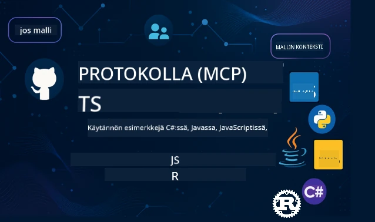

 

[](https://GitHub.com/microsoft/mcp-for-beginners/graphs/contributors)
[](https://GitHub.com/microsoft/mcp-for-beginners/issues)
[](https://GitHub.com/microsoft/mcp-for-beginners/pulls)
[](http://makeapullrequest.com)
[](https://mcptoplist.com/server/mcp.so%2Fmcp-for-beginners%2Fmicrosoft)

[](https://GitHub.com/microsoft/mcp-for-beginners/watchers)
[](https://GitHub.com/microsoft/mcp-for-beginners/fork)
[](https://GitHub.com/microsoft/mcp-for-beginners/stargazers)


[](https://discord.gg/nTYy5BXMWG)

Seuraa näitä ohjeita aloittaaksesi näiden resurssien käytön:
1. **Haarauta arkisto**: Klikkaa [](https://GitHub.com/microsoft/mcp-for-beginners/fork)
2. **Kloonaa arkisto**:   `git clone https://github.com/microsoft/mcp-for-beginners.git`
3. **Liity** [](https://discord.gg/nTYy5BXMWG)


### 🌐 Monikielinen tuki

#### Tuettu GitHub-toiminnolla (Automaattinen ja aina ajan tasalla)

<!-- CO-OP TRANSLATOR LANGUAGES TABLE START -->
[Arabic](../ar/README.md) | [Bengali](../bn/README.md) | [Bulgarian](../bg/README.md) | [Burmese (Myanmar)](../my/README.md) | [Chinese (Simplified)](../zh-CN/README.md) | [Chinese (Traditional, Hong Kong)](../zh-HK/README.md) | [Chinese (Traditional, Macau)](../zh-MO/README.md) | [Chinese (Traditional, Taiwan)](../zh-TW/README.md) | [Croatian](../hr/README.md) | [Czech](../cs/README.md) | [Danish](../da/README.md) | [Dutch](../nl/README.md) | [Estonian](../et/README.md) | [Finnish](./README.md) | [French](../fr/README.md) | [German](../de/README.md) | [Greek](../el/README.md) | [Hebrew](../he/README.md) | [Hindi](../hi/README.md) | [Hungarian](../hu/README.md) | [Indonesian](../id/README.md) | [Italian](../it/README.md) | [Japanese](../ja/README.md) | [Kannada](../kn/README.md) | [Khmer](../km/README.md) | [Korean](../ko/README.md) | [Lithuanian](../lt/README.md) | [Malay](../ms/README.md) | [Malayalam](../ml/README.md) | [Marathi](../mr/README.md) | [Nepali](../ne/README.md) | [Nigerian Pidgin](../pcm/README.md) | [Norwegian](../no/README.md) | [Persian (Farsi)](../fa/README.md) | [Polish](../pl/README.md) | [Portuguese (Brazil)](../pt-BR/README.md) | [Portuguese (Portugal)](../pt-PT/README.md) | [Punjabi (Gurmukhi)](../pa/README.md) | [Romanian](../ro/README.md) | [Russian](../ru/README.md) | [Serbian (Cyrillic)](../sr/README.md) | [Slovak](../sk/README.md) | [Slovenian](../sl/README.md) | [Spanish](../es/README.md) | [Swahili](../sw/README.md) | [Swedish](../sv/README.md) | [Tagalog (Filipino)](../tl/README.md) | [Tamil](../ta/README.md) | [Telugu](../te/README.md) | [Thai](../th/README.md) | [Turkish](../tr/README.md) | [Ukrainian](../uk/README.md) | [Urdu](../ur/README.md) | [Vietnamese](../vi/README.md)

> **Haluatko mieluummin kloonata paikallisesti?**
>
> Tämä arkisto sisältää yli 50 käännöstä, mikä kasvattaa latauskokoa merkittävästi. Kloonataksesi ilman käännöksiä, käytä sparse checkoutia:
>
> **Bash / macOS / Linux:**
> ```bash
> git clone --filter=blob:none --sparse https://github.com/microsoft/mcp-for-beginners.git
> cd mcp-for-beginners
> git sparse-checkout set --no-cone '/*' '!translations' '!translated_images'
> ```
>
> **CMD (Windows):**
> ```cmd
> git clone --filter=blob:none --sparse https://github.com/microsoft/mcp-for-beginners.git
> cd mcp-for-beginners
> git sparse-checkout set --no-cone "/*" "!translations" "!translated_images"
> ```
>
> Tämä antaa sinulle kaiken tarvittavan kurssin suorittamiseen paljon nopeammalla latauksella.
<!-- CO-OP TRANSLATOR LANGUAGES TABLE END -->

# 🚀 Model Context Protocol (MCP) Opetussuunnitelma Aloittelijoille

## **Opi MCP käytännön koodiesimerkkien avulla C#:lla, Javalla, JavaScriptillä, Rustilla, Pythonilla ja TypeScripillä**

## 🧠 Yleiskatsaus Model Context Protocol -opetussuunnitelmaan
Tervetuloa matkallesi Model Context Protocolin pariin! Jos olet koskaan miettinyt, miten tekoälysovellukset kommunikoivat erilaisten työkalujen ja palveluiden kanssa, olet nyt löytämässä elegantin ratkaisun, joka muuttaa tapaa, jolla kehittäjät rakentavat älykkäitä järjestelmiä.

Ajattele MCP:tä universaalina kääntäjänä tekoälysovelluksille – aivan kuten USB-portit sallivat minkä tahansa laitteen liittämisen tietokoneeseesi, MCP mahdollistaa tekoälymallien yhdistämisen mihin tahansa työkaluihin tai palveluihin standardoidulla tavalla. Olitpa sitten rakentamassa ensimmäistä chatbotiasi tai työskentelemässä monimutkaisten tekoälytyönkulkujen parissa, MCP:n ymmärtäminen antaa sinulle voiman luoda kyvykkäämpiä ja joustavampia sovelluksia.

Tämä opetussuunnitelma on suunniteltu kärsivällisesti ja huolella oppimismatkallesi. Aloitamme yksinkertaisista käsitteistä, jotka tunnet jo, ja rakennamme asiantuntemustasi asteittain käytännön harjoitusten kautta suosikkiohjelmointikielelläsi. Jokainen askel sisältää selkeitä selityksiä, käytännön esimerkkejä ja runsaasti kannustusta matkan varrella.

Kun olet suorittanut tämän matkan, sinulla on luottamus rakentaa omia MCP-palvelimia, integroida ne suosittuihin tekoälyalustoihin ja ymmärtää, kuinka tämä teknologia muokkaa tekoälyn kehityksen tulevaisuutta. Aloitetaan tämä jännittävä seikkailu yhdessä!

### Virallinen dokumentaatio ja määritelmät

Tämä opetussuunnitelma on linjassa **MCP Specification 2025-11-25** -julkaisun kanssa (viimeisin vakaa versio). MCP-määritelmä käyttää päivämääräpohjaista versiointia (VVVV-KK-PP-muodossa) selkeän protokollaversion seurannan varmistamiseksi.

> **Katse tulevaisuuteen:** seuraavan määritelmäversion, **2026-07-28**, ehdokasversio on aikataulutettu julkaistavaksi 28. heinäkuuta 2026. Se tekee protokollasta tilattoman kuljetuskerroksella, virallistaa laajennuskehyksen (MCP Apps, Tasks), tiukentaa käyttöoikeuksia ja poistaa käytöstä Roots-, Sampling- ja Logging-toiminnot. Katso [Mitä MCP:ssä muuttuu: 2026-07-28 Release Candidate](./01-CoreConcepts/mcp-2026-07-28-release-candidate.md) saadaksesi täydellisen erittelyn.

Nämä resurssit tulevat arvokkaammiksi ymmärryksesi kasvaessa, mutta älä tunne painetta lukea kaikkea heti. Aloita aiheista, jotka kiinnostavat sinua eniten!
- 📘 [MCP-dokumentaatio](https://modelcontextprotocol.io/) – Tämä on sinulle täydellinen resurssi vaiheittaisten opetusohjelmien ja käyttäjäoppaiden kanssa. Dokumentaatio on kirjoitettu aloittelijat huomioiden, tarjoten selkeitä esimerkkejä, joita voit seurata omaan tahtiisi.
- 📜 [MCP-määritelmä](https://modelcontextprotocol.io/specification/2025-11-25) – Ajattele tätä kattavana viitekirjana. Työskennellessäsi opetussuunnitelman parissa palaa tänne etsimään yksityiskohtia ja tutkimaan edistyneitä ominaisuuksia.
- 📜 [MCP-versionhallinta](https://modelcontextprotocol.io/specification/versioning) – Tämä sisältää tietoa protokollan versiohistoriasta ja siitä, miten MCP käyttää päivämääräpohjaista versiointia (VVVV-KK-PP-muodossa).
- 🧑‍💻 [MCP GitHub -arkisto](https://github.com/modelcontextprotocol) – Täältä löydät SDK:t, työkalut ja koodiesimerkit useilla ohjelmointikielillä. Se on kuin aarrearkku käytännön esimerkkejä ja valmiita komponentteja.
- 🌐 [MCP-yhteisö](https://github.com/orgs/modelcontextprotocol/discussions) – Liity muiden oppijoiden ja kokeneiden kehittäjien keskusteluihin MCP:stä. Se on tukeva yhteisö, jossa kysymyksiä saa esittää ja tietoa jaetaan vapaasti.
  
## Oppimistavoitteet

Tämän opetussuunnitelman lopussa tunnet olosi varmaksi ja innostuneeksi uusista taidoistasi. Tässä on mitä saavut:

• **Ymmärrä MCP:n perusteet**: Oivallat, mikä Model Context Protocol on ja miksi se mullistaa tekoälysovellusten yhteensopivuuden, käyttäen vertauksia ja esimerkkejä, jotka ovat helppoja ymmärtää.

• **Rakenna ensimmäinen MCP-palvelimesi**: Luot toimivan MCP-palvelimen omaa suosikkiohjelmointikieltäsi käyttäen, aloittaen yksinkertaisista esimerkeistä ja kehittäen taitojasi askel askeleelta.

• **Yhdistä tekoälymallit todellisiin työkaluihin**: Opit yhdistämään tekoälymallit oikeisiin palveluihin, antaen sovelluksillesi uusia voimakkaita ominaisuuksia.

• **Ota käyttöön turvallisuuden parhaat käytännöt**: Ymmärrät, miten pitää MCP-toteutuksesi turvassa ja suojattuna, suojellen sekä sovelluksiasi että käyttäjiäsi.

• **Ota käyttöön luottavaisin mielin**: Tiedät, miten viedä MCP-projektisi kehityksestä tuotantoon, käytännöllisten käyttöönottojen avulla, jotka toimivat reaalimaailmassa.

• **Liity MCP-yhteisöön**: Tulet osaksi kasvavaa kehittäjien joukkoa, joka muokkaa tekoälysovellusten kehityksen tulevaisuutta. 

## Välttämätön taustatieto

Ennen kuin sukellamme MCP:n yksityiskohtiin, varmistetaan että tunnet olosi mukavaksi joidenkin perustavanlaatuisten käsitteiden kanssa. Älä huoli, vaikka et olisi asiantuntija näillä alueilla – selitämme kaiken, mitä sinun tarvitsee tietää matkan varrella!

### Protokollien ymmärtäminen (Perusta)

Ajattele protokollaa kuin keskustelun sääntöjä. Kun soitat ystävälle, molemmat tiedätte sanoa "hei" vastatessanne, vuorotella puhumisessa ja sanoa "hei hei" lopuksi. Tietokoneohjelmat tarvitsevat samankaltaiset säännöt sujuvaan kommunikointiin.

MCP on protokolla – sarja sovittuja sääntöjä, jotka auttavat tekoälymalleja ja sovelluksia käymään hedelmällistä "keskustelua" työkalujen ja palveluiden kanssa. Kuten ihmisten keskustelusäännöt tekevät viestinnästä sujuvampaa, MCP tekee tekoälysovellusten kommunikoinnista luotettavampaa ja tehokkaampaa.

### Asiakas-palvelin-suhteet (Kuinka ohjelmat toimivat yhdessä)

Käytät asiakas-palvelin-suhteita joka päivä! Kun käytät verkkoselainta (asiakas) vieraillaksesi verkkosivulla, yhdistät web-palvelimeen, joka lähettää sinulle sivun sisällön. Selaimen täytyy osata pyytää tietoa, ja palvelimen täytyy osata vastata.

MCP:ssä meillä on samanlainen suhde: tekoälymallit toimivat asiakkaina pyytäen tietoa tai toimia, kun taas MCP-palvelimet tarjoavat nämä kyvyt. Se on kuin apulainen (palvelin), jota tekoäly voi pyytää suorittamaan tiettyjä tehtäviä.

### Miksi standardisointi on tärkeää (tehdään asiat toimimaan yhdessä)

Kuvittele, jos jokainen autonvalmistaja käyttäisi eri muotoisia polttoaineen täyttöpistoolin liittimiä – tarvitsisit sovittimen joka autoon! Standardisointi tarkoittaa yhteisistä toimintatavoista sopimista, jotta asiat toimivat saumattomasti yhdessä.

MCP tarjoaa tämän standardisoinnin tekoälysovelluksille. Sen sijaan, että jokaisen tekoälymallin täytyisi käyttää erikoiskoodia jokaisen työkalun kanssa, MCP luo universaalin tavan viestiä. Tämä tarkoittaa, että kehittäjät voivat rakentaa työkaluja kerran, ja käyttää niitä monien eri tekoälyjärjestelmien kanssa.

## 🧭 Oppimispolkusi yleiskatsaus

MCP-matkasi on huolellisesti rakennettu kasvattamaan luottamustasi ja taitojasi asteittain. Jokainen vaihe esittelee uusia käsitteitä samalla vahvistaen jo oppimaasi.

### 🌱 Perusvaihe: Perusteiden ymmärtäminen (Moduulit 0-2)

Tästä seikkailusi alkaa! Esittelemme sinulle MCP-käsitteet tutuilla vertauksilla ja yksinkertaisilla esimerkeillä. Ymmärrät, mikä MCP on, miksi se on olemassa ja miten se sijoittuu laajempaan tekoälyn kehityksen maailmaan.


• **Moduuli 0 - Johdatus MCP:hen**: Aloitamme tutustumalla siihen, mitä MCP on ja miksi se on niin tärkeä nykyaikaisille tekoälysovelluksille. Näet käytännön esimerkkejä MCP:n toiminnasta ja ymmärrät, miten se ratkaisee kehittäjien yleisiä ongelmia.

• **Moduuli 1 - Keskeiset käsitteet selitettynä**: Tässä opit MCP:n olennaiset rakennuspalikat. Käytämme runsaasti vertauksia ja visuaalisia esimerkkejä varmistaaksemme, että nämä käsitteet tuntuvat luonnollisilta ja ymmärrettäviltä.

• **Moduuli 2 - Turvallisuus MCP:ssä**: Turvallisuus saattaa kuulostaa pelottavalta, mutta näytämme, miten MCP sisältää sisäänrakennettuja suojausominaisuuksia ja opetamme parhaat käytännöt, jotka suojaavat sovelluksiasi alusta alkaen.

### 🔨 Rakentamisvaihe: Ensimmäisten toteutusten luominen (Moduuli 3)

Nyt alkaa varsinainen hauskuus! Saat käytännön kokemusta oikeiden MCP-palvelimien ja -asiakkaiden rakentamisesta. Älä huoli – aloitamme yksinkertaisesti ja opastamme sinua jokaisessa vaiheessa.

Tämä moduuli sisältää useita käytännön oppaita, jotka antavat sinun harjoitella valitsemallasi ohjelmointikielellä. Luot ensimmäisen palvelimesi, rakennat asiakkaan yhdistämään siihen ja integroituu myös suosittuihin kehitystyökaluihin kuten VS Codeen.

Jokainen opas sisältää täydelliset koodiesimerkit, vianetsintävinkit ja selitykset sille, miksi teemme tietyt suunnitteluratkaisut. Tämän vaiheen lopussa sinulla on toimivia MCP-toteutuksia, joista voit olla ylpeä!

### 🚀 Kasvuvaihe: Edistyneet käsitteet ja käytännön soveltaminen (Moduulit 4-5)

Perustietojen hallinnan jälkeen olet valmis tutkimaan MCP:n monimutkaisempia ominaisuuksia. Käymme läpi käytännön toteutusstrategioita, virheenkorjaustekniikoita ja edistyneitä aiheita kuten multimodaalisen tekoälyn integrointia.

Opit myös, miten skaalata MCP-toteutuksiasi tuotantokäyttöön ja integroitua pilvialustoihin kuten Azureen. Nämä moduulit valmistavat sinut rakentamaan MCP-ratkaisuja, jotka kestävät todellisia vaatimuksia.

### 🌟 Hallintavaihe: Yhteisö ja erikoistuminen (Moduulit 6-11)

Viimeinen vaihe keskittyy liittymiseen MCP-yhteisöön ja erikoistumiseen sinua eniten kiinnostaville alueille. Opit, miten voit osallistua avoimen lähdekoodin MCP-projekteihin, toteuttaa edistyneitä tunnistusmalleja ja rakentaa kattavia tietokanta-integroituja ratkaisuja.

Moduuli 11 ansaitsee erityisen maininnan – se on täydellinen 13-labran käytännön oppimispolku, joka opettaa sinut rakentamaan tuotantovalmiita MCP-palvelimia PostgreSQL-integroinnilla. Se on kuin päätösprojekti, joka kokoaa yhteen kaiken oppimasi!

### 📚 Koko opetussuunnitelman rakenne

| Moduuli | Aihe | Kuvaus | Linkki |
|--------|-------|-------------|------|
| **Moduulit 0-3: Perusteet** | | | |
| 00 | Johdatus MCP:hen | Malli Context Protocolin yleiskatsaus ja sen merkitys tekoälyputkissa | [Lue lisää](./00-Introduction/README.md) |
| 01 | Keskeiset käsitteet selitettynä | Syvällinen tarkastelu MCP:n keskeisiin käsitteisiin | [Lue lisää](./01-CoreConcepts/README.md) |
| 1.1 | Mitä MCP:ssä muuttuu (2026-07-28 RC) | Tilattomuusprotokolla, laajennuskehys ja ominaisuuksien poistot seuraavassa spesifikaatioversiossa | [Opas](./01-CoreConcepts/mcp-2026-07-28-release-candidate.md) |
| 02 | Turvallisuus MCP:ssä | Turvauhat ja parhaat käytännöt | [Lue lisää](./02-Security/README.md) |
| 03 | MCP:n aloittaminen | Ympäristön asennus, peruspalvelimet/asiakkaat, integrointi | [Lue lisää](./03-GettingStarted/README.md) |
| **Moduuli 3: Ensimmäisen palvelimen ja asiakkaan rakentaminen** | | | |
| 3.1 | Ensimmäinen palvelin | Luo ensimmäinen MCP-palvelimesi | [Opas](./03-GettingStarted/01-first-server/README.md) |
| 3.2 | Ensimmäinen asiakas | Kehitä perus MCP-asiakas | [Opas](./03-GettingStarted/02-client/README.md) |
| 3.3 | Asiakas LLM:llä | Integroidu suuriin kielimalleihin | [Opas](./03-GettingStarted/03-llm-client/README.md) |
| 3.4 | VS Code -integraatio | Käytä MCP-palvelimia VS Codessa | [Opas](./03-GettingStarted/04-vscode/README.md) |
| 3.5 | stdio-palvelin | Luo palvelimia stdio-siirrolle | [Opas](./03-GettingStarted/05-stdio-server/README.md) |
| 3.6 | HTTP-lähetys | Toteuta HTTP-suoratoisto MCP:ssä | [Opas](./03-GettingStarted/06-http-streaming/README.md) |
| 3.7 | Microsoft Foundry Toolkit | Käytä Microsoft Foundry Toolkitia MCP:hen | [Opas](./03-GettingStarted/07-aitk/README.md) |
| 3.8 | Testaus | Testaa MCP-palvelintoteutuksesi | [Opas](./03-GettingStarted/08-testing/README.md) |
| 3.9 | Käyttöönotto | Ota MCP-palvelimet tuotantoon | [Opas](./03-GettingStarted/09-deployment/README.md) |
| 3.10 | Edistynyt palvelimen käyttö | Käytä edistyneitä palvelimia edistyneisiin ominaisuuksiin ja parannettuun arkkitehtuuriin | [Opas](./03-GettingStarted/10-advanced/README.md) |
| 3.11 | Yksinkertainen tunnistus | Luku, joka näyttää autentikoinnin alusta alkaen ja roolipohjaisen käyttöoikeuden hallinnan (RBAC) | [Opas](./03-GettingStarted/11-simple-auth/README.md) |
| 3.12 | MCP-isännät | Määritä Claude Desktop, Cursor, Cline ja muut MCP-isännät | [Opas](./03-GettingStarted/12-mcp-hosts/README.md) |
| 3.13 | MCP Inspector | Vianetsintä ja testaus MCP-palvelimille Inspector-työkalulla | [Opas](./03-GettingStarted/13-mcp-inspector/README.md) |
| 3.14 | Otanta | Käytä otantaa yhteistyöhön asiakkaan kanssa | [Opas](./03-GettingStarted/14-sampling/README.md) |
| 3.15 | MCP-sovellukset | Rakenna MCP-sovelluksia | [Opas](./03-GettingStarted/15-mcp-apps/README.md) |
| **Moduulit 4-5: Käytännöllinen & edistynyt** | | | |
| 04 | Käytännöllinen toteutus | SDK:t, virheenkorjaus, testaus, uudelleenkäytettävät kehotepohjat | [Lue lisää](./04-PracticalImplementation/README.md) |
| 4.1 | Sivutus | Käsittele suuria tulosjoukkoja kursori-pohjaisella sivutuksella | [Opas](./04-PracticalImplementation/pagination/README.md) |
| 05 | Edistyneet MCP-aiheet | Multimodaalinen tekoäly, skaalaus, yrityskäyttö | [Lue lisää](./05-AdvancedTopics/README.md) |
| 5.1 | Azure-integraatio | MCP:n integraatio Azureen | [Opas](./05-AdvancedTopics/mcp-integration/README.md) |
| 5.2 | Multimodaalisuus | Työskentely useiden modaliteettien kanssa | [Opas](./05-AdvancedTopics/mcp-multi-modality/README.md) |
| 5.3 | OAuth2-demo | Toteuta OAuth2-todennus | [Opas](./05-AdvancedTopics/mcp-oauth2-demo/README.md) |
| 5.4 | Juuri-kontekstit | Ymmärrä ja toteuta juuri-kontekstit | [Opas](./05-AdvancedTopics/mcp-root-contexts/README.md) |
| 5.5 | Reititys | MCP:n reititysstrategiat | [Opas](./05-AdvancedTopics/mcp-routing/README.md) |
| 5.6 | Otanta | Otantatekniikat MCP:ssä | [Opas](./05-AdvancedTopics/mcp-sampling/README.md) |
| 5.7 | Skaalaus | Skaalaa MCP-toteutukset | [Opas](./05-AdvancedTopics/mcp-scaling/README.md) |
| 5.8 | Turvallisuus | Edistyneet turvallisuusnäkökohdat | [Opas](./05-AdvancedTopics/mcp-security/README.md) |
| 5.9 | Verkkohaku | Toteuta verkkohakutoiminnot | [Opas](./05-AdvancedTopics/web-search-mcp/README.md) |
| 5.10 | Reaaliaikainen suoratoisto | Rakenna reaaliaikainen suoratoistotoiminnallisuus | [Opas](./05-AdvancedTopics/mcp-realtimestreaming/README.md) |
| 5.11 | Reaaliaikainen haku | Toteuta reaaliaikainen haku | [Opas](./05-AdvancedTopics/mcp-realtimesearch/README.md) |
| 5.12 | Entra ID -tunnistus | Todennus Microsoft Entra ID:llä | [Opas](./05-AdvancedTopics/mcp-security-entra/README.md) |
| 5.13 | Foundry-integraatio | Integroi Microsoft Foundry -ratkaisuun | [Opas](./05-AdvancedTopics/mcp-foundry-agent-integration/README.md) |
| 5.14 | Kontekstisuunnittelu | Tehokkaan kontekstisuunnittelun tekniikat | [Opas](./05-AdvancedTopics/mcp-contextengineering/README.md) |
| 5.15 | MCP:n mukautettu siirto | Mukautetut siirtototeutukset | [Opas](./05-AdvancedTopics/mcp-transport/README.md) |
| 5.16 | Protokollaominaisuudet | Edistymisilmoitukset, peruutukset, resurssipohjat | [Opas](./05-AdvancedTopics/mcp-protocol-features/README.md) |
| 5.17 | Vastustava moni-agenttiajattelu | Kaksi agenttia väittelee vastakkaisista näkökulmista käyttäen jaettuja MCP-työkaluja, tuomari-agentti arvioi | [Opas](./05-AdvancedTopics/mcp-adversarial-agents/README.md) |
| **Moduulit 6-10: Yhteisö & parhaat käytännöt** | | | |
| 06 | Yhteisön panokset | Kuinka osallistua MCP-ekosysteemiin | [Opas](./06-CommunityContributions/README.md) |
| 07 | Oppimiskokemuksia varhaisesta omaksumisesta | Käytännön toteutustarinoita | [Opas](./07-LessonsfromEarlyAdoption/README.md) |
| 08 | Parhaat käytännöt MCP:lle | Suorituskyky, vikansietokyky, resilienssi | [Opas](./08-BestPractices/README.md) |
| 09 | MCP tapaustutkimukset | Käytännön toteutusesimerkit | [Opas](./09-CaseStudy/README.md) |
| 10 | Käytännön työpaja | MCP-palvelimen rakentaminen Microsoft Foundry Toolkitilla | [Labra](./10-StreamliningAIWorkflowsBuildingAnMCPServerWithAIToolkit/README.md) |
| **Moduuli 11: MCP-palvelimen käytännön harjoitukset** | | | |
| 11 | MCP-palvelimen tietokantaintegrointi | Kattava 13-labran käytännön oppimispolku PostgreSQL-integraatioon | [Labrat](./11-MCPServerHandsOnLabs/README.md) |
| 11.1 | Johdanto | MCP:n yleiskatsaus tietokantaintegraation ja vähittäiskaupan analytiikan käyttötapauksen kanssa | [Labra 00](./11-MCPServerHandsOnLabs/00-Introduction/README.md) |
| 11.2 | Ydinarkkitehtuuri | MCP-palvelinarkkitehtuurin, tietokantakerrosten ja turvallisuusmallien ymmärtäminen | [Labra 01](./11-MCPServerHandsOnLabs/01-Architecture/README.md) |
| 11.3 | Turvallisuus & monen asiakkaan tuki | Rivitason turvaus, todennus ja monivuokralaispääsy | [Labra 02](./11-MCPServerHandsOnLabs/02-Security/README.md) |
| 11.4 | Ympäristön asennus | Kehitysympäristön, Dockerin ja Azure-resurssien asennus | [Labra 03](./11-MCPServerHandsOnLabs/03-Setup/README.md) |
| 11.5 | Tietokannan suunnittelu | PostgreSQL-asennus, vähittäiskaupan skeemasuunnittelu ja esimerkkidata | [Labra 04](./11-MCPServerHandsOnLabs/04-Database/README.md) |
| 11.6 | MCP-palvelintoteutus | FastMCP-palvelimen rakentaminen tietokantaintegraatiolla | [Labra 05](./11-MCPServerHandsOnLabs/05-MCP-Server/README.md) |
| 11.7 | Työkalujen kehitys | Tietokantakyselytyökalujen ja skeeman introspektion luominen | [Labra 06](./11-MCPServerHandsOnLabs/06-Tools/README.md) |
| 11.8 | Semanttinen haku | Vektorien upotusten toteutus Azure OpenAI:n ja pgvectorin avulla | [Labra 07](./11-MCPServerHandsOnLabs/07-Semantic-Search/README.md) |
| 11.9 | Testaus & virheenkorjaus | Testausstrategiat, virheenkorjaustyökalut ja validointitavat | [Labra 08](./11-MCPServerHandsOnLabs/08-Testing/README.md) |
| 11.10 | VS Code -integraatio | VS Code MCP -integraation ja AI Chatin käytön konfigurointi | [Labra 09](./11-MCPServerHandsOnLabs/09-VS-Code/README.md) |
| 11.11 | Käyttöönotto strategiat | Docker-käyttöönotto, Azure Container Apps ja skaalausnäkökohdat | [Labra 10](./11-MCPServerHandsOnLabs/10-Deployment/README.md) |
| 11.12 | Valvonta | Application Insights, lokitus, suorituskyvyn valvonta | [Labra 11](./11-MCPServerHandsOnLabs/11-Monitoring/README.md) |
| 11.13 | Parhaat käytännöt | Suorituskyvyn optimointi, turvallisuuden vahvistaminen ja tuotantovinkit | [Labra 12](./11-MCPServerHandsOnLabs/12-Best-Practices/README.md) |
| **Moduuli 12: MCP-työkalut** | | | |
| 12.1 | Työkalut | MCP:n käyttö Copilot-sovelluksessa | [ Opas ](./12-tooling/README.md) |

### 💻 Esimerkkikoodiprojektit

Yksi jännittävimmistä osista MCP:n oppimisessa on nähdä, miten koodaustaitosi kehittyvät asteittain. Olemme suunnitelleet koodiesimerkit alkaviksi yksinkertaisina ja kasvavaksi monipuolisemmiksi ymmärryksesi syventyessä. Näin esittelemme käsitteet – helposti ymmärrettävällä koodilla, joka kuitenkin osoittaa todellisia MCP-periaatteita, ymmärrät paitsi mitä tämä koodi tekee, myös miksi se on rakennettu näin ja miten se sopii laajempiin MCP-sovelluksiin.

#### Perusteet MCP-laskimelle

| Kieli | Kuvaus | Linkki |
|----------|-------------|------|

| C# | MCP-palvelin esimerkki | [Katso koodi](./03-GettingStarted/samples/csharp/README.md) |
| Java | MCP-laskin | [Katso koodi](./03-GettingStarted/samples/java/calculator/README.md) |
| JavaScript | MCP-demo | [Katso koodi](./03-GettingStarted/samples/javascript/README.md) |
| Python | MCP-palvelin | [Katso koodi](../../03-GettingStarted/samples/python/mcp_calculator_server.py) |
| TypeScript | MCP-esimerkki | [Katso koodi](./03-GettingStarted/samples/typescript/README.md) |
| Rust | MCP-esimerkki | [Katso koodi](./03-GettingStarted/samples/rust/README.md) |

#### Edistyneet MCP-toteutukset

| Kieli | Kuvaus | Linkki |
|----------|-------------|------|
| C# | Edistynyt esimerkki | [Katso koodi](./04-PracticalImplementation/samples/csharp/README.md) |
| Java Springillä | Säilö-sovellus esimerkki | [Katso koodi](./04-PracticalImplementation/samples/java/containerapp/README.md) |
| JavaScript | Edistynyt esimerkki | [Katso koodi](./04-PracticalImplementation/samples/javascript/README.md) |
| Python | Monimutkainen toteutus | [Katso koodi](./04-PracticalImplementation/samples/python/README.md) |
| TypeScript | Säilö-esimerkki | [Katso koodi](./04-PracticalImplementation/samples/typescript/README.md) |


## 🎯 MCP:n oppimisen edellytykset

Jotta saat kaiken irti tästä oppimateriaalista, sinun olisi hyvä hallita:

- Perustiedot ohjelmoinnista vähintään yhdessä seuraavista kielistä: C#, Java, JavaScript, Python tai TypeScript
- Asiakas-palvelin-mallin ja rajapintojen (API) ymmärrys
- REST- ja HTTP-konseptien tuntemus
- (Valinnainen) Tausta tekoälyn/koneoppimisen käsitteissä

- Osallistuminen yhteisökeskusteluihin tuen saamiseksi

## 📚 Opas & resurssit

Tämä repositorio sisältää useita resursseja, jotka auttavat sinua navigoimaan ja oppimaan tehokkaasti:

### Opas

Kattava [Opas](./study_guide.md) on saatavilla, jotta voit navigoida tässä repositoriossa tehokkaasti. Tämä visuaalinen oppimateriaali näyttää, miten kaikki aiheet liittyvät toisiinsa, ja antaa ohjeita näytteiden tehokkaaseen käyttöön. Se on erityisen hyödyllinen, jos olet visuaalinen oppija, joka haluaa nähdä kokonaisuuden.

Opas sisältää:
- Visuaalisen oppimateriaalikartan, joka esittää kaikki käsitellyt aiheet
- Yksityiskohtaisen erittelyn jokaisesta repositorion osasta
- Ohjeita näytesovellusten käyttöön
- Suositeltuja oppimisreittejä eri taitotasoille
- Lisäresursseja oppimispolkusi tueksi

### Muutokset

Pidämme yllä yksityiskohtaista [Muutostietuetta](./changelog.md), joka seuraa kaikkia merkittäviä päivityksiä oppimateriaalissa, jotta pysyt ajan tasalla uusimmista parannuksista ja lisäyksistä.
- Uudet sisältölisäykset
- Rakenteelliset muutokset
- Toiminnallisuuden parannukset
- Dokumentaation päivitykset

## 🛠️ Kuinka käyttää tätä oppimateriaalia tehokkaasti

Jokainen tämän oppaan oppitunti sisältää:

1. Selkeät MCP-konseptien selitykset  
2. Reaaliaikaiset koodiesimerkit useilla kielillä  
3. Harjoituksia oikeiden MCP-sovellusten rakentamiseen  
4. Lisäresursseja edistyneemmille oppijoille

### Opitaan MCP yhdessä C#:lla - Opetusohjelmasarja
Tutustutaan Model Context Protocoliin (MCP), huipputeknologiseen kehykseen, joka standardisoi vuorovaikutuksen tekoälymallien ja asiakassovellusten välillä. Tämä aloittelijoille sopiva sessio esittelee MCP:n ja ohjaa sinut ensimmäisen MCP-palvelimesi luontiin.
#### C#: [https://aka.ms/letslearnmcp-csharp](https://aka.ms/letslearnmcp-csharp)
#### Java: [https://aka.ms/letslearnmcp-java](https://aka.ms/letslearnmcp-java)
#### JavaScript: [https://aka.ms/letslearnmcp-javascript](https://aka.ms/letslearnmcp-javascript)
#### Python: [https://aka.ms/letslearnmcp-python](https://aka.ms/letslearnmcp-python)

## 🎓 MCP-matkasi alkaa

Onnittelut! Olet ottanut ensimmäisen askeleen jännittävässä matkassa, joka laajentaa ohjelmointitaitojasi ja yhdistää sinut tekoälyn kehityksen huippuun.

### Mitä olet jo saavuttanut

Lukemalla tämän johdannon olet jo aloittanut MCP-tietopohjasi rakentamisen. Ymmärrät, mitä MCP on, miksi se on tärkeä ja miten tämä oppimateriaali tukee oppimispolkuasi. Tämä on merkittävä saavutus ja lähtökohta asiantuntijuudellesi tässä tärkeässä teknologiassa.

### Seikkailu edessäsi

Kun etenet moduuleissa, muista, että jokainen asiantuntija on ollut joskus aloittelija. Ne käsitteet, jotka voivat nyt tuntua monimutkaisilta, muuttuvat toiseksi luonteeksi harjoittelemalla ja soveltamalla niitä. Jokainen pieni askel rakentaa voimakkaita taitoja, jotka palvelevat sinua koko kehitysurasi ajan.

### Tukiverkkosi

Liityt oppijoiden ja asiantuntijoiden yhteisöön, joka on intohimoinen MCP:n suhteen ja halukas auttamaan muita menestymään. Olitpa jumissa koodaushaasteessa tai innoissasi haluamassa jakaa läpimurto, yhteisö tukee matkaasi.

Jos jäät jumiin tai sinulla on kysymyksiä tekoälysovellusten rakentamisesta, liity oppijoiden ja kokeneiden kehittäjien keskusteluihin MCP:stä. Se on kannustava yhteisö, jossa kysymykset ovat tervetulleita ja tieto jaetaan vapaasti.

[](https://discord.gg/nTYy5BXMWG)

Jos sinulla on palautetta tuotteesta tai virheitä rakentamisen aikana, käy osoitteessa:

[](https://aka.ms/foundry/forum)

### Valmiina aloittamaan?

MCP-seikkailusi alkaa nyt! Aloita Modulista 0 saadaksesi ensikäden kokemuksia MCP:stä, tai tutustu näytesovelluksiin nähdäksesi, mitä tulet rakentamaan. Muista - jokainen asiantuntija aloitti täsmälleen sinun kohdaltasi, ja kärsivällisyydellä ja harjoittelulla tulet hämmästymään siitä, mitä pystyt saavuttamaan.

Tervetuloa Model Context Protocol -kehityksen maailmaan. Rakennetaan jotain upeaa yhdessä!

## 🤝 Oppimisyhteisöön osallistuminen

Tämä oppimateriaali vahvistuu oppijoiden kaltaisten sinun panosten kautta! Olipa kyseessä kirjoitusvirheen korjaus, selkeämmän selityksen ehdottaminen tai uuden esimerkin lisääminen, panoksesi auttavat muita aloittelijoita menestymään.

Kiitos Microsoft Valued Professional [Shivam Goyal](https://www.linkedin.com/in/shivam2003/) koodinäytteiden toimittamisesta.

Panosprosessi on suunniteltu vastaanottavaiseksi ja tukevaksi. Useimmat panokset vaativat Contributor License Agreementin (CLA), mutta automatisoidut työkalut ohjaavat sinut sujuvasti prosessin läpi.

## 📜 Avoimen lähdekoodin oppiminen

Tämä koko oppimateriaali on saatavilla MIT [LISENSSI](../../LICENSE) alla, mikä tarkoittaa, että voit käyttää, muokata ja jakaa sitä vapaasti. Tämä tukee missiotamme, joka on tehdä MCP-tieto kehittäjien ulottuville kaikkialla.
## 🤝 Panosohjeet

Tämä projekti toivottaa panokset ja ehdotukset tervetulleiksi. Suurin osa panoksista edellyttää, että hyväksyt
Contributor License Agreementin (CLA), jolla vakuutat omaavasi oikeuden ja todella myönnät meille
oikeudet käyttää panostasi. Lisätietoja löytyy osoitteesta <https://cla.opensource.microsoft.com>.

Kun lähetät vetopyynnön, CLA-botti määrittää automaattisesti, tarvitsetko antaa
CLA:n ja merkitsee PR:n asianmukaisesti (esim. tilan tarkistus, kommentti). Noudata vain botin
antamia ohjeita. Tämä prosessi tarvitsee tehdä vain kerran kaikissa CLA:ta käyttävissä repossa.

Tämä projekti on ottanut käyttöön [Microsoftin avoimen lähdekoodin käytösetiikan](https://opensource.microsoft.com/codeofconduct/).
Lisätietoja löytyy [Käytösetiikan UKK](https://opensource.microsoft.com/codeofconduct/faq/) sivulta tai
ota yhteyttä osoitteeseen [opencode@microsoft.com](mailto:opencode@microsoft.com) mahdollisissa lisäkysymyksissä tai kommenteissa.

---

*Valmiina aloittamaan MCP-matkasi? Aloita [Moduulista 00 - Johdanto MCP:hen](./00-Introduction/README.md) ja ota ensimmäiset askeleesi Model Context Protocol -kehityksen maailmaan!*


## 🎒 Muita kursseja
Tiimimme tuottaa myös muita kursseja! Tutustu:

<!-- CO-OP TRANSLATOR OTHER COURSES START -->
### LangChain
[](https://aka.ms/langchain4j-for-beginners)
[](https://aka.ms/langchainjs-for-beginners?WT.mc_id=m365-94501-dwahlin)
[](https://github.com/microsoft/langchain-for-beginners?WT.mc_id=m365-94501-dwahlin)
---

### Azure / Edge / MCP / Agentit
[](https://github.com/microsoft/AZD-for-beginners?WT.mc_id=academic-105485-koreyst)
[](https://github.com/microsoft/edgeai-for-beginners?WT.mc_id=academic-105485-koreyst)
[](https://github.com/microsoft/mcp-for-beginners?WT.mc_id=academic-105485-koreyst)
[](https://github.com/microsoft/ai-agents-for-beginners?WT.mc_id=academic-105485-koreyst)

---
 
### Generatiivisen tekoälyn sarja
[](https://github.com/microsoft/generative-ai-for-beginners?WT.mc_id=academic-105485-koreyst)
[-9333EA?style=for-the-badge&labelColor=E5E7EB&color=9333EA)](https://github.com/microsoft/Generative-AI-for-beginners-dotnet?WT.mc_id=academic-105485-koreyst)
[-C084FC?style=for-the-badge&labelColor=E5E7EB&color=C084FC)](https://github.com/microsoft/generative-ai-for-beginners-java?WT.mc_id=academic-105485-koreyst)
[-E879F9?style=for-the-badge&labelColor=E5E7EB&color=E879F9)](https://github.com/microsoft/generative-ai-with-javascript?WT.mc_id=academic-105485-koreyst)

---
 
### Perusoppiminen
[](https://aka.ms/ml-beginners?WT.mc_id=academic-105485-koreyst)
[](https://aka.ms/datascience-beginners?WT.mc_id=academic-105485-koreyst)
[](https://aka.ms/ai-beginners?WT.mc_id=academic-105485-koreyst)

[](https://github.com/microsoft/Security-101?WT.mc_id=academic-96948-sayoung)
[](https://aka.ms/webdev-beginners?WT.mc_id=academic-105485-koreyst)
[](https://aka.ms/iot-beginners?WT.mc_id=academic-105485-koreyst)
[](https://github.com/microsoft/xr-development-for-beginners?WT.mc_id=academic-105485-koreyst)

---
 
### Copilot-sarja
[](https://aka.ms/GitHubCopilotAI?WT.mc_id=academic-105485-koreyst)
[](https://github.com/microsoft/mastering-github-copilot-for-dotnet-csharp-developers?WT.mc_id=academic-105485-koreyst)
[](https://github.com/microsoft/CopilotAdventures?WT.mc_id=academic-105485-koreyst)
<!-- CO-OP TRANSLATOR OTHER COURSES END -->

---

<!-- CO-OP TRANSLATOR DISCLAIMER START -->
**Vastuuvapauslauseke**:
Tämä asiakirja on käännetty käyttämällä tekoälypohjaista käännöspalvelua [Co-op Translator](https://github.com/Azure/co-op-translator). Vaikka pyrimme tarkkuuteen, otathan huomioon, että automaattiset käännökset saattavat sisältää virheitä tai epätarkkuuksia. Alkuperäinen asiakirja sen alkuperäiskielellä on virallinen lähde. Tärkeissä asioissa suositellaan ammattimaista ihmiskäännöstä. Emme ole vastuussa tämän käännöksen käytöstä aiheutuvista väärinymmärryksistä tai tulkinnoista.
<!-- CO-OP TRANSLATOR DISCLAIMER END -->