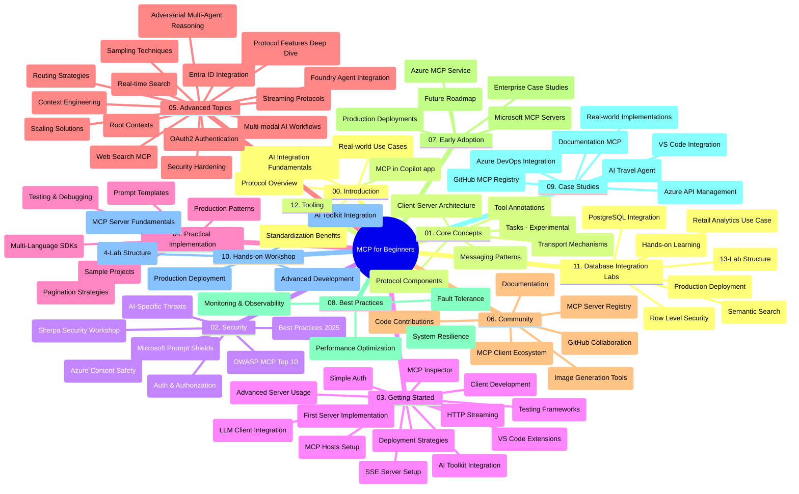

# Model Context Protocol (MCP) aloittelijoille - Opas

Tämä opas tarjoaa yleiskatsauksen "Model Context Protocol (MCP) aloittelijoille" -oppimateriaalin arkistorakenteesta ja sisällöstä. Käytä tätä opasta navigoidaksesi arkistossa tehokkaasti ja hyödyntääksesi saatavilla olevat resurssit parhaalla mahdollisella tavalla.

## Arkiston yleiskatsaus

Model Context Protocol (MCP) on standardoitu kehys tekoälymallien ja asiakasohjelmien vuorovaikutukselle. Alun perin Anthropicin luoma MCP on nyt MCP-yhteisön ylläpitämä virallisen GitHub-organisaation kautta. Tämä arkisto tarjoaa kattavan oppimateriaalin käytännön koodiesimerkkien kera C#, Java, JavaScript, Python ja TypeScript -ohjelmointikielillä, suunnattuna tekoälykehittäjille, järjestelmäarkkitehdeille ja ohjelmistoinsinööreille.

## Visuaalinen oppimateriaalikartta

## Arkiston rakenne

Arkisto on järjestetty kahteentoista pääosioon, joista kukin keskittyy eri MCP:n osa-alueisiin:

1. **Johdanto (00-Introduction/)**
   - Yleiskatsaus Model Context Protocolliin
   - Miksi standardointi on tärkeää tekoälyputkistoissa
   - Käytännön käyttötapaukset ja hyödyt

2. **Keskeiset käsitteet (01-CoreConcepts/)**
   - Asiakas-palvelin-arkkitehtuuri
   - Tärkeimmät protokollan osat
   - Viestintämallit MCP:ssä
   - Nykyinen spesifikaatio: [Mitä MCP:ssä on muuttunut: 2026-07-28 spesifikaatio](./01-CoreConcepts/mcp-2026-07-28.md) — tilaton protokollan ydin, laajennuskehys sekä Roots/Sampling/Logging poistot käytöstä

3. **Turvallisuus (02-Security/)**
   - MCP-pohjaisten järjestelmien turvallisuusuhat
   - Parhaat käytännöt suojausten toteuttamiseen
   - Todentamis- ja valtuutusstrategiat
   - Käytännön [CIMD- ja DCR-valtuutusnäyte](./02-Security/samples/cimd-dcr-auth/README.md)
   - **Laaja turvallisuusdokumentaatio**:
     - MCP:n turvallisuuden parhaat käytännöt
     - Azure Content Safetyn toteutusopas
     - MCP:n turvakontrollit ja -tekniikat
     - MCP:n parhaiden käytäntöjen pikaopas
   - **Keskeiset turvallisuusaiheet**:
     - Promptien injektio ja työkalujen myrkytys
     - Istunnon kaappaaminen ja sekaakin joutuva lähetin -ongelmat
     - Tokenin läpiviennin haavoittuvuudet
     - Liialliset oikeudet ja pääsynhallinta
     - Toimitusketjun turvallisuus tekoälykohteissa
     - Microsoft Prompt Shields -integraatio

4. **Aloittaminen (03-GettingStarted/)**
   - Kehitysympäristön asennus ja konfigurointi
   - Perus MCP-palvelimien ja asiakkaiden luominen
   - Integrointi olemassa oleviin sovelluksiin
   - Sisältää osiot:
     - Ensimmäinen palvelinintegrointi
     - Asiakaskehitys
     - LLM-asiakasintegraatio
     - VS Code -integraatio
     - Server-Sent Events (SSE) -palvelin
     - Edistynyt palvelimen käyttö
     - HTTP-suoratoisto
     - AI Toolkit -integraatio
     - Testausstrategiat
     - Julkaisun ohjeet

5. **Käytännön toteutus (04-PracticalImplementation/)**
   - SDK:iden käyttö eri ohjelmointikielissä
   - Virheenkorjaus, testaus ja validointimenetelmät
   - Uudelleenkäytettävien prompt-mallien ja työnkulkujen luonti
   - Esimerkkiprojekteja toteutusesimerkkien kera

6. **Edistyneet aiheet (05-AdvancedTopics/)**
   - Kontekstisuunnittelutekniikat
   - Foundry-agentin integraatio
   - Monimodaaliset tekoälytyönkulut
   - OAuth2-todennusdemot
   - Reaaliaikaiset hakutoiminnot
   - Reaaliaikainen suoratoisto
   - Root-kontekstien toteutus
   - Reititysstrategiat
   - Otantatekniikat
   - Skaalausmenetelmät
   - Turvallisuusnäkökohdat
   - Entra ID:n turvallisuusintegraatio
   - Verkkohakuintegraatio
   - Adversarial multi-agent reasoning (väittelymallit)

7. **Yhteisön kontribuutiot (06-CommunityContributions/)**
   - Kuinka osallistua koodin ja dokumentaation kehitykseen
   - Yhteistyö GitHubin kautta
   - Yhteisön ajamat parannukset ja palaute
   - Erilaisten MCP-asiakkaiden käyttö (Claude Desktop, Cline, VSCode)
   - Työskentely suosittujen MCP-palvelimien kanssa, mukaan lukien kuvantuotanto

8. **Kokemuksia varhaisesta käyttöönotosta (07-LessonsfromEarlyAdoption/)**
   - Todelliset toteutukset ja menestystarinat
   - MCP-pohjaisten ratkaisujen rakentaminen ja käyttöönotto
   - Trendit ja tulevaisuuden tiekartta
   - **Microsoft MCP -palvelinohje**: Kattava opas kymmeneen tuotantovalmiiseen Microsoft MCP -palvelimeen, mukaan lukien:
     - Microsoft Learn Docs MCP Server
     - Azure MCP Server (yli 15 erikoistunutta liitintä)
     - GitHub MCP Server
     - Azure DevOps MCP Server
     - MarkItDown MCP Server
     - SQL Server MCP Server
     - Playwright MCP Server
     - Dev Box MCP Server
     - Microsoft Foundry MCP Server
     - Microsoft 365 Agents Toolkit MCP Server

9. **Parhaat käytännöt (08-BestPractices/)**
   - Suorituskyvyn virittäminen ja optimointi
   - Vikasietoisien MCP-järjestelmien suunnittelu
   - Testaus ja resilienssistrategiat

10. **Tapaustutkimukset (09-CaseStudy/)**
    - **Seitsemän kattavaa tapaustutkimusta** jotka demonstroivat MCP:n monipuolisuutta eri käyttötapauksissa:
    - **Azure AI Travel Agents**: Moni-agenttien orkestrointi Azure OpenAI:n ja AI Searchin avulla
    - **Azure DevOps -integraatio**: Työnkulkujen automatisointi YouTube-data päivityksillä
    - **Reaaliaikainen dokumentaation haku**: Pythonin konsoli-asiakas suoratoistavalla HTTP:llä
    - **Interaktiivinen opintosuunnitelman luoja**: Chainlit-verkkosovellus keskusteleva tekoälyllä
    - **Editorin sisäinen dokumentaatio**: VS Code -integraatio GitHub Copilotin työnkulkujen kanssa
    - **Azure API Management**: Yritysrajapintaintegraatio MCP-palvelimen luonnilla
    - **GitHub MCP Registry**: Ekosysteemin kehittäminen ja agenttipohjainen integraatioalusta
    - Toteutusesimerkkejä yritysintegraatioista, kehittäjien tuottavuudesta ja ekosysteemin kehityksestä

11. **Käytännön työpaja (10-StreamliningAIWorkflowsBuildingAnMCPServerWithAIToolkit/)**
    - Kattava käytännön työpaja, joka yhdistää MCP:n ja AI Toolkitin
    - Älykkäiden sovellusten rakentaminen, jotka yhdistävät tekoälymallit todellisiin työkaluihin
    - Käytännön moduulit, jotka kattavat perusteet, mukautetun palvelinkehityksen ja tuotantoon käyttöönoton strategiat
    - **Labien rakenne**:
      - Lab 1: MCP-palvelimen perusteet
      - Lab 2: Edistynyt MCP-palvelinkehitys
      - Lab 3: AI Toolkit -integraatio
      - Lab 4: Tuotantokäyttöön ottaminen ja skaalaus
    - Lab-pohjainen oppimismetodi askel askeleelta ohjeistuksella

12. **MCP-palvelinten tietokantaintegraatiolabrat (11-MCPServerHandsOnLabs/)**
    - **Kattava 13-labraryhmä** tuotantovalmiiden MCP-palvelinten rakentamiseen PostgreSQL-integraatiolla
    - **Todellisen maailman vähittäiskaupan analytiikan toteutus** Zava Retail -tapaus
    - **Yritystason mallit**, mm. rivitason tietoturva (RLS), semanttinen haku ja monivuokraajaisten tietojen hallinta
    - **Täydellinen labien rakenne**:
      - **Labit 00–03: Perusteet** — Johdanto, Arkkitehtuuri, Turvallisuus, Ympäristön pystytys
      - **Labit 04–06: MCP-palvelimen rakentaminen** — Tietokannan suunnittelu, MCP-palvelimen toteutus, työkalujen kehitys
      - **Labit 07–09: Edistyneet ominaisuudet** — Semanttinen haku, Testaus ja virheenkorjaus, VS Coden integraatio
      - **Labit 10–12: Tuotanto & parhaat käytännöt** — Käyttöönotto, seuranta, optimointi
    - **Käytetyt teknologiat**: FastMCP-kehys, PostgreSQL, Azure OpenAI, Azure Container Apps, Application Insights
    - **Oppimistavoitteet**: Tuotantovalmiit MCP-palvelimet, tietokantaintegraatiomallit, tekoälyllä tehostettu analytiikka, yritysturvallisuus

13. **Työkalut (12-tooling/)**
    - Opastus MCP:n käyttöön Copilot-sovelluksessa ja muissa työkaluissa

## Lisäresurssit

Arkisto sisältää tukiresursseja:

- **Kuvat-kansio**: Sisältää kaavioita ja kuvituksia, joita käytetään oppimateriaalissa
- **Käännökset**: Monikielinen tuki automaattisilla dokumentaation käännöksillä
- **Viralliset MCP-resurssit**:
  - [MCP-dokumentaatio](https://modelcontextprotocol.io/)
  - [MCP-spesifikaatio](https://modelcontextprotocol.io/specification/2026-07-28/)
  - [MCP GitHub -arkisto](https://github.com/modelcontextprotocol)

## Kuinka käyttää tätä arkistoa

1. **Järjestelmällinen oppiminen**: Seuraa lukuja järjestyksessä (00–11) saadaksesi rakenteellisen oppimiskokemuksen.
2. **Kielikohtainen painotus**: Jos olet kiinnostunut jostain tietystä ohjelmointikielestä, tutki esimerkkihakemistoja preferoitujen kieliesi toteutuksia varten.
3. **Käytännön toteutus**: Aloita "Getting Started" -osiosta ympäristön pystytykseen ja ensimmäisen MCP-palvelimen ja asiakkaan luomiseen.
4. **Edistynyt tutkimus**: Kun perusteet ovat hallussa, suuntaudu edistyneisiin aiheisiin laajentaaksesi osaamistasi.
5. **Yhteisön osallistaminen**: Liity MCP-yhteisöön GitHub-keskustelujen ja Discord-kanavien kautta, yhteydenpito asiantuntijoiden ja kehittäjäkollegoiden kanssa.

## MCP-asiakkaat ja työkalut

Oppimateriaali kattaa erilaiset MCP-asiakkaat ja työkalut:

1. **Viralliset asiakkaat**:
   - Visual Studio Code 
   - MCP Visual Studio Codessa
   - Claude Desktop
   - Claude VSCodessa
   - Claude API

2. **Yhteisöasiakkaat**:
   - Cline (päätteeseen perustuva)
   - Cursor (koodieditori)
   - ChatMCP
   - Windsurf

3. **MCP-hallintatyökalut**:
   - MCP CLI
   - MCP Manager
   - MCP Linker
   - MCP Router

## Suositut MCP-palvelimet

Arkisto esittelee erilaisia MCP-palvelimia, mukaan lukien:

1. **Viralliset Microsoft MCP -palvelimet**:
   - Microsoft Learn Docs MCP Server
   - Azure MCP Server (yli 15 erikoissovitinta)
   - GitHub MCP Server
   - Azure DevOps MCP Server
   - MarkItDown MCP Server
   - SQL Server MCP Server
   - Playwright MCP Server
   - Dev Box MCP Server
   - Microsoft Foundry MCP Server
   - Microsoft 365 Agents Toolkit MCP Server

2. **Viralliset referenssipalvelimet**:
   - Filesystem
   - Fetch
   - Memory
   - Sequential Thinking

3. **Kuvantuotanto**:
   - Azure OpenAI DALL-E 3
   - Stable Diffusion WebUI
   - Replicate

4. **Kehitystyökalut**:
   - Git MCP
   - Terminal Control
   - Code Assistant

5. **Erikoistuneet palvelimet**:
   - Salesforce
   - Microsoft Teams
   - Jira & Confluence

## Osallistuminen

Tämä arkisto toivottaa yhteisön panokset tervetulleiksi. Katso Yhteisön kontribuutioiden osio saadaksesi ohjeita tehokkaaseen osallistumiseen MCP-ekosysteemissä.

----

*Tämä opas päivitettiin viimeksi 9. syyskuuta 2026. Se heijastaa MCP:n
spesifikaatiota `2026-07-28`, nykyistä protokollan versiota. Jotkin käytännön
esimerkit ovat edelleen yksiselitteisesti versioitu `2025-11-25` -versioon, kun taas niiden SDK:t ja työkalut
ottavat käyttöön tilattomat protokolla-API:t.*

---

<!-- CO-OP TRANSLATOR DISCLAIMER START -->
**Vastuuvapauslauseke**:
Tämä asiakirja on käännetty käyttämällä tekoälypohjaista käännöspalvelua [Co-op Translator](https://github.com/Azure/co-op-translator). Vaikka pyrimme tarkkuuteen, otathan huomioon, että automaattiset käännökset saattavat sisältää virheitä tai epätarkkuuksia. Alkuperäinen asiakirja sen alkuperäiskielellä on virallinen lähde. Tärkeissä asioissa suositellaan ammattimaista ihmiskäännöstä. Emme ole vastuussa tämän käännöksen käytöstä aiheutuvista väärinymmärryksistä tai tulkinnoista.
<!-- CO-OP TRANSLATOR DISCLAIMER END -->