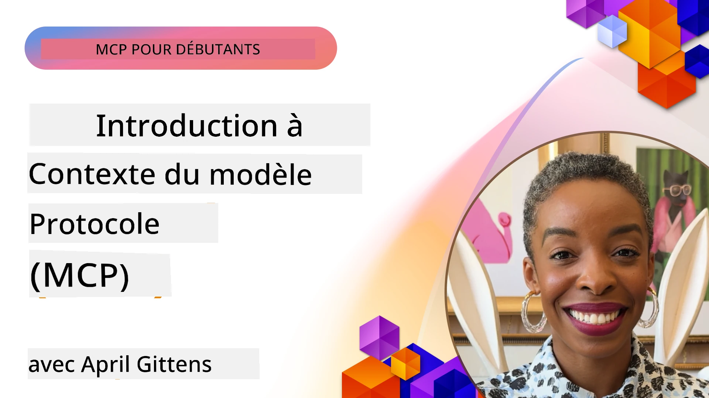
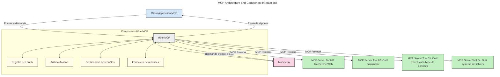
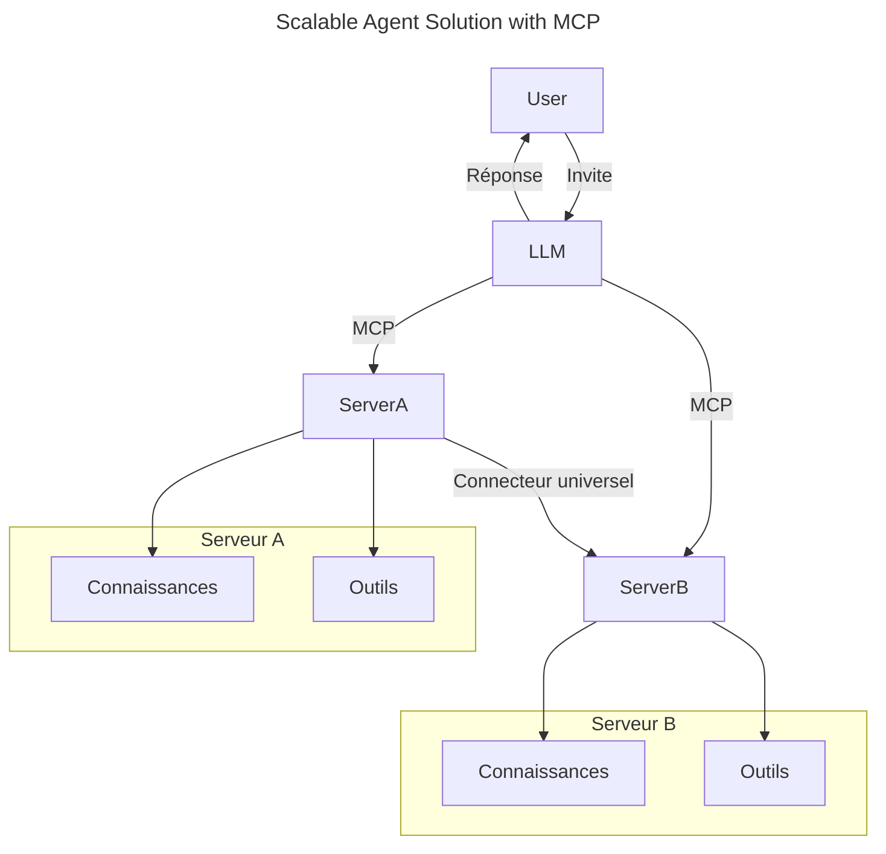
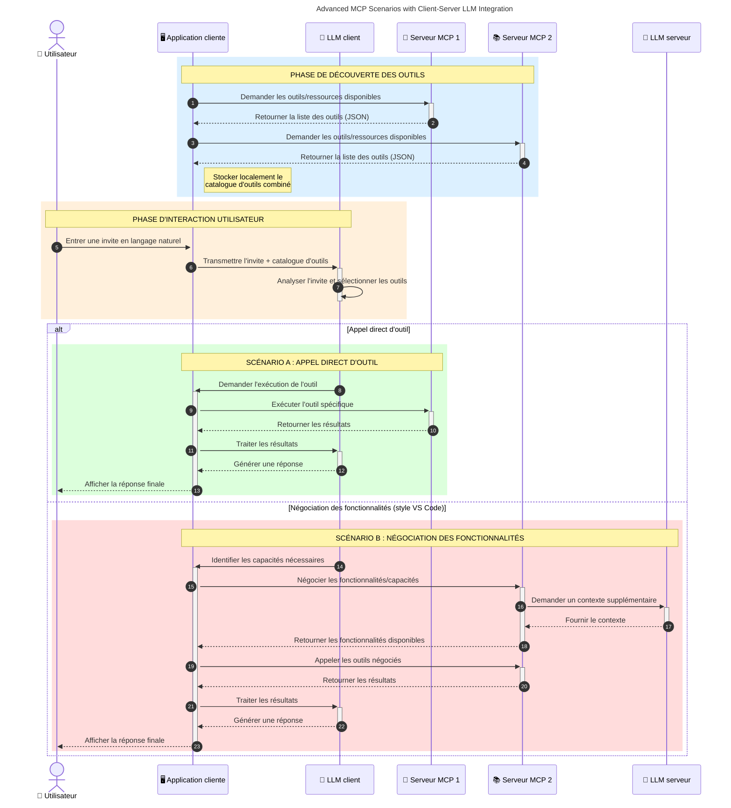

# Introduction au protocole de contexte de modèle (MCP) : Pourquoi c'est important pour les applications d'IA évolutives

_(Cliquez sur l’image ci-dessus pour regarder la vidéo de cette leçon)_

Les applications d'IA générative représentent un grand pas en avant car elles permettent souvent à l'utilisateur d'interagir avec l'application via des invites en langage naturel. Cependant, à mesure que plus de temps et de ressources sont investis dans ces applications, vous souhaitez vous assurer de pouvoir intégrer facilement des fonctionnalités et des ressources de manière à ce qu'elles soient faciles à étendre, que votre application puisse prendre en charge plus d'un modèle utilisé et gérer diverses complexités des modèles. En résumé, créer des applications d'IA générative est facile au début, mais à mesure qu'elles grandissent et deviennent plus complexes, vous devez commencer à définir une architecture et vous appuyer probablement sur une norme pour garantir que vos applications soient construites de manière cohérente. C’est là qu’intervient le MCP pour organiser les choses et fournir une norme.

---

## **🔍 Qu'est-ce que le protocole de contexte de modèle (MCP) ?**

Le **protocole de contexte de modèle (MCP)** est une **interface ouverte et normalisée** qui permet aux grands modèles de langage (LLM) d’interagir de manière transparente avec des outils externes, des API, et des sources de données. Il fournit une architecture cohérente pour améliorer la fonctionnalité des modèles d'IA au-delà de leurs données d'entraînement, permettant des systèmes d'IA plus intelligents, évolutifs et réactifs.

---

## **🎯 Pourquoi la normalisation est importante en IA**

À mesure que les applications d'IA générative deviennent plus complexes, il est essentiel d’adopter des normes garantissant **l’évolutivité, l’extensibilité, la maintenabilité** et **d’éviter le verrouillage fournisseur**. Le MCP répond à ces besoins en :

- Unifiant les intégrations modèle-outil
- Réduisant les solutions personnalisées fragiles et ponctuelles
- Permettant à plusieurs modèles de fournisseurs différents de coexister dans un même écosystème

**Note :** Bien que le MCP se présente comme une norme ouverte, il n'est pas prévu de standardiser le MCP via des organismes de normalisation existants comme IEEE, IETF, W3C, ISO ou tout autre organisme de normalisation.

---

## **📚 Objectifs d'apprentissage**

À la fin de cet article, vous serez capable de :

- Définir le **protocole de contexte de modèle (MCP)** et ses cas d'utilisation
- Comprendre comment le MCP standardise la communication modèle-outil
- Identifier les composants clés de l'architecture MCP
- Explorer des applications concrètes du MCP en entreprise et dans un contexte de développement

---

## **💡 Pourquoi le protocole de contexte de modèle (MCP) change la donne**

### **🔗 Le MCP résout la fragmentation des interactions en IA**

Avant le MCP, l'intégration des modèles avec les outils nécessitait :

- Du code personnalisé par paire outil-modèle
- Des API non normalisées pour chaque fournisseur
- Des coupures fréquentes dues aux mises à jour
- Une faible évolutivité avec l’augmentation des outils

### **✅ Avantages de la normalisation MCP**

| **Avantage**              | **Description**                                                                |
|--------------------------|--------------------------------------------------------------------------------|
| Interopérabilité         | Les LLM fonctionnent de manière fluide avec des outils de différents fournisseurs |
| Cohérence                | Comportement uniforme sur plateformes et outils                                |
| Réutilisabilité          | Les outils créés une fois peuvent être utilisés dans plusieurs projets et systèmes|
| Développement Accéléré   | Réduit le temps de dev en utilisant des interfaces standardisées et plug-and-play|

---

## **🧱 Vue d’ensemble de l’architecture MCP à haut niveau**

MCP suit un **modèle client-serveur**, où :

- Les **hôtes MCP** exécutent les modèles d’IA
- Les **clients MCP** initient les requêtes
- Les **serveurs MCP** fournissent le contexte, les outils et les capacités

### **Composants clés :**

- **Ressources** – Données statiques ou dynamiques pour les modèles  
- **Invites** – Flux de travail prédéfinis pour une génération guidée  
- **Outils** – Fonctions exécutables comme recherche, calculs  
- **Échantillonnage** – Comportement agentique via interactions récursives (déprécié dans
    MCP `2026-07-28`; les nouvelles implémentations doivent s’intégrer directement avec un fournisseur de LLM)

- **Élicitation** – Requêtes initiées par le serveur pour obtenir des entrées utilisateur
- **Racines** – Emplacements informatifs dans le système de fichiers pertinents à un serveur
    (déprécié dans MCP `2026-07-28`; préférez les paramètres d’outils, les URI de ressources ou
    la configuration du serveur)

### **Architecture du protocole :**

MCP utilise une architecture à deux couches :
- **Couche des données** : Messages JSON-RPC 2.0, métadonnées par requête, découverte, et primitives du protocole
- **Couche de transport** : stdio pour processus locaux et HTTP Streamable pour
    serveurs distants. HTTP Streamable peut utiliser le découpage SSE pour les réponses en flux continu,
    mais l'ancien transport HTTP+SSE est déprécié.

    1. Une requête est initiée par un utilisateur final ou un logiciel agissant en son nom.
    2. Le **client MCP** envoie la requête à un **hôte MCP**, qui gère le runtime du modèle IA.
    3. Le **modèle IA** reçoit l’invite de l’utilisateur et peut demander l’accès à des outils externes ou données via un ou plusieurs appels d’outils.
    4. L’**hôte MCP**, et non le modèle directement, communique avec les **serveurs MCP** appropriés via le protocole standardisé.
- **Fonctionnalité de l’hôte MCP** :
    - **Registre des outils** : Maintient un catalogue des outils disponibles et leurs capacités.
    - **Authentification** : Vérifie les permissions d’accès aux outils.
    - **Gestionnaire de requêtes** : Traite les demandes d’outils entrantes du modèle.
    - **Formateur de réponses** : Structure les sorties des outils dans un format compréhensible par le modèle.
- **Exécution sur le serveur MCP** :
    - L’**hôte MCP** transmet les appels d’outils à un ou plusieurs **serveurs MCP**, chacun exposant des fonctions spécialisées (ex. recherche, calculs, requêtes en base de données).
    - Les **serveurs MCP** accomplissent leurs opérations respectives et renvoient les résultats à l’**hôte MCP** dans un format cohérent.
    - L’**hôte MCP** formate et relaie ces résultats au **modèle IA**.
- **Finalisation de la réponse** :
    - Le **modèle IA** intègre les sorties des outils dans une réponse finale.
    - L’**hôte MCP** envoie cette réponse au **client MCP**, qui la transmet à l’utilisateur final ou au logiciel appelant.
    

## 👨‍💻 Comment construire un serveur MCP (avec exemples)

Les serveurs MCP vous permettent d'étendre les capacités des LLM en fournissant des données et des fonctionnalités. 

Prêt à essayer ? Voici des SDK spécifiques aux langages et/ou stacks avec des exemples de création de serveurs MCP simples dans différents langages/stacks :

- **SDK Python** : https://github.com/modelcontextprotocol/python-sdk

- **SDK TypeScript** : https://github.com/modelcontextprotocol/typescript-sdk

- **SDK Java** : https://github.com/modelcontextprotocol/java-sdk

- **SDK C#/.NET** : https://github.com/modelcontextprotocol/csharp-sdk

## 🌍 Cas d’usage réels pour MCP

MCP permet un large éventail d’applications en étendant les capacités de l’IA :

| **Application**              | **Description**                                                                |
|------------------------------|--------------------------------------------------------------------------------|
| Intégration de données d’entreprise  | Connecter les LLM à des bases de données, CRM, ou outils internes                |
| Systèmes IA agentiques              | Permettre des agents autonomes avec accès aux outils et workflows décisionnels  |
| Applications multimodales           | Combiner outils texte, image et audio dans une seule application IA unifiée    |
| Intégration de données en temps réel | Apporter des données en direct dans les interactions IA pour des résultats plus précis et actuels |

### 🧠 MCP = Norme universelle pour les interactions IA

Le protocole de contexte de modèle (MCP) agit comme une norme universelle pour les interactions avec l’IA, un peu comme USB-C a standardisé les connexions physiques des appareils. Dans le monde de l’IA, MCP fournit une interface cohérente, permettant aux modèles (clients) de s’intégrer sans couture avec des outils externes et des fournisseurs de données (serveurs). Cela élimine le besoin de protocoles divers et personnalisés pour chaque API ou source de données.

Avec MCP, un outil compatible MCP (appelé serveur MCP) suit une norme unifiée. Ces serveurs peuvent lister les outils ou actions qu’ils offrent et exécuter ces actions sur demande d’un agent IA. Les plateformes d'agents IA supportant MCP peuvent découvrir les outils disponibles des serveurs et les invoquer via ce protocole standard.

### 💡 Facilite l’accès au savoir

Au-delà d’offrir des outils, MCP facilite aussi l’accès au savoir. Il permet aux applications de fournir du contexte aux grands modèles de langage (LLM) en les reliant à différentes sources de données. Par exemple, un serveur MCP pourrait représenter le référentiel documentaire d’une entreprise, permettant aux agents de récupérer des informations pertinentes à la demande. Un autre serveur pourrait gérer des actions spécifiques comme l’envoi d’emails ou la mise à jour d’enregistrements. Du point de vue de l’agent, ce sont simplement des outils qu’il peut utiliser — certains renvoient des données (contexte de connaissance), d’autres exécutent des actions. MCP gère efficacement les deux.

Un agent connecté à un serveur MCP apprend automatiquement les capacités disponibles du serveur et les données accessibles via un format standard. Cette normalisation permet la disponibilité dynamique des outils. Par exemple, ajouter un nouveau serveur MCP au système d’un agent rend ses fonctions immédiatement utilisables sans personnalisation supplémentaire des instructions de l’agent.

Cette intégration simplifiée correspond au flux représenté dans le diagramme suivant, où les serveurs fournissent à la fois outils et savoir, assurant une collaboration fluide entre systèmes. 

### 👉 Exemple : Solution d’agent évolutif

Le Connecteur Universel permet aux serveurs MCP de communiquer et de partager leurs capacités entre eux, permettant à ServerA de déléguer des tâches à ServerB ou d’accéder à ses outils et savoir. Cela fédère outils et données entre serveurs, soutenant des architectures d’agents évolutives et modulaires. Parce que MCP standardise l’exposition des outils, les agents peuvent découvrir dynamiquement et router les requêtes entre serveurs sans intégrations codées en dur.

Fédération des outils et du savoir : outils et données accessibles à travers plusieurs serveurs, permettant des architectures agentiques plus évolutives et modulaires.

### 🔄 Scénarios avancés MCP avec intégration de LLM côté client

Au-delà de l’architecture MCP basique, il existe des scénarios avancés où à la fois client et serveur contiennent des LLM, permettant des interactions plus sophistiquées. Dans le diagramme suivant, **l'application client** pourrait être un IDE avec plusieurs outils MCP disponibles pour utilisation par le LLM :

## 🔐 Avantages pratiques du MCP

Voici les avantages pratiques de l’usage du MCP :

- **Actualisation** : Les modèles peuvent accéder à des informations à jour au-delà de leurs données d'entraînement
- **Extension des capacités** : Les modèles peuvent utiliser des outils spécialisés pour des tâches pour lesquelles ils n’ont pas été entraînés
- **Réduction des hallucinations** : Les sources de données externes fournissent un socle factuel
- **Confidentialité** : Les données sensibles peuvent rester dans des environnements sécurisés au lieu d’être intégrées dans les invites

## 📌 Points clés à retenir

Voici les points clés à retenir pour utiliser MCP :

- Le **MCP** standardise la manière dont les modèles IA interagissent avec les outils et les données
- Favorise **l’extensibilité, la cohérence, et l’interopérabilité**
- MCP aide à **réduire le temps de développement, améliorer la fiabilité, et étendre les capacités des modèles**
- L’architecture client-serveur **permet des applications IA flexibles et extensibles**

## 🧠 Exercice

Pensez à une application d'IA que vous souhaitez construire.

- Quels **outils ou données externes** pourraient améliorer ses capacités ?
- Comment le MCP pourrait-il rendre l’intégration **plus simple et plus fiable ?**

## Ressources supplémentaires

- [Dépôt GitHub MCP](https://github.com/modelcontextprotocol)

## Quelle est la suite

Suivant : [Chapitre 1 : Concepts fondamentaux](../01-CoreConcepts/README.md)

---

<!-- CO-OP TRANSLATOR DISCLAIMER START -->
**Avertissement** :
Ce document a été traduit à l'aide du service de traduction automatique [Co-op Translator](https://github.com/Azure/co-op-translator). Bien que nous nous efforçions d'assurer l'exactitude, veuillez noter que les traductions automatisées peuvent contenir des erreurs ou des inexactitudes. Le document original dans sa langue native doit être considéré comme la source faisant autorité. Pour les informations critiques, il est recommandé de recourir à une traduction professionnelle réalisée par un humain. Nous ne saurions être tenus responsables des malentendus ou erreurs d'interprétation découlant de l'utilisation de cette traduction.
<!-- CO-OP TRANSLATOR DISCLAIMER END -->