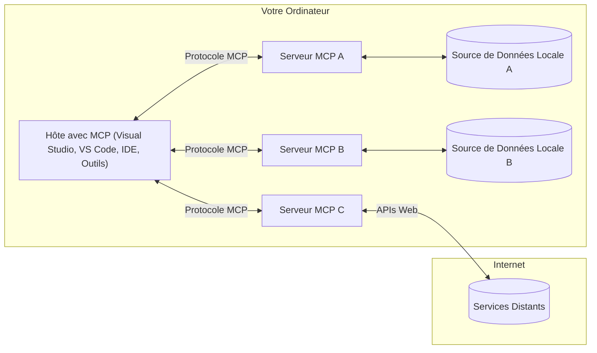

# Concepts fondamentaux de MCP : Maîtriser le Model Context Protocol pour l'intégration de l'IA

[](https://youtu.be/earDzWGtE84)

_(Cliquez sur l'image ci-dessus pour visionner la vidéo de cette leçon)_

Le [Model Context Protocol (MCP)](https://github.com/modelcontextprotocol) est un cadre puissant et standardisé qui optimise la communication entre les grands modèles de langage (LLM) et les outils, applications et sources de données externes.  
Ce guide vous expliquera les concepts fondamentaux de MCP. Vous apprendrez son architecture client-serveur, ses composants essentiels, les mécanismes de communication et les meilleures pratiques d'implémentation.

- **Consentement explicite de l'utilisateur** : Tout accès aux données et toute opération nécessitent l'approbation explicite de l'utilisateur avant exécution. Les utilisateurs doivent comprendre clairement quelles données seront accessibles et quelles actions seront effectuées, avec un contrôle granulaire des permissions et autorisations.

- **Protection de la confidentialité des données** : Les données utilisateur ne sont exposées qu'avec un consentement explicite et doivent être protégées par des contrôles d'accès robustes tout au long du cycle d'interaction. Les implémentations doivent empêcher la transmission non autorisée des données et maintenir des frontières strictes de confidentialité.

- **Sécurité d'exécution des outils** : Chaque invocation d'outil nécessite un consentement explicite de l'utilisateur avec une compréhension claire des fonctionnalités, paramètres et impacts potentiels de l'outil. Des frontières de sécurité robustes doivent empêcher l'exécution non intentionnelle, non sécurisée ou malveillante des outils.

- **Sécurité de la couche transport** : Tous les canaux de communication doivent utiliser des mécanismes appropriés de chiffrement et d'authentification. Les connexions distantes doivent implémenter des protocoles de transport sécurisés et une gestion correcte des identifiants.

#### Directives d'implémentation :

- **Gestion des permissions** : Implémentez des systèmes de permissions fines permettant aux utilisateurs de contrôler quels serveurs, outils et ressources sont accessibles  
- **Authentification & Autorisation** : Utilisez des méthodes d'authentification sécurisées (OAuth, clés API) avec une gestion appropriée des jetons et leur expiration  
- **Validation des entrées** : Validez tous les paramètres et données d'entrée selon des schémas définis pour prévenir les attaques par injection  
- **Journalisation d'audit** : Maintenez des journaux complets de toutes les opérations pour la surveillance de la sécurité et la conformité

## Vue d'ensemble

Cette leçon explore l'architecture fondamentale et les composants qui composent l'écosystème du Model Context Protocol (MCP). Vous découvrirez l'architecture client-serveur, les composants clés et les mécanismes de communication qui alimentent les interactions MCP.

## Objectifs clés d'apprentissage

À la fin de cette leçon, vous serez capable de :

- Comprendre l'architecture client-serveur de MCP.  
- Identifier les rôles et responsabilités des Hôtes, Clients et Serveurs.  
- Analyser les fonctionnalités principales qui font de MCP une couche d'intégration flexible.  
- Apprendre comment l'information circule dans l'écosystème MCP.  
- Obtenir des insights pratiques à travers des exemples de code en .NET, Java, Python et JavaScript.

## Architecture MCP : un regard approfondi

L'écosystème MCP est construit sur un modèle client-serveur. Cette structure modulaire permet aux applications d'IA d'interagir efficacement avec des outils, bases de données, API et ressources contextuelles. Décomposons cette architecture en ses composants fondamentaux.

Au cœur, MCP suit une architecture client-serveur où une application hôte peut se connecter à plusieurs serveurs :


- **Hôtes MCP** : Programmes comme VSCode, Claude Desktop, IDEs ou outils IA souhaitant accéder aux données via MCP  
- **Clients MCP** : Clients du protocole qui maintiennent des connexions 1:1 avec les serveurs  
- **Serveurs MCP** : Programmes légers qui exposent chacun des capacités spécifiques via le Model Context Protocol standardisé  
- **Sources de données locales** : Fichiers, bases de données et services de votre ordinateur auxquels les serveurs MCP peuvent accéder de manière sécurisée  
- **Services distants** : Systèmes externes accessibles via internet auxquels les serveurs MCP peuvent se connecter via des API.

Le protocole MCP est une norme évolutive utilisant une version basée sur la date (format AAAA-MM-JJ). La version actuelle du protocole est **2025-11-25**. Vous pouvez consulter les dernières mises à jour de la [spécification du protocole](https://modelcontextprotocol.io/specification/2025-11-25/)

### 1. Hôtes

Dans le Model Context Protocol (MCP), les **Hôtes** sont des applications d'IA qui servent d'interface principale par laquelle les utilisateurs interagissent avec le protocole. Les hôtes coordonnent et gèrent les connexions à plusieurs serveurs MCP en créant des clients MCP dédiés pour chaque connexion serveur. Exemples d'hôtes :

- **Applications IA** : Claude Desktop, Visual Studio Code, Claude Code  
- **Environnements de développement** : IDEs et éditeurs de code avec intégration MCP  
- **Applications personnalisées** : Agents IA et outils conçus sur mesure

Les **Hôtes** sont des applications qui orchestrent les interactions avec les modèles IA. Ils :

- **Orchestrent les modèles IA** : Exécutent ou interagissent avec les LLM pour générer des réponses et coordonner les workflows IA  
- **Gèrent les connexions clients** : Créent et maintiennent un client MCP par connexion serveur MCP  
- **Contrôlent l'interface utilisateur** : Gèrent le flux de conversation, les interactions utilisateur et la présentation des réponses  
- **Appliquent la sécurité** : Contrôlent les permissions, contraintes de sécurité et authentification  
- **Gèrent le consentement utilisateur** : Administrent l'approbation utilisateur pour le partage des données et l'exécution des outils

### 2. Clients

Les **Clients** sont des composants essentiels qui maintiennent des connexions dédiées en un-à-un entre les Hôtes et les serveurs MCP. Chaque client MCP est instancié par l'hôte pour se connecter à un serveur MCP spécifique, assurant des canaux de communication organisés et sécurisés. Plusieurs clients permettent aux hôtes de se connecter simultanément à plusieurs serveurs.

Les **Clients** sont des composants connecteurs au sein de l'application hôte. Ils :

- **Communication protocolaire** : Envoient des requêtes JSON-RPC 2.0 aux serveurs avec des invites et instructions  
- **Négociation des capacités** : Négocient les fonctionnalités supportées et versions du protocole avec les serveurs lors de l'initialisation  
- **Exécution d'outils** : Gèrent les requêtes d'exécution d'outils provenant des modèles et traitent les réponses  
- **Mises à jour en temps réel** : Gèrent les notifications et mises à jour en temps réel des serveurs  
- **Traitement des réponses** : Traitent et formatent les réponses des serveurs pour affichage aux utilisateurs

### 3. Serveurs

Les **Serveurs** sont des programmes qui fournissent contexte, outils et capacités aux clients MCP. Ils peuvent s'exécuter localement (sur la même machine que l'hôte) ou à distance (sur des plateformes externes), et sont responsables de traiter les requêtes clients et de fournir des réponses structurées. Les serveurs exposent des fonctionnalités spécifiques via le Model Context Protocol standardisé.

Les **Serveurs** sont des services qui fournissent contexte et capacités. Ils :

- **Enregistrement des fonctionnalités** : Enregistrent et exposent les primitives disponibles (ressources, invites, outils) aux clients  
- **Traitement des requêtes** : Reçoivent et exécutent les appels d'outils, requêtes de ressources et d'invites des clients  
- **Fourniture de contexte** : Fournissent des informations contextuelles et des données pour enrichir les réponses des modèles  
- **Gestion d'état** : Maintiennent l'état de session et gèrent les interactions avec état si nécessaire  
- **Notifications en temps réel** : Envoient des notifications sur les changements de capacités et mises à jour aux clients connectés

Les serveurs peuvent être développés par quiconque pour étendre les capacités des modèles avec des fonctionnalités spécialisées, et ils supportent à la fois les scénarios de déploiement local et distant.

### 4. Primitives Serveur

Les serveurs dans le Model Context Protocol (MCP) fournissent trois **primitives** principales qui définissent les blocs fondamentaux pour des interactions riches entre clients, hôtes et modèles de langage. Ces primitives spécifient les types d'informations contextuelles et d'actions disponibles via le protocole.

Les serveurs MCP peuvent exposer toute combinaison des trois primitives principales suivantes :

#### Ressources

Les **Ressources** sont des sources de données fournissant des informations contextuelles aux applications IA. Elles représentent un contenu statique ou dynamique qui peut améliorer la compréhension et la prise de décision du modèle :

- **Données contextuelles** : Informations structurées et contexte pour la consommation par le modèle IA  
- **Bases de connaissances** : Répertoires de documents, articles, manuels et publications de recherche  
- **Sources de données locales** : Fichiers, bases de données et informations système locales  
- **Données externes** : Réponses d'API, services web et données de systèmes distants  
- **Contenu dynamique** : Données en temps réel qui se mettent à jour selon les conditions externes

Les ressources sont identifiées par des URI et supportent la découverte via les méthodes `resources/list` et la récupération via `resources/read` :

```text
file://documents/project-spec.md
database://production/users/schema
api://weather/current
```

#### Invites

Les **Invites** sont des modèles réutilisables qui aident à structurer les interactions avec les modèles de langage. Elles fournissent des schémas d'interaction standardisés et des workflows modélisés :

- **Interactions basées sur des modèles** : Messages pré-structurés et amorces de conversation  
- **Modèles de workflow** : Séquences standardisées pour tâches et interactions courantes  
- **Exemples few-shot** : Modèles basés sur des exemples pour l'instruction des modèles  
- **Invites système** : Invites fondamentales qui définissent le comportement et le contexte du modèle  
- **Modèles dynamiques** : Invites paramétrées qui s'adaptent à des contextes spécifiques

Les invites supportent la substitution de variables et peuvent être découvertes via `prompts/list` et récupérées avec `prompts/get` :

```markdown
Generate a {{task_type}} for {{product}} targeting {{audience}} with the following requirements: {{requirements}}
```

#### Outils

Les **Outils** sont des fonctions exécutables que les modèles IA peuvent invoquer pour réaliser des actions spécifiques. Ils représentent les "verbes" de l'écosystème MCP, permettant aux modèles d'interagir avec des systèmes externes :

- **Fonctions exécutables** : Opérations discrètes que les modèles peuvent invoquer avec des paramètres spécifiques  
- **Intégration de systèmes externes** : Appels API, requêtes bases de données, opérations sur fichiers, calculs  
- **Identité unique** : Chaque outil possède un nom distinct, une description et un schéma de paramètres  
- **Entrées/Sorties structurées** : Les outils acceptent des paramètres validés et retournent des réponses structurées et typées  
- **Capacités d'action** : Permettent aux modèles d'effectuer des actions réelles et de récupérer des données en direct

Les outils sont définis avec JSON Schema pour la validation des paramètres et découverts via `tools/list` puis exécutés via `tools/call` :

```typescript
server.tool(
  "search_products", 
  {
    query: z.string().describe("Search query for products"),
    category: z.string().optional().describe("Product category filter"),
    max_results: z.number().default(10).describe("Maximum results to return")
  }, 
  async (params) => {
    // Exécuter la recherche et retourner des résultats structurés
    return await productService.search(params);
  }
);
```

## Primitives Client

Dans le Model Context Protocol (MCP), les **clients** peuvent exposer des primitives qui permettent aux serveurs de demander des capacités supplémentaires à l'application hôte. Ces primitives côté client permettent des implémentations serveur plus riches et interactives pouvant accéder aux capacités du modèle IA et aux interactions utilisateur.

### Échantillonnage

L'**Échantillonnage** permet aux serveurs de demander des complétions de modèle de langage depuis l'application IA du client. Cette primitive permet aux serveurs d'accéder aux capacités LLM sans intégrer leurs propres dépendances de modèle :

- **Accès indépendant du modèle** : Les serveurs peuvent demander des complétions sans inclure les SDK LLM ni gérer l'accès au modèle  
- **IA initiée par le serveur** : Permet aux serveurs de générer de manière autonome du contenu en utilisant le modèle IA du client  
- **Interactions LLM récursives** : Supporte des scénarios complexes où les serveurs ont besoin d'assistance IA pour le traitement  
- **Génération dynamique de contenu** : Permet aux serveurs de créer des réponses contextuelles en utilisant le modèle de l'hôte

L'échantillonnage est initié via la méthode `sampling/complete`, où les serveurs envoient des requêtes de complétion aux clients.

### Sollicitation

La **Sollicitation** permet aux serveurs de demander des informations supplémentaires ou une confirmation aux utilisateurs via l'interface client :

- **Demandes d'entrée utilisateur** : Les serveurs peuvent demander des informations supplémentaires nécessaires à l'exécution d'outils  
- **Dialogues de confirmation** : Solliciter l'approbation utilisateur pour des opérations sensibles ou impactantes  
- **Workflows interactifs** : Permettre aux serveurs de créer des interactions utilisateur étape par étape  
- **Collecte dynamique de paramètres** : Rassembler des paramètres manquants ou optionnels lors de l'exécution d'outils

Les requêtes de sollicitation sont effectuées via la méthode `elicitation/request` pour collecter les entrées utilisateur via l'interface client.

### Journalisation

La **Journalisation** permet aux serveurs d'envoyer des messages de log structurés aux clients pour le débogage, la surveillance et la visibilité opérationnelle :

- **Support au débogage** : Permet aux serveurs de fournir des journaux d'exécution détaillés pour le dépannage  
- **Surveillance opérationnelle** : Envoyer des mises à jour de statut et des métriques de performance aux clients  
- **Rapport d'erreurs** : Fournir un contexte d'erreur détaillé et des informations de diagnostic  
- **Traçabilité** : Créer des journaux complets des opérations et décisions du serveur

Les messages de journalisation sont envoyés aux clients pour fournir de la transparence sur les opérations serveur et faciliter le débogage.

## Flux d'information dans MCP

Le Model Context Protocol (MCP) définit un flux structuré d'informations entre hôtes, clients, serveurs et modèles. Comprendre ce flux aide à clarifier comment les requêtes utilisateur sont traitées et comment les outils externes et données sont intégrés dans les réponses des modèles.

- **L'hôte initie la connexion**  
  L'application hôte (comme un IDE ou une interface de chat) établit une connexion à un serveur MCP, typiquement via STDIO, WebSocket ou un autre transport supporté.

- **Négociation des capacités**  
  Le client (intégré dans l'hôte) et le serveur échangent des informations sur leurs fonctionnalités, outils, ressources et versions du protocole supportées. Cela garantit que les deux parties comprennent les capacités disponibles pour la session.

- **Requête utilisateur**  
  L'utilisateur interagit avec l'hôte (par exemple, saisit une invite ou une commande). L'hôte collecte cette entrée et la transmet au client pour traitement.

- **Utilisation de ressources ou d'outils**  
  - Le client peut demander un contexte ou des ressources supplémentaires au serveur (comme des fichiers, entrées de base de données ou articles de base de connaissances) pour enrichir la compréhension du modèle.  
  - Si le modèle détermine qu'un outil est nécessaire (par exemple, pour récupérer des données, effectuer un calcul ou appeler une API), le client envoie une requête d'invocation d'outil au serveur, spécifiant le nom de l'outil et les paramètres.

- **Exécution serveur**  
  Le serveur reçoit la requête de ressource ou d'outil, exécute les opérations nécessaires (comme exécuter une fonction, interroger une base de données ou récupérer un fichier) et retourne les résultats au client dans un format structuré.

- **Génération de la réponse**  
  Le client intègre les réponses du serveur (données de ressources, sorties d'outils, etc.) dans l'interaction en cours avec le modèle. Le modèle utilise ces informations pour générer une réponse complète et contextuellement pertinente.

- **Présentation du résultat**  
  L'hôte reçoit la sortie finale du client et la présente à l'utilisateur, incluant souvent à la fois le texte généré par le modèle et les résultats des exécutions d'outils ou recherches de ressources.

Ce flux permet à MCP de supporter des applications IA avancées, interactives et conscientes du contexte en connectant de manière transparente les modèles avec des outils et sources de données externes.

## Architecture & couches du protocole

MCP se compose de deux couches architecturales distinctes qui travaillent ensemble pour fournir un cadre complet de communication :

### Couche données

La **Couche données** implémente le protocole MCP de base en utilisant **JSON-RPC 2.0** comme fondation. Cette couche définit la structure des messages, la sémantique et les schémas d'interaction :

#### Composants principaux :

- **Protocole JSON-RPC 2.0** : Toute la communication utilise le format standardisé JSON-RPC 2.0 pour les appels de méthode, réponses et notifications
- **Gestion du cycle de vie** : Gère l'initialisation de la connexion, la négociation des capacités et la terminaison de la session entre clients et serveurs  
- **Primitives serveur** : Permet aux serveurs de fournir des fonctionnalités de base via des outils, des ressources et des invites  
- **Primitives client** : Permet aux serveurs de demander un échantillonnage des LLM, de solliciter une saisie utilisateur et d'envoyer des messages de journalisation  
- **Notifications en temps réel** : Prend en charge les notifications asynchrones pour des mises à jour dynamiques sans interrogation  

#### Fonctionnalités clés :

- **Négociation de version du protocole** : Utilise une version basée sur la date (AAAA-MM-JJ) pour garantir la compatibilité  
- **Découverte des capacités** : Les clients et serveurs échangent les informations sur les fonctionnalités supportées lors de l'initialisation  
- **Sessions avec état** : Maintient l'état de la connexion à travers plusieurs interactions pour la continuité du contexte  

### Couche de transport

La **couche de transport** gère les canaux de communication, le cadrage des messages et l'authentification entre les participants MCP :

#### Mécanismes de transport supportés :

1. **Transport STDIO** :  
   - Utilise les flux d'entrée/sortie standard pour la communication directe entre processus  
   - Optimal pour les processus locaux sur la même machine sans surcharge réseau  
   - Couramment utilisé pour les implémentations locales de serveurs MCP  

2. **Transport HTTP Streamable** :  
   - Utilise HTTP POST pour les messages client-serveur  
   - Événements envoyés par le serveur (SSE) optionnels pour le streaming serveur-client  
   - Permet la communication avec des serveurs distants via des réseaux  
   - Supporte l'authentification HTTP standard (jetons bearer, clés API, en-têtes personnalisés)  
   - MCP recommande OAuth pour une authentification sécurisée basée sur des jetons  

#### Abstraction du transport :

La couche de transport abstrait les détails de communication de la couche de données, permettant d'utiliser le même format de message JSON-RPC 2.0 sur tous les mécanismes de transport. Cette abstraction permet aux applications de basculer facilement entre serveurs locaux et distants.

### Considérations de sécurité

Les implémentations MCP doivent respecter plusieurs principes de sécurité critiques pour garantir des interactions sûres, fiables et sécurisées dans toutes les opérations du protocole :

- **Consentement et contrôle utilisateur** : Les utilisateurs doivent fournir un consentement explicite avant tout accès aux données ou exécution d'opérations. Ils doivent avoir un contrôle clair sur les données partagées et les actions autorisées, soutenu par des interfaces utilisateur intuitives pour examiner et approuver les activités.

- **Confidentialité des données** : Les données utilisateur ne doivent être exposées qu'avec un consentement explicite et doivent être protégées par des contrôles d'accès appropriés. Les implémentations MCP doivent prévenir toute transmission non autorisée de données et garantir la confidentialité tout au long des interactions.

- **Sécurité des outils** : Avant d'invoquer un outil, un consentement explicite de l'utilisateur est requis. Les utilisateurs doivent comprendre clairement la fonctionnalité de chaque outil, et des limites de sécurité robustes doivent être appliquées pour éviter toute exécution non intentionnelle ou dangereuse.

En suivant ces principes de sécurité, MCP assure la confiance, la confidentialité et la sécurité des utilisateurs dans toutes les interactions du protocole tout en permettant des intégrations puissantes d'IA.

## Exemples de code : Composants clés

Voici des exemples de code dans plusieurs langages populaires illustrant comment implémenter les composants clés d'un serveur MCP et ses outils.

### Exemple .NET : Création d'un serveur MCP simple avec outils

Voici un exemple pratique en .NET démontrant comment implémenter un serveur MCP simple avec des outils personnalisés. Cet exemple montre comment définir et enregistrer des outils, gérer les requêtes et connecter le serveur via le Model Context Protocol.

```csharp
using System;
using System.Threading.Tasks;
using ModelContextProtocol.Server;
using ModelContextProtocol.Server.Transport;
using ModelContextProtocol.Server.Tools;

public class WeatherServer
{
    public static async Task Main(string[] args)
    {
        // Create an MCP server
        var server = new McpServer(
            name: "Weather MCP Server",
            version: "1.0.0"
        );
        
        // Register our custom weather tool
        server.AddTool<string, WeatherData>("weatherTool", 
            description: "Gets current weather for a location",
            execute: async (location) => {
                // Call weather API (simplified)
                var weatherData = await GetWeatherDataAsync(location);
                return weatherData;
            });
        
        // Connect the server using stdio transport
        var transport = new StdioServerTransport();
        await server.ConnectAsync(transport);
        
        Console.WriteLine("Weather MCP Server started");
        
        // Keep the server running until process is terminated
        await Task.Delay(-1);
    }
    
    private static async Task<WeatherData> GetWeatherDataAsync(string location)
    {
        // This would normally call a weather API
        // Simplified for demonstration
        await Task.Delay(100); // Simulate API call
        return new WeatherData { 
            Temperature = 72.5,
            Conditions = "Sunny",
            Location = location
        };
    }
}

public class WeatherData
{
    public double Temperature { get; set; }
    public string Conditions { get; set; }
    public string Location { get; set; }
}
```

### Exemple Java : Composants serveur MCP

Cet exemple illustre le même serveur MCP et l'enregistrement d'outils que l'exemple .NET ci-dessus, mais implémenté en Java.

```java
import io.modelcontextprotocol.server.McpServer;
import io.modelcontextprotocol.server.McpToolDefinition;
import io.modelcontextprotocol.server.transport.StdioServerTransport;
import io.modelcontextprotocol.server.tool.ToolExecutionContext;
import io.modelcontextprotocol.server.tool.ToolResponse;

public class WeatherMcpServer {
    public static void main(String[] args) throws Exception {
        // Créer un serveur MCP
        McpServer server = McpServer.builder()
            .name("Weather MCP Server")
            .version("1.0.0")
            .build();
            
        // Enregistrer un outil météo
        server.registerTool(McpToolDefinition.builder("weatherTool")
            .description("Gets current weather for a location")
            .parameter("location", String.class)
            .execute((ToolExecutionContext ctx) -> {
                String location = ctx.getParameter("location", String.class);
                
                // Obtenir les données météorologiques (simplifié)
                WeatherData data = getWeatherData(location);
                
                // Retourner une réponse formatée
                return ToolResponse.content(
                    String.format("Temperature: %.1f°F, Conditions: %s, Location: %s", 
                    data.getTemperature(), 
                    data.getConditions(), 
                    data.getLocation())
                );
            })
            .build());
        
        // Connecter le serveur en utilisant le transport stdio
        try (StdioServerTransport transport = new StdioServerTransport()) {
            server.connect(transport);
            System.out.println("Weather MCP Server started");
            // Garder le serveur en fonctionnement jusqu'à la terminaison du processus
            Thread.currentThread().join();
        }
    }
    
    private static WeatherData getWeatherData(String location) {
        // L'implémentation appellerait une API météo
        // Simplifié à des fins d'exemple
        return new WeatherData(72.5, "Sunny", location);
    }
}

class WeatherData {
    private double temperature;
    private String conditions;
    private String location;
    
    public WeatherData(double temperature, String conditions, String location) {
        this.temperature = temperature;
        this.conditions = conditions;
        this.location = location;
    }
    
    public double getTemperature() {
        return temperature;
    }
    
    public String getConditions() {
        return conditions;
    }
    
    public String getLocation() {
        return location;
    }
}
```

### Exemple Python : Construction d'un serveur MCP

Cet exemple utilise fastmcp, veuillez donc vous assurer de l'installer d'abord :

```python
pip install fastmcp
```
Exemple de code :

```python
#!/usr/bin/env python3
import asyncio
from fastmcp import FastMCP
from fastmcp.transports.stdio import serve_stdio

# Créer un serveur FastMCP
mcp = FastMCP(
    name="Weather MCP Server",
    version="1.0.0"
)

@mcp.tool()
def get_weather(location: str) -> dict:
    """Gets current weather for a location."""
    return {
        "temperature": 72.5,
        "conditions": "Sunny",
        "location": location
    }

# Approche alternative utilisant une classe
class WeatherTools:
    @mcp.tool()
    def forecast(self, location: str, days: int = 1) -> dict:
        """Gets weather forecast for a location for the specified number of days."""
        return {
            "location": location,
            "forecast": [
                {"day": i+1, "temperature": 70 + i, "conditions": "Partly Cloudy"}
                for i in range(days)
            ]
        }

# Enregistrer les outils de la classe
weather_tools = WeatherTools()

# Démarrer le serveur
if __name__ == "__main__":
    asyncio.run(serve_stdio(mcp))
```

### Exemple JavaScript : Création d'un serveur MCP

Cet exemple montre la création d'un serveur MCP en JavaScript et comment enregistrer deux outils liés à la météo.

```javascript
// Utilisation du SDK officiel du protocole Model Context
import { McpServer } from "@modelcontextprotocol/sdk/server/mcp.js";
import { StdioServerTransport } from "@modelcontextprotocol/sdk/server/stdio.js";
import { z } from "zod"; // Pour la validation des paramètres

// Créer un serveur MCP
const server = new McpServer({
  name: "Weather MCP Server",
  version: "1.0.0"
});

// Définir un outil météo
server.tool(
  "weatherTool",
  {
    location: z.string().describe("The location to get weather for")
  },
  async ({ location }) => {
    // Cela appellerait normalement une API météo
    // Simplifié pour la démonstration
    const weatherData = await getWeatherData(location);
    
    return {
      content: [
        { 
          type: "text", 
          text: `Temperature: ${weatherData.temperature}°F, Conditions: ${weatherData.conditions}, Location: ${weatherData.location}` 
        }
      ]
    };
  }
);

// Définir un outil de prévision
server.tool(
  "forecastTool",
  {
    location: z.string(),
    days: z.number().default(3).describe("Number of days for forecast")
  },
  async ({ location, days }) => {
    // Cela appellerait normalement une API météo
    // Simplifié pour la démonstration
    const forecast = await getForecastData(location, days);
    
    return {
      content: [
        { 
          type: "text", 
          text: `${days}-day forecast for ${location}: ${JSON.stringify(forecast)}` 
        }
      ]
    };
  }
);

// Fonctions d'assistance
async function getWeatherData(location) {
  // Simuler un appel API
  return {
    temperature: 72.5,
    conditions: "Sunny",
    location: location
  };
}

async function getForecastData(location, days) {
  // Simuler un appel API
  return Array.from({ length: days }, (_, i) => ({
    day: i + 1,
    temperature: 70 + Math.floor(Math.random() * 10),
    conditions: i % 2 === 0 ? "Sunny" : "Partly Cloudy"
  }));
}

// Connecter le serveur en utilisant le transport stdio
const transport = new StdioServerTransport();
server.connect(transport).catch(console.error);

console.log("Weather MCP Server started");
```

Cet exemple JavaScript démontre comment créer un client MCP qui se connecte à un serveur, envoie une invite et traite la réponse incluant les appels aux outils effectués.

## Sécurité et autorisation

MCP inclut plusieurs concepts et mécanismes intégrés pour gérer la sécurité et l'autorisation tout au long du protocole :

1. **Contrôle des permissions des outils** :  
  Les clients peuvent spécifier quels outils un modèle est autorisé à utiliser durant une session. Cela garantit que seuls les outils explicitement autorisés sont accessibles, réduisant le risque d'opérations non intentionnelles ou dangereuses. Les permissions peuvent être configurées dynamiquement selon les préférences utilisateur, les politiques organisationnelles ou le contexte de l'interaction.

2. **Authentification** :  
  Les serveurs peuvent exiger une authentification avant d'accorder l'accès aux outils, ressources ou opérations sensibles. Cela peut impliquer des clés API, des jetons OAuth ou d'autres schémas d'authentification. Une authentification appropriée garantit que seuls les clients et utilisateurs de confiance peuvent invoquer les capacités côté serveur.

3. **Validation** :  
  La validation des paramètres est appliquée pour toutes les invocations d'outils. Chaque outil définit les types, formats et contraintes attendus pour ses paramètres, et le serveur valide les requêtes entrantes en conséquence. Cela empêche les entrées malformées ou malveillantes d'atteindre les implémentations d'outils et aide à maintenir l'intégrité des opérations.

4. **Limitation de débit** :  
  Pour prévenir les abus et assurer une utilisation équitable des ressources serveur, les serveurs MCP peuvent appliquer des limitations de débit pour les appels d'outils et l'accès aux ressources. Les limites peuvent être appliquées par utilisateur, par session ou globalement, et aident à protéger contre les attaques par déni de service ou la consommation excessive de ressources.

En combinant ces mécanismes, MCP fournit une base sécurisée pour intégrer des modèles de langage avec des outils et sources de données externes, tout en offrant aux utilisateurs et développeurs un contrôle fin sur l'accès et l'utilisation.

## Messages du protocole & flux de communication

La communication MCP utilise des messages structurés **JSON-RPC 2.0** pour faciliter des interactions claires et fiables entre hôtes, clients et serveurs. Le protocole définit des schémas de messages spécifiques pour différents types d'opérations :

### Types de messages principaux :

#### **Messages d'initialisation**  
- Requête **`initialize`** : Établit la connexion et négocie la version du protocole et les capacités  
- Réponse **`initialize`** : Confirme les fonctionnalités supportées et les informations serveur  
- **`notifications/initialized`** : Signale que l'initialisation est terminée et que la session est prête  

#### **Messages de découverte**  
- Requête **`tools/list`** : Découvre les outils disponibles sur le serveur  
- Requête **`resources/list`** : Liste les ressources disponibles (sources de données)  
- Requête **`prompts/list`** : Récupère les modèles d'invites disponibles  

#### **Messages d'exécution**  
- Requête **`tools/call`** : Exécute un outil spécifique avec les paramètres fournis  
- Requête **`resources/read`** : Récupère le contenu d'une ressource spécifique  
- Requête **`prompts/get`** : Récupère un modèle d'invite avec paramètres optionnels  

#### **Messages côté client**  
- Requête **`sampling/complete`** : Le serveur demande une complétion LLM au client  
- **`elicitation/request`** : Le serveur demande une saisie utilisateur via l'interface client  
- Messages de journalisation : Le serveur envoie des messages de log structurés au client  

#### **Messages de notification**  
- **`notifications/tools/list_changed`** : Le serveur notifie le client des changements d'outils  
- **`notifications/resources/list_changed`** : Le serveur notifie le client des changements de ressources  
- **`notifications/prompts/list_changed`** : Le serveur notifie le client des changements d'invites  

### Structure des messages :

Tous les messages MCP suivent le format JSON-RPC 2.0 avec :  
- Messages de requête : incluent `id`, `method` et `params` optionnels  
- Messages de réponse : incluent `id` et soit `result` soit `error`  
- Messages de notification : incluent `method` et `params` optionnels (pas d’`id` ni de réponse attendue)  

Cette communication structurée garantit des interactions fiables, traçables et extensibles, supportant des scénarios avancés comme les mises à jour en temps réel, le chaînage d'outils et une gestion robuste des erreurs.

## Points clés à retenir

- **Architecture** : MCP utilise une architecture client-serveur où les hôtes gèrent plusieurs connexions clients vers des serveurs  
- **Participants** : L’écosystème comprend des hôtes (applications IA), des clients (connecteurs de protocole) et des serveurs (fournisseurs de capacités)  
- **Mécanismes de transport** : La communication supporte STDIO (local) et HTTP Streamable avec SSE optionnel (à distance)  
- **Primitives principales** : Les serveurs exposent des outils (fonctions exécutables), des ressources (sources de données) et des invites (modèles)  
- **Primitives client** : Les serveurs peuvent demander un échantillonnage (complétions LLM), une sollicitation (saisie utilisateur) et de la journalisation aux clients  
- **Fondation du protocole** : Basé sur JSON-RPC 2.0 avec versionnement par date (actuel : 2025-11-25)  
- **Capacités en temps réel** : Supporte les notifications pour mises à jour dynamiques et synchronisation en temps réel  
- **Sécurité prioritaire** : Consentement explicite utilisateur, protection de la confidentialité des données et transport sécurisé sont des exigences fondamentales  

## Exercice

Concevez un outil MCP simple qui serait utile dans votre domaine. Définissez :  
1. Le nom de l’outil  
2. Les paramètres qu’il accepterait  
3. La sortie qu’il retournerait  
4. Comment un modèle pourrait utiliser cet outil pour résoudre les problèmes des utilisateurs  

---

## Quelle est la suite

Suivant : [Chapitre 2 : Sécurité](../02-Security/README.md)

---

<!-- CO-OP TRANSLATOR DISCLAIMER START -->
**Avertissement** :  
Ce document a été traduit à l’aide du service de traduction automatique [Co-op Translator](https://github.com/Azure/co-op-translator). Bien que nous nous efforcions d’assurer l’exactitude, veuillez noter que les traductions automatiques peuvent contenir des erreurs ou des inexactitudes. Le document original dans sa langue d’origine doit être considéré comme la source faisant foi. Pour les informations critiques, une traduction professionnelle réalisée par un humain est recommandée. Nous déclinons toute responsabilité en cas de malentendus ou de mauvaises interprétations résultant de l’utilisation de cette traduction.
<!-- CO-OP TRANSLATOR DISCLAIMER END -->