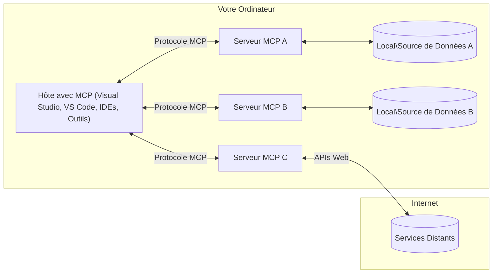

# Concepts de base MCP : Maîtriser le Model Context Protocol pour l’intégration de l’IA

[](https://youtu.be/earDzWGtE84)

_(Cliquez sur l’image ci-dessus pour voir la vidéo de cette leçon)_

Le [Model Context Protocol (MCP)](https://github.com/modelcontextprotocol) est un cadre puissant et standardisé qui optimise la communication entre les grands modèles de langage (LLM) et les outils, applications et sources de données externes.  
Ce guide vous présente les concepts fondamentaux du MCP. Vous apprendrez son architecture client-serveur, ses composants essentiels, ses mécanismes de communication et les bonnes pratiques d’implémentation.

- **Consentement explicite de l’utilisateur** : Tout accès aux données et toute opération requièrent une approbation explicite de l’utilisateur avant exécution. Les utilisateurs doivent comprendre clairement quelles données seront accessibles et quelles actions seront effectuées, avec un contrôle granulaire sur les permissions et autorisations.

- **Protection de la confidentialité des données** : Les données utilisateur ne sont exposées qu’avec consentement explicite et doivent être protégées par des contrôles d’accès robustes durant tout le cycle d’interaction. Les implémentations doivent empêcher toute transmission non autorisée et maintenir des frontières strictes de confidentialité.

- **Sécurité de l’exécution des outils** : Chaque invocation d’outil nécessite un consentement explicite de l’utilisateur avec une compréhension claire de la fonctionnalité, des paramètres et de l’impact potentiel. Des frontières de sécurité strictes doivent prévenir toute exécution non intentionnelle, dangereuse ou malveillante.

- **Sécurité du transport** : Tous les canaux de communication doivent utiliser des mécanismes d’authentification et de chiffrement appropriés. Les connexions distantes doivent implémenter des protocoles de transport sécurisés et une gestion adéquate des identifiants.

#### Directives d’implémentation :

- **Gestion des permissions** : Implémentez des systèmes de permissions granulaires permettant aux utilisateurs de contrôler les serveurs, outils et ressources accessibles  
- **Authentification & Autorisation** : Utilisez des méthodes d’authentification sécurisées (OAuth, clés API) avec gestion et expiration appropriées des jetons  
- **Validation des entrées** : Validez tous les paramètres et données selon des schémas définis pour prévenir les injections  
- **Journalisation d’audit** : Maintenez des journaux exhaustifs de toutes les opérations pour la surveillance de sécurité et la conformité

## Vue d’ensemble

Cette leçon explore l’architecture fondamentale et les composants qui composent l’écosystème Model Context Protocol (MCP). Vous découvrirez l’architecture client-serveur, les composants clés et les mécanismes de communication qui animent les interactions MCP.

## Objectifs d’apprentissage clés

À la fin de cette leçon, vous devriez :

- Comprendre l’architecture client-serveur du MCP.  
- Identifier les rôles et responsabilités des Hôtes, Clients et Serveurs.  
- Analyser les fonctionnalités clés qui font du MCP une couche d’intégration flexible.  
- Apprendre comment l’information circule au sein de l’écosystème MCP.  
- Obtenir des aperçus pratiques à travers des exemples de code en .NET, Java, Python et JavaScript.

## Architecture MCP : un regard approfondi

L’écosystème MCP repose sur un modèle client-serveur. Cette structure modulaire permet aux applications IA d’interagir efficacement avec des outils, bases de données, API et ressources contextuelles. Décomposons cette architecture en ses composants essentiels.

Au cœur, MCP suit une architecture client-serveur où une application hôte peut se connecter à plusieurs serveurs :


```mermaid
flowchart LR
    subgraph "Votre Ordinateur"
        Host["Hôte avec MCP (Visual Studio, VS Code, IDEs, Outils)"]
        S1["Serveur MCP A"]
        S2["Serveur MCP B"]
        S3["Serveur MCP C"]
        Host <-->|"Protocole MCP"| S1
        Host <-->|"Protocole MCP"| S2
        Host <-->|"Protocole MCP"| S3
        S1 <--> D1[("Local\Source de Données A")]
        S2 <--> D2[("Local\Source de Données B")]
    end
    subgraph "Internet"
        S3 <-->|"APIs Web"| D3[("Services Distants")]
    end
```
- **Hôtes MCP** : Programmes comme VSCode, Claude Desktop, IDEs ou outils IA souhaitant accéder aux données via MCP  
- **Clients MCP** : Clients du protocole maintenant des connexions 1:1 avec les serveurs  
- **Serveurs MCP** : Programmes légers exposant des capacités spécifiques via le Model Context Protocol standardisé  
- **Sources de données locales** : Fichiers, bases de données et services de votre ordinateur auxquels les serveurs MCP peuvent accéder en toute sécurité  
- **Services distants** : Systèmes externes accessibles via internet que les serveurs MCP peuvent joindre via des API.

Le protocole MCP est une norme évolutive utilisant un versionnage basé sur la date (format AAAA-MM-JJ). La version actuelle du protocole est **2025-11-25**. Vous pouvez consulter les dernières mises à jour de la [spécification du protocole](https://modelcontextprotocol.io/specification/2025-11-25/)

### 1. Hôtes

Dans le Model Context Protocol (MCP), les **Hôtes** sont des applications IA qui servent d’interface principale par laquelle les utilisateurs interagissent avec le protocole. Les hôtes coordonnent et gèrent les connexions à plusieurs serveurs MCP en créant des clients MCP dédiés pour chaque connexion serveur. Exemples d’Hôtes :

- **Applications IA** : Claude Desktop, Visual Studio Code, Claude Code  
- **Environnements de développement** : IDEs et éditeurs de code intégrant MCP  
- **Applications personnalisées** : Agents IA et outils conçus sur mesure

Les **Hôtes** sont des applications qui orchestrent les interactions avec les modèles IA. Ils :

- **Orchestrent les modèles IA** : Exécutent ou interagissent avec des LLM pour générer des réponses et coordonner des flux de travail IA  
- **Gèrent les connexions client** : Créent et maintiennent un client MCP par connexion serveurs MCP  
- **Contrôlent l’interface utilisateur** : Gèrent le flux de conversation, les interactions utilisateur, la présentation des réponses  
- **Appliquent la sécurité** : Contrôlent les permissions, contraintes de sécurité et authentification  
- **Gèrent le consentement utilisateur** : Supervisent l’approbation utilisateur pour le partage de données et l’exécution des outils

### 2. Clients

Les **Clients** sont des composants essentiels qui maintiennent des connexions dédiées un-à-un entre Hôtes et serveurs MCP. Chaque client MCP est instancié par l’Hôte pour se connecter à un serveur MCP spécifique, assurant des canaux de communication organisés et sécurisés. Plusieurs clients permettent aux Hôtes de se connecter à plusieurs serveurs simultanément.

Les **Clients** sont des composants connecteurs au sein de l’application hôte. Ils :

- **Communiquent via le protocole** : Envoient des requêtes JSON-RPC 2.0 aux serveurs avec invites et instructions  
- **Négocient les capacités** : Négocient les fonctionnalités supportées et versions du protocole avec les serveurs lors de l’initialisation  
- **Exécutent les outils** : Gèrent les requêtes d’exécution d’outils envoyées par les modèles et traitent les réponses  
- **Gèrent les mises à jour en temps réel** : Traitent notifications et mises à jour en temps réel venant des serveurs  
- **Traitement des réponses** : Traitent et formatent les réponses des serveurs pour affichage aux utilisateurs

### 3. Serveurs

Les **Serveurs** sont des programmes fournissant contexte, outils et capacités aux clients MCP. Ils peuvent s’exécuter localement (sur la même machine que l’Hôte) ou à distance (sur des plateformes externes), et sont responsables de traiter les requêtes clients et fournir des réponses structurées. Les serveurs exposent des fonctionnalités spécifiques via le Model Context Protocol standardisé.

Les **Serveurs** sont des services offrant contexte et capacités. Ils :

- **Enregistrent les fonctionnalités** : Enregistrent et exposent des primitives disponibles (ressources, invites, outils) aux clients  
- **Traitent les requêtes** : Reçoivent et exécutent appels d’outils, requêtes de ressources, invitations de prompt des clients  
- **Fournissent le contexte** : Fournissent d’informations contextuelles et données pour enrichir les réponses des modèles  
- **Gèrent l’état** : Maintiennent l’état des sessions et gèrent les interactions avec état si nécessaire  
- **Notifications en temps réel** : Envoient des notifications sur les changements de capacité et mises à jour aux clients connectés

Les serveurs peuvent être développés par n’importe qui pour étendre les capacités du modèle avec des fonctionnalités spécialisées, et ils supportent à la fois le déploiement local et distant.

### 4. Primitives Serveur

Les serveurs dans le Model Context Protocol (MCP) fournissent trois **primitives** principales définissant les briques essentielles pour des interactions riches entre clients, hôtes et modèles de langage. Ces primitives spécifient les types d’informations contextuelles et d’actions disponibles via le protocole.

Les serveurs MCP peuvent exposer toute combinaison des trois primitives de base suivantes :

#### Ressources

Les **Ressources** sont des sources de données fournissant des informations contextuelles aux applications IA. Elles représentent du contenu statique ou dynamique pouvant améliorer la compréhension et la prise de décision du modèle :

- **Données contextuelles** : Informations structurées et contexte pour consommation par le modèle IA  
- **Bases de connaissances** : Dépôts de documents, articles, manuels, articles de recherche  
- **Sources locales** : Fichiers, bases de données, informations systèmes locales  
- **Données externes** : Réponses API, services web, données de systèmes distants  
- **Contenu dynamique** : Données en temps réel mises à jour selon des conditions externes

Les ressources sont identifiées par des URI et supportent la découverte via les méthodes `resources/list` et la récupération via `resources/read` :

```text
file://documents/project-spec.md
database://production/users/schema
api://weather/current
```

#### Invites (Prompts)

Les **Invites** sont des modèles réutilisables aidant à structurer les interactions avec les modèles de langage. Elles fournissent des schémas d’interaction standardisés et des workflows modèles :

- **Interactions basées sur modèles** : Messages préstructurés et amorces de conversation  
- **Modèles de workflow** : Séquences standardisées pour tâches et interactions courantes  
- **Exemples few-shot** : Modèles basés sur des exemples pour l’instruction des modèles  
- **Invites système** : Invites fondamentales définissant le comportement et contexte du modèle  
- **Modèles dynamiques** : Invites paramétrées s’adaptant à des contextes spécifiques

Les invites supportent la substitution variable et peuvent être découvertes via `prompts/list` et récupérées par `prompts/get` :

```markdown
Generate a {{task_type}} for {{product}} targeting {{audience}} with the following requirements: {{requirements}}
```

#### Outils

Les **Outils** sont des fonctions exécutables que les modèles IA peuvent invoquer pour effectuer des actions spécifiques. Ils représentent les « verbes » de l’écosystème MCP, permettant aux modèles d’interagir avec des systèmes externes :

- **Fonctions exécutables** : Opérations distinctes que les modèles peuvent invoquer avec des paramètres spécifiques  
- **Intégration de systèmes externes** : Appels API, requêtes base de données, opérations fichiers, calculs  
- **Identité unique** : Chaque outil a un nom distinct, une description et un schéma de paramètres  
- **Entrées/Sorties structurées** : Outils acceptant des paramètres validés et retournant des réponses typées et structurées  
- **Capacités d’action** : Permettent aux modèles de réaliser des actions concrètes et récupérer des données en direct

Les outils sont définis avec JSON Schema pour validation des paramètres, découverts via `tools/list` et exécutés via `tools/call`. Ils peuvent aussi inclure des **icônes** comme métadonnées supplémentaires pour une meilleure présentation UI.

**Annotations d’outil** : Les outils supportent des annotations de comportement (ex. `readOnlyHint`, `destructiveHint`) indiquant si un outil est en lecture seule ou destructeur, aidant les clients à prendre des décisions éclairées lors de l’exécution.

Exemple de définition d’outil :

```typescript
server.tool(
  "search_products", 
  {
    query: z.string().describe("Search query for products"),
    category: z.string().optional().describe("Product category filter"),
    max_results: z.number().default(10).describe("Maximum results to return")
  }, 
  async (params) => {
    // Exécuter la recherche et retourner des résultats structurés
    return await productService.search(params);
  }
);
```

## Primitives Client

Dans le Model Context Protocol (MCP), les **clients** peuvent exposer des primitives permettant aux serveurs de solliciter des capacités supplémentaires depuis l’application hôte. Ces primitives côté client autorisent des implémentations serveur plus riches et interactives, pouvant accéder aux capacités du modèle IA et aux interactions utilisateur.

### Échantillonnage (Sampling)

L’**Échantillonnage** permet aux serveurs de demander des complétions au modèle de langage de l’application IA du client. Cette primitive donne aux serveurs accès aux capacités LLM sans avoir à intégrer leurs propres dépendances de modèle :

- **Accès indépendant du modèle** : Serveurs peuvent demander des complétions sans inclure les SDK LLM ni gérer l’accès au modèle  
- **IA initiée par le serveur** : Permet aux serveurs de générer de manière autonome du contenu via le modèle IA du client  
- **Interactions LLM récursives** : Supporte des scénarios complexes où les serveurs demandent de l’aide IA pour le traitement  
- **Génération dynamique de contenu** : Autorise les serveurs à créer des réponses contextuelles en utilisant le modèle de l’hôte  
- **Support d’appel d’outils** : Les serveurs peuvent inclure les paramètres `tools` et `toolChoice` pour permettre au modèle client d’invoquer des outils durant l’échantillonnage

L’échantillonnage est initié via la méthode `sampling/complete`, où les serveurs envoient des requêtes de complétion aux clients.

### Racines (Roots)

Les **Racines** fournissent une méthode standardisée pour que les clients exposent les limites du système de fichiers aux serveurs, aidant ces derniers à comprendre quels dossiers et fichiers ils peuvent accéder :

- **Limites du système de fichiers** : Définissent les frontières où les serveurs peuvent opérer dans le système de fichiers  
- **Contrôle d’accès** : Aident les serveurs à savoir quels dossiers et fichiers ils peuvent consulter  
- **Mises à jour dynamiques** : Les clients peuvent notifier les serveurs lorsque la liste des racines change  
- **Identification basée sur URI** : Les racines utilisent des URI `file://` pour identifier les répertoires et fichiers accessibles

Les racines sont découvertes via la méthode `roots/list`, avec des notifications `notifications/roots/list_changed` envoyées aux serveurs quand les racines évoluent.

### Sollicitation (Elicitation)

La **Sollicitation** permet aux serveurs de demander des informations supplémentaires ou des confirmations aux utilisateurs via l’interface client :

- **Demandes d’entrée utilisateur** : Les serveurs peuvent demander des informations supplémentaires nécessaires à l’exécution d’outils  
- **Dialogues de confirmation** : Sollicitent l’approbation utilisateur pour des opérations sensibles ou impactantes  
- **Flux de travail interactifs** : Permettent aux serveurs de construire des interactions utilisateur en étapes  
- **Collecte dynamique des paramètres** : Rassemblent les paramètres manquants ou optionnels durant l’exécution d’outils

Les requêtes de sollicitation se font via la méthode `elicitation/request` pour collecter des entrées utilisateur via l’interface client.

**Sollicitation en mode URL** : Les serveurs peuvent aussi demander des interactions utilisateur basées sur URL, permettant d’orienter les utilisateurs vers des pages web externes pour authentification, confirmation ou saisie de données.

### Journalisation (Logging)

La **Journalisation** permet aux serveurs d’envoyer des messages de logs structurés aux clients pour débogage, surveillance et visibilité opérationnelle :

- **Support debugging** : Permet aux serveurs de fournir des journaux d’exécution détaillés pour le dépannage  
- **Surveillance opérationnelle** : Envoie aux clients des mises à jour d’état et des métriques de performance  
- **Signalement des erreurs** : Fournit des contextes d’erreurs détaillés et des informations diagnostiques  
- **Traçabilité** : Crée des journaux complets des opérations et décisions serveur

Les messages de journalisation sont envoyés aux clients pour assurer la transparence des opérations serveur et faciliter le débogage.

## Flux d’information dans MCP

Le Model Context Protocol (MCP) définit un flux structuré d’information entre hôtes, clients, serveurs et modèles. Comprendre ce flux clarifie comment les requêtes utilisateur sont traitées et comment les outils et données externes sont intégrés dans les réponses modèles.
- **L’hôte initie la connexion**  
  L’application hôte (comme un IDE ou une interface de chat) établit une connexion à un serveur MCP, généralement via STDIO, WebSocket, ou un autre mode de transport pris en charge.

- **Négociation des capacités**  
  Le client (intégré dans l’hôte) et le serveur échangent des informations sur leurs fonctionnalités, outils, ressources, et versions de protocole supportées. Cela garantit que les deux parties comprennent les capacités disponibles pour la session.

- **Requête utilisateur**  
  L’utilisateur interagit avec l’hôte (par exemple, saisit une invite ou une commande). L’hôte collecte cette entrée et la transmet au client pour traitement.

- **Utilisation de ressources ou d’outils**  
  - Le client peut demander un contexte ou des ressources supplémentaires au serveur (comme des fichiers, entrées de base de données ou articles de base de connaissances) pour enrichir la compréhension du modèle.  
  - Si le modèle détermine qu’un outil est nécessaire (par exemple, pour récupérer des données, effectuer un calcul, ou appeler une API), le client envoie une requête d’invocation d’outil au serveur, spécifiant le nom de l’outil et les paramètres.

- **Exécution serveur**  
  Le serveur reçoit la requête de ressource ou d’outil, exécute les opérations nécessaires (comme exécuter une fonction, interroger une base de données ou récupérer un fichier), et renvoie les résultats au client dans un format structuré.

- **Génération de la réponse**  
  Le client intègre les réponses du serveur (données de ressources, sorties d’outils, etc.) dans l’interaction en cours avec le modèle. Le modèle utilise ces informations pour générer une réponse complète et contextuellement pertinente.

- **Présentation du résultat**  
  L’hôte reçoit la sortie finale du client et la présente à l’utilisateur, souvent en incluant à la fois le texte généré par le modèle et les résultats des exécutions d’outils ou recherches de ressources.

Ce flux permet à MCP de soutenir des applications d’IA avancées, interactives et contextuellement pertinentes en connectant parfaitement les modèles avec des outils et sources de données externes.

## Architecture et couches du protocole

MCP se compose de deux couches architecturales distinctes qui travaillent ensemble pour fournir un cadre de communication complet :

### Couche Données

La **couche Données** implémente le protocole MCP principal en utilisant **JSON-RPC 2.0** comme base. Cette couche définit la structure des messages, leur sémantique et les modes d’interaction :

#### Composants principaux :

- **Protocole JSON-RPC 2.0** : Toute communication utilise un format standardisé de messages JSON-RPC 2.0 pour les appels de méthode, réponses et notifications  
- **Gestion du cycle de vie** : Gère l’initialisation de la connexion, la négociation des capacités, et la terminaison de session entre clients et serveurs  
- **Primitives serveur** : Permet aux serveurs de fournir des fonctionnalités principales via des outils, ressources et invites  
- **Primitives client** : Permet aux serveurs de demander un échantillonnage depuis les LLM, de solliciter une entrée utilisateur, et d’envoyer des messages de journalisation  
- **Notifications en temps réel** : Supporte des notifications asynchrones pour des mises à jour dynamiques sans polling

#### Fonctionnalités clés :

- **Négociation de version du protocole** : Utilise une version basée sur la date (AAAA-MM-JJ) pour garantir la compatibilité  
- **Découverte des capacités** : Clients et serveurs échangent les informations des fonctionnalités supportées lors de l’initialisation  
- **Sessions avec état** : Maintient l’état de la connexion à travers plusieurs interactions pour la continuité du contexte

### Couche Transport

La **couche Transport** gère les canaux de communication, le cadrage des messages, et l’authentification entre les participants MCP :

#### Mécanismes de transport supportés :

1. **Transport STDIO** :  
   - Utilise les flux standard d’entrée/sortie pour la communication directe des processus  
   - Optimal pour les processus locaux sur la même machine sans surcharge réseau  
   - Couramment utilisé pour les implémentations locales de serveurs MCP

2. **Transport HTTP Streamable** :  
   - Utilise HTTP POST pour les messages client-vers-serveur  
   - Événements envoyés par le serveur (Server-Sent Events, SSE) optionnels pour le streaming serveur-vers-client  
   - Permet la communication avec des serveurs distants via réseaux  
   - Supporte l’authentification HTTP standard (jetons bearer, clés API, en-têtes personnalisés)  
   - MCP recommande OAuth pour une authentification sécurisée basée sur jetons

#### Abstraction Transport :

La couche transport abstrait les détails de communication de la couche données, permettant d’utiliser le même format JSON-RPC 2.0 sur tous les mécanismes de transport. Cette abstraction permet aux applications de basculer facilement entre serveurs locaux et distants.

### Considérations de sécurité

Les implémentations MCP doivent respecter plusieurs principes de sécurité critiques pour garantir des interactions sûres, fiables et protégées à travers toutes les opérations du protocole :

- **Consentement et contrôle utilisateur** : Les utilisateurs doivent fournir un consentement explicite avant que des données soient accessibles ou des opérations réalisées. Ils doivent avoir un contrôle clair sur les données partagées et les actions autorisées, soutenu par des interfaces utilisateur intuitives pour examiner et approuver les activités.

- **Confidentialité des données** : Les données utilisateur ne doivent être exposées qu’avec un consentement explicite et protégées par des contrôles d’accès appropriés. Les implémentations MCP doivent empêcher les transmissions non autorisées et garantir la confidentialité durant toutes les interactions.

- **Sécurité des outils** : Avant d’invoquer un outil, un consentement utilisateur explicite est nécessaire. Les utilisateurs doivent bien comprendre la fonctionnalité de chaque outil, et des limites de sécurité robustes doivent être appliquées pour éviter des exécutions non intentionnelles ou non sécurisées.

En suivant ces principes de sécurité, MCP assure la confiance des utilisateurs, la protection de la vie privée, et la sécurité sur toutes les interactions de protocole tout en permettant des intégrations puissantes d’IA.

## Exemples de code : composants clés

Voici des exemples de code dans plusieurs langages populaires illustrant comment implémenter les composants clés d’un serveur MCP et ses outils.

### Exemple .NET : Création d’un serveur MCP simple avec outils

Voici un exemple pratique en .NET démontrant comment implémenter un serveur MCP simple avec des outils personnalisés. Cet exemple montre comment définir et enregistrer des outils, gérer les requêtes, et connecter le serveur via le protocole MCP.

```csharp
using System;
using System.Threading.Tasks;
using ModelContextProtocol.Server;
using ModelContextProtocol.Server.Transport;
using ModelContextProtocol.Server.Tools;

public class WeatherServer
{
    public static async Task Main(string[] args)
    {
        // Create an MCP server
        var server = new McpServer(
            name: "Weather MCP Server",
            version: "1.0.0"
        );
        
        // Register our custom weather tool
        server.AddTool<string, WeatherData>("weatherTool", 
            description: "Gets current weather for a location",
            execute: async (location) => {
                // Call weather API (simplified)
                var weatherData = await GetWeatherDataAsync(location);
                return weatherData;
            });
        
        // Connect the server using stdio transport
        var transport = new StdioServerTransport();
        await server.ConnectAsync(transport);
        
        Console.WriteLine("Weather MCP Server started");
        
        // Keep the server running until process is terminated
        await Task.Delay(-1);
    }
    
    private static async Task<WeatherData> GetWeatherDataAsync(string location)
    {
        // This would normally call a weather API
        // Simplified for demonstration
        await Task.Delay(100); // Simulate API call
        return new WeatherData { 
            Temperature = 72.5,
            Conditions = "Sunny",
            Location = location
        };
    }
}

public class WeatherData
{
    public double Temperature { get; set; }
    public string Conditions { get; set; }
    public string Location { get; set; }
}
```

### Exemple Java : Composants serveur MCP

Cet exemple illustre le même serveur MCP et enregistrement d’outils que l’exemple .NET ci-dessus, mais implémenté en Java.

```java
import io.modelcontextprotocol.server.McpServer;
import io.modelcontextprotocol.server.McpToolDefinition;
import io.modelcontextprotocol.server.transport.StdioServerTransport;
import io.modelcontextprotocol.server.tool.ToolExecutionContext;
import io.modelcontextprotocol.server.tool.ToolResponse;

public class WeatherMcpServer {
    public static void main(String[] args) throws Exception {
        // Créer un serveur MCP
        McpServer server = McpServer.builder()
            .name("Weather MCP Server")
            .version("1.0.0")
            .build();
            
        // Enregistrer un outil météo
        server.registerTool(McpToolDefinition.builder("weatherTool")
            .description("Gets current weather for a location")
            .parameter("location", String.class)
            .execute((ToolExecutionContext ctx) -> {
                String location = ctx.getParameter("location", String.class);
                
                // Obtenir les données météorologiques (simplifié)
                WeatherData data = getWeatherData(location);
                
                // Retourner une réponse formatée
                return ToolResponse.content(
                    String.format("Temperature: %.1f°F, Conditions: %s, Location: %s", 
                    data.getTemperature(), 
                    data.getConditions(), 
                    data.getLocation())
                );
            })
            .build());
        
        // Connecter le serveur en utilisant le transport stdio
        try (StdioServerTransport transport = new StdioServerTransport()) {
            server.connect(transport);
            System.out.println("Weather MCP Server started");
            // Maintenir le serveur en fonctionnement jusqu'à l'arrêt du processus
            Thread.currentThread().join();
        }
    }
    
    private static WeatherData getWeatherData(String location) {
        // L'implémentation appellerait une API météo
        // Simplifié à des fins d'exemple
        return new WeatherData(72.5, "Sunny", location);
    }
}

class WeatherData {
    private double temperature;
    private String conditions;
    private String location;
    
    public WeatherData(double temperature, String conditions, String location) {
        this.temperature = temperature;
        this.conditions = conditions;
        this.location = location;
    }
    
    public double getTemperature() {
        return temperature;
    }
    
    public String getConditions() {
        return conditions;
    }
    
    public String getLocation() {
        return location;
    }
}
```

### Exemple Python : Construction d’un serveur MCP

Cet exemple utilise fastmcp, assurez-vous de l’installer d’abord :

```python
pip install fastmcp
```
Exemple de code :

```python
#!/usr/bin/env python3
import asyncio
from fastmcp import FastMCP
from fastmcp.transports.stdio import serve_stdio

# Créer un serveur FastMCP
mcp = FastMCP(
    name="Weather MCP Server",
    version="1.0.0"
)

@mcp.tool()
def get_weather(location: str) -> dict:
    """Gets current weather for a location."""
    return {
        "temperature": 72.5,
        "conditions": "Sunny",
        "location": location
    }

# Approche alternative utilisant une classe
class WeatherTools:
    @mcp.tool()
    def forecast(self, location: str, days: int = 1) -> dict:
        """Gets weather forecast for a location for the specified number of days."""
        return {
            "location": location,
            "forecast": [
                {"day": i+1, "temperature": 70 + i, "conditions": "Partly Cloudy"}
                for i in range(days)
            ]
        }

# Enregistrer les outils de la classe
weather_tools = WeatherTools()

# Démarrer le serveur
if __name__ == "__main__":
    asyncio.run(serve_stdio(mcp))
```

### Exemple JavaScript : Création d’un serveur MCP

Cet exemple montre la création d’un serveur MCP en JavaScript et l’enregistrement de deux outils liés à la météo.

```javascript
// Utilisation du SDK officiel du protocole de contexte de modèle
import { McpServer } from "@modelcontextprotocol/sdk/server/mcp.js";
import { StdioServerTransport } from "@modelcontextprotocol/sdk/server/stdio.js";
import { z } from "zod"; // Pour la validation des paramètres

// Créer un serveur MCP
const server = new McpServer({
  name: "Weather MCP Server",
  version: "1.0.0"
});

// Définir un outil météo
server.tool(
  "weatherTool",
  {
    location: z.string().describe("The location to get weather for")
  },
  async ({ location }) => {
    // Cela appellerait normalement une API météo
    // Simplifié pour la démonstration
    const weatherData = await getWeatherData(location);
    
    return {
      content: [
        { 
          type: "text", 
          text: `Temperature: ${weatherData.temperature}°F, Conditions: ${weatherData.conditions}, Location: ${weatherData.location}` 
        }
      ]
    };
  }
);

// Définir un outil de prévision
server.tool(
  "forecastTool",
  {
    location: z.string(),
    days: z.number().default(3).describe("Number of days for forecast")
  },
  async ({ location, days }) => {
    // Cela appellerait normalement une API météo
    // Simplifié pour la démonstration
    const forecast = await getForecastData(location, days);
    
    return {
      content: [
        { 
          type: "text", 
          text: `${days}-day forecast for ${location}: ${JSON.stringify(forecast)}` 
        }
      ]
    };
  }
);

// Fonctions d'assistance
async function getWeatherData(location) {
  // Simuler un appel API
  return {
    temperature: 72.5,
    conditions: "Sunny",
    location: location
  };
}

async function getForecastData(location, days) {
  // Simuler un appel API
  return Array.from({ length: days }, (_, i) => ({
    day: i + 1,
    temperature: 70 + Math.floor(Math.random() * 10),
    conditions: i % 2 === 0 ? "Sunny" : "Partly Cloudy"
  }));
}

// Connecter le serveur en utilisant le transport stdio
const transport = new StdioServerTransport();
server.connect(transport).catch(console.error);

console.log("Weather MCP Server started");
```

Cet exemple JavaScript démontre comment créer un serveur MCP qui enregistre des outils liés à la météo et se connecte via le transport stdio pour gérer les requêtes client entrantes.

## Sécurité et autorisation

MCP inclut plusieurs concepts et mécanismes intégrés pour gérer la sécurité et l’autorisation tout au long du protocole :

1. **Contrôle des permissions d’outil** :  
  Les clients peuvent spécifier les outils qu’un modèle est autorisé à utiliser pendant une session. Cela garantit que seuls les outils explicitement autorisés sont accessibles, réduisant le risque d’opérations non intentionnelles ou dangereuses. Les permissions peuvent être configurées dynamiquement selon les préférences utilisateur, les politiques organisationnelles, ou le contexte d’interaction.

2. **Authentification** :  
  Les serveurs peuvent exiger une authentification avant d’accorder l’accès aux outils, ressources, ou opérations sensibles. Cela peut impliquer des clés API, jetons OAuth, ou d’autres schémas d’authentification. Une authentification adéquate garantit que seuls les clients et utilisateurs de confiance peuvent invoquer les capacités côté serveur.

3. **Validation** :  
  La validation des paramètres est appliquée pour toutes les invocations d’outils. Chaque outil définit les types attendus, formats et contraintes pour ses paramètres, et le serveur valide les requêtes entrantes en conséquence. Cela empêche que des entrées malformées ou malveillantes atteignent les implémentations des outils et maintient l’intégrité des opérations.

4. **Limitation de débit (Rate Limiting)** :  
  Pour prévenir les abus et assurer un usage équitable des ressources serveur, les serveurs MCP peuvent mettre en œuvre des limitations de débit sur les appels d’outils et l’accès aux ressources. Les limites peuvent être appliquées par utilisateur, par session, ou globalement, et aident à protéger contre les attaques par déni de service ou la consommation excessive des ressources.

En combinant ces mécanismes, MCP offre une base sécurisée pour intégrer les modèles de langage avec des outils et sources de données externes, tout en donnant aux utilisateurs et développeurs un contrôle précis sur l’accès et l’usage.

## Messages du protocole & flux de communication

La communication MCP utilise des messages structurés au format **JSON-RPC 2.0** pour faciliter des interactions claires et fiables entre hôtes, clients, et serveurs. Le protocole définit des schémas de messages spécifiques pour différents types d’opérations :

### Types de messages principaux :

#### **Messages d’initialisation**  
- Requête **`initialize`** : Établit la connexion et négocie la version du protocole et les capacités  
- Réponse **`initialize`** : Confirme les fonctionnalités supportées et les informations du serveur  
- **`notifications/initialized`** : Signale que l’initialisation est terminée et que la session est prête

#### **Messages de découverte**  
- Requête **`tools/list`** : Découvre les outils disponibles sur le serveur  
- Requête **`resources/list`** : Liste les ressources disponibles (sources de données)  
- Requête **`prompts/list`** : Récupère les modèles d’invite disponibles

#### **Messages d’exécution**  
- Requête **`tools/call`** : Exécute un outil spécifique avec des paramètres fournis  
- Requête **`resources/read`** : Récupère le contenu d’une ressource spécifique  
- Requête **`prompts/get`** : Récupère un modèle d’invite avec paramètres optionnels

#### **Messages côté client**  
- Requête **`sampling/complete`** : Le serveur demande une complétion LLM depuis le client  
- **`elicitation/request`** : Le serveur demande une entrée utilisateur via l’interface client  
- Messages de journalisation : Le serveur envoie des messages de log structurés au client

#### **Messages de notification**  
- **`notifications/tools/list_changed`** : Le serveur notifie le client d’une modification des outils  
- **`notifications/resources/list_changed`** : Le serveur notifie le client d’une modification des ressources  
- **`notifications/prompts/list_changed`** : Le serveur notifie le client d’une modification des invites

### Structure des messages :

Tous les messages MCP suivent le format JSON-RPC 2.0 avec :  
- **Messages de requête** : Incluent `id`, `method`, et `params` facultatifs  
- **Messages de réponse** : Incluent `id` et soit `result`, soit `error`  
- **Messages de notification** : Incluent `method` et `params` facultatifs (sans `id` ni réponse attendue)

Cette communication structurée assure des interactions fiables, traçables, et extensibles, supportant des scénarios avancés comme les mises à jour en temps réel, enchaînement d’outils, et gestion robuste des erreurs.

### Tâches (Expérimental)

Les **tâches** sont une fonctionnalité expérimentale offrant des enveloppes d’exécution durables permettant la récupération différée des résultats et le suivi du statut des requêtes MCP :

- **Opérations longues** : Suivi des calculs coûteux, automatisations de workflows, et traitements par lots  
- **Résultats différés** : Consultation du statut de la tâche et récupération des résultats à la fin des opérations  
- **Suivi du statut** : Surveillance de la progression à travers des états définis du cycle de vie  
- **Opérations multi-étapes** : Support des workflows complexes s’étendant sur plusieurs interactions

Les tâches encapsulent des requêtes MCP standard pour permettre des modes d’exécution asynchrones pour des opérations non immédiatement terminées.

## Points essentiels à retenir

- **Architecture** : MCP utilise une architecture client-serveur où les hôtes gèrent plusieurs connexions client vers des serveurs  
- **Participants** : L’écosystème inclut les hôtes (applications IA), les clients (connecteurs de protocole), et les serveurs (fournisseurs de capacités)  
- **Mécanismes de transport** : Communication supportant STDIO (local) et HTTP streamable avec SSE optionnel (à distance)  
- **Primitives principales** : Les serveurs exposent des outils (fonctions exécutables), ressources (sources de données), et invites (modèles)  
- **Primitives client** : Les serveurs peuvent demander l’échantillonnage (complétions LLM avec support d’appel d’outils), sollicitation (entrée utilisateur incluant mode URL), racines (limites système de fichiers), et journalisation des clients  
- **Fonctionnalités expérimentales** : Les tâches fournissent des enveloppes d’exécution durables pour opérations longues  
- **Base protocolaire** : Fondé sur JSON-RPC 2.0 avec versionning basé sur la date (actuel : 2025-11-25)  
- **Capacités en temps réel** : Supporte les notifications pour mises à jour dynamiques et synchronisation en temps réel  
- **Sécurité prioritaire** : Consentement utilisateur explicite, protection de la vie privée et transport sécurisé sont des exigences essentielles

## Exercice

Concevez un outil MCP simple qui serait utile dans votre domaine. Définissez :  
1. Quel serait le nom de l’outil  
2. Quels paramètres il accepterait  
3. Quelle sortie il retournerait  
4. Comment un modèle pourrait utiliser cet outil pour résoudre les problèmes utilisateurs

---

## Quelles sont les prochaines étapes

Suivant : [Chapitre 2 : Sécurité](../02-Security/README.md)

---

<!-- CO-OP TRANSLATOR DISCLAIMER START -->
**Avertissement** :  
Ce document a été traduit à l’aide du service de traduction automatique [Co-op Translator](https://github.com/Azure/co-op-translator). Bien que nous nous efforçons d’assurer l’exactitude, veuillez noter que les traductions automatiques peuvent contenir des erreurs ou des imprécisions. Le document original dans sa langue d’origine doit être considéré comme la source faisant foi. Pour les informations cruciales, une traduction professionnelle réalisée par un humain est recommandée. Nous déclinons toute responsabilité en cas de malentendus ou de mauvaises interprétations résultant de l’utilisation de cette traduction.
<!-- CO-OP TRANSLATOR DISCLAIMER END -->