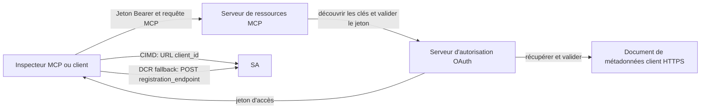

# Exemple d'autorisation CIMD et DCR

Cet exemple TypeScript compare deux façons pour un client OAuth d'obtenir une identité
avant d'accéder à un serveur MCP protégé :

- **Documents d'identification du client (CIMD)** utilisent une URL HTTPS stable comme
  `client_id`. C'est le mécanisme préféré pour les clients et les serveurs d'autorisation
  qui n'ont pas de relation préexistante.
- **Enregistrement dynamique de client (DCR)** demande au serveur d'autorisation de générer
  un ID client opaque au moment de l'exécution. MCP `2026-07-28` conserve DCR uniquement pour la
  compatibilité avec les versions précédentes.

L'exemple utilise le SDK TypeScript MCP stable v2 et le modèle de requête stateless
MCP `2026-07-28`. Il fonctionne avec un serveur d'autorisation OAuth 2.1/OpenID Connect externe tel qu'Auth0.
Le serveur MCP est un serveur de ressources : il valide les jetons d'accès mais n'authentifie pas les utilisateurs ni n'émet
de jetons.


## Objectifs d'apprentissage

En complétant cet exemple, vous serez capable de :

- Expliquer pourquoi CIMD est préféré à DCR pour les nouveaux clients MCP.
- Publier un document CIMD valide pour un client natif public.
- Configurer un serveur de ressources MCP pour la découverte OAuth et la validation JWT.
- Exécuter CIMD et DCR avec le même serveur MCP et le même serveur d'autorisation.
- Appliquer une portée OAuth au sein d'un outil MCP.
- Identifier quelles responsabilités appartiennent au client, au serveur de ressources et au
  serveur d'autorisation.

## Architecture



Le serveur d'autorisation choisit et valide le mécanisme d'enregistrement.
Le serveur MCP ne voit que la revendication `client_id` vérifiée résultante. Une URL HTTPS
avec chemin identifie CIMD. Un ID opaque ne suffit pas à prouver DCR car un
client préenregistré peut aussi utiliser un ID opaque ; l'optionnelle
`DCR_CLIENT_ID_PREFIX` fournit un indice de démonstration spécifique au fournisseur.

## Priorité d'enregistrement

Les clients MCP qui supportent tous les mécanismes doivent utiliser cet ordre :

1. Utiliser les informations client préenregistrées lorsqu'elles sont déjà disponibles.
2. Utiliser CIMD lorsque le serveur d'autorisation annonce
   `client_id_metadata_document_supported: true`.
3. Utiliser DCR uniquement en dernier recours lorsque le serveur annonce un
   `registration_endpoint`.
4. Demander à l'utilisateur les informations client préenregistrées lorsque aucune des options ci-dessus n'est
   disponible.

## Organisation du projet

```text
src/
  config.ts          Environment validation
  dcr.ts             DCR compatibility request
  mcp.ts             MCP tools and scope checks
  oauth.ts           Authorization metadata and JWT verification
  register-dcr.ts    DCR command-line helper
  registration.ts    CIMD document and mechanism classification
  server.ts          Express, OAuth discovery, and MCP endpoint
test/
  dcr.test.ts
  oauth.test.ts
  registration.test.ts
  server.test.ts
```

## Prérequis

- Node.js 20.6 ou plus récent. Les scripts utilisent `--env-file` et `--import`.
- Un serveur d'autorisation OAuth 2.1/OpenID Connect supportant :
  - Le flux d'autorisation avec code et PKCE S256.
  - Les métadonnées des ressources protégées OAuth et les indicateurs de ressources.
  - Jetons d'accès JWT et un point final JWKS.
  - CIMD, plus DCR si vous souhaitez comparer la solution de secours héritée.
- MCP Inspector ou un autre client MCP `2026-07-28`.
- Une URL HTTPS publique pour le document CIMD. Un tunnel de développement est adapté
  pour le laboratoire ; utilisez un domaine stable en production.

## Installation et test

```bash
npm install
npm run build
npm test
```

Les douze tests utilisent des clés locales et des points de terminaison HTTP simulés. Ils ne nécessitent pas
de compte serveur d'autorisation. Ils vérifient :

- La forme et les contraintes d'URL du document CIMD.
- La classification honnête des ID client URL et opaques.
- Le traitement des requêtes et réponses DCR.
- Le rejet des points de terminaison DCR non sécurisés hors loopback.

- Validation de la signature JWT, de l’émetteur, du public, de l’expiration, de l’ID client et de la portée.
- Un appel MCP `2026-07-28` en cours dans le processus à `registration-info`.

## Configurer le serveur d’autorisation

Les noms de contrôle exacts varient selon le fournisseur. Configurez ces capacités :

1. Créez une API ou un serveur de ressources dont l’identifiant correspond exactement à votre MCP
   URL, incluant `/mcp`, par exemple `http://127.0.0.1:3001/mcp`.
2. Utilisez des jetons d’accès RS256 et incluez une revendication `client_id` ou `azp`.
3. Ajoutez la permission ou portée `tool:greet`.
4. Activez le flux d’autorisation par code avec PKCE S256 pour les clients natifs publics.
5. Activez les documents de métadonnées d’ID client.
6. Pour la comparaison uniquement, activez l’enregistrement client dynamique.
7. Assurez-vous que les métadonnées du serveur d’autorisation annoncent :
   - `issuer`
   - `authorization_endpoint`
   - `token_endpoint`
   - `jwks_uri`
   - `client_id_metadata_document_supported: true`
   - `registration_endpoint` lorsque DCR est activé

### Exemple Auth0

Pour Auth0, activez l’enregistrement du document de métadonnées ID client, l’enregistrement dynamique
d’application OIDC, et la compatibilité avec le paramètre Resource. Créez une API
dont l’identifiant est l’URL MCP exacte et ajoutez la permission `tool:greet`.
Autorisez l’utilisateur de test et les clients tiers à demander cette permission.

Les tableaux de bord des fournisseurs et la disponibilité des fonctionnalités évoluent avec le temps. Vérifiez la
documentation du fournisseur avant d’utiliser ces paramètres en dehors de ce laboratoire.

## Configurer l’exemple

Créez `.env` à partir de l’exemple :

```powershell
Copy-Item .env.example .env
```

Sur des shells compatibles bash :

```bash
cp .env.example .env
```

Définissez ces valeurs :

```dotenv
MCP_SERVER_URL=http://127.0.0.1:3001/mcp
AUTHORIZATION_SERVER_ISSUER=https://your-tenant.example.com/
AUTHORIZATION_SERVER_METADATA_URL=https://your-tenant.example.com/.well-known/openid-configuration
CLIENT_METADATA_URL=https://your-public-host.example.com/client-metadata.json
OAUTH_REDIRECT_URIS=http://127.0.0.1:6274/oauth/callback
DCR_CLIENT_ID_PREFIX=tpc_
```

Détails importants :

- `AUTHORIZATION_SERVER_ISSUER` doit correspondre exactement à `issuer` dans les métadonnées
  du serveur d’autorisation découvert, incluant toute barre oblique finale.
- `MCP_SERVER_URL` doit correspondre à l’audience du jeton d’accès.
- `CLIENT_METADATA_URL` doit utiliser HTTPS, contenir un chemin non racine, et être
  l’URL publique qui sert la route des métadonnées. Les chaînes de requête et fragments sont
  rejetés afin que la route et le `client_id` restent identiques.
- `OAUTH_REDIRECT_URIS` est une liste blanche séparée par des virgules. La valeur par défaut est le
  rappel en boucle locale de l’inspecteur MCP.
- `DCR_CLIENT_ID_PREFIX` est optionnel et spécifique au fournisseur. Laissez-le vide lorsque
  votre fournisseur n’a pas de préfixe DCR fiable.

## Publier le document CIMD

Lancez un tunnel qui redirige son origine publique HTTPS vers `127.0.0.1:3001`.
Définissez `CLIENT_METADATA_URL` sur cette origine plus `/client-metadata.json`, puis exécutez :

```bash
npm run build
npm start
```

Vérifiez les deux documents de découverte :

```bash
curl http://127.0.0.1:3001/health
curl http://127.0.0.1:3001/client-metadata.json
curl http://127.0.0.1:3001/.well-known/oauth-protected-resource/mcp
```

Le `client_id` renvoyé par l’URL publique HTTPS de métadonnées doit être identique octet par octet
à cette URL. Le serveur d’autorisation doit valider le document et
son URI de redirection avant d’émettre un jeton.

> [!NOTE]
> L’exemple héberge le document client et le serveur de ressources MCP dans un seul processus
> afin de garder le laboratoire léger. En production, le client MCP possède et héberge son document CIMD
> indépendamment du serveur de ressources.

## Comparer CIMD et DCR

Démarrez MCP Inspector :

```bash
npx @modelcontextprotocol/inspector
```

Utilisez Streamable HTTP et connectez-vous à `http://127.0.0.1:3001/mcp`.


### CIMD (Préféré)


1. Entrez le `CLIENT_METADATA_URL` public comme ID client OAuth.
2. Demandez `tool:greet` ainsi que toutes les étendues d'identité requises par votre fournisseur.
3. Complétez la connexion et le consentement.
4. Appelez `registration-info`. Il renvoie `mechanism: "cimd"`.
5. Appelez `greet` pour vérifier l'application de l'étendue.

### DCR (Solution de repli de compatibilité)

1. Effacez l'état OAuth enregistré par Inspector.
2. Laissez l'ID client OAuth vide afin qu'Inspector puisse utiliser le `registration_endpoint`
   annoncé.
3. Complétez la connexion et le consentement.
4. Appelez `registration-info`.
5. Si `DCR_CLIENT_ID_PREFIX` correspond aux IDs générés par le fournisseur, l'outil
   rapporte `mechanism: "dcr"` ; sinon il rapporte correctement
   `opaque-client-id`.

Vous pouvez également démontrer directement la requête d'enregistrement :

```bash
npm run build
npm run register:dcr
```

L'assistant affiche l'ID client retourné mais n'affiche jamais de secret client.
Traitez tout secret retourné comme sensible et stockez-le dans un gestionnaire de secrets approprié.

## Outils

| Outil | Étendue requise | But |
| --- | --- | --- |
| `registration-info` | Client vérifié | Rapporte le type d'ID client |
| `greet` | `tool:greet` | Démontre l'autorisation par outil |

## Notes de sécurité

- Validez les signatures JWT via le point de terminaison JWKS du serveur d'autorisation.
- Exigez une correspondance exacte de l'émetteur et de l'audience.
- Exigez les revendications d'expiration et d'ID client.
- N'acceptez jamais un jeton émis pour une ressource différente.
- Ne transmettez jamais le jeton MCP à une API en aval.
- Maintenez les identifiants DCR liés à l'émetteur qui les a créés.
- Validez les URI de redirection CIMD avec une correspondance exacte.
- Appliquez des contrôles SSRF lorsque le serveur d'autorisation récupère des URL CIMD.
- Utilisez HTTPS pour les points de terminaison d'autorisation et de métadonnées en dehors du développement en boucle locale.

- N'inférez pas DCR à partir d'un ID client opaque à moins que le fournisseur ne documente une
  convention d'identification fiable.

## Références

- [Spécification d'autorisation MCP](https://modelcontextprotocol.io/specification/2026-07-28/basic/authorization)
- [Enregistrement client MCP](https://modelcontextprotocol.io/specification/2026-07-28/basic/authorization/client-registration)
- [Bonnes pratiques de sécurité MCP](https://modelcontextprotocol.io/specification/2026-07-28/basic/security_best_practices)
- [Guide d'autorisation MCP TypeScript SDK v2](https://ts.sdk.modelcontextprotocol.io/v2/serving/authorization)
- [Enregistrement dynamique client OAuth (RFC 7591)](https://datatracker.ietf.org/doc/html/rfc7591)
- [Brouillon du document de métadonnées ID client OAuth](https://datatracker.ietf.org/doc/html/draft-ietf-oauth-client-id-metadata-document-00)

## Remerciements

L'approche pédagogique côte à côte a été inspirée par
[Sambego/auth0-xmcp-cimd](https://github.com/Sambego/auth0-xmcp-cimd). Cet
exemple est une mise en œuvre originale, neutre vis-à-vis du fournisseur, construite avec le SDK officiel
MCP TypeScript SDK v2 pour ce programme.

---

<!-- CO-OP TRANSLATOR DISCLAIMER START -->
**Avertissement** :
Ce document a été traduit à l'aide du service de traduction automatique [Co-op Translator](https://github.com/Azure/co-op-translator). Bien que nous nous efforçions d'assurer l'exactitude, veuillez noter que les traductions automatisées peuvent contenir des erreurs ou des inexactitudes. Le document original dans sa langue native doit être considéré comme la source faisant autorité. Pour les informations critiques, il est recommandé de recourir à une traduction professionnelle réalisée par un humain. Nous ne saurions être tenus responsables des malentendus ou erreurs d'interprétation découlant de l'utilisation de cette traduction.
<!-- CO-OP TRANSLATOR DISCLAIMER END -->