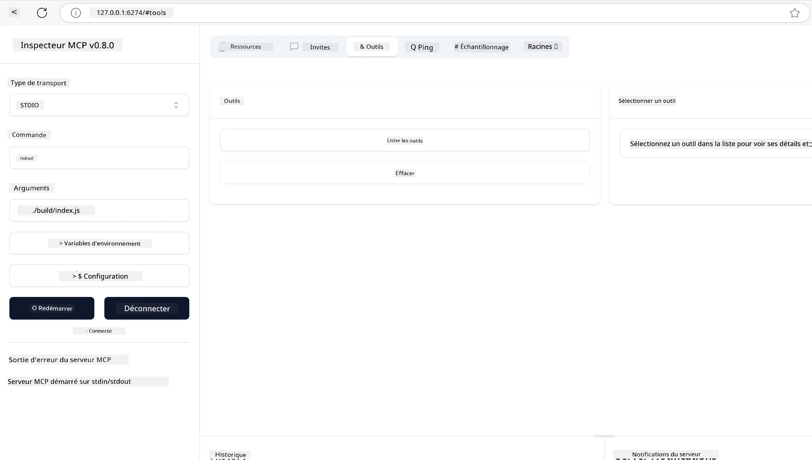
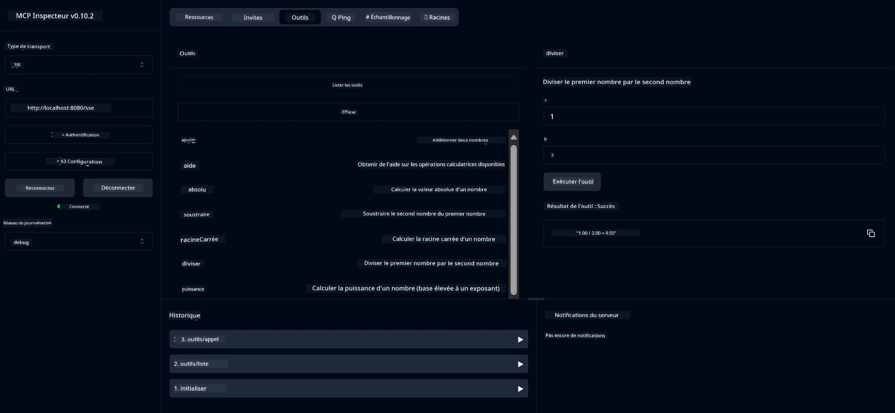
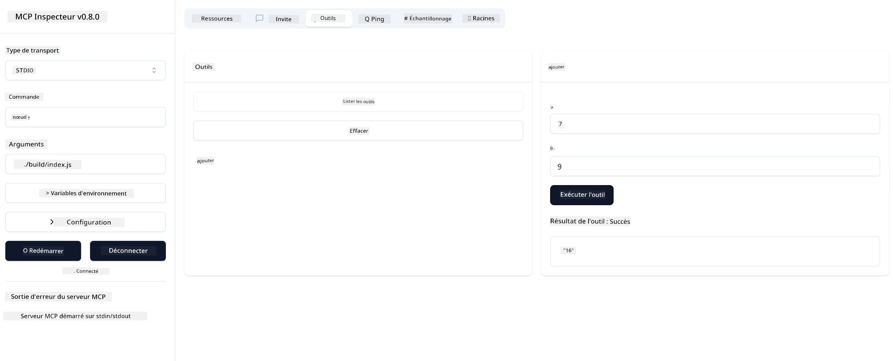

# Premiers pas avec MCP

> [!NOTE]
> L'exemple HTTP Java de cette leçon utilise le transport HTTP+SSE legacy et
> cible un SDK compatible avec MCP `2025-11-25`. Pour les nouveaux serveurs distants, utilisez
> le transport Streamable HTTP `2026-07-28` et vérifiez la prise en charge dans votre SDK.

Bienvenue dans vos premiers pas avec le Model Context Protocol (MCP) ! Que vous soyez nouveau dans MCP ou que vous cherchiez à approfondir votre compréhension, ce guide vous accompagnera à travers les étapes essentielles de configuration et de développement. Vous découvrirez comment MCP permet une intégration fluide entre les modèles d'IA et les applications, et apprendrez comment préparer rapidement votre environnement pour construire et tester des solutions utilisant MCP.

> TLDR ; Si vous développez des applications d'IA, vous savez que vous pouvez ajouter des outils et d'autres ressources à votre LLM (grand modèle de langage), afin d'en enrichir les connaissances. Cependant, si vous placez ces outils et ressources sur un serveur, les capacités de l'application et du serveur peuvent être utilisées par n'importe quel client avec ou sans LLM.

## Aperçu

Cette leçon fournit des conseils pratiques pour configurer les environnements MCP et construire vos premières applications MCP. Vous apprendrez à installer les outils et frameworks nécessaires, créer des serveurs MCP basiques, concevoir des applications hôtes et tester vos implémentations.

Le Model Context Protocol (MCP) est un protocole ouvert qui standardise la manière dont les applications fournissent du contexte aux LLM. Pensez au MCP comme un port USB-C pour les applications d'IA - il offre une manière standardisée de connecter des modèles d'IA à différentes sources de données et outils.

## Objectifs d'apprentissage

À la fin de cette leçon, vous serez capable de :

- Configurer des environnements de développement pour MCP en C#, Java, Python, TypeScript et Rust
- Construire et déployer des serveurs MCP basiques avec des fonctionnalités personnalisées (ressources, prompts, et outils)
- Créer des applications hôtes qui se connectent aux serveurs MCP
- Tester et déboguer les implémentations MCP

## Configuration de votre environnement MCP

Avant de commencer à travailler avec MCP, il est important de préparer votre environnement de développement et de comprendre le flux de travail de base. Cette section vous guidera à travers les étapes initiales pour assurer un démarrage en douceur avec MCP.

### Prérequis

Avant de plonger dans le développement MCP, assurez-vous d'avoir :

- **Environnement de développement** : pour votre langage choisi (C#, Java, Python, TypeScript ou Rust)
- **IDE/Éditeur** : Visual Studio, Visual Studio Code, IntelliJ, Eclipse, PyCharm, ou tout éditeur de code moderne
- **Gestionnaires de paquets** : NuGet, Maven/Gradle, pip, npm/yarn, ou Cargo
- **Clés API** : pour tous les services IA que vous prévoyez d'utiliser dans vos applications hôtes

## Structure basique d'un serveur MCP

Un serveur MCP comprend généralement :

- **Configuration du serveur** : configuration du port, authentification, et autres paramètres
- **Ressources** : données et contexte mis à disposition des LLM
- **Outils** : fonctionnalités que les modèles peuvent invoquer
- **Prompts** : modèles pour générer ou structurer du texte

Voici un exemple simplifié en TypeScript :

```typescript
import { McpServer, ResourceTemplate } from "@modelcontextprotocol/sdk/server/mcp.js";
import { StdioServerTransport } from "@modelcontextprotocol/sdk/server/stdio.js";
import { z } from "zod";

// Créer un serveur MCP
const server = new McpServer({
  name: "Demo",
  version: "1.0.0"
});

// Ajouter un outil d'addition
server.tool("add",
  { a: z.number(), b: z.number() },
  async ({ a, b }) => ({
    content: [{ type: "text", text: String(a + b) }]
  })
);

// Ajouter une ressource de salutation dynamique
server.resource(
  "file",
  // Le paramètre 'list' contrôle la façon dont la ressource liste les fichiers disponibles. Le définir sur undefined désactive la liste pour cette ressource.
  new ResourceTemplate("file://{path}", { list: undefined }),
  async (uri, { path }) => ({
    contents: [{
      uri: uri.href,
      text: `File, ${path}!`
    }]
  })
);

// Ajouter une ressource de fichier qui lit le contenu du fichier
server.resource(
  "file",
  new ResourceTemplate("file://{path}", { list: undefined }),
  async (uri, { path }) => {
    let text;
    try {
      text = await fs.readFile(path, "utf8");
    } catch (err) {
      text = `Error reading file: ${err.message}`;
    }
    return {
      contents: [{
        uri: uri.href,
        text
      }]
    };
  }
);

server.prompt(
  "review-code",
  { code: z.string() },
  ({ code }) => ({
    messages: [{
      role: "user",
      content: {
        type: "text",
        text: `Please review this code:\n\n${code}`
      }
    }]
  })
);

// Commencer à recevoir les messages sur stdin et envoyer les messages sur stdout
const transport = new StdioServerTransport();
await server.connect(transport);
```

Dans le code précédent, nous avons :

- Importé les classes nécessaires depuis le SDK TypeScript MCP.
- Créé et configuré une nouvelle instance de serveur MCP.
- Enregistré un outil personnalisé (`calculator`) avec une fonction gestionnaire.
- Démarré le serveur pour écouter les requêtes MCP entrantes.

## Test et débogage

Avant de commencer à tester votre serveur MCP, il est important de comprendre les outils disponibles et les meilleures pratiques pour le débogage. Un test efficace garantit que votre serveur fonctionne comme prévu et vous aide à identifier rapidement et résoudre les problèmes. La section suivante décrit les approches recommandées pour valider votre implémentation MCP.

MCP fournit des outils pour vous aider à tester et déboguer vos serveurs :

- **Outil Inspector**, cette interface graphique vous permet de vous connecter à votre serveur et de tester vos outils, prompts et ressources.
- **curl**, vous pouvez également vous connecter à votre serveur avec un outil en ligne de commande comme curl ou d'autres clients capables de créer et exécuter des commandes HTTP.

### Utiliser MCP Inspector

Le [MCP Inspector](https://github.com/modelcontextprotocol/inspector) est un outil visuel de test qui vous aide à :

1. **Découvrir les capacités du serveur** : détecter automatiquement les ressources, outils et prompts disponibles
2. **Tester l'exécution des outils** : essayer différents paramètres et voir les réponses en temps réel
3. **Voir les métadonnées du serveur** : examiner les infos serveur, schémas, et configurations

```bash
# ex TypeScript, installation et exécution de MCP Inspector
npx @modelcontextprotocol/inspector node build/index.js
```

Lorsque vous exécutez les commandes ci-dessus, le MCP Inspector lance une interface web locale dans votre navigateur. Vous pouvez vous attendre à voir un tableau de bord affichant vos serveurs MCP enregistrés, leurs outils, ressources et prompts disponibles. L'interface vous permet de tester de manière interactive l'exécution des outils, d'inspecter les métadonnées serveur, et de voir les réponses en temps réel, facilitant ainsi la validation et le débogage de vos implémentations MCP.

Voici une capture d'écran de ce à quoi cela peut ressembler :



## Problèmes courants de configuration et solutions

| Problème | Solution possible |
|-------|-------------------|
| Connexion refusée | Vérifiez si le serveur est en cours d'exécution et si le port est correct |
| Erreurs d'exécution d'outil | Vérifiez la validation des paramètres et la gestion des erreurs |
| Échecs d'authentification | Vérifiez les clés API et les permissions |
| Erreurs de validation de schéma | Assurez-vous que les paramètres correspondent au schéma défini |
| Démarrage du serveur impossible | Vérifiez les conflits de port ou les dépendances manquantes |
| Erreurs CORS | Configurez correctement les en-têtes CORS pour les requêtes cross-origin |
| Problèmes d'authentification | Vérifiez la validité du jeton et les permissions |

## Développement local

Pour le développement et les tests locaux, vous pouvez exécuter les serveurs MCP directement sur votre machine :

1. **Démarrez le processus serveur** : lancez votre application serveur MCP
2. **Configurez le réseau** : assurez-vous que le serveur est accessible sur le port attendu
3. **Connectez les clients** : utilisez des URL de connexion locale comme `http://localhost:3000`

```bash
# Exemple : Exécution d'un serveur MCP TypeScript en local
npm run start
# Serveur en cours d'exécution à http://localhost:3000
```

## Construire votre premier serveur MCP

Nous avons couvert les [Concepts de base](../../01-CoreConcepts/README.md) dans une leçon précédente, il est maintenant temps de mettre ces connaissances en pratique.

### Que peut faire un serveur

Avant de commencer à écrire du code, rappelons ce qu'un serveur peut faire :

Un serveur MCP peut par exemple :

- Accéder à des fichiers locaux et bases de données
- Se connecter à des API distantes
- Effectuer des calculs
- S’intégrer avec d’autres outils et services
- Fournir une interface utilisateur pour l’interaction

Parfait, maintenant que nous savons ce que nous pouvons en faire, commençons à coder.

## Exercice : Créer un serveur

Pour créer un serveur, vous devez suivre ces étapes :

- Installer le SDK MCP.
- Créer un projet et configurer sa structure.
- Écrire le code serveur.
- Tester le serveur.

### -1- Créer le projet

#### TypeScript

```sh
# Créer un répertoire de projet et initialiser un projet npm
mkdir calculator-server
cd calculator-server
npm init -y
```

#### Python

```sh
# Créer le dossier du projet
mkdir calculator-server
cd calculator-server
# Ouvrez le dossier dans Visual Studio Code - Passez cette étape si vous utilisez un IDE différent
code .
```

#### .NET

```sh
dotnet new console -n McpCalculatorServer
cd McpCalculatorServer
```

#### Java

Pour Java, créez un projet Spring Boot :

```bash
curl https://start.spring.io/starter.zip \
  -d dependencies=web \
  -d javaVersion=21 \
  -d type=maven-project \
  -d groupId=com.example \
  -d artifactId=calculator-server \
  -d name=McpServer \
  -d packageName=com.microsoft.mcp.sample.server \
  -o calculator-server.zip
```

Extrayez le fichier zip :

```bash
unzip calculator-server.zip -d calculator-server
cd calculator-server
# optionnel, supprimer le test inutilisé
rm -rf src/test/java
```

Ajoutez la configuration complète suivante à votre fichier *pom.xml* :

```xml
<?xml version="1.0" encoding="UTF-8"?>
<project xmlns="http://maven.apache.org/POM/4.0.0"
    xmlns:xsi="http://www.w3.org/2001/XMLSchema-instance"
    xsi:schemaLocation="http://maven.apache.org/POM/4.0.0 http://maven.apache.org/xsd/maven-4.0.0.xsd">
    <modelVersion>4.0.0</modelVersion>
    
    <!-- Spring Boot parent for dependency management -->
    <parent>
        <groupId>org.springframework.boot</groupId>
        <artifactId>spring-boot-starter-parent</artifactId>
        <version>3.5.0</version>
        <relativePath />
    </parent>

    <!-- Project coordinates -->
    <groupId>com.example</groupId>
    <artifactId>calculator-server</artifactId>
    <version>0.0.1-SNAPSHOT</version>
    <name>Calculator Server</name>
    <description>Basic calculator MCP service for beginners</description>

    <!-- Properties -->
    <properties>
        <java.version>21</java.version>
        <maven.compiler.source>21</maven.compiler.source>
        <maven.compiler.target>21</maven.compiler.target>
    </properties>

    <!-- Spring AI BOM for version management -->
    <dependencyManagement>
        <dependencies>
            <dependency>
                <groupId>org.springframework.ai</groupId>
                <artifactId>spring-ai-bom</artifactId>
                <version>1.0.0-SNAPSHOT</version>
                <type>pom</type>
                <scope>import</scope>
            </dependency>
        </dependencies>
    </dependencyManagement>

    <!-- Dependencies -->
    <dependencies>
        <dependency>
            <groupId>org.springframework.ai</groupId>
            <artifactId>spring-ai-starter-mcp-server-webflux</artifactId>
        </dependency>
        <dependency>
            <groupId>org.springframework.boot</groupId>
            <artifactId>spring-boot-starter-actuator</artifactId>
        </dependency>
        <dependency>
         <groupId>org.springframework.boot</groupId>
         <artifactId>spring-boot-starter-test</artifactId>
         <scope>test</scope>
      </dependency>
    </dependencies>

    <!-- Build configuration -->
    <build>
        <plugins>
            <plugin>
                <groupId>org.springframework.boot</groupId>
                <artifactId>spring-boot-maven-plugin</artifactId>
            </plugin>
            <plugin>
                <groupId>org.apache.maven.plugins</groupId>
                <artifactId>maven-compiler-plugin</artifactId>
                <configuration>
                    <release>21</release>
                </configuration>
            </plugin>
        </plugins>
    </build>

    <!-- Repositories for Spring AI snapshots -->
    <repositories>
        <repository>
            <id>spring-milestones</id>
            <name>Spring Milestones</name>
            <url>https://repo.spring.io/milestone</url>
            <snapshots>
                <enabled>false</enabled>
            </snapshots>
        </repository>
        <repository>
            <id>spring-snapshots</id>
            <name>Spring Snapshots</name>
            <url>https://repo.spring.io/snapshot</url>
            <releases>
                <enabled>false</enabled>
            </releases>
        </repository>
    </repositories>
</project>
```

#### Rust

```sh
mkdir calculator-server
cd calculator-server
cargo init
```

### -2- Ajouter les dépendances

Maintenant que vous avez créé votre projet, passons à l'ajout des dépendances :

#### TypeScript

```sh
# Si ce n'est pas déjà fait, installez TypeScript globalement
npm install typescript -g

# Installez le SDK MCP et Zod pour la validation de schéma
npm install @modelcontextprotocol/sdk zod
npm install -D @types/node typescript
```

#### Python

```sh
# Créez un environnement virtuel et installez les dépendances
python -m venv venv
venv\Scripts\activate
pip install "mcp[cli]"
```

#### Java

```bash
cd calculator-server
./mvnw clean install -DskipTests
```

#### Rust

```sh
cargo add rmcp --features server,transport-io
cargo add serde
cargo add tokio --features rt-multi-thread
```

### -3- Créer les fichiers du projet

#### TypeScript

Ouvrez le fichier *package.json* et remplacez son contenu par ce qui suit pour vous assurer de pouvoir construire et exécuter le serveur :

```json
{
  "name": "calculator-server",
  "version": "1.0.0",
  "main": "index.js",
  "type": "module",
  "scripts": {
    "build": "tsc",
    "start": "npm run build && node ./build/index.js",
  },
  "keywords": [],
  "author": "",
  "license": "ISC",
  "description": "A simple calculator server using Model Context Protocol",
  "dependencies": {
    "@modelcontextprotocol/sdk": "^1.16.0",
    "zod": "^3.25.76"
  },
  "devDependencies": {
    "@types/node": "^24.0.14",
    "typescript": "^5.8.3"
  }
}
```

Créez un *tsconfig.json* avec le contenu suivant :

```json
{
  "compilerOptions": {
    "target": "ES2022",
    "module": "Node16",
    "moduleResolution": "Node16",
    "outDir": "./build",
    "rootDir": "./src",
    "strict": true,
    "esModuleInterop": true,
    "skipLibCheck": true,
    "forceConsistentCasingInFileNames": true
  },
  "include": ["src/**/*"],
  "exclude": ["node_modules"]
}
```

Créez un répertoire pour votre code source :

```sh
mkdir src
touch src/index.ts
```

#### Python

Créez un fichier *server.py*

```sh
touch server.py
```

#### .NET

Installez les paquets NuGet requis :

```sh
dotnet add package ModelContextProtocol --prerelease
dotnet add package Microsoft.Extensions.Hosting
```

#### Java

Pour les projets Java Spring Boot, la structure du projet est créée automatiquement.

#### Rust

Pour Rust, un fichier *src/main.rs* est créé par défaut lorsque vous lancez `cargo init`. Ouvrez ce fichier et supprimez le code par défaut.

### -4- Créer le code du serveur

#### TypeScript

Créez un fichier *index.ts* et ajoutez le code suivant :

```typescript
import { McpServer, ResourceTemplate } from "@modelcontextprotocol/sdk/server/mcp.js";
import { StdioServerTransport } from "@modelcontextprotocol/sdk/server/stdio.js";
import { z } from "zod";
 
// Créer un serveur MCP
const server = new McpServer({
  name: "Calculator MCP Server",
  version: "1.0.0"
});
```

Vous avez maintenant un serveur, mais il ne fait pas grand-chose, corrigeons cela.

#### Python

```python
# server.py
from mcp.server.fastmcp import FastMCP

# Créer un serveur MCP
mcp = FastMCP("Demo")
```

#### .NET

```csharp
using Microsoft.Extensions.DependencyInjection;
using Microsoft.Extensions.Hosting;
using Microsoft.Extensions.Logging;
using ModelContextProtocol.Server;
using System.ComponentModel;

var builder = Host.CreateApplicationBuilder(args);
builder.Logging.AddConsole(consoleLogOptions =>
{
    // Configure all logs to go to stderr
    consoleLogOptions.LogToStandardErrorThreshold = LogLevel.Trace;
});

builder.Services
    .AddMcpServer()
    .WithStdioServerTransport()
    .WithToolsFromAssembly();
await builder.Build().RunAsync();

// add features
```

#### Java

Pour Java, créez les composants principaux du serveur. Commencez par modifier la classe principale de l'application :

*src/main/java/com/microsoft/mcp/sample/server/McpServerApplication.java* :

```java
package com.microsoft.mcp.sample.server;

import org.springframework.ai.tool.ToolCallbackProvider;
import org.springframework.ai.tool.method.MethodToolCallbackProvider;
import org.springframework.boot.SpringApplication;
import org.springframework.boot.autoconfigure.SpringBootApplication;
import org.springframework.context.annotation.Bean;
import com.microsoft.mcp.sample.server.service.CalculatorService;

@SpringBootApplication
public class McpServerApplication {

    public static void main(String[] args) {
        SpringApplication.run(McpServerApplication.class, args);
    }
    
    @Bean
    public ToolCallbackProvider calculatorTools(CalculatorService calculator) {
        return MethodToolCallbackProvider.builder().toolObjects(calculator).build();
    }
}
```

Créez le service de calcul *src/main/java/com/microsoft/mcp/sample/server/service/CalculatorService.java* :

```java
package com.microsoft.mcp.sample.server.service;

import org.springframework.ai.tool.annotation.Tool;
import org.springframework.stereotype.Service;

/**
 * Service for basic calculator operations.
 * This service provides simple calculator functionality through MCP.
 */
@Service
public class CalculatorService {

    /**
     * Add two numbers
     * @param a The first number
     * @param b The second number
     * @return The sum of the two numbers
     */
    @Tool(description = "Add two numbers together")
    public String add(double a, double b) {
        double result = a + b;
        return formatResult(a, "+", b, result);
    }

    /**
     * Subtract one number from another
     * @param a The number to subtract from
     * @param b The number to subtract
     * @return The result of the subtraction
     */
    @Tool(description = "Subtract the second number from the first number")
    public String subtract(double a, double b) {
        double result = a - b;
        return formatResult(a, "-", b, result);
    }

    /**
     * Multiply two numbers
     * @param a The first number
     * @param b The second number
     * @return The product of the two numbers
     */
    @Tool(description = "Multiply two numbers together")
    public String multiply(double a, double b) {
        double result = a * b;
        return formatResult(a, "*", b, result);
    }

    /**
     * Divide one number by another
     * @param a The numerator
     * @param b The denominator
     * @return The result of the division
     */
    @Tool(description = "Divide the first number by the second number")
    public String divide(double a, double b) {
        if (b == 0) {
            return "Error: Cannot divide by zero";
        }
        double result = a / b;
        return formatResult(a, "/", b, result);
    }

    /**
     * Calculate the power of a number
     * @param base The base number
     * @param exponent The exponent
     * @return The result of raising the base to the exponent
     */
    @Tool(description = "Calculate the power of a number (base raised to an exponent)")
    public String power(double base, double exponent) {
        double result = Math.pow(base, exponent);
        return formatResult(base, "^", exponent, result);
    }

    /**
     * Calculate the square root of a number
     * @param number The number to find the square root of
     * @return The square root of the number
     */
    @Tool(description = "Calculate the square root of a number")
    public String squareRoot(double number) {
        if (number < 0) {
            return "Error: Cannot calculate square root of a negative number";
        }
        double result = Math.sqrt(number);
        return String.format("√%.2f = %.2f", number, result);
    }

    /**
     * Calculate the modulus (remainder) of division
     * @param a The dividend
     * @param b The divisor
     * @return The remainder of the division
     */
    @Tool(description = "Calculate the remainder when one number is divided by another")
    public String modulus(double a, double b) {
        if (b == 0) {
            return "Error: Cannot divide by zero";
        }
        double result = a % b;
        return formatResult(a, "%", b, result);
    }

    /**
     * Calculate the absolute value of a number
     * @param number The number to find the absolute value of
     * @return The absolute value of the number
     */
    @Tool(description = "Calculate the absolute value of a number")
    public String absolute(double number) {
        double result = Math.abs(number);
        return String.format("|%.2f| = %.2f", number, result);
    }

    /**
     * Get help about available calculator operations
     * @return Information about available operations
     */
    @Tool(description = "Get help about available calculator operations")
    public String help() {
        return "Basic Calculator MCP Service\n\n" +
               "Available operations:\n" +
               "1. add(a, b) - Adds two numbers\n" +
               "2. subtract(a, b) - Subtracts the second number from the first\n" +
               "3. multiply(a, b) - Multiplies two numbers\n" +
               "4. divide(a, b) - Divides the first number by the second\n" +
               "5. power(base, exponent) - Raises a number to a power\n" +
               "6. squareRoot(number) - Calculates the square root\n" + 
               "7. modulus(a, b) - Calculates the remainder of division\n" +
               "8. absolute(number) - Calculates the absolute value\n\n" +
               "Example usage: add(5, 3) will return 5 + 3 = 8";
    }

    /**
     * Format the result of a calculation
     */
    private String formatResult(double a, String operator, double b, double result) {
        return String.format("%.2f %s %.2f = %.2f", a, operator, b, result);
    }
}
```

**Composants optionnels pour un service prêt pour la production :**

Créez une configuration de démarrage *src/main/java/com/microsoft/mcp/sample/server/config/StartupConfig.java* :

```java
package com.microsoft.mcp.sample.server.config;

import org.springframework.boot.CommandLineRunner;
import org.springframework.context.annotation.Bean;
import org.springframework.context.annotation.Configuration;

@Configuration
public class StartupConfig {
    
    @Bean
    public CommandLineRunner startupInfo() {
        return args -> {
            System.out.println("\n" + "=".repeat(60));
            System.out.println("Calculator MCP Server is starting...");
            System.out.println("SSE endpoint: http://localhost:8080/sse");
            System.out.println("Health check: http://localhost:8080/actuator/health");
            System.out.println("=".repeat(60) + "\n");
        };
    }
}
```

Créez un contrôleur santé *src/main/java/com/microsoft/mcp/sample/server/controller/HealthController.java* :

```java
package com.microsoft.mcp.sample.server.controller;

import org.springframework.http.ResponseEntity;
import org.springframework.web.bind.annotation.GetMapping;
import org.springframework.web.bind.annotation.RestController;
import java.time.LocalDateTime;
import java.util.HashMap;
import java.util.Map;

@RestController
public class HealthController {
    
    @GetMapping("/health")
    public ResponseEntity<Map<String, Object>> healthCheck() {
        Map<String, Object> response = new HashMap<>();
        response.put("status", "UP");
        response.put("timestamp", LocalDateTime.now().toString());
        response.put("service", "Calculator MCP Server");
        return ResponseEntity.ok(response);
    }
}
```

Créez un gestionnaire d'exception *src/main/java/com/microsoft/mcp/sample/server/exception/GlobalExceptionHandler.java* :

```java
package com.microsoft.mcp.sample.server.exception;

import org.springframework.http.HttpStatus;
import org.springframework.http.ResponseEntity;
import org.springframework.web.bind.annotation.ExceptionHandler;
import org.springframework.web.bind.annotation.RestControllerAdvice;

@RestControllerAdvice
public class GlobalExceptionHandler {

    @ExceptionHandler(IllegalArgumentException.class)
    public ResponseEntity<ErrorResponse> handleIllegalArgumentException(IllegalArgumentException ex) {
        ErrorResponse error = new ErrorResponse(
            "Invalid_Input", 
            "Invalid input parameter: " + ex.getMessage());
        return new ResponseEntity<>(error, HttpStatus.BAD_REQUEST);
    }

    public static class ErrorResponse {
        private String code;
        private String message;

        public ErrorResponse(String code, String message) {
            this.code = code;
            this.message = message;
        }

        // Accesseurs
        public String getCode() { return code; }
        public String getMessage() { return message; }
    }
}
```

Créez une bannière personnalisée *src/main/resources/banner.txt* :

```text
_____      _            _       _             
 / ____|    | |          | |     | |            
| |     __ _| | ___ _   _| | __ _| |_ ___  _ __ 
| |    / _` | |/ __| | | | |/ _` | __/ _ \| '__|
| |___| (_| | | (__| |_| | | (_| | || (_) | |   
 \_____\__,_|_|\___|\__,_|_|\__,_|\__\___/|_|   
                                                
Calculator MCP Server v1.0
Spring Boot MCP Application
```

</details>

#### Rust

Ajoutez le code suivant en haut du fichier *src/main.rs*. Cela importe les librairies et modules nécessaires pour votre serveur MCP.

```rust
use rmcp::{
    handler::server::{router::tool::ToolRouter, tool::Parameters},
    model::{ServerCapabilities, ServerInfo},
    schemars, tool, tool_handler, tool_router,
    transport::stdio,
    ServerHandler, ServiceExt,
};
use std::error::Error;
```

Le serveur calculator sera simple et pourra additionner deux nombres. Créons une struct représentant une requête de calcul.

```rust
#[derive(Debug, serde::Deserialize, schemars::JsonSchema)]
pub struct CalculatorRequest {
    pub a: f64,
    pub b: f64,
}
```

Ensuite, créez une struct représentant le serveur calculator. Cette struct contiendra le routeur d'outils, utilisé pour enregistrer les outils.

```rust
#[derive(Debug, Clone)]
pub struct Calculator {
    tool_router: ToolRouter<Self>,
}
```

Nous pouvons maintenant implémenter la struct `Calculator` pour créer une nouvelle instance du serveur et fournir le gestionnaire serveur qui donne les informations du serveur.

```rust
#[tool_router]
impl Calculator {
    pub fn new() -> Self {
        Self {
            tool_router: Self::tool_router(),
        }
    }
}

#[tool_handler]
impl ServerHandler for Calculator {
    fn get_info(&self) -> ServerInfo {
        ServerInfo {
            instructions: Some("A simple calculator tool".into()),
            capabilities: ServerCapabilities::builder().enable_tools().build(),
            ..Default::default()
        }
    }
}
```

Enfin, il faut implémenter la fonction principale pour démarrer le serveur. Cette fonction crée une instance de `Calculator` et le sert via l'entrée/sortie standard.

```rust
#[tokio::main]
async fn main() -> Result<(), Box<dyn Error>> {
    let service = Calculator::new().serve(stdio()).await?;
    service.waiting().await?;
    Ok(())
}
```

Le serveur est maintenant configuré pour fournir des informations basiques sur lui-même. Passons à l'ajout d'un outil pour effectuer des additions.

### -5- Ajout d'un outil et d'une ressource

Ajoutez un outil et une ressource en ajoutant ce code :

#### TypeScript

```typescript
server.tool(
  "add",
  { a: z.number(), b: z.number() },
  async ({ a, b }) => ({
    content: [{ type: "text", text: String(a + b) }]
  })
);

server.resource(
  "greeting",
  new ResourceTemplate("greeting://{name}", { list: undefined }),
  async (uri, { name }) => ({
    contents: [{
      uri: uri.href,
      text: `Hello, ${name}!`
    }]
  })
);
```

Votre outil prend en paramètres `a` et `b` et exécute une fonction qui produit une réponse de la forme :

```typescript
{
  contents: [{
    type: "text", content: "some content"
  }]
}
```

Votre ressource est accessible via la chaine "greeting", prend un paramètre `name` et produit une réponse similaire à l'outil :

```typescript
{
  uri: "<href>",
  text: "a text"
}
```

#### Python

```python
# Ajouter un outil d'addition
@mcp.tool()
def add(a: int, b: int) -> int:
    """Add two numbers"""
    return a + b


# Ajouter une ressource de salutation dynamique
@mcp.resource("greeting://{name}")
def get_greeting(name: str) -> str:
    """Get a personalized greeting"""
    return f"Hello, {name}!"
```

Dans le code précédent nous avons :

- Défini un outil `add` prenant en paramètres `a` et `b`, tous deux des entiers.
- Créé une ressource nommée `greeting` prenant le paramètre `name`.

#### .NET

Ajoutez ceci dans votre fichier Program.cs :

```csharp
[McpServerToolType]
public static class CalculatorTool
{
    [McpServerTool, Description("Adds two numbers")]
    public static string Add(int a, int b) => $"Sum {a + b}";
}
```

#### Java

Les outils ont déjà été créés à l'étape précédente.

#### Rust

Ajoutez un nouvel outil dans le bloc `impl Calculator` :

```rust
#[tool(description = "Adds a and b")]
async fn add(
    &self,
    Parameters(CalculatorRequest { a, b }): Parameters<CalculatorRequest>,
) -> String {
    (a + b).to_string()
}
```

### -6- Code final

Ajoutons le dernier code nécessaire pour que le serveur puisse démarrer :

#### TypeScript

```typescript
// Commencer à recevoir des messages sur stdin et envoyer des messages sur stdout
const transport = new StdioServerTransport();
await server.connect(transport);
```

Voici le code complet :

```typescript
// index.ts
import { McpServer, ResourceTemplate } from "@modelcontextprotocol/sdk/server/mcp.js";
import { StdioServerTransport } from "@modelcontextprotocol/sdk/server/stdio.js";
import { z } from "zod";

// Créer un serveur MCP
const server = new McpServer({
  name: "Calculator MCP Server",
  version: "1.0.0"
});

// Ajouter un outil d'addition
server.tool(
  "add",
  { a: z.number(), b: z.number() },
  async ({ a, b }) => ({
    content: [{ type: "text", text: String(a + b) }]
  })
);

// Ajouter une ressource de salutation dynamique
server.resource(
  "greeting",
  new ResourceTemplate("greeting://{name}", { list: undefined }),
  async (uri, { name }) => ({
    contents: [{
      uri: uri.href,
      text: `Hello, ${name}!`
    }]
  })
);

// Commencer à recevoir des messages sur stdin et envoyer des messages sur stdout
const transport = new StdioServerTransport();
server.connect(transport);
```

#### Python

```python
# server.py
from mcp.server.fastmcp import FastMCP

# Créer un serveur MCP
mcp = FastMCP("Demo")


# Ajouter un outil d'addition
@mcp.tool()
def add(a: int, b: int) -> int:
    """Add two numbers"""
    return a + b


# Ajouter une ressource de salutation dynamique
@mcp.resource("greeting://{name}")
def get_greeting(name: str) -> str:
    """Get a personalized greeting"""
    return f"Hello, {name}!"

# Bloc d'exécution principal - ceci est requis pour exécuter le serveur
if __name__ == "__main__":
    mcp.run()
```

#### .NET

Créez un fichier Program.cs avec le contenu suivant :

```csharp
using Microsoft.Extensions.DependencyInjection;
using Microsoft.Extensions.Hosting;
using Microsoft.Extensions.Logging;
using ModelContextProtocol.Server;
using System.ComponentModel;

var builder = Host.CreateApplicationBuilder(args);
builder.Logging.AddConsole(consoleLogOptions =>
{
    // Configure all logs to go to stderr
    consoleLogOptions.LogToStandardErrorThreshold = LogLevel.Trace;
});

builder.Services
    .AddMcpServer()
    .WithStdioServerTransport()
    .WithToolsFromAssembly();
await builder.Build().RunAsync();

[McpServerToolType]
public static class CalculatorTool
{
    [McpServerTool, Description("Adds two numbers")]
    public static string Add(int a, int b) => $"Sum {a + b}";
}
```

#### Java

Votre classe principale complète devrait ressembler à ceci :

```java
// McpServerApplication.java
package com.microsoft.mcp.sample.server;

import org.springframework.ai.tool.ToolCallbackProvider;
import org.springframework.ai.tool.method.MethodToolCallbackProvider;
import org.springframework.boot.SpringApplication;
import org.springframework.boot.autoconfigure.SpringBootApplication;
import org.springframework.context.annotation.Bean;
import com.microsoft.mcp.sample.server.service.CalculatorService;

@SpringBootApplication
public class McpServerApplication {

    public static void main(String[] args) {
        SpringApplication.run(McpServerApplication.class, args);
    }
    
    @Bean
    public ToolCallbackProvider calculatorTools(CalculatorService calculator) {
        return MethodToolCallbackProvider.builder().toolObjects(calculator).build();
    }
}
```

#### Rust

Le code final pour le serveur Rust devrait ressembler à ceci :

```rust
use rmcp::{
    ServerHandler, ServiceExt,
    handler::server::{router::tool::ToolRouter, tool::Parameters},
    model::{ServerCapabilities, ServerInfo},
    schemars, tool, tool_handler, tool_router,
    transport::stdio,
};
use std::error::Error;

#[derive(Debug, serde::Deserialize, schemars::JsonSchema)]
pub struct CalculatorRequest {
    pub a: f64,
    pub b: f64,
}

#[derive(Debug, Clone)]
pub struct Calculator {
    tool_router: ToolRouter<Self>,
}

#[tool_router]
impl Calculator {
    pub fn new() -> Self {
        Self {
            tool_router: Self::tool_router(),
        }
    }
    
    #[tool(description = "Adds a and b")]
    async fn add(
        &self,
        Parameters(CalculatorRequest { a, b }): Parameters<CalculatorRequest>,
    ) -> String {
        (a + b).to_string()
    }
}

#[tool_handler]
impl ServerHandler for Calculator {
    fn get_info(&self) -> ServerInfo {
        ServerInfo {
            instructions: Some("A simple calculator tool".into()),
            capabilities: ServerCapabilities::builder().enable_tools().build(),
            ..Default::default()
        }
    }
}

#[tokio::main]
async fn main() -> Result<(), Box<dyn Error>> {
    let service = Calculator::new().serve(stdio()).await?;
    service.waiting().await?;
    Ok(())
}
```

### -7- Tester le serveur

Démarrez le serveur avec la commande suivante :

#### TypeScript

```sh
npm run build
```

#### Python

```sh
mcp run server.py
```

> Pour utiliser MCP Inspector, utilisez `mcp dev server.py` qui lance automatiquement l'Inspector et fournit le jeton de session proxy requis. Si vous utilisez `mcp run server.py`, vous devrez démarrer manuellement l'Inspector et configurer la connexion.

#### .NET

Assurez-vous d'être dans votre répertoire de projet :

```sh
cd McpCalculatorServer
dotnet run
```

#### Java

```bash
./mvnw clean install -DskipTests
java -jar target/calculator-server-0.0.1-SNAPSHOT.jar
```

#### Rust

Exécutez les commandes suivantes pour formater et exécuter le serveur :

```sh
cargo fmt
cargo run
```

### -8- Exécuter avec l'inspecteur

L'inspecteur est un excellent outil qui peut démarrer votre serveur et vous permet d'interagir avec lui afin de tester son bon fonctionnement. Démarrons-le :

> [!NOTE]
> il pourrait sembler différent dans le champ "commande" car il contient la commande adaptée à votre runtime spécifique/

#### TypeScript

```sh
npx @modelcontextprotocol/inspector node build/index.js
```

ou ajoutez-le à votre *package.json* ainsi : `"inspector": "npx @modelcontextprotocol/inspector node build/index.js"` puis lancez `npm run inspector`

#### Python

Python encapsule un outil Node.js appelé inspector. Il est possible d'appeler cet outil ainsi :

```sh
mcp dev server.py
```


Cependant, il n'implémente pas toutes les méthodes disponibles sur l'outil, il est donc recommandé d'exécuter l'outil Node.js directement comme indiqué ci-dessous :

```sh
npx @modelcontextprotocol/inspector mcp run server.py
```

Si vous utilisez un outil ou un IDE qui vous permet de configurer les commandes et arguments pour exécuter des scripts, 
assurez-vous de définir `python` dans le champ `Command` et `server.py` comme `Arguments`. Cela garantit que le script s'exécute correctement.

#### .NET

Assurez-vous d'être dans votre répertoire de projet :

```sh
cd McpCalculatorServer
npx @modelcontextprotocol/inspector dotnet run
```

#### Java

Assurez-vous que votre serveur calculator fonctionne
Ensuite, lancez l'inspecteur :

```cmd
npx @modelcontextprotocol/inspector
```

Dans l'interface web de l'inspecteur :

1. Sélectionnez "SSE" comme type de transport
2. Définissez l'URL à : `http://localhost:8080/sse`
3. Cliquez sur "Connect"



**Vous êtes maintenant connecté au serveur**
**La section de test du serveur Java est maintenant terminée**

La section suivante concerne l'interaction avec le serveur.

Vous devriez voir l'interface utilisateur suivante :


1. Connectez-vous au serveur en sélectionnant le bouton Connect
  Une fois connecté au serveur, vous devriez voir ce qui suit :

  

1. Sélectionnez "Tools" puis "listTools", vous devriez voir "Add" apparaître, sélectionnez "Add" et remplissez les valeurs des paramètres.

  Vous devriez voir la réponse suivante, c'est-à-dire un résultat de l'outil "add" :

  

Félicitations, vous avez réussi à créer et exécuter votre premier serveur !

#### Rust

Pour exécuter le serveur Rust avec l'outil MCP Inspector CLI, utilisez la commande suivante :

```sh
npx @modelcontextprotocol/inspector cargo run --cli --method tools/call --tool-name add --tool-arg a=1 b=2
```

### SDK officiels

MCP fournit des SDK officiels pour plusieurs langages :

- [C# SDK](https://github.com/modelcontextprotocol/csharp-sdk) - Maintenu en collaboration avec Microsoft
- [Java SDK](https://github.com/modelcontextprotocol/java-sdk) - Maintenu en collaboration avec Spring AI
- [TypeScript SDK](https://github.com/modelcontextprotocol/typescript-sdk) - L'implémentation officielle en TypeScript
- [Python SDK](https://github.com/modelcontextprotocol/python-sdk) - L'implémentation officielle en Python
- [Kotlin SDK](https://github.com/modelcontextprotocol/kotlin-sdk) - L'implémentation officielle en Kotlin
- [Swift SDK](https://github.com/modelcontextprotocol/swift-sdk) - Maintenu en collaboration avec Loopwork AI
- [Rust SDK](https://github.com/modelcontextprotocol/rust-sdk) - L'implémentation officielle en Rust

## Points clés à retenir

- La configuration d'un environnement de développement MCP est simple grâce aux SDK spécifiques à chaque langage
- Construire des serveurs MCP implique de créer et d'enregistrer des outils avec des schémas clairs
- Les tests et le débogage sont essentiels pour des implémentations MCP fiables

## Exemples

- [Calculatrice Java](../samples/java/calculator/README.md)
- [Calculatrice .NET](../../../../03-GettingStarted/samples/csharp)
- [Calculatrice JavaScript](../samples/javascript/README.md)
- [Calculatrice TypeScript](../samples/typescript/README.md)
- [Calculatrice Python](../../../../03-GettingStarted/samples/python)
- [Calculatrice Rust](../../../../03-GettingStarted/samples/rust)

## Exercice

Créez un serveur MCP simple avec un outil de votre choix :

1. Implémentez l'outil dans votre langage préféré (.NET, Java, Python, TypeScript ou Rust).
2. Définissez les paramètres d'entrée et les valeurs de retour.
3. Exécutez l'outil inspecteur pour vous assurer que le serveur fonctionne comme prévu.
4. Testez l'implémentation avec différentes entrées.

## Solution

[Solution](./solution/README.md)

## Ressources supplémentaires

- [Construire des agents avec Model Context Protocol sur Azure](https://learn.microsoft.com/azure/developer/ai/intro-agents-mcp)
- [MCP à distance avec Azure Container Apps (Node.js/TypeScript/JavaScript)](https://learn.microsoft.com/samples/azure-samples/mcp-container-ts/mcp-container-ts/)
- [Agent MCP OpenAI .NET](https://learn.microsoft.com/samples/azure-samples/openai-mcp-agent-dotnet/openai-mcp-agent-dotnet/)

## Étapes suivantes

Suivant : [Premiers pas avec les clients MCP](../02-client/README.md)

---

<!-- CO-OP TRANSLATOR DISCLAIMER START -->
**Avertissement** :
Ce document a été traduit à l'aide du service de traduction automatique [Co-op Translator](https://github.com/Azure/co-op-translator). Bien que nous nous efforçions d'assurer l'exactitude, veuillez noter que les traductions automatisées peuvent contenir des erreurs ou des inexactitudes. Le document original dans sa langue native doit être considéré comme la source faisant autorité. Pour les informations critiques, il est recommandé de recourir à une traduction professionnelle réalisée par un humain. Nous ne saurions être tenus responsables des malentendus ou erreurs d'interprétation découlant de l'utilisation de cette traduction.
<!-- CO-OP TRANSLATOR DISCLAIMER END -->