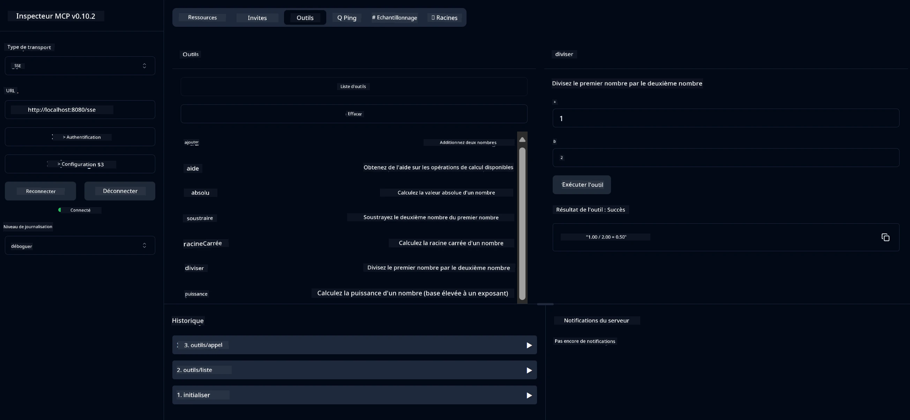

# Service MCP Calculatrice Basique

> [!NOTE]
> Cette solution Java utilise le transport HTTP+SSE hérité et cible un SDK
> compatible avec MCP `2025-11-25`. Elle est conservée pour correspondre au code du cours ;
> les nouveaux serveurs distants devraient utiliser le support HTTP Streamable `2026-07-28`.

Ce service fournit des opérations de calculatrice basiques via le protocole Model Context (MCP) en utilisant Spring Boot avec un transport WebFlux. Il est conçu comme un exemple simple pour les débutants découvrant les implémentations MCP.

Pour plus d'informations, consultez la documentation de référence [MCP Server Boot Starter](https://docs.spring.io/spring-ai/reference/api/mcp/mcp-server-boot-starter-docs.html).


## Utilisation du Service

Le service expose les points d'API suivants via le protocole MCP :

- `add(a, b)` : Additionner deux nombres
- `subtract(a, b)` : Soustraire le second nombre du premier
- `multiply(a, b)` : Multiplier deux nombres
- `divide(a, b)` : Diviser le premier nombre par le second (avec vérification de zéro)
- `power(base, exponent)` : Calculer la puissance d'un nombre
- `squareRoot(number)` : Calculer la racine carrée (avec vérification nombre négatif)
- `modulus(a, b)` : Calculer le reste de la division
- `absolute(number)` : Calculer la valeur absolue

## Dépendances

Le projet requiert les dépendances clés suivantes :

```xml
<dependency>
    <groupId>org.springframework.ai</groupId>
    <artifactId>spring-ai-starter-mcp-server-webflux</artifactId>
</dependency>
```

## Compilation du Projet

Compilez le projet en utilisant Maven :
```bash
./mvnw clean install -DskipTests
```

## Exécution du Serveur

### Utilisation de Java

```bash
java -jar target/calculator-server-0.0.1-SNAPSHOT.jar
```

### Utilisation de MCP Inspector

MCP Inspector est un outil utile pour interagir avec les services MCP. Pour l'utiliser avec ce service calculatrice :

1. **Installer et lancer MCP Inspector** dans une nouvelle fenêtre de terminal :
   ```bash
   npx @modelcontextprotocol/inspector
   ```

2. **Accéder à l'interface web** en cliquant sur l'URL affichée par l'application (généralement http://localhost:6274)

3. **Configurer la connexion** :
   - Définir le type de transport sur "SSE"
   - Définir l'URL sur le point d'extrémité SSE de votre serveur en fonctionnement : `http://localhost:8080/sse`
   - Cliquer sur "Connect"

4. **Utiliser les outils** :
   - Cliquer sur "List Tools" pour voir les opérations de calculatrice disponibles
   - Sélectionner un outil et cliquer sur "Run Tool" pour exécuter une opération



---

<!-- CO-OP TRANSLATOR DISCLAIMER START -->
**Avertissement** :
Ce document a été traduit à l'aide du service de traduction automatique [Co-op Translator](https://github.com/Azure/co-op-translator). Bien que nous nous efforçions d'assurer l'exactitude, veuillez noter que les traductions automatisées peuvent contenir des erreurs ou des inexactitudes. Le document original dans sa langue native doit être considéré comme la source faisant autorité. Pour les informations critiques, il est recommandé de recourir à une traduction professionnelle réalisée par un humain. Nous ne saurions être tenus responsables des malentendus ou erreurs d'interprétation découlant de l'utilisation de cette traduction.
<!-- CO-OP TRANSLATOR DISCLAIMER END -->