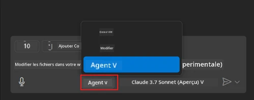
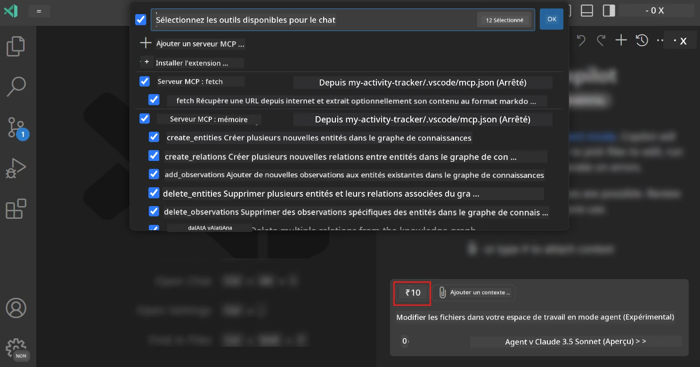
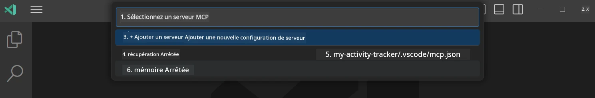
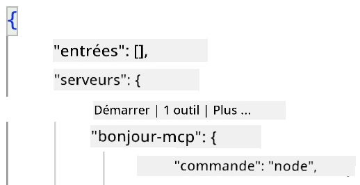
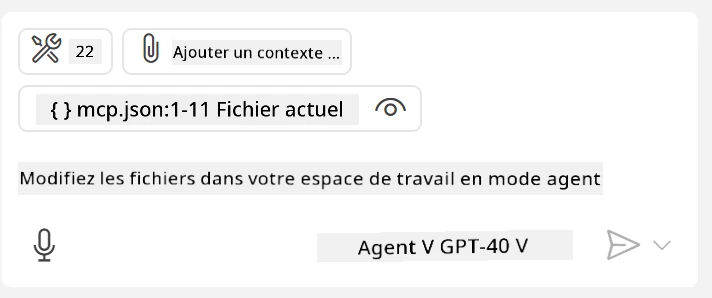
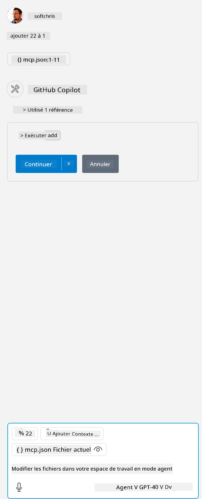

# Consommer un serveur depuis le mode GitHub Copilot Agent  

Visual Studio Code et GitHub Copilot peuvent agir en tant que client et consommer un serveur MCP. Pourquoi voudrions-nous faire cela, pourriez-vous demander ? Eh bien, cela signifie que toutes les fonctionnalités que le serveur MCP possède peuvent désormais être utilisées depuis votre IDE. Imaginez par exemple ajouter le serveur MCP de GitHub, cela permettrait de contrôler GitHub via des invites au lieu de taper des commandes spécifiques dans le terminal. Ou imaginez toute fonctionnalité en général qui pourrait améliorer votre expérience développeur, le tout contrôlé par langage naturel. Vous commencez à voir l'avantage, n'est-ce pas ?  

## Aperçu  

Cette leçon couvre comment utiliser Visual Studio Code et le mode Agent de GitHub Copilot comme client pour votre serveur MCP.  

## Objectifs d’apprentissage  

À la fin de cette leçon, vous serez capable de :  

- Consommer un serveur MCP via Visual Studio Code.  
- Exécuter des capacités comme des outils via GitHub Copilot.  
- Configurer Visual Studio Code pour trouver et gérer votre serveur MCP.  

## Utilisation  

Vous pouvez contrôler votre serveur MCP de deux manières différentes :  

- Interface utilisateur, vous verrez comment cela se fait plus tard dans ce chapitre.  
- Terminal, il est possible de contrôler des éléments depuis le terminal en utilisant l’exécutable `code` :  

  Pour ajouter un serveur MCP à votre profil utilisateur, utilisez l’option ligne de commande --add-mcp, et fournissez la configuration JSON du serveur sous la forme {\"name\":\"nom-du-serveur\",\"command\":...}.  

  ```
  code --add-mcp "{\"name\":\"my-server\",\"command\": \"uvx\",\"args\": [\"mcp-server-fetch\"]}"
  ```
  
### Captures d’écran  

  
  
  

Parlons davantage de l’utilisation de l’interface visuelle dans les sections suivantes.  

## Approche  

Voici comment nous devons aborder cela à un niveau général :  

- Configurer un fichier pour trouver notre serveur MCP.  
- Démarrer/Se connecter au serveur afin qu’il liste ses capacités.  
- Utiliser ces capacités via l’interface GitHub Copilot Chat.  

Parfait, maintenant que nous comprenons le flux, essayons d’utiliser un serveur MCP via Visual Studio Code avec un exercice.  

## Exercice : Consommer un serveur  

Dans cet exercice, nous allons configurer Visual Studio Code pour trouver votre serveur MCP afin qu’il puisse être utilisé depuis l’interface GitHub Copilot Chat.  

### -0- Étape préalable, activer la découverte du serveur MCP  

Vous devrez peut-être activer la découverte des serveurs MCP.  

1. Allez dans `Fichier -> Préférences -> Paramètres` dans Visual Studio Code.  

1. Recherchez « MCP » et activez `chat.mcp.discovery.enabled` dans le fichier settings.json.  

### -1- Créer un fichier de configuration  

Commencez par créer un fichier de configuration dans la racine de votre projet, vous aurez besoin d’un fichier appelé MCP.json que vous placerez dans un dossier nommé .vscode. Il devrait ressembler à ceci :  

```text
.vscode
|-- mcp.json
```
  
Ensuite, voyons comment ajouter une entrée serveur.  

### -2- Configurer un serveur  

Ajoutez le contenu suivant dans *mcp.json* :  

```json
{
    "inputs": [],
    "servers": {
       "hello-mcp": {
           "command": "node",
           "args": [
               "build/index.js"
           ]
       }
    }
}
```
  
Voici un exemple simple ci-dessus pour démarrer un serveur écrit en Node.js, pour d’autres environnements d’exécution indiquez la commande appropriée pour démarrer le serveur en utilisant `command` et `args`.  

### -3- Démarrer le serveur  

Maintenant que vous avez ajouté une entrée, lançons le serveur :  

1. Localisez votre entrée dans *mcp.json* et assurez-vous de trouver l’icône « jouer » :  

    

1. Cliquez sur l’icône « jouer », vous devriez voir l’icône outils dans GitHub Copilot Chat augmenter le nombre d’outils disponibles. Si vous cliquez sur cette icône outils, vous verrez une liste des outils enregistrés. Vous pouvez cocher/décocher chaque outil selon si vous voulez que GitHub Copilot les utilise comme contexte :  

    

1. Pour exécuter un outil, tapez une invite que vous savez correspondre à la description d’un de vos outils, par exemple une invite comme « add 22 to 1 » :  

    

  Vous devriez voir une réponse indiquant 23.  

## Devoir  

Essayez d’ajouter une entrée serveur à votre fichier *mcp.json* et assurez-vous de pouvoir démarrer/arrêter le serveur. Assurez-vous également de pouvoir communiquer avec les outils sur votre serveur via l’interface GitHub Copilot Chat.  

## Solution  

[Solution](./solution/README.md)  

## Points clés à retenir  

Les points à retenir de ce chapitre sont les suivants :  

- Visual Studio Code est un excellent client qui vous permet de consommer plusieurs serveurs MCP et leurs outils.  
- L’interface GitHub Copilot Chat est la manière dont vous interagissez avec les serveurs.  
- Vous pouvez inviter l’utilisateur à saisir des entrées comme des clés API qui peuvent être transmises au serveur MCP lors de la configuration de l’entrée serveur dans le fichier *mcp.json*.  

## Exemples  

- [Calculatrice Java](../samples/java/calculator/README.md)  
- [Calculatrice .Net](../../../../03-GettingStarted/samples/csharp)  
- [Calculatrice JavaScript](../samples/javascript/README.md)  
- [Calculatrice TypeScript](../samples/typescript/README.md)  
- [Calculatrice Python](../../../../03-GettingStarted/samples/python)  

## Ressources supplémentaires  

- [Documentation Visual Studio](https://code.visualstudio.com/docs/copilot/chat/mcp-servers)  

## Quelle est la suite  

- Suivant : [Créer un serveur stdio](../05-stdio-server/README.md)  

---

<!-- CO-OP TRANSLATOR DISCLAIMER START -->
**Avertissement** :
Ce document a été traduit à l'aide du service de traduction automatique [Co-op Translator](https://github.com/Azure/co-op-translator). Bien que nous nous efforçions d'assurer l'exactitude, veuillez noter que les traductions automatisées peuvent contenir des erreurs ou des inexactitudes. Le document original dans sa langue native doit être considéré comme la source faisant autorité. Pour les informations critiques, il est recommandé de recourir à une traduction professionnelle réalisée par un humain. Nous ne saurions être tenus responsables des malentendus ou erreurs d'interprétation découlant de l'utilisation de cette traduction.
<!-- CO-OP TRANSLATOR DISCLAIMER END -->