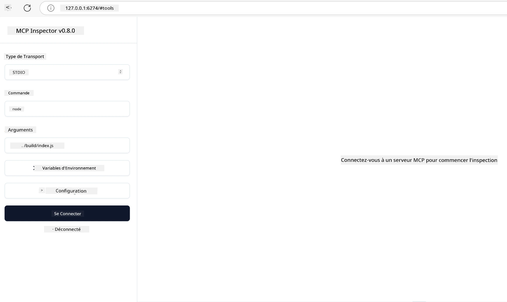

## Test et débogage

Avant de commencer à tester votre serveur MCP, il est important de comprendre les outils disponibles et les meilleures pratiques pour le débogage. Des tests efficaces garantissent que votre serveur se comporte comme prévu et vous aident à identifier et résoudre rapidement les problèmes. La section suivante décrit les approches recommandées pour valider votre implémentation MCP.

## Vue d'ensemble

Cette leçon couvre comment choisir la bonne approche de test et l'outil de test le plus efficace.

## Objectifs d'apprentissage

À la fin de cette leçon, vous serez capable de :

- Décrire diverses approches pour les tests.
- Utiliser différents outils pour tester efficacement votre code.

## Tester les serveurs MCP

MCP fournit des outils pour vous aider à tester et déboguer vos serveurs :

- **MCP Inspector** : Un outil en ligne de commande qui peut être utilisé aussi bien en CLI qu'en mode visuel.
- **Tests manuels** : Vous pouvez utiliser un outil comme curl pour effectuer des requêtes web, mais tout outil capable d'exécuter du HTTP convient.
- **Tests unitaires** : Il est possible d'utiliser votre framework de test préféré pour tester les fonctionnalités du serveur et du client.

### Utilisation de MCP Inspector

Nous avons décrit l'utilisation de cet outil dans les leçons précédentes, mais parlons-en brièvement à un niveau élevé. C'est un outil développé en Node.js que vous pouvez utiliser en appelant l'exécutable `npx` qui téléchargera et installera temporairement l'outil, puis se nettoiera une fois la requête exécutée.

Le [MCP Inspector](https://github.com/modelcontextprotocol/inspector) vous aide à :

- **Découvrir les capacités du serveur** : Détecter automatiquement les ressources, outils et invites disponibles
- **Tester l'exécution des outils** : Essayer différents paramètres et voir les réponses en temps réel
- **Afficher les métadonnées du serveur** : Examiner les informations du serveur, les schémas et les configurations

Une exécution typique de l'outil ressemble à ceci :

```bash
npx @modelcontextprotocol/inspector node build/index.js
```

La commande ci-dessus lance un MCP avec son interface visuelle et ouvre une interface web locale dans votre navigateur. Vous pouvez vous attendre à voir un tableau de bord affichant vos serveurs MCP enregistrés, leurs outils, ressources et invites disponibles. L'interface vous permet de tester l'exécution des outils de manière interactive, d'inspecter les métadonnées du serveur et de visualiser les réponses en temps réel, ce qui facilite la validation et le débogage de vos implémentations de serveurs MCP.

Voici à quoi cela peut ressembler : 

Vous pouvez aussi exécuter cet outil en mode CLI en ajoutant l'attribut `--cli`. Voici un exemple d'exécution en mode "CLI" listant tous les outils sur le serveur :

```sh
npx @modelcontextprotocol/inspector --cli node build/index.js --method tools/list
```

### Tests manuels

En dehors de l'utilisation de l'outil inspector pour tester les capacités du serveur, une approche similaire consiste à utiliser un client capable de faire des requêtes HTTP comme curl par exemple.

Avec curl, vous pouvez tester directement les serveurs MCP avec des requêtes HTTP :

```bash
# Exemple : Métadonnées du serveur de test
curl http://localhost:3000/v1/metadata

# Exemple : Exécuter un outil
curl -X POST http://localhost:3000/v1/tools/execute \
  -H "Content-Type: application/json" \
  -d '{"name": "calculator", "parameters": {"expression": "2+2"}}'
```

Comme vous le voyez dans cet exemple d'utilisation de curl, vous utilisez une requête POST pour invoquer un outil en envoyant une charge utile comprenant le nom de l'outil et ses paramètres. Utilisez l'approche qui vous convient le mieux. Les outils CLI sont généralement plus rapides à utiliser et se prêtent bien à l'automatisation, ce qui peut être utile dans un environnement CI/CD.

### Tests unitaires

Créez des tests unitaires pour vos outils et ressources afin de garantir qu'ils fonctionnent comme prévu. Voici un exemple de code de test.

```python
import pytest

from mcp.server.fastmcp import FastMCP
from mcp.shared.memory import (
    create_connected_server_and_client_session as create_session,
)

# Marquer tout le module pour les tests asynchrones
pytestmark = pytest.mark.anyio


async def test_list_tools_cursor_parameter():
    """Test that the cursor parameter is accepted for list_tools.

    Note: FastMCP doesn't currently implement pagination, so this test
    only verifies that the cursor parameter is accepted by the client.
    """

 server = FastMCP("test")

    # Créer quelques outils de test
    @server.tool(name="test_tool_1")
    async def test_tool_1() -> str:
        """First test tool"""
        return "Result 1"

    @server.tool(name="test_tool_2")
    async def test_tool_2() -> str:
        """Second test tool"""
        return "Result 2"

    async with create_session(server._mcp_server) as client_session:
        # Tester sans paramètre curseur (omise)
        result1 = await client_session.list_tools()
        assert len(result1.tools) == 2

        # Tester avec curseur=None
        result2 = await client_session.list_tools(cursor=None)
        assert len(result2.tools) == 2

        # Tester avec curseur en tant que chaîne
        result3 = await client_session.list_tools(cursor="some_cursor_value")
        assert len(result3.tools) == 2

        # Tester avec curseur chaîne vide
        result4 = await client_session.list_tools(cursor="")
        assert len(result4.tools) == 2
    
```

Le code précédent fait ce qui suit :

- Utilise le framework pytest qui vous permet de créer des tests sous forme de fonctions et d'utiliser des assertions.
- Crée un serveur MCP avec deux outils différents.
- Utilise l'instruction `assert` pour vérifier que certaines conditions sont remplies.

Consultez le [fichier complet ici](https://github.com/modelcontextprotocol/python-sdk/blob/main/tests/client/test_list_methods_cursor.py).

Avec ce fichier, vous pouvez tester votre propre serveur pour vous assurer que les capacités sont créées comme elles le doivent.

Tous les SDK majeurs ont des sections de test similaires, vous pouvez donc les adapter à votre environnement d'exécution préféré.

## Exemples

- [Java Calculator](../samples/java/calculator/README.md)
- [.Net Calculator](../../../../03-GettingStarted/samples/csharp)
- [JavaScript Calculator](../samples/javascript/README.md)
- [TypeScript Calculator](../samples/typescript/README.md)
- [Python Calculator](../../../../03-GettingStarted/samples/python)

## Ressources supplémentaires

- [Python SDK](https://github.com/modelcontextprotocol/python-sdk)

## Qu'est-ce qui vient ensuite

- Suivant : [Déploiement](../09-deployment/README.md)

---

<!-- CO-OP TRANSLATOR DISCLAIMER START -->
**Avis de non-responsabilité** :  
Ce document a été traduit à l’aide du service de traduction automatique [Co-op Translator](https://github.com/Azure/co-op-translator). Bien que nous nous efforcions d’assurer l’exactitude, veuillez noter que les traductions automatiques peuvent comporter des erreurs ou des inexactitudes. Le document original dans sa langue d’origine doit être considéré comme la source faisant foi. Pour les informations critiques, il est recommandé de recourir à une traduction professionnelle effectuée par un traducteur humain. Nous ne saurions être tenus responsables des malentendus ou interprétations erronées résultant de l’usage de cette traduction.
<!-- CO-OP TRANSLATOR DISCLAIMER END -->