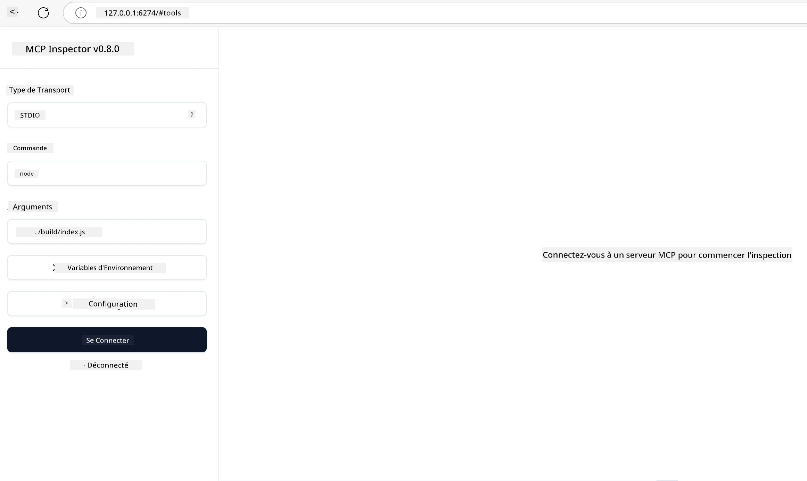

## Test et débogage

Avant de commencer à tester votre serveur MCP, il est important de comprendre les outils disponibles et les meilleures pratiques pour le débogage. Un test efficace garantit que votre serveur se comporte comme prévu et vous aide à identifier et résoudre rapidement les problèmes. La section suivante présente les approches recommandées pour valider votre implémentation MCP.

## Aperçu

Cette leçon explique comment choisir la bonne approche de test et l'outil de test le plus efficace.

## Objectifs d’apprentissage

À la fin de cette leçon, vous serez capable de :

- Décrire différentes approches pour les tests.
- Utiliser différents outils pour tester efficacement votre code.


## Tester les serveurs MCP

MCP fournit des outils pour vous aider à tester et déboguer vos serveurs :

- **MCP Inspector** : un outil en ligne de commande pouvant être utilisé à la fois en CLI et sous forme d’interface visuelle.
- **Tests manuels** : vous pouvez utiliser un outil comme curl pour effectuer des requêtes web, mais tout outil capable d’exécuter HTTP convient.
- **Tests unitaires** : il est possible d’utiliser votre framework de test préféré pour tester les fonctionnalités du serveur et du client.

### Utilisation de MCP Inspector

Nous avons décrit l’utilisation de cet outil dans des leçons précédentes, mais parlons-en un peu à un niveau général. C’est un outil construit en Node.js et vous pouvez l’utiliser en appelant l’exécutable `npx` qui téléchargera et installera temporairement l’outil et le nettoiera une fois que votre requête aura été traitée.

Le [MCP Inspector](https://github.com/modelcontextprotocol/inspector) vous aide à :

- **Découvrir les capacités du serveur** : détecter automatiquement les ressources, outils et invites disponibles
- **Tester l’exécution des outils** : essayer différents paramètres et voir les réponses en temps réel
- **Visualiser les métadonnées du serveur** : examiner les informations du serveur, schémas et configurations

Une exécution typique de l’outil ressemble à ceci :

```bash
npx @modelcontextprotocol/inspector node build/index.js
```

La commande ci-dessus démarre un MCP et son interface visuelle et lance une interface web locale dans votre navigateur. Vous pouvez vous attendre à voir un tableau de bord affichant vos serveurs MCP enregistrés, leurs outils, ressources et invites disponibles. L’interface vous permet de tester de façon interactive l’exécution des outils, d’inspecter les métadonnées du serveur et de visualiser les réponses en temps réel, ce qui facilite la validation et le débogage de vos implémentations MCP.

Voici à quoi cela peut ressembler : 

Vous pouvez aussi exécuter cet outil en mode CLI en ajoutant l’attribut `--cli`. Voici un exemple d’exécution de l’outil en mode "CLI" qui liste tous les outils du serveur :

```sh
npx @modelcontextprotocol/inspector --cli node build/index.js --method tools/list
```

### Tests manuels

En plus de lancer l’outil inspector pour tester les capacités du serveur, une autre approche similaire est d’utiliser un client capable d’utiliser HTTP comme curl, par exemple.

Avec curl, vous pouvez tester les serveurs MCP directement en effectuant des requêtes HTTP :

```bash
# Exemple : Tester les métadonnées du serveur
curl http://localhost:3000/v1/metadata

# Exemple : Exécuter un outil
curl -X POST http://localhost:3000/v1/tools/execute \
  -H "Content-Type: application/json" \
  -d '{"name": "calculator", "parameters": {"expression": "2+2"}}'
```

Comme vous pouvez le voir dans l’utilisation de curl ci-dessus, vous utilisez une requête POST pour invoquer un outil avec une charge utile comprenant le nom de l’outil et ses paramètres. Choisissez l’approche qui vous convient le mieux. Les outils CLI ont généralement l’avantage d’être plus rapides à utiliser et peuvent être facilement scriptés, ce qui peut être utile dans un environnement CI/CD.

### Tests unitaires

Créez des tests unitaires pour vos outils et ressources afin de vous assurer qu’ils fonctionnent comme prévu. Voici un exemple de code de test.

```python
import pytest

from mcp.server.fastmcp import FastMCP
from mcp.shared.memory import (
    create_connected_server_and_client_session as create_session,
)

# Marquer tout le module pour les tests asynchrones
pytestmark = pytest.mark.anyio


async def test_list_tools_cursor_parameter():
    """Test that the cursor parameter is accepted for list_tools.

    Note: FastMCP doesn't currently implement pagination, so this test
    only verifies that the cursor parameter is accepted by the client.
    """

 server = FastMCP("test")

    # Créer quelques outils de test
    @server.tool(name="test_tool_1")
    async def test_tool_1() -> str:
        """First test tool"""
        return "Result 1"

    @server.tool(name="test_tool_2")
    async def test_tool_2() -> str:
        """Second test tool"""
        return "Result 2"

    async with create_session(server._mcp_server) as client_session:
        # Tester sans le paramètre curseur (omis)
        result1 = await client_session.list_tools()
        assert len(result1.tools) == 2

        # Tester avec curseur=None
        result2 = await client_session.list_tools(cursor=None)
        assert len(result2.tools) == 2

        # Tester avec curseur en tant que chaîne
        result3 = await client_session.list_tools(cursor="some_cursor_value")
        assert len(result3.tools) == 2

        # Tester avec un curseur chaîne vide
        result4 = await client_session.list_tools(cursor="")
        assert len(result4.tools) == 2
    
```

Le code précédent fait ce qui suit :

- Utilise le framework pytest qui permet de créer des tests sous forme de fonctions et d’utiliser des assertions.
- Crée un serveur MCP avec deux outils différents.
- Utilise l’instruction `assert` pour vérifier que certaines conditions sont remplies.

Consultez le [fichier complet ici](https://github.com/modelcontextprotocol/python-sdk/blob/main/tests/client/test_list_methods_cursor.py)

À partir de ce fichier, vous pouvez tester votre propre serveur pour garantir que les capacités sont créées comme prévu.

Tous les SDK majeurs disposent de sections de test similaires, vous pouvez donc vous adapter à votre environnement d’exécution choisi.

## Exemples

- [Calculatrice Java](../samples/java/calculator/README.md)
- [Calculatrice .Net](../../../../03-GettingStarted/samples/csharp)
- [Calculatrice JavaScript](../samples/javascript/README.md)
- [Calculatrice TypeScript](../samples/typescript/README.md)
- [Calculatrice Python](../../../../03-GettingStarted/samples/python) 

## Ressources supplémentaires

- [SDK Python](https://github.com/modelcontextprotocol/python-sdk)

## Étape suivante

- Suivant : [Déploiement](../09-deployment/README.md)

---

<!-- CO-OP TRANSLATOR DISCLAIMER START -->
**Avertissement** :
Ce document a été traduit à l'aide du service de traduction automatique [Co-op Translator](https://github.com/Azure/co-op-translator). Bien que nous nous efforçions d'assurer l'exactitude, veuillez noter que les traductions automatisées peuvent contenir des erreurs ou des inexactitudes. Le document original dans sa langue native doit être considéré comme la source faisant autorité. Pour les informations critiques, il est recommandé de recourir à une traduction professionnelle réalisée par un humain. Nous ne saurions être tenus responsables des malentendus ou erreurs d'interprétation découlant de l'utilisation de cette traduction.
<!-- CO-OP TRANSLATOR DISCLAIMER END -->