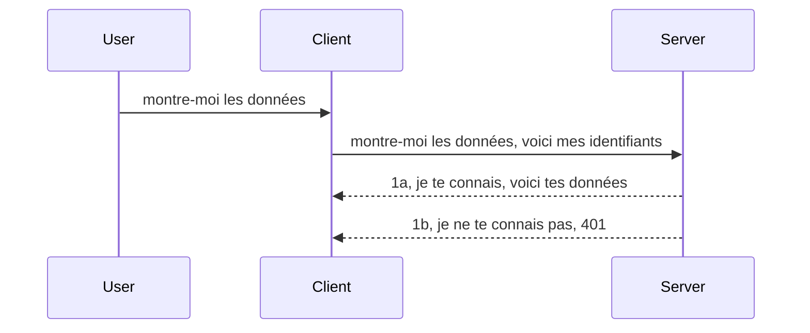

# Auth simple

Les SDK MCP prennent en charge l'utilisation d'OAuth 2.1 qui, pour être honnête, est un processus assez complexe impliquant des concepts comme le serveur d'authentification, le serveur de ressources, l'envoi des identifiants, l'obtention d'un code, l'échange du code contre un jeton porteur jusqu'à ce que vous puissiez finalement obtenir vos données de ressources. Si vous n'êtes pas habitué à OAuth, ce qui est une excellente chose à implémenter, il est préférable de commencer par un niveau d'authentification basique et d'évoluer vers une sécurité toujours meilleure. C'est pourquoi ce chapitre existe, pour vous guider vers une authentification plus avancée.

## Auth, qu'est-ce que ça veut dire ?

Auth est l'abréviation d'authentification et d'autorisation. L'idée est que nous devons faire deux choses :

- **Authentification**, qui est le processus de déterminer si nous laissons une personne entrer dans notre maison, qu'elle a le droit d'être "ici", c'est-à-dire d'avoir accès à notre serveur de ressources où vivent les fonctionnalités de notre MCP Server.
- **Autorisation**, est le processus de vérifier si un utilisateur doit avoir accès à ces ressources spécifiques qu'il demande, par exemple ces commandes ou ces produits, ou s'il est autorisé à lire le contenu mais pas à supprimer, comme autre exemple.

## Identifiants : comment on indique au système qui nous sommes

Eh bien, la plupart des développeurs web pensent en termes de fournir un identifiant au serveur, généralement un secret qui dit s'ils sont autorisés à être ici "Authentification". Cet identifiant est généralement une version codée en base64 du nom d'utilisateur et du mot de passe ou une clé API qui identifie de manière unique un utilisateur spécifique.

Cela implique de l'envoyer via un en-tête appelé "Authorization" comme ceci :

```json
{ "Authorization": "secret123" }
```

Cela s'appelle habituellement authentification basique. Le flux global fonctionne ensuite de la manière suivante :



Maintenant que nous comprenons comment cela fonctionne du point de vue du flux, comment l'implémentons-nous ? Eh bien, la plupart des serveurs web ont un concept appelé middleware, un morceau de code qui s'exécute dans le cadre de la requête et peut vérifier les identifiants, et si les identifiants sont valides, laisse passer la requête. Si la requête n'a pas d'identifiants valides, vous obtenez une erreur d'authentification. Voyons comment cela peut être implémenté :

**Python**

```python
class AuthMiddleware(BaseHTTPMiddleware):
    async def dispatch(self, request, call_next):

        has_header = request.headers.get("Authorization")
        if not has_header:
            print("-> Missing Authorization header!")
            return Response(status_code=401, content="Unauthorized")

        if not valid_token(has_header):
            print("-> Invalid token!")
            return Response(status_code=403, content="Forbidden")

        print("Valid token, proceeding...")
       
        response = await call_next(request)
        # ajouter des en-têtes clients ou modifier la réponse d'une certaine manière
        return response


starlette_app.add_middleware(CustomHeaderMiddleware)
```

Ici nous avons :

- Créé un middleware appelé `AuthMiddleware` où sa méthode `dispatch` est invoquée par le serveur web.
- Ajouté le middleware au serveur web :

    ```python
    starlette_app.add_middleware(AuthMiddleware)
    ```

- Écrit une logique de validation qui vérifie si l'en-tête Authorization est présent et si le secret envoyé est valide :

    ```python
    has_header = request.headers.get("Authorization")
    if not has_header:
        print("-> Missing Authorization header!")
        return Response(status_code=401, content="Unauthorized")

    if not valid_token(has_header):
        print("-> Invalid token!")
        return Response(status_code=403, content="Forbidden")
    ```

    si le secret est présent et valide alors on laisse passer la requête en appelant `call_next` et retourne la réponse.

    ```python
    response = await call_next(request)
    # ajouter des en-têtes clients ou modifier la réponse d'une quelconque manière
    return response
    ```

Le fonctionnement est que si une requête web est faite vers le serveur, le middleware sera invoqué et selon son implémentation, il laissera la requête passer ou finira par renvoyer une erreur indiquant que le client n'est pas autorisé à continuer.

**TypeScript**

Ici nous créons un middleware avec le populaire framework Express et interceptez la requête avant qu'elle n'atteigne le MCP Server. Voici le code pour cela :

```typescript
function isValid(secret) {
    return secret === "secret123";
}

app.use((req, res, next) => {
    // 1. En-tête d'autorisation présent ?
    if(!req.headers["Authorization"]) {
        res.status(401).send('Unauthorized');
    }
    
    let token = req.headers["Authorization"];

    // 2. Vérifier la validité.
    if(!isValid(token)) {
        res.status(403).send('Forbidden');
    }

   
    console.log('Middleware executed');
    // 3. Transmet la requête à l'étape suivante du pipeline de requête.
    next();
});
```

Dans ce code :

1. On vérifie si l'en-tête Authorization est présent en premier lieu, sinon on envoie une erreur 401.
2. On s'assure que l'identifiant/jeton est valide, sinon on envoie une erreur 403.
3. On laisse finalement passer la requête dans le pipeline de requête et renvoie la ressource demandée.

## Exercice : implémenter l'authentification

Prenons nos connaissances et essayons de l'implémenter. Voici le plan :

Serveur

- Créer un serveur web et une instance MCP.
- Implémenter un middleware pour le serveur.

Client

- Envoyer une requête web, avec identifiant, via un en-tête.

### -1- Créer un serveur web et une instance MCP

> [!WARNING]
> L'exemple TypeScript ci-dessous cible MCP `2025-11-25`. Il suit les transports
> par `mcp-session-id` et n'est pas un exemple actuel de transport `2026-07-28`. MCP
> `2026-07-28` supprime la poignée de main `initialize` et l'ID de session du protocole ; les nouvelles
> implémentations utilisent des requêtes auto-contenues. Voir
> [Quoi de neuf dans MCP : Spécification 2026-07-28](../../01-CoreConcepts/mcp-2026-07-28.md).

Dans notre première étape, nous devons créer l'instance du serveur web et le MCP Server.

**Python**

Ici nous créons une instance MCP server, créons une application web starlette et l'hébergeons avec uvicorn.

```python
# création du serveur MCP

app = FastMCP(
    name="MCP Resource Server",
    instructions="Resource Server that validates tokens via Authorization Server introspection",
    host=settings["host"],
    port=settings["port"],
    debug=True
)

# création de l'application web starlette
starlette_app = app.streamable_http_app()

# service de l'application via uvicorn
async def run(starlette_app):
    import uvicorn
    config = uvicorn.Config(
            starlette_app,
            host=app.settings.host,
            port=app.settings.port,
            log_level=app.settings.log_level.lower(),
        )
    server = uvicorn.Server(config)
    await server.serve()

run(starlette_app)
```

Dans ce code :

- Création du MCP Server.
- Construction de l'application web starlette à partir du MCP Server, `app.streamable_http_app()`.
- Hébergement et service de l'application web avec uvicorn `server.serve()`.

**TypeScript**

Ici, nous créons une instance de MCP Server.

```typescript
const server = new McpServer({
      name: "example-server",
      version: "1.0.0"
    });

    // ... configurer les ressources du serveur, les outils et les invites ...
```

Cette création de MCP Server devra se faire dans notre définition de route POST /mcp, alors reprenons le code ci-dessus et déplaçons-le ainsi :

```typescript
import express from "express";
import { randomUUID } from "node:crypto";
import { McpServer } from "@modelcontextprotocol/sdk/server/mcp.js";
import { StreamableHTTPServerTransport } from "@modelcontextprotocol/sdk/server/streamableHttp.js";
import { isInitializeRequest } from "@modelcontextprotocol/sdk/types.js"

const app = express();
app.use(express.json());

// Carte pour stocker les transports par ID de session
const transports: { [sessionId: string]: StreamableHTTPServerTransport } = {};

// Gérer les requêtes POST pour la communication client-serveur
app.post('/mcp', async (req, res) => {
  // Vérifier l'existence de l'ID de session
  const sessionId = req.headers['mcp-session-id'] as string | undefined;
  let transport: StreamableHTTPServerTransport;

  if (sessionId && transports[sessionId]) {
    // Réutiliser le transport existant
    transport = transports[sessionId];
  } else if (!sessionId && isInitializeRequest(req.body)) {
    // Nouvelle demande d'initialisation
    transport = new StreamableHTTPServerTransport({
      sessionIdGenerator: () => randomUUID(),
      onsessioninitialized: (sessionId) => {
        // Stocker le transport par ID de session
        transports[sessionId] = transport;
      },
      // La protection contre le rebinding DNS est désactivée par défaut pour la compatibilité ascendante. Si vous exécutez ce serveur
      // localement, assurez-vous de définir :
      // enableDnsRebindingProtection : true,
      // allowedHosts : ['127.0.0.1'],
    });

    // Nettoyer le transport lorsqu'il est fermé
    transport.onclose = () => {
      if (transport.sessionId) {
        delete transports[transport.sessionId];
      }
    };
    const server = new McpServer({
      name: "example-server",
      version: "1.0.0"
    });

    // ... configurer les ressources, outils et invites du serveur ...

    // Se connecter au serveur MCP
    await server.connect(transport);
  } else {
    // Requête invalide
    res.status(400).json({
      jsonrpc: '2.0',
      error: {
        code: -32000,
        message: 'Bad Request: No valid session ID provided',
      },
      id: null,
    });
    return;
  }

  // Gérer la requête
  await transport.handleRequest(req, res, req.body);
});

// Gestionnaire réutilisable pour les requêtes GET et DELETE
const handleSessionRequest = async (req: express.Request, res: express.Response) => {
  const sessionId = req.headers['mcp-session-id'] as string | undefined;
  if (!sessionId || !transports[sessionId]) {
    res.status(400).send('Invalid or missing session ID');
    return;
  }
  
  const transport = transports[sessionId];
  await transport.handleRequest(req, res);
};

// Gérer les requêtes GET pour les notifications serveur-client via SSE
app.get('/mcp', handleSessionRequest);

// Gérer les requêtes DELETE pour la terminaison de session
app.delete('/mcp', handleSessionRequest);

app.listen(3000);
```

Maintenant vous voyez comment la création du MCP Server a été déplacée dans `app.post("/mcp")`.

Passons à l'étape suivante qui consiste à créer le middleware pour que nous puissions valider l'identifiant reçu.

### -2- Implémenter un middleware pour le serveur

Passons à la partie middleware. Ici nous allons créer un middleware qui cherche un identifiant dans l'en-tête `Authorization` et le valide. S'il est acceptable, la requête continuera pour faire ce qu'elle doit (par exemple lister des outils, lire une ressource ou toute autre fonctionnalité MCP demandée par le client).

**Python**

Pour créer le middleware, il faut créer une classe qui hérite de `BaseHTTPMiddleware`. Deux éléments intéressants :

- La requête `request` dont on lit les infos d'en-tête.
- `call_next` le callback à invoquer si le client a apporté un identifiant que nous acceptons.

D'abord, on gère le cas où l'en-tête `Authorization` est manquant :

```python
has_header = request.headers.get("Authorization")

# pas d'en-tête présent, échouer avec 401, sinon continuer.
if not has_header:
    print("-> Missing Authorization header!")
    return Response(status_code=401, content="Unauthorized")
```

Ici on envoie un message 401 non autorisé car le client échoue à l'authentification.

Ensuite, si un identifiant est soumis, il faut vérifier sa validité comme suit :

```python
 if not valid_token(has_header):
    print("-> Invalid token!")
    return Response(status_code=403, content="Forbidden")
```

Notez qu'on envoie un message 403 interdit ci-dessus. Voici le middleware complet implémentant tout ce que nous avons mentionné :

```python
class AuthMiddleware(BaseHTTPMiddleware):
    async def dispatch(self, request, call_next):

        has_header = request.headers.get("Authorization")
        if not has_header:
            print("-> Missing Authorization header!")
            return Response(status_code=401, content="Unauthorized")

        if not valid_token(has_header):
            print("-> Invalid token!")
            return Response(status_code=403, content="Forbidden")

        print("Valid token, proceeding...")
        print(f"-> Received {request.method} {request.url}")
        response = await call_next(request)
        response.headers['Custom'] = 'Example'
        return response

```

Super, mais qu'en est-il de la fonction `valid_token` ? La voici ci-dessous :

```python
# N'UTILISEZ PAS pour la production - améliorez-le !!
def valid_token(token: str) -> bool:
    # retirez le préfixe "Bearer "
    if token.startswith("Bearer "):
        token = token[7:]
        return token == "secret-token"
    return False
```

Cela devrait évidemment être amélioré.

IMPORTANT : Vous NE DEVEZ JAMAIS avoir de secrets comme celui-ci dans le code. Idéalement, vous devriez récupérer la valeur à comparer depuis une source de données ou depuis un fournisseur d'identité (IDP) ou mieux encore, laisser l'IDP faire la validation.

**TypeScript**

Pour implémenter cela avec Express, nous devons appeler la méthode `use` qui prend des fonctions middleware.

Nous devons :

- Interagir avec la variable de requête pour vérifier l'identifiant passé dans la propriété `Authorization`.
- Valider l'identifiant, et si c'est bon laisser la requête continuer et faire effectuer la requête MCP du client (ex : lister des outils, lire une ressource ou autre opération liée à MCP).

Ici, on vérifie si l'en-tête `Authorization` est présent et sinon on stoppe la requête :

```typescript
if(!req.headers["authorization"]) {
    res.status(401).send('Unauthorized');
    return;
}
```

Si l'en-tête n'est pas envoyé en premier lieu, vous recevez un 401.

Ensuite on vérifie si l'identifiant est valide, sinon on stoppe encore la requête mais avec un message légèrement différent :

```typescript
if(!isValid(token)) {
    res.status(403).send('Forbidden');
    return;
} 
```

Notez que vous obtenez maintenant une erreur 403.

Voici le code complet :

```typescript
app.use((req, res, next) => {
    console.log('Request received:', req.method, req.url, req.headers);
    console.log('Headers:', req.headers["authorization"]);
    if(!req.headers["authorization"]) {
        res.status(401).send('Unauthorized');
        return;
    }
    
    let token = req.headers["authorization"];

    if(!isValid(token)) {
        res.status(403).send('Forbidden');
        return;
    }  

    console.log('Middleware executed');
    next();
});
```

Nous avons configuré le serveur web pour accepter un middleware qui vérifie l'identifiant que le client devrait nous envoyer. Mais qu'en est-il du client lui-même ?

### -3- Envoyer une requête web avec identifiant via l'en-tête

Il faut s'assurer que le client passe l'identifiant via l'en-tête. Comme nous allons utiliser un client MCP pour cela, il faut voir comment faire.

**Python**

Pour le client, il faut passer un en-tête avec notre identifiant comme ceci :

```python
# NE PAS coder en dur la valeur, la garder au minimum dans une variable d'environnement ou un stockage plus sécurisé
token = "secret-token"

async with streamablehttp_client(
        url = f"http://localhost:{port}/mcp",
        headers = {"Authorization": f"Bearer {token}"}
    ) as (
        read_stream,
        write_stream,
        session_callback,
    ):
        async with ClientSession(
            read_stream,
            write_stream
        ) as session:
            await session.initialize()
      
            # TODO, ce que vous souhaitez faire dans le client, par ex. lister les outils, appeler les outils, etc.
```

Notez comment nous remplissons la propriété `headers` ainsi : ` headers = {"Authorization": f"Bearer {token}"}`.

**TypeScript**

Nous pouvons résoudre cela en deux étapes :

1. Remplir un objet de configuration avec notre identifiant.
2. Passer l'objet de configuration au transport.

```typescript

// NE codez PAS en dur la valeur comme montré ici. Au minimum, ayez-la en tant que variable d'environnement et utilisez quelque chose comme dotenv (en mode dev).
let token = "secret123"

// définir un objet d'options de transport client
let options: StreamableHTTPClientTransportOptions = {
  sessionId: sessionId,
  requestInit: {
    headers: {
      "Authorization": "secret123"
    }
  }
};

// passer l'objet options au transport
async function main() {
   const transport = new StreamableHTTPClientTransport(
      new URL(serverUrl),
      options
   );
```

Ici vous voyez ci-dessus comment on a dû créer un objet `options` et placer nos en-têtes sous la propriété `requestInit`.

IMPORTANT : Comment améliorer cela à partir d'ici ? Eh bien, l'implémentation actuelle présente des problèmes. Premièrement, passer un identifiant ainsi est assez risqué sauf si vous avez au minimum HTTPS. Même dans ce cas, l'identifiant peut être volé donc vous avez besoin d'un système où vous pouvez facilement révoquer le jeton et ajouter des contrôles supplémentaires comme d'où vient la requête géographiquement, si la requête arrive trop souvent (comportement type bot), en bref, il y a toute une série de préoccupations.

Il faut néanmoins dire que pour des APIs très simples où vous ne voulez pas que quelqu'un appelle votre API sans être authentifié, ce que nous avons ici est un bon début.

Cela dit, essayons de renforcer un peu la sécurité en utilisant un format standardisé comme JSON Web Token, aussi connu sous le nom JWT ou jetons "JOT".

## JSON Web Tokens, JWT

Alors, nous essayons d'améliorer les choses par rapport à l'envoi d'identifiants très simples. Quelles sont les améliorations immédiates en adoptant JWT ?

- **Améliorations de la sécurité**. Dans l'authentification basique, vous envoyez le nom d'utilisateur et le mot de passe codés en base64 (ou une clé API) à répétition, ce qui augmente le risque. Avec JWT, vous envoyez votre nom d'utilisateur et mot de passe et recevez un jeton en retour, qui est aussi limité dans le temps, donc il expire. JWT vous permet facilement d'utiliser un contrôle d'accès fin avec des rôles, scopes et permissions.
- **Sans état et évolutivité**. Les JWT sont auto-contenus, ils transportent toutes les infos utilisateur et éliminent le besoin de stocker la session côté serveur. Le jeton peut aussi être validé localement.
- **Interopérabilité et fédération**. Les JWT sont au cœur de Open ID Connect et sont utilisés avec des fournisseurs d'identité connus comme Entra ID, Google Identity et Auth0. Ils permettent aussi le single sign-on et bien plus, en faisant une solution entreprise.
- **Modularité et flexibilité**. Les JWT peuvent aussi être utilisés avec des passerelles API comme Azure API Management, NGINX et autres. Ils supportent également les scénarios d'authentification utilisateurs et la communication serveur-à-service incluant l'usurpation d'identité et la délégation.
- **Performance et caching**. Les JWT peuvent être mis en cache après décodage, ce qui réduit le besoin de parsing. Cela aide particulièrement avec les applications à fort trafic en améliorant le débit et réduisant la charge sur votre infrastructure.
- **Fonctionnalités avancées**. Ils supportent aussi l'introspection (vérification côté serveur) et la révocation (rendre un jeton invalide).

Avec tous ces bénéfices, voyons comment monter notre implémentation au niveau supérieur.

## Transformer l'authentification basique en JWT

Donc, les changements à effectuer au niveau élevé sont :

- **Apprendre à construire un jeton JWT** et le préparer pour l'envoi client-serveur.
- **Valider un jeton JWT**, et si c'est OK, laisser le client accéder à nos ressources.
- **Stockage sécurisé du jeton**. Comment nous stockons ce jeton.
- **Protéger les routes**. Nous devons protéger les routes, dans notre cas, protéger certaines routes et fonctionnalités spécifiques MCP.
- **Ajouter des jetons de rafraîchissement**. Assurer la création de jetons à courte durée de vie mais aussi de jetons de rafraîchissement à longue durée de vie pouvant être utilisés pour obtenir de nouveaux jetons s'ils expirent. Assurer aussi un endpoint de rafraîchissement et une stratégie de rotation.

### -1- Construire un jeton JWT

Tout d'abord, un jeton JWT a les parties suivantes :

- **header**, algorithme utilisé et type de jeton.
- **payload**, les claims, comme sub (l'utilisateur ou entité que le jeton représente, typiquement l'ID utilisateur dans un scénario d'auth), exp (date d'expiration), role (le rôle)
- **signature**, signée avec un secret ou une clé privée.

Pour cela, nous devons construire le header, le payload et le jeton encodé.

**Python**

```python

import jwt
import jwt
from jwt.exceptions import ExpiredSignatureError, InvalidTokenError
import datetime

# Clé secrète utilisée pour signer le JWT
secret_key = 'your-secret-key'

header = {
    "alg": "HS256",
    "typ": "JWT"
}

# les informations de l'utilisateur, ses revendications et le temps d'expiration
payload = {
    "sub": "1234567890",               # Sujet (ID utilisateur)
    "name": "User Userson",                # Requête personnalisée
    "admin": True,                     # Requête personnalisée
    "iat": datetime.datetime.utcnow(),# Émis à
    "exp": datetime.datetime.utcnow() + datetime.timedelta(hours=1)  # Expiration
}

# l'encoder
encoded_jwt = jwt.encode(payload, secret_key, algorithm="HS256", headers=header)
```

Dans le code ci-dessus nous avons :

- Défini un header utilisant HS256 comme algorithme et type JWT.
- Construit un payload contenant un sujet ou identifiant utilisateur, un nom d'utilisateur, un rôle, quand il a été émis et quand il expire, mettant ainsi en œuvre l'aspect limité dans le temps mentionné auparavant.

**TypeScript**

Ici nous aurons besoin de quelques dépendances qui nous aideront à construire le jeton JWT.

Dépendances

```sh

npm install jsonwebtoken
npm install --save-dev @types/jsonwebtoken
```

Maintenant que c'est en place, créons le header, le payload et à travers cela, le jeton encodé.

```typescript
import jwt from 'jsonwebtoken';

const secretKey = 'your-secret-key'; // Utiliser les variables d'environnement en production

// Définir la charge utile
const payload = {
  sub: '1234567890',
  name: 'User usersson',
  admin: true,
  iat: Math.floor(Date.now() / 1000), // Émis à
  exp: Math.floor(Date.now() / 1000) + 60 * 60 // Expire dans 1 heure
};

// Définir l'en-tête (optionnel, jsonwebtoken définit les valeurs par défaut)
const header = {
  alg: 'HS256',
  typ: 'JWT'
};

// Créer le jeton
const token = jwt.sign(payload, secretKey, {
  algorithm: 'HS256',
  header: header
});

console.log('JWT:', token);
```

Ce jeton est :

Signé avec HS256
Valide pendant 1 heure
Inclut des claims comme sub, name, admin, iat, et exp.

### -2- Valider un jeton

Nous devrons aussi valider un jeton, c'est quelque chose que nous devrions faire sur le serveur pour nous assurer que ce que le client nous envoie est bien valide. Il y a beaucoup de vérifications à faire ici, de la validation de la structure à celle de la validité. Il est aussi recommandé d'ajouter d'autres vérifications pour voir si l'utilisateur est dans votre système entre autres.

Pour valider un jeton, il faut le décoder pour pouvoir le lire et commencer à vérifier sa validité :

**Python**

```python

# Décoder et vérifier le JWT
try:
    decoded = jwt.decode(token, secret_key, algorithms=["HS256"])
    print("✅ Token is valid.")
    print("Decoded claims:")
    for key, value in decoded.items():
        print(f"  {key}: {value}")
except ExpiredSignatureError:
    print("❌ Token has expired.")
except InvalidTokenError as e:
    print(f"❌ Invalid token: {e}")

```


Dans ce code, nous appelons `jwt.decode` en utilisant le token, la clé secrète et l'algorithme choisi en entrée. Notez comment nous utilisons une construction try-catch car une validation échouée entraîne une erreur.

**TypeScript**

Ici, nous devons appeler `jwt.verify` pour obtenir une version décodée du token que nous pouvons analyser davantage. Si cet appel échoue, cela signifie que la structure du token est incorrecte ou qu'il n'est plus valide.

```typescript

try {
  const decoded = jwt.verify(token, secretKey);
  console.log('Decoded Payload:', decoded);
} catch (err) {
  console.error('Token verification failed:', err);
}
```

NOTE : comme mentionné précédemment, nous devrions effectuer des contrôles supplémentaires pour nous assurer que ce token correspond à un utilisateur dans notre système et vérifier que l'utilisateur a les droits qu'il revendique.

Passons maintenant au contrôle d'accès basé sur les rôles, également connu sous le nom de RBAC.

## Ajout du contrôle d'accès basé sur les rôles

L'idée est que nous voulons exprimer que différents rôles ont différentes permissions. Par exemple, nous supposons qu'un administrateur peut tout faire, qu'un utilisateur normal peut lire/écrire, et qu'un invité ne peut que lire. Voici donc quelques niveaux de permission possibles :

- Admin.Write 
- User.Read
- Guest.Read

Regardons comment nous pouvons implémenter un tel contrôle avec un middleware. Les middlewares peuvent être ajoutés par route ainsi que pour toutes les routes.

**Python**

```python
from starlette.middleware.base import BaseHTTPMiddleware
from starlette.responses import JSONResponse
import jwt

# NE PAS mettre le secret dans le code comme ça, c'est uniquement à des fins de démonstration. Lisez-le depuis un endroit sécurisé.
SECRET_KEY = "your-secret-key" # mettre cela dans une variable d'environnement
REQUIRED_PERMISSION = "User.Read"

class JWTPermissionMiddleware(BaseHTTPMiddleware):
    async def dispatch(self, request, call_next):
        auth_header = request.headers.get("Authorization")
        if not auth_header or not auth_header.startswith("Bearer "):
            return JSONResponse({"error": "Missing or invalid Authorization header"}, status_code=401)

        token = auth_header.split(" ")[1]
        try:
            decoded = jwt.decode(token, SECRET_KEY, algorithms=["HS256"])
        except jwt.ExpiredSignatureError:
            return JSONResponse({"error": "Token expired"}, status_code=401)
        except jwt.InvalidTokenError:
            return JSONResponse({"error": "Invalid token"}, status_code=401)

        permissions = decoded.get("permissions", [])
        if REQUIRED_PERMISSION not in permissions:
            return JSONResponse({"error": "Permission denied"}, status_code=403)

        request.state.user = decoded
        return await call_next(request)


```

Il existe plusieurs façons d’ajouter le middleware comme ci-dessous :

```python

# Alt 1 : ajouter un middleware lors de la construction de l'application starlette
middleware = [
    Middleware(JWTPermissionMiddleware)
]

app = Starlette(routes=routes, middleware=middleware)

# Alt 2 : ajouter un middleware après que l'application starlette est déjà construite
starlette_app.add_middleware(JWTPermissionMiddleware)

# Alt 3 : ajouter un middleware par route
routes = [
    Route(
        "/mcp",
        endpoint=..., # gestionnaire
        middleware=[Middleware(JWTPermissionMiddleware)]
    )
]
```

**TypeScript**

Nous pouvons utiliser `app.use` avec un middleware qui sera exécuté pour toutes les requêtes.

```typescript
app.use((req, res, next) => {
    console.log('Request received:', req.method, req.url, req.headers);
    console.log('Headers:', req.headers["authorization"]);

    // 1. Vérifiez si l'en-tête d'autorisation a été envoyé

    if(!req.headers["authorization"]) {
        res.status(401).send('Unauthorized');
        return;
    }
    
    let token = req.headers["authorization"];

    // 2. Vérifiez si le jeton est valide
    if(!isValid(token)) {
        res.status(403).send('Forbidden');
        return;
    }  

    // 3. Vérifiez si l'utilisateur du jeton existe dans notre système
    if(!isExistingUser(token)) {
        res.status(403).send('Forbidden');
        console.log("User does not exist");
        return;
    }
    console.log("User exists");

    // 4. Vérifiez que le jeton a les bonnes autorisations
    if(!hasScopes(token, ["User.Read"])){
        res.status(403).send('Forbidden - insufficient scopes');
    }

    console.log("User has required scopes");

    console.log('Middleware executed');
    next();
});

```

Il y a pas mal de choses que notre middleware peut faire et que notre middleware DOIT faire, notamment :

1. Vérifier si l’en-tête d’autorisation est présent
2. Vérifier si le token est valide, nous appelons `isValid` qui est une méthode que nous avons écrite pour vérifier l’intégrité et la validité du token JWT.
3. Vérifier que l’utilisateur existe dans notre système, nous devons vérifier cela.

   ```typescript
    // utilisateurs dans la base de données
   const users = [
     "user1",
     "User usersson",
   ]

   function isExistingUser(token) {
     let decodedToken = verifyToken(token);

     // TODO, vérifier si l'utilisateur existe dans la base de données
     return users.includes(decodedToken?.name || "");
   }
   ```

   Ci-dessus, nous avons créé une liste `users` très simple, qui devrait évidemment se trouver dans une base de données.

4. De plus, nous devrions aussi vérifier que le token possède les bonnes permissions.

   ```typescript
   if(!hasScopes(token, ["User.Read"])){
        res.status(403).send('Forbidden - insufficient scopes');
   }
   ```

   Dans ce code ci-dessus du middleware, nous vérifions que le token contient la permission User.Read, sinon nous renvoyons une erreur 403. Voici la méthode d'assistance `hasScopes`.

   ```typescript
   function hasScopes(scope: string, requiredScopes: string[]) {
     let decodedToken = verifyToken(scope);
    return requiredScopes.every(scope => decodedToken?.scopes.includes(scope));
  }
   ```

Have a think which additional checks you should be doing, but these are the absolute minimum of checks you should be doing.

Using Express as a web framework is a common choice. There are helpers library when you use JWT so you can write less code.

- `express-jwt`, helper library that provides a middleware that helps decode your token.
- `express-jwt-permissions`, this provides a middleware `guard` that helps check if a certain permission is on the token.

Here's what these libraries can look like when used:

```typescript
const express = require('express');
const jwt = require('express-jwt');
const guard = require('express-jwt-permissions')();

const app = express();
const secretKey = 'your-secret-key'; // put this in env variable

// Decode JWT and attach to req.user
app.use(jwt({ secret: secretKey, algorithms: ['HS256'] }));

// Check for User.Read permission
app.use(guard.check('User.Read'));

// multiple permissions
// app.use(guard.check(['User.Read', 'Admin.Access']));

app.get('/protected', (req, res) => {
  res.json({ message: `Welcome ${req.user.name}` });
});

// Error handler
app.use((err, req, res, next) => {
  if (err.code === 'permission_denied') {
    return res.status(403).send('Forbidden');
  }
  next(err);
});

```

Maintenant que vous avez vu comment middleware peut être utilisé à la fois pour l’authentification et l’autorisation, qu’en est-il de MCP, cela change-t-il notre façon de faire l’auth ? Découvrons-le dans la section suivante.

### -3- Ajouter le RBAC à MCP

Vous avez vu jusqu’ici comment ajouter le RBAC via middleware, cependant, pour MCP il n’y a pas de moyen simple d’ajouter un RBAC par fonctionnalité MCP, que faire alors ? Eh bien, il faut simplement ajouter un code comme celui-ci qui vérifie dans ce cas si le client a les droits pour appeler un outil spécifique :

Vous avez plusieurs choix pour accomplir un RBAC par fonctionnalité, en voici quelques-uns :

- Ajouter un contrôle pour chaque outil, ressource, prompt où il faut vérifier le niveau de permission.

   **python**

   ```python
   @tool()
   def delete_product(id: int):
      try:
          check_permissions(role="Admin.Write", request)
      catch:
        pass # échec de l'autorisation du client, générer une erreur d'autorisation
   ```

   **typescript**

   ```typescript
   server.registerTool(
    "delete-product",
    {
      title: Delete a product",
      description: "Deletes a product",
      inputSchema: { id: z.number() }
    },
    async ({ id }) => {
      
      try {
        checkPermissions("Admin.Write", request);
        // à faire, envoyer l'identifiant à productService et point d'entrée distant
      } catch(Exception e) {
        console.log("Authorization error, you're not allowed");  
      }

      return {
        content: [{ type: "text", text: `Deletected product with id ${id}` }]
      };
    }
   );
   ```


- Utiliser une approche avancée serveur et les gestionnaires de requête pour minimiser le nombre d’endroits où effectuer la vérification.

   **Python**

   ```python
   
   tool_permission = {
      "create_product": ["User.Write", "Admin.Write"],
      "delete_product": ["Admin.Write"]
   }

   def has_permission(user_permissions, required_permissions) -> bool:
      # user_permissions : liste des permissions que l'utilisateur possède
      # required_permissions : liste des permissions requises pour l'outil
      return any(perm in user_permissions for perm in required_permissions)

   @server.call_tool()
   async def handle_call_tool(
     name: str, arguments: dict[str, str] | None
   ) -> list[types.TextContent]:
    # Supposer que request.user.permissions est une liste des permissions de l'utilisateur
     user_permissions = request.user.permissions
     required_permissions = tool_permission.get(name, [])
     if not has_permission(user_permissions, required_permissions):
        # Lever une erreur "Vous n'avez pas la permission d'appeler l'outil {name}"
        raise Exception(f"You don't have permission to call tool {name}")
     # continuer et appeler l'outil
     # ...
   ```   
   

   **TypeScript**

   ```typescript
   function hasPermission(userPermissions: string[], requiredPermissions: string[]): boolean {
       if (!Array.isArray(userPermissions) || !Array.isArray(requiredPermissions)) return false;
       // Retourne vrai si l'utilisateur a au moins une permission requise
       
       return requiredPermissions.some(perm => userPermissions.includes(perm));
   }
  
   server.setRequestHandler(CallToolRequestSchema, async (request) => {
      const { params: { name } } = request;
  
      let permissions = request.user.permissions;
  
      if (!hasPermission(permissions, toolPermissions[name])) {
         return new Error(`You don't have permission to call ${name}`);
      }
  
      // continuez..
   });
   ```

   Notez que vous devrez vous assurer que votre middleware assigne un token décodé à la propriété user de la requête afin que le code ci-dessus soit simple.

### Pour résumer

Maintenant que nous avons discuté de l’ajout du support du RBAC en général et pour MCP en particulier, il est temps d’essayer de mettre en œuvre la sécurité par vous-même pour vous assurer que vous avez bien compris les concepts présentés.

## Exercice 1 : Construisez un serveur mcp et un client mcp utilisant une authentification basique

Ici, vous allez utiliser ce que vous avez appris en termes d'envoi des informations d'identification via les en-têtes.

## Solution 1

[Solution 1](./code/basic/README.md)

## Exercice 2 : Améliorer la solution de l'exercice 1 pour utiliser JWT

Prenez la première solution mais cette fois, améliorons-la.

Au lieu d’utiliser l’authentification basique, utilisons JWT.

## Solution 2

[Solution 2](./solution/jwt-solution/README.md)

## Challenge

Ajoutez le RBAC par outil que nous avons décrit dans la section "Ajouter le RBAC à MCP".

## Résumé

Vous avez, espérons-le, beaucoup appris dans ce chapitre, de l’absence totale de sécurité, à la sécurité basique, au JWT et comment il peut être ajouté à MCP.

Nous avons bâti une base solide avec des JWT personnalisés, mais à mesure que nous évoluons, nous nous dirigeons vers un modèle d'identité basé sur les standards. Adopter un IdP comme Entra ou Keycloak nous permet de déléguer l’émission, la validation et la gestion du cycle de vie des tokens à une plateforme de confiance — nous libérant pour nous concentrer sur la logique de l’application et l’expérience utilisateur.

Pour cela, nous avons un chapitre plus [avancé sur Entra](../../05-AdvancedTopics/mcp-security-entra/README.md)

## Et ensuite

- Suivant : [Configuration des hôtes MCP](../12-mcp-hosts/README.md)

---

<!-- CO-OP TRANSLATOR DISCLAIMER START -->
**Avertissement** :
Ce document a été traduit à l'aide du service de traduction automatique [Co-op Translator](https://github.com/Azure/co-op-translator). Bien que nous nous efforçions d'assurer l'exactitude, veuillez noter que les traductions automatisées peuvent contenir des erreurs ou des inexactitudes. Le document original dans sa langue native doit être considéré comme la source faisant autorité. Pour les informations critiques, il est recommandé de recourir à une traduction professionnelle réalisée par un humain. Nous ne saurions être tenus responsables des malentendus ou erreurs d'interprétation découlant de l'utilisation de cette traduction.
<!-- CO-OP TRANSLATOR DISCLAIMER END -->