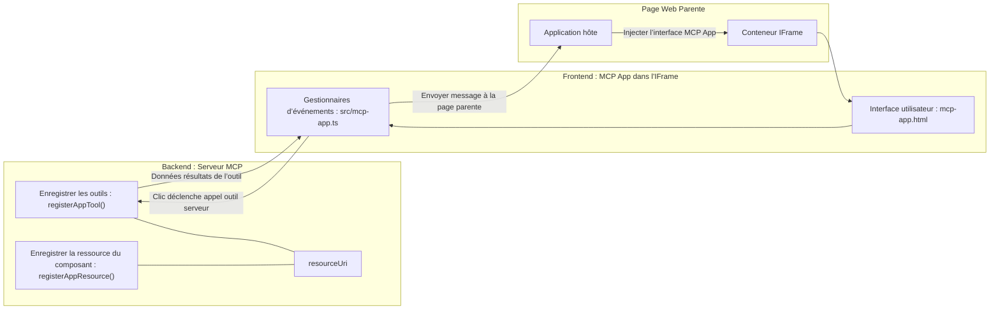
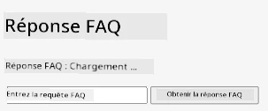
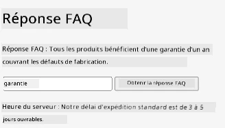
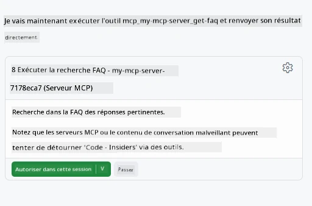

# MCP Apps

MCP Apps est un nouveau paradigme dans MCP. L'idée est que non seulement vous répondez avec des données issues d'un appel d'outil, mais que vous fournissez également des informations sur la manière dont ces informations doivent être utilisées. Cela signifie que les résultats des outils peuvent désormais contenir des informations UI. Pourquoi voudrions-nous cela ? Eh bien, considérez comment vous faites les choses aujourd'hui. Vous consommez probablement les résultats d'un serveur MCP en mettant un type de frontend devant, ce qui est du code que vous devez écrire et maintenir. Parfois, c'est ce que vous voulez, mais parfois ce serait bien de pouvoir simplement intégrer un extrait d'information autonome qui contient tout, des données à l'interface utilisateur.

## Aperçu

Cette leçon fournit des conseils pratiques sur MCP Apps, comment commencer avec lui et comment l'intégrer dans vos applications Web existantes. MCP Apps est une toute nouvelle addition au standard MCP.

## Objectifs d'apprentissage

À la fin de cette leçon, vous serez capable de :

- Expliquer ce que sont les MCP Apps.
- Savoir quand utiliser les MCP Apps.
- Construire et intégrer vos propres MCP Apps.

## MCP Apps - comment ça fonctionne

L'idée avec MCP Apps est de fournir une réponse qui est essentiellement un composant à rendre. Un tel composant peut avoir à la fois des éléments visuels et de l'interactivité, par exemple des clics de bouton, une saisie utilisateur et plus encore. Commençons par le côté serveur et notre serveur MCP. Pour créer un composant MCP App, vous devez créer un outil mais également la ressource d'application. Ces deux parties sont connectées par un resourceUri.

Voici un exemple. Essayons de visualiser ce qui est impliqué et quelles parties font quoi :

```text
server.ts -- responsible for registering tools and the component as a UI component
src/
  mcp-app.ts -- wiring up event handlers
mcp-app.html -- the user interface
```
  
Cette illustration décrit l'architecture pour créer un composant et sa logique.


Essayons maintenant de décrire les responsabilités respectives du backend et du frontend.

### Le backend

Il y a deux choses que nous devons accomplir ici :

- Enregistrer les outils avec lesquels nous voulons interagir.
- Définir le composant.

**Enregistrement de l'outil**

```typescript
registerAppTool(
    server,
    "get-time",
    {
      title: "Get Time",
      description: "Returns the current server time.",
      inputSchema: {},
      _meta: { ui: { resourceUri } }, // Lie cet outil à sa ressource UI
    },
    async () => {
      const time = new Date().toISOString();
      return { content: [{ type: "text", text: time }] };
    },
  );

```
  
Le code précédent décrit le comportement, où il expose un outil appelé `get-time`. Cet outil ne prend aucune entrée mais produit l'heure actuelle. Nous avons la possibilité de définir un `inputSchema` pour les outils où nous devons pouvoir accepter une entrée utilisateur.

**Enregistrement du composant**

Dans le même fichier, nous devons également enregistrer le composant :

```typescript
const resourceUri = "ui://get-time/mcp-app.html";

// Enregistrez la ressource, ce qui retourne le HTML/JavaScript regroupé pour l'interface utilisateur.
registerAppResource(
  server,
  resourceUri,
  resourceUri,
  { mimeType: RESOURCE_MIME_TYPE },
  async () => {
    const html = await fs.readFile(path.join(DIST_DIR, "mcp-app.html"), "utf-8");

    return {
    contents: [
        { uri: resourceUri, mimeType: RESOURCE_MIME_TYPE, text: html },
    ],
    };
  },
);
```
  
Notez comment nous mentionnons `resourceUri` pour connecter le composant à ses outils. Intéressant est aussi le callback où nous chargeons le fichier UI et retournons le composant.

### Le frontend du composant

Comme pour le backend, il y a deux parties ici :

- Un frontend écrit en pur HTML.
- Du code qui gère les événements et ce qu’il faut faire, par exemple appeler des outils ou envoyer des messages à la fenêtre parent.

**Interface utilisateur**

Jetons un coup d'œil à l'interface utilisateur.

```html
<!-- mcp-app.html -->
<!DOCTYPE html>
<html lang="en">
  <head>
    <meta charset="UTF-8" />
    <title>Get Time App</title>
  </head>
  <body>
    <p>
      <strong>Server Time:</strong> <code id="server-time">Loading...</code>
    </p>
    <button id="get-time-btn">Get Server Time</button>
    <script type="module" src="/src/mcp-app.ts"></script>
  </body>
</html>
```
  
**Gestion des événements**

La dernière partie est la gestion des événements. Cela signifie que nous identifions quelle partie de notre UI a besoin de gestionnaires d'événements et ce qu’il faut faire lorsque des événements sont déclenchés :

```typescript
// mcp-app.ts

import { App } from "@modelcontextprotocol/ext-apps";

// Obtenir les références des éléments
const serverTimeEl = document.getElementById("server-time")!;
const getTimeBtn = document.getElementById("get-time-btn")!;

// Créer une instance d'application
const app = new App({ name: "Get Time App", version: "1.0.0" });

// Gérer les résultats des outils provenant du serveur. Placer avant `app.connect()` pour éviter
// de manquer le résultat initial de l'outil.
app.ontoolresult = (result) => {
  const time = result.content?.find((c) => c.type === "text")?.text;
  serverTimeEl.textContent = time ?? "[ERROR]";
};

// Connecter le clic du bouton
getTimeBtn.addEventListener("click", async () => {
  // `app.callServerTool()` permet à l'interface utilisateur de demander des données fraîches au serveur
  const result = await app.callServerTool({ name: "get-time", arguments: {} });
  const time = result.content?.find((c) => c.type === "text")?.text;
  serverTimeEl.textContent = time ?? "[ERROR]";
});

// Se connecter à l'hôte
app.connect();
```
  
Comme vous pouvez le voir ci-dessus, c’est un code normal pour connecter les éléments DOM aux événements. Il convient de rappeler l’appel à `callServerTool` qui finit par appeler un outil dans le backend.

## Gérer les entrées utilisateur

Jusqu’à présent, nous avons vu un composant avec un bouton qui lorsqu’on clique dessus appelle un outil. Voyons si nous pouvons ajouter plus d’éléments UI comme un champ de saisie et voir si nous pouvons envoyer des arguments à un outil. Implémentons une fonctionnalité FAQ. Voici comment cela devrait fonctionner :

- Il doit y avoir un bouton et un élément de saisie où l’utilisateur tape un mot-clé à rechercher, par exemple "Shipping" (Expédition). Cela doit appeler un outil dans le backend qui effectue une recherche dans les données FAQ.
- Un outil qui supporte cette recherche FAQ mentionnée.

Commençons par ajouter le support nécessaire au backend :

```typescript
const faq: { [key: string]: string } = {
    "shipping": "Our standard shipping time is 3-5 business days.",
    "return policy": "You can return any item within 30 days of purchase.",
    "warranty": "All products come with a 1-year warranty covering manufacturing defects.",
  }

registerAppTool(
    server,
    "get-faq",
    {
      title: "Search FAQ",
      description: "Searches the FAQ for relevant answers.",
      inputSchema: zod.object({
        query: zod.string().default("shipping"),
      }),
      _meta: { ui: { resourceUri: faqResourceUri } }, // Lie cet outil à sa ressource UI
    },
    async ({ query }) => {
      const answer: string = faq[query.toLowerCase()] || "Sorry, I don't have an answer for that.";
      return { content: [{ type: "text", text: answer }] };
    },
  );
```
  
Ce que nous voyons ici est comment nous remplissons `inputSchema` et lui donnons un schéma `zod` comme suit :

```typescript
inputSchema: zod.object({
  query: zod.string().default("shipping"),
})
```
  
Dans le schéma ci-dessus, nous déclarons que nous avons un paramètre d’entrée appelé `query` et qu'il est optionnel avec une valeur par défaut "shipping" (expédition).

Ok, passons maintenant à *mcp-app.html* pour voir quelle interface utilisateur nous devons créer pour cela :

```html
<div class="faq">
    <h1>FAQ response</h1>
    <p>FAQ Response: <code id="faq-response">Loading...</code></p>
    <input type="text" id="faq-query" placeholder="Enter FAQ query" />
    <button id="get-faq-btn">Get FAQ Response</button>
  </div>
```
  
Parfait, maintenant nous avons un élément d'entrée et un bouton. Passons à *mcp-app.ts* pour connecter ces événements :

```typescript
const getFaqBtn = document.getElementById("get-faq-btn")!;
const faqQueryInput = document.getElementById("faq-query") as HTMLInputElement;

getFaqBtn.addEventListener("click", async () => {
  const query = faqQueryInput.value;
  const result = await app.callServerTool({ name: "get-faq", arguments: { query } });
  const faq = result.content?.find((c) => c.type === "text")?.text;
  faqResponseEl.textContent = faq ?? "[ERROR]";
});
```
  
Dans le code ci-dessus, nous :

- Créons des références aux éléments UI intéressants.
- Gérons un clic sur le bouton pour analyser la valeur de l'élément d'entrée et nous appelons aussi `app.callServerTool()` avec `name` et `arguments` où ce dernier passe `query` comme valeur.

Ce qui se passe réellement lorsque vous appelez `callServerTool` est qu’il envoie un message à la fenêtre parent et cette fenêtre finit par appeler le serveur MCP.

### Essayez-le

En essayant ceci, nous devrions maintenant voir ce qui suit :



et voici où nous essayons avec une saisie comme "warranty" (garantie)



Pour exécuter ce code, rendez-vous dans la [section Code](./code/README.md)

## Tests dans Visual Studio Code

Visual Studio Code offre un excellent support pour les MVP Apps et est probablement l’un des moyens les plus simples de tester vos MCP Apps. Pour utiliser Visual Studio Code, ajoutez une entrée serveur dans *mcp.json* comme suit :

```json
"my-mcp-server-7178eca7": {
    "url": "http://localhost:3001/mcp",
    "type": "http"
  }
```
  
Ensuite, démarrez le serveur, vous devriez pouvoir communiquer avec votre MVP App via la fenêtre de chat à condition d’avoir GitHub Copilot installé.

en déclenchant par une invite, par exemple "#get-faq":



et tout comme lorsque vous l'avez exécuté via un navigateur web, il s'affiche de la même manière comme suit :


## Exercice

Créez un jeu pierre-papier-ciseaux. Il doit se composer de ce qui suit :

UI :

- une liste déroulante avec des options
- un bouton pour soumettre un choix
- une étiquette montrant qui a choisi quoi et qui a gagné

Serveur :

- doit avoir un outil pierre-papier-ciseaux qui prend "choice" comme entrée. Il doit aussi générer un choix de l'ordinateur et déterminer le gagnant

## Solution

[Solution](./assignment/README.md)

## Résumé

Nous avons découvert ce nouveau paradigme MCP Apps. C’est un nouveau paradigme qui permet aux serveurs MCP d’avoir une opinion non seulement sur les données mais aussi sur la manière dont ces données doivent être présentées.

De plus, nous avons appris que ces MCP Apps sont hébergés dans un IFrame et pour communiquer avec les serveurs MCP, ils devront envoyer des messages à l’application web parente. Il existe plusieurs bibliothèques pour JavaScript simple, React et autres qui facilitent cette communication.

## Points clés à retenir

Voici ce que vous avez appris :

- MCP Apps est un nouveau standard qui peut être utile lorsque vous souhaitez expédier à la fois des données et des fonctionnalités UI.
- Ce type d’applications s’exécute dans un IFrame pour des raisons de sécurité.

## Et ensuite

- [Chapitre 4](../../04-PracticalImplementation/README.md)

---

<!-- CO-OP TRANSLATOR DISCLAIMER START -->
**Avertissement** :  
Ce document a été traduit à l’aide du service de traduction automatique [Co-op Translator](https://github.com/Azure/co-op-translator). Bien que nous nous efforcions d’assurer l’exactitude, veuillez noter que les traductions automatiques peuvent contenir des erreurs ou des inexactitudes. Le document original dans sa langue d’origine doit être considéré comme la source faisant foi. Pour des informations critiques, une traduction professionnelle réalisée par un humain est recommandée. Nous déclinons toute responsabilité en cas de malentendus ou de mauvaises interprétations résultant de l’utilisation de cette traduction.
<!-- CO-OP TRANSLATOR DISCLAIMER END -->