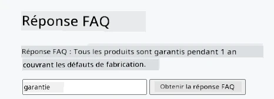
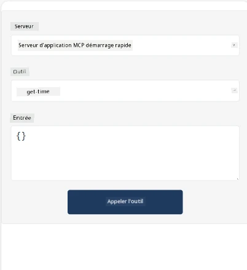
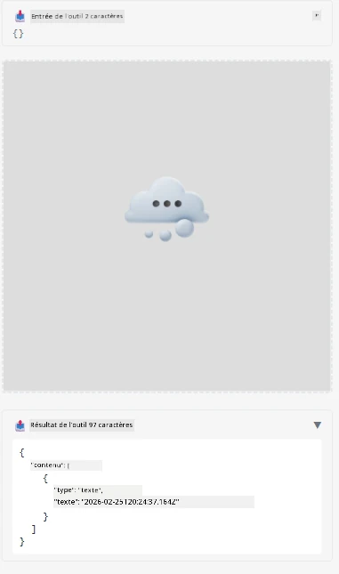

Voici un exemple démontrant MCP App

## Installer

1. Naviguez vers le dossier *mcp-app*
1. Exécutez `npm install`, cela devrait installer les dépendances frontend et backend

Vérifiez que le backend compile en exécutant :

```sh
npx tsc --noEmit
```

Il ne devrait y avoir aucune sortie si tout va bien.

## Exécuter le backend

> Cela demande un peu plus de travail si vous êtes sur une machine Windows car la solution MCP Apps utilise la bibliothèque `concurrently` qu'il faut remplacer. Voici la ligne problématique dans *package.json* sur MCP App :

    ```json
    "start": "concurrently \"cross-env NODE_ENV=development INPUT=mcp-app.html vite build --watch\" \"tsx watch main.ts\""
    ```

Cette application a deux parties, une partie backend et une partie hôte.

Démarrez le backend en appelant :

```sh
npm start
```

Cela devrait lancer le backend sur `http://localhost:3001/mcp`.

> Remarque, si vous êtes dans un Codespace, vous devrez peut-être définir la visibilité du port en public. Vérifiez que vous pouvez atteindre le point de terminaison dans le navigateur via https://<nom du Codespace>.app.github.dev/mcp

## Choix -1 Tester l'application dans Visual Studio Code

Pour tester la solution dans Visual Studio Code, faites ce qui suit :

- Ajoutez une entrée serveur à `mcp.json` comme suit :

    ```json
    {
        "servers": {
            "my-mcp-server-7178eca7": {
                "url": "http://localhost:3001/mcp",
                "type": "http"
            }
        },
        "inputs": []
    }
    ```

1. Cliquez sur le bouton "start" dans *mcp.json*
1. Assurez-vous qu'une fenêtre de chat est ouverte et tapez `get-faq`, vous devriez voir un résultat comme ceci :

    

## Choix -2- Tester l'application avec un hôte

Le dépôt <https://github.com/modelcontextprotocol/ext-apps> contient plusieurs hôtes différents que vous pouvez utiliser pour tester vos MVP Apps.

Nous vous présentons ici deux options différentes :

### Machine locale

- Naviguez vers *ext-apps* après avoir cloné le dépôt.

- Installez les dépendances

   ```sh
   npm install
   ```

- Dans une fenêtre de terminal séparée, naviguez vers *ext-apps/examples/basic-host*

    > si vous êtes dans un Codespace, vous devez aller dans serve.ts à la ligne 27 et remplacer http://localhost:3001/mcp par votre URL Codespace pour le backend, par exemple https://psychic-xylophone-657rpjgvxpc5g64-3001.app.github.dev/mcp

- Lancez l'hôte :

    ```sh
    npm start
    ```

    Cela devrait connecter l'hôte au backend et vous devriez voir l'application fonctionner comme ceci :

    

### Codespace

Il faut un peu plus de travail pour faire fonctionner un environnement Codespace. Pour utiliser un hôte via Codespace :

- Consultez le répertoire *ext-apps* et naviguez vers *examples/basic-host*.
- Exécutez `npm install` pour installer les dépendances
- Exécutez `npm start` pour démarrer l'hôte.

## Testez l'application

Essayez l'application de la manière suivante :

- Sélectionnez le bouton "Call Tool" et vous devriez voir les résultats comme ceci :

    

Super, tout fonctionne.

---

<!-- CO-OP TRANSLATOR DISCLAIMER START -->
**Avertissement** :  
Ce document a été traduit à l’aide du service de traduction automatique [Co-op Translator](https://github.com/Azure/co-op-translator). Bien que nous fassions tout notre possible pour garantir l’exactitude, veuillez noter que les traductions automatisées peuvent contenir des erreurs ou des inexactitudes. Le document original dans sa langue d’origine doit être considéré comme la source faisant foi. Pour les informations critiques, il est recommandé de faire appel à une traduction professionnelle réalisée par un humain. Nous déclinons toute responsabilité en cas de malentendus ou d’interprétations erronées résultant de l’utilisation de cette traduction.
<!-- CO-OP TRANSLATOR DISCLAIMER END -->