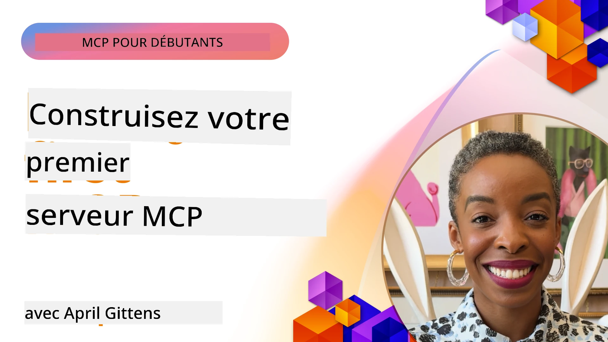

## Premiers pas  

_(Cliquez sur l'image ci-dessus pour voir la vidéo de cette leçon)_

Cette section comporte plusieurs leçons :

- **1 Votre premier serveur**, dans cette première leçon, vous apprendrez à créer votre premier serveur et à l’inspecter avec l’outil d’inspection, un moyen précieux pour tester et déboguer votre serveur, [vers la leçon](01-first-server/README.md)

- **2 Client**, dans cette leçon, vous apprendrez à écrire un client capable de se connecter à votre serveur, [vers la leçon](02-client/README.md)

- **3 Client avec LLM**, un moyen encore meilleur d’écrire un client est d’y ajouter un LLM pour qu’il puisse « négocier » avec votre serveur ce qu’il doit faire, [vers la leçon](03-llm-client/README.md)

- **4 Consommer un mode agent GitHub Copilot serveur dans Visual Studio Code**. Ici, nous examinons comment exécuter notre serveur MCP depuis Visual Studio Code, [vers la leçon](04-vscode/README.md)

- **5 Serveur de transport stdio** le transport stdio est la norme recommandée pour la communication locale serveur-client MCP, fournissant une communication sécurisée entre sous-processus avec isolation intégrée [vers la leçon](05-stdio-server/README.md)

- **6 Streaming HTTP avec MCP (HTTP Streamable)**. Découvrez le  
	transport distant standard dans la [Spécification MCP 2026-07-28](https://modelcontextprotocol.io/specification/2026-07-28/basic/transports/streamable-http),  
	en plus de l’implémentation héritée basée sur les sessions conservée dans la leçon.  
	[vers la leçon](06-http-streaming/README.md)  

- **7 Utiliser AI Toolkit pour VSCode** pour consommer et tester vos clients et serveurs MCP [vers la leçon](07-aitk/README.md)

- **8 Tests**. Ici, nous nous concentrerons particulièrement sur la manière de tester notre serveur et client de différentes manières, [vers la leçon](08-testing/README.md)

- **9 Déploiement**. Ce chapitre examine différentes façons de déployer vos solutions MCP, [vers la leçon](09-deployment/README.md)

- **10 Utilisation avancée du serveur**. Ce chapitre traite de l’utilisation avancée du serveur, [vers la leçon](./10-advanced/README.md)

- **11 Auth**. Ce chapitre couvre comment ajouter une authentification simple, de l’authentification de base à l’utilisation de JWT et RBAC. Il est conseillé de commencer ici puis de consulter les sujets avancés du chapitre 5 et d’effectuer un durcissement supplémentaire de la sécurité via les recommandations du chapitre 2, [vers la leçon](./11-simple-auth/README.md)

- **12 Hôtes MCP**. Configurez et utilisez des clients hôtes MCP populaires incluant Claude Desktop, Cursor, Cline et Windsurf. Apprenez les types de transport et le dépannage, [vers la leçon](./12-mcp-hosts/README.md)

- **13 Inspecteur MCP**. Déboguez et testez vos serveurs MCP de manière interactive à l’aide de l’outil Inspecteur MCP. Apprenez à dépanner les outils, ressources et messages de protocole, [vers la leçon](./13-mcp-inspector/README.md)

- **14 Sampling**. Découvrez la primitive Sampling hérité pour `2025-11-25` et
	comment migrer les nouveaux designs vers une intégration directe du fournisseur LLM. Sampling est
	obsolète dans MCP `2026-07-28`. [vers la leçon](./14-sampling/README.md)

- **15 MCP Apps**. Construisez des serveurs MCP qui répondent aussi avec des instructions UI, [vers la leçon](./15-mcp-apps/README.md)

Le protocole Model Context Protocol (MCP) est un protocole ouvert qui normalise la façon dont les applications fournissent du contexte aux LLMs. Pensez à MCP comme un port USB-C pour les applications IA - il fournit un moyen standardisé de connecter les modèles IA à différentes sources de données et outils.

## Objectifs d'apprentissage

À la fin de cette leçon, vous serez capable de :

- Configurer des environnements de développement pour MCP en C#, Java, Python, TypeScript et JavaScript
- Construire et déployer des serveurs MCP basiques avec des fonctionnalités personnalisées (ressources, prompts et outils)
- Créer des applications hôtes qui se connectent aux serveurs MCP
- Tester et déboguer des implémentations MCP
- Comprendre les défis courants de configuration et leurs solutions
- Connecter vos implémentations MCP aux services LLM populaires

## Préparer votre environnement MCP

Avant de commencer à travailler avec MCP, il est important de préparer votre environnement de développement et de comprendre le flux de travail de base. Cette section vous guidera à travers les étapes initiales pour assurer un démarrage en douceur avec MCP.

### Prérequis

Avant de plonger dans le développement MCP, assurez-vous d'avoir :

- **Environnement de développement** : Pour votre langage choisi (C#, Java, Python, TypeScript ou JavaScript)
- **IDE/Éditeur** : Visual Studio, Visual Studio Code, IntelliJ, Eclipse, PyCharm ou tout éditeur de code moderne
- **Gestionnaires de paquets** : NuGet, Maven/Gradle, pip ou npm/yarn
- **Clés API** : Pour tout service IA que vous prévoyez d’utiliser dans vos applications hôtes

### SDK officiels

Dans les chapitres à venir, vous verrez des solutions construites en Python, TypeScript,
Java et .NET. Voici les SDK officiels.

Le support SDK pour MCP `2026-07-28` se déploie indépendamment par langage.
Avant d’exécuter un exemple, vérifiez sa version de paquet et les notes de version du SDK
pour les révisions de protocole supportées. Voir la
[liste officielle des SDK](https://modelcontextprotocol.io/docs/sdk) :
- [SDK C#](https://github.com/modelcontextprotocol/csharp-sdk) - Maintenu en collaboration avec Microsoft
- [SDK Java](https://github.com/modelcontextprotocol/java-sdk) - Maintenu en collaboration avec Spring AI
- [SDK TypeScript](https://github.com/modelcontextprotocol/typescript-sdk) - L’implémentation officielle TypeScript
- [SDK Python](https://github.com/modelcontextprotocol/python-sdk) - L’implémentation officielle Python (FastMCP)
- [SDK Kotlin](https://github.com/modelcontextprotocol/kotlin-sdk) - L’implémentation officielle Kotlin
- [SDK Swift](https://github.com/modelcontextprotocol/swift-sdk) - Maintenu en collaboration avec Loopwork AI
- [SDK Rust](https://github.com/modelcontextprotocol/rust-sdk) - L’implémentation officielle Rust
- [SDK Go](https://github.com/modelcontextprotocol/go-sdk) - L’implémentation officielle Go

## Points clés à retenir

- Configurer un environnement de développement MCP est simple avec des SDK spécifiques au langage
- Construire des serveurs MCP implique de créer et enregistrer des outils avec des schémas clairs

- Les clients MCP se connectent aux serveurs et aux modèles pour tirer parti de capacités étendues
- Les tests et le débogage sont essentiels pour des implémentations MCP fiables
- Les options de déploiement vont du développement local aux solutions basées sur le cloud

## Pratique

Nous avons un ensemble d'exemples qui complètent les exercices que vous verrez dans tous les chapitres de cette section. De plus, chaque chapitre a également ses propres exercices et devoirs

- [Calculatrice Java](./samples/java/calculator/README.md)
- [Calculatrice .NET](../../../03-GettingStarted/samples/csharp)
- [Calculatrice JavaScript](./samples/javascript/README.md)
- [Calculatrice TypeScript](./samples/typescript/README.md)
- [Calculatrice Python](../../../03-GettingStarted/samples/python)

## Ressources supplémentaires

- [Créer des agents avec le protocole Model Context sur Azure](https://learn.microsoft.com/azure/developer/ai/intro-agents-mcp)
- [MCP distant avec Azure Container Apps (Node.js/TypeScript/JavaScript)](https://learn.microsoft.com/samples/azure-samples/mcp-container-ts/mcp-container-ts/)
- [Agent MCP OpenAI .NET](https://learn.microsoft.com/samples/azure-samples/openai-mcp-agent-dotnet/openai-mcp-agent-dotnet/)

## Quoi de neuf

Commencez par la première leçon : [Créer votre premier serveur MCP](01-first-server/README.md)

Une fois ce module terminé, continuez avec : [Module 4 : Mise en œuvre pratique](../04-PracticalImplementation/README.md)

---

<!-- CO-OP TRANSLATOR DISCLAIMER START -->
**Avertissement** :
Ce document a été traduit à l'aide du service de traduction automatique [Co-op Translator](https://github.com/Azure/co-op-translator). Bien que nous nous efforçions d'assurer l'exactitude, veuillez noter que les traductions automatisées peuvent contenir des erreurs ou des inexactitudes. Le document original dans sa langue native doit être considéré comme la source faisant autorité. Pour les informations critiques, il est recommandé de recourir à une traduction professionnelle réalisée par un humain. Nous ne saurions être tenus responsables des malentendus ou erreurs d'interprétation découlant de l'utilisation de cette traduction.
<!-- CO-OP TRANSLATOR DISCLAIMER END -->