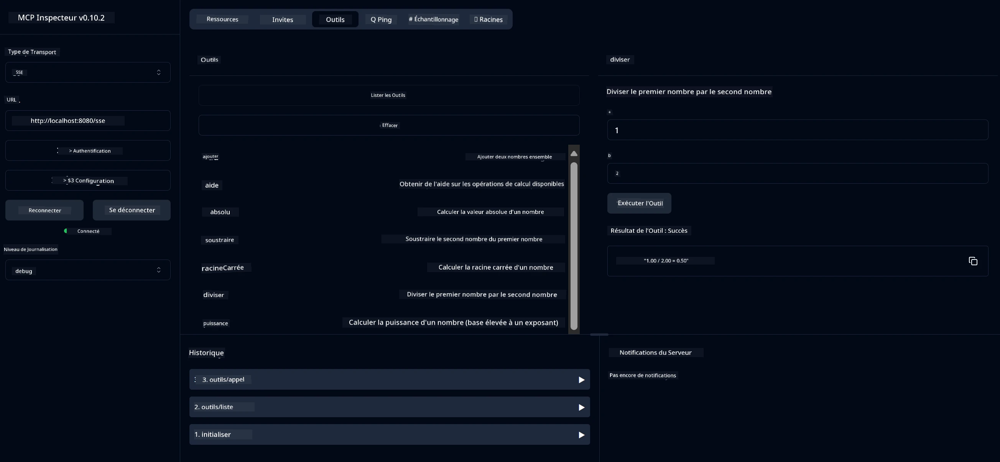

# Service Calculatrice Basique MCP

> [!NOTE]
> Cet exemple utilise le transport HTTP+SSE legacy et cible un SDK compatible
> avec MCP `2025-11-25`. Les nouveaux serveurs distants devraient utiliser la prise en charge HTTP Streamable
> `2026-07-28`.

Ce service fournit des opérations basiques de calculatrice via le protocole Model Context Protocol (MCP) en utilisant Spring Boot avec le transport WebFlux. Il est conçu comme un exemple simple pour les débutants apprenant les implémentations MCP.

Pour plus d'informations, voir la documentation de référence du [MCP Server Boot Starter](https://docs.spring.io/spring-ai/reference/api/mcp/mcp-server-boot-starter-docs.html).

## Vue d'ensemble

Le service met en avant :
- Support pour SSE (Server-Sent Events)
- Enregistrement automatique des outils grâce à l'annotation `@Tool` de Spring AI
- Fonctions basiques de calculatrice :
  - Addition, soustraction, multiplication, division
  - Calcul de la puissance et racine carrée
  - Module (reste) et valeur absolue
  - Fonction d'aide pour la description des opérations

## Fonctionnalités

Ce service de calculatrice offre les capacités suivantes :

1. **Opérations arithmétiques basiques** :
   - Addition de deux nombres
   - Soustraction d’un nombre par rapport à un autre
   - Multiplication de deux nombres
   - Division d’un nombre par un autre (avec contrôle de division par zéro)

2. **Opérations avancées** :
   - Calcul de la puissance (élever une base à un exposant)
   - Calcul de la racine carrée (avec contrôle du nombre négatif)
   - Calcul du module (reste)
   - Calcul de la valeur absolue

3. **Système d'aide** :
   - Fonction d’aide intégrée expliquant toutes les opérations disponibles

## Utilisation du Service

Le service expose les points de terminaison API suivants via le protocole MCP :

- `add(a, b)` : Additionne deux nombres
- `subtract(a, b)` : Soustrait le second nombre du premier
- `multiply(a, b)` : Multiplie deux nombres
- `divide(a, b)` : Divise le premier nombre par le second (avec contrôle du zéro)
- `power(base, exponent)` : Calcule la puissance d’un nombre
- `squareRoot(number)` : Calcule la racine carrée (avec contrôle du nombre négatif)
- `modulus(a, b)` : Calcule le reste d’une division
- `absolute(number)` : Calcule la valeur absolue
- `help()` : Obtient des informations sur les opérations disponibles

## Client de Test

Un client de test simple est inclus dans le package `com.microsoft.mcp.sample.client`. La classe `SampleCalculatorClient` démontre les opérations disponibles du service calculatrice.

## Utilisation du Client LangChain4j

Le projet inclut un exemple de client LangChain4j dans `com.microsoft.mcp.sample.client.LangChain4jClient` montrant comment intégrer le service calculatrice avec LangChain4j et les modèles GitHub :

### Prérequis

1. **Configuration du jeton GitHub** :
   
   Pour utiliser les modèles IA de GitHub (comme phi-4), vous avez besoin d’un jeton d’accès personnel GitHub :

   a. Rendez-vous dans les paramètres de votre compte GitHub : https://github.com/settings/tokens
   
   b. Cliquez sur "Generate new token" → "Generate new token (classic)"
   
   c. Donnez un nom descriptif à votre jeton
   
   d. Sélectionnez les portées suivantes :
      - `repo` (Contrôle total des dépôts privés)
      - `read:org` (Lecture des membres d’organisation et d’équipe, lecture des projets org)
      - `gist` (Création de gists)
      - `user:email` (Accès aux adresses emails utilisateurs (lecture seule))
   
   e. Cliquez sur "Generate token" et copiez votre nouveau jeton
   
   f. Configurez-le en variable d’environnement :
      
      Sous Windows :
      ```
      set GITHUB_TOKEN=your-github-token
      ```
      
      Sous macOS/Linux :
      ```bash
      export GITHUB_TOKEN=your-github-token
      ```

   g. Pour une configuration persistante, ajoutez-le aux variables d’environnement via les paramètres système

2. Ajoutez la dépendance LangChain4j GitHub à votre projet (déjà incluse dans pom.xml) :
   ```xml
   <dependency>
       <groupId>dev.langchain4j</groupId>
       <artifactId>langchain4j-github</artifactId>
       <version>${langchain4j.version}</version>
   </dependency>
   ```

3. Assurez-vous que le serveur calculatrice est en fonctionnement sur `localhost:8080`

### Exécution du Client LangChain4j

Cet exemple démontre :
- Connexion au serveur calculatrice MCP via le transport SSE
- Utilisation de LangChain4j pour créer un chatbot qui exploite les opérations calculatrice
- Intégration avec les modèles IA GitHub (actuellement utilisant le modèle phi-4)

Le client envoie les requêtes exemples suivantes pour démontrer les fonctionnalités :
1. Calculer la somme de deux nombres
2. Trouver la racine carrée d’un nombre
3. Obtenir des informations d’aide sur les opérations calculatrice disponibles

Lancez l’exemple et consultez la sortie console pour voir comment le modèle IA utilise les outils calculatrice pour répondre aux requêtes.

### Configuration du modèle GitHub

Le client LangChain4j est configuré pour utiliser le modèle phi-4 de GitHub avec les paramètres suivants :

```java
ChatLanguageModel model = GitHubChatModel.builder()
    .apiKey(System.getenv("GITHUB_TOKEN"))
    .timeout(Duration.ofSeconds(60))
    .modelName("phi-4")
    .logRequests(true)
    .logResponses(true)
    .build();
```

Pour utiliser d’autres modèles GitHub, changez simplement le paramètre `modelName` vers un autre modèle supporté (par exemple, "claude-3-haiku-20240307", "llama-3-70b-8192", etc.).

## Dépendances

Le projet requiert les dépendances clés suivantes :

```xml
<!-- For MCP Server -->
<dependency>
    <groupId>org.springframework.ai</groupId>
    <artifactId>spring-ai-starter-mcp-server-webflux</artifactId>
</dependency>

<!-- For LangChain4j integration -->
<dependency>
    <groupId>dev.langchain4j</groupId>
    <artifactId>langchain4j-mcp</artifactId>
    <version>${langchain4j.version}</version>
</dependency>

<!-- For GitHub models support -->
<dependency>
    <groupId>dev.langchain4j</groupId>
    <artifactId>langchain4j-github</artifactId>
    <version>${langchain4j.version}</version>
</dependency>
```

## Compilation du Projet

Compilez le projet en utilisant Maven :
```bash
./mvnw clean install -DskipTests
```

## Exécution du Serveur

### Utilisation de Java

```bash
java -jar target/calculator-server-0.0.1-SNAPSHOT.jar
```

### Utilisation de MCP Inspector

MCP Inspector est un outil utile pour interagir avec les services MCP. Pour l’utiliser avec ce service calculatrice :

1. **Installez et lancez MCP Inspector** dans une nouvelle fenêtre terminal :
   ```bash
   npx @modelcontextprotocol/inspector
   ```

2. **Accédez à l’interface web** en cliquant sur l’URL affichée par l’application (typiquement http://localhost:6274)

3. **Configurez la connexion** :
   - Sélectionnez le type de transport "SSE"
   - Mettez l’URL vers le point SSE de votre serveur en fonctionnement : `http://localhost:8080/sse`
   - Cliquez sur "Connect"

4. **Utilisez les outils** :
   - Cliquez sur "List Tools" pour voir les opérations calculatrice disponibles
   - Sélectionnez un outil et cliquez sur "Run Tool" pour exécuter une opération



### Utilisation de Docker

Le projet inclut un Dockerfile pour un déploiement conteneurisé :

1. **Construisez l’image Docker** :
   ```bash
   docker build -t calculator-mcp-service .
   ```

2. **Exécutez le conteneur Docker** :
   ```bash
   docker run -p 8080:8080 calculator-mcp-service
   ```

Cela va :
- Construire une image Docker multi-étapes avec Maven 3.9.9 et Eclipse Temurin 24 JDK
- Créer une image conteneur optimisée
- Exposer le service sur le port 8080
- Démarrer le service calculatrice MCP à l’intérieur du conteneur

Vous pouvez accéder au service à `http://localhost:8080` une fois le conteneur lancé.

## Dépannage

### Problèmes courants avec le jeton GitHub

1. **Problèmes de permissions du jeton** : Si vous obtenez une erreur 403 Forbidden, vérifiez que votre jeton a les permissions correctes comme indiqué dans les prérequis.

2. **Jeton non trouvé** : Si vous recevez une erreur "No API key found", assurez-vous que la variable d’environnement GITHUB_TOKEN est correctement configurée.

3. **Limitation de débit** : L’API GitHub a des limites de requêtes. Si vous rencontrez une erreur de limitation de débit (code 429), attendez quelques minutes avant de réessayer.

4. **Expiration du jeton** : Les jetons GitHub peuvent expirer. Si vous recevez des erreurs d’authentification après un certain temps, générez un nouveau jeton et mettez à jour votre variable d’environnement.

Si vous avez besoin d’aide supplémentaire, consultez la [documentation LangChain4j](https://github.com/langchain4j/langchain4j) ou la [documentation de l’API GitHub](https://docs.github.com/en/rest).

---

<!-- CO-OP TRANSLATOR DISCLAIMER START -->
**Avertissement** :
Ce document a été traduit à l'aide du service de traduction automatique [Co-op Translator](https://github.com/Azure/co-op-translator). Bien que nous nous efforçions d'assurer l'exactitude, veuillez noter que les traductions automatisées peuvent contenir des erreurs ou des inexactitudes. Le document original dans sa langue native doit être considéré comme la source faisant autorité. Pour les informations critiques, il est recommandé de recourir à une traduction professionnelle réalisée par un humain. Nous ne saurions être tenus responsables des malentendus ou erreurs d'interprétation découlant de l'utilisation de cette traduction.
<!-- CO-OP TRANSLATOR DISCLAIMER END -->