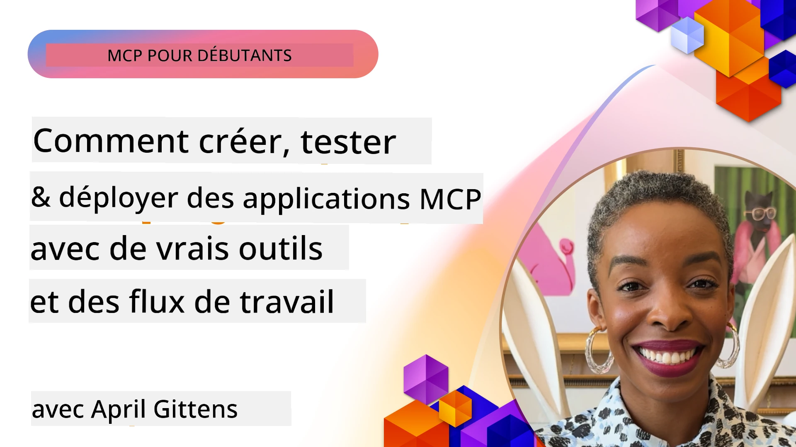

# Mise en œuvre pratique

[](https://youtu.be/vCN9-mKBDfQ)

_(Cliquez sur l'image ci-dessus pour voir la vidéo de cette leçon)_

La mise en œuvre pratique est là où la puissance du Model Context Protocol (MCP) devient tangible. Bien que comprendre la théorie et l'architecture derrière le MCP soit important, la véritable valeur émerge lorsque vous appliquez ces concepts pour construire, tester et déployer des solutions qui résolvent des problèmes du monde réel. Ce chapitre fait le lien entre la connaissance conceptuelle et le développement pratique, vous guidant à travers le processus de concrétisation des applications basées sur MCP.

Que vous développiez des assistants intelligents, intégriez l'IA dans les flux de travail métier, ou construisiez des outils personnalisés pour le traitement des données, MCP fournit une base flexible. Son design indépendant du langage et ses SDK officiels pour des langages de programmation populaires le rendent accessible à un large éventail de développeurs. En tirant parti de ces SDK, vous pouvez rapidement prototyper, itérer et mettre à l'échelle vos solutions à travers différentes plateformes et environnements.

Dans les sections suivantes, vous trouverez des exemples pratiques, du code d'exemple, et des stratégies de déploiement qui démontrent comment implémenter MCP en C#, Java avec Spring, TypeScript, JavaScript et Python. Vous apprendrez également à déboguer et tester vos serveurs MCP, gérer les API, et déployer des solutions dans le cloud via Azure. Ces ressources pratiques sont conçues pour accélérer votre apprentissage et vous aider à construire en toute confiance des applications MCP solides et prêtes pour la production.

## Aperçu

Cette leçon se concentre sur les aspects pratiques de la mise en œuvre de MCP dans plusieurs langages de programmation. Nous explorerons comment utiliser les SDK MCP en C#, Java avec Spring, TypeScript, JavaScript, et Python pour construire des applications robustes, déboguer et tester des serveurs MCP, et créer des ressources, invites, et outils réutilisables.

## Objectifs d'apprentissage

À la fin de cette leçon, vous serez capable de :

- Implémenter des solutions MCP en utilisant les SDK officiels dans divers langages de programmation
- Déboguer et tester systématiquement les serveurs MCP
- Créer et utiliser des fonctionnalités serveur (Ressources, Invites, et Outils)
- Concevoir des flux de travail MCP efficaces pour des tâches complexes
- Optimiser les implémentations MCP pour la performance et la fiabilité

## Ressources des SDK officiels

Le Model Context Protocol propose des SDK officiels pour plusieurs langages (conformes à la [Spécification MCP 2025-11-25](https://spec.modelcontextprotocol.io/specification/2025-11-25/)) :

- [SDK C#](https://github.com/modelcontextprotocol/csharp-sdk)
- [SDK Java avec Spring](https://github.com/modelcontextprotocol/java-sdk) **Note :** nécessite la dépendance sur [Project Reactor](https://projectreactor.io). (Voir la [discussion issue 246](https://github.com/orgs/modelcontextprotocol/discussions/246).)
- [SDK TypeScript](https://github.com/modelcontextprotocol/typescript-sdk)
- [SDK Python](https://github.com/modelcontextprotocol/python-sdk)
- [SDK Kotlin](https://github.com/modelcontextprotocol/kotlin-sdk)
- [SDK Go](https://github.com/modelcontextprotocol/go-sdk)

## Travailler avec les SDK MCP

Cette section fournit des exemples pratiques d'implémentation de MCP dans plusieurs langages de programmation. Vous pouvez trouver des exemples de code dans le répertoire `samples` organisé par langage.

### Échantillons disponibles

Le dépôt inclut des [implémentations d'exemples](../../../04-PracticalImplementation/samples) dans les langages suivants :

- [C#](./samples/csharp/README.md)
- [Java avec Spring](./samples/java/containerapp/README.md)
- [TypeScript](./samples/typescript/README.md)
- [JavaScript](./samples/javascript/README.md)
- [Python](./samples/python/README.md)

Chaque exemple démontre des concepts clés de MCP et des modèles d'implémentation pour ce langage et cet écosystème spécifiques.

### Guides pratiques

Guides supplémentaires pour la mise en œuvre pratique de MCP :

- [Pagination et grands ensembles de résultats](./pagination/README.md) - Gérer la pagination basée sur des curseurs pour les outils, ressources, et grands ensembles de données

## Fonctionnalités principales du serveur

Les serveurs MCP peuvent implémenter toute combinaison des fonctionnalités suivantes :

### Ressources

Les ressources fournissent le contexte et les données pour l'utilisateur ou le modèle IA à utiliser :

- Dépôts de documents
- Bases de connaissances
- Sources de données structurées
- Systèmes de fichiers

### Invites

Les invites sont des messages et flux de travail modélisés pour les utilisateurs :

- Modèles de conversation prédéfinis
- Schémas d'interaction guidée
- Structures de dialogues spécialisées

### Outils

Les outils sont des fonctions que le modèle IA peut exécuter :

- Utilitaires de traitement de données
- Intégrations d'API externes
- Capacités de calcul
- Fonctionnalités de recherche

## Implémentations d'exemples : Implémentation C#

Le dépôt officiel du SDK C# contient plusieurs implémentations d'exemples démontrant différents aspects du MCP :

- **Client MCP basique** : Exemple simple montrant comment créer un client MCP et appeler des outils
- **Serveur MCP basique** : Implémentation minimale du serveur avec enregistrement d'outil basique
- **Serveur MCP avancé** : Serveur complet avec enregistrement d'outil, authentification et gestion des erreurs
- **Intégration ASP.NET** : Exemples montrant l'intégration avec ASP.NET Core
- **Modèles d’implémentation d’outils** : Divers modèles pour implémenter des outils avec différents niveaux de complexité

Le SDK C# MCP est en préversion et les API peuvent changer. Nous mettrons continuellement à jour ce blog au fur et à mesure de l'évolution du SDK.

### Fonctionnalités clés

- [NuGet MCP C# ModelContextProtocol](https://www.nuget.org/packages/ModelContextProtocol)
- Construire votre [premier serveur MCP](https://devblogs.microsoft.com/dotnet/build-a-model-context-protocol-mcp-server-in-csharp/).

Pour des exemples complets d'implémentation en C#, rendez-vous sur le [dépôt officiel des exemples SDK C#](https://github.com/modelcontextprotocol/csharp-sdk)

## Implémentation d'exemple : Implémentation Java avec Spring

Le SDK Java avec Spring offre des options d'implémentation MCP robustes avec des fonctionnalités de niveau entreprise.

### Fonctionnalités clés

- Intégration avec le Framework Spring
- Forte sécurité de type
- Support de la programmation réactive
- Gestion complète des erreurs

Pour un exemple complet d'implémentation Java avec Spring, consultez [l'exemple Java avec Spring](samples/java/containerapp/README.md) dans le répertoire des exemples.

## Implémentation d'exemple : Implémentation JavaScript

Le SDK JavaScript fournit une approche légère et flexible pour l'implémentation de MCP.

### Fonctionnalités clés

- Support Node.js et navigateur
- API basée sur les Promises
- Intégration facile avec Express et autres frameworks
- Support WebSocket pour le streaming

Pour un exemple complet d'implémentation JavaScript, consultez [l'exemple JavaScript](samples/javascript/README.md) dans le répertoire des exemples.

## Implémentation d'exemple : Implémentation Python

Le SDK Python offre une approche Pythonique de l'implémentation MCP avec d'excellentes intégrations de frameworks ML.

### Fonctionnalités clés

- Support async/await avec asyncio
- Intégration FastAPI``
- Enregistrement simple d'outils
- Intégration native avec les bibliothèques ML populaires

Pour un exemple complet d'implémentation Python, consultez [l'exemple Python](samples/python/README.md) dans le répertoire des exemples.

## Gestion des API

Azure API Management est une excellente réponse à la manière dont nous pouvons sécuriser les serveurs MCP. L'idée est de placer une instance Azure API Management devant votre serveur MCP et de lui laisser gérer les fonctionnalités que vous souhaitez probablement comme :

- limitation du débit
- gestion des tokens
- surveillance
- équilibrage de charge
- sécurité

### Exemple Azure

Voici un exemple Azure qui fait exactement cela, c’est-à-dire [créer un serveur MCP et le sécuriser avec Azure API Management](https://github.com/Azure-Samples/remote-mcp-apim-functions-python).

Voyez comment le flux d'autorisation se déroule dans l'image ci-dessous :


Dans l'image précédente, les actions suivantes ont lieu :

- L'authentification/l'autorisation se fait via Microsoft Entra.
- Azure API Management agit comme une passerelle et utilise des politiques pour diriger et gérer le trafic.
- Azure Monitor enregistre toutes les requêtes pour une analyse ultérieure.

#### Flux d’autorisation

Examinons le flux d'autorisation plus en détail :


#### Spécification d’autorisation MCP

En savoir plus sur la [spécification d’autorisation MCP](https://spec.modelcontextprotocol.io/specification/2025-11-25/basic/authorization/)

## Déployer un serveur MCP distant sur Azure

Voyons si nous pouvons déployer l'exemple mentionné précédemment :

1. Clonez le dépôt

    ```bash
    git clone https://github.com/Azure-Samples/remote-mcp-apim-functions-python.git
    cd remote-mcp-apim-functions-python
    ```

1. Enregistrez le fournisseur de ressources `Microsoft.App`.

   - Si vous utilisez Azure CLI, exécutez `az provider register --namespace Microsoft.App --wait`.
   - Si vous utilisez Azure PowerShell, exécutez `Register-AzResourceProvider -ProviderNamespace Microsoft.App`. Ensuite, exécutez `(Get-AzResourceProvider -ProviderNamespace Microsoft.App).RegistrationState` après un certain temps pour vérifier si l'enregistrement est complet.

1. Exécutez cette commande [azd](https://aka.ms/azd) pour provisionner le service de gestion d'API, l'application function (avec code) et toutes les autres ressources Azure requises

    ```shell
    azd up
    ```

    Cette commande devrait déployer toutes les ressources cloud sur Azure

### Tester votre serveur avec MCP Inspector

1. Dans une **nouvelle fenêtre de terminal**, installez et lancez MCP Inspector

    ```shell
    npx @modelcontextprotocol/inspector
    ```

    Vous devriez voir une interface similaire à :

    

1. CTRL cliquez pour charger l'application web MCP Inspector depuis l'URL affichée par l'application (par ex. [http://127.0.0.1:6274/#resources](http://127.0.0.1:6274/#resources))
1. Définissez le type de transport sur `SSE`
1. Mettez l'URL sur votre point de terminaison SSE API Management en cours d'exécution affiché après `azd up` et **Connectez-vous** :

    ```shell
    https://<apim-servicename-from-azd-output>.azure-api.net/mcp/sse
    ```

1. **Lister les outils**. Cliquez sur un outil et **Exécutez l'outil**.  

Si toutes les étapes ont fonctionné, vous devriez être maintenant connecté au serveur MCP et avoir réussi à appeler un outil.

## Serveurs MCP pour Azure

[Remote-mcp-functions](https://github.com/Azure-Samples/remote-mcp-functions-dotnet) : Cet ensemble de dépôts est un modèle de démarrage rapide pour construire et déployer des serveurs MCP (Model Context Protocol) distants personnalisés utilisant Azure Functions avec Python, C# .NET ou Node/TypeScript.

Les exemples fournissent une solution complète permettant aux développeurs de :

- Construire et exécuter localement : Développer et déboguer un serveur MCP sur une machine locale
- Déployer sur Azure : Déployer facilement dans le cloud avec une simple commande azd up
- Se connecter depuis des clients : Se connecter au serveur MCP depuis différents clients incluant le mode agent Copilot de VS Code et l'outil MCP Inspector

### Fonctionnalités clés

- Sécurité par conception : Le serveur MCP est sécurisé via des clés et HTTPS
- Options d’authentification : Supporte OAuth via authentification intégrée et/ou API Management
- Isolation réseau : Permet l'isolation réseau via Azure Virtual Networks (VNET)
- Architecture serverless : Exploite Azure Functions pour une exécution scalable et orientée événement
- Développement local : Support complet pour le développement local et le débogage
- Déploiement simple : Processus de déploiement simplifié vers Azure

Le dépôt inclut tous les fichiers de configuration nécessaires, le code source et les définitions d'infrastructure pour démarrer rapidement avec une implémentation de serveur MCP prête pour la production.

- [Azure Remote MCP Functions Python](https://github.com/Azure-Samples/remote-mcp-functions-python) - Exemple d’implémentation MCP utilisant Azure Functions avec Python

- [Azure Remote MCP Functions .NET](https://github.com/Azure-Samples/remote-mcp-functions-dotnet) - Exemple d’implémentation MCP utilisant Azure Functions avec C# .NET

- [Azure Remote MCP Functions Node/Typescript](https://github.com/Azure-Samples/remote-mcp-functions-typescript) - Exemple d’implémentation MCP utilisant Azure Functions avec Node/TypeScript.

## Points clés à retenir

- Les SDK MCP fournissent des outils spécifiques au langage pour implémenter des solutions MCP robustes
- Le processus de débogage et de test est crucial pour des applications MCP fiables
- Les modèles d’invites réutilisables permettent des interactions IA cohérentes
- Des flux de travail bien conçus peuvent orchestrer des tâches complexes en utilisant plusieurs outils
- La mise en œuvre de solutions MCP nécessite de prendre en compte la sécurité, la performance et la gestion des erreurs

## Exercice

Concevez un flux de travail MCP pratique qui traite d’un problème réel dans votre domaine :

1. Identifiez 3-4 outils qui seraient utiles pour résoudre ce problème
2. Créez un diagramme de flux montrant comment ces outils interagissent
3. Implémentez une version basique d’un des outils en utilisant votre langage préféré
4. Créez un modèle d’invite qui aiderait le modèle à utiliser efficacement votre outil

## Ressources supplémentaires

---

## Suite

Suivant : [Sujets avancés](../05-AdvancedTopics/README.md)

---

<!-- CO-OP TRANSLATOR DISCLAIMER START -->
**Avis de non-responsabilité** :  
Ce document a été traduit à l’aide du service de traduction automatique [Co-op Translator](https://github.com/Azure/co-op-translator). Bien que nous fassions de notre mieux pour assurer l’exactitude, veuillez noter que les traductions automatiques peuvent contenir des erreurs ou des inexactitudes. Le document original dans sa langue d’origine doit être considéré comme la source faisant foi. Pour les informations critiques, il est recommandé d’avoir recours à une traduction professionnelle humaine. Nous déclinons toute responsabilité en cas de malentendus ou de mauvaise interprétation résultant de l’utilisation de cette traduction.
<!-- CO-OP TRANSLATOR DISCLAIMER END -->