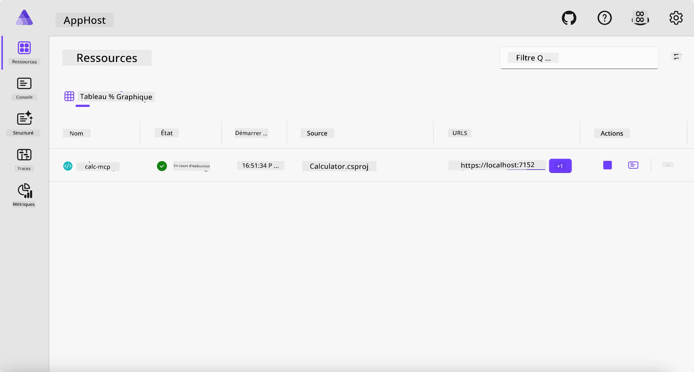
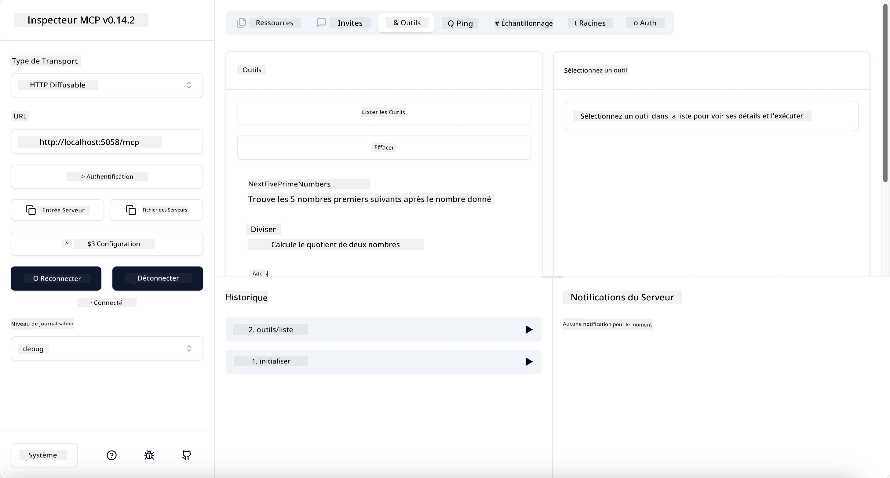
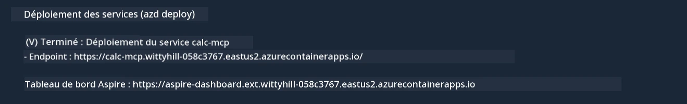

# Exemple

L'exemple précédent montre comment utiliser un projet .NET local avec le type `stdio`. Et comment exécuter le serveur localement dans un conteneur. C'est une bonne solution dans de nombreuses situations. Cependant, il peut être utile d'avoir le serveur fonctionnant à distance, comme dans un environnement cloud. C'est là qu'intervient le type `http`.

En regardant la solution dans le dossier `04-PracticalImplementation`, cela peut sembler bien plus complexe que le précédent. Mais en réalité, ce n'est pas le cas. Si vous regardez de près le projet `src/Calculator`, vous verrez que c'est essentiellement le même code que dans l'exemple précédent. La seule différence est que nous utilisons une bibliothèque différente `ModelContextProtocol.AspNetCore` pour gérer les requêtes HTTP. Et nous changeons la méthode `IsPrime` pour la rendre privée, juste pour montrer que vous pouvez avoir des méthodes privées dans votre code. Le reste du code est le même qu'avant.

Les autres projets viennent de [Aspire](https://aspire.dev/get-started/what-is-aspire/). Avoir Aspire dans la solution améliore l'expérience du développeur pendant le développement et les tests et aide à l'observabilité. Ce n'est pas nécessaire pour exécuter le serveur, mais c'est une bonne pratique de l'avoir dans votre solution.

## Démarrer le serveur localement

1. Depuis VS Code (avec l'extension C# DevKit), naviguez jusqu'au répertoire `04-PracticalImplementation/samples/csharp`.
1. Exécutez la commande suivante pour démarrer le serveur :

   ```bash
    dotnet watch run --project ./src/AppHost
   ```

1. Lorsqu'un navigateur web ouvre le tableau de bord Aspire, notez l'URL `http`. Elle devrait ressembler à `http://localhost:5058/`.

   

## Tester le Streamable HTTP avec MCP Inspector

Si vous avez Node.js 22.7.5 ou supérieur, vous pouvez utiliser MCP Inspector pour tester votre serveur.

Démarrez le serveur et exécutez la commande suivante dans un terminal :

```bash
npx @modelcontextprotocol/inspector http://localhost:5058
```



- Sélectionnez `Streamable HTTP` comme type de transport.
- Dans le champ URL, saisissez l'URL du serveur notée précédemment, et ajoutez `/mcp`. Cela doit être en `http` (pas `https`), quelque chose comme `http://localhost:5058/mcp`.
- cliquez sur le bouton Connect.

Un avantage de l'inspecteur est qu'il offre une bonne visibilité sur ce qui se passe.

- Essayez de lister les outils disponibles
- Essayez certains d'entre eux, cela devrait fonctionner comme avant.

## Tester le serveur MCP avec GitHub Copilot Chat dans VS Code

Pour utiliser le transport Streamable HTTP avec GitHub Copilot Chat, modifiez la configuration du serveur `calc-mcp` créé précédemment pour qu'elle ressemble à ceci :

```jsonc
// .vscode/mcp.json
{
  "servers": {
    "calc-mcp": {
      "type": "http",
      "url": "http://localhost:5058/mcp"
    }
  }
}
```

Faites quelques tests :

- Demandez "3 nombres premiers après 6780". Notez comment Copilot utilisera les nouveaux outils `NextFivePrimeNumbers` et ne retournera que les 3 premiers nombres premiers.
- Demandez "7 nombres premiers après 111", pour voir ce qui se passe.
- Demandez "John a 24 sucettes et veut les distribuer à ses 3 enfants. Combien de sucettes chaque enfant aura-t-il ?", pour voir ce qui se passe.

## Déployer le serveur sur Azure

Déployons le serveur sur Azure pour que plus de personnes puissent l'utiliser.

Depuis un terminal, allez dans le dossier `04-PracticalImplementation/samples/csharp` et exécutez la commande suivante :

```bash
azd up
```

Une fois le déploiement terminé, vous devriez voir un message comme celui-ci :



Prenez l'URL et utilisez-la dans MCP Inspector et dans GitHub Copilot Chat.

```jsonc
// .vscode/mcp.json
{
  "servers": {
    "calc-mcp": {
      "type": "http",
      "url": "https://calc-mcp.gentleriver-3977fbcf.australiaeast.azurecontainerapps.io/mcp"
    }
  }
}
```

## Et après ?

Nous avons essayé différents types de transports et outils de test. Nous avons également déployé votre serveur MCP sur Azure. Mais que faire si notre serveur doit accéder à des ressources privées ? Par exemple, une base de données ou une API privée ? Dans le chapitre suivant, nous verrons comment améliorer la sécurité de notre serveur.

---

<!-- CO-OP TRANSLATOR DISCLAIMER START -->
**Avertissement** :
Ce document a été traduit à l'aide du service de traduction automatique [Co-op Translator](https://github.com/Azure/co-op-translator). Bien que nous nous efforçions d'assurer l'exactitude, veuillez noter que les traductions automatisées peuvent contenir des erreurs ou des inexactitudes. Le document original dans sa langue native doit être considéré comme la source faisant autorité. Pour les informations critiques, il est recommandé de recourir à une traduction professionnelle réalisée par un humain. Nous ne saurions être tenus responsables des malentendus ou erreurs d'interprétation découlant de l'utilisation de cette traduction.
<!-- CO-OP TRANSLATOR DISCLAIMER END -->