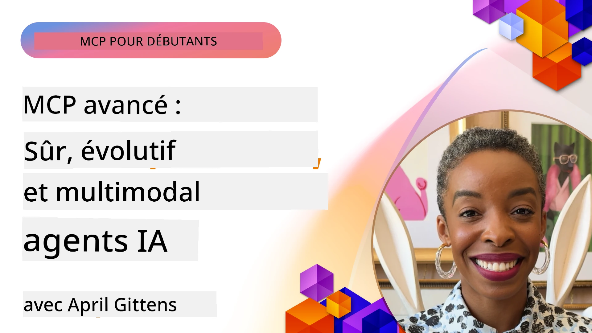

# Sujets avancés dans MCP

_(Cliquez sur l'image ci-dessus pour voir la vidéo de cette leçon)_

Ce chapitre couvre une série de sujets avancés dans l’implémentation du Model Context Protocol (MCP), notamment l’intégration multimodale, l’évolutivité, les meilleures pratiques en matière de sécurité et l’intégration en entreprise. Ces sujets sont cruciaux pour construire des applications MCP robustes et prêtes pour la production, capables de répondre aux exigences des systèmes d’IA modernes.

## Aperçu

Cette leçon explore des concepts avancés dans l’implémentation du Model Context Protocol, en mettant l'accent sur l’intégration multimodale, l’évolutivité, les meilleures pratiques de sécurité et l’intégration en entreprise. Ces sujets sont essentiels pour développer des applications MCP de niveau production capables de gérer des exigences complexes dans les environnements d’entreprise.

> **Note sur la spécification actuelle :** MCP `2026-07-28` déprécie les primitives Roots et
> Sampling couvertes dans les leçons 5.4 et 5.6. Elle déplace également la
> fonctionnalité expérimentale Tasks mentionnée dans Protocol Features (5.16) vers une
> extension dédiée Tasks. Ces leçons sont conservées pour les implémentations héritées
> `2025-11-25` et incluent des conseils de migration. Voir
> [Quoi de neuf dans MCP : La spécification 2026-07-28](../01-CoreConcepts/mcp-2026-07-28.md).

## Objectifs d’apprentissage

À la fin de cette leçon, vous serez capable de :

- Mettre en œuvre des capacités multimodales au sein des frameworks MCP
- Concevoir des architectures MCP évolutives pour des scénarios à forte demande
- Appliquer les meilleures pratiques de sécurité alignées sur les principes de sécurité MCP
- Intégrer MCP avec les systèmes et frameworks IA en entreprise
- Optimiser la performance et la fiabilité en environnements de production

## Leçons et projets exemples

| Lien | Titre | Description |
|------|-------|-------------|
| [5.1 Integration with Azure](./mcp-integration/README.md) | Intégration avec Azure | Apprenez à intégrer votre serveur MCP sur Azure |
| [5.2 Multi modal sample](./mcp-multi-modality/README.md) | Exemples MCP multimodaux | Exemples pour audio, image et réponse multimodale |
| [5.3 MCP OAuth2 sample](../../../05-AdvancedTopics/mcp-oauth2-demo) | Démo MCP OAuth2 | Application Spring Boot minimale montrant OAuth2 avec MCP, à la fois comme serveur d’autorisation et ressource. Démontre l’émission sécurisée de jetons, les points d’accès protégés, le déploiement Azure Container Apps et l’intégration API Management. |
| [5.4 Root Contexts](./mcp-root-contexts/README.md) | Contextes racines | Apprenez la primitive héritée Roots `2025-11-25` et les options de migration actuelles (dépréciée en `2026-07-28`) |
| [5.5 Routing](./mcp-routing/README.md) | Routage | Découvrez différents types de routage |
| [5.6 Sampling](./mcp-sampling/README.md) | Échantillonnage | Apprenez la primitive héritée Sampling `2025-11-25` et les options de migration actuelles (dépréciée en `2026-07-28`) |
| [5.7 Scaling](./mcp-scaling/README.md) | Mise à l’échelle | Découvrez la mise à l’échelle |
| [5.8 Security](./mcp-security/README.md) | Sécurité | Sécurisez votre serveur MCP |
| [5.9 Web Search sample](./web-search-mcp/README.md) | Recherche Web MCP | Serveur et client MCP Python intégrant SerpAPI pour la recherche web, actualités, produits et Q&R en temps réel. Démontre l’orchestration multi-outils, l’intégration d’API externes et une gestion robuste des erreurs. |
| [5.10 Realtime Streaming](./mcp-realtimestreaming/README.md) | Streaming | Le streaming de données en temps réel est devenu essentiel dans le monde axé sur les données d’aujourd’hui, où les entreprises et applications nécessitent un accès immédiat à l’information pour prendre des décisions rapides. |
| [5.11 Realtime Web Search](./mcp-realtimesearch/README.md) | Recherche Web | La recherche web en temps réel : comment MCP transforme la recherche web en temps réel en fournissant une approche standardisée de la gestion du contexte entre modèles IA, moteurs de recherche et applications. | 
| [5.12  Entra ID Authentication for Model Context Protocol Servers](./mcp-security-entra/README.md) | Authentification Entra ID | Microsoft Entra ID offre une solution robuste de gestion d'identité et d'accès basée sur le cloud, aidant à garantir que seuls les utilisateurs et applications autorisés peuvent interagir avec votre serveur MCP. |
| [5.13 Microsoft Foundry Agent Integration](./mcp-foundry-agent-integration/README.md) | Intégration Microsoft Foundry | Apprenez à intégrer les serveurs Model Context Protocol avec les agents Microsoft Foundry, permettant une orchestration puissante d’outils et des capacités IA en entreprise avec des connexions standardisées aux sources de données externes. |
| [5.14 Context Engineering](./mcp-contextengineering/README.md) | Ingénierie du contexte | Opportunité future des techniques d’ingénierie du contexte pour les serveurs MCP, incluant l’optimisation du contexte, la gestion dynamique du contexte, et les stratégies pour une ingénierie efficace des invites dans les frameworks MCP. |
| [5.15 MCP Custom Transport](./mcp-transport/README.md) | Transport personnalisé | Apprenez à implémenter des mécanismes de transport personnalisés pour des scénarios de communication MCP spécialisés. |
| [5.16 Protocol Features Deep Dive](./mcp-protocol-features/README.md) | Fonctionnalités du protocole | Maîtrisez des fonctionnalités avancées du protocole telles que les notifications de progression, l’annulation de requête, les modèles de ressources et les schémas de gestion d’erreurs. |
| [5.17 Adversarial Multi-Agent Reasoning](./mcp-adversarial-agents/README.md) | Agents adversaires | Utilisez deux agents avec des positions opposées, partageant un seul jeu d’outils MCP, pour détecter les hallucinations, faire ressortir les cas limites et produire des résultats mieux calibrés grâce à un débat structuré. |

> **Note historique `2025-11-25` :** cette révision a introduit les Tasks expérimentales
> et étendu plusieurs fonctionnalités du protocole. En `2026-07-28`, Tasks est passée à
> une extension officielle et Roots a été dépréciée. Ne pas utiliser le
> statut des fonctionnalités `2025-11-25` comme guide actuel ; voir le
> [journal des modifications 2026-07-28](https://modelcontextprotocol.io/specification/2026-07-28/changelog).

## Références supplémentaires

Pour les informations les plus à jour sur les sujets avancés MCP, référez-vous à :
- [Documentation MCP](https://modelcontextprotocol.io/)
- [Spécification MCP (2026-07-28)](https://modelcontextprotocol.io/specification/2026-07-28/)
- [Dépôt GitHub](https://github.com/modelcontextprotocol)
- [OWASP MCP Top 10](https://microsoft.github.io/mcp-azure-security-guide/mcp/) - Risques de sécurité et mesures d'atténuation
- [Atelier Sommet Sécurité MCP (Sherpa)](https://azure-samples.github.io/sherpa/) - Formation pratique à la sécurité

## Points clés à retenir

- Les implémentations MCP multimodales étendent les capacités de l'IA au-delà du traitement du texte
- La scalabilité est essentielle pour les déploiements en entreprise et peut être abordée par une montée en charge horizontale et verticale
- Des mesures de sécurité complètes protègent les données et garantissent un contrôle d'accès approprié
- L'intégration en entreprise avec des plateformes telles qu'Azure OpenAI et Microsoft AI Foundry renforce les capacités MCP
- Les implémentations avancées de MCP bénéficient d'architectures optimisées et d'une gestion soigneuse des ressources

## Exercice

Concevez une implémentation MCP de niveau entreprise pour un cas d'utilisation spécifique :

1. Identifiez les exigences multimodales pour votre cas d'utilisation
2. Décrivez les contrôles de sécurité nécessaires pour protéger les données sensibles
3. Concevez une architecture évolutive capable de gérer des charges variables
4. Planifiez les points d'intégration avec les systèmes d'IA d'entreprise
5. Documentez les goulots d'étranglement potentiels en performance et les stratégies d'atténuation

## Ressources supplémentaires

- [Documentation Azure OpenAI](https://learn.microsoft.com/en-us/azure/ai-services/openai/)
- [Documentation Microsoft AI Foundry](https://learn.microsoft.com/en-us/ai-services/)

---

## Et après

Explorez les leçons de ce module en commençant par : [5.1 Intégration MCP](./mcp-integration/README.md)

Une fois ce module terminé, poursuivez avec : [Module 6 : Contributions Communautaires](../06-CommunityContributions/README.md)

---

<!-- CO-OP TRANSLATOR DISCLAIMER START -->
**Avertissement** :
Ce document a été traduit à l'aide du service de traduction automatique [Co-op Translator](https://github.com/Azure/co-op-translator). Bien que nous nous efforçions d'assurer l'exactitude, veuillez noter que les traductions automatisées peuvent contenir des erreurs ou des inexactitudes. Le document original dans sa langue native doit être considéré comme la source faisant autorité. Pour les informations critiques, il est recommandé de recourir à une traduction professionnelle réalisée par un humain. Nous ne saurions être tenus responsables des malentendus ou erreurs d'interprétation découlant de l'utilisation de cette traduction.
<!-- CO-OP TRANSLATOR DISCLAIMER END -->