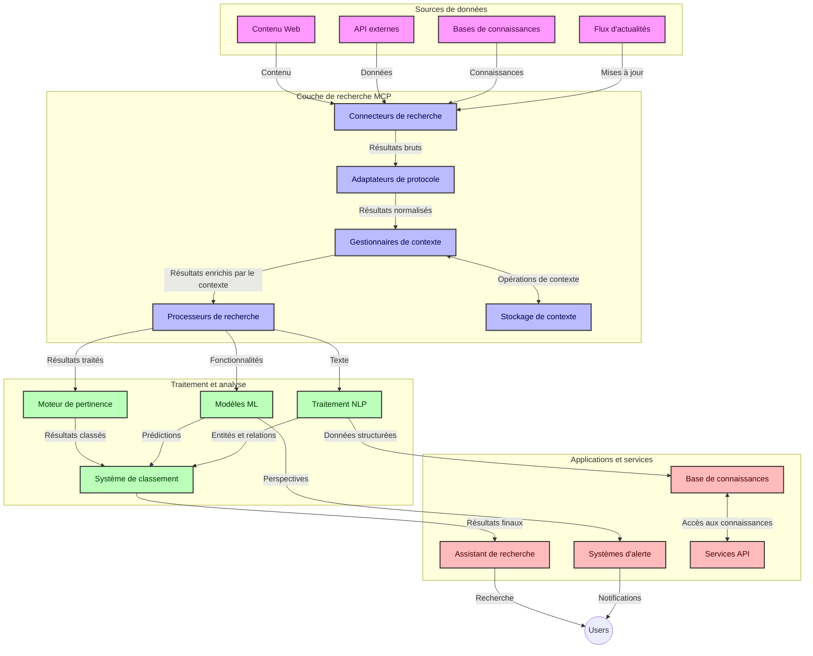
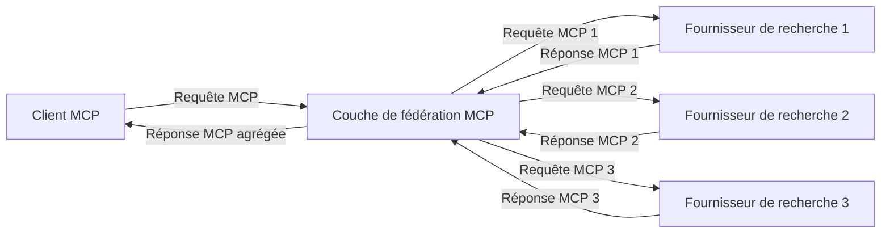
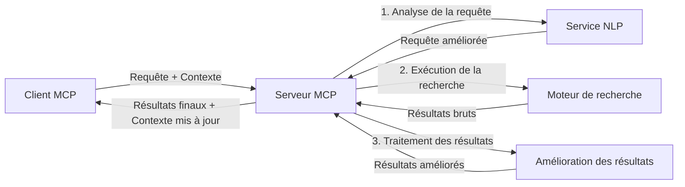

# Protocole de Contexte de Modèle pour la Recherche Web en Temps Réel

## Aperçu

La recherche web en temps réel est devenue essentielle dans l'environnement d'information actuel, où les applications ont besoin d'un accès immédiat à des informations à jour sur Internet pour fournir des réponses pertinentes et opportunes. Le Protocole de Contexte de Modèle (MCP) représente une avancée significative dans l'optimisation de ces processus de recherche en temps réel, améliorant l'efficacité de la recherche, maintenant l'intégrité contextuelle et améliorant les performances globales du système.

Ce module explore comment le MCP transforme la recherche web en temps réel en fournissant une approche standardisée de la gestion du contexte entre les modèles d'IA, les moteurs de recherche et les applications.

### Ce que vous allez apprendre

Dans ce guide complet, vous découvrirez :

- Comment le MCP crée un pont transparent entre les modèles d'IA et les capacités de recherche web en temps réel
- Les modèles architecturaux pour implémenter des solutions de recherche efficaces et évolutives avec le MCP
- Les techniques pour préserver le contexte de recherche à travers plusieurs requêtes et interactions
- Des implémentations pratiques en Python et JavaScript pour divers scénarios de recherche
- Les méthodes pour équilibrer pertinence, actualité et performances dans les systèmes de recherche propulsés par le MCP

## Introduction à la Recherche Web en Temps Réel

La recherche web en temps réel est une approche technologique qui permet des requêtes, un traitement et une analyse continues des informations basées sur le web dès leur publication ou mise à jour, permettant aux systèmes de fournir des informations fraîches et pertinentes avec une latence minimale. Contrairement aux systèmes de recherche traditionnels qui fonctionnent sur des données indexées pouvant avoir plusieurs heures ou jours, la recherche en temps réel traite des données en direct provenant du web, offrant des informations et des insights reflétant l'état actuel du contenu en ligne.

### Concepts de base de la recherche web en temps réel :

- **Traitement continu des requêtes** : Les requêtes de recherche sont traitées sur des sources de données constamment mises à jour
- **Priorisation de l'actualité** : Les systèmes sont conçus pour prioriser les informations récentes
- **Équilibrage de la pertinence** : Maintenir un équilibre entre pertinence et actualité
- **Architecture évolutive** : Les systèmes doivent gérer des charges de requêtes et des volumes de données variables
- **Compréhension contextuelle** : Maintenir le contexte utilisateur à travers les itérations de recherche est crucial pour des résultats significatifs
- **Reformulation dynamique des requêtes** : Modifier de façon adaptative les requêtes selon le contexte et les résultats précédents
- **Intégration multi-sources** : Combiner les résultats de plusieurs fournisseurs de recherche et sources web
- **Compréhension sémantique** : Traiter les requêtes et le contenu basé sur le sens plutôt que sur des mots-clés uniquement
- **Classement en temps réel** : Ajuster continuellement le classement des résultats au fur et à mesure que de nouvelles informations apparaissent

### Le Protocole de Contexte de Modèle et la Recherche Web en Temps Réel

Le Protocole de Contexte de Modèle (MCP) répond à plusieurs défis critiques dans les environnements de recherche web en temps réel :

1. **Préservation du contexte de recherche** : Le MCP standardise la manière dont le contexte est maintenu à travers des composants de recherche distribués, garantissant que les modèles d'IA et les nœuds de traitement ont accès à l'historique pertinent des requêtes et aux préférences utilisateur.

2. **Gestion efficace des requêtes** : En fournissant des mécanismes structurés pour la transmission du contexte, le MCP réduit la surcharge liée à la répétition du contexte à chaque itération de recherche.

3. **Interopérabilité** : Le MCP crée un langage commun pour le partage du contexte entre diverses technologies de recherche et modèles d'IA, permettant des architectures plus flexibles et extensibles.

4. **Contexte optimisé pour la recherche** : Les implémentations du MCP peuvent prioriser les éléments contextuels les plus pertinents pour une recherche efficace, optimisant à la fois la performance et la précision.

5. **Traitement adaptatif de la recherche** : Avec une bonne gestion du contexte via le MCP, les systèmes de recherche peuvent ajuster dynamiquement leur traitement en fonction de l'évolution des besoins utilisateur et des paysages d'information.

Dans les applications modernes allant de l'agrégation d'actualités aux assistants de recherche, l'intégration du MCP avec les technologies de recherche web permet une recherche plus intelligente et contextuelle qui peut fournir des résultats de plus en plus pertinents au fur et à mesure des interactions utilisateur.

## Objectifs d'apprentissage

À la fin de cette leçon, vous serez capable de :

- Comprendre les fondamentaux de la recherche web en temps réel et ses défis dans les applications modernes
- Expliquer comment le Protocole de Contexte de Modèle (MCP) améliore les capacités de recherche web en temps réel
- Implémenter des solutions de recherche basées sur MCP en utilisant des frameworks et API populaires
- Concevoir et déployer des architectures de recherche évolutives et performantes avec MCP
- Appliquer les concepts MCP à divers cas d'usage, y compris la recherche sémantique, l'assistance à la recherche et la navigation augmentée par IA
- Évaluer les tendances émergentes et les innovations futures dans les technologies de recherche basées sur MCP
- Développer des systèmes de recherche contextuels qui apprennent des interactions utilisateur
- Intégrer les capacités de recherche web aux assistants IA en utilisant les protocoles MCP standardisés
- Créer des pipelines de recherche à plusieurs étapes qui affinent progressivement les résultats en fonction du contexte
- Optimiser les performances de recherche tout en maintenant une conscience complète du contexte

### Définition et Importance

La recherche web en temps réel implique la requête continue, la récupération et la diffusion d'informations basées sur le web avec une latence minimale. Contrairement aux moteurs de recherche traditionnels qui explorent et indexent périodiquement le web, la recherche en temps réel vise à faire remonter l'information dès qu'elle devient disponible, permettant un accès immédiat au contenu le plus actuel.

Les caractéristiques clés de la recherche web en temps réel incluent :

- **Fraîcheur** : Priorisation du contenu récent et des mises à jour
- **Traitement continu** : Surveillance constante pour les nouvelles informations
- **Adaptation des requêtes** : Affinage des requêtes de recherche basé sur le contexte et les retours
- **Livraison immédiate** : Fourniture des résultats de recherche avec un délai minimal
- **Rétention du contexte** : Construction à partir des requêtes précédentes pour une meilleure pertinence

### Défis dans la Recherche Web Traditionnelle

Les approches traditionnelles de recherche web rencontrent plusieurs limites lorsqu'elles sont appliquées aux scénarios en temps réel :

1. **Fragmentation du contexte** : Difficulté à maintenir le contexte de recherche à travers plusieurs requêtes
2. **Actualité de l'information** : Difficultés d'accès et de priorisation des informations les plus récentes
3. **Complexité d'intégration** : Problèmes d'interopérabilité entre systèmes de recherche et applications
4. **Problèmes de latence** : Équilibrer la recherche exhaustive avec les exigences de temps de réponse
5. **Réglage de la pertinence** : Assurer précision et pertinence tout en priorisant l'actualité

## Comprendre le Protocole de Contexte de Modèle (MCP) pour la Recherche

### Qu'est-ce que le MCP dans les Contextes de Recherche ?

Le Protocole de Contexte de Modèle (MCP) est un protocole de communication standardisé conçu pour faciliter une interaction efficace entre les modèles d'IA et les applications. Dans le contexte de la recherche web en temps réel, le MCP fournit un cadre pour :

- Préserver le contexte de recherche tout au long des séquences de requêtes
- Standardiser les formats de requêtes et de résultats de recherche
- Optimiser la transmission des paramètres et des résultats de recherche
- Améliorer la communication entre modèles et moteurs de recherche

### Composants principaux et Architecture

L'architecture MCP pour la recherche web en temps réel se compose de plusieurs composants clés :

1. **Gestionnaires de Contexte de Requête** : Gèrent et maintiennent le contexte de recherche sur plusieurs requêtes
2. **Processeurs de Recherche** : Traitent les requêtes entrantes avec des techniques conscientes du contexte
3. **Adaptateurs de Protocole** : Convertissent entre différentes API de recherche tout en préservant le contexte
4. **Stockage de Contexte** : Stocke et récupère efficacement l'historique et les préférences de recherche
5. **Connecteurs de Recherche** : Se connectent à divers moteurs de recherche et API web



### Comment le MCP Améliore la Recherche Web en Temps Réel

Le MCP répond aux défis traditionnels de la recherche web à travers :

- **Continuité contextuelle** : Maintenir les relations entre les requêtes pendant toute la session de recherche
- **Transmission optimisée** : Réduire la redondance dans les paramètres de recherche via une gestion intelligente du contexte
- **Interfaces standardisées** : Fournir des API cohérentes pour les composants de recherche
- **Réduction de la latence** : Minimiser la surcharge de traitement grâce à une gestion efficace du contexte
- **Pertinence améliorée** : Améliorer la pertinence en préservant l'intention utilisateur à travers plusieurs requêtes

## Intégration et Mise en Œuvre

Les systèmes de recherche web en temps réel nécessitent une conception architecturale et une mise en œuvre soigneuses pour maintenir à la fois performance et intégrité contextuelle. Le Protocole de Contexte de Modèle offre une approche standardisée pour intégrer les modèles d'IA et les technologies de recherche, permettant des pipelines de recherche plus sophistiqués et conscients du contexte.

### Aperçu de l'Intégration MCP dans les Architectures de Recherche

Implémenter MCP dans des environnements de recherche web en temps réel implique plusieurs considérations clés :

1. **Sérialisation du Contexte de Recherche** : Le MCP fournit des mécanismes efficaces pour encoder les informations contextuelles dans les requêtes de recherche, garantissant que le contexte essentiel accompagne la requête tout au long du pipeline de traitement. Cela inclut des formats de sérialisation standardisés optimisés pour les métadonnées liées à la recherche.

2. **Traitement de Recherche Stateful** : Le MCP permet un traitement avec état plus intelligent en maintenant une représentation cohérente du contexte à travers les itérations de recherche. Cela est particulièrement précieux dans les pipelines de recherche à plusieurs étapes où le raffinement du contexte améliore les résultats.

3. **Extension et Raffinement de la Requête** : Les implémentations MCP dans les systèmes de recherche peuvent faciliter une extension et un raffinement sophistiqués des requêtes basés sur le contexte accumulé, permettant des résultats de plus en plus pertinents au fur et à mesure de la progression de la session de recherche.

4. **Mise en Cache et Priorisation des Résultats** : En standardisant la gestion du contexte, le MCP aide à gérer la mise en cache des résultats et leur priorisation, permettant aux composants de s'adapter en fonction du contexte de recherche évolutif.

5. **Fédération et Agrégation de Recherche** : Le MCP facilite une fédération plus sophistiquée de la recherche à travers plusieurs backends en fournissant des représentations structurées du contexte de recherche, permettant une agrégation plus significative des résultats provenant de sources diverses.

La mise en œuvre du MCP à travers diverses technologies de recherche crée une approche unifiée de la gestion du contexte, réduisant le besoin de code d'intégration personnalisé tout en améliorant la capacité du système à maintenir un contexte significatif à mesure que les requêtes évoluent.

### MCP dans diverses implémentations de recherche web

Ces exemples suivent la spécification MCP actuelle qui se concentre sur un protocole basé sur JSON-RPC avec des mécanismes de transport distincts. Le code montre comment vous pouvez implémenter des intégrations de recherche personnalisées tout en maintenant une compatibilité complète avec le protocole MCP.


<details>
<summary>Implémentation Python avec API de Recherche Générique</summary>

```python
import asyncio
import json
import aiohttp
from typing import Dict, Any, Optional, List
from contextlib import asynccontextmanager
from collections.abc import AsyncIterator

# Importer les bibliothèques MCP standard
from mcp.client.session import ClientSession
from mcp.client.streamable_http import streamablehttp_client
from mcp.types import TextContent, CreateMessageRequestParams, CreateMessageResult
from mcp.server.fastmcp import FastMCP

# Créer un serveur FastMCP pour la recherche web
search_server = FastMCP("WebSearch")

# Classe pour gérer les opérations de recherche web
class WebSearchHandler:
    def __init__(self, api_endpoint: str, api_key: str):
        self.api_endpoint = api_endpoint
        self.api_key = api_key
        self.session = None
        
    async def initialize(self):
        """Initialize the HTTP session"""
        self.session = aiohttp.ClientSession(
            headers={"Authorization": f"Bearer {self.api_key}"}
        )
    
    async def close(self):
        """Close the HTTP session"""
        if self.session:
            await self.session.close()
            
    async def perform_search(self, query: str, max_results: int = 5, 
                           include_domains: List[str] = None, 
                           exclude_domains: List[str] = None,
                           time_period: str = "any") -> Dict[str, Any]:
        """Perform web search using the search API"""
        # Construire les paramètres de recherche
        search_params = {
            "q": query,
            "limit": max_results,
            "time": time_period
        }
        
        if include_domains:
            search_params["site"] = ",".join(include_domains)
            
        if exclude_domains:
            search_params["exclude_site"] = ",".join(exclude_domains)
        
        # Effectuer la requête de recherche
        try:
            async with self.session.get(
                self.api_endpoint,
                params=search_params
            ) as response:
                if response.status != 200:
                    error_text = await response.text()
                    raise Exception(f"Search API error: {response.status} - {error_text}")
                
                search_data = await response.json()
                
                # Transformer la réponse spécifique à l'API en un format standard
                results = []
                for item in search_data.get("results", []):
                    results.append({
                        "title": item.get("title", ""),
                        "url": item.get("url", ""),
                        "snippet": item.get("snippet", ""),
                        "date": item.get("published_date", ""),
                        "source": item.get("source", "")
                    })
                
                return {
                    "query": query,
                    "totalResults": len(results),
                    "results": results
                }
        except Exception as e:
            print(f"Search API request error: {e}")
            raise

# Initialiser le gestionnaire de recherche
search_handler = WebSearchHandler(
    api_endpoint="https://api.search-service.example/search",
    api_key="your-api-key-here"
)

# Configurer la durée de vie pour gérer le gestionnaire de recherche
@asyncio.asynccontextmanager
async def app_lifespan(server: FastMCP):
    """Manage application lifecycle"""
    await search_handler.initialize()
    try:
        yield {"search_handler": search_handler}
    finally:
        await search_handler.close()

# Définir la durée de vie pour le serveur
search_server = FastMCP("WebSearch", lifespan=app_lifespan)

# Enregistrer un outil de recherche web
@search_server.tool()
async def web_search(query: str, max_results: int = 5, 
                   include_domains: List[str] = None,
                   exclude_domains: List[str] = None,
                   time_period: str = "any") -> Dict[str, Any]:
    """
    Search the web for information
    
    Args:
        query: The search query
        max_results: Maximum number of results to return (default: 5)
        include_domains: List of domains to include in search results
        exclude_domains: List of domains to exclude from search results
        time_period: Time period for results ("day", "week", "month", "any")
        
    Returns:
        Dictionary containing search results
    """
    ctx = search_server.get_context()
    search_handler = ctx.request_context.lifespan_context["search_handler"]
    
    results = await search_handler.perform_search(
        query=query,
        max_results=max_results,
        include_domains=include_domains,
        exclude_domains=exclude_domains,
        time_period=time_period
    )
    
    return results

# Exemple d'utilisation client
async def client_example():
    # Se connecter au serveur de recherche en utilisant le transport HTTP Streamable
    async with streamablehttp_client("http://localhost:8000/mcp") as (read, write, _):
        async with ClientSession(read, write) as session:
            # Initialiser la connexion
            await session.initialize()
            
            # Appeler l'outil web_search
            search_results = await session.call_tool(
                "web_search", 
                {
                    "query": "latest developments in AI and Model Context Protocol",
                    "max_results": 5,
                    "time_period": "day",
                    "include_domains": ["github.com", "microsoft.com"]
                }
            )
            
            print(f"Search results: {search_results}")

# Exemple d'exécution du serveur
if __name__ == "__main__":
    # Exécuter le serveur avec le transport HTTP Streamable
    search_server.run(transport="streamable-http")
```
</details> 

<details>
<summary>Implémentation JavaScript avec Recherche Basée sur Navigateur</summary>


```javascript
// Mise en œuvre du serveur MCP pour la recherche web
import { McpServer, ResourceTemplate } from '@modelcontextprotocol/sdk/server/mcp.js';
import { StreamableHTTPServerTransport } from '@modelcontextprotocol/sdk/server/streamableHttp.js';
import { z } from 'zod';

// Créer un serveur MCP pour la recherche web
const searchServer = new McpServer({
    name: "BrowserSearch",
    description: "A server that provides web search capabilities"
});

// Classe de service de recherche
class SearchService {
    constructor(searchApiUrl, apiKey) {
        this.searchApiUrl = searchApiUrl;
        this.apiKey = apiKey;
    }

    async performSearch(parameters) {
        const {
            query = '',
            maxResults = 5,
            includeDomains = [],
            excludeDomains = [],
            timePeriod = 'any'
        } = parameters;
        
        // Construire l'URL de recherche avec des paramètres
        const url = new URL(this.searchApiUrl);
        url.searchParams.append('q', query);
        url.searchParams.append('limit', maxResults);
        url.searchParams.append('time', timePeriod);
        
        if (includeDomains.length > 0) {
            url.searchParams.append('site', includeDomains.join(','));
        }
        
        if (excludeDomains.length > 0) {
            url.searchParams.append('exclude_site', excludeDomains.join(','));
        }
        
        try {
            const response = await fetch(url.toString(), {
                method: 'GET',
                headers: {
                    'Authorization': `Bearer ${this.apiKey}`,
                    'Content-Type': 'application/json'
                }
            });
            
            if (!response.ok) {
                const errorText = await response.text();
                throw new Error(`Search API error: ${response.status} - ${errorText}`);
            }
            
            const searchData = await response.json();
            
            // Transformer la réponse spécifique à l'API en un format standard
            const results = searchData.results?.map(item => ({
                title: item.title || '',
                url: item.url || '',
                snippet: item.snippet || '',
                date: item.published_date || '',
                source: item.source || ''
            })) || [];
            
            return {
                query,
                totalResults: results.length,
                results
            };
        } catch (error) {
            console.error('Search API request error:', error);
            throw error;
        }
    }
}

// Initialiser le service de recherche
const searchService = new SearchService(
    'https://api.search-service.example/search',
    'your-api-key-here'
);

// Configurer le fournisseur de contexte pour le serveur
searchServer.setContextProvider(() => {
    return {
        searchService
    };
});

// Enregistrer l'outil de recherche web
searchServer.tool({
    name: 'web_search',
    description: 'Search the web for information',
    parameters: {
        type: 'object',
        properties: {
            query: {
                type: 'string',
                description: 'The search query'
            },
            maxResults: {
                type: 'integer',
                description: 'Maximum number of results to return',
                default: 5
            },
            includeDomains: {
                type: 'array',
                items: { type: 'string' },
                description: 'List of domains to include in search results'
            },
            excludeDomains: {
                type: 'array',
                items: { type: 'string' },
                description: 'List of domains to exclude from search results'
            },
            timePeriod: {
                type: 'string',
                description: 'Time period for results',
                enum: ['day', 'week', 'month', 'any'],
                default: 'any'
            }
        },
        required: ['query']
    },
    handler: async (params, context) => {
        const { searchService } = context;
        return await searchService.performSearch(params);
    }
});

// Exemple de code client pour se connecter au serveur de recherche
import { Client } from '@modelcontextprotocol/sdk/client/index.js';
import { StreamableHTTPClientTransport } from '@modelcontextprotocol/sdk/client/streamableHttp.js';

async function connectToSearchServer() {
    // Se connecter au serveur de recherche
    const transport = new StreamableHTTPClientTransport(
        new URL('http://localhost:8000/mcp')
    );
    
    const client = new Client({
        name: 'search-client',
        version: '1.0.0'
    });
    
    await client.connect(transport);
    
    // Exécuter l'outil de recherche
    const searchResults = await client.callTool({
        name: 'web_search',
        arguments: {
            query: 'Model Context Protocol implementation examples',
            maxResults: 10,
            timePeriod: 'week',
            includeDomains: ['github.com', 'docs.microsoft.com']
        }
    });
    
    console.log('Search results:', searchResults);
    
    // Nettoyer
    await client.disconnect();
}

// Démarrer le serveur
const transport = new StreamableHTTPServerTransport();
await searchServer.connect(transport);
console.log('Search server running at http://localhost:8000/mcp');

// Dans un processus séparé ou après le démarrage du serveur
// connectToSearchServer().catch(console.error);
```
</details> 


## Avertissement sur les Exemples de Code

> **Note importante** : Les exemples de code ci-dessous démontrent l'intégration du Protocole de Contexte de Modèle (MCP) avec la fonctionnalité de recherche web. Bien qu'ils suivent les modèles et structures des SDK MCP officiels, ils ont été simplifiés à des fins éducatives.
> 
> Ces exemples présentent :
> 
> 1. **Implémentation Python** : Une implémentation de serveur FastMCP qui fournit un outil de recherche web et se connecte à une API de recherche externe. Cet exemple démontre la gestion appropriée du cycle de vie, la gestion du contexte et l'implémentation des outils suivant les modèles du [SDK Python MCP officiel](https://github.com/modelcontextprotocol/python-sdk). Le serveur utilise le transport HTTP Streamable recommandé, qui a remplacé l'ancien transport SSE pour les déploiements en production.
> 
> 2. **Implémentation JavaScript** : Une implémentation TypeScript/JavaScript utilisant le modèle FastMCP du [SDK TypeScript MCP officiel](https://github.com/modelcontextprotocol/typescript-sdk) pour créer un serveur de recherche avec des définitions d'outils appropriées et des connexions clients. Elle suit les derniers modèles recommandés pour la gestion des sessions et la préservation du contexte.
> 
> Ces exemples nécessiteraient une gestion supplémentaire des erreurs, une authentification et un code d'intégration API spécifique pour une utilisation en production. Les points de terminaison d'API de recherche montrés (`https://api.search-service.example/search`) sont des espaces réservés et devraient être remplacés par des points de terminaison réels de services de recherche.
> 
> Pour obtenir les détails complets d'implémentation et les approches les plus à jour, veuillez consulter la [spécification MCP officielle](https://spec.modelcontextprotocol.io/) et la documentation des SDK.

## Concepts Clés

### Le Cadre du Protocole de Contexte de Modèle (MCP)

À sa base, le Protocole de Contexte de Modèle fournit une manière standardisée pour les modèles d'IA, les applications et les services d'échanger du contexte. Dans la recherche web en temps réel, ce cadre est essentiel à la création d'expériences de recherche cohérentes à multiples tours. Les composants clés incluent :

1. **Architecture Client-Serveur** : MCP établit une séparation claire entre les clients de recherche (demandeurs) et les serveurs de recherche (fournisseurs), permettant des modèles de déploiement flexibles.

2. **Communication JSON-RPC** : Le protocole utilise JSON-RPC pour l'échange de messages, le rendant compatible avec les technologies web et facile à implémenter sur différentes plateformes.

3. **Gestion du Contexte** : MCP définit des méthodes structurées pour maintenir, mettre à jour et exploiter le contexte de recherche à travers plusieurs interactions.

4. **Définitions d'Outils** : Les capacités de recherche sont exposées en tant qu'outils standardisés avec des paramètres et des valeurs de retour bien définis.

5. **Support du Streaming** : Le protocole prend en charge le streaming des résultats, essentiel pour la recherche en temps réel où les résultats peuvent arriver progressivement.

### Modèles d'Intégration de la Recherche Web

Lors de l'intégration du MCP avec la recherche web, plusieurs modèles émergent :

#### 1. Intégration Directe du Fournisseur de Recherche


Dans ce modèle, le serveur MCP interface directement avec une ou plusieurs API de recherche, traduisant les requêtes MCP en appels spécifiques à l'API et formatant les résultats comme des réponses MCP.

#### 2. Recherche Fédérée avec Préservation du Contexte



Ce modèle distribue les requêtes de recherche à travers plusieurs fournisseurs de recherche compatibles MCP, chacun pouvant se spécialiser dans différents types de contenu ou capacités de recherche, tout en maintenant un contexte unifié.

#### 3. Chaîne de Recherche Améliorée par le Contexte



Dans ce modèle, le processus de recherche est divisé en plusieurs étapes, avec un enrichissement du contexte à chaque étape, résultant en des résultats progressivement plus pertinents.

### Composants du Contexte de Recherche

Dans la recherche web basée sur MCP, le contexte inclut typiquement :

- **Historique des requêtes** : Requêtes de recherche précédentes dans la session
- **Préférences utilisateur** : Langue, région, paramètres de recherche sécurisée
- **Historique des interactions** : Quels résultats ont été cliqués, temps passé sur les résultats
- **Paramètres de recherche** : Filtres, ordres de tri et autres modificateurs de recherche
- **Connaissances thématiques** : Contexte spécifique au sujet pertinent pour la recherche
- **Contexte temporel** : Facteurs de pertinence basés sur le temps
- **Préférences des sources** : Sources d'information fiables ou préférées

## Cas d'Usage et Applications

### Recherche et Collecte d'Informations

Le MCP améliore les flux de travail de recherche en :

- Préservant le contexte de recherche à travers les sessions
- Permettant des requêtes plus sophistiquées et contextuellement pertinentes
- Soutenant la fédération multi-sources de recherche
- Facilitant l'extraction de connaissances à partir des résultats de recherche

### Surveillance des Actualités et Tendances en Temps Réel

La recherche propulsée par MCP offre des avantages pour la surveillance des actualités :

- Découverte quasi en temps réel des sujets d'actualité émergents
- Filtrage contextuel des informations pertinentes
- Suivi de sujets et d'entités à travers plusieurs sources
- Alertes d'actualités personnalisées basées sur le contexte utilisateur

### Navigation et Recherche Augmentées par IA

Le MCP crée de nouvelles possibilités pour la navigation augmentée par IA :

- Suggestions contextuelles de recherche basées sur l'activité courante du navigateur
- Intégration fluide de la recherche web avec des assistants propulsés par LLM
- Raffinement de recherche multi-tours avec conservation du contexte
- Vérification des faits et validation d'informations améliorées

## Tendances et Innovations Futures

### Évolution du MCP dans la Recherche Web

En regardant vers l'avenir, nous anticipons que le MCP évoluera pour répondre à :


- **Recherche Multimodale** : Intégration de la recherche texte, image, audio et vidéo avec conservation du contexte
- **Recherche Décentralisée** : Support des écosystèmes de recherche distribuée et fédérée
- **Confidentialité de la Recherche** : Mécanismes de recherche préservant la vie privée et prenant en compte le contexte
- **Compréhension des Requêtes** : Analyse sémantique approfondie des requêtes de recherche en langage naturel

### Progrès Technologiques Potentiels

Technologies émergentes qui façonneront l’avenir de la recherche MCP :

1. **Architectures de Recherche Neurale** : Systèmes de recherche basés sur des embeddings optimisés pour MCP
2. **Contexte de Recherche Personnalisé** : Apprentissage des modèles de recherche individuels des utilisateurs au fil du temps
3. **Intégration de Graphes de Connaissances** : Recherche contextuelle améliorée par des graphes de connaissances spécifiques aux domaines
4. **Contexte Intermodal** : Maintien du contexte à travers différentes modalités de recherche

## Exercices Pratiques

### Exercice 1 : Configuration d’un Pipeline de Recherche MCP Basique

Dans cet exercice, vous apprendrez à :
- Configurer un environnement de recherche MCP basique
- Implémenter des gestionnaires de contexte pour la recherche web
- Tester et valider la conservation du contexte au cours des itérations de recherche

### Exercice 2 : Création d’un Assistant de Recherche avec la Recherche MCP

Créez une application complète qui :
- Traite des questions de recherche en langage naturel
- Effectue des recherches web contextuelles
- Synthétise l’information de sources multiples
- Présente des résultats de recherche organisés

### Exercice 3 : Implémentation d’une Fédération de Recherche Multi-Sources avec MCP

Exercice avancé couvrant :
- Envoi contextuel des requêtes à plusieurs moteurs de recherche
- Classement et agrégation des résultats
- Déduplication contextuelle des résultats de recherche
- Gestion des métadonnées spécifiques aux sources

## Ressources Supplémentaires

- [Model Context Protocol Specification](https://spec.modelcontextprotocol.io/) - Spécification officielle du MCP et documentation détaillée du protocole
- [Model Context Protocol Documentation](https://modelcontextprotocol.io/) - Tutoriels détaillés et guides d’implémentation
- [MCP Python SDK](https://github.com/modelcontextprotocol/python-sdk) - Implémentation officielle Python du protocole MCP
- [MCP TypeScript SDK](https://github.com/modelcontextprotocol/typescript-sdk) - Implémentation officielle TypeScript du protocole MCP
- [MCP Reference Servers](https://github.com/modelcontextprotocol/servers) - Implémentations de référence des serveurs MCP
- [Bing Web Search API Documentation](https://learn.microsoft.com/en-us/bing/search-apis/bing-web-search/overview) - API de recherche web de Microsoft
- [Google Custom Search JSON API](https://developers.google.com/custom-search/v1/overview) - Moteur de recherche programmable de Google
- [SerpAPI Documentation](https://serpapi.com/search-api) - API de pages de résultats de moteurs de recherche
- [Meilisearch Documentation](https://www.meilisearch.com/docs) - Moteur de recherche open-source
- [Elasticsearch Documentation](https://www.elastic.co/guide/index.html) - Moteur de recherche et d’analyse distribué
- [LangChain Documentation](https://python.langchain.com/docs/get_started/introduction) - Création d’applications avec LLMs

## Résultats d’Apprentissage

En complétant ce module, vous serez capable de :

- Comprendre les fondamentaux de la recherche web en temps réel et ses défis
- Expliquer comment le Model Context Protocol (MCP) améliore les capacités de recherche web en temps réel
- Implémenter des solutions de recherche basées sur MCP utilisant des frameworks et API populaires
- Concevoir et déployer des architectures de recherche évolutives et performantes avec MCP
- Appliquer les concepts de MCP à divers cas d’usage incluant la recherche sémantique, l’assistance à la recherche et la navigation augmentée par IA
- Évaluer les tendances émergentes et les innovations futures dans les technologies de recherche basées sur MCP


### Considérations de Confiance et de Sécurité

Lors de la mise en œuvre de solutions de recherche web basées sur MCP, gardez à l’esprit ces principes importants tirés de la spécification MCP :

1. **Consentement et Contrôle Utilisateur** : Les utilisateurs doivent explicitement consentir et comprendre toutes les opérations et accès aux données. Ceci est particulièrement important pour les implémentations de recherche web pouvant accéder à des sources de données externes.

2. **Confidentialité des Données** : Assurez-vous d’un traitement approprié des requêtes et résultats de recherche, notamment lorsqu’ils peuvent contenir des informations sensibles. Mettez en place des contrôles d’accès adaptés pour protéger les données utilisateur.

3. **Sécurité des Outils** : Implémentez une autorisation et une validation adéquates pour les outils de recherche, car ils représentent des risques potentiels de sécurité via l’exécution arbitraire de code. Les descriptions du comportement des outils doivent être considérées comme non fiables sauf si elles proviennent d’un serveur de confiance.

4. **Documentation Claire** : Fournissez une documentation claire sur les capacités, limites et considérations de sécurité de votre implémentation de recherche MCP, conformément aux recommandations de la spécification MCP.

5. **Flux de Consentement Robustes** : Construez des flux de consentement et d’autorisation robustes qui expliquent clairement ce que fait chaque outil avant de permettre son utilisation, notamment pour les outils interagissant avec des ressources web externes.

Pour des détails complets sur la sécurité et les considérations de confiance du MCP, reportez-vous à la [documentation officielle](https://modelcontextprotocol.io/specification/2025-11-25/basic/security_best_practices).

## Quelle est la suite

- [5.12 Authentification Entra ID pour les serveurs Model Context Protocol](../mcp-security-entra/README.md)

---

<!-- CO-OP TRANSLATOR DISCLAIMER START -->
**Avertissement** :
Ce document a été traduit à l'aide du service de traduction automatique [Co-op Translator](https://github.com/Azure/co-op-translator). Bien que nous nous efforçions d'assurer l'exactitude, veuillez noter que les traductions automatisées peuvent contenir des erreurs ou des inexactitudes. Le document original dans sa langue native doit être considéré comme la source faisant autorité. Pour les informations critiques, il est recommandé de recourir à une traduction professionnelle réalisée par un humain. Nous ne saurions être tenus responsables des malentendus ou erreurs d'interprétation découlant de l'utilisation de cette traduction.
<!-- CO-OP TRANSLATOR DISCLAIMER END -->