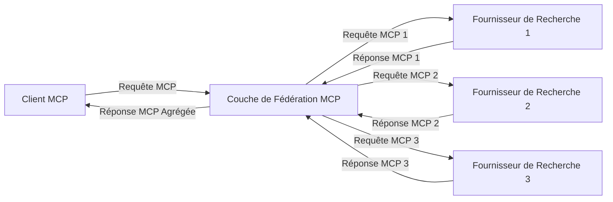
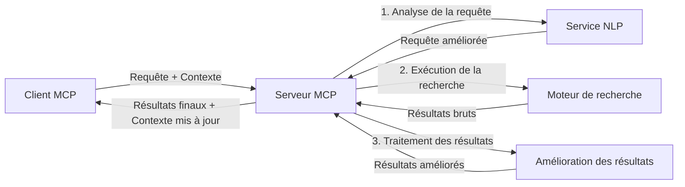

# Protocole de Contexte de Modèle pour la Recherche Web en Temps Réel

## Aperçu

La recherche web en temps réel est devenue essentielle dans l'environnement actuel axé sur l'information, où les applications ont besoin d'un accès immédiat à des informations à jour sur Internet afin de fournir des réponses pertinentes et opportunes. Le Protocole de Contexte de Modèle (MCP) représente une avancée importante dans l'optimisation de ces processus de recherche en temps réel, améliorant l'efficacité de la recherche, maintenant l'intégrité contextuelle et améliorant la performance globale du système.

Ce module explore comment le MCP transforme la recherche web en temps réel en fournissant une approche standardisée de la gestion du contexte entre les modèles d'IA, les moteurs de recherche et les applications.

### Ce que vous apprendrez

Dans ce guide complet, vous découvrirez :

- Comment le MCP crée un pont transparent entre les modèles d'IA et les capacités de recherche web en temps réel
- Les modèles architecturaux pour la mise en œuvre de solutions de recherche efficaces et évolutives avec le MCP
- Les techniques pour préserver le contexte de recherche à travers plusieurs requêtes et interactions
- Des implémentations pratiques en Python et JavaScript pour divers scénarios de recherche
- Les méthodes pour équilibrer pertinence, actualité et performance dans les systèmes de recherche propulsés par le MCP

## Introduction à la Recherche Web en Temps Réel

La recherche web en temps réel est une approche technologique qui permet l'interrogation continue, le traitement et l'analyse d'informations basées sur le web au fur et à mesure de leur publication ou mise à jour, permettant aux systèmes de fournir des informations fraîches et pertinentes avec une latence minimale. Contrairement aux systèmes de recherche traditionnels qui opèrent sur des données indexées pouvant dater de plusieurs heures ou jours, la recherche en temps réel traite des données vivantes du web, délivrant des informations et des aperçus qui reflètent l'état actuel du contenu en ligne.

### Concepts principaux de la Recherche Web en Temps Réel :

- **Traitement Continu des Requêtes** : Les requêtes de recherche sont traitées contre des sources de données constamment mises à jour
- **Priorisation de l'Actualité** : Les systèmes sont conçus pour privilégier les informations récentes
- **Équilibre de Pertinence** : Maintenir un équilibre entre pertinence et actualité
- **Architecture Évolutive** : Les systèmes doivent gérer des charges de requêtes et volumes de données variables
- **Compréhension Contextuelle** : Maintenir le contexte utilisateur à travers les itérations de recherche est crucial pour des résultats significatifs
- **Reformulation Dynamique des Requêtes** : Modification adaptative des requêtes basée sur le contexte et les résultats précédents
- **Intégration Multi-Sources** : Combinaison des résultats de plusieurs fournisseurs de recherche et sources web
- **Compréhension Sémantique** : Traitement des requêtes et du contenu basé sur le sens plutôt que sur des mots-clés seuls
- **Classement en Temps Réel** : Ajustement continu du classement des résultats à mesure que de nouvelles informations deviennent disponibles

### Le Protocole de Contexte de Modèle et la Recherche Web en Temps Réel

Le Protocole de Contexte de Modèle (MCP) répond à plusieurs défis critiques dans les environnements de recherche web en temps réel :

1. **Préservation du Contexte de Recherche** : Le MCP standardise la manière dont le contexte est maintenu à travers les composants de recherche distribués, garantissant que les modèles d'IA et les nœuds de traitement ont accès à l'historique pertinent des requêtes et aux préférences des utilisateurs.

2. **Gestion Efficace des Requêtes** : En fournissant des mécanismes structurés pour la transmission du contexte, le MCP réduit la surcharge liée à la répétition du contexte à chaque itération de recherche.

3. **Interopérabilité** : Le MCP crée un langage commun pour le partage de contexte entre différentes technologies de recherche et modèles d'IA, permettant des architectures plus flexibles et extensibles.

4. **Contexte Optimisé pour la Recherche** : Les implémentations du MCP peuvent prioriser quels éléments de contexte sont les plus pertinents pour une recherche efficace, optimisant à la fois la performance et la précision.

5. **Traitement de Recherche Adaptatif** : Avec une gestion appropriée du contexte via le MCP, les systèmes de recherche peuvent ajuster dynamiquement le traitement en fonction des besoins évolutifs des utilisateurs et des paysages informationnels.

Dans les applications modernes allant de l'agrégation de nouvelles aux assistants de recherche, l'intégration du MCP avec les technologies de recherche web permet une recherche plus intelligente et consciente du contexte, capable de fournir des résultats de plus en plus pertinents au fur et à mesure des interactions utilisateurs.

## Objectifs d'Apprentissage

À la fin de cette leçon, vous serez capable de :

- Comprendre les fondamentaux de la recherche web en temps réel et ses défis dans les applications modernes
- Expliquer comment le Protocole de Contexte de Modèle (MCP) améliore les capacités de recherche en temps réel
- Implémenter des solutions de recherche basées sur MCP en utilisant des frameworks et API populaires
- Concevoir et déployer des architectures de recherche évolutives et performantes avec MCP
- Appliquer les concepts du MCP à divers cas d'usage incluant la recherche sémantique, l'assistance à la recherche, et la navigation augmentée par IA
- Évaluer les tendances émergentes et les innovations futures dans les technologies de recherche basées sur MCP
- Développer des systèmes de recherche conscients du contexte qui apprennent des interactions utilisateurs
- Intégrer les capacités de recherche web dans les assistants IA en utilisant les protocoles MCP standardisés
- Créer des pipelines de recherche à plusieurs étapes qui affinent progressivement les résultats basés sur le contexte
- Optimiser la performance de recherche tout en maintenant une conscience contextuelle exhaustive

### Définition et Importance

La recherche web en temps réel implique l'interrogation, la récupération et la livraison continues d'informations basées sur le web avec une latence minimale. Contrairement aux moteurs de recherche traditionnels qui parcourent périodiquement et indexent le web, la recherche en temps réel vise à faire émerger les informations dès qu'elles deviennent disponibles, permettant un accès immédiat au contenu le plus récent.

Les caractéristiques clés de la recherche web en temps réel incluent :

- **Fraîcheur** : Priorisation du contenu et des mises à jour récentes
- **Traitement Continu** : Surveillance constante des nouvelles informations
- **Adaptation des Requêtes** : Affinement des requêtes de recherche basé sur le contexte et les retours
- **Livraison Immédiate** : Fourniture des résultats de recherche avec un délai minimal
- **Rétention du Contexte** : Construction sur les requêtes précédentes pour une pertinence améliorée

### Défis dans la Recherche Web Traditionnelle

Les approches traditionnelles de recherche web rencontrent plusieurs limitations lorsqu'elles sont appliquées à des scénarios en temps réel :

1. **Fragmentation du Contexte** : Difficulté à maintenir le contexte de recherche à travers plusieurs requêtes
2. **Fraîcheur de l'Information** : Défis d'accès et de priorisation des informations les plus récentes
3. **Complexité d'Intégration** : Problèmes d'interopérabilité entre systèmes de recherche et applications
4. **Problèmes de Latence** : Équilibrer la recherche exhaustive avec les exigences de temps de réponse
5. **Affinage de la Pertinence** : Garantir précision et pertinence tout en privilégiant la nouveauté

## Comprendre le Protocole de Contexte de Modèle (MCP) pour la Recherche

### Qu'est-ce que le MCP dans les Contextes de Recherche ?

Le Protocole de Contexte de Modèle (MCP) est un protocole de communication standardisé conçu pour faciliter l'interaction efficace entre les modèles d'IA et les applications. Dans le contexte de la recherche web en temps réel, le MCP fournit un cadre pour :

- Préserver le contexte de recherche tout au long des séquences de requêtes
- Standardiser les formats des requêtes et des résultats de recherche
- Optimiser la transmission des paramètres et résultats de recherche
- Améliorer la communication entre modèles et moteurs de recherche

### Composants Clés et Architecture

L'architecture MCP pour la recherche web en temps réel se compose de plusieurs composants clés :

1. **Gestionnaires de Contexte de Requête** : Gérer et maintenir le contexte de recherche sur plusieurs requêtes
2. **Processeurs de Recherche** : Traiter les requêtes de recherche entrantes en utilisant des techniques conscientes du contexte
3. **Adaptateurs de Protocole** : Convertir entre différentes API de recherche tout en préservant le contexte
4. **Magasin de Contexte** : Stocker et récupérer efficacement l'historique de recherche et les préférences
5. **Connecteurs de Recherche** : Se connecter à divers moteurs de recherche et API web


### Comment MCP Améliore la Recherche Web en Temps Réel

Le MCP répond aux défis traditionnels de la recherche web par :

- **Continuité Contextuelle** : Maintien des relations entre requêtes sur toute la session de recherche
- **Transmission Optimisée** : Réduction de la redondance des paramètres de recherche via une gestion intelligente du contexte
- **Interfaces Standardisées** : Fourniture d'API cohérentes pour les composants de recherche
- **Réduction de la Latence** : Minimisation de la surcharge de traitement grâce à une gestion efficace du contexte
- **Pertinence Améliorée** : Amélioration de la pertinence de la recherche en préservant l'intention utilisateur à travers plusieurs requêtes

## Intégration et Mise en Œuvre

Les systèmes de recherche web en temps réel nécessitent une conception architecturale et une mise en œuvre précises pour maintenir à la fois la performance et l'intégrité contextuelle. Le Protocole de Contexte de Modèle offre une approche standardisée pour intégrer les modèles d'IA et les technologies de recherche, permettant la création de pipelines de recherche plus sophistiqués et conscients du contexte.

### Aperçu de l'Intégration du MCP dans les Architectures de Recherche

Mettre en œuvre le MCP dans des environnements de recherche web en temps réel implique plusieurs considérations clés :

1. **Sérialisation du Contexte de Recherche** : Le MCP fournit des mécanismes efficaces pour encoder les informations contextuelles dans les requêtes de recherche, garantissant que le contexte essentiel accompagne la requête tout au long du pipeline de traitement. Cela inclut des formats de sérialisation standardisés optimisés pour les métadonnées liées à la recherche.

2. **Traitement de Recherche à État** : Le MCP permet un traitement intelligent avec maintien d'état en conservant une représentation cohérente du contexte à travers les itérations de recherche. Cela est particulièrement précieux dans les pipelines de recherche multi-étapes où le raffinement du contexte améliore les résultats.

3. **Expansion et Raffinement des Requêtes** : Les implémentations MCP dans les systèmes de recherche peuvent faciliter une expansion sophistiquée des requêtes et leur raffinement basé sur le contexte accumulé, permettant des résultats de plus en plus pertinents au fur et à mesure de l'évolution de la session de recherche.

4. **Mise en Cache et Priorisation des Résultats** : En standardisant la gestion du contexte, le MCP aide à gérer la mise en cache des résultats et leur priorisation, permettant aux composants de s'adapter en fonction de l'évolution du contexte de recherche.

5. **Fédération et Agrégation de Recherche** : Le MCP facilite une fédération plus sophistiquée de la recherche à travers plusieurs backends en fournissant des représentations structurées du contexte de recherche, permettant une agrégation plus significative des résultats issus de sources diverses.

La mise en œuvre du MCP à travers diverses technologies de recherche crée une approche unifiée de la gestion du contexte, réduisant le besoin de code d'intégration personnalisé tout en améliorant la capacité du système à maintenir un contexte significatif à mesure que les requêtes de recherche évoluent.

### MCP dans Diverses Implémentations de Recherche Web

Ces exemples suivent la spécification MCP actuelle qui se concentre sur un protocole JSON-RPC avec des mécanismes de transport distincts. Le code montre comment vous pouvez implémenter des intégrations de recherche personnalisées tout en maintenant une compatibilité totale avec le protocole MCP.


<details>
<summary>Implémentation Python avec API de Recherche Générique</summary>

```python
import asyncio
import json
import aiohttp
from typing import Dict, Any, Optional, List
from contextlib import asynccontextmanager
from collections.abc import AsyncIterator

# Importer les bibliothèques MCP standard
from mcp.client.session import ClientSession
from mcp.client.streamable_http import streamablehttp_client
from mcp.types import TextContent, CreateMessageRequestParams, CreateMessageResult
from mcp.server.fastmcp import FastMCP

# Créer un serveur FastMCP pour la recherche web
search_server = FastMCP("WebSearch")

# Classe pour gérer les opérations de recherche web
class WebSearchHandler:
    def __init__(self, api_endpoint: str, api_key: str):
        self.api_endpoint = api_endpoint
        self.api_key = api_key
        self.session = None
        
    async def initialize(self):
        """Initialize the HTTP session"""
        self.session = aiohttp.ClientSession(
            headers={"Authorization": f"Bearer {self.api_key}"}
        )
    
    async def close(self):
        """Close the HTTP session"""
        if self.session:
            await self.session.close()
            
    async def perform_search(self, query: str, max_results: int = 5, 
                           include_domains: List[str] = None, 
                           exclude_domains: List[str] = None,
                           time_period: str = "any") -> Dict[str, Any]:
        """Perform web search using the search API"""
        # Construire les paramètres de recherche
        search_params = {
            "q": query,
            "limit": max_results,
            "time": time_period
        }
        
        if include_domains:
            search_params["site"] = ",".join(include_domains)
            
        if exclude_domains:
            search_params["exclude_site"] = ",".join(exclude_domains)
        
        # Effectuer la requête de recherche
        try:
            async with self.session.get(
                self.api_endpoint,
                params=search_params
            ) as response:
                if response.status != 200:
                    error_text = await response.text()
                    raise Exception(f"Search API error: {response.status} - {error_text}")
                
                search_data = await response.json()
                
                # Transformer la réponse spécifique à l'API en un format standard
                results = []
                for item in search_data.get("results", []):
                    results.append({
                        "title": item.get("title", ""),
                        "url": item.get("url", ""),
                        "snippet": item.get("snippet", ""),
                        "date": item.get("published_date", ""),
                        "source": item.get("source", "")
                    })
                
                return {
                    "query": query,
                    "totalResults": len(results),
                    "results": results
                }
        except Exception as e:
            print(f"Search API request error: {e}")
            raise

# Initialiser le gestionnaire de recherche
search_handler = WebSearchHandler(
    api_endpoint="https://api.search-service.example/search",
    api_key="your-api-key-here"
)

# Configurer la durée de vie pour gérer le gestionnaire de recherche
@asyncio.asynccontextmanager
async def app_lifespan(server: FastMCP):
    """Manage application lifecycle"""
    await search_handler.initialize()
    try:
        yield {"search_handler": search_handler}
    finally:
        await search_handler.close()

# Définir la durée de vie pour le serveur
search_server = FastMCP("WebSearch", lifespan=app_lifespan)

# Enregistrer un outil de recherche web
@search_server.tool()
async def web_search(query: str, max_results: int = 5, 
                   include_domains: List[str] = None,
                   exclude_domains: List[str] = None,
                   time_period: str = "any") -> Dict[str, Any]:
    """
    Search the web for information
    
    Args:
        query: The search query
        max_results: Maximum number of results to return (default: 5)
        include_domains: List of domains to include in search results
        exclude_domains: List of domains to exclude from search results
        time_period: Time period for results ("day", "week", "month", "any")
        
    Returns:
        Dictionary containing search results
    """
    ctx = search_server.get_context()
    search_handler = ctx.request_context.lifespan_context["search_handler"]
    
    results = await search_handler.perform_search(
        query=query,
        max_results=max_results,
        include_domains=include_domains,
        exclude_domains=exclude_domains,
        time_period=time_period
    )
    
    return results

# Exemple d'utilisation client
async def client_example():
    # Se connecter au serveur de recherche en utilisant un transport HTTP Streamable
    async with streamablehttp_client("http://localhost:8000/mcp") as (read, write, _):
        async with ClientSession(read, write) as session:
            # Initialiser la connexion
            await session.initialize()
            
            # Appeler l'outil web_search
            search_results = await session.call_tool(
                "web_search", 
                {
                    "query": "latest developments in AI and Model Context Protocol",
                    "max_results": 5,
                    "time_period": "day",
                    "include_domains": ["github.com", "microsoft.com"]
                }
            )
            
            print(f"Search results: {search_results}")

# Exemple d'exécution du serveur
if __name__ == "__main__":
    # Exécuter le serveur avec un transport HTTP Streamable
    search_server.run(transport="streamable-http")
```
</details> 

<details>
<summary>Implémentation JavaScript avec Recherche Basée sur Navigateur</summary>


```javascript
// Implémentation du serveur MCP pour la recherche web
import { McpServer, ResourceTemplate } from '@modelcontextprotocol/sdk/server/mcp.js';
import { StreamableHTTPServerTransport } from '@modelcontextprotocol/sdk/server/streamableHttp.js';
import { z } from 'zod';

// Créer un serveur MCP pour la recherche web
const searchServer = new McpServer({
    name: "BrowserSearch",
    description: "A server that provides web search capabilities"
});

// Classe de service de recherche
class SearchService {
    constructor(searchApiUrl, apiKey) {
        this.searchApiUrl = searchApiUrl;
        this.apiKey = apiKey;
    }

    async performSearch(parameters) {
        const {
            query = '',
            maxResults = 5,
            includeDomains = [],
            excludeDomains = [],
            timePeriod = 'any'
        } = parameters;
        
        // Construire l'URL de recherche avec les paramètres
        const url = new URL(this.searchApiUrl);
        url.searchParams.append('q', query);
        url.searchParams.append('limit', maxResults);
        url.searchParams.append('time', timePeriod);
        
        if (includeDomains.length > 0) {
            url.searchParams.append('site', includeDomains.join(','));
        }
        
        if (excludeDomains.length > 0) {
            url.searchParams.append('exclude_site', excludeDomains.join(','));
        }
        
        try {
            const response = await fetch(url.toString(), {
                method: 'GET',
                headers: {
                    'Authorization': `Bearer ${this.apiKey}`,
                    'Content-Type': 'application/json'
                }
            });
            
            if (!response.ok) {
                const errorText = await response.text();
                throw new Error(`Search API error: ${response.status} - ${errorText}`);
            }
            
            const searchData = await response.json();
            
            // Transformer la réponse spécifique à l'API en un format standard
            const results = searchData.results?.map(item => ({
                title: item.title || '',
                url: item.url || '',
                snippet: item.snippet || '',
                date: item.published_date || '',
                source: item.source || ''
            })) || [];
            
            return {
                query,
                totalResults: results.length,
                results
            };
        } catch (error) {
            console.error('Search API request error:', error);
            throw error;
        }
    }
}

// Initialiser le service de recherche
const searchService = new SearchService(
    'https://api.search-service.example/search',
    'your-api-key-here'
);

// Configurer le fournisseur de contexte pour le serveur
searchServer.setContextProvider(() => {
    return {
        searchService
    };
});

// Enregistrer l'outil de recherche web
searchServer.tool({
    name: 'web_search',
    description: 'Search the web for information',
    parameters: {
        type: 'object',
        properties: {
            query: {
                type: 'string',
                description: 'The search query'
            },
            maxResults: {
                type: 'integer',
                description: 'Maximum number of results to return',
                default: 5
            },
            includeDomains: {
                type: 'array',
                items: { type: 'string' },
                description: 'List of domains to include in search results'
            },
            excludeDomains: {
                type: 'array',
                items: { type: 'string' },
                description: 'List of domains to exclude from search results'
            },
            timePeriod: {
                type: 'string',
                description: 'Time period for results',
                enum: ['day', 'week', 'month', 'any'],
                default: 'any'
            }
        },
        required: ['query']
    },
    handler: async (params, context) => {
        const { searchService } = context;
        return await searchService.performSearch(params);
    }
});

// Exemple de code client pour se connecter au serveur de recherche
import { Client } from '@modelcontextprotocol/sdk/client/index.js';
import { StreamableHTTPClientTransport } from '@modelcontextprotocol/sdk/client/streamableHttp.js';

async function connectToSearchServer() {
    // Se connecter au serveur de recherche
    const transport = new StreamableHTTPClientTransport(
        new URL('http://localhost:8000/mcp')
    );
    
    const client = new Client({
        name: 'search-client',
        version: '1.0.0'
    });
    
    await client.connect(transport);
    
    // Exécuter l'outil de recherche
    const searchResults = await client.callTool({
        name: 'web_search',
        arguments: {
            query: 'Model Context Protocol implementation examples',
            maxResults: 10,
            timePeriod: 'week',
            includeDomains: ['github.com', 'docs.microsoft.com']
        }
    });
    
    console.log('Search results:', searchResults);
    
    // Nettoyage
    await client.disconnect();
}

// Démarrer le serveur
const transport = new StreamableHTTPServerTransport();
await searchServer.connect(transport);
console.log('Search server running at http://localhost:8000/mcp');

// Dans un processus séparé ou après le démarrage du serveur
// connectToSearchServer().catch(console.error);
```
</details> 


## Avertissement concernant les Exemples de Code

> **Note Importante** : Les exemples de code ci-dessous démontrent l'intégration du Protocole de Contexte de Modèle (MCP) avec les fonctionnalités de recherche web. Bien qu'ils suivent les modèles et structures des SDK officiels MCP, ils ont été simplifiés à des fins pédagogiques.
> 
> Ces exemples illustrent :
> 
> 1. **Implémentation Python** : Une implémentation serveur FastMCP qui fournit un outil de recherche web et se connecte à une API de recherche externe. Cet exemple démontre une gestion appropriée du cycle de vie, la gestion du contexte, et l'implémentation d'outils suivant les modèles du [SDK Python officiel MCP](https://github.com/modelcontextprotocol/python-sdk). Le serveur utilise le transport HTTP Streamable recommandé qui a supplanté l'ancien transport SSE pour les déploiements en production.
> 
> 2. **Implémentation JavaScript** : Une implémentation TypeScript/JavaScript utilisant le modèle FastMCP du [SDK TypeScript officiel MCP](https://github.com/modelcontextprotocol/typescript-sdk) pour créer un serveur de recherche avec des définitions d'outils appropriées et des connexions clients. Il suit les derniers modèles recommandés pour la gestion de session et la préservation du contexte.
> 
> Ces exemples nécessiteraient une gestion supplémentaire des erreurs, une authentification et un code d'intégration spécifique à l'API pour une utilisation en production. Les points d'accès API de recherche montrés (`https://api.search-service.example/search`) sont des espaces réservés devant être remplacés par de véritables points d'accès aux services de recherche.
> 
> Pour les détails d'implémentation complets et les approches les plus récentes,
> référez-vous à la [spécification officielle MCP](https://modelcontextprotocol.io/specification/2026-07-28/)
> et à la documentation du SDK.

## Concepts Clés

### Le Cadre du Protocole de Contexte de Modèle (MCP)

À sa base, le Protocole de Contexte de Modèle fournit un moyen standardisé pour les modèles d'IA, les applications et les services d'échanger du contexte. En recherche web en temps réel, ce cadre est essentiel pour créer des expériences de recherche cohérentes à plusieurs tours. Les composants clés incluent :

1. **Architecture Client-serveur** : Le MCP établit une séparation claire entre les clients de recherche (demandeurs) et les serveurs de recherche (prestataires), permettant des modèles de déploiement flexibles.

2. **Communication JSON-RPC** : Le protocole utilise JSON-RPC pour l'échange de messages, ce qui le rend compatible avec les technologies web et facile à implémenter sur différentes plateformes.

3. **Gestion du Contexte** : Le MCP définit des méthodes structurées pour maintenir, mettre à jour et exploiter le contexte de recherche à travers plusieurs interactions.

4. **Définitions d'Outils** : Les capacités de recherche sont exposées sous forme d'outils standardisés avec des paramètres et valeurs de retour bien définis.

5. **Support de Streaming** : Le protocole prend en charge le streaming des résultats, essentiel pour la recherche en temps réel où les résultats peuvent arriver progressivement.

### Modèles d'Intégration de la Recherche Web

Lors de l'intégration du MCP avec la recherche web, plusieurs modèles émergent :

#### 1. Intégration Directe avec le Fournisseur de Recherche


Dans ce modèle, le serveur MCP interagit directement avec une ou plusieurs API de recherche, traduisant les requêtes MCP en appels spécifiques à l'API et formatant les résultats en réponses MCP.

#### 2. Recherche Fédérée avec Préservation du Contexte



Ce modèle distribue les requêtes de recherche sur plusieurs fournisseurs compatibles MCP, chacun pouvant se spécialiser dans différents types de contenu ou capacités de recherche, tout en maintenant un contexte unifié.

#### 3. Chaîne de Recherche Améliorée par le Contexte



Dans ce modèle, le processus de recherche est divisé en plusieurs étapes, le contexte étant enrichi à chaque étape, ce qui aboutit à des résultats de plus en plus pertinents.

### Composants du Contexte de Recherche

Dans la recherche web basée sur MCP, le contexte inclut généralement :

- **Historique des Requêtes** : Les requêtes de recherche précédentes au cours de la session
- **Préférences Utilisateur** : Langue, région, paramètres de recherche sécurisée
- **Historique des Interactions** : Quels résultats ont été cliqués, temps passé sur les résultats
- **Paramètres de Recherche** : Filtres, ordres de tri et autres modificateurs de recherche
- **Connaissance du Domaine** : Contexte spécifique au sujet pertinent pour la recherche
- **Contexte Temporel** : Facteurs de pertinence basés sur le temps
- **Préférences de Source** : Sources d'information fiables ou préférées

## Cas d'Usage et Applications

### Recherche et Collecte d'Informations

Le MCP améliore les flux de travail de recherche en :

- Préservant le contexte de recherche à travers les sessions
- Permettant des requêtes plus sophistiquées et contextuellement pertinentes
- Supportant la fédération de recherche multi-source
- Facilitant l'extraction de connaissances à partir des résultats de recherche

### Surveillance en Temps Réel des Nouvelles et Tendances

La recherche propulsée par MCP offre des avantages pour la surveillance des actualités :

- Découverte quasi instantanée des actualités émergentes
- Filtrage contextuel des informations pertinentes
- Suivi des sujets et entités à travers plusieurs sources
- Alertes personnalisées basées sur le contexte utilisateur

### Navigation et Recherche Augmentées par l'IA

Le MCP crée de nouvelles possibilités pour la navigation augmentée par IA :

- Suggestions de recherche contextuelles basées sur l'activité actuelle du navigateur
- Intégration transparente de la recherche web avec des assistants alimentés par LLM
- Raffinement multi-tours des recherches avec maintien du contexte
- Vérification des faits améliorée et validation de l'information

## Tendances et Innovations Futures

### Évolution du MCP dans la Recherche Web

En regardant vers l'avenir, nous anticipons que le MCP évoluera pour adresser :


- **Recherche Multimodale** : Intégration de la recherche texte, image, audio et vidéo avec contexte préservé  
- **Recherche Décentralisée** : Prise en charge des écosystèmes de recherche distribuée et fédérée  
- **Confidentialité de la Recherche** : Mécanismes de recherche respectueux de la vie privée et sensibles au contexte  
- **Compréhension des Requêtes** : Analyse sémantique approfondie des requêtes de recherche en langage naturel  

### Progrès Technologiques Potentiels  

Technologies émergentes qui façonneront l'avenir de la recherche MCP :  

1. **Architectures de Recherche Neurale** : Systèmes de recherche basés sur des embeddings optimisés pour MCP  
2. **Contexte de Recherche Personnalisé** : Apprentissage des modèles de recherche individuels des utilisateurs au fil du temps  
3. **Intégration de Graphes de Connaissances** : Recherche contextuelle enrichie par des graphes de connaissances spécifiques au domaine  
4. **Contexte Cross-Modal** : Maintien du contexte à travers différentes modalités de recherche  

## Exercices Pratiques  

### Exercice 1 : Mise en place d’un pipeline de recherche MCP basique  

Dans cet exercice, vous apprendrez à :  
- Configurer un environnement de recherche MCP basique  
- Implémenter des gestionnaires de contexte pour la recherche web  
- Tester et valider la préservation du contexte à travers les itérations de recherche  

### Exercice 2 : Construire un assistant de recherche avec MCP  

Créez une application complète qui :  
- Traite des questions de recherche en langage naturel  
- Effectue des recherches web sensibles au contexte  
- Synthétise des informations provenant de sources multiples  
- Présente les résultats de recherche de façon organisée  

### Exercice 3 : Implémenter une fédération de recherche multi-source avec MCP  

Exercice avancé couvrant :  
- Envoi de requêtes sensibles au contexte vers plusieurs moteurs de recherche  
- Classement et agrégation des résultats  
- Déduplication contextuelle des résultats de recherche  
- Gestion des métadonnées spécifiques aux sources  

## Ressources Supplémentaires  

- [Spécification du protocole Model Context](https://modelcontextprotocol.io/specification/2026-07-28/) - Spécification officielle de MCP et documentation détaillée du protocole  
- [Documentation du protocole Model Context](https://modelcontextprotocol.io/) - Tutoriels détaillés et guides d’implémentation  
- [SDK Python MCP](https://github.com/modelcontextprotocol/python-sdk) - Implémentation officielle du protocole MCP en Python  
- [SDK TypeScript MCP](https://github.com/modelcontextprotocol/typescript-sdk) - Implémentation officielle du protocole MCP en TypeScript  
- [Serveurs de référence MCP](https://github.com/modelcontextprotocol/servers) - Implémentations de référence des serveurs MCP  
- [Documentation API Bing Web Search](https://learn.microsoft.com/en-us/bing/search-apis/bing-web-search/overview) - API de recherche web de Microsoft  
- [API JSON Google Custom Search](https://developers.google.com/custom-search/v1/overview) - Moteur de recherche programmable de Google  
- [Documentation SerpAPI](https://serpapi.com/search-api) - API des pages de résultats des moteurs de recherche  
- [Documentation Meilisearch](https://www.meilisearch.com/docs) - Moteur de recherche open-source  
- [Documentation Elasticsearch](https://www.elastic.co/guide/index.html) - Moteur de recherche et d’analyse distribué  
- [Documentation LangChain](https://python.langchain.com/docs/get_started/introduction) - Construction d’applications avec des LLM  

## Résultats d’Apprentissage  

En complétant ce module, vous serez capable de :  

- Comprendre les fondamentaux de la recherche web en temps réel et ses défis  
- Expliquer comment le protocole Model Context (MCP) améliore les capacités de recherche web en temps réel  
- Implémenter des solutions de recherche basées sur MCP utilisant des frameworks et API populaires  
- Concevoir et déployer des architectures de recherche évolutives et performantes avec MCP  
- Appliquer les concepts MCP à divers cas d’usage incluant la recherche sémantique, l’assistance à la recherche et la navigation augmentée par IA  
- Évaluer les tendances émergentes et les innovations futures dans les technologies de recherche basées sur MCP  


### Considérations de Confiance et de Sécurité  

Lors de l’implémentation de solutions de recherche web basées sur MCP, gardez à l’esprit ces principes importants issus de la spécification MCP :  

1. **Consentement et Contrôle Utilisateur** : Les utilisateurs doivent consentir explicitement et comprendre toutes les opérations et accès aux données. Ceci est particulièrement important pour les implémentations de recherche web pouvant accéder à des sources externes.  

2. **Confidentialité des Données** : Assurez une gestion appropriée des requêtes de recherche et des résultats, surtout lorsqu’ils peuvent contenir des informations sensibles. Mettez en place des contrôles d’accès adaptés pour protéger les données utilisateur.  

3. **Sécurité des Outils** : Implémentez une autorisation et une validation appropriées pour les outils de recherche, car ils représentent des risques potentiels de sécurité via l’exécution arbitraire de code. Les descriptions du comportement des outils doivent être considérées comme non fiables sauf si elles proviennent d’un serveur de confiance.  

4. **Documentation Claire** : Fournissez une documentation claire sur les capacités, limites et considérations de sécurité de votre implémentation MCP, suivant les lignes directrices de la spécification MCP.  

5. **Flux de Consentement Robustes** : Construisez des flux de consentement et d’autorisation robustes expliquant clairement ce que chaque outil fait avant d’autoriser son utilisation, particulièrement pour les outils interagissant avec des ressources web externes.  

Pour les détails complets concernant la sécurité et la confiance dans MCP, référez-vous à la  
[documentation officielle](https://modelcontextprotocol.io/specification/2026-07-28/basic/security_best_practices).  

## Et ensuite  

- [5.12 Authentification Entra ID pour les serveurs Model Context Protocol](../mcp-security-entra/README.md)  

---

<!-- CO-OP TRANSLATOR DISCLAIMER START -->
**Avertissement** :
Ce document a été traduit à l'aide du service de traduction automatique [Co-op Translator](https://github.com/Azure/co-op-translator). Bien que nous nous efforçions d'assurer l'exactitude, veuillez noter que les traductions automatisées peuvent contenir des erreurs ou des inexactitudes. Le document original dans sa langue native doit être considéré comme la source faisant autorité. Pour les informations critiques, il est recommandé de recourir à une traduction professionnelle réalisée par un humain. Nous ne saurions être tenus responsables des malentendus ou erreurs d'interprétation découlant de l'utilisation de cette traduction.
<!-- CO-OP TRANSLATOR DISCLAIMER END -->