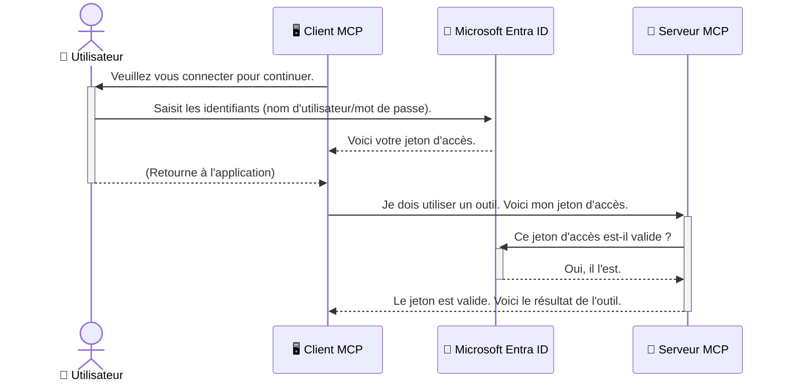

# Sécurisation des flux de travail IA : Authentification Entra ID pour les serveurs du protocole Model Context  

> [!NOTE]  
> Le code du serveur distant dans cette leçon protège les points de terminaison hérités `/sse` et `/message`  
> et cible MCP `2025-11-25`. Conservez ses pratiques d'identité et de validation de jeton, mais utilisez un transport HTTP Streamable compatible `2026-07-28` pour les nouvelles  
> implémentations.  
 

## Introduction  
La sécurisation de votre serveur Model Context Protocol (MCP) est aussi importante que de fermer à clé la porte d’entrée de votre maison. Laisser votre serveur MCP ouvert expose vos outils et données à des accès non autorisés, ce qui peut entraîner des violations de sécurité. Microsoft Entra ID fournit une solution robuste de gestion des identités et des accès basée sur le cloud, aidant à garantir que seuls les utilisateurs et applications autorisés peuvent interagir avec votre serveur MCP. Dans cette section, vous apprendrez comment protéger vos flux de travail IA en utilisant l'authentification Entra ID.  

## Objectifs d’apprentissage  
À la fin de cette section, vous serez en mesure de :  

- Comprendre l’importance de sécuriser les serveurs MCP.  
- Expliquer les bases de Microsoft Entra ID et de l’authentification OAuth 2.0.  
- Reconnaître la différence entre clients publics et clients confidentiels.  
- Implémenter l’authentification Entra ID dans des scénarios MCP serveur locaux (client public) et distants (client confidentiel).  
- Appliquer les bonnes pratiques de sécurité lors du développement de flux de travail IA.  

## Sécurité et MCP  

De la même manière que vous ne laisseriez pas la porte d’entrée de votre maison déverrouillée, vous ne devriez pas laisser votre serveur MCP accessible à tous. Sécuriser vos flux de travail IA est essentiel pour créer des applications robustes, fiables et sûres. Ce chapitre vous initiera à l’utilisation de Microsoft Entra ID pour sécuriser vos serveurs MCP, assurant que seuls les utilisateurs et applications autorisés peuvent accéder à vos outils et données.  

## Pourquoi la sécurité est importante pour les serveurs MCP  

Imaginez que votre serveur MCP ait un outil capable d’envoyer des e-mails ou d’accéder à une base de données clients. Un serveur non sécurisé signifierait que n’importe qui pourrait potentiellement utiliser cet outil, ce qui entraînerait des accès non autorisés aux données, du spam ou d’autres activités malveillantes.  

En mettant en œuvre l’authentification, vous vous assurez que chaque requête adressée à votre serveur est vérifiée, confirmant l’identité de l’utilisateur ou de l’application qui fait la requête. C’est la première étape et la plus critique pour sécuriser vos flux de travail IA.  

## Introduction à Microsoft Entra ID  

[**Microsoft Entra ID**](https://adoption.microsoft.com/microsoft-security/entra/) est un service cloud de gestion des identités et des accès. Considérez-le comme un agent de sécurité universel pour vos applications. Il gère le processus complexe de vérification des identités utilisateur (authentification) et de détermination de ce qu'ils sont autorisés à faire (autorisation).  

En utilisant Entra ID, vous pouvez :  

- Permettre une connexion sécurisée des utilisateurs.  
- Protéger les API et les services.  
- Gérer les politiques d’accès depuis un emplacement central.  

Pour les serveurs MCP, Entra ID fournit une solution robuste et largement reconnue pour gérer qui peut accéder aux fonctionnalités de votre serveur.  

---  

## Comprendre la magie : comment fonctionne l’authentification Entra ID  

Entra ID utilise des standards ouverts tels que **OAuth 2.0** pour gérer l’authentification. Même si les détails peuvent être complexes, le concept de base est simple et peut être compris par analogie.  

### Une introduction simple à OAuth 2.0 : la clé de voiturier  

Pensez à OAuth 2.0 comme à un service de voiturier pour votre voiture. Lorsque vous arrivez dans un restaurant, vous ne donnez pas votre clé principale au voiturier. Vous lui donnez une **clé de voiturier** qui a des permissions limitées—it peut démarrer la voiture et verrouiller les portes, mais ne peut pas ouvrir le coffre ou la boîte à gants.  

Dans cette analogie :  

- **Vous** êtes l’**Utilisateur**.  
- **Votre voiture** est le **Serveur MCP** avec ses outils et données précieux.  
- Le **Voiturier** est **Microsoft Entra ID**.  
- L’**Agent de stationnement** est le **Client MCP** (l’application qui essaie d’accéder au serveur).  
- La **clé de voiturier** est le **Jeton d’accès**.  

Le jeton d’accès est une chaîne sécurisée que le client MCP reçoit d’Entra ID après votre connexion. Le client présente ensuite ce jeton au serveur MCP à chaque requête. Le serveur peut vérifier le jeton pour s’assurer que la requête est légitime et que le client dispose des autorisations nécessaires, sans jamais avoir besoin de gérer vos véritables identifiants (comme votre mot de passe).  

### Le flux d’authentification  

Voici comment le processus fonctionne en pratique :  


  
### Présentation de la bibliothèque Microsoft Authentication (MSAL)  

Avant d’entrer dans le code, il est important de présenter un composant clé que vous verrez dans les exemples : la **bibliothèque Microsoft Authentication (MSAL)**.  

MSAL est une bibliothèque développée par Microsoft qui simplifie grandement la gestion de l’authentification pour les développeurs. Au lieu d’écrire tout le code complexe pour gérer les jetons de sécurité, la connexion des utilisateurs et le rafraîchissement des sessions, MSAL s’occupe de tout cela.  

Utiliser une bibliothèque comme MSAL est fortement recommandé car :  

- **C’est sécurisé :** Elle implémente des protocoles standards de l’industrie et des bonnes pratiques de sécurité, réduisant ainsi les risques de vulnérabilités dans votre code.  
- **Ça simplifie le développement :** Elle cache la complexité des protocoles OAuth 2.0 et OpenID Connect, vous permettant d’ajouter une authentification robuste à votre application en quelques lignes de code.  
- **Elle est maintenue :** Microsoft maintient activement et met à jour MSAL pour répondre aux nouvelles menaces de sécurité et aux changements de plateforme.  

MSAL prend en charge un large éventail de langages et de cadres applicatifs, notamment .NET, JavaScript/TypeScript, Python, Java, Go, ainsi que les plateformes mobiles telles qu’iOS et Android. Cela signifie que vous pouvez utiliser les mêmes modèles d’authentification cohérents sur l’ensemble de votre stack technologique.  

Pour en savoir plus sur MSAL, vous pouvez consulter la [documentation officielle de présentation MSAL](https://learn.microsoft.com/entra/identity-platform/msal-overview).  

---  

## Sécuriser votre serveur MCP avec Entra ID : guide étape par étape  

Passons maintenant à la sécurisation d’un serveur MCP local (qui communique via `stdio`) en utilisant Entra ID. Cet exemple utilise un **client public**, adapté aux applications qui tournent sur la machine de l’utilisateur, comme une application de bureau ou un serveur de développement local.  

### Scénario 1 : sécuriser un serveur MCP local (avec un client public)  

Dans ce scénario, nous allons examiner un serveur MCP qui fonctionne localement, communique via `stdio` et utilise Entra ID pour authentifier l’utilisateur avant d’autoriser l’accès à ses outils. Le serveur aura un outil unique qui récupère les informations de profil utilisateur à partir de l’API Microsoft Graph.  

#### 1. Configuration de l’application dans Entra ID  

Avant d’écrire du code, vous devez enregistrer votre application dans Microsoft Entra ID. Cela permet à Entra ID de connaître votre application et de lui accorder la permission d’utiliser le service d’authentification.  

1. Rendez-vous sur le **[portail Microsoft Entra](https://entra.microsoft.com/)**.  
2. Allez dans **App registrations** (Enregistrements d’applications) et cliquez sur **New registration** (Nouvel enregistrement).  
3. Donnez un nom à votre application (par ex., « Mon serveur MCP local »).  
4. Pour les **Types de comptes pris en charge**, choisissez **Comptes dans ce répertoire organisationnel uniquement**.  
5. Vous pouvez laisser l’**URI de redirection** vide pour cet exemple.  
6. Cliquez sur **Register** (Enregistrer).  

Une fois enregistré, notez l’**ID de l’application (client)** et l’**ID du répertoire (locataire)**. Vous en aurez besoin dans votre code.  

#### 2. Le code : une explication  

Regardons les parties clés du code qui gèrent l’authentification. Le code complet de cet exemple est disponible dans le dossier [Entra ID - Local - WAM](https://github.com/Azure-Samples/mcp-auth-servers/tree/main/src/entra-id-local-wam) du [répertoire GitHub mcp-auth-servers](https://github.com/Azure-Samples/mcp-auth-servers).  

**`AuthenticationService.cs`**  

Cette classe est responsable de gérer l’interaction avec Entra ID.  

- **`CreateAsync`** : Cette méthode initialise le `PublicClientApplication` de MSAL (bibliothèque Microsoft Authentication). Il est configuré avec le `clientId` et le `tenantId` de votre application.  
- **`WithBroker`** : Cela active l’utilisation d’un courtier (comme le Windows Web Account Manager), qui offre une expérience de connexion unique plus sécurisée et fluide.  
- **`AcquireTokenAsync`** : C’est la méthode principale. Elle essaie d’abord d’obtenir un jeton de manière silencieuse (sans que l’utilisateur ait à se reconnecter s’il a déjà une session valide). Si un jeton silencieux ne peut pas être obtenu, elle invite l’utilisateur à se connecter de façon interactive.  

```csharp
// Simplified for clarity
public static async Task<AuthenticationService> CreateAsync(ILogger<AuthenticationService> logger)
{
    var msalClient = PublicClientApplicationBuilder
        .Create(_clientId) // Your Application (client) ID
        .WithAuthority(AadAuthorityAudience.AzureAdMyOrg)
        .WithTenantId(_tenantId) // Your Directory (tenant) ID
        .WithBroker(new BrokerOptions(BrokerOptions.OperatingSystems.Windows))
        .Build();

    // ... cache registration ...

    return new AuthenticationService(logger, msalClient);
}

public async Task<string> AcquireTokenAsync()
{
    try
    {
        // Try silent authentication first
        var accounts = await _msalClient.GetAccountsAsync();
        var account = accounts.FirstOrDefault();

        AuthenticationResult? result = null;

        if (account != null)
        {
            result = await _msalClient.AcquireTokenSilent(_scopes, account).ExecuteAsync();
        }
        else
        {
            // If no account, or silent fails, go interactive
            result = await _msalClient.AcquireTokenInteractive(_scopes).ExecuteAsync();
        }

        return result.AccessToken;
    }
    catch (Exception ex)
    {
        _logger.LogError(ex, "An error occurred while acquiring the token.");
        throw; // Optionally rethrow the exception for higher-level handling
    }
}
```
  
**`Program.cs`**  

C’est ici que le serveur MCP est configuré et que le service d’authentification est intégré.  

- **`AddSingleton<AuthenticationService>`** : Cela enregistre le service `AuthenticationService` dans le conteneur d’injection de dépendances, pour qu’il soit utilisé par d’autres parties de l’application (comme notre outil).  
- **Outil `GetUserDetailsFromGraph`** : Cet outil nécessite une instance de `AuthenticationService`. Avant toute action, il appelle `authService.AcquireTokenAsync()` pour obtenir un jeton d’accès valide. Si l’authentification réussit, il utilise le jeton pour appeler l’API Microsoft Graph et récupérer les détails de l’utilisateur.  

```csharp
// Simplified for clarity
[McpServerTool(Name = "GetUserDetailsFromGraph")]
public static async Task<string> GetUserDetailsFromGraph(
    AuthenticationService authService)
{
    try
    {
        // This will trigger the authentication flow
        var accessToken = await authService.AcquireTokenAsync();

        // Use the token to create a GraphServiceClient
        var graphClient = new GraphServiceClient(
            new BaseBearerTokenAuthenticationProvider(new TokenProvider(authService)));

        var user = await graphClient.Me.GetAsync();

        return System.Text.Json.JsonSerializer.Serialize(user);
    }
    catch (Exception ex)
    {
        return $"Error: {ex.Message}";
    }
}
```
  
#### 3. Comment tout cela fonctionne ensemble  

1. Quand le client MCP tente d’utiliser l’outil `GetUserDetailsFromGraph`, cet outil appelle d’abord `AcquireTokenAsync`.  
2. `AcquireTokenAsync` déclenche MSAL pour vérifier la présence d’un jeton valide.  
3. S’il n’y a pas de jeton, MSAL, via le courtier, invite l’utilisateur à se connecter avec son compte Entra ID.  
4. Une fois connecté, Entra ID délivre un jeton d’accès.  
5. L’outil reçoit ce jeton et l’utilise pour effectuer un appel sécurisé à l’API Microsoft Graph.  
6. Les informations utilisateur sont retournées au client MCP.  

Ce processus garantit que seuls les utilisateurs authentifiés peuvent utiliser l’outil, sécurisant efficacement votre serveur MCP local.  

### Scénario 2 : sécuriser un serveur MCP distant (avec un client confidentiel)  

Lorsque votre serveur MCP fonctionne sur une machine distante (comme un serveur cloud) et communique via un protocole tel que HTTP Streaming, les exigences de sécurité sont différentes. Dans ce cas, vous devez utiliser un **client confidentiel** et le **flux d’autorisation par code**. C’est une méthode plus sécurisée car les secrets de l’application ne sont jamais exposés au navigateur.  

Cet exemple utilise un serveur MCP basé sur TypeScript qui utilise Express.js pour gérer les requêtes HTTP.  

#### 1. Configuration de l’application dans Entra ID  

La configuration dans Entra ID est similaire au client public, mais avec une différence clé : vous devez créer un **secret client**.  

1. Rendez-vous sur le **[portail Microsoft Entra](https://entra.microsoft.com/)**.  
2. Dans l’enregistrement de votre application, allez dans l’onglet **Certificats & secrets**.  
3. Cliquez sur **Nouveau secret client**, donnez-lui une description, puis cliquez sur **Ajouter**.  
4. **Important :** Copiez immédiatement la valeur du secret. Vous ne pourrez plus la voir par la suite.  
5. Vous devez aussi configurer une **URI de redirection**. Allez dans l’onglet **Authentification**, cliquez sur **Ajouter une plateforme**, sélectionnez **Web**, et saisissez l’URI de redirection pour votre application (ex., `http://localhost:3001/auth/callback`).  

> **⚠️ Note importante sur la sécurité :** Pour les applications en production, Microsoft recommande fortement d’utiliser des méthodes d’**authentification sans secret** telles que **Identité gérée (Managed Identity)** ou **Fédération d’identité pour les charges de travail (Workload Identity Federation)** au lieu des secrets client. Les secrets client présentent des risques de sécurité car ils peuvent être exposés ou compromis. Les identités gérées offrent une approche plus sécurisée en éliminant la nécessité de stocker des identifiants dans votre code ou configuration.  
>  
> Pour plus d’informations sur les identités gérées et comment les implémenter, consultez la [vue d’ensemble des identités gérées pour les ressources Azure](https://learn.microsoft.com/entra/identity/managed-identities-azure-resources/overview).  

#### 2. Le code : une explication  

Cet exemple utilise une approche basée sur les sessions. Lorsque l’utilisateur s’authentifie, le serveur stocke le jeton d’accès et le jeton de rafraîchissement dans une session et fournit à l’utilisateur un jeton de session. Ce jeton de session est ensuite utilisé pour les requêtes suivantes. Le code complet de cet exemple est disponible dans le dossier [Entra ID - client confidentiel](https://github.com/Azure-Samples/mcp-auth-servers/tree/main/src/entra-id-cca-session) du [répertoire GitHub mcp-auth-servers](https://github.com/Azure-Samples/mcp-auth-servers).  

**`Server.ts`**  

Ce fichier configure le serveur Express et la couche de transport MCP.  

- **`requireBearerAuth`** : Il s’agit d’un middleware qui protège les points de terminaison `/sse` et `/message`. Il vérifie la présence d’un jeton porteur valide dans l’en-tête `Authorization` de la requête.  
- **`EntraIdServerAuthProvider`** : C’est une classe personnalisée qui implémente l’interface `McpServerAuthorizationProvider`. Elle gère le flux OAuth 2.0.  
- **`/auth/callback`** : Ce point de terminaison traite la redirection d’Entra ID après que l’utilisateur s’est authentifié. Il échange le code d’autorisation contre un jeton d’accès et un jeton de rafraîchissement.  

```typescript
// Simplifié pour plus de clarté
const app = express();
const { server } = createServer();
const provider = new EntraIdServerAuthProvider();

// Protéger le point de terminaison SSE
app.get("/sse", requireBearerAuth({
  provider,
  requiredScopes: ["User.Read"]
}), async (req, res) => {
  // ... se connecter au transport ...
});

// Protéger le point de terminaison du message
app.post("/message", requireBearerAuth({
  provider,
  requiredScopes: ["User.Read"]
}), async (req, res) => {
  // ... gérer le message ...
});

// Gérer le rappel OAuth 2.0
app.get("/auth/callback", (req, res) => {
  provider.handleCallback(req.query.code, req.query.state)
    .then(result => {
      // ... gérer le succès ou l’échec ...
    });
});
```
  
**`Tools.ts`**  

Ce fichier définit les outils fournis par le serveur MCP. L’outil `getUserDetails` est similaire à celui de l’exemple précédent, mais il obtient le jeton d’accès depuis la session.  

```typescript
// Simplifié pour plus de clarté
server.setRequestHandler(CallToolRequestSchema, async (request) => {
  const { name } = request.params;
  const context = request.params?.context as { token?: string } | undefined;
  const sessionToken = context?.token;

  if (name === ToolName.GET_USER_DETAILS) {
    if (!sessionToken) {
      throw new AuthenticationError("Authentication token is missing or invalid. Ensure the token is provided in the request context.");
    }

    // Récupérer le jeton Entra ID depuis le magasin de session
    const tokenData = tokenStore.getToken(sessionToken);
    const entraIdToken = tokenData.accessToken;

    const graphClient = Client.init({
      authProvider: (done) => {
        done(null, entraIdToken);
      }
    });

    const user = await graphClient.api('/me').get();

    // ... retourner les détails de l'utilisateur ...
  }
});
```
  
**`auth/EntraIdServerAuthProvider.ts`**  

Cette classe gère la logique de :  

- Rediriger l’utilisateur vers la page de connexion Entra ID.  
- Échanger le code d’autorisation contre un jeton d’accès.  
- Stocker les jetons dans le `tokenStore`.  
- Rafraîchir le jeton d’accès à son expiration.  


#### 3. Comment tout cela fonctionne ensemble

1. Lorsqu'un utilisateur tente pour la première fois de se connecter au serveur MCP, le middleware `requireBearerAuth` verra qu'il n'a pas de session valide et le redirigera vers la page de connexion Entra ID.
2. L'utilisateur se connecte avec son compte Entra ID.
3. Entra ID redirige l'utilisateur vers le point de terminaison `/auth/callback` avec un code d'autorisation.
4. Le serveur échange le code contre un jeton d'accès et un jeton de rafraîchissement, les stocke, et crée un jeton de session qui est envoyé au client.
5. Le client peut désormais utiliser ce jeton de session dans l'en-tête `Authorization` pour toutes les requêtes futures vers le serveur MCP.
6. Lorsque l'outil `getUserDetails` est appelé, il utilise le jeton de session pour rechercher le jeton d'accès Entra ID, puis utilise celui-ci pour appeler l'API Microsoft Graph.

Ce flux est plus complexe que le flux client public, mais est nécessaire pour les points de terminaison accessibles depuis internet. Étant donné que les serveurs MCP distants sont accessibles via le réseau internet public, ils nécessitent des mesures de sécurité renforcées pour se protéger contre les accès non autorisés et les attaques potentielles.


## Meilleures pratiques de sécurité

- **Toujours utiliser HTTPS** : Chiffrez les communications entre le client et le serveur pour protéger les jetons contre l'interception.
- **Mettre en œuvre un contrôle d'accès basé sur les rôles (RBAC)** : Ne vous contentez pas de vérifier *si* un utilisateur est authentifié ; vérifiez *ce* qu'il est autorisé à faire. Vous pouvez définir des rôles dans Entra ID et les vérifier dans votre serveur MCP.
- **Surveiller et auditer** : Enregistrez tous les événements d'authentification afin de pouvoir détecter et répondre à toute activité suspecte.
- **Gérer la limitation et la régulation du débit** : Microsoft Graph et d'autres API mettent en œuvre des limitations de débit pour éviter les abus. Implémentez une stratégie de temporisation exponentielle et une logique de nouvelle tentative dans votre serveur MCP pour gérer gracieusement les réponses HTTP 429 (Trop de requêtes). Envisagez de mettre en cache les données fréquemment consultées afin de réduire les appels API.
- **Stockage sécurisé des jetons** : Stockez les jetons d'accès et de rafraîchissement de manière sécurisée. Pour les applications locales, utilisez les mécanismes de stockage sécurisé du système. Pour les applications serveur, envisagez d'utiliser un stockage chiffré ou des services de gestion de clés sécurisés comme Azure Key Vault.
- **Gestion de l'expiration des jetons** : Les jetons d'accès ont une durée de vie limitée. Mettez en œuvre un rafraîchissement automatique des jetons à l'aide des jetons de rafraîchissement afin de maintenir une expérience utilisateur fluide sans nécessiter une ré-authentification.
- **Envisagez d'utiliser Azure API Management** : Bien qu'implémenter la sécurité directement dans votre serveur MCP vous donne un contrôle granulaire, les passerelles API comme Azure API Management peuvent gérer automatiquement nombre de ces préoccupations de sécurité, y compris l'authentification, l'autorisation, la limitation du débit et la surveillance. Elles fournissent une couche de sécurité centralisée qui se positionne entre vos clients et vos serveurs MCP. Pour plus de détails sur l'utilisation des passerelles API avec MCP, consultez notre [Azure API Management Your Auth Gateway For MCP Servers](https://techcommunity.microsoft.com/blog/integrationsonazureblog/azure-api-management-your-auth-gateway-for-mcp-servers/4402690).


## Points clés à retenir

- Sécuriser votre serveur MCP est crucial pour protéger vos données et outils.
- Microsoft Entra ID fournit une solution robuste et évolutive pour l'authentification et l'autorisation.
- Utilisez un **client public** pour les applications locales et un **client confidentiel** pour les serveurs distants.
- Le **flux du code d'autorisation** est l'option la plus sécurisée pour les applications web.


## Exercice

1. Pensez à un serveur MCP que vous pourriez construire. Serait-il local ou distant ?
2. En fonction de votre réponse, utiliseriez-vous un client public ou confidentiel ?
3. Quelle permission votre serveur MCP demanderait-il pour effectuer des actions contre Microsoft Graph ?


## Exercices pratiques

### Exercice 1 : Enregistrer une application dans Entra ID
Rendez-vous sur le portail Microsoft Entra.
Enregistrez une nouvelle application pour votre serveur MCP.
Notez l'ID d'application (client) et l'ID de répertoire (locataire).

### Exercice 2 : Sécuriser un serveur MCP local (Client public)
- Suivez l'exemple de code pour intégrer MSAL (Microsoft Authentication Library) pour l'authentification utilisateur.
- Testez le flux d'authentification en appelant l'outil MCP qui récupère les détails utilisateur depuis Microsoft Graph.

### Exercice 3 : Sécuriser un serveur MCP distant (Client confidentiel)
- Enregistrez un client confidentiel dans Entra ID et créez un secret client.
- Configurez votre serveur MCP Express.js pour utiliser le flux du code d'autorisation.
- Testez les points de terminaison protégés et confirmez l'accès basé sur les jetons.

### Exercice 4 : Appliquer les meilleures pratiques de sécurité
- Activez HTTPS pour votre serveur local ou distant.
- Mettez en œuvre le contrôle d’accès basé sur les rôles (RBAC) dans la logique de votre serveur.
- Ajoutez la gestion de l'expiration des jetons et le stockage sécurisé des jetons.

## Ressources

1. **Documentation de présentation de MSAL**  
   Découvrez comment la Microsoft Authentication Library (MSAL) permet l’acquisition sécurisée de jetons sur différentes plateformes :  
   [MSAL Overview on Microsoft Learn](https://learn.microsoft.com/en-gb/entra/msal/overview)

2. **Répertoire GitHub Azure-Samples/mcp-auth-servers**  
   Implémentations de référence de serveurs MCP démontrant les flux d'authentification :  
   [Azure-Samples/mcp-auth-servers on GitHub](https://github.com/Azure-Samples/mcp-auth-servers)

3. **Présentation des identités gérées pour les ressources Azure**  
   Comprenez comment éliminer les secrets en utilisant des identités gérées assignées au système ou à l'utilisateur :  
   [Managed Identities Overview on Microsoft Learn](https://learn.microsoft.com/en-us/entra/identity/managed-identities-azure-resources/)

4. **Azure API Management : Votre passerelle d'authentification pour les serveurs MCP**  
   Une analyse approfondie de l’utilisation d’APIM comme passerelle OAuth2 sécurisée pour les serveurs MCP :  
   [Azure API Management Your Auth Gateway For MCP Servers](https://techcommunity.microsoft.com/blog/integrationsonazureblog/azure-api-management-your-auth-gateway-for-mcp-servers/4402690)

5. **Référence des permissions Microsoft Graph**  
   Liste exhaustive des permissions déléguées et d’application pour Microsoft Graph :  
   [Microsoft Graph Permissions Reference](https://learn.microsoft.com/zh-tw/graph/permissions-reference)


## Résultats d’apprentissage
Après avoir terminé cette section, vous serez capable de :

- Expliquer pourquoi l’authentification est cruciale pour les serveurs MCP et les flux de travail IA.
- Configurer et configurer l’authentification Entra ID pour les scénarios de serveurs MCP locaux et distants.
- Choisir le type de client approprié (public ou confidentiel) en fonction du déploiement de votre serveur.
- Mettre en œuvre des pratiques de codage sécurisées, y compris le stockage des jetons et l’autorisation basée sur les rôles.
- Protéger avec confiance votre serveur MCP et ses outils contre les accès non autorisés.

## Et après

- [5.13 Protocole de contexte du modèle (MCP) Intégration avec Microsoft Foundry](../mcp-foundry-agent-integration/README.md)

---

<!-- CO-OP TRANSLATOR DISCLAIMER START -->
**Avertissement** :
Ce document a été traduit à l'aide du service de traduction automatique [Co-op Translator](https://github.com/Azure/co-op-translator). Bien que nous nous efforçions d'assurer l'exactitude, veuillez noter que les traductions automatisées peuvent contenir des erreurs ou des inexactitudes. Le document original dans sa langue native doit être considéré comme la source faisant autorité. Pour les informations critiques, il est recommandé de recourir à une traduction professionnelle réalisée par un humain. Nous ne saurions être tenus responsables des malentendus ou erreurs d'interprétation découlant de l'utilisation de cette traduction.
<!-- CO-OP TRANSLATOR DISCLAIMER END -->