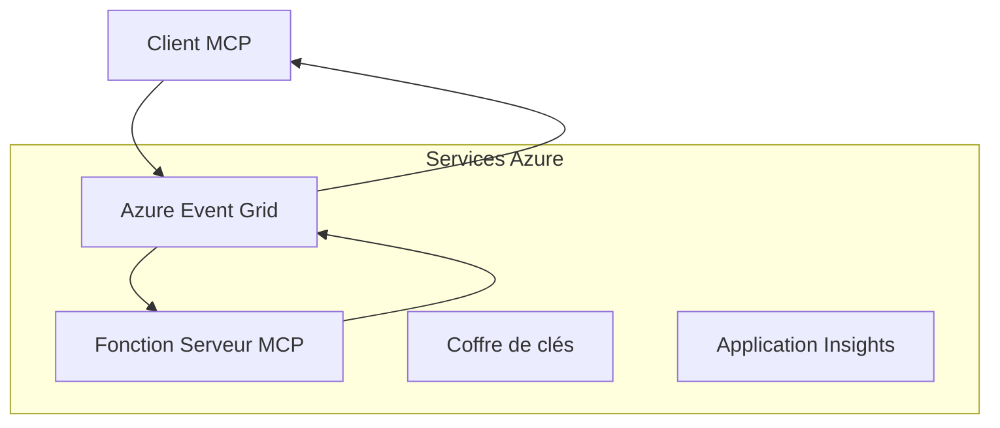
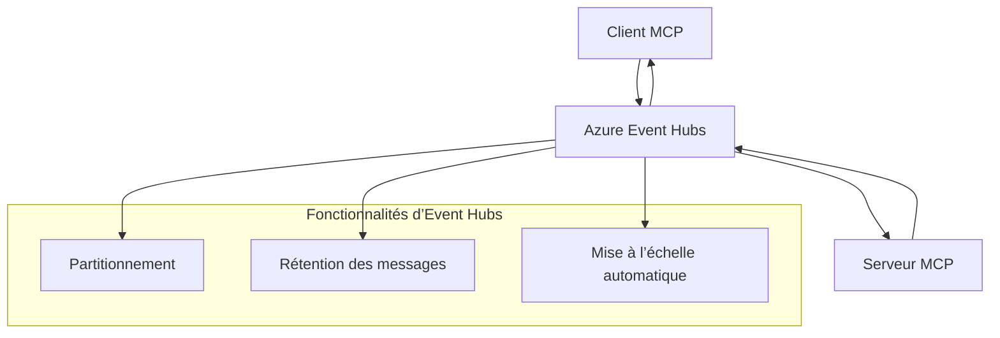

# Transports personnalisés MCP - Guide de mise en œuvre avancée

Le protocole Model Context (MCP) permet des implémentations de transports personnalisés pour
des environnements spécialisés. Ce guide avancé explore Azure Event Grid et
Azure Event Hubs comme des modèles d'architecture. Ils ne sont pas des transports MCP standard
et nécessitent que les deux points de terminaison s'accordent sur le mappage personnalisé.

> **Portée MCP `2026-07-28` :** le protocole actuel ne dispose pas de
> sessions au niveau du protocole, donc les transports personnalisés ne doivent pas dépendre de l'affinité de session ou
> de l'ordre par session. Les en-têtes `Mcp-Method` et conditionnels `Mcp-Name` sont
> des exigences du transport HTTP Streamable standard ; un transport non HTTP
> nécessite un mappage équivalent et explicitement convenu si des intermédiaires doivent router
> sans décoder le corps JSON-RPC. Voir
> [Quoi de neuf dans MCP : la spécification 2026-07-28](../../01-CoreConcepts/mcp-2026-07-28.md).

## Introduction

Les transports standard MCP sont stdio et HTTP Streamable. Certains environnements
d'entreprise utilisent un mappage personnalisé pour s'intégrer à l'infrastructure
de messagerie existante, mais cela peut réduire l'interopérabilité avec les hôtes MCP et
les SDK qui implémentent uniquement les transports standards.

Cette leçon applique les exigences sans état de la spécification MCP
`2026-07-28` aux services de messagerie Azure et aux modèles établis d'intégration
en entreprise.

### **Architecture du transport MCP**

**Extrait de la spécification MCP `2026-07-28` :**

- **Transports standard** : stdio et HTTP Streamable
- **Transports personnalisés** : Mappages optionnels spécifiques à l'implémentation convenus par
    les deux points de terminaison
- **Format de message** : JSON-RPC 2.0 avec extensions spécifiques à MCP
- **Requêtes autonomes** : Pas de session ou de poignée de main au niveau du protocole
    pour porter un état entre les requêtes

## Objectifs d'apprentissage

À la fin de cette leçon avancée, vous serez capable de :

- **Comprendre les exigences des transports personnalisés** : Implémenter le protocole MCP sur n'importe quelle couche de transport tout en maintenant la conformité
- **Construire un transport Azure Event Grid** : Créer des serveurs MCP pilotés par événements utilisant Azure Event Grid pour une scalabilité sans serveur
- **Implémenter un transport Azure Event Hubs** : Concevoir des solutions MCP à haut débit utilisant Azure Event Hubs pour le streaming en temps réel
- **Appliquer des modèles d'entreprise** : Intégrer les transports personnalisés avec l'infrastructure et les modèles de sécurité Azure existants
- **Gérer la fiabilité du transport** : Implémenter la durabilité des messages, l'ordre et la gestion des erreurs pour des scénarios d'entreprise
- **Optimiser la performance** : Concevoir des solutions de transport adaptées aux exigences de scalabilité, latence et débit

## **Exigences du transport**

### **Exigences principales pour MCP `2026-07-28`**

```yaml
Message Protocol:
  format: "JSON-RPC 2.0 with MCP extensions"
    correlation: "Match responses to requests by JSON-RPC id"
    state: "Each request must be self-contained"
  
Transport Layer:
  reliability: "Transport MUST handle connection failures gracefully"
  security: "Transport MUST support secure communication"
    identification: "Carry protocol version, capabilities, and identity per request"
  
Custom Transport:
    compliance: "Map the selected MCP revision without adding session assumptions"
  extensibility: "MAY add transport-specific features"
    interoperability: "Both endpoints MUST agree on the custom mapping"
```

## **Implémentation du transport Azure Event Grid**

Azure Event Grid fournit un service d'acheminement d'événements sans serveur idéal pour les architectures MCP pilotées par événements. Cette implémentation démontre comment construire des systèmes MCP évolutifs et découplés.

### **Vue d'ensemble de l'architecture**



### **Implémentation C# - Transport Event Grid**

```csharp
using Azure.Messaging.EventGrid;
using Microsoft.Extensions.Azure;
using System.Text.Json;

public class EventGridMcpTransport : IMcpTransport
{
    private readonly EventGridPublisherClient _publisher;
    private readonly string _topicEndpoint;
    private readonly string _clientId;
    
    public EventGridMcpTransport(string topicEndpoint, string accessKey, string clientId)
    {
        _publisher = new EventGridPublisherClient(
            new Uri(topicEndpoint), 
            new AzureKeyCredential(accessKey));
        _topicEndpoint = topicEndpoint;
        _clientId = clientId;
    }
    
    public async Task SendMessageAsync(McpMessage message)
    {
        var eventGridEvent = new EventGridEvent(
            subject: $"mcp/{_clientId}",
            eventType: "MCP.MessageReceived",
            dataVersion: "1.0",
            data: JsonSerializer.Serialize(message))
        {
            Id = Guid.NewGuid().ToString(),
            EventTime = DateTimeOffset.UtcNow
        };
        
        await _publisher.SendEventAsync(eventGridEvent);
    }
    
    public async Task<McpMessage> ReceiveMessageAsync(CancellationToken cancellationToken)
    {
        // Event Grid is push-based, so implement webhook receiver
        // This would typically be handled by Azure Functions trigger
        throw new NotImplementedException("Use EventGridTrigger in Azure Functions");
    }
}

// Azure Function for receiving Event Grid events
[FunctionName("McpEventGridReceiver")]
public async Task<IActionResult> HandleEventGridMessage(
    [EventGridTrigger] EventGridEvent eventGridEvent,
    ILogger log)
{
    try
    {
        var mcpMessage = JsonSerializer.Deserialize<McpMessage>(
            eventGridEvent.Data.ToString());
        
        // Process MCP message
        var response = await _mcpServer.ProcessMessageAsync(mcpMessage);
        
        // Send response back via Event Grid
        await _transport.SendMessageAsync(response);
        
        return new OkResult();
    }
    catch (Exception ex)
    {
        log.LogError(ex, "Error processing Event Grid MCP message");
        return new BadRequestResult();
    }
}
```

### **Implémentation TypeScript - Transport Event Grid**

```typescript
import { EventGridPublisherClient, AzureKeyCredential } from "@azure/eventgrid";
import { McpTransport, McpMessage } from "./mcp-types";

export class EventGridMcpTransport implements McpTransport {
    private publisher: EventGridPublisherClient;
    private clientId: string;
    
    constructor(
        private topicEndpoint: string,
        private accessKey: string,
        clientId: string
    ) {
        this.publisher = new EventGridPublisherClient(
            topicEndpoint,
            new AzureKeyCredential(accessKey)
        );
        this.clientId = clientId;
    }
    
    async sendMessage(message: McpMessage): Promise<void> {
        const event = {
            id: crypto.randomUUID(),
            source: `mcp-client-${this.clientId}`,
            type: "MCP.MessageReceived",
            time: new Date(),
            data: message
        };
        
        await this.publisher.sendEvents([event]);
    }
    
    // Réception pilotée par événements via Azure Functions
    onMessage(handler: (message: McpMessage) => Promise<void>): void {
        // La mise en œuvre utiliserait le déclencheur Azure Functions Event Grid
        // Ceci est une interface conceptuelle pour le récepteur webhook
    }
}

// Implémentation Azure Functions
import { app, InvocationContext, EventGridEvent } from "@azure/functions";

app.eventGrid("mcpEventGridHandler", {
    handler: async (event: EventGridEvent, context: InvocationContext) => {
        try {
            const mcpMessage = event.data as McpMessage;
            
            // Traiter le message MCP
            const response = await mcpServer.processMessage(mcpMessage);
            
            // Envoyer la réponse via Event Grid
            await transport.sendMessage(response);
            
        } catch (error) {
            context.error("Error processing MCP message:", error);
            throw error;
        }
    }
});
```

### **Implémentation Python - Transport Event Grid**

```python
from azure.eventgrid import EventGridPublisherClient, EventGridEvent
from azure.core.credentials import AzureKeyCredential
import asyncio
import json
from typing import Callable, Optional
import uuid
from datetime import datetime

class EventGridMcpTransport:
    def __init__(self, topic_endpoint: str, access_key: str, client_id: str):
        self.client = EventGridPublisherClient(
            topic_endpoint, 
            AzureKeyCredential(access_key)
        )
        self.client_id = client_id
        self.message_handler: Optional[Callable] = None
    
    async def send_message(self, message: dict) -> None:
        """Send MCP message via Event Grid"""
        event = EventGridEvent(
            data=message,
            subject=f"mcp/{self.client_id}",
            event_type="MCP.MessageReceived",
            data_version="1.0"
        )
        
        await self.client.send(event)
    
    def on_message(self, handler: Callable[[dict], None]) -> None:
        """Register message handler for incoming events"""
        self.message_handler = handler

# Implémentation des fonctions Azure
import azure.functions as func
import logging

def main(event: func.EventGridEvent) -> None:
    """Azure Functions Event Grid trigger for MCP messages"""
    try:
        # Analyser le message MCP de l'événement Event Grid
        mcp_message = json.loads(event.get_body().decode('utf-8'))
        
        # Traiter le message MCP
        response = process_mcp_message(mcp_message)
        
        # Envoyer la réponse via Event Grid
        # (L'implémentation créerait un nouveau client Event Grid)
        
    except Exception as e:
        logging.error(f"Error processing MCP Event Grid message: {e}")
        raise
```

## **Implémentation du transport Azure Event Hubs**

Azure Event Hubs fournit des capacités de streaming en temps réel à haut débit pour les scénarios MCP qui nécessitent une faible latence et un volume élevé de messages.

### **Vue d'ensemble de l'architecture**



### **Implémentation C# - Transport Event Hubs**

```csharp
using Azure.Messaging.EventHubs;
using Azure.Messaging.EventHubs.Producer;
using Azure.Messaging.EventHubs.Consumer;
using System.Text;

public class EventHubsMcpTransport : IMcpTransport, IDisposable
{
    private readonly EventHubProducerClient _producer;
    private readonly EventHubConsumerClient _consumer;
    private readonly string _consumerGroup;
    private readonly CancellationTokenSource _cancellationTokenSource;
    
    public EventHubsMcpTransport(
        string connectionString, 
        string eventHubName,
        string consumerGroup = "$Default")
    {
        _producer = new EventHubProducerClient(connectionString, eventHubName);
        _consumer = new EventHubConsumerClient(
            consumerGroup, 
            connectionString, 
            eventHubName);
        _consumerGroup = consumerGroup;
        _cancellationTokenSource = new CancellationTokenSource();
    }
    
    public async Task SendMessageAsync(McpMessage message)
    {
        var messageBody = JsonSerializer.Serialize(message);
        var eventData = new EventData(Encoding.UTF8.GetBytes(messageBody));
        
        // Add MCP-specific properties
        eventData.Properties.Add("MessageType", message.Method ?? "response");
        eventData.Properties.Add("MessageId", message.Id);
        eventData.Properties.Add("Timestamp", DateTimeOffset.UtcNow);
        
        await _producer.SendAsync(new[] { eventData });
    }
    
    public async Task StartReceivingAsync(
        Func<McpMessage, Task> messageHandler)
    {
        await foreach (PartitionEvent partitionEvent in _consumer.ReadEventsAsync(
            _cancellationTokenSource.Token))
        {
            try
            {
                var messageBody = Encoding.UTF8.GetString(
                    partitionEvent.Data.EventBody.ToArray());
                var mcpMessage = JsonSerializer.Deserialize<McpMessage>(messageBody);
                
                await messageHandler(mcpMessage);
            }
            catch (Exception ex)
            {
                // Handle deserialization or processing errors
                Console.WriteLine($"Error processing message: {ex.Message}");
            }
        }
    }
    
    public void Dispose()
    {
        _cancellationTokenSource?.Cancel();
        _producer?.DisposeAsync().AsTask().Wait();
        _consumer?.DisposeAsync().AsTask().Wait();
        _cancellationTokenSource?.Dispose();
    }
}
```

### **Implémentation TypeScript - Transport Event Hubs**

```typescript
import { 
    EventHubProducerClient, 
    EventHubConsumerClient, 
    EventData 
} from "@azure/event-hubs";

export class EventHubsMcpTransport implements McpTransport {
    private producer: EventHubProducerClient;
    private consumer: EventHubConsumerClient;
    private isReceiving = false;
    
    constructor(
        private connectionString: string,
        private eventHubName: string,
        private consumerGroup: string = "$Default"
    ) {
        this.producer = new EventHubProducerClient(
            connectionString, 
            eventHubName
        );
        this.consumer = new EventHubConsumerClient(
            consumerGroup,
            connectionString,
            eventHubName
        );
    }
    
    async sendMessage(message: McpMessage): Promise<void> {
        const eventData: EventData = {
            body: JSON.stringify(message),
            properties: {
                messageType: message.method || "response",
                messageId: message.id,
                timestamp: new Date().toISOString()
            }
        };
        
        await this.producer.sendBatch([eventData]);
    }
    
    async startReceiving(
        messageHandler: (message: McpMessage) => Promise<void>
    ): Promise<void> {
        if (this.isReceiving) return;
        
        this.isReceiving = true;
        
        const subscription = this.consumer.subscribe({
            processEvents: async (events, context) => {
                for (const event of events) {
                    try {
                        const messageBody = event.body as string;
                        const mcpMessage: McpMessage = JSON.parse(messageBody);
                        
                        await messageHandler(mcpMessage);
                        
                        // Mettre à jour le point de contrôle pour une livraison au moins une fois
                        await context.updateCheckpoint(event);
                    } catch (error) {
                        console.error("Error processing Event Hubs message:", error);
                    }
                }
            },
            processError: async (err, context) => {
                console.error("Event Hubs error:", err);
            }
        });
    }
    
    async close(): Promise<void> {
        this.isReceiving = false;
        await this.producer.close();
        await this.consumer.close();
    }
}
```

### **Implémentation Python - Transport Event Hubs**

```python
from azure.eventhub import EventHubProducerClient, EventHubConsumerClient
from azure.eventhub import EventData
import json
import asyncio
from typing import Callable, Dict, Any
import logging

class EventHubsMcpTransport:
    def __init__(
        self, 
        connection_string: str, 
        eventhub_name: str,
        consumer_group: str = "$Default"
    ):
        self.producer = EventHubProducerClient.from_connection_string(
            connection_string, 
            eventhub_name=eventhub_name
        )
        self.consumer = EventHubConsumerClient.from_connection_string(
            connection_string,
            consumer_group=consumer_group,
            eventhub_name=eventhub_name
        )
        self.is_receiving = False
    
    async def send_message(self, message: Dict[str, Any]) -> None:
        """Send MCP message via Event Hubs"""
        event_data = EventData(json.dumps(message))
        
        # Ajouter des propriétés spécifiques MCP
        event_data.properties = {
            "messageType": message.get("method", "response"),
            "messageId": message.get("id"),
            "timestamp": "2025-01-14T10:30:00Z"  # Utiliser un horodatage réel
        }
        
        async with self.producer:
            event_data_batch = await self.producer.create_batch()
            event_data_batch.add(event_data)
            await self.producer.send_batch(event_data_batch)
    
    async def start_receiving(
        self, 
        message_handler: Callable[[Dict[str, Any]], None]
    ) -> None:
        """Start receiving MCP messages from Event Hubs"""
        if self.is_receiving:
            return
        
        self.is_receiving = True
        
        async with self.consumer:
            await self.consumer.receive(
                on_event=self._on_event_received(message_handler),
                starting_position="-1"  # Commencer depuis le début
            )
    
    def _on_event_received(self, handler: Callable):
        """Internal event handler wrapper"""
        async def handle_event(partition_context, event):
            try:
                # Analyser le message MCP à partir de l'événement Event Hubs
                message_body = event.body_as_str(encoding='UTF-8')
                mcp_message = json.loads(message_body)
                
                # Traiter le message MCP
                await handler(mcp_message)
                
                # Mettre à jour le point de contrôle pour une livraison au moins une fois
                await partition_context.update_checkpoint(event)
                
            except Exception as e:
                logging.error(f"Error processing Event Hubs message: {e}")
        
        return handle_event
    
    async def close(self) -> None:
        """Clean up transport resources"""
        self.is_receiving = False
        await self.producer.close()
        await self.consumer.close()
```

## **Modèles avancés de transport**

### **Durabilité et fiabilité des messages**

```csharp
// Implementing message durability with retry logic
public class ReliableTransportWrapper : IMcpTransport
{
    private readonly IMcpTransport _innerTransport;
    private readonly RetryPolicy _retryPolicy;
    
    public async Task SendMessageAsync(McpMessage message)
    {
        await _retryPolicy.ExecuteAsync(async () =>
        {
            try
            {
                await _innerTransport.SendMessageAsync(message);
            }
            catch (TransportException ex) when (ex.IsRetryable)
            {
                // Log and retry
                throw;
            }
        });
    }
}
```

### **Intégration de la sécurité du transport**

```csharp
// Integrating Azure Key Vault for transport security
public class SecureTransportFactory
{
    private readonly SecretClient _keyVaultClient;
    
    public async Task<IMcpTransport> CreateEventGridTransportAsync()
    {
        var accessKey = await _keyVaultClient.GetSecretAsync("EventGridAccessKey");
        var topicEndpoint = await _keyVaultClient.GetSecretAsync("EventGridTopic");
        
        return new EventGridMcpTransport(
            topicEndpoint.Value.Value,
            accessKey.Value.Value,
            Environment.MachineName
        );
    }
}
```

### **Surveillance et observabilité du transport**

```csharp
// Adding telemetry to custom transports
public class ObservableTransport : IMcpTransport
{
    private readonly IMcpTransport _transport;
    private readonly ILogger _logger;
    private readonly TelemetryClient _telemetryClient;
    
    public async Task SendMessageAsync(McpMessage message)
    {
        using var activity = Activity.StartActivity("MCP.Transport.Send");
        activity?.SetTag("transport.type", "EventGrid");
        activity?.SetTag("message.method", message.Method);
        
        var stopwatch = Stopwatch.StartNew();
        
        try
        {
            await _transport.SendMessageAsync(message);
            
            _telemetryClient.TrackDependency(
                "EventGrid",
                "SendMessage",
                DateTime.UtcNow.Subtract(stopwatch.Elapsed),
                stopwatch.Elapsed,
                true
            );
        }
        catch (Exception ex)
        {
            _telemetryClient.TrackException(ex);
            throw;
        }
    }
}
```

## **Scénarios d'intégration en entreprise**

### **Scénario 1 : Traitement MCP distribué**

Utilisation d'Azure Event Grid pour distribuer les requêtes MCP sur plusieurs nœuds de traitement :

```yaml
Architecture:
  - MCP Client sends requests to Event Grid topic
  - Multiple Azure Functions subscribe to process different tool types
  - Results aggregated and returned via separate response topic
  
Benefits:
  - Horizontal scaling based on message volume
  - Fault tolerance through redundant processors
  - Cost optimization with serverless compute
```

### **Scénario 2 : Streaming MCP en temps réel**

Utilisation d'Azure Event Hubs pour des interactions MCP à haute fréquence :

```yaml
Architecture:
  - MCP Client streams continuous requests via Event Hubs
  - Stream Analytics processes and routes messages
  - Multiple consumers handle different aspect of processing
  
Benefits:
  - Low latency for real-time scenarios
  - High throughput for batch processing
  - Built-in partitioning for parallel processing
```

### **Scénario 3 : Architecture de transport hybride**

Combinaison de plusieurs transports pour différents cas d'utilisation :

```csharp
public class HybridMcpTransport : IMcpTransport
{
    private readonly IMcpTransport _realtimeTransport; // Event Hubs
    private readonly IMcpTransport _batchTransport;    // Event Grid
    private readonly IMcpTransport _fallbackTransport; // HTTP Streaming
    
    public async Task SendMessageAsync(McpMessage message)
    {
        // Route based on message characteristics
        var transport = message.Method switch
        {
            "tools/call" when IsRealtime(message) => _realtimeTransport,
            "resources/read" when IsBatch(message) => _batchTransport,
            _ => _fallbackTransport
        };
        
        await transport.SendMessageAsync(message);
    }
}
```

## **Optimisation des performances**

### **Regroupement des messages pour Event Grid**

```csharp
public class BatchingEventGridTransport : IMcpTransport
{
    private readonly List<McpMessage> _messageBuffer = new();
    private readonly Timer _flushTimer;
    private const int MaxBatchSize = 100;
    
    public async Task SendMessageAsync(McpMessage message)
    {
        lock (_messageBuffer)
        {
            _messageBuffer.Add(message);
            
            if (_messageBuffer.Count >= MaxBatchSize)
            {
                _ = Task.Run(FlushMessages);
            }
        }
    }
    
    private async Task FlushMessages()
    {
        List<McpMessage> toSend;
        lock (_messageBuffer)
        {
            toSend = new List<McpMessage>(_messageBuffer);
            _messageBuffer.Clear();
        }
        
        if (toSend.Any())
        {
            var events = toSend.Select(CreateEventGridEvent);
            await _publisher.SendEventsAsync(events);
        }
    }
}
```

### **Stratégie de partitionnement pour Event Hubs**

```csharp
public class PartitionedEventHubsTransport : IMcpTransport
{
    public async Task SendMessageAsync(McpMessage message)
    {
        // Partition by client ID for session affinity
        var partitionKey = ExtractClientId(message);
        
        var eventData = new EventData(JsonSerializer.SerializeToUtf8Bytes(message))
        {
            PartitionKey = partitionKey
        };
        
        await _producer.SendAsync(new[] { eventData });
    }
}
```

## **Tests des transports personnalisés**

### **Tests unitaires avec doubles de test**

```csharp
[Test]
public async Task EventGridTransport_SendMessage_PublishesCorrectEvent()
{
    // Arrange
    var mockPublisher = new Mock<EventGridPublisherClient>();
    var transport = new EventGridMcpTransport(mockPublisher.Object);
    var message = new McpMessage { Method = "tools/list", Id = "test-123" };
    
    // Act
    await transport.SendMessageAsync(message);
    
    // Assert
    mockPublisher.Verify(
        x => x.SendEventAsync(
            It.Is<EventGridEvent>(e => 
                e.EventType == "MCP.MessageReceived" &&
                e.Subject == "mcp/test-client"
            )
        ),
        Times.Once
    );
}
```

### **Tests d'intégration avec Azure Test Containers**

```csharp
[Test]
public async Task EventHubsTransport_IntegrationTest()
{
    // Using Testcontainers for integration testing
    var eventHubsContainer = new EventHubsContainer()
        .WithEventHub("test-hub");
    
    await eventHubsContainer.StartAsync();
    
    var transport = new EventHubsMcpTransport(
        eventHubsContainer.GetConnectionString(),
        "test-hub"
    );
    
    // Test message round-trip
    var sentMessage = new McpMessage { Method = "test", Id = "123" };
    McpMessage receivedMessage = null;
    
    await transport.StartReceivingAsync(msg => {
        receivedMessage = msg;
        return Task.CompletedTask;
    });
    
    await transport.SendMessageAsync(sentMessage);
    await Task.Delay(1000); // Allow for message processing
    
    Assert.That(receivedMessage?.Id, Is.EqualTo("123"));
}
```

## **Bonnes pratiques et lignes directrices**

### **Principes de conception du transport**

1. **Idempotence** : Assurer que le traitement des messages est idempotent pour gérer les doublons
2. **Gestion des erreurs** : Implémenter une gestion des erreurs complète et des files de lettres mortes
3. **Surveillance** : Ajouter une télémétrie détaillée et des contrôles de santé
4. **Sécurité** : Utiliser les identités managées et l'accès au moindre privilège
5. **Performance** : Concevoir selon les exigences spécifiques de latence et de débit

### **Recommandations spécifiques à Azure**

1. **Utiliser une identité managée** : Éviter les chaînes de connexion en production
2. **Mettre en œuvre des disjoncteurs** : Se protéger contre les pannes des services Azure
3. **Surveiller les coûts** : Suivre le volume de messages et les coûts de traitement
4. **Planifier la scalabilité** : Concevoir tôt les stratégies de partitionnement et de montée en charge
5. **Tester rigoureusement** : Utiliser Azure DevTest Labs pour des tests complets

## **Conclusion**

Les transports MCP personnalisés permettent des scénarios puissants en entreprise utilisant les services de messagerie Azure. En implémentant les transports Event Grid ou Event Hubs, vous pouvez construire des solutions MCP évolutives et fiables qui s'intègrent parfaitement à l'infrastructure Azure existante.

Les exemples fournis démontrent des modèles prêts pour la production pour implémenter des transports personnalisés tout en maintenant la conformité au protocole MCP et les meilleures pratiques Azure.

## **Ressources supplémentaires**

- [Spécification MCP 2026-07-28](https://modelcontextprotocol.io/specification/2026-07-28/)
- [Documentation Azure Event Grid](https://docs.microsoft.com/azure/event-grid/)
- [Documentation Azure Event Hubs](https://docs.microsoft.com/azure/event-hubs/)
- [Déclencheur Event Grid pour Azure Functions](https://docs.microsoft.com/azure/azure-functions/functions-bindings-event-grid)
- [Azure SDK pour .NET](https://github.com/Azure/azure-sdk-for-net)
- [Azure SDK pour TypeScript](https://github.com/Azure/azure-sdk-for-js)
- [Azure SDK pour Python](https://github.com/Azure/azure-sdk-for-python)

---

> *Ce guide se concentre sur les modèles d'architecture personnalisés. Validez le
> comportement du protocole selon la [Spécification MCP 2026-07-28](https://modelcontextprotocol.io/specification/2026-07-28/),
> et validez l'utilisation d'Azure selon vos exigences et limites de service.*


## Quelles sont les prochaines étapes
- [6. Contributions de la communauté](../../06-CommunityContributions/README.md)

---

<!-- CO-OP TRANSLATOR DISCLAIMER START -->
**Avertissement** :
Ce document a été traduit à l'aide du service de traduction automatique [Co-op Translator](https://github.com/Azure/co-op-translator). Bien que nous nous efforçions d'assurer l'exactitude, veuillez noter que les traductions automatisées peuvent contenir des erreurs ou des inexactitudes. Le document original dans sa langue native doit être considéré comme la source faisant autorité. Pour les informations critiques, il est recommandé de recourir à une traduction professionnelle réalisée par un humain. Nous ne saurions être tenus responsables des malentendus ou erreurs d'interprétation découlant de l'utilisation de cette traduction.
<!-- CO-OP TRANSLATOR DISCLAIMER END -->