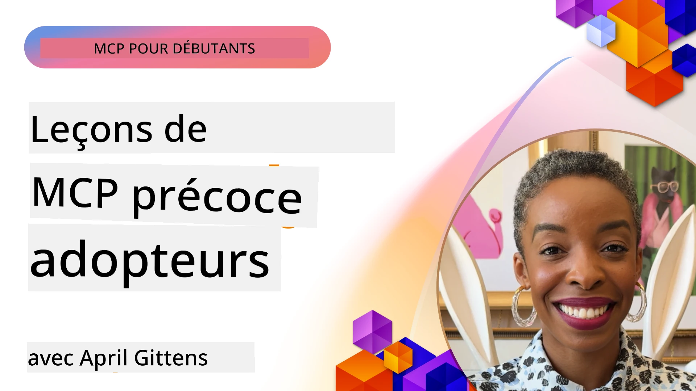

# 🌟 Leçons des premiers adoptants

[](https://youtu.be/jds7dSmNptE)

_(Cliquez sur l'image ci-dessus pour visionner la vidéo de cette leçon)_

## 🎯 Ce que ce module couvre

Ce module explore comment de véritables organisations et développeurs exploitent le Model Context Protocol (MCP) pour résoudre des défis réels et stimuler l'innovation. À travers des études de cas détaillées, des projets pratiques et des exemples concrets, vous découvrirez comment MCP permet une intégration sécurisée et évolutive de l’IA, qui connecte les modèles de langage, les outils et les données d'entreprise.

### 📚 Voir MCP en action

Vous souhaitez voir ces principes appliqués à des outils prêts pour la production ? Découvrez nos [**10 serveurs Microsoft MCP qui transforment la productivité des développeurs**](microsoft-mcp-servers.md), qui présentent de vrais serveurs Microsoft MCP que vous pouvez utiliser dès aujourd’hui.

## Aperçu

Cette leçon explique comment les premiers adoptants ont utilisé le Model Context Protocol (MCP) pour résoudre des défis réels et favoriser l’innovation dans divers secteurs. À travers des études de cas détaillées et des projets pratiques, vous verrez comment MCP permet une intégration standardisée, sécurisée et évolutive de l'IA — reliant les grands modèles de langage, les outils et les données d’entreprise dans un cadre unifié. Vous acquérez une expérience pratique en concevant et construisant des solutions basées sur MCP, apprenez à partir de modèles d’implémentation éprouvés et découvrez les meilleures pratiques pour le déploiement de MCP en production. La leçon met également en lumière les tendances émergentes, les orientations futures et les ressources open source pour vous aider à rester à la pointe de la technologie MCP et de son écosystème en évolution.

## Objectifs d’apprentissage

- Analyser des implémentations MCP réelles dans différents secteurs
- Concevoir et construire des applications complètes basées sur MCP
- Explorer les tendances émergentes et les directions futures de la technologie MCP
- Appliquer les meilleures pratiques dans des scénarios de développement réels

## Implémentations MCP dans le monde réel

### Étude de cas 1 : Automatisation du support client en entreprise

Une multinationale a mis en place une solution basée sur MCP pour standardiser les interactions d’IA dans leurs systèmes de support client. Cela leur a permis de :

- Créer une interface unifiée pour plusieurs fournisseurs LLM
- Maintenir une gestion cohérente des prompts dans tous les départements
- Implémenter des contrôles robustes de sécurité et conformité
- Changer facilement entre différents modèles d’IA selon les besoins spécifiques

**Implémentation technique :**

```python
# Implémentation du serveur MCP Python pour le support client
import logging
import asyncio
from modelcontextprotocol import create_server, ServerConfig
from modelcontextprotocol.server import MCPServer
from modelcontextprotocol.transports import create_http_transport
from modelcontextprotocol.resources import ResourceDefinition
from modelcontextprotocol.prompts import PromptDefinition
from modelcontextprotocol.tool import ToolDefinition

# Configurer la journalisation
logging.basicConfig(level=logging.INFO)

async def main():
    # Créer la configuration du serveur
    config = ServerConfig(
        name="Enterprise Customer Support Server",
        version="1.0.0",
        description="MCP server for handling customer support inquiries"
    )
    
    # Initialiser le serveur MCP
    server = create_server(config)
    
    # Enregistrer les ressources de la base de connaissances
    server.resources.register(
        ResourceDefinition(
            name="customer_kb",
            description="Customer knowledge base documentation"
        ),
        lambda params: get_customer_documentation(params)
    )
    
    # Enregistrer les modèles d'invite
    server.prompts.register(
        PromptDefinition(
            name="support_template",
            description="Templates for customer support responses"
        ),
        lambda params: get_support_templates(params)
    )
    
    # Enregistrer les outils de support
    server.tools.register(
        ToolDefinition(
            name="ticketing",
            description="Create and update support tickets"
        ),
        handle_ticketing_operations
    )
    
    # Démarrer le serveur avec le transport HTTP
    transport = create_http_transport(port=8080)
    await server.run(transport)

if __name__ == "__main__":
    asyncio.run(main())
```

**Résultats :** réduction de 30 % des coûts des modèles, amélioration de 45 % de la cohérence des réponses et conformité renforcée dans les opérations globales.

### Étude de cas 2 : Assistant de diagnostic en santé

Un prestataire de santé a développé une infrastructure MCP pour intégrer plusieurs modèles médicaux spécialisés tout en assurant la protection des données sensibles des patients :

- Passage fluide entre modèles médicaux généralistes et spécialistes
- Contrôles stricts de confidentialité et pistes d’audit
- Intégration avec les systèmes existants de dossiers médicaux électroniques (DME)
- Ingénierie de prompt cohérente pour la terminologie médicale

**Implémentation technique :**

```csharp
// C# MCP host application implementation in healthcare application
using Microsoft.Extensions.DependencyInjection;
using ModelContextProtocol.SDK.Client;
using ModelContextProtocol.SDK.Security;
using ModelContextProtocol.SDK.Resources;

public class DiagnosticAssistant
{
    private readonly MCPHostClient _mcpClient;
    private readonly PatientContext _patientContext;
    
    public DiagnosticAssistant(PatientContext patientContext)
    {
        _patientContext = patientContext;
        
        // Configure MCP client with healthcare-specific settings
        var clientOptions = new ClientOptions
        {
            Name = "Healthcare Diagnostic Assistant",
            Version = "1.0.0",
            Security = new SecurityOptions
            {
                Encryption = EncryptionLevel.Medical,
                AuditEnabled = true
            }
        };
        
        _mcpClient = new MCPHostClientBuilder()
            .WithOptions(clientOptions)
            .WithTransport(new HttpTransport("https://healthcare-mcp.example.org"))
            .WithAuthentication(new HIPAACompliantAuthProvider())
            .Build();
    }
    
    public async Task<DiagnosticSuggestion> GetDiagnosticAssistance(
        string symptoms, string patientHistory)
    {
        // Create request with appropriate resources and tool access
        var resourceRequest = new ResourceRequest
        {
            Name = "patient_records",
            Parameters = new Dictionary<string, object>
            {
                ["patientId"] = _patientContext.PatientId,
                ["requestingProvider"] = _patientContext.ProviderId
            }
        };
        
        // Request diagnostic assistance using appropriate prompt
        var response = await _mcpClient.SendPromptRequestAsync(
            promptName: "diagnostic_assistance",
            parameters: new Dictionary<string, object>
            {
                ["symptoms"] = symptoms,
                patientHistory = patientHistory,
                relevantGuidelines = _patientContext.GetRelevantGuidelines()
            });
            
        return DiagnosticSuggestion.FromMCPResponse(response);
    }
}
```

**Résultats :** suggestions diagnostiques améliorées pour les médecins tout en respectant pleinement la conformité HIPAA et réduction significative des changements de contexte entre systèmes.

### Étude de cas 3 : Analyse des risques dans les services financiers

Une institution financière a mis en œuvre MCP pour standardiser leurs processus d’analyse des risques dans différents départements :

- Création d'une interface unifiée pour les modèles de risque de crédit, détection de fraude et risque d’investissement
- Mise en place de contrôles d’accès stricts et de versionnage des modèles
- Garantie de l’auditabilité de toutes les recommandations d’IA
- Maintien d’un formatage cohérent des données à travers des systèmes divers

**Implémentation technique :**

```java
// Serveur MCP Java pour l'évaluation des risques financiers
import org.mcp.server.*;
import org.mcp.security.*;

public class FinancialRiskMCPServer {
    public static void main(String[] args) {
        // Créer un serveur MCP avec des fonctionnalités de conformité financière
        MCPServer server = new MCPServerBuilder()
            .withModelProviders(
                new ModelProvider("risk-assessment-primary", new AzureOpenAIProvider()),
                new ModelProvider("risk-assessment-audit", new LocalLlamaProvider())
            )
            .withPromptTemplateDirectory("./compliance/templates")
            .withAccessControls(new SOCCompliantAccessControl())
            .withDataEncryption(EncryptionStandard.FINANCIAL_GRADE)
            .withVersionControl(true)
            .withAuditLogging(new DatabaseAuditLogger())
            .build();
            
        server.addRequestValidator(new FinancialDataValidator());
        server.addResponseFilter(new PII_RedactionFilter());
        
        server.start(9000);
        
        System.out.println("Financial Risk MCP Server running on port 9000");
    }
}
```

**Résultats :** meilleure conformité réglementaire, cycles de déploiement des modèles accélérés de 40 %, et amélioration de la cohérence des évaluations des risques entre départements.

### Étude de cas 4 : Serveur MCP Microsoft Playwright pour l’automatisation de navigateur

Microsoft a développé le [serveur MCP Playwright](https://github.com/microsoft/playwright-mcp) pour permettre une automatisation sécurisée et standardisée des navigateurs via le Model Context Protocol. Ce serveur prêt pour la production permet aux agents IA et LLM d’interagir avec les navigateurs web de manière contrôlée, auditable et extensible — permettant des cas d’usage comme les tests web automatisés, l’extraction de données et les workflows de bout en bout.

> **🎯 Outil prêt pour la production**
> 
> Cette étude de cas présente un vrai serveur MCP que vous pouvez utiliser dès aujourd’hui ! En savoir plus sur le serveur MCP Playwright et 9 autres serveurs Microsoft MCP prêts pour la production dans notre [**Guide des serveurs Microsoft MCP**](microsoft-mcp-servers.md#8--playwright-mcp-server).

**Fonctionnalités clés :**
- Expose les capacités d’automatisation du navigateur (navigation, remplissage de formulaires, capture d’écran, etc.) comme outils MCP
- Implémente des contrôles d’accès stricts et un sandboxing pour éviter les actions non autorisées
- Fournit des journaux d’audit détaillés pour toutes les interactions avec le navigateur
- Supporte l’intégration avec Azure OpenAI et d’autres fournisseurs LLM pour une automatisation pilotée par agent
- Alimente l’Agent de codage de GitHub Copilot avec des capacités de navigation web

**Implémentation technique :**

```typescript
// TypeScript : Enregistrement des outils d'automatisation du navigateur Playwright dans un serveur MCP
import { createServer, ToolDefinition } from 'modelcontextprotocol';
import { launch } from 'playwright';

const server = createServer({
  name: 'Playwright MCP Server',
  version: '1.0.0',
  description: 'MCP server for browser automation using Playwright'
});

// Enregistrer un outil pour naviguer vers une URL et capturer une capture d'écran
server.tools.register(
  new ToolDefinition({
    name: 'navigate_and_screenshot',
    description: 'Navigate to a URL and capture a screenshot',
    parameters: {
      url: { type: 'string', description: 'The URL to visit' }
    }
  }),
  async ({ url }) => {
    const browser = await launch();
    const page = await browser.newPage();
    await page.goto(url);
    const screenshot = await page.screenshot();
    await browser.close();
    return { screenshot };
  }
);

// Démarrer le serveur MCP
server.listen(8080);
```

**Résultats :**

- A permis une automatisation programmable sécurisée de navigateurs pour agents IA et LLM
- Réduction de l’effort de tests manuels et amélioration de la couverture de tests des applications web
- Fourniture d’un cadre réutilisable et extensible pour l’intégration d’outils basés sur navigateur en environnement entreprise
- Alimente les capacités de navigation web de GitHub Copilot

**Références :**

- [Dépôt GitHub du serveur MCP Playwright](https://github.com/microsoft/playwright-mcp)
- [Solutions IA et automatisation Microsoft](https://azure.microsoft.com/en-us/products/ai-services/)

### Étude de cas 5 : Azure MCP – Model Context Protocol de niveau entreprise en tant que service

Le serveur Azure MCP ([https://aka.ms/azmcp](https://aka.ms/azmcp)) est l’implémentation gérée et de niveau entreprise du Model Context Protocol par Microsoft, conçue pour fournir des capacités serveur MCP sécurisées, évolutives et conformes en tant que service cloud. Azure MCP permet aux organisations de déployer, gérer et intégrer rapidement des serveurs MCP avec les services Azure AI, données et sécurité, réduisant ainsi la charge opérationnelle et accélérant l’adoption de l’IA.

> **🎯 Outil prêt pour la production**
> 
> Il s’agit d’un vrai serveur MCP que vous pouvez utiliser dès aujourd’hui ! En savoir plus sur le serveur Microsoft Foundry MCP dans notre [**Guide des serveurs Microsoft MCP**](microsoft-mcp-servers.md).


- Hébergement serveur MCP entièrement géré avec montée en charge, surveillance et sécurité intégrées
- Intégration native avec Azure OpenAI, Azure AI Search et autres services Azure
- Authentification et autorisation entreprise via Microsoft Entra ID
- Support des outils personnalisés, modèles de prompt et connecteurs de ressources
- Conformité aux exigences de sécurité et réglementaires des entreprises

**Implémentation technique :**

```yaml
# Example: Azure MCP server deployment configuration (YAML)
apiVersion: mcp.microsoft.com/v1
kind: McpServer
metadata:
  name: enterprise-mcp-server
spec:
  modelProviders:
    - name: azure-openai
      type: AzureOpenAI
      endpoint: https://<your-openai-resource>.openai.azure.com/
      apiKeySecret: <your-azure-keyvault-secret>
  tools:
    - name: document_search
      type: AzureAISearch
      endpoint: https://<your-search-resource>.search.windows.net/
      apiKeySecret: <your-azure-keyvault-secret>
  authentication:
    type: EntraID
    tenantId: <your-tenant-id>
  monitoring:
    enabled: true
    logAnalyticsWorkspace: <your-log-analytics-id>
```

**Résultats :**  
- Réduction du délai de mise en valeur pour les projets IA en entreprise grâce à une plateforme serveur MCP prête à l’emploi et conforme
- Intégration simplifiée des LLM, outils et sources de données d’entreprise
- Sécurité, observabilité et efficacité opérationnelle améliorées pour les charges MCP
- Qualité de code améliorée avec les meilleures pratiques du SDK Azure et les patterns d’authentification actuels

**Références :**  
- [Documentation Azure MCP](https://aka.ms/azmcp)
- [Dépôt GitHub Azure MCP Server](https://github.com/Azure/azure-mcp)
- [Services Azure AI](https://azure.microsoft.com/en-us/products/ai-services/)
- [Microsoft MCP Center](https://mcp.azure.com)

## Étude de cas 6 : NLWeb 
MCP (Model Context Protocol) est un protocole émergent permettant aux chatbots et assistants IA d’interagir avec des outils. Chaque instance NLWeb est aussi un serveur MCP, qui supporte une méthode principale, ask, utilisée pour poser une question en langage naturel à un site web. La réponse retournée utilise schema.org, un vocabulaire largement utilisé pour décrire les données web. Pour faire simple, MCP est à NLWeb ce que Http est à HTML. NLWeb combine protocoles, formats Schema.org et code d’exemple pour aider les sites à créer rapidement ces points d’accès, profitant ainsi aux humains par des interfaces conversationnelles et aux machines par une interaction naturelle agent-à-agent.

NLWeb comporte deux composants distincts.
- Un protocole, très simple à démarrer, pour s’interfacer avec un site en langage naturel et un format, utilisant json et schema.org pour la réponse retournée. Voir la documentation sur l’API REST pour plus de détails.
- Une implémentation simple de (1) qui exploite le balisage existant, pour les sites pouvant être abstraits comme des listes d’éléments (produits, recettes, attractions, avis, etc.). Associé à un ensemble de widgets d’interface utilisateur, les sites peuvent facilement fournir des interfaces conversationnelles pour leur contenu. Voir la documentation sur Life of a chat query pour plus de détails sur ce fonctionnement.
 
**Références :**  
- [Documentation Azure MCP](https://aka.ms/azmcp)
- [NLWeb](https://github.com/microsoft/NlWeb)

### Étude de cas 7 : Serveur Microsoft Foundry MCP – Intégration d’agents IA en entreprise

Les serveurs Microsoft Foundry MCP montrent comment MCP peut être utilisé pour orchestrer et gérer des agents et workflows IA en entreprise. En intégrant MCP avec Microsoft Foundry, les organisations peuvent standardiser les interactions des agents, tirer parti de la gestion des workflows de Foundry et assurer des déploiements sécurisés et à grande échelle.

> **🎯 Outil prêt pour la production**
> 
> Il s’agit d’un vrai serveur MCP que vous pouvez utiliser dès aujourd’hui ! En savoir plus sur le serveur Microsoft Foundry MCP dans notre [**Guide des serveurs Microsoft MCP**](microsoft-mcp-servers.md#9--microsoft-foundry-mcp-server).

**Fonctionnalités clés :**
- Accès complet à l’écosystème IA d’Azure, incluant catalogues de modèles et gestion de déploiement
- Indexation des connaissances avec Azure AI Search pour les applications RAG
- Outils d’évaluation des performances et assurance qualité des modèles IA
- Intégration avec Microsoft Foundry Catalog et Labs pour les modèles de recherche avancée
- Capacités de gestion et d’évaluation des agents pour les scénarios de production

**Résultats :**
- Prototypage rapide et supervision solide des workflows d’agents IA
- Intégration fluide avec les services Azure AI pour des scénarios avancés
- Interface unifiée pour construire, déployer et surveiller les pipelines d’agents
- Sécurité, conformité et efficacité opérationnelle améliorées pour les entreprises
- Adoption accélérée de l’IA tout en gardant le contrôle sur les processus complexes pilotés par agents

**Références :**
- [Dépôt GitHub Microsoft Foundry MCP Server](https://github.com/azure-ai-foundry/mcp-foundry)
- [Intégration des agents Azure AI avec MCP (Microsoft Foundry Blog)](https://devblogs.microsoft.com/foundry/integrating-azure-ai-agents-mcp/)

### Étude de cas 8 : Foundry MCP Playground – Expérimentation et prototypage

Le Foundry MCP Playground offre un environnement prêt à l’emploi pour expérimenter avec les serveurs MCP et les intégrations Microsoft Foundry. Les développeurs peuvent rapidement prototyper, tester et évaluer des modèles IA et workflows d’agents en utilisant les ressources du Microsoft Foundry Catalog et Labs. Le playground simplifie la configuration, fournit des projets exemples et soutient le développement collaboratif, facilitant l’exploration des meilleures pratiques et de nouveaux scénarios avec un minimum de contraintes. Il est particulièrement utile pour les équipes souhaitant valider des idées, partager des expériences et accélérer l’apprentissage sans infrastructures complexes. En abaissant la barrière à l’entrée, le playground favorise l’innovation et les contributions communautaires dans l’écosystème MCP et Microsoft Foundry.

**Références :**

- [Dépôt GitHub Foundry MCP Playground](https://github.com/azure-ai-foundry/foundry-mcp-playground)

### Étude de cas 9 : Serveur Microsoft Learn Docs MCP – Accès à la documentation alimentée par IA

Le serveur Microsoft Learn Docs MCP est un service cloud qui fournit aux assistants IA un accès en temps réel à la documentation officielle Microsoft via le Model Context Protocol. Ce serveur prêt pour la production se connecte à l’écosystème complet Microsoft Learn et permet la recherche sémantique sur toutes les sources officielles Microsoft.

> **🎯 Outil prêt pour la production**
> 
> Il s’agit d’un vrai serveur MCP que vous pouvez utiliser dès aujourd’hui ! En savoir plus sur le serveur Microsoft Learn Docs MCP dans notre [**Guide des serveurs Microsoft MCP**](microsoft-mcp-servers.md#1--microsoft-learn-docs-mcp-server).

**Fonctionnalités clés :**
- Accès en temps réel à la documentation officielle Microsoft, docs Azure et documentation Microsoft 365
- Capacités avancées de recherche sémantique comprenant le contexte et l’intention
- Informations toujours à jour au fur et à mesure de la publication des contenus Microsoft Learn
- Couverture complète de Microsoft Learn, documentation Azure et sources Microsoft 365
- Retourne jusqu’à 10 extraits de contenu de haute qualité avec titres d’articles et URL

**Pourquoi c’est critique :**
- Résout le problème des « connaissances IA obsolètes » pour les technologies Microsoft
- Assure un accès aux dernières fonctionnalités .NET, C#, Azure et Microsoft 365 pour les assistants IA
- Fournit une information autoritaire de première main pour une génération de code précise
- Essentiel pour les développeurs travaillant avec des technologies Microsoft en rapide évolution

**Résultats :**
- Précision améliorée de façon spectaculaire du code généré par IA pour les technologies Microsoft
- Réduction du temps passé à rechercher documentation et meilleures pratiques actuelles
- Productivité accrue des développeurs grâce à la récupération contextuelle de documentation
- Intégration fluide dans les workflows de développement sans quitter l’IDE

**Références :**
- [Dépôt GitHub Microsoft Learn Docs MCP Server](https://github.com/MicrosoftDocs/mcp)
- [Documentation Microsoft Learn](https://learn.microsoft.com/)

## Projets pratiques

### Projet 1 : Construire un serveur MCP multi-fournisseurs

**Objectif :** Créer un serveur MCP capable de router les requêtes vers plusieurs fournisseurs de modèles IA selon des critères spécifiques.

**Exigences :**

- Supporter au moins trois fournisseurs de modèles différents (par exemple, OpenAI, Anthropic, modèles locaux)
- Implémenter un mécanisme de routage basé sur les métadonnées des requêtes
- Créer un système de configuration pour gérer les identifiants fournisseurs
- Ajouter une mise en cache pour optimiser la performance et les coûts
- Développer un tableau de bord simple pour le suivi de l’utilisation

**Étapes d’implémentation :**

1. Mettre en place l’infrastructure serveur MCP de base
2. Implémenter des adaptateurs fournisseurs pour chaque service de modèle IA
3. Créer la logique de routage basée sur les attributs des requêtes
4. Ajouter des mécanismes de mise en cache pour les requêtes fréquentes
5. Développer le tableau de bord de surveillance
6. Tester avec différents schémas de requêtes

**Technologies :** Choisissez parmi Python (.NET/Java/Python selon votre préférence), Redis pour la mise en cache, et un framework web simple pour le tableau de bord.

### Projet 2 : Système d’administration des prompts en entreprise

**Objectif :** Développer un système basé sur MCP pour gérer, versionner et déployer des modèles de prompts à travers une organisation.

**Exigences :**


- Créer un référentiel centralisé pour les modèles de prompt
- Mettre en œuvre des workflows de versionnage et d'approbation
- Construire des capacités de test de modèles avec des entrées d'exemple
- Développer des contrôles d'accès basés sur les rôles
- Créer une API pour la récupération et le déploiement des modèles

**Étapes de mise en œuvre :**

1. Concevoir le schéma de base de données pour le stockage des modèles
2. Créer l'API principale pour les opérations CRUD sur les modèles
3. Mettre en œuvre le système de versionnage
4. Construire le workflow d'approbation
5. Développer le cadre de test
6. Créer une interface web simple pour la gestion
7. Intégrer avec un serveur MCP

**Technologies :** Votre choix de framework backend, base de données SQL ou NoSQL, et un framework frontend pour l’interface de gestion.

### Projet 3 : Plateforme de génération de contenu basée sur MCP

**Objectif :** Construire une plateforme de génération de contenu qui exploite MCP pour fournir des résultats cohérents à travers différents types de contenu.

**Exigences :**

- Supporter plusieurs formats de contenu (articles de blog, médias sociaux, textes marketing)
- Mettre en œuvre une génération basée sur des modèles avec options de personnalisation
- Créer un système de revue et de feedback sur le contenu
- Suivre les métriques de performance du contenu
- Supporter la version et l’itération du contenu

**Étapes de mise en œuvre :**

1. Mettre en place l’infrastructure client MCP
2. Créer des modèles pour différents types de contenu
3. Construire la chaîne de génération de contenu
4. Mettre en œuvre le système de revue
5. Développer le système de suivi des métriques
6. Créer une interface utilisateur pour la gestion des modèles et la génération de contenu

**Technologies :** Votre langage de programmation préféré, framework web, et système de base de données.

## Orientations futures pour la technologie MCP

### Tendances émergentes

1. **MCP Multi-Modal**
   - Extension de MCP pour standardiser les interactions avec les modèles d’images, audio et vidéo
   - Développement de capacités de raisonnement intermodal
   - Formats de prompt standardisés pour différentes modalités

2. **Infrastructure MCP Fédérée**
   - Réseaux MCP distribués pouvant partager des ressources entre organisations
   - Protocoles standardisés pour le partage sécurisé de modèles
   - Techniques de calcul respectueuses de la vie privée

3. **Places de marché MCP**
   - Écosystèmes pour le partage et la monétisation des modèles et plugins MCP
   - Processus d’assurance qualité et de certification
   - Intégration avec les places de marché de modèles

4. **MCP pour le Edge Computing**
   - Adaptation des standards MCP aux dispositifs Edge à ressources limitées
   - Protocoles optimisés pour les environnements à faible bande passante
   - Implémentations MCP spécialisées pour les écosystèmes IoT

5. **Cadres réglementaires**
   - Développement d’extensions MCP pour la conformité réglementaire
   - Traçabilité standardisée et interfaces d’explicabilité
   - Intégration avec les cadres émergents de gouvernance de l’IA

### Solutions MCP de Microsoft

Microsoft et Azure ont développé plusieurs dépôts open source pour aider les développeurs à implémenter MCP dans divers scénarios :

#### Organisation Microsoft

1. [playwright-mcp](https://github.com/microsoft/playwright-mcp) - Un serveur MCP Playwright pour l'automatisation et les tests de navigateurs
2. [files-mcp-server](https://github.com/microsoft/files-mcp-server) - Une implémentation de serveur MCP OneDrive pour les tests locaux et la contribution communautaire
3. [NLWeb](https://github.com/microsoft/NlWeb) - NLWeb est une collection de protocoles ouverts et d'outils open source associés. Son objectif principal est d’établir une couche fondamentale pour le Web IA

#### Organisation Azure-Samples

1. [mcp](https://github.com/Azure-Samples/mcp) - Liens vers des exemples, outils et ressources pour construire et intégrer des serveurs MCP sur Azure avec plusieurs langages
2. [mcp-auth-servers](https://github.com/Azure-Samples/mcp-auth-servers) - Serveurs MCP de référence démontrant l'authentification avec la spécification actuelle du Model Context Protocol
3. [remote-mcp-functions](https://github.com/Azure-Samples/remote-mcp-functions) - Page de présentation des implémentations Remote MCP Server sur Azure Functions avec liens vers les dépôts spécifiques aux langages
4. [remote-mcp-functions-python](https://github.com/Azure-Samples/remote-mcp-functions-python) - Modèle de démarrage rapide pour construire et déployer des serveurs MCP distants personnalisés utilisant Azure Functions en Python
5. [remote-mcp-functions-dotnet](https://github.com/Azure-Samples/remote-mcp-functions-dotnet) - Modèle de démarrage rapide pour construire et déployer des serveurs MCP distants personnalisés utilisant Azure Functions en .NET/C#
6. [remote-mcp-functions-typescript](https://github.com/Azure-Samples/remote-mcp-functions-typescript) - Modèle de démarrage rapide pour construire et déployer des serveurs MCP distants personnalisés utilisant Azure Functions en TypeScript
7. [remote-mcp-apim-functions-python](https://github.com/Azure-Samples/remote-mcp-apim-functions-python) - Azure API Management comme passerelle IA vers des serveurs MCP distants utilisant Python
8. [AI-Gateway](https://github.com/Azure-Samples/AI-Gateway) - Expériences APIM ❤️ IA incluant des capacités MCP, intégration avec Azure OpenAI et AI Foundry

Ces dépôts fournissent diverses implémentations, modèles et ressources pour travailler avec le Model Context Protocol à travers différents langages de programmation et services Azure. Ils couvrent un large éventail de cas d’usage allant des implémentations serveur basiques à l'authentification, au déploiement cloud et aux scénarios d’intégration en entreprise.

#### Répertoire des ressources MCP

Le [répertoire MCP Resources](https://github.com/microsoft/mcp/tree/main/Resources) dans le dépôt officiel Microsoft MCP fournit une collection soigneusement sélectionnée de ressources d’exemples, de modèles de prompt et de définitions d’outils pour une utilisation avec les serveurs Model Context Protocol. Ce répertoire est conçu pour aider les développeurs à démarrer rapidement avec MCP en offrant des briques réutilisables et des exemples de meilleures pratiques pour :

- **Modèles de prompt :** Modèles de prompt prêts à l’emploi pour des tâches et scénarios courants en IA, adaptables à vos propres implémentations de serveurs MCP.
- **Définitions d'outils :** Schémas d’outils exemples et métadonnées pour standardiser l’intégration et l’invocation d’outils à travers différents serveurs MCP.
- **Exemples de ressources :** Définitions de ressources exemples pour connecter des sources de données, des API et des services externes dans le cadre MCP.
- **Implémentations de référence :** Exemples pratiques montrant comment structurer et organiser ressources, prompts et outils dans des projets MCP réels.

Ces ressources accélèrent le développement, favorisent la standardisation et aident à garantir les bonnes pratiques lors de la construction et du déploiement de solutions basées sur MCP.

#### Répertoire des ressources MCP

- [MCP Resources (Exemples de Prompts, Outils et Définitions de Ressources)](https://github.com/microsoft/mcp/tree/main/Resources)

### Opportunités de recherche

- Techniques d’optimisation efficaces des prompts dans les cadres MCP
- Modèles de sécurité pour les déploiements MCP multi-locataires
- Évaluation comparative des performances entre différentes implémentations MCP
- Méthodes de vérification formelle pour les serveurs MCP

## Conclusion

Le Model Context Protocol (MCP) façonne rapidement l’avenir d’une intégration IA standardisée, sécurisée et interopérable à travers les industries. À travers les études de cas et projets pratiques de cette leçon, vous avez vu comment les premiers utilisateurs—including Microsoft et Azure—exploient MCP pour résoudre des défis concrets, accélérer l’adoption de l’IA et assurer conformité, sécurité et scalabilité. L'approche modulaire de MCP permet aux organisations de connecter modèles de langage, outils et données d'entreprise dans un cadre unifié et auditable. À mesure que MCP continue d’évoluer, rester engagé avec la communauté, explorer les ressources open source et appliquer les meilleures pratiques seront les clés pour construire des solutions IA robustes et prêtes pour l’avenir.

## Ressources supplémentaires

- [Dépôt GitHub MCP Foundry](https://github.com/azure-ai-foundry/mcp-foundry)
- [Foundry MCP Playground](https://github.com/azure-ai-foundry/foundry-mcp-playground)
- [Intégrer les agents Azure AI avec MCP (blog Microsoft Foundry)](https://devblogs.microsoft.com/foundry/integrating-azure-ai-agents-mcp/)
- [Dépôt GitHub MCP (Microsoft)](https://github.com/microsoft/mcp)
- [Répertoire MCP Resources (Exemples de Prompts, Outils et Définitions de Ressources)](https://github.com/microsoft/mcp/tree/main/Resources)
- [Communauté MCP & Documentation](https://modelcontextprotocol.io/introduction)
- [Spécification MCP (2026-07-28)](https://modelcontextprotocol.io/specification/2026-07-28/)
- [Documentation Azure MCP](https://aka.ms/azmcp)
- [OWASP MCP Top 10](https://microsoft.github.io/mcp-azure-security-guide/mcp/) - Meilleures pratiques de sécurité
- [Dépôt GitHub Playwright MCP Server](https://github.com/microsoft/playwright-mcp)
- [Server MCP Files (OneDrive)](https://github.com/microsoft/files-mcp-server)
- [Azure-Samples MCP](https://github.com/Azure-Samples/mcp)
- [Servers Auth MCP (Azure-Samples)](https://github.com/Azure-Samples/mcp-auth-servers)
- [Fonctions Remote MCP (Azure-Samples)](https://github.com/Azure-Samples/remote-mcp-functions)
- [Fonctions Remote MCP Python (Azure-Samples)](https://github.com/Azure-Samples/remote-mcp-functions-python)
- [Fonctions Remote MCP .NET (Azure-Samples)](https://github.com/Azure-Samples/remote-mcp-functions-dotnet)
- [Fonctions Remote MCP TypeScript (Azure-Samples)](https://github.com/Azure-Samples/remote-mcp-functions-typescript)
- [Fonctions Remote MCP APIM Python (Azure-Samples)](https://github.com/Azure-Samples/remote-mcp-apim-functions-python)
- [AI-Gateway (Azure-Samples)](https://github.com/Azure-Samples/AI-Gateway)
- [Solutions Microsoft IA et Automatisation](https://azure.microsoft.com/en-us/products/ai-services/)

## Exercices

1. Analyser une des études de cas et proposer une approche d’implémentation alternative.
2. Choisir une des idées de projet et créer une spécification technique détaillée.
3. Rechercher une industrie non couverte dans les études de cas et décrire comment MCP pourrait répondre à ses défis spécifiques.
4. Explorer une des orientations futures et créer un concept pour une nouvelle extension MCP pour la supporter.

## Et après ?

Explorez davantage : [Microsoft MCP Servers](./microsoft-mcp-servers.md)

Continuer vers : [Module 8 : Bonnes pratiques](../08-BestPractices/README.md)

---

<!-- CO-OP TRANSLATOR DISCLAIMER START -->
**Avertissement** :
Ce document a été traduit à l'aide du service de traduction automatique [Co-op Translator](https://github.com/Azure/co-op-translator). Bien que nous nous efforçions d'assurer l'exactitude, veuillez noter que les traductions automatisées peuvent contenir des erreurs ou des inexactitudes. Le document original dans sa langue native doit être considéré comme la source faisant autorité. Pour les informations critiques, il est recommandé de recourir à une traduction professionnelle réalisée par un humain. Nous ne saurions être tenus responsables des malentendus ou erreurs d'interprétation découlant de l'utilisation de cette traduction.
<!-- CO-OP TRANSLATOR DISCLAIMER END -->