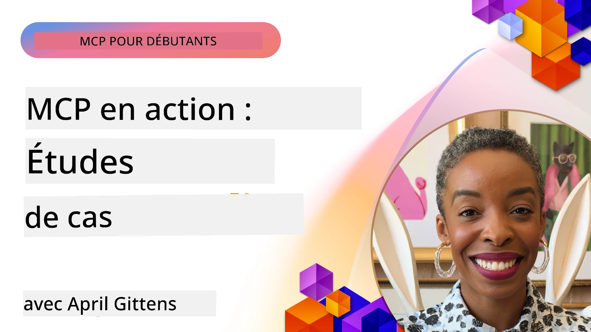

# MCP en Action : Études de Cas Réelles

_(Cliquez sur l’image ci-dessus pour voir la vidéo de cette leçon)_

Le Model Context Protocol (MCP) transforme la manière dont les applications d’IA interagissent avec les données, les outils et les services. Cette section présente des études de cas réelles qui illustrent des applications pratiques du MCP dans divers scénarios d’entreprise.

## Présentation

Cette section met en lumière des exemples concrets d’implémentations du MCP, soulignant comment les organisations utilisent ce protocole pour résoudre des défis métier complexes. En examinant ces études de cas, vous obtiendrez des informations sur la polyvalence, l’évolutivité et les bénéfices pratiques du MCP dans des scénarios réels.

## Objectifs d’Apprentissage Clés

En explorant ces études de cas, vous allez :

- Comprendre comment le MCP peut être appliqué pour résoudre des problèmes métier spécifiques
- Apprendre différents modèles d’intégration et approches architecturales
- Reconnaître les meilleures pratiques pour implémenter le MCP en environnement d’entreprise
- Obtenir des insights sur les défis et les solutions rencontrés lors d’implémentations réelles
- Identifier des opportunités pour appliquer des modèles similaires dans vos propres projets

## Études de Cas Présentées

### 1. [Agents de Voyage Azure AI – Implémentation Référence](./travelagentsample.md)

Cette étude de cas analyse la solution de référence complète de Microsoft qui montre comment construire une application de planification de voyage multi-agent pilotée par IA en utilisant MCP, Azure OpenAI, et Azure AI Search. Le projet illustre :

- Orchestration multi-agent via MCP
- Intégration des données d’entreprise avec Azure AI Search
- Architecture sécurisée et évolutive utilisant les services Azure
- Outils extensibles avec composants MCP réutilisables
- Expérience utilisateur conversationnelle propulsée par Azure OpenAI

Les détails d’architecture et d’implémentation fournissent des insights précieux pour construire des systèmes multi-agent complexes avec MCP comme couche de coordination.

### 2. [Mise à Jour des Items Azure DevOps depuis des Données YouTube](./UpdateADOItemsFromYT.md)

Cette étude de cas montre une application pratique du MCP pour automatiser des processus de workflow. Elle illustre comment les outils MCP peuvent être utilisés pour :

- Extraire des données depuis des plateformes en ligne (YouTube)
- Mettre à jour des éléments de travail dans Azure DevOps
- Créer des workflows d’automatisation répétables
- Intégrer des données entre systèmes disparates

Cet exemple montre comment des implémentations MCP même relativement simples peuvent apporter des gains d’efficacité importants en automatisant les tâches routinières et en améliorant la cohérence des données entre systèmes.

### 3. [Récupération de Documentation en Temps Réel avec MCP](./docs-mcp/README.md)

Cette étude de cas vous guide pour connecter un client console Python à un serveur Model Context Protocol (MCP) afin de récupérer et enregistrer de la documentation Microsoft contextuelle en temps réel. Vous apprendrez à :

- Vous connecter à un serveur MCP via un client Python et le SDK officiel MCP
- Utiliser des clients HTTP en streaming pour une récupération efficace et en temps réel des données
- Appeler les outils de documentation sur le serveur et enregistrer les réponses directement dans la console
- Intégrer la documentation Microsoft à jour dans votre flux de travail sans quitter le terminal

Le chapitre inclut un exercice pratique, un exemple de code réduite fonctionnel, et des liens vers des ressources complémentaires pour un apprentissage approfondi. Consultez le chapitre complet et le code lié pour comprendre comment le MCP peut transformer l’accès à la documentation et la productivité des développeurs dans un environnement console.

### 4. [Application Web Génératrice de Plans d'Étude Interactifs avec MCP](./docs-mcp/README.md)

Cette étude de cas montre comment construire une application web interactive en utilisant Chainlit et le Model Context Protocol (MCP) pour générer des plans d’étude personnalisés sur n’importe quel sujet. Les utilisateurs peuvent spécifier un domaine (par exemple « certification AI-900 ») et une durée d’étude (ex. 8 semaines), et l’application fournit une répartition hebdomadaire du contenu recommandé. Chainlit offre une interface de chat conversationnelle rendant l’expérience engageante et adaptative.

- Application web conversationnelle propulsée par Chainlit
- Invites utilisateurs pour définir le sujet et la durée
- Recommandations de contenu semaine par semaine utilisant MCP
- Réponses adaptatives en temps réel dans une interface de chat

Le projet illustre comment l’IA conversationnelle et le MCP peuvent être combinés pour créer des outils éducatifs dynamiques et pilotés par l’utilisateur dans un environnement web moderne.

### 5. [Documentation intégrée dans l’Éditeur avec MCP Server dans VS Code](./docs-mcp/README.md)

Cette étude de cas montre comment intégrer Microsoft Learn Docs directement dans votre environnement VS Code via le serveur MCP, plus besoin de changer d’onglet de navigateur ! Vous verrez comment :

- Rechercher et lire instantanément la documentation dans VS Code via le panneau MCP ou la palette de commandes
- Référencer la documentation et insérer des liens directement dans vos fichiers README ou markdown de cours
- Utiliser GitHub Copilot et MCP ensemble pour des workflows documentation et code pilotés par IA
- Valider et améliorer votre documentation grâce à des retours en temps réel et une précision issue de Microsoft
- Intégrer MCP aux workflows GitHub pour une validation continue de la documentation

L’implémentation inclut :

- Exemple de configuration `.vscode/mcp.json` pour une installation simple
- Guides illustrés par captures d’écran de l’expérience dans l’éditeur
- Astuces pour combiner Copilot et MCP afin d’optimiser la productivité

Ce scénario est idéal pour les auteurs de cours, rédacteurs de documentation et développeurs souhaitant rester concentrés dans leur éditeur tout en travaillant avec docs, Copilot, et outils de validation — tous propulsés par MCP.

### 6. [Création de Serveur MCP APIM](./apimsample.md)

Cette étude de cas offre un guide étape par étape pour créer un serveur MCP en utilisant Azure API Management (APIM). Elle couvre :

- Configuration d’un serveur MCP dans Azure API Management
- Exposition des opérations API comme outils MCP
- Configuration des politiques de limitation de débit et de sécurité
- Test du serveur MCP avec Visual Studio Code et GitHub Copilot

Cet exemple illustre comment exploiter les capacités d’Azure pour créer un serveur MCP robuste utilisable dans diverses applications, améliorant l’intégration des systèmes IA avec les APIs d’entreprise.

### 7. [Registre MCP GitHub — Accélérer l’Intégration Agentique](https://github.com/mcp)

Cette étude de cas analyse comment le Registre MCP de GitHub, lancé en septembre 2025, répond à un enjeu majeur de l’écosystème IA : la découverte fragmentée et le déploiement des serveurs Model Context Protocol (MCP).

#### Présentation
Le **Registre MCP** résout la difficulté croissante liée aux serveurs MCP dispersés dans divers dépôts et registres, ce qui rendait auparavant l’intégration lente et sujette aux erreurs. Ces serveurs permettent aux agents IA d’interagir avec des systèmes externes tels que APIs, bases de données et sources documentaires.

#### Énoncé du Problème
Les développeurs créant des workflows agentiques étaient confrontés à plusieurs défis :
- **Mauvaise découvrabilité** des serveurs MCP sur différentes plateformes
- **Questions redondantes d’installation** éparpillées dans forums et documentations
- **Risques de sécurité** provenant de sources non vérifiées et non fiables
- **Manque de standardisation** dans la qualité et la compatibilité des serveurs

#### Architecture de la Solution
Le Registre MCP de GitHub centralise les serveurs MCP de confiance avec des fonctionnalités clés :
- **Installation en un clic** via VS Code pour une configuration simplifiée
- **Tri signal sur bruit** basé sur étoiles, activité et validation communautaire
- **Intégration directe** avec GitHub Copilot et autres outils compatibles MCP
- **Modèle de contribution ouvert** permettant à la communauté et aux partenaires d’entreprise de contribuer

#### Impact Commercial
Le registre a apporté des améliorations mesurables :
- **Onboarding plus rapide** des développeurs utilisant des outils comme le Serveur MCP Microsoft Learn, qui diffuse la documentation officielle directement dans les agents
- **Productivité améliorée** via des serveurs spécialisés comme `github-mcp-server`, permettant l’automatisation GitHub en langage naturel (création PR, relance CI, scan de code)
- **Confiance renforcée de l’écosystème** grâce à des listings sélectionnés et des standards de configuration transparents

#### Valeur Stratégique
Pour les praticiens spécialisés en gestion du cycle de vie agentique et workflows reproductibles, le Registre MCP propose :
- **Déploiement modulaire d’agents** avec composants standardisés
- **Pipelines d’évaluation appuyés par le registre** pour des tests et validations cohérents
- **Interopérabilité inter-outils** permettant une intégration fluide entre différentes plateformes IA

Cette étude de cas montre que le Registre MCP n’est pas un simple annuaire, c’est une plateforme fondamentale pour une intégration modèle à grande échelle et un déploiement de systèmes agentiques en conditions réelles.

### 8. [Publication sur Réseaux Sociaux depuis un Agent](./publora-social-publishing.md)

Cette étude de cas décrit un **serveur MCP distant en écriture** — dont les outils effectuent des actions irréversibles pour le compte d’un utilisateur — en prenant la publication sociale comme exemple concret. Un agent rédige un post, un humain l’approuve, et le serveur le planifie sur les réseaux.

L’aspect intéressant est les contraintes de conception imposées par la publication, applicables à tout serveur qui écrit plutôt que lit :

- **Découverte ouverte, exécution authentifiée** — `tools/list` répond sans identifiants pour que registres et clients puissent introspecter, tandis que chaque `tools/call` nécessite un jeton et renvoie sinon `401` avec un en-tête `WWW-Authenticate`
- **Enregistrement OAuth sans étape hors bande** — enregistrement dynamique de client aujourd’hui, avec les Documents Métadonnées Client comme orientation de la spécification du `2026-07-28`
- **Annotations d’outil** (`readOnlyHint`, `destructiveHint`, `idempotentHint`) utilisées par les clients pour décider quoi confirmer — indices plutôt que contraintes, et exigés maintenant dans les répertoires de connecteurs lors des revues
- **Identifiants non inventables**, ainsi une valeur halluciné échoue bruyamment au lieu d’agir sur une valeur plausible
- **Clés d’idempotence sur les outils créant des posts**, de sorte qu’une nouvelle tentative du runtime agent ne crée pas une publication en double
- **Cible no-op décrite dans le schéma de l’outil** qui parcourt le chemin complet d’écriture sans rien publier, pour les réviseurs et l’intégration continue

Le chapitre se termine par une courte liste de contrôle à appliquer pour un serveur que vous développez.

## Conclusion

Ces huit études de cas complètes démontrent la remarquable polyvalence et les applications pratiques du Model Context Protocol dans des scénarios réels variés. Des systèmes complexes multi-agents de planification de voyage et gestion d’API d’entreprise aux workflows documentation simplifiés et au Registre MCP révolutionnaire de GitHub, ces exemples illustrent comment le MCP fournit un moyen standardisé et évolutif de connecter les systèmes IA aux outils, données et services dont ils ont besoin pour délivrer une valeur exceptionnelle.

Les études couvrent plusieurs dimensions de l’implémentation MCP :
- **Intégration d’Entreprise** : Azure API Management et automatisation Azure DevOps
- **Orchestration Multi-Agent** : planification de voyage avec agents IA coordonnés
- **Productivité Développeur** : intégration VS Code et accès documentation en temps réel
- **Développement d’Écosystème** : Registre MCP de GitHub comme plateforme fondamentale
- **Applications Éducatives** : générateurs de plans d’étude interactifs et interfaces conversationnelles

En étudiant ces implémentations, vous obtenez des perspectives critiques sur :
- **Modèles architecturaux** pour différentes échelles et cas d’usage
- **Stratégies d’implémentation** équilibrant fonctionnalité et maintenabilité
- **Considérations de sécurité et évolutivité** pour déploiements en production
- **Meilleures pratiques** pour le développement de serveurs MCP et intégration client
- **Pensée écosystémique** pour construire des solutions IA interconnectées

Ces exemples démontrent collectivement que le MCP n’est pas uniquement un cadre théorique, mais un protocole mature et prêt pour la production, permettant des solutions pratiques à des défis métier complexes. Que vous construisiez des outils d’automatisation simples ou des systèmes multi-agents sophistiqués, les modèles et approches illustrés ici fournissent une base solide pour vos propres projets MCP.

## Ressources Supplémentaires

- [Dépôt GitHub Azure AI Travel Agents](https://github.com/Azure-Samples/azure-ai-travel-agents)
- [Outil MCP Azure DevOps](https://github.com/microsoft/azure-devops-mcp)
- [Outil MCP Playwright](https://github.com/microsoft/playwright-mcp)
- [Serveur MCP Microsoft Docs](https://github.com/MicrosoftDocs/mcp)
- [Registre MCP GitHub — Accélérant l’Intégration Agentique](https://github.com/mcp)
- [Exemples Communautaires MCP](https://github.com/microsoft/mcp)

## Prochaines Étapes

- Précédent : [Module 8 : Meilleures Pratiques](../08-BestPractices/README.md)
- Suivant : [Module 10 : Rationalisation des Workflows IA : Construire un Serveur MCP avec AI Toolkit](../10-StreamliningAIWorkflowsBuildingAnMCPServerWithAIToolkit/README.md)

---

<!-- CO-OP TRANSLATOR DISCLAIMER START -->
**Avertissement** :
Ce document a été traduit à l'aide du service de traduction automatique [Co-op Translator](https://github.com/Azure/co-op-translator). Bien que nous nous efforçions d'assurer l'exactitude, veuillez noter que les traductions automatisées peuvent contenir des erreurs ou des inexactitudes. Le document original dans sa langue native doit être considéré comme la source faisant autorité. Pour les informations critiques, il est recommandé de recourir à une traduction professionnelle réalisée par un humain. Nous ne saurions être tenus responsables des malentendus ou erreurs d'interprétation découlant de l'utilisation de cette traduction.
<!-- CO-OP TRANSLATOR DISCLAIMER END -->