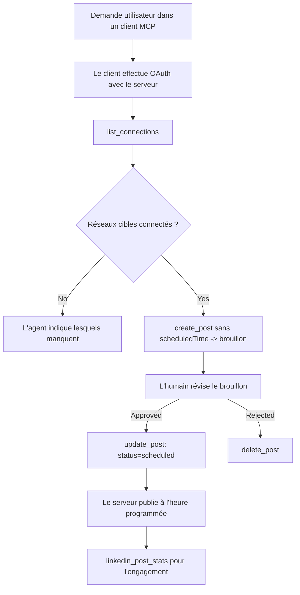

# Étude de cas : Publication sur les réseaux sociaux à partir d’un agent avec un serveur MCP distant

> **Avertissement :** Plusieurs services et projets open-source peuvent publier sur les réseaux sociaux, et une équipe pourrait aussi intégrer directement l’API de chaque réseau. Le scénario ci-dessous est fourni comme un exemple concret de la façon dont un **serveur MCP distant capable d’écrire** peut être conçu et utilisé. Publora est un service commercial avec un niveau gratuit ; les modèles décrits ici s’appliquent à tout serveur MCP qui effectue des actions irréversibles au nom d’un utilisateur.

## Vue d’ensemble

Les agents sont bons pour rédiger du contenu et mauvais pour le diffuser. Un modèle peut rédiger une annonce de sortie en quelques secondes, puis le travail s’arrête : la publication implique une API par réseau, une application OAuth par réseau, et un ensemble différent de règles médias pour chacun. La plupart des équipes résolvent cela en copiant le texte dans un navigateur à la main.

Cette étude de cas montre comment cette dernière étape est fermée avec un serveur MCP distant unique, et — plus utile pour quiconque en construit un — les décisions de conception qu’un serveur **capable d’écrire** doit prendre correctement. Lire des données est indulgent. Publier ne l’est pas : un appel d’outil incorrect est visible par un public et ne peut être annulé.

## Scénario

Une petite équipe de relations développeurs rédige des publications dans un agent (Claude, VS Code, Cursor — le client importe peu). Ils veulent que l’agent puisse :

- voir quels comptes sociaux l’équipe a connectés,
- rédiger une publication et la conserver comme brouillon pour qu’un humain l’approuve,
- joindre une image,
- la programmer sur plusieurs réseaux à une heure choisie,
- et plus tard rendre compte de ses performances.

Crucialement, ils veulent que l’agent soit *incapable* de publier par accident alors qu’ils expérimentent encore.

## Outils utilisés

- [Serveur MCP Publora](https://github.com/publora/mcp-server) — un serveur MCP distant (`streamable-http`) exposant des outils de publication, programmation, médias et statistiques LinkedIn. Enregistré dans le registre MCP officiel sous `com.publora/mcp-server`.

## Flux de travail étape par étape

1. **Connecter le serveur.** Les clients qui utilisent OAuth complètent le flux d’autorisation par code avec PKCE sur l’écran de consentement du serveur ; les clients ne le faisant pas, comme les CLI sans interface, utilisent une clé API Publora dans un en-tête. Les deux chemins sont supportés, et celui choisi dépend du client, pas du serveur.
2. **Lister les connexions.** L’agent appelle `list_connections` et reçoit les comptes connectés avec leurs identifiants.
3. **Rédiger.** L’agent appelle `create_post` *sans* horaire programmé. La publication est stockée comme brouillon — rien n’est publié.
4. **Joindre un média.** Les URL publiques d’images sont transmises dans le même appel ; le serveur les télécharge et les valide.
5. **Programmer.** Après approbation humaine, `update_post` définit le statut sur programmé avec une heure au format ISO 8601.
6. **Mesurer.** Pour LinkedIn, `linkedin_post_stats` retourne l’engagement une fois la publication en ligne.

## Exemple d’invite

```text
Which social accounts do I have connected?
Draft a post announcing our new changelog page, attach the screenshot at
https://example.com/changelog.png, and keep it as a draft — do not publish it.
Once I approve, schedule it to LinkedIn and Bluesky for tomorrow at 09:00 UTC.
```

## Diagramme Mermaid



## Implémentation technique

Les leçons ci-dessous sont la partie transférable de cette étude de cas.

### Découverte ouverte, exécution authentifiée

`tools/list` est servi sans identifiants ; chaque `tools/call` nécessite un jeton et renvoie sinon un `401` avec un en-tête `WWW-Authenticate` pointant sur les métadonnées de la ressource protégée. (Le serveur répond aussi à un `initialize` non authentifié, qui ne concerne que les clients sur des versions du protocole antérieures au `2026-07-28` ; cette révision a supprimé complètement la poignée de main.)

Cette séparation est importante en pratique. Les registres, catalogues et clients peuvent introspecter la surface des outils — noms, schémas, annotations — sans détenir de secret, alors que rien ne peut être *exécuté* anonymement. Un serveur qui exige un jeton pour `initialize` est effectivement invisible pour les outils ; un serveur autorisant les `tools/call` anonymes est une faille.

### Enregistrement : enregistrement dynamique du client, et ce qui le remplace

Le serveur annonce `/.well-known/oauth-protected-resource` et `/.well-known/oauth-authorization-server`, et supporte le flux d’autorisation par code avec PKCE (`S256`), les jetons de rafraîchissement, et **l’enregistrement dynamique du client**.

L’enregistrement dynamique supprime l’étape manuelle : sans lui, chaque client a besoin d’un `client_id` pré-délivré, ce qui implique une demande hors-bande au fournisseur pour chaque nouveau client.

Considérez cela comme un comportement de compatibilité plutôt que comme un modèle à copier. La révision de la spécification du `2026-07-28` déprécie l’enregistrement dynamique du client au profit des Documents de Métadonnées d’ID Client, où le client héberge un document de métadonnées à une URL HTTPS stable et cette URL *est* le `client_id`. L’enregistrement dynamique fonctionne encore pour l’instant, mais un serveur construit aujourd’hui devrait planifier CIMD et garder DCR seulement pour les clients plus anciens.

### Les annotations d’outil ne sont pas une décoration

Chaque outil porte un `title` et les pistes applicables : `readOnlyHint`, `destructiveHint`, `idempotentHint`, `openWorldHint`.

Deux raisons d’y investir. Premièrement, les clients utilisent ces pistes pour décider ce qu’ils doivent confirmer avec l’utilisateur — un client peut exécuter automatiquement une recherche en lecture seule et s’arrêter pour approbation avant une suppression. La spécification est explicite : les annotations sont des pistes non fiables, pas un mécanisme d’autorisation : elles façonnent ce qu’un client propose de faire, elles ne bloquent rien sur le serveur, et un serveur doit quand même appliquer ses propres règles. Deuxièmement, les principaux annuaires de connecteurs *exigent* désormais leur présence pour la revue ; un serveur dont les outils manquent de titres et de pistes sera refusé quelle que soit sa qualité fonctionnelle.

### Rendre les identifiants impossibles à inventer

Les identifiants de plateforme sont des chaînes opaques retournées par `list_connections`, et la description du schéma dit explicitement qu’ils doivent être copiés textuellement et jamais devinés. Le serveur refuse tout autre cas.

Les modèles sont d’habiles devineurs. Tout serveur capable d’écrire doit supposer qu’un identifiant sera éventuellement halluciné et doit faire échouer bruyamment et tôt ce chemin, plutôt que d’agir sur une valeur plausible.

### Échouer avant de publier, avec un message exploitable

Certains réseaux refusent les publications uniquement textuelles et exigent une image ou une vidéo. Cela est validé quand la publication est programmée, et l’erreur nomme la plateforme et l’exigence manquante.

Un agent peut récupérer de « Instagram nécessite un média — joignez une image ou une vidéo » sans autre aller-retour. Il ne peut pas récupérer d’un `400` générique.

### Rendre les réessais sûrs

Les deux outils qui créent du contenu, `create_post` et `update_post`, acceptent une clé d’empotence : la réutiliser avec une requête identique rejoue la réponse originale au lieu de créer une deuxième publication. Les environnements d’exécution des agents réessaient sur timeout ; sans empotence, une réponse lente devient une double publication. Les autres outils d’écriture — suppressions, étapes médias, réactions et commentaires LinkedIn — n’en prennent pas, donc un réessai là n’est pas automatiquement sûr. Il vaut la peine de savoir lesquelles de vos mutations sont protégées et lesquelles ne le sont pas.

### Fournir un moyen de tester sans publier rien

Le serveur accepte une cible réservée, `publora-playground`, qui est validée et reconnue comme une vraie destination puis ignorée — rien n’atteint un compte réel. Elle est décrite dans le schéma de l’outil lui-même, que n’importe quel client peut lire sans identifiants : le champ `platforms` de `create_post` la documente comme « une cible teste-connexion qui ne nécessite aucune connexion réelle — la publication est reconnue puis jetée, rien n’est publié ». Invoquez-la en la passant comme unique entrée : `platforms: ["publora-playground"]`.

Cela s’est avéré être un des détails les plus utiles de toute la surface. Les reviewers des annuaires de connecteurs, les contributeurs et l’intégration continue peuvent exercer tout le chemin d’écriture de bout en bout sans risque pour un vrai public. Tout serveur MCP avec actions irréversibles bénéficie d’une cible no-op documentée.

## Résultats et impact

- L’étape de publication est passée d’un navigateur à la même conversation où le contenu est écrit, et une habitude « brouillon d’abord » maintient un humain dans la boucle. Soyez précis sur ce que cela signifie : un brouillon est une convention, pas une frontière. La même authentification peut programmer ou publier, donc toute personne nécessitant un véritable contrôle d’approbation doit l’appliquer en dehors de la surface de l’outil — des identifiants séparés ou une couche de politique devant le serveur.
- Les différences par réseau — exigences media, fils de discussion, contrôles de réponse — sont traitées une fois dans le serveur au lieu d’être dupliquées dans chaque agent qui en parle.
- Le même serveur alimente plusieurs clients MCP sans travail par client, car la découverte est ouverte et l’enregistrement est dynamique.
- Les contraintes de conception ci-dessus ont été façonnées autant par les revues des annuaires de connecteurs que par les utilisateurs : annotations, OAuth et une cible test sûre ont été chacun requis par au moins un d’entre eux.

## Références

- [Serveur MCP Publora (source)](https://github.com/publora/mcp-server)
- [API Publora et documentation MCP](https://docs.publora.com)
- [Entrée du registre MCP : `com.publora/mcp-server`](https://registry.modelcontextprotocol.io/v0/servers?search=com.publora/mcp-server)
- [Spécification MCP — Autorisation](https://modelcontextprotocol.io/specification/draft/basic/authorization)
- [Spécification MCP — Annotations d’outil](https://modelcontextprotocol.io/docs/concepts/tools)

## Ce qui suit

- Prenez un serveur MCP que vous construisez et vérifiez les trois gains les moins coûteux ici : annotations sur chaque outil, clé d’empotence sur chaque écriture, et cible no-op documentée.
- Essayez la séparation découverte ouverte : appelez `tools/list` contre un serveur distant public sans identifiants, puis appelez un outil et inspectez le challenge `401`.
- Réfléchissez à ce que signifie « annuler » pour votre domaine. La publication a des brouillons et des suppressions ; si vos actions n’ont pas d’équivalent, la confirmation doit être dans la conception de l’outil, pas dans l’invite.

---

<!-- CO-OP TRANSLATOR DISCLAIMER START -->
**Avertissement** :
Ce document a été traduit à l'aide du service de traduction automatique [Co-op Translator](https://github.com/Azure/co-op-translator). Bien que nous nous efforçions d'assurer l'exactitude, veuillez noter que les traductions automatisées peuvent contenir des erreurs ou des inexactitudes. Le document original dans sa langue native doit être considéré comme la source faisant autorité. Pour les informations critiques, il est recommandé de recourir à une traduction professionnelle réalisée par un humain. Nous ne saurions être tenus responsables des malentendus ou erreurs d'interprétation découlant de l'utilisation de cette traduction.
<!-- CO-OP TRANSLATOR DISCLAIMER END -->