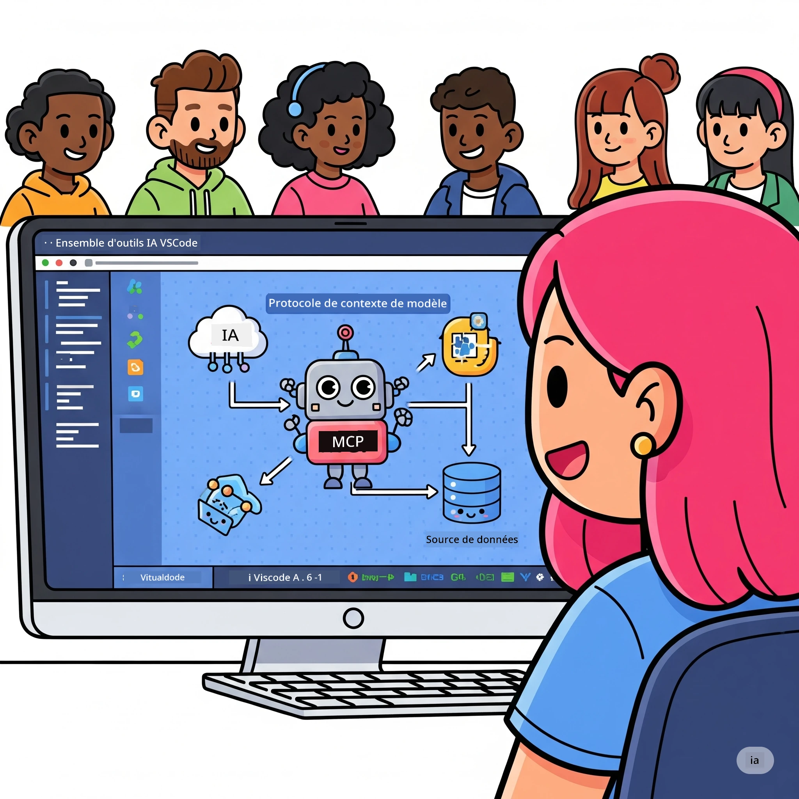
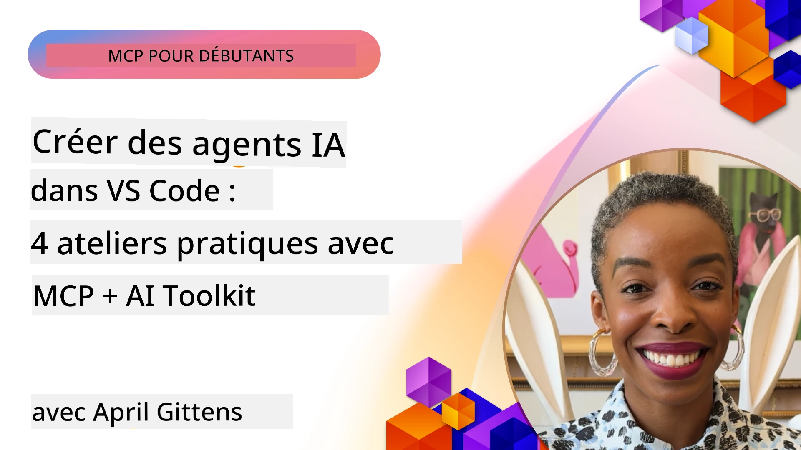

# Rationalisation des flux de travail IA : Création d'un serveur MCP avec Microsoft Foundry Toolkit

## 🎯 Aperçu

_(Cliquez sur l'image ci-dessus pour regarder la vidéo de cette leçon)_

Bienvenue à l'**Atelier Model Context Protocol (MCP)** ! Cet atelier pratique complet combine deux technologies de pointe pour révolutionner le développement d'applications IA :

> **Note de compatibilité :** le code de l’atelier a été construit et testé avec MCP
> `2025-11-25`, comme l’indique le badge ci-dessus. Utilisez la
> [spécification actuelle `2026-07-28`](https://modelcontextprotocol.io/specification/2026-07-28/)
> pour les nouvelles implémentations du protocole et consultez les notes de version du SDK avant
> de migrer les labs.

- **🔗 Model Context Protocol (MCP)** : Une norme ouverte pour une intégration transparente des outils IA
- **🛠️ Extension Microsoft Foundry Toolkit pour VS Code** : L’extension puissante de Microsoft pour le développement IA

### 🎓 Ce que vous apprendrez

À la fin de cet atelier, vous maîtriserez l’art de construire des applications intelligentes qui font le pont entre les modèles IA et les outils et services du monde réel. De l'automatisation des tests à l’intégration personnalisée d’API, vous acquerrez des compétences pratiques pour résoudre des défis métiers complexes.

## 🏗️ Pile technologique

### 🔌 Model Context Protocol (MCP)

MCP est la **« USB-C pour l'IA »** – une norme universelle qui connecte les modèles IA à des outils et sources de données externes.

**✨ Fonctionnalités clés :**

- 🔄 **Intégration standardisée** : Interface universelle pour les connexions outils-IA
- 🏛️ **Architecture flexible** : Serveurs locaux et distants via transport stdio/SSE
- 🧰 **Écosystème riche** : Outils, prompts et ressources dans un seul protocole
- 🔒 **Prêt pour l’entreprise** : Sécurité et fiabilité intégrées

**🎯 Pourquoi MCP est important :**
Tout comme l’USB-C a éliminé le chaos des câbles, MCP élimine la complexité des intégrations IA. Un protocole, des possibilités infinies.

### 🤖 Extension Microsoft Foundry Toolkit pour VS Code

L’extension phare de Microsoft pour le développement IA qui transforme VS Code en une centrale IA.

**🚀 Capacités principales :**

- 📦 **Catalogue de modèles** : Accès aux modèles Azure AI, GitHub, Hugging Face, Ollama
- ⚡ **Inférence locale** : Exécution optimisée ONNX CPU/GPU/NPU
- 🏗️ **Agent Builder** : Développement visuel d’agents IA avec intégration MCP
- 🎭 **Multi-modal** : Support du texte, vision et sorties structurées

**💡 Bénéfices du développement :**

- Déploiement de modèles sans configuration
- Ingénierie visuelle de prompts
- Terrain de jeu de test en temps réel
- Intégration transparente du serveur MCP

## 📚 Parcours d'apprentissage

### [🚀 Module 1 : Principes fondamentaux de Microsoft Foundry Toolkit](./lab1/README.md)

**Durée** : 15 minutes

- 🛠️ Installer et configurer Microsoft Foundry Toolkit pour VS Code
- 🗂️ Explorer le Catalogue de modèles (100+ modèles de GitHub, ONNX, OpenAI, Anthropic, Google)
- 🎮 Maîtriser le terrain de jeu interactif pour le test en temps réel des modèles
- 🤖 Construire votre premier agent IA avec Agent Builder
- 📊 Évaluer la performance du modèle avec des métriques intégrées (F1, pertinence, similarité, cohérence)
- ⚡ Découvrir le traitement par lots et le support multi-modal

**🎯 Résultat d’apprentissage** : Créer un agent IA fonctionnel avec une compréhension complète des capacités de Microsoft Foundry Toolkit

### [🌐 Module 2 : MCP avec Microsoft Foundry Toolkit Fondamentaux](./lab2/README.md)

**Durée** : 20 minutes

- 🧠 Maîtriser l’architecture et les concepts du Model Context Protocol (MCP)
- 🌐 Explorer l’écosystème des serveurs MCP de Microsoft
- 🤖 Construire un agent d'automatisation de navigateur avec Playwright MCP server
- 🔧 Intégrer des serveurs MCP avec Microsoft Foundry Toolkit Agent Builder
- 📊 Configurer et tester les outils MCP dans vos agents
- 🚀 Exporter et déployer des agents alimentés par MCP en production

**🎯 Résultat d’apprentissage** : Déployer un agent IA boosté par des outils externes via MCP

### [🔧 Module 3 : Développement avancé MCP avec Microsoft Foundry Toolkit](./lab3/README.md)

**Durée** : 20 minutes

- 💻 Créer des serveurs MCP personnalisés avec Microsoft Foundry Toolkit
- 🐍 Configurer et utiliser le dernier SDK MCP Python (v1.9.3)
- 🔍 Mettre en place et utiliser MCP Inspector pour le débogage
- 🛠️ Construire un serveur Weather MCP avec des workflows de débogage professionnels
- 🧪 Déboguer les serveurs MCP à la fois dans Agent Builder et Inspector

**🎯 Résultat d’apprentissage** : Développer et déboguer des serveurs MCP personnalisés avec des outils modernes

### [🐙 Module 4 : Développement MCP pratique - Serveur GitHub Clone personnalisé](./lab4/README.md)

**Durée** : 30 minutes

- 🏗️ Construire un serveur GitHub Clone MCP réel pour les workflows de développement
- 🔄 Implémenter un clonage de dépôt intelligent avec validation et gestion des erreurs
- 📁 Créer une gestion intelligente des répertoires et intégration VS Code
- 🤖 Utiliser GitHub Copilot Agent Mode avec des outils MCP personnalisés
- 🛡️ Appliquer la fiabilité prête pour la production et la compatibilité multiplateforme

**🎯 Résultat d’apprentissage** : Déployer un serveur MCP prêt pour la production qui rationalise les workflows de développement réels

## 💡 Applications et impact dans le monde réel

### 🏢 Cas d’utilisation en entreprise

#### 🔄 Automatisation DevOps

Transformez votre flux de développement par l’automatisation intelligente :

- **Gestion intelligente des dépôts** : Revue de code et décisions de fusion pilotées par IA
- **CI/CD intelligente** : Optimisation automatisée des pipelines basée sur les changements de code
- **Tri des problèmes** : Classification et assignation automatique des bugs

#### 🧪 Révolution de l’assurance qualité

Élevez les tests avec l’automatisation assistée par IA :

- **Génération intelligente de tests** : Création automatique de suites de tests complètes
- **Tests de régression visuels** : Détection des changements UI assistée par IA
- **Surveillance des performances** : Identification proactive et résolution des problèmes

#### 📊 Intelligence des pipelines de données

Construisez des workflows de traitement des données plus intelligents :

- **Processus ETL adaptatifs** : Transformations de données auto-optimisées
- **Détection d’anomalies** : Surveillance en temps réel de la qualité des données
- **Routage intelligent** : Gestion intelligente du flux des données

#### 🎧 Amélioration de l’expérience client

Créez des interactions clients exceptionnelles :

- **Support contextuel** : Agents IA avec accès à l’historique client
- **Résolution proactive des problèmes** : Service client prédictif
- **Intégration multi-canaux** : Expérience IA unifiée sur plusieurs plateformes

## 🛠️ Prérequis et installation

### 💻 Configuration système

| Composant | Exigence | Notes |
|-----------|-------------|-------|
| **Système d’exploitation** | Windows 10+, macOS 10.15+, Linux | Tout OS moderne |
| **Visual Studio Code** | Dernière version stable | Requis pour Microsoft Foundry Toolkit |
| **Node.js** | v18.0+ et npm | Pour le développement serveur MCP |
| **Python** | 3.10+ | Optionnel pour serveurs MCP Python |
| **Mémoire** | Minimum 8 Go RAM | 16 Go recommandés pour modèles locaux |

### 🔧 Environnement de développement

#### Extensions VS Code recommandées

- **Microsoft Foundry Toolkit** (ms-windows-ai-studio.windows-ai-studio)
- **Python** (ms-python.python)
- **Python Debugger** (ms-python.debugpy)
- **GitHub Copilot** (GitHub.copilot) - Optionnel mais utile

#### Outils optionnels

- **uv** : Gestionnaire de paquets Python moderne
- **MCP Inspector** : Outil visuel de débogage pour serveurs MCP
- **Playwright** : Pour exemples d’automatisation web

## 🎖️ Résultats d'apprentissage & parcours de certification

### 🏆 Liste de maîtrise des compétences

En complétant cet atelier, vous atteindrez la maîtrise de :

#### 🎯 Compétences principales

- [ ] **Maîtrise du protocole MCP** : Compréhension approfondie de l’architecture et des modèles d’implémentation
- [ ] **Compétence Microsoft Foundry Toolkit** : Usage expert de Microsoft Foundry Toolkit pour développement rapide
- [ ] **Développement de serveurs personnalisés** : Construire, déployer et maintenir des serveurs MCP en production
- [ ] **Excellence en intégration d’outils** : Connecter de manière transparente l’IA aux workflows de développement existants
- [ ] **Application de résolution de problèmes** : Appliquer les compétences acquises à des défis métiers réels

#### 🔧 Compétences techniques

- [ ] Installer et configurer Microsoft Foundry Toolkit dans VS Code
- [ ] Concevoir et implémenter des serveurs MCP personnalisés
- [ ] Intégrer des modèles GitHub avec l’architecture MCP
- [ ] Construire des workflows de tests automatisés avec Playwright
- [ ] Déployer des agents IA pour l’utilisation en production
- [ ] Déboguer et optimiser les performances du serveur MCP

#### 🚀 Capacités avancées

- [ ] Architecturer des intégrations IA à l’échelle de l’entreprise
- [ ] Mettre en œuvre les meilleures pratiques de sécurité pour applications IA
- [ ] Concevoir des architectures serveur MCP évolutives
- [ ] Créer des chaînes d’outils personnalisées pour domaines spécifiques
- [ ] Encadrer d’autres développeurs IA natifs

## 📖 Ressources supplémentaires

- [Spécification MCP (2026-07-28)](https://modelcontextprotocol.io/specification/2026-07-28/)
- [Dépôt GitHub Microsoft Foundry Toolkit](https://github.com/microsoft/vscode-ai-toolkit)
- [Collection d’exemples de serveurs MCP](https://github.com/modelcontextprotocol/servers)
- [Guide des meilleures pratiques](https://modelcontextprotocol.io/docs/best-practices)
- [OWASP MCP Top 10](https://microsoft.github.io/mcp-azure-security-guide/mcp/) - Meilleures pratiques de sécurité

---

**🚀 Prêt à révolutionner votre flux de développement IA ?**

Construisons ensemble le futur des applications intelligentes avec MCP et Microsoft Foundry Toolkit !

## Et ensuite

Continuez vers : [Module 11 : Labs pratiques MCP Server](../11-MCPServerHandsOnLabs/README.md)

---

<!-- CO-OP TRANSLATOR DISCLAIMER START -->
**Avertissement** :
Ce document a été traduit à l'aide du service de traduction automatique [Co-op Translator](https://github.com/Azure/co-op-translator). Bien que nous nous efforçions d'assurer l'exactitude, veuillez noter que les traductions automatisées peuvent contenir des erreurs ou des inexactitudes. Le document original dans sa langue native doit être considéré comme la source faisant autorité. Pour les informations critiques, il est recommandé de recourir à une traduction professionnelle réalisée par un humain. Nous ne saurions être tenus responsables des malentendus ou erreurs d'interprétation découlant de l'utilisation de cette traduction.
<!-- CO-OP TRANSLATOR DISCLAIMER END -->