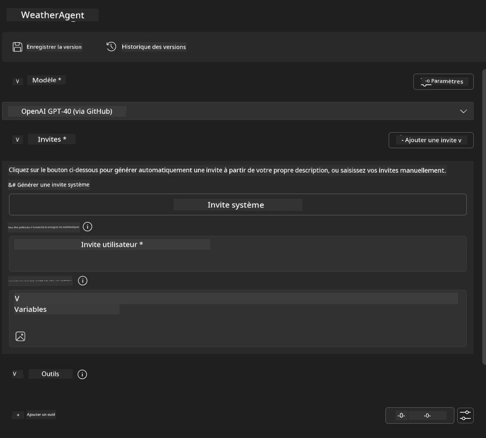
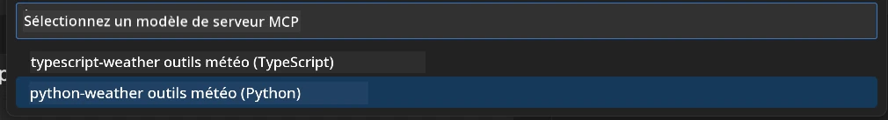
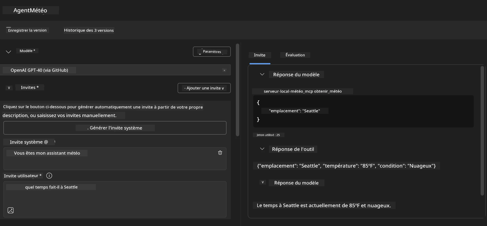
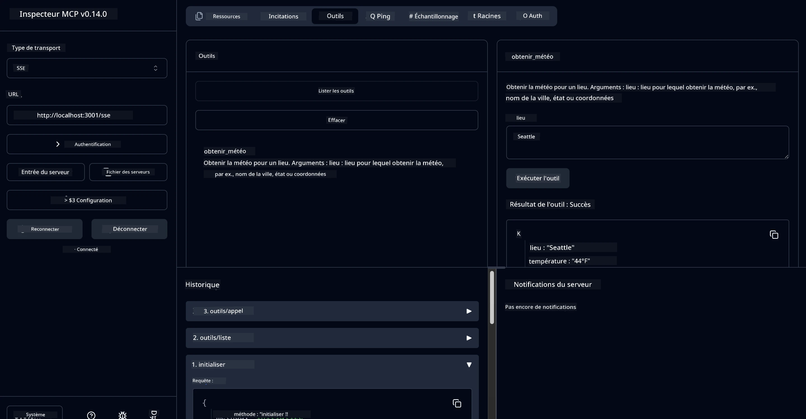

# 🔧 Module 3 : Développement avancé MCP avec Microsoft Foundry Toolkit

> [!NOTE]
> Les URL de l'Inspecteur dans ce laboratoire utilisent l'ancien point de terminaison `/sse` et ciblent les dépendances MCP SDK `1.9.3` et Inspector `0.14.0` épinglées. Ce ne sont pas des exemples actuels HTTP Streamable au `2026-07-28`.


## 🎯 Objectifs d'apprentissage

À la fin de ce laboratoire, vous serez capable de :

- ✅ Créer des serveurs MCP personnalisés en utilisant Microsoft Foundry Toolkit
- ✅ Configurer et utiliser le SDK Python MCP le plus récent (v1.9.3)
- ✅ Mettre en place et utiliser le MCP Inspector pour le débogage
- ✅ Déboguer les serveurs MCP à la fois dans Agent Builder et dans l'environnement Inspector
- ✅ Comprendre les flux de travail avancés de développement de serveur MCP

## 📋 Pré-requis

- Avoir complété le Laboratoire 2 (Fondamentaux MCP)
- VS Code avec l'extension Microsoft Foundry Toolkit installée
- Environnement Python 3.10+
- Node.js et npm pour la configuration de l'Inspecteur

## 🏗️ Ce que vous allez construire

Dans ce laboratoire, vous créerez un **Serveur Weather MCP** qui démontre :
- Implémentation personnalisée de serveur MCP
- Intégration avec Microsoft Foundry Toolkit Agent Builder
- Flux de travail professionnel de débogage
- Utilisation moderne des modèles MCP SDK

---

## 🔧 Vue d'ensemble des composants clés

### 🐍 SDK Python MCP
Le SDK Python du Model Context Protocol fournit la base pour construire des serveurs MCP personnalisés. Vous utiliserez la version 1.9.3 avec des capacités de débogage améliorées.

### 🔍 MCP Inspector
Un outil puissant de débogage qui fournit :
- Surveillance du serveur en temps réel
- Visualisation de l'exécution des outils
- Inspection des requêtes/réponses réseau
- Environnement de test interactif

---

## 📖 Mise en œuvre pas à pas

### Étape 1 : Créer un WeatherAgent dans Agent Builder

1. **Lancer Agent Builder** dans VS Code via l'extension Microsoft Foundry Toolkit
2. **Créer un nouvel agent** avec la configuration suivante :
   - Nom de l'agent : `WeatherAgent`



### Étape 2 : Initialiser le projet du serveur MCP

1. **Naviguer vers Outils** → **Ajouter un Outil** dans Agent Builder
2. **Sélectionner "Serveur MCP"** parmi les options disponibles
3. **Choisir "Créer un nouveau Serveur MCP"**
4. **Sélectionner le modèle `python-weather`**
5. **Nommer votre serveur :** `weather_mcp`



### Étape 3 : Ouvrir et examiner le projet

1. **Ouvrir le projet généré** dans VS Code
2. **Examiner la structure du projet :**
   ```
   weather_mcp/
   ├── src/
   │   ├── __init__.py
   │   └── server.py
   ├── inspector/
   │   ├── package.json
   │   └── package-lock.json
   ├── .vscode/
   │   ├── launch.json
   │   └── tasks.json
   ├── pyproject.toml
   └── README.md
   ```

### Étape 4 : Mettre à jour vers la dernière version du SDK MCP

> **🔍 Pourquoi mettre à jour ?** Nous voulons utiliser la dernière version du SDK MCP (v1.9.3) et le service Inspector (0.14.0) pour des fonctionnalités améliorées et de meilleures capacités de débogage.

#### 4a. Mettre à jour les dépendances Python

**Modifier `pyproject.toml` :** mettre à jour [./code/weather_mcp/pyproject.toml](../../../../10-StreamliningAIWorkflowsBuildingAnMCPServerWithAIToolkit/lab3/code/weather_mcp/pyproject.toml)


#### 4b. Mettre à jour la configuration de l'Inspecteur

**Modifier `inspector/package.json` :** mettre à jour [./code/weather_mcp/inspector/package.json](../../../../10-StreamliningAIWorkflowsBuildingAnMCPServerWithAIToolkit/lab3/code/weather_mcp/inspector/package.json)

#### 4c. Mettre à jour les dépendances de l'Inspecteur

**Modifier `inspector/package-lock.json` :** mettre à jour [./code/weather_mcp/inspector/package-lock.json](../../../../10-StreamliningAIWorkflowsBuildingAnMCPServerWithAIToolkit/lab3/code/weather_mcp/inspector/package-lock.json)

> **📝 Note :** Ce fichier contient des définitions de dépendances très détaillées. Ci-dessous la structure essentielle - le contenu complet garantit une résolution correcte des dépendances.


> **⚡ Verrouillage complet du paquet :** Le fichier package-lock.json complet contient environ 3000 lignes de définitions de dépendances. Ce qui précède montre la structure clé - utilisez le fichier fourni pour une résolution complète.

### Étape 5 : Configurer le débogage dans VS Code

*Remarque : veuillez copier le fichier dans le chemin indiqué pour remplacer le fichier local correspondant*

#### 5a. Mettre à jour la configuration de lancement

**Modifier `.vscode/launch.json` :**

```json
{
  "version": "0.2.0",
  "configurations": [
    {
      "name": "Attach to Local MCP",
      "type": "debugpy",
      "request": "attach",
      "connect": {
        "host": "localhost",
        "port": 5678
      },
      "presentation": {
        "hidden": true
      },
      "internalConsoleOptions": "neverOpen",
      "postDebugTask": "Terminate All Tasks"
    },
    {
      "name": "Launch Inspector (Edge)",
      "type": "msedge",
      "request": "launch",
      "url": "http://localhost:6274?timeout=60000&serverUrl=http://localhost:3001/sse#tools",
      "cascadeTerminateToConfigurations": [
        "Attach to Local MCP"
      ],
      "presentation": {
        "hidden": true
      },
      "internalConsoleOptions": "neverOpen"
    },
    {
      "name": "Launch Inspector (Chrome)",
      "type": "chrome",
      "request": "launch",
      "url": "http://localhost:6274?timeout=60000&serverUrl=http://localhost:3001/sse#tools",
      "cascadeTerminateToConfigurations": [
        "Attach to Local MCP"
      ],
      "presentation": {
        "hidden": true
      },
      "internalConsoleOptions": "neverOpen"
    }
  ],
  "compounds": [
    {
      "name": "Debug in Agent Builder",
      "configurations": [
        "Attach to Local MCP"
      ],
      "preLaunchTask": "Open Agent Builder",
    },
    {
      "name": "Debug in Inspector (Edge)",
      "configurations": [
        "Launch Inspector (Edge)",
        "Attach to Local MCP"
      ],
      "preLaunchTask": "Start MCP Inspector",
      "stopAll": true
    },
    {
      "name": "Debug in Inspector (Chrome)",
      "configurations": [
        "Launch Inspector (Chrome)",
        "Attach to Local MCP"
      ],
      "preLaunchTask": "Start MCP Inspector",
      "stopAll": true
    }
  ]
}
```

**Modifier `.vscode/tasks.json` :**

```
{
  "version": "2.0.0",
  "tasks": [
    {
      "label": "Start MCP Server",
      "type": "shell",
      "command": "python -m debugpy --listen 127.0.0.1:5678 src/__init__.py sse",
      "isBackground": true,
      "options": {
        "cwd": "${workspaceFolder}",
        "env": {
          "PORT": "3001"
        }
      },
      "problemMatcher": {
        "pattern": [
          {
            "regexp": "^.*$",
            "file": 0,
            "location": 1,
            "message": 2
          }
        ],
        "background": {
          "activeOnStart": true,
          "beginsPattern": ".*",
          "endsPattern": "Application startup complete|running"
        }
      }
    },
    {
      "label": "Start MCP Inspector",
      "type": "shell",
      "command": "npm run dev:inspector",
      "isBackground": true,
      "options": {
        "cwd": "${workspaceFolder}/inspector",
        "env": {
          "CLIENT_PORT": "6274",
          "SERVER_PORT": "6277",
        }
      },
      "problemMatcher": {
        "pattern": [
          {
            "regexp": "^.*$",
            "file": 0,
            "location": 1,
            "message": 2
          }
        ],
        "background": {
          "activeOnStart": true,
          "beginsPattern": "Starting MCP inspector",
          "endsPattern": "Proxy server listening on port"
        }
      },
      "dependsOn": [
        "Start MCP Server"
      ]
    },
    {
      "label": "Open Agent Builder",
      "type": "shell",
      "command": "echo ${input:openAgentBuilder}",
      "presentation": {
        "reveal": "never"
      },
      "dependsOn": [
        "Start MCP Server"
      ],
    },
    {
      "label": "Terminate All Tasks",
      "command": "echo ${input:terminate}",
      "type": "shell",
      "problemMatcher": []
    }
  ],
  "inputs": [
    {
      "id": "openAgentBuilder",
      "type": "command",
      "command": "ai-mlstudio.agentBuilder",
      "args": {
        "initialMCPs": [ "local-server-weather_mcp" ],
        "triggeredFrom": "vsc-tasks"
      }
    },
    {
      "id": "terminate",
      "type": "command",
      "command": "workbench.action.tasks.terminate",
      "args": "terminateAll"
    }
  ]
}
```


---

## 🚀 Exécuter et tester votre serveur MCP

### Étape 6 : Installer les dépendances

Après avoir effectué les modifications de configuration, exécutez les commandes suivantes :

**Installer les dépendances Python :**
```bash
uv sync
```

**Installer les dépendances de l'Inspecteur :**
```bash
cd inspector
npm install
```

### Étape 7 : Déboguer avec Agent Builder

1. **Appuyez sur F5** ou utilisez la configuration **"Déboguer dans Agent Builder"**
2. **Sélectionnez la configuration compound** dans le panneau de débogage
3. **Attendez le démarrage du serveur** et l'ouverture d'Agent Builder
4. **Testez votre serveur Weather MCP** avec des requêtes en langage naturel

Entrez une invite comme celle-ci

SYSTEM_PROMPT

```
You are my weather assistant
```

USER_PROMPT

```
How's the weather like in Seattle
```



### Étape 8 : Déboguer avec MCP Inspector

1. **Utilisez la configuration "Déboguer dans Inspector"** (Edge ou Chrome)
2. **Ouvrez l'interface Inspecteur** à `http://localhost:6274`
3. **Explorez l'environnement de test interactif :**
   - Voir les outils disponibles
   - Tester l'exécution d'outils
   - Surveiller les requêtes réseau
   - Déboguer les réponses du serveur



---

## 🎯 Principaux résultats d'apprentissage

En complétant ce laboratoire, vous avez :

- [x] **Créé un serveur MCP personnalisé** en utilisant les modèles Microsoft Foundry Toolkit
- [x] **Mis à jour vers le dernier SDK MCP** (v1.9.3) pour des fonctionnalités améliorées
- [x] **Configuré des flux de travail professionnels de débogage** pour Agent Builder et Inspector
- [x] **Mis en place MCP Inspector** pour des tests interactifs du serveur
- [x] **Maîtrisé les configurations de débogage VS Code** pour le développement MCP

## 🔧 Fonctionnalités avancées explorées

| Fonctionnalité | Description | Cas d'utilisation |
|---------|-------------|----------|
| **SDK Python MCP v1.9.3** | Dernière implémentation du protocole | Développement serveur moderne |
| **MCP Inspector 0.14.0** | Outil de débogage interactif | Test serveur en temps réel |
| **Débogage VS Code** | Environnement de développement intégré | Flux de travail de débogage professionnel |
| **Intégration Agent Builder** | Connexion directe à Microsoft Foundry Toolkit | Test complet des agents |

## 📚 Ressources supplémentaires

- [Documentation SDK Python MCP](https://modelcontextprotocol.io/docs/sdk/python)
- [Guide de l'extension Microsoft Foundry Toolkit](https://code.visualstudio.com/docs/ai/ai-toolkit)
- [Documentation du débogage VS Code](https://code.visualstudio.com/docs/editor/debugging)
- [Spécification Model Context Protocol](https://modelcontextprotocol.io/docs/concepts/architecture)

---

**🎉 Félicitations !** Vous avez complété avec succès le Laboratoire 3 et êtes désormais capable de créer, déboguer et déployer des serveurs MCP personnalisés en utilisant des flux de travail de développement professionnels.

### 🔜 Poursuivre vers le module suivant

Prêt à appliquer vos compétences MCP dans un flux de travail de développement réel ? Continuez vers **[Module 4 : Développement pratique MCP - Serveur de clonage GitHub personnalisé](../lab4/README.md)** où vous allez :
- Construire un serveur MCP prêt pour la production qui automatise les opérations de dépôt GitHub
- Implémenter la fonctionnalité de clonage de dépôts GitHub via MCP
- Intégrer des serveurs MCP personnalisés avec VS Code et GitHub Copilot Agent Mode
- Tester et déployer des serveurs MCP personnalisés en environnement de production
- Apprendre l'automatisation pratique des flux de travail pour les développeurs

---

<!-- CO-OP TRANSLATOR DISCLAIMER START -->
**Avertissement** :
Ce document a été traduit à l'aide du service de traduction automatique [Co-op Translator](https://github.com/Azure/co-op-translator). Bien que nous nous efforçions d'assurer l'exactitude, veuillez noter que les traductions automatisées peuvent contenir des erreurs ou des inexactitudes. Le document original dans sa langue native doit être considéré comme la source faisant autorité. Pour les informations critiques, il est recommandé de recourir à une traduction professionnelle réalisée par un humain. Nous ne saurions être tenus responsables des malentendus ou erreurs d'interprétation découlant de l'utilisation de cette traduction.
<!-- CO-OP TRANSLATOR DISCLAIMER END -->