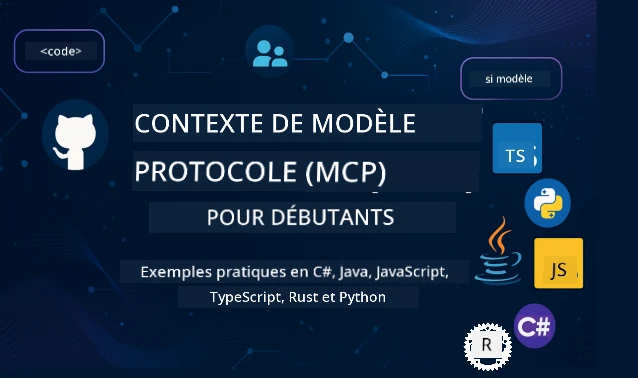

 

[](https://GitHub.com/microsoft/mcp-for-beginners/graphs/contributors)
[](https://GitHub.com/microsoft/mcp-for-beginners/issues)
[](https://GitHub.com/microsoft/mcp-for-beginners/pulls)
[](http://makeapullrequest.com)
[](https://mcptoplist.com/server/mcp.so%2Fmcp-for-beginners%2Fmicrosoft)

[](https://GitHub.com/microsoft/mcp-for-beginners/watchers)
[](https://GitHub.com/microsoft/mcp-for-beginners/fork)
[](https://GitHub.com/microsoft/mcp-for-beginners/stargazers)


[](https://discord.gg/nTYy5BXMWG)

Suivez ces étapes pour commencer à utiliser ces ressources :
1. **Fork du dépôt** : Cliquez sur [](https://GitHub.com/microsoft/mcp-for-beginners/fork)
2. **Clonez le dépôt** :   `git clone https://github.com/microsoft/mcp-for-beginners.git`
3. **Rejoignez le** [](https://discord.gg/nTYy5BXMWG)


### 🌐 Support multilingue

#### Pris en charge via GitHub Action (automatisé et toujours à jour)

<!-- CO-OP TRANSLATOR LANGUAGES TABLE START -->
[Arabic](../ar/README.md) | [Bengali](../bn/README.md) | [Bulgarian](../bg/README.md) | [Burmese (Myanmar)](../my/README.md) | [Chinese (Simplified)](../zh-CN/README.md) | [Chinese (Traditional, Hong Kong)](../zh-HK/README.md) | [Chinese (Traditional, Macau)](../zh-MO/README.md) | [Chinese (Traditional, Taiwan)](../zh-TW/README.md) | [Croatian](../hr/README.md) | [Czech](../cs/README.md) | [Danish](../da/README.md) | [Dutch](../nl/README.md) | [Estonian](../et/README.md) | [Finnish](../fi/README.md) | [French](./README.md) | [German](../de/README.md) | [Greek](../el/README.md) | [Hebrew](../he/README.md) | [Hindi](../hi/README.md) | [Hungarian](../hu/README.md) | [Indonesian](../id/README.md) | [Italian](../it/README.md) | [Japanese](../ja/README.md) | [Kannada](../kn/README.md) | [Khmer](../km/README.md) | [Korean](../ko/README.md) | [Lithuanian](../lt/README.md) | [Malay](../ms/README.md) | [Malayalam](../ml/README.md) | [Marathi](../mr/README.md) | [Nepali](../ne/README.md) | [Nigerian Pidgin](../pcm/README.md) | [Norwegian](../no/README.md) | [Persian (Farsi)](../fa/README.md) | [Polish](../pl/README.md) | [Portuguese (Brazil)](../pt-BR/README.md) | [Portuguese (Portugal)](../pt-PT/README.md) | [Punjabi (Gurmukhi)](../pa/README.md) | [Romanian](../ro/README.md) | [Russian](../ru/README.md) | [Serbian (Cyrillic)](../sr/README.md) | [Slovak](../sk/README.md) | [Slovenian](../sl/README.md) | [Spanish](../es/README.md) | [Swahili](../sw/README.md) | [Swedish](../sv/README.md) | [Tagalog (Filipino)](../tl/README.md) | [Tamil](../ta/README.md) | [Telugu](../te/README.md) | [Thai](../th/README.md) | [Turkish](../tr/README.md) | [Ukrainian](../uk/README.md) | [Urdu](../ur/README.md) | [Vietnamese](../vi/README.md)

> **Vous préférez cloner localement ?**
>
> Ce dépôt contient plus de 50 traductions de langues, ce qui augmente considérablement la taille du téléchargement. Pour cloner sans les traductions, utilisez le sparse checkout :
>
> **Bash / macOS / Linux :**
> ```bash
> git clone --filter=blob:none --sparse https://github.com/microsoft/mcp-for-beginners.git
> cd mcp-for-beginners
> git sparse-checkout set --no-cone '/*' '!translations' '!translated_images'
> ```
>
> **CMD (Windows) :**
> ```cmd
> git clone --filter=blob:none --sparse https://github.com/microsoft/mcp-for-beginners.git
> cd mcp-for-beginners
> git sparse-checkout set --no-cone "/*" "!translations" "!translated_images"
> ```
>
> Cela vous donne tout ce dont vous avez besoin pour compléter le cours avec un téléchargement beaucoup plus rapide.
<!-- CO-OP TRANSLATOR LANGUAGES TABLE END -->

# 🚀 Programme du Model Context Protocol (MCP) pour débutants

## **Apprenez MCP avec des exemples de code pratiques en C#, Java, JavaScript, Rust, Python et TypeScript**

## 🧠 Aperçu du programme Model Context Protocol
Bienvenue dans votre parcours d'apprentissage du Model Context Protocol ! Si vous vous êtes déjà demandé comment les applications d'IA communiquent avec différents outils et services, vous êtes sur le point de découvrir la solution élégante qui transforme la manière dont les développeurs construisent des systèmes intelligents.

Considérez MCP comme un traducteur universel pour les applications d'IA - tout comme les ports USB vous permettent de connecter n'importe quel appareil à votre ordinateur, MCP permet aux modèles d'IA de se connecter à n'importe quel outil ou service de manière standardisée. Que vous construisiez votre premier chatbot ou que vous travailliez sur des flux de travail complexes d'IA, comprendre MCP vous donnera le pouvoir de créer des applications plus capables et flexibles.

Ce programme est conçu avec patience et soin pour votre parcours d'apprentissage. Nous commencerons par des concepts simples que vous comprenez déjà et nous développerons progressivement votre expertise par la pratique dans votre langage de programmation préféré. Chaque étape comprend des explications claires, des exemples pratiques et beaucoup d'encouragements en cours de route.

Une fois ce parcours terminé, vous aurez la confiance nécessaire pour construire vos propres serveurs MCP, les intégrer avec des plateformes d'IA populaires, et comprendre comment cette technologie redéfinit l'avenir du développement en IA. Commençons cette aventure passionnante ensemble !

### Documentation officielle et spécifications

La révision actuelle du protocole est la **spécification MCP 2026-07-28**. La
spécification MCP utilise un versionnage basé sur la date (format AAAA-MM-JJ) pour rendre explicite la
compatibilité du protocole.

> **Note sur la version :** ce programme enseigne les concepts actuels de la version `2026-07-28`
> , y compris les requêtes sans état, le cadre des Extensions, et la
> dépréciation de Roots, Sampling, et Logging. Certains exemples pratiques restent
> explicitement versionnés à `2025-11-25` pendant que le support des SDK rattrape son retard. Voir
> [Quoi de neuf dans MCP : la spécification 2026-07-28](./01-CoreConcepts/mcp-2026-07-28.md)
> pour les changements et conseils de migration.

Ces ressources deviennent plus précieuses à mesure que votre compréhension progresse, mais ne vous sentez pas obligé de tout lire immédiatement. Commencez par les sujets qui vous intéressent le plus !
- 📘 [Documentation MCP](https://modelcontextprotocol.io/) – C'est votre ressource incontournable pour des tutoriels et guides utilisateur pas à pas. La documentation est écrite pour les débutants, fournissant des exemples clairs que vous pouvez suivre à votre rythme.
- 📜 [Spécification MCP](https://modelcontextprotocol.io/specification/2026-07-28) – Considérez cela comme votre manuel de référence complet. Au fur et à mesure que vous avancerez dans le programme, vous reviendrez ici pour consulter des détails spécifiques et explorer des fonctionnalités avancées.
- 📜 [Versionnage de la spécification MCP](https://modelcontextprotocol.io/specification/versioning) – Cela contient des informations sur l’historique des versions du protocole et comment MCP utilise le versionnage basé sur la date (format AAAA-MM-JJ).
- 🧑‍💻 [Dépôt GitHub MCP](https://github.com/modelcontextprotocol) – Vous y trouverez des SDK, des outils, et des exemples de code dans plusieurs langages de programmation. C’est une mine d’or d’exemples pratiques et de composants prêts à l’emploi.
- 🌐 [Communauté MCP](https://github.com/orgs/modelcontextprotocol/discussions) – Rejoignez d’autres apprenants et développeurs expérimentés dans les discussions autour de MCP. C’est une communauté accueillante où les questions sont les bienvenues et le partage de connaissances est libre.
  
## Objectifs d’apprentissage

À la fin de ce programme, vous vous sentirez confiant et enthousiaste face à vos nouvelles capacités. Voici ce que vous accomplirez :

• **Comprendre les fondamentaux de MCP** : Vous saisirez ce qu’est le Model Context Protocol et pourquoi il révolutionne la manière dont les applications d’IA fonctionnent ensemble, à l’aide d’analogies et d’exemples faciles à comprendre.

• **Construire votre premier serveur MCP** : Vous créerez un serveur MCP fonctionnel dans votre langage préféré, en commençant par des exemples simples et en développant vos compétences pas à pas.

• **Connecter les modèles d’IA à des outils réels** : Vous apprendrez à faire le pont entre les modèles d’IA et les services réels, donnant à vos applications des capacités puissantes.

• **Mettre en œuvre les meilleures pratiques de sécurité** : Vous comprendrez comment garder vos implémentations MCP sûres et sécurisées, protégeant à la fois vos applications et vos utilisateurs.

• **Déployer en toute confiance** : Vous saurez comment passer vos projets MCP du développement à la production, avec des stratégies de déploiement pratiques qui fonctionnent dans le monde réel.

• **Rejoindre la communauté MCP** : Vous ferez partie d’une communauté grandissante de développeurs qui façonnent l’avenir du développement des applications d’IA.

## Connaissances préalables essentielles

Avant de plonger dans les spécificités de MCP, assurons-nous que vous soyez à l’aise avec quelques concepts fondamentaux. Ne vous inquiétez pas si vous n’êtes pas expert dans ces domaines – nous expliquerons tout ce que vous devez savoir au fur et à mesure !

### Comprendre les protocoles (la base)

Pensez à un protocole comme aux règles d’une conversation. Quand vous appelez un ami, vous savez tous les deux qu’il faut dire « bonjour » en répondant, parler à tour de rôle, et dire « au revoir » quand c’est fini. Les programmes informatiques ont besoin de règles similaires pour communiquer efficacement.

MCP est un protocole — un ensemble de règles convenues qui aident les modèles et applications d’IA à avoir des « conversations » productives avec des outils et services. Tout comme des règles de conversation rendent la communication humaine plus fluide, avoir MCP rend la communication entre applications d’IA bien plus fiable et puissante.

### Relations client-serveur (comment les programmes travaillent ensemble)

Vous utilisez déjà des relations client-serveur chaque jour ! Quand vous utilisez un navigateur web (le client) pour visiter un site, vous vous connectez à un serveur web qui vous envoie le contenu de la page. Le navigateur sait comment demander l’information, et le serveur sait comment répondre.

Dans MCP, nous avons une relation similaire : les modèles d’IA agissent comme clients qui demandent des informations ou des actions, tandis que les serveurs MCP fournissent ces capacités. C’est comme avoir un assistant utile (le serveur) que l’IA peut interroger pour effectuer des tâches spécifiques.

### Pourquoi la standardisation est importante (faire fonctionner les choses ensemble)

Imaginez si chaque constructeur automobile utilisait des formes différentes pour les pompes à essence – vous auriez besoin d’un adaptateur différent pour chaque voiture ! La standardisation signifie s’accorder sur des approches communes pour que tout fonctionne ensemble sans heurts.

MCP fournit cette standardisation pour les applications d’IA. Au lieu que chaque modèle d’IA ait besoin d’un code personnalisé pour fonctionner avec chaque outil, MCP crée un moyen universel pour qu’ils communiquent. Cela signifie que les développeurs peuvent construire des outils une fois et les voir fonctionner avec de nombreux systèmes d’IA différents.

## 🧭 Vue d’ensemble de votre parcours d’apprentissage

Votre parcours MCP est soigneusement structuré pour construire progressivement votre confiance et vos compétences. Chaque phase introduit de nouveaux concepts tout en renforçant ce que vous avez déjà appris.

### 🌱 Phase fondation : comprendre les bases (modules 0-2)

C’est là que votre aventure commence ! Nous vous présenterons les concepts MCP avec des analogies familières et des exemples simples. Vous comprendrez ce qu’est MCP, pourquoi il existe, et comment il s’intègre dans le vaste monde du développement de l’IA.


• **Module 0 - Introduction au MCP** : Nous commencerons par explorer ce qu'est le MCP et pourquoi il est si important pour les applications d'IA modernes. Vous verrez des exemples concrets de MCP en action et comprendrez comment il résout les problèmes courants rencontrés par les développeurs.

• **Module 1 - Concepts fondamentaux expliqués** : Ici, vous apprendrez les blocs essentiels du MCP. Nous utiliserons de nombreuses analogies et exemples visuels pour nous assurer que ces concepts deviennent naturels et compréhensibles.

• **Module 2 - Sécurité dans le MCP** : La sécurité peut sembler intimidante, mais nous vous montrerons comment le MCP intègre des fonctionnalités de sécurité intégrées et nous vous enseignerons les meilleures pratiques pour protéger vos applications dès le départ.

### 🔨 Phase de construction : Créer vos premières implémentations (Module 3)

Maintenant, le vrai plaisir commence ! Vous aurez une expérience pratique de création de serveurs et clients MCP réels. Ne vous inquiétez pas - nous commencerons simplement et vous guiderons à chaque étape.

Ce module comprend plusieurs guides pratiques qui vous permettent de vous exercer dans votre langage de programmation préféré. Vous créerez votre premier serveur, développerez un client pour s'y connecter, et intégrerez même des outils de développement populaires comme VS Code.

Chaque guide comprend des exemples de code complets, des conseils de dépannage et des explications sur les raisons de certains choix de conception. À la fin de cette phase, vous aurez des implémentations MCP fonctionnelles dont vous pourrez être fier !

### 🚀 Phase de croissance : Concepts avancés et application concrète (Modules 4-5)

Avec les bases maîtrisées, vous êtes prêt à explorer des fonctionnalités plus sophistiquées du MCP. Nous couvrirons des stratégies pratiques d'implémentation, des techniques de débogage, et des sujets avancés comme l'intégration d'IA multimodale.

Vous apprendrez également comment faire évoluer vos implémentations MCP pour un usage en production et intégrer des plateformes cloud comme Azure. Ces modules vous préparent à construire des solutions MCP capables de répondre aux exigences du monde réel.

### 🌟 Phase de maîtrise : Communauté et spécialisation (Modules 6-11)

La phase finale se concentre sur la participation à la communauté MCP et la spécialisation dans les domaines qui vous intéressent le plus. Vous apprendrez à contribuer aux projets MCP open-source, à implémenter des schémas d'authentification avancés, et à construire des solutions complètes intégrant des bases de données.

Le module 11 mérite une mention spéciale - c'est un parcours complet de 13 laboratoires pratiques qui vous apprend à construire des serveurs MCP prêts pour la production avec intégration PostgreSQL. C'est comme un projet de fin d'études qui rassemble tout ce que vous avez appris !

### 📚 Structure complète du cursus

| Module | Sujet | Description | Lien |
|--------|-------|-------------|------|
| **Modules 0-3 : Fondamentaux** | | | |
| 00 | Introduction au MCP | Vue d'ensemble du Model Context Protocol et son importance dans les pipelines d'IA | [Lire la suite](./00-Introduction/README.md) |
| 01 | Concepts fondamentaux expliqués | Exploration approfondie des concepts clés du MCP | [Lire la suite](./01-CoreConcepts/README.md) |
| 1.1 | Qu'est-ce qui a changé dans le MCP (2026-07-28) | Protocole sans état, cadre d'extensions, et dépréciations dans la spécification actuelle | [Guide](./01-CoreConcepts/mcp-2026-07-28.md) |
| 02 | Sécurité dans le MCP | Menaces de sécurité et meilleures pratiques | [Lire la suite](./02-Security/README.md) |
| 2.1 | Autorisation CIMD et DCR | Comparaison de l'enregistrement CIMD préféré avec le repli DCR déprécié utilisant un serveur MCP protégé | [Exemple](./02-Security/samples/cimd-dcr-auth/README.md) |
| 03 | Premiers pas avec le MCP | Configuration de l'environnement, serveurs/clients de base, intégration | [Lire la suite](./03-GettingStarted/README.md) |
| **Module 3 : Construire votre premier serveur et client** | | | |
| 3.1 | Premier serveur | Créez votre premier serveur MCP | [Guide](./03-GettingStarted/01-first-server/README.md) |
| 3.2 | Premier client | Développez un client MCP basique | [Guide](./03-GettingStarted/02-client/README.md) |
| 3.3 | Client avec LLM | Intégrez des grands modèles de langage | [Guide](./03-GettingStarted/03-llm-client/README.md) |
| 3.4 | Intégration VS Code | Consommez des serveurs MCP dans VS Code | [Guide](./03-GettingStarted/04-vscode/README.md) |
| 3.5 | Serveur stdio | Créez des serveurs utilisant le transport stdio | [Guide](./03-GettingStarted/05-stdio-server/README.md) |
| 3.6 | Streaming HTTP | Implémentez le streaming HTTP dans MCP | [Guide](./03-GettingStarted/06-http-streaming/README.md) |
| 3.7 | Microsoft Foundry Toolkit | Utilisez Microsoft Foundry Toolkit avec MCP | [Guide](./03-GettingStarted/07-aitk/README.md) |
| 3.8 | Tests | Testez votre implémentation serveur MCP | [Guide](./03-GettingStarted/08-testing/README.md) |
| 3.9 | Déploiement | Déployez des serveurs MCP en production | [Guide](./03-GettingStarted/09-deployment/README.md) |
| 3.10 | Utilisation avancée du serveur | Utilisez des serveurs avancés pour des fonctionnalités avancées et une meilleure architecture | [Guide](./03-GettingStarted/10-advanced/README.md) |
| 3.11 | Authentification simple | Un chapitre montrant l'authentification depuis le début et la RBAC | [Guide](./03-GettingStarted/11-simple-auth/README.md) |
| 3.12 | Hôtes MCP | Configurez Claude Desktop, Cursor, Cline et autres hôtes MCP | [Guide](./03-GettingStarted/12-mcp-hosts/README.md) |
| 3.13 | MCP Inspector | Déboguez et testez les serveurs MCP avec l'outil Inspector | [Guide](./03-GettingStarted/13-mcp-inspector/README.md) |
| 3.14 | Échantillonnage | Utilisez l'échantillonnage pour collaborer avec le client | [Guide](./03-GettingStarted/14-sampling/README.md) |
| 3.15 | Applications MCP | Construisez des applications MCP | [Guide](./03-GettingStarted/15-mcp-apps/README.md) |
| **Modules 4-5 : Pratique et avancé** | | | |
| 04 | Implémentation pratique | SDKs, débogage, tests, modèles de prompt réutilisables | [Lire la suite](./04-PracticalImplementation/README.md) |
| 4.1 | Pagination | Gérez de grands ensembles de résultats avec pagination basée sur curseur | [Guide](./04-PracticalImplementation/pagination/README.md) |
| 05 | Sujets avancés dans le MCP | IA multimodale, montée en charge, usage en entreprise | [Lire la suite](./05-AdvancedTopics/README.md) |
| 5.1 | Intégration Azure | Intégration MCP avec Azure | [Guide](./05-AdvancedTopics/mcp-integration/README.md) |
| 5.2 | Multimodalité | Travailler avec plusieurs modalités | [Guide](./05-AdvancedTopics/mcp-multi-modality/README.md) |
| 5.3 | Démo OAuth2 | Implémentez l'authentification OAuth2 | [Guide](./05-AdvancedTopics/mcp-oauth2-demo/README.md) |
| 5.4 | Contextes racines | Comprendre et implémenter les contextes racines | [Guide](./05-AdvancedTopics/mcp-root-contexts/README.md) |
| 5.5 | Routage | Stratégies de routage MCP | [Guide](./05-AdvancedTopics/mcp-routing/README.md) |
| 5.6 | Échantillonnage | Techniques d'échantillonnage dans MCP | [Guide](./05-AdvancedTopics/mcp-sampling/README.md) |
| 5.7 | Mise à l'échelle | Mettez à l'échelle les implémentations MCP | [Guide](./05-AdvancedTopics/mcp-scaling/README.md) |
| 5.8 | Sécurité | Considérations avancées de sécurité | [Guide](./05-AdvancedTopics/mcp-security/README.md) |
| 5.9 | Recherche Web | Implémentez des capacités de recherche Web | [Guide](./05-AdvancedTopics/web-search-mcp/README.md) |
| 5.10 | Streaming en temps réel | Construisez une fonctionnalité de streaming en temps réel | [Guide](./05-AdvancedTopics/mcp-realtimestreaming/README.md) |
| 5.11 | Recherche en temps réel | Implémentez la recherche en temps réel | [Guide](./05-AdvancedTopics/mcp-realtimesearch/README.md) |
| 5.12 | Authentification Entra ID | Authentification avec Microsoft Entra ID | [Guide](./05-AdvancedTopics/mcp-security-entra/README.md) |
| 5.13 | Intégration Foundry | Intégrez avec Microsoft Foundry | [Guide](./05-AdvancedTopics/mcp-foundry-agent-integration/README.md) |
| 5.14 | Ingénierie du contexte | Techniques pour une ingénierie efficace du contexte | [Guide](./05-AdvancedTopics/mcp-contextengineering/README.md) |
| 5.15 | Transport personnalisé MCP | Implémentations personnalisées de transport | [Guide](./05-AdvancedTopics/mcp-transport/README.md) |
| 5.16 | Fonctionnalités du protocole | Notifications de progression, annulation, modèles de ressources | [Guide](./05-AdvancedTopics/mcp-protocol-features/README.md) |
| 5.17 | Raisonnement multi-agent contradictoire | Deux agents débattent de positions opposées via des outils MCP partagés, évalués par un agent juge | [Guide](./05-AdvancedTopics/mcp-adversarial-agents/README.md) |
| **Modules 6-10 : Communauté & Meilleures pratiques** | | | |
| 06 | Contributions communautaires | Comment contribuer à l'écosystème MCP | [Guide](./06-CommunityContributions/README.md) |
| 07 | Enseignements de l'adoption précoce | Histoires d'implémentations réelles | [Guide](./07-LessonsfromEarlyAdoption/README.md) |
| 08 | Meilleures pratiques pour le MCP | Performance, tolérance aux pannes, résilience | [Guide](./08-BestPractices/README.md) |
| 09 | Études de cas MCP | Exemples d'implémentations pratiques | [Guide](./09-CaseStudy/README.md) |
| 10 | Atelier pratique | Construire un serveur MCP avec Microsoft Foundry Toolkit | [Lab](./10-StreamliningAIWorkflowsBuildingAnMCPServerWithAIToolkit/README.md) |
| **Module 11 : Laboratoire pratique du serveur MCP** | | | |
| 11 | Intégration base de données serveur MCP | Parcours complet de 13 laboratoires pratiques pour l'intégration PostgreSQL | [Labs](./11-MCPServerHandsOnLabs/README.md) |
| 11.1 | Introduction | Vue d'ensemble du MCP avec intégration base de données et cas d'analyse retail | [Lab 00](./11-MCPServerHandsOnLabs/00-Introduction/README.md) |
| 11.2 | Architecture centrale | Compréhension de l'architecture du serveur MCP, couches de base de données, et modèles de sécurité | [Lab 01](./11-MCPServerHandsOnLabs/01-Architecture/README.md) |
| 11.3 | Sécurité & multi-location | Sécurité au niveau ligne, authentification, et accès multi-locataire aux données | [Lab 02](./11-MCPServerHandsOnLabs/02-Security/README.md) |
| 11.4 | Configuration de l'environnement | Mise en place de l'environnement de développement, Docker, ressources Azure | [Lab 03](./11-MCPServerHandsOnLabs/03-Setup/README.md) |
| 11.5 | Conception base de données | Configuration PostgreSQL, conception du schéma retail, et données d'exemple | [Lab 04](./11-MCPServerHandsOnLabs/04-Database/README.md) |
| 11.6 | Implémentation serveur MCP | Construction du serveur FastMCP avec intégration base de données | [Lab 05](./11-MCPServerHandsOnLabs/05-MCP-Server/README.md) |
| 11.7 | Développement d'outils | Création d'outils de requête base de données et introspection de schéma | [Lab 06](./11-MCPServerHandsOnLabs/06-Tools/README.md) |
| 11.8 | Recherche sémantique | Implémentation d'embeddings vecteurs avec Azure OpenAI et pgvector | [Lab 07](./11-MCPServerHandsOnLabs/07-Semantic-Search/README.md) |
| 11.9 | Tests & débogage | Stratégies de tests, outils de débogage, et approches de validation | [Lab 08](./11-MCPServerHandsOnLabs/08-Testing/README.md) |
| 11.10 | Intégration VS Code | Configuration de l'intégration MCP et usage du chat IA dans VS Code | [Lab 09](./11-MCPServerHandsOnLabs/09-VS-Code/README.md) |
| 11.11 | Stratégies de déploiement | Déploiement Docker, Azure Container Apps, et considérations de montée en charge | [Lab 10](./11-MCPServerHandsOnLabs/10-Deployment/README.md) |
| 11.12 | Surveillance | Application Insights, journalisation, surveillance des performances | [Lab 11](./11-MCPServerHandsOnLabs/11-Monitoring/README.md) |
| 11.13 | Meilleures pratiques | Optimisation des performances, durcissement de la sécurité, et conseils pour la production | [Lab 12](./11-MCPServerHandsOnLabs/12-Best-Practices/README.md) |
| **Module 12 : Outils MCP** | | | |
| 12.1 | Outils | Utilisation du MCP dans l'application Copilot | [ Guide ](./12-tooling/README.md) |

### 💻 Projets d'exemples de code


L'une des parties les plus passionnantes de l'apprentissage de MCP est de voir vos compétences en codage se développer progressivement. Nous avons conçu nos exemples de code pour commencer simplement et devenir plus sophistiqués à mesure que votre compréhension s'approfondit. Voici comment nous introduisons les concepts - avec un code facile à comprendre mais qui démontre de véritables principes MCP, vous comprendrez non seulement ce que ce code fait, mais aussi pourquoi il est structuré de cette manière et comment il s'intègre dans des applications MCP plus larges.

#### Exemples basiques de calculatrice MCP

| Langage | Description | Lien |
|----------|-------------|------|
| C# | Exemple de serveur MCP | [Voir le code](./03-GettingStarted/samples/csharp/README.md) |
| Java | Calculatrice MCP | [Voir le code](./03-GettingStarted/samples/java/calculator/README.md) |
| JavaScript | Démonstration MCP | [Voir le code](./03-GettingStarted/samples/javascript/README.md) |
| Python | Serveur MCP | [Voir le code](../../03-GettingStarted/samples/python/mcp_calculator_server.py) |
| TypeScript | Exemple MCP | [Voir le code](./03-GettingStarted/samples/typescript/README.md) |
| Rust | Exemple MCP | [Voir le code](./03-GettingStarted/samples/rust/README.md) |

#### Implémentations avancées MCP

| Langage | Description | Lien |
|----------|-------------|------|
| C# | Exemple avancé | [Voir le code](./04-PracticalImplementation/samples/csharp/README.md) |
| Java avec Spring | Exemple d'application conteneur | [Voir le code](./04-PracticalImplementation/samples/java/containerapp/README.md) |
| JavaScript | Exemple avancé | [Voir le code](./04-PracticalImplementation/samples/javascript/README.md) |
| Python | Implémentation complexe | [Voir le code](./04-PracticalImplementation/samples/python/README.md) |
| TypeScript | Exemple conteneur | [Voir le code](./04-PracticalImplementation/samples/typescript/README.md) |


## 🎯 Prérequis pour apprendre MCP

Pour tirer le meilleur parti de ce programme, vous devez avoir :

- Une connaissance de base de la programmation dans au moins l’un des langages suivants : C#, Java, JavaScript, Python ou TypeScript
- Une compréhension du modèle client-serveur et des API
- Une familiarité avec les concepts REST et HTTP
- (Optionnel) Des connaissances de base en IA/ML

- Participer à nos discussions communautaires pour obtenir du support

## 📚 Guide d’étude et ressources

Ce dépôt comprend plusieurs ressources pour vous aider à naviguer et apprendre efficacement :

### Guide d’étude

Un [Guide d’étude](./study_guide.md) complet est disponible pour vous aider à parcourir ce dépôt efficacement. Cette carte visuelle du cursus montre comment tous les sujets sont connectés et fournit des conseils sur la manière d’utiliser efficacement les projets d’exemple. C’est particulièrement utile si vous êtes un apprenant visuel qui aime voir la vue d’ensemble.

Le guide inclut :
- Une carte visuelle du cursus montrant tous les sujets couverts
- Une décomposition détaillée de chaque section du dépôt
- Des conseils sur l’utilisation des projets d’exemple
- Des parcours d’apprentissage recommandés pour différents niveaux de compétence
- Des ressources supplémentaires pour compléter votre parcours d’apprentissage

### Journal des modifications

Nous maintenons un [Journal des modifications](./changelog.md) détaillé qui suit toutes les mises à jour importantes des matériaux du cursus, vous permettant de rester à jour avec les dernières améliorations et ajouts.
- Ajouts de contenu nouveaux
- Changements structurels
- Améliorations des fonctionnalités
- Mises à jour de la documentation

## 🛠️ Comment utiliser ce cursus efficacement

Chaque leçon de ce guide inclut :

1. Des explications claires des concepts MCP  
2. Des exemples de code en direct dans plusieurs langages  
3. Des exercices pour construire de véritables applications MCP  
4. Des ressources supplémentaires pour les apprenants avancés

### Apprenons MCP avec C# - Série de tutoriels
Découvrons le Model Context Protocol (MCP), un cadre de pointe conçu pour standardiser les interactions entre les modèles d’IA et les applications clientes. À travers cette session accessible aux débutants, nous vous présenterons MCP et vous guiderons dans la création de votre premier serveur MCP.
#### C# : [https://aka.ms/letslearnmcp-csharp](https://aka.ms/letslearnmcp-csharp)
#### Java : [https://aka.ms/letslearnmcp-java](https://aka.ms/letslearnmcp-java)
#### JavaScript : [https://aka.ms/letslearnmcp-javascript](https://aka.ms/letslearnmcp-javascript)
#### Python : [https://aka.ms/letslearnmcp-python](https://aka.ms/letslearnmcp-python)

## 🎓 Votre parcours MCP commence

Félicitations ! Vous venez de franchir la première étape d’un parcours passionnant qui élargira vos capacités en programmation et vous connectera à la pointe du développement IA.

### Ce que vous avez déjà accompli

En lisant cette introduction, vous avez déjà commencé à construire votre base de connaissances MCP. Vous comprenez ce qu’est MCP, pourquoi c’est important, et comment ce cursus soutiendra votre parcours d’apprentissage. C’est un accomplissement significatif et le début de votre expertise dans cette technologie importante.

### L’aventure à venir

À mesure que vous progresserez dans les modules, rappelez-vous que chaque expert a été un jour débutant. Les concepts qui peuvent sembler complexes maintenant deviendront une seconde nature à force de pratique et d’application. Chaque petit pas construit des capacités puissantes qui vous serviront tout au long de votre carrière de développeur.

### Votre réseau de soutien

Vous rejoignez une communauté d’apprenants et d’experts passionnés par MCP et désireux d’aider les autres à réussir. Que vous soyez bloqué sur un défi de codage ou enthousiaste à partager une avancée, la communauté est là pour soutenir votre parcours.

Si vous êtes bloqué ou avez des questions sur la création d’applications IA, rejoignez d’autres apprenants et développeurs expérimentés pour discuter de MCP. C’est une communauté bienveillante où les questions sont les bienvenues et le savoir partagé librement.

[](https://discord.gg/nTYy5BXMWG)

Si vous avez des retours produit ou des erreurs lors du développement, visitez :

[](https://aka.ms/foundry/forum)

### Prêt à commencer ?

Votre aventure MCP commence maintenant ! Commencez par le Module 0 pour plonger dans vos premières expériences pratiques avec MCP, ou explorez les projets d’exemple pour voir ce que vous allez construire. Rappelez-vous - chaque expert a commencé exactement où vous êtes maintenant, et avec patience et pratique, vous serez étonné de ce que vous pouvez accomplir.

Bienvenue dans le monde du développement du Model Context Protocol. Construisons quelque chose d’incroyable ensemble !

## 🤝 Contribution à la communauté d’apprentissage

Ce cursus se renforce grâce aux contributions des apprenants comme vous ! Que vous corrigiez une coquille, suggériez une explication plus claire ou ajoutiez un nouvel exemple, vos contributions aident d’autres débutants à réussir.

Merci au Microsoft Valued Professional [Shivam Goyal](https://www.linkedin.com/in/shivam2003/) pour avoir contribué des exemples de code.

Le processus de contribution est conçu pour être accueillant et soutenant. La plupart des contributions requièrent un Accord de Licence de Contributeur (CLA), mais les outils automatisés vous guideront dans ce processus en douceur.

## 📜 Apprentissage Open Source

Ce cursus entier est disponible sous la licence MIT [LICENSE](../../LICENSE), ce qui signifie que vous pouvez l’utiliser, le modifier et le partager librement. Cela soutient notre mission de rendre les connaissances MCP accessibles aux développeurs partout.
## 🤝 Directives de contribution

Ce projet accueille contributions et suggestions. La plupart des contributions nécessitent que vous acceptiez un
Accord de Licence de Contributeur (CLA) déclarant que vous avez le droit de, et effectivement accordez,
les droits d’utiliser votre contribution. Pour les détails, visitez <https://cla.opensource.microsoft.com>.

Lors de la soumission d’une pull request, un bot CLA déterminera automatiquement si vous devez fournir
un CLA et décorera la PR en conséquence (ex. : vérification de statut, commentaire). Suivez simplement les instructions
fournies par le bot. Vous n’aurez à faire cela qu’une seule fois pour tous les dépôts utilisant notre CLA.

Ce projet a adopté le [Code de Conduite Open Source de Microsoft](https://opensource.microsoft.com/codeofconduct/).
Pour plus d’informations, consultez la [FAQ sur le Code de Conduite](https://opensource.microsoft.com/codeofconduct/faq/) ou
contactez [opencode@microsoft.com](mailto:opencode@microsoft.com) pour toute question ou commentaire supplémentaire.

---

*Prêt à commencer votre parcours MCP ? Commencez par le [Module 00 - Introduction à MCP](./00-Introduction/README.md) et faites vos premiers pas dans le monde du développement Model Context Protocol !*


## 🎒 Autres cours
Notre équipe produit d’autres cours ! Découvrez :

<!-- CO-OP TRANSLATOR OTHER COURSES START -->
### LangChain
[](https://aka.ms/langchain4j-for-beginners)
[](https://aka.ms/langchainjs-for-beginners?WT.mc_id=m365-94501-dwahlin)
[](https://github.com/microsoft/langchain-for-beginners?WT.mc_id=m365-94501-dwahlin)
---

### Azure / Edge / MCP / Agents
[](https://github.com/microsoft/AZD-for-beginners?WT.mc_id=academic-105485-koreyst)
[](https://github.com/microsoft/edgeai-for-beginners?WT.mc_id=academic-105485-koreyst)
[](https://github.com/microsoft/mcp-for-beginners?WT.mc_id=academic-105485-koreyst)
[](https://github.com/microsoft/ai-agents-for-beginners?WT.mc_id=academic-105485-koreyst)

---
 
### Série IA Générative
[](https://github.com/microsoft/generative-ai-for-beginners?WT.mc_id=academic-105485-koreyst)
[-9333EA?style=for-the-badge&labelColor=E5E7EB&color=9333EA)](https://github.com/microsoft/Generative-AI-for-beginners-dotnet?WT.mc_id=academic-105485-koreyst)
[-C084FC?style=for-the-badge&labelColor=E5E7EB&color=C084FC)](https://github.com/microsoft/generative-ai-for-beginners-java?WT.mc_id=academic-105485-koreyst)
[-E879F9?style=for-the-badge&labelColor=E5E7EB&color=E879F9)](https://github.com/microsoft/generative-ai-with-javascript?WT.mc_id=academic-105485-koreyst)

---
 
### Apprentissage de base
[](https://aka.ms/ml-beginners?WT.mc_id=academic-105485-koreyst)
[](https://aka.ms/datascience-beginners?WT.mc_id=academic-105485-koreyst)

[](https://aka.ms/ai-beginners?WT.mc_id=academic-105485-koreyst)
[](https://github.com/microsoft/Security-101?WT.mc_id=academic-96948-sayoung)
[](https://aka.ms/webdev-beginners?WT.mc_id=academic-105485-koreyst)
[](https://aka.ms/iot-beginners?WT.mc_id=academic-105485-koreyst)
[](https://github.com/microsoft/xr-development-for-beginners?WT.mc_id=academic-105485-koreyst)

---
 
### Série Copilot
[](https://aka.ms/GitHubCopilotAI?WT.mc_id=academic-105485-koreyst)
[](https://github.com/microsoft/mastering-github-copilot-for-dotnet-csharp-developers?WT.mc_id=academic-105485-koreyst)
[](https://github.com/microsoft/CopilotAdventures?WT.mc_id=academic-105485-koreyst)
<!-- CO-OP TRANSLATOR OTHER COURSES END -->

---

<!-- CO-OP TRANSLATOR DISCLAIMER START -->
**Avertissement** :
Ce document a été traduit à l'aide du service de traduction automatique [Co-op Translator](https://github.com/Azure/co-op-translator). Bien que nous nous efforçions d'assurer l'exactitude, veuillez noter que les traductions automatisées peuvent contenir des erreurs ou des inexactitudes. Le document original dans sa langue native doit être considéré comme la source faisant autorité. Pour les informations critiques, il est recommandé de recourir à une traduction professionnelle réalisée par un humain. Nous ne saurions être tenus responsables des malentendus ou erreurs d'interprétation découlant de l'utilisation de cette traduction.
<!-- CO-OP TRANSLATOR DISCLAIMER END -->