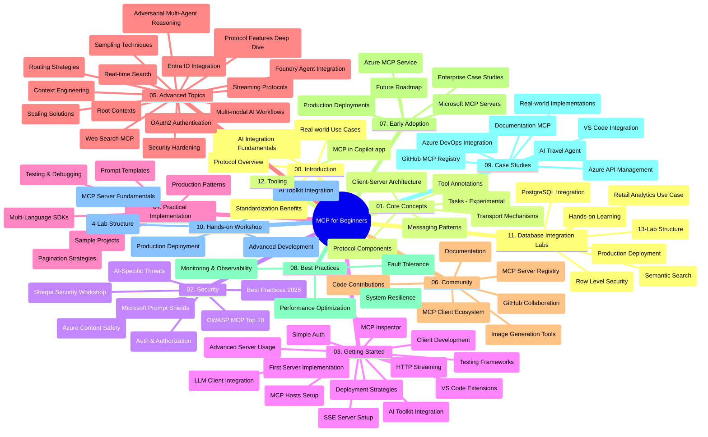

# Protocole de Contexte de Modèle (MCP) pour Débutants - Guide d'Étude

Ce guide d'étude fournit un aperçu de la structure et du contenu du dépôt pour le cursus « Protocole de Contexte de Modèle (MCP) pour Débutants ». Utilisez ce guide pour naviguer efficacement dans le dépôt et tirer le meilleur parti des ressources disponibles.

## Aperçu du Dépôt

Le Protocole de Contexte de Modèle (MCP) est un cadre standardisé pour les interactions entre les modèles d'IA et les applications clientes. Initialement créé par Anthropic, le MCP est désormais maintenu par la communauté MCP élargie via l'organisation officielle GitHub. Ce dépôt propose un cursus complet avec des exemples de code pratiques en C#, Java, JavaScript, Python et TypeScript, conçu pour les développeurs IA, architectes systèmes et ingénieurs logiciels.

## Carte Visuelle du Cursus

## Structure du Dépôt

Le dépôt est organisé en douze sections principales, chacune se concentrant sur différents aspects du MCP :

1. **Introduction (00-Introduction/)**
   - Aperçu du Protocole de Contexte de Modèle
   - Pourquoi la standardisation est importante dans les pipelines d'IA
   - Cas d'usage pratiques et bénéfices

2. **Concepts de Base (01-CoreConcepts/)**
   - Architecture client-serveur
   - Composants clés du protocole
   - Modèles de messagerie dans le MCP
   - Spécification actuelle : [Quoi de neuf dans MCP : la spécification du 28-07-2026](./01-CoreConcepts/mcp-2026-07-28.md) — le cœur stateless du protocole, cadre Extensions, et dépréciations Roots/Sampling/Logging

3. **Sécurité (02-Security/)**
   - Menaces de sécurité dans les systèmes basés sur MCP
   - Meilleures pratiques pour sécuriser les implémentations
   - Stratégies d'authentification et d'autorisation
   - Exemple pratique d'[autorisation CIMD et DCR](./02-Security/samples/cimd-dcr-auth/README.md)
   - **Documentation complète sur la Sécurité** :
     - Meilleures pratiques de sécurité MCP
     - Guide d'implémentation Azure Content Safety
     - Contrôles et techniques de sécurité MCP
     - Référence rapide des meilleures pratiques MCP
   - **Sujets clés de sécurité** :
     - Injection de prompt et attaques d'empoisonnement d'outils
     - Détournement de session et problèmes de « député confus »
     - Vulnérabilités de passage de jetons
     - Permissions excessives et contrôle d'accès
     - Sécurité de la chaîne d'approvisionnement pour les composants IA
     - Intégration Microsoft Prompt Shields

4. **Prise en Main (03-GettingStarted/)**
   - Configuration et paramétrage de l'environnement
   - Création de serveurs et clients MCP basiques
   - Intégration avec des applications existantes
   - Sections incluses pour :
     - Première implémentation serveur
     - Développement client
     - Intégration client LLM
     - Intégration VS Code
     - Serveur Server-Sent Events (SSE)
     - Utilisation avancée du serveur
     - Streaming HTTP
     - Intégration AI Toolkit
     - Stratégies de test
     - Directives de déploiement

5. **Implémentation Pratique (04-PracticalImplementation/)**
   - Utilisation des SDK dans différents langages de programmation
   - Techniques de débogage, test et validation
   - Conception de templates de prompt et workflows réutilisables
   - Projets exemples avec exemples d'implémentation

6. **Sujets Avancés (05-AdvancedTopics/)**
   - Techniques d'ingénierie de contexte
   - Intégration de l'agent Foundry
   - Workflows IA multimodaux
   - Démos d'authentification OAuth2
   - Capacités de recherche en temps réel
   - Streaming en temps réel
   - Implémentation des contextes racines
   - Stratégies de routage
   - Techniques d'échantillonnage
   - Approches de montée en charge
   - Considérations de sécurité
   - Intégration de la sécurité Entra ID
   - Intégration de la recherche web
   - Raisonnement multi-agent adversarial (modèles de débat)

7. **Contributions Communautaires (06-CommunityContributions/)**
   - Comment contribuer au code et à la documentation
   - Collaboration via GitHub
   - Améliorations et retours pilotés par la communauté
   - Utilisation de divers clients MCP (Claude Desktop, Cline, VSCode)
   - Travail avec des serveurs MCP populaires incluant la génération d'images

8. **Leçons des Premiers Adoptants (07-LessonsfromEarlyAdoption/)**
   - Implémentations réelles et histoires de succès
   - Construction et déploiement de solutions basées MCP
   - Tendances et feuille de route future
   - **Guide des Serveurs MCP Microsoft** : Guide complet de 10 serveurs MCP Microsoft prêts pour la production incluant :
     - Serveur MCP Microsoft Learn Docs
     - Serveur MCP Azure (15+ connecteurs spécialisés)
     - Serveur MCP GitHub
     - Serveur MCP Azure DevOps
     - Serveur MCP MarkItDown
     - Serveur MCP SQL Server
     - Serveur MCP Playwright
     - Serveur MCP Dev Box
     - Serveur MCP Microsoft Foundry
     - Serveur MCP Microsoft 365 Agents Toolkit

9. **Meilleures Pratiques (08-BestPractices/)**
   - Optimisation des performances et tuning
   - Conception de systèmes MCP tolérants aux pannes
   - Stratégies de test et résilience

10. **Études de Cas (09-CaseStudy/)**
    - **Sept études de cas complètes** démontrant la polyvalence du MCP à travers divers scénarios :
    - **Agents de Voyage IA Azure** : Orchestration multi-agent avec Azure OpenAI et Recherche IA
    - **Intégration Azure DevOps** : Automatisation des processus workflows avec actualisation des données YouTube
    - **Récupération Documentaire en Temps Réel** : Client console Python avec streaming HTTP
    - **Générateur de Plan d'Étude Interactif** : application web Chainlit avec IA conversationnelle
    - **Documentation In-Editor** : Intégration VS Code avec workflows GitHub Copilot
    - **Gestion API Azure** : Intégration d'API entreprise avec création de serveur MCP
    - **Registre MCP GitHub** : Développement d'écosystème et plateforme d'intégration agentique
    - Exemples d'implémentation couvrant intégration entreprise, productivité développeur et développement d'écosystème

11. **Atelier Pratique (10-StreamliningAIWorkflowsBuildingAnMCPServerWithAIToolkit/)**
    - Atelier pratique complet combinant MCP avec AI Toolkit
    - Construction d'applications intelligentes reliant modèles IA et outils du monde réel
    - Modules pratiques couvrant fondamentaux, développement serveur personnalisé et stratégies de déploiement en production
    - **Structure du labo** :
      - Labo 1 : Fondamentaux du Serveur MCP
      - Labo 2 : Développement avancé serveur MCP
      - Labo 3 : Intégration AI Toolkit
      - Labo 4 : Déploiement et montée en charge en production
    - Approche d'apprentissage basée sur des labs avec instructions pas-à-pas

12. **Labs d'Intégration Base de Données Serveur MCP (11-MCPServerHandsOnLabs/)**
    - **Parcours d'apprentissage complet en 13 labs** pour construire des serveurs MCP prêts pour la production avec intégration PostgreSQL
    - **Implémentation réelle d'analytique retail** utilisant le cas d'usage Zava Retail
    - **Schémas de qualité entreprise** incluant Row Level Security (RLS), recherche sémantique, et accès multi-tenant aux données
    - **Structure complète du labo** :
      - **Labs 00-03 : Fondations** - Introduction, Architecture, Sécurité, Configuration de l'environnement
      - **Labs 04-06 : Construction du Serveur MCP** - Conception base de données, Implémentation serveur MCP, Développement d'outils

      - **Labs 07-09 : Fonctionnalités avancées** - Recherche sémantique, tests et débogage, intégration VS Code
      - **Labs 10-12 : Production & Meilleures pratiques** - Déploiement, surveillance, optimisation
    - **Technologies abordées** : framework FastMCP, PostgreSQL, Azure OpenAI, Azure Container Apps, Application Insights
    - **Objectifs pédagogiques** : serveurs MCP prêts pour la production, modèles d’intégration de base de données, analyses alimentées par l’IA, sécurité d’entreprise

13. **Outils (12-tooling/)**
    - Apprenez à utiliser MCP dans l’application Copilot et autres outils

## Ressources supplémentaires

Le dépôt inclut des ressources d’accompagnement :

- **Dossier images** : Contient des diagrammes et illustrations utilisés tout au long du cursus
- **Traductions** : Support multilingue avec traductions automatisées de la documentation
- **Ressources officielles MCP** :
  - [Documentation MCP](https://modelcontextprotocol.io/)
  - [Spécification MCP](https://modelcontextprotocol.io/specification/2026-07-28/)
  - [Dépôt GitHub MCP](https://github.com/modelcontextprotocol)

## Comment utiliser ce dépôt

1. **Apprentissage séquentiel** : Suivez les chapitres dans l’ordre (de 00 à 11) pour une expérience d’apprentissage structurée.
2. **Focus sur un langage spécifique** : Si vous êtes intéressé par un langage de programmation particulier, explorez les répertoires d’exemples pour les implémentations dans votre langage préféré.
3. **Mise en pratique** : Commencez par la section « Prise en main » pour configurer votre environnement et créer votre premier serveur et client MCP.
4. **Exploration avancée** : Une fois les bases maîtrisées, plongez dans les sujets avancés pour approfondir vos connaissances.
5. **Engagement communautaire** : Rejoignez la communauté MCP via les discussions GitHub et les canaux Discord pour connecter avec des experts et d’autres développeurs.

## Clients et outils MCP

Le cursus couvre divers clients et outils MCP :

1. **Clients officiels** :
   - Visual Studio Code 
   - MCP dans Visual Studio Code
   - Claude Desktop
   - Claude dans VSCode 
   - Claude API

2. **Clients communautaires** :
   - Cline (terminal)
   - Cursor (éditeur de code)
   - ChatMCP
   - Windsurf

3. **Outils de gestion MCP** :
   - MCP CLI
   - MCP Manager
   - MCP Linker
   - MCP Router

## Serveurs MCP populaires

Le dépôt présente divers serveurs MCP, notamment :

1. **Serveurs MCP officiels Microsoft** :
   - Serveur MCP Microsoft Learn Docs
   - Serveur MCP Azure (plus de 15 connecteurs spécialisés)
   - Serveur MCP GitHub
   - Serveur MCP Azure DevOps
   - Serveur MCP MarkItDown
   - Serveur MCP SQL Server
   - Serveur MCP Playwright
   - Serveur MCP Dev Box
   - Serveur MCP Microsoft Foundry
   - Serveur MCP Microsoft 365 Agents Toolkit

2. **Serveurs de référence officiels** :
   - Système de fichiers
   - Fetch
   - Mémoire
   - Pensée séquentielle

3. **Génération d’images** :
   - Azure OpenAI DALL-E 3
   - Stable Diffusion WebUI
   - Replicate

4. **Outils de développement** :
   - Git MCP
   - Contrôle terminal
   - Assistant de code

5. **Serveurs spécialisés** :
   - Salesforce
   - Microsoft Teams
   - Jira & Confluence

## Contribution

Ce dépôt accueille les contributions de la communauté. Consultez la section Contributions Communautaires pour des conseils sur la manière de contribuer efficacement à l'écosystème MCP.

----

*Ce guide d'étude a été mis à jour pour la dernière fois le 9 septembre 2026. Il reflète la spécification MCP
`2026-07-28`, la révision actuelle du protocole. Certains exemples pratiques restent explicitement versionnés à `2025-11-25` tandis que leurs SDK et outils
adoptent les API du protocole sans état.*

---

<!-- CO-OP TRANSLATOR DISCLAIMER START -->
**Avertissement** :
Ce document a été traduit à l'aide du service de traduction automatique [Co-op Translator](https://github.com/Azure/co-op-translator). Bien que nous nous efforçions d'assurer l'exactitude, veuillez noter que les traductions automatisées peuvent contenir des erreurs ou des inexactitudes. Le document original dans sa langue native doit être considéré comme la source faisant autorité. Pour les informations critiques, il est recommandé de recourir à une traduction professionnelle réalisée par un humain. Nous ne saurions être tenus responsables des malentendus ou erreurs d'interprétation découlant de l'utilisation de cette traduction.
<!-- CO-OP TRANSLATOR DISCLAIMER END -->