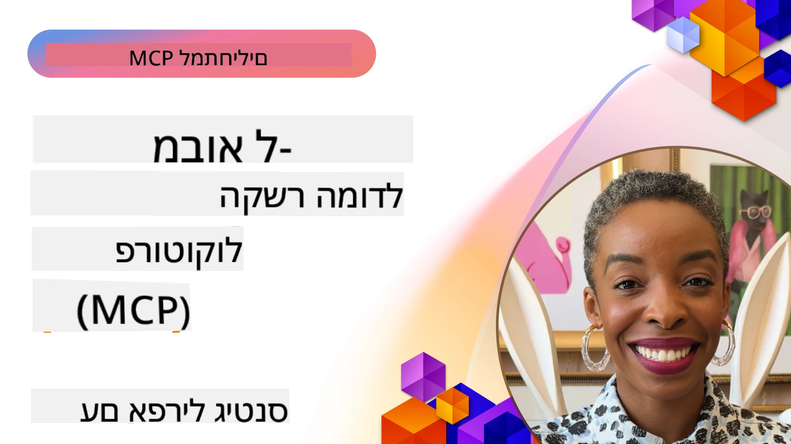
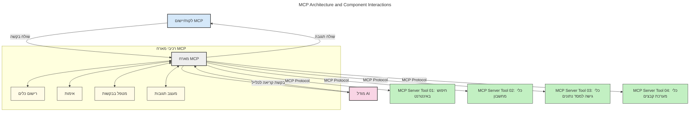
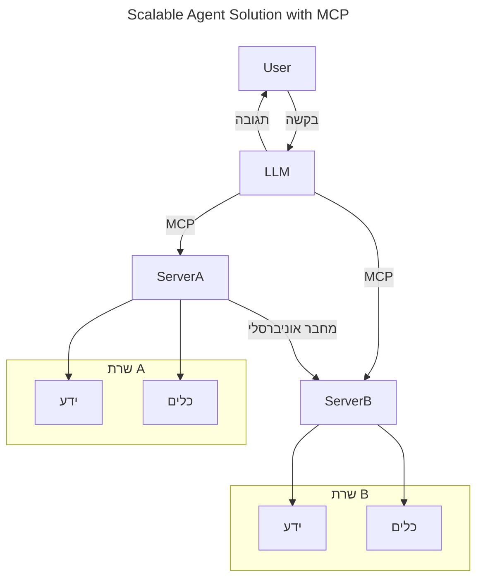
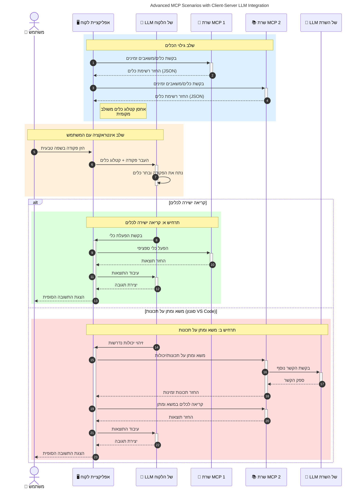

# מבוא לפרוטוקול הקשר מודלי (MCP): מדוע הוא חשוב ליישומי AI בקנה מידה רחב

_(לחץ על התמונה למעלה לצפייה בווידאו של השיעור)_

יישומי AI גנרטיביים הם צעד גדול קדימה, שכן הם מאפשרים למשתמשים לתקשר עם האפליקציה באמצעות פקודות בשפה טבעית. עם זאת, ככל שמשקיעים יותר זמן ומשאבים באפליקציות כאלה, חשוב לוודא שניתן לשלב פונקציות ומשאבים בקלות בצורה שניתנת להרחבה, שהאפליקציה תוכל לתמוך ביותר מדגם אחד ולהתמודד עם מורכבויות שונות של הדגמים. בקיצור, בניית יישומי Gen AI קלה להתחלה, אך ככל שהם גדלים ומורכבים יותר, יש צורך להתחיל להגדיר ארכיטקטורה וככל הנראה להישען על סטנדרט שיבטיח שהאפליקציות נבנות בצורה עקבית. כאן נכנס MCP לארגן את העניינים ולספק סטנדרט.

---

## **🔍 מהו פרוטוקול הקשר מודלי (MCP)?**

**פרוטוקול הקשר מודלי (MCP)** הוא **ממשק פתוח ומאוחד** המאפשר למודלים שפתיים גדולים (LLMs) לתקשר בצורה חלקה עם כלים חיצוניים, APIs ומקורות נתונים. הוא מספק ארכיטקטורה עקבית לשיפור פונקציונליות של מודלים חכמים מעבר לנתוני האימון שלהם, ומאפשר מערכות AI חכמות, ניתנות להרחבה ותגובה.

---

## **🎯 מדוע סטנדרטיזציה ב-AI חשובה**

ככל שיישומי AI גנרטיביים נעשים מורכבים יותר, חשוב לאמץ סטנדרטים שמבטיחים **ניתנות להרחבה, ניידות, תחזוקה**, ו**הימנעות מהתלות בספק יחיד**. MCP מטפל בצרכים אלו על ידי:

- איחוד אינטגרציות מודלים-כלים
- הפחתת פתרונות מותאמים אישית שבירים
- מאפשר למספר מודלים מספקים שונים להתקיים במערכת אחת

**הערה:** אף על פי ש-MCP מציג עצמו כסטנדרט פתוח, אין תוכניות לסטנדרטיזציה דרך גופי סטנדרטים קיימים כגון IEEE, IETF, W3C, ISO או כל גוף סטנדרטים אחר.

---

## **📚 יעדי למידה**

בסיום מאמר זה תוכל:

- להגדיר את **פרוטוקול הקשר מודלי (MCP)** ומקרי השימוש שלו
- להבין כיצד MCP מאחד את התקשורת בין מודלים לכלים
- לזהות את המרכיבים המרכזיים בארכיטקטורת MCP
- לחקור יישומים בעולם האמיתי של MCP בהקשרים ארגוניים ופיתוחיים

---

## **💡 למה פרוטוקול הקשר מודלי (MCP) משנה את הכללים**

### **🔗 MCP פותר את הפירגמנטציה באינטראקציות AI**

לפני MCP, אינטגרציה של מודלים עם כלים דרשה:

- קוד מותאם אישית לזוגות כלי-מודל
- APIs לא סטנדרטיים לכל ספק
- עצירות תכופות עקב עדכונים
- קושי בהרחבה עם הוספת כלים נוספים

### **✅ יתרונות סטנדרטיזציית MCP**

| **יתרון**               | **תיאור**                                                                     |
|--------------------------|-------------------------------------------------------------------------------|
| תאימות                  | מודלים שפתיים גדולים מתפקדים בצורה חלקה עם כלים מספקים שונים               |
| עקביות                  | התנהגות אחידה בין פלטפורמות וכלים                                          |
| שימוש חוזר              | כלים שנבנו פעם אחת יכולים לשמש בפרויקטים ומערכות שונות                      |
| פיתוח מואץ              | הפחתת זמן פיתוח באמצעות ממשקים סטנדרטיים Plug-and-Play                     |

---

## **🧱 סקירת ארכיטקטורה ברמה גבוהה של MCP**

MCP פועל במודל **לקוח-שרת**, שבו:

- **MCP Hosts** מריצים את מודלי ה-AI
- **MCP Clients** מתחילים בקשות
- **MCP Servers** מספקים הקשר, כלים ויכולות

### **מרכיבים מרכזיים:**

- **משאבים** – נתונים סטטיים או דינמיים עבור המודלים  
- **הנחיות** – תהליכים מוגדרים מראש ליצירה מונחית  
- **כלים** – פונקציות ניתנות לביצוע כמו חיפוש, חישובים  
- **דגימה** – התנהגות סוכנית באמצעות אינטראקציות חוזרות (מאוצר ב-
    MCP `2026-07-28`; יישומים חדשים צריכים להשתלב ישירות עם ספק
    LLM)
- **השגה** – בקשות יזומות של השרת לקבלת קלט משתמש
- **שורשים** – מיקומי מערכת קבצים מידע רלוונטיים לשרת
    (מאוצר ב-MCP `2026-07-28`; עדיף פרמטרים כלים, כתובות URI של משאבים,
    או הגדרת שרת)

### **ארכיטקטורת הפרוטוקול:**

MCP משתמש בארכיטקטורת שתי שכבות:
- **שכבת הנתונים**: הודעות JSON-RPC 2.0, מטא-נתונים לבקשות, גילוי,
    ופרימיטיבים של פרוטוקול
- **שכבת התעבורה**: stdio עבור תהליכים תת-תוכניתיים מקומיים ו-Streamable HTTP
    לשרתי מרוחקים. Streamable HTTP יכול להשתמש במסגרת SSE לתגובות סטרימינג,
    אך תעבורת HTTP+SSE ישנה מאוצרת.

---

## כיצד פועלים שרתי MCP

שרתי MCP פועלים כך:

- **זרימת בקשות**:
    1. בקשה מיזימת משתמש קצה או תוכנה הפועלת בשמו.
    2. **לקוח MCP** שולח את הבקשה ל-**מארח MCP**, שמנהל את זמן הריצה של מודל ה-AI.
    3. **מודל ה-AI** מקבל את ההנחיה מהמשתמש ועלול לבקש גישה לכלים חיצוניים או לנתונים באמצעות קריאות לכלים.
    4. ה-**מארח MCP**, ולא המודל ישירות, מתקשר עם **שרתי MCP** המתאימים באמצעות הפרוטוקול המאוחד.
- **פונקציונליות מארח MCP**:
    - **רשימת כלים**: מנהל קטלוג של כלים זמינים ויכולותיהם.
    - **אימות**: מאמת הרשאות גישה לכלים.
    - **מנהל בקשות**: מעבד בקשות כלי נכנסות מהמודל.
    - **מעצב תגובות**: מארגן תוצרים של הכלים בפורמט שהמודל יכול להבין.
- **ביצוע שרת MCP**:
    - ה-**מארח MCP** מפנה קריאות כלים לשרת MCP אחד או יותר, כל אחד חוסם פונקציות מיוחדות (למשל, חיפוש, חישובים, שאילתות למסדי נתונים).
    - ה-**שרתי MCP** מבצעים את הפעולות המיוחדות שלהם ומחזירים תוצאות ל-**מארח MCP** בפורמט עקבי.
    - ה-**מארח MCP** מעצב ומעביר תוצאות אלו למודל ה-AI.
- **השלמת תגובה**:
    - ה-**מודל ה-AI** משלב את תוצרי הכלים בתגובה הסופית.
    - ה-**מארח MCP** שולח תגובה זו חזרה ל-**לקוח MCP**, שמעביר אותה למשתמש הקצה או לתוכנה המבצעת את הקריאה.
    

## 👨‍💻 כיצד לבנות שרת MCP (עם דוגמאות)

שרתי MCP מאפשרים להרחיב את יכולות ה-LLM על ידי מתן נתונים ופונקציונליות.

מוכן לנסות? הנה SDKs ספציפיים לשפות ו/או ערימות עם דוגמאות ליצירת שרתי MCP פשוטים בשפות/ערימות שונות:

- **Python SDK**: https://github.com/modelcontextprotocol/python-sdk

- **TypeScript SDK**: https://github.com/modelcontextprotocol/typescript-sdk

- **Java SDK**: https://github.com/modelcontextprotocol/java-sdk

- **C#/.NET SDK**: https://github.com/modelcontextprotocol/csharp-sdk

## 🌍 מקרי שימוש אמיתיים ל-MCP

MCP מאפשר טווח רחב של יישומים על ידי הרחבת יכולות AI:

| **יישום**                  | **תיאור**                                                                     |
|----------------------------|-------------------------------------------------------------------------------|
| אינטגרציית נתוני ארגון      | חיבור LLMs למסדי נתונים, CRM או כלים פנימיים                                |
| מערכות AI סוכניות         | מאפשר סוכנים אוטונומיים עם גישה לכלים ותהליכי קבלת החלטות                  |
| יישומים רב-מודאליים        | שילוב טקסט, תמונה, וכלי שמע באפליקציית AI אחידה                           |
| אינטגרציית נתונים בזמן אמת | הבאת נתונים חיים לאינטראקציות AI לפלט מדויק ועדכני יותר                    |

### 🧠 MCP = סטנדרט אוניברסלי לאינטראקציות AI

פרוטוקול הקשר מודלי (MCP) משמש כסטנדרט אוניברסלי לאינטראקציות AI, בדומה לאופן שבו USB-C סטנדרטיזציה חיבורים פיזיים למכשירים. בעולם ה-AI, MCP מספק ממשק עקבי, המאפשר למודלים (לקוחות) להשתלב בקלות עם כלים וחוברי נתונים חיצוניים (שרתים). זה מבטל את הצורך בפרוטוקולים מותאמים שונים לכל API או מקור נתונים.

תחת MCP, כלי התואם MCP (שנקרא שרת MCP) פועל לפי סטנדרט מאוחד. שרתים אלו יכולים לרשום את הכלים או הפעולות שהם מציעים ולבצע פעולות אלו בעת בקשה מסוכן AI. פלטפורמות סוכני AI התומכות ב-MCP מסוגלות לגלות כלים זמינים מהשרתים ולהפעילם באמצעות פרוטוקול זה.

### 💡 מקל על גישה לידע

מעבר למתן כלים, MCP מקל על גישה לידע. הוא מאפשר ליישומים לספק הקשר למודלים שפתיים גדולים (LLMs) על ידי קישורם למקורות נתונים שונים. לדוגמה, שרת MCP עשוי לייצג מחסן מסמכים של חברה, המאפשר לסוכנים לשחזר מידע רלוונטי על פי דרישה. שרת אחר יכול לטפל בפעולות ספציפיות כמו שליחת דוא"ל או עדכון רשומות. מנקודת מבטו של הסוכן, אלה כלים פשוטים לשימוש — חלק מהכלים מחזירים נתונים (הקשר ידע), אחרים מבצעים פעולות. MCP מנהל את שניהם ביעילות.

סוכן שמתחבר לשרת MCP לומד אוטומטית את היכולות הזמינות והנתונים הנגישים של השרת באמצעות פורמט סטנדרטי. סטנדרטיזציה זו מאפשרת זמינות דינמית של כלים. לדוגמה, הוספת שרת MCP חדש למערכת סוכן הופכת את הפונקציות שלו לזמינות מיד ללא צורך בהתאמה נוספת של הוראות הסוכן.

אינטגרציה מאורגנת זו מתואמת עם הזרימה המתוארת במפת התרשים הבא, שבו השרתים מספקים גם כלים וגם ידע, ומבטיחים שיתוף פעולה חלק בין מערכות.

### 👉 דוגמה: פתרון סוכן בקנה מידה רחב

המחבר האוניברסלי מאפשר לשרתי MCP לתקשר ולשתף יכולות זה עם זה, מאפשר ל-ServerA להאציל משימות ל-ServerB או לגשת לכליו וידעו. זה מאחד כלים ונתונים בין השרתים, תומך בארכיטקטורות סוכנים מודולריות וניתנות להרחבה. מכיוון ש-MCP מאחד את הצגת הכלים, סוכנים יכולים לדינמית לגלות ולכוון בקשות בין שרתים ללא אינטגרציות מקודדות.

פדרציה של כלים וידע: כלים ונתונים נגישים בין שרתים, מאפשר ארכיטקטורות סוכנות יעילות וניתנות להרחבה.

### 🔄 תרחישי MCP מתקדמים עם אינטגרציית LLM בצד הלקוח

מעבר לארכיטקטורה הבסיסית של MCP, ישנם תרחישים מתקדמים בהם גם הלקוח וגם השרת מכילים LLMs, המאפשרים אינטראקציות מתוחכמות יותר. בתרשים הבא, **אפליקציית הלקוח** יכולה להיות סביבת פיתוח (IDE) עם מספר כלי MCP זמינים לשימוש ה-LLM:

## 🔐 יתרונות מעשיים של MCP

הנה היתרונות המעשיים של שימוש ב-MCP:

- **רעננות**: למודלים יש גישה למידע עדכני מעבר לנתוני האימון שלהם
- **הרחבת יכולות**: מודלים יכולים להשתמש בכלים מיוחדים למשימות שלא אומנו עבורן
- **הפחתת הזיות**: מקורות נתונים חיצוניים מספקים עיגון עובדתי
- **פרטיות**: נתונים רגישים יכולים להישאר בסביבות מאובטחות במקום להיות מוטמעים בהנחיות

## 📌 סיכומים מרכזיים

הנה סיכומים מרכזיים לשימוש ב-MCP:

- **MCP** מאחד כיצד מודלים של AI מתקשרים עם כלים ונתונים
- מקדם **ניתנות להרחבה, עקביות, ותאימות**
- MCP מסייע **להפחית זמן פיתוח, לשפר אמינות, ולהרחיב יכולות מודל**
- ארכיטקטורת לקוח-שרת **מאפשרת יישומי AI גמישים וניתנים להרחבה**

## 🧠 תרגיל

חשוב על יישום AI שמעוניין לבנות.

- אילו **כלים חיצוניים או נתונים** עשויים לשפר את יכולותיו?
- כיצד MCP עשוי להקל על האינטגרציה ולהפוך אותה ל**פשוטה ואמינה יותר?**

## משאבים נוספים

- [מאגר GitHub של MCP](https://github.com/modelcontextprotocol)

## מה הלאה

הבא: [פרק 1: מושגי יסוד](../01-CoreConcepts/README.md)

---

<!-- CO-OP TRANSLATOR DISCLAIMER START -->
**כתב ויתור**:
מסמך זה תורגם באמצעות שירות תרגום אוטומטי [Co-op Translator](https://github.com/Azure/co-op-translator). למרות שאנו שואפים לדיוק, יש לקחת בחשבון שתרגומים אוטומטיים עלולים להכיל שגיאות או אי-דיוקים. יש להחשיב את המסמך המקורי בשפתו הטבעית כמקור הסמכות. למידע קריטי מומלץ להשתמש בתרגום מקצועי על ידי מתרגם אדם. אנו לא אחראים לכל אי-הבנה או פירוש שגוי הנובע מהשימוש בתרגום זה.
<!-- CO-OP TRANSLATOR DISCLAIMER END -->