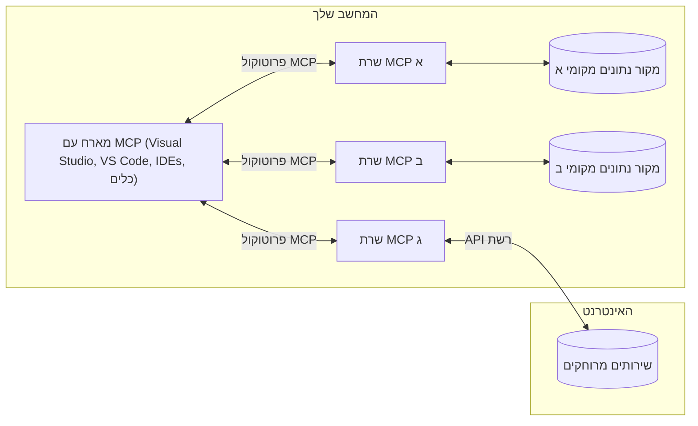

# מושגי יסוד ב-MCP: שליטה בפרוטוקול הקשר המודל לשילוב בינה מלאכותית

[](https://youtu.be/earDzWGtE84)

_(לחצו על התמונה למעלה לצפייה בסרטון של השיעור)_

[פרוטוקול הקשר המודל (MCP)](https://github.com/modelcontextprotocol) הוא מסגרת סטנדרטית ועוצמתית שמייעלת את התקשורת בין מודלים לשוניים גדולים (LLMs) לכלים חיצוניים, יישומים ומקורות נתונים. 
מדריך זה ילווה אתכם דרך מושגי היסוד של MCP. תלמדו על ארכיטקטורת לקוח-שרת, רכיבים חיוניים, מנגנוני תקשורת, ושיטות הטמעה מיטביות.

- **הסכמה מפורשת של המשתמש**: כל גישה לנתונים וכל פעולה דורשים אישור מפורש מהמשתמש לפני ביצוע. המשתמשים חייבים להבין בבירור אילו נתונים ייגשו ואילו פעולות יבוצעו, עם שליטה מדויקת על הרשאות ואישורים.

- **הגנת פרטיות הנתונים**: נתוני המשתמש נחשפים רק בהסכמה מפורשת וחייבים להיות מוגנים באמצעות בקרות גישה חזקות לאורך כל מחזור האינטראקציה. יש למנוע העברת נתונים לא מורשית ולשמור על גבולות פרטיות מחמירים.

- **בטיחות ביצוע כלים**: כל קריאה לכלי דורשת הסכמה מפורשת של המשתמש עם הבנה ברורה של פונקציונליות הכלי, הפרמטרים וההשפעה האפשרית. גבולות אבטחה חזקים חייבים למנוע ביצוע כלים בלתי רצוי, לא בטוח או זדוני.

- **אבטחת שכבת התעבורה**: כל ערוצי התקשורת צריכים להשתמש במנגנוני הצפנה ואימות מתאימים. חיבורים מרוחקים צריכים ליישם פרוטוקולי תעבורה מאובטחים וניהול אישורים תקין.

#### קווי הנחיה להטמעה:

- **ניהול הרשאות**: יישום מערכות הרשאות מדויקות המאפשרות למשתמשים לשלוט באילו שרתים, כלים ומשאבים נגישים
- **אימות ואישור**: שימוש בשיטות אימות מאובטחות (OAuth, מפתחות API) עם ניהול תקין של אסימונים ותוקפם  
- **אימות קלט**: אימות כל הפרמטרים והקלטים בהתאם לסכימות מוגדרות למניעת התקפות הזרקה
- **רישום ביקורת**: שמירת יומנים מקיפים של כל הפעולות למעקב אבטחה וציות

## סקירה כללית

שיעור זה בוחן את הארכיטקטורה הבסיסית והרכיבים שמרכיבים את מערכת פרוטוקול הקשר המודל (MCP). תלמדו על ארכיטקטורת לקוח-שרת, רכיבים מרכזיים ומנגנוני תקשורת שמפעילים את האינטראקציות ב-MCP.

## יעדי למידה מרכזיים

בסיום שיעור זה, תוכלו:

- להבין את ארכיטקטורת הלקוח-שרת של MCP.
- לזהות תפקידים ואחריות של מארחים, לקוחות ושרתים.
- לנתח את התכונות המרכזיות שהופכות את MCP לשכבת אינטגרציה גמישה.
- ללמוד כיצד זורמת המידע במערכת MCP.
- לקבל תובנות מעשיות דרך דוגמאות קוד ב-.NET, Java, Python ו-JavaScript.

## ארכיטקטורת MCP: מבט מעמיק

מערכת MCP בנויה על מודל לקוח-שרת. מבנה מודולרי זה מאפשר ליישומי בינה מלאכותית לתקשר עם כלים, מסדי נתונים, APIs ומשאבים הקשריים ביעילות. נפרק את הארכיטקטורה הזו לרכיביה המרכזיים.

בלב העניין, MCP פועל על ארכיטקטורת לקוח-שרת שבה יישום מארח יכול להתחבר למספר שרתים:


- **מארחי MCP**: תוכניות כמו VSCode, Claude Desktop, IDEs או כלים של בינה מלאכותית שרוצים לגשת לנתונים דרך MCP
- **לקוחות MCP**: לקוחות פרוטוקול שמנהלים חיבורים 1:1 עם שרתים
- **שרתים MCP**: תוכניות קלות שמשדרות יכולות ספציפיות דרך פרוטוקול הקשר המודל הסטנדרטי
- **מקורות נתונים מקומיים**: קבצים, מסדי נתונים ושירותים במחשב שלכם שאליהם שרתי MCP יכולים לגשת בבטחה
- **שירותים מרוחקים**: מערכות חיצוניות הזמינות דרך האינטרנט שאליהן שרתי MCP יכולים להתחבר דרך APIs.

פרוטוקול MCP הוא תקן מתפתח המשתמש בגרסאות מבוססות תאריך (פורמט YYYY-MM-DD). גרסת הפרוטוקול הנוכחית היא **2025-11-25**. ניתן לראות את העדכונים האחרונים ב-[מפרט הפרוטוקול](https://modelcontextprotocol.io/specification/2025-11-25/)

### 1. מארחים

בפרוטוקול הקשר המודל (MCP), **מארחים** הם יישומי בינה מלאכותית המשמשים כממשק הראשי דרכו המשתמשים מתקשרים עם הפרוטוקול. המארחים מתאמים ומנהלים חיבורים למספר שרתי MCP על ידי יצירת לקוחות MCP ייעודיים לכל חיבור שרת. דוגמאות למארחים כוללות:

- **יישומי בינה מלאכותית**: Claude Desktop, Visual Studio Code, Claude Code
- **סביבות פיתוח**: IDEs ועורכי קוד עם אינטגרציה ל-MCP  
- **יישומים מותאמים אישית**: סוכני בינה מלאכותית וכלים ייעודיים

**מארחים** הם יישומים המתאמים אינטראקציות עם מודלים של בינה מלאכותית. הם:

- **מתזמנים מודלים של בינה מלאכותית**: מבצעים או מתקשרים עם LLMs ליצירת תגובות ומתזמנים זרימות עבודה של בינה מלאכותית
- **מנחים חיבורים של לקוחות**: יוצרים ומנהלים לקוח MCP אחד לכל חיבור שרת MCP
- **שולטים בממשק המשתמש**: מנהלים את זרימת השיחה, אינטראקציות המשתמש והצגת התגובות  
- **אוכפים אבטחה**: שולטים בהרשאות, מגבלות אבטחה ואימות
- **מטפלים בהסכמת המשתמש**: מנהלים אישור משתמש לשיתוף נתונים וביצוע כלים


### 2. לקוחות

**לקוחות** הם רכיבים חיוניים שמנהלים חיבורים ייעודיים אחד-על-אחד בין מארחים לשרתי MCP. כל לקוח MCP נוצר על ידי המארח כדי להתחבר לשרת MCP ספציפי, ומבטיח ערוצי תקשורת מאורגנים ומאובטחים. לקוחות מרובים מאפשרים למארחים להתחבר למספר שרתים במקביל.

**לקוחות** הם רכיבי חיבור בתוך יישום המארח. הם:

- **תקשורת פרוטוקול**: שולחים בקשות JSON-RPC 2.0 לשרתים עם הנחיות והנעות
- **משא ומתן על יכולות**: מנהלים משא ומתן על תכונות נתמכות וגרסאות פרוטוקול עם השרתים במהלך האתחול
- **ביצוע כלים**: מנהלים בקשות לביצוע כלים מהמודלים ומעבדים תגובות
- **עדכונים בזמן אמת**: מטפלים בהתראות ועדכונים בזמן אמת מהשרתים
- **עיבוד תגובות**: מעבדים ומעצבנים תגובות מהשרת להצגה למשתמשים

### 3. שרתים

**שרתים** הם תוכניות המספקות הקשר, כלים ויכולות ללקוחות MCP. הם יכולים לפעול מקומית (על אותו מחשב כמו המארח) או מרחוק (בפלטפורמות חיצוניות), ואחראים לטיפול בבקשות הלקוח ולספק תגובות מובנות. שרתים חושפים פונקציונליות ספציפית דרך פרוטוקול הקשר המודל הסטנדרטי.

**שרתים** הם שירותים המספקים הקשר ויכולות. הם:

- **רישום תכונות**: רושמים וחושפים פרימיטיבים זמינים (משאבים, הנעות, כלים) ללקוחות
- **עיבוד בקשות**: מקבלים ומבצעים קריאות לכלים, בקשות משאבים והנעות מלקוחות
- **מתן הקשר**: מספקים מידע הקשרי ונתונים לשיפור תגובות המודל
- **ניהול מצב**: שומרים על מצב סשן ומטפלים באינטראקציות עם מצב לפי הצורך
- **התראות בזמן אמת**: שולחים התראות על שינויים ביכולות ועדכונים ללקוחות מחוברים

שרתים יכולים להיות מפותחים על ידי כל אחד להרחבת יכולות המודל עם פונקציונליות מיוחדת, ותומכים בתרחישי פריסה מקומית ומרוחקת.

### 4. פרימיטיבים של השרת

שרתים בפרוטוקול הקשר המודל (MCP) מספקים שלושה **פרימיטיבים** מרכזיים המגדירים את אבני הבניין הבסיסיות לאינטראקציות עשירות בין לקוחות, מארחים ומודלים לשוניים. פרימיטיבים אלה מגדירים את סוגי המידע ההקשרי והפעולות הזמינות דרך הפרוטוקול.

שרתים ב-MCP יכולים לחשוף כל שילוב משלושת הפרימיטיבים המרכזיים הבאים:

#### משאבים

**משאבים** הם מקורות נתונים המספקים מידע הקשרי ליישומי בינה מלאכותית. הם מייצגים תוכן סטטי או דינמי שיכול לשפר את הבנת המודל וקבלת ההחלטות:

- **נתונים הקשריים**: מידע מובנה והקשר לצריכת מודל בינה מלאכותית
- **מאגרי ידע**: מאגרי מסמכים, מאמרים, מדריכים ומחקרים
- **מקורות נתונים מקומיים**: קבצים, מסדי נתונים ומידע מערכת מקומי  
- **נתונים חיצוניים**: תגובות API, שירותי רשת ונתוני מערכות מרוחקות
- **תוכן דינמי**: נתונים בזמן אמת שמתעדכנים בהתאם לתנאים חיצוניים

משאבים מזוהים על ידי URI ותומכים בגילוי דרך `resources/list` ושליפה דרך `resources/read`:

```text
file://documents/project-spec.md
database://production/users/schema
api://weather/current
```

#### הנעות

**הנעות** הן תבניות לשימוש חוזר המסייעות במבנה האינטראקציות עם מודלים לשוניים. הן מספקות דפוסי אינטראקציה סטנדרטיים וזרימות עבודה מתבניות:

- **אינטראקציות מבוססות תבנית**: הודעות מובנות מראש ומתחילי שיחה
- **תבניות זרימת עבודה**: רצפים סטנדרטיים למשימות ואינטראקציות נפוצות
- **דוגמאות בודדות**: תבניות מבוססות דוגמאות להנחיית המודל
- **הנעות מערכת**: הנעות יסודיות המגדירות התנהגות והקשר של המודל
- **תבניות דינמיות**: הנעות פרמטריות המותאמות להקשרים ספציפיים

הנעות תומכות בהחלפת משתנים וניתנות לגילוי דרך `prompts/list` ושליפה עם `prompts/get`:

```markdown
Generate a {{task_type}} for {{product}} targeting {{audience}} with the following requirements: {{requirements}}
```

#### כלים

**כלים** הם פונקציות הניתנות לביצוע שמודלי בינה מלאכותית יכולים להפעיל כדי לבצע פעולות ספציפיות. הם מייצגים את "הפעלים" של מערכת MCP, ומאפשרים למודלים לתקשר עם מערכות חיצוניות:

- **פונקציות הניתנות לביצוע**: פעולות דיסקרטיות שהמודלים יכולים להפעיל עם פרמטרים ספציפיים
- **אינטגרציה עם מערכות חיצוניות**: קריאות API, שאילתות למסדי נתונים, פעולות קבצים, חישובים
- **זהות ייחודית**: לכל כלי יש שם, תיאור וסכימת פרמטרים מובחנת
- **קלט ופלט מובנים**: כלים מקבלים פרמטרים מאומתים ומחזירים תגובות מובנות ומטיפוסות
- **יכולות פעולה**: מאפשרים למודלים לבצע פעולות בעולם האמיתי ולשלוף נתונים חיים

כלים מוגדרים עם סכמת JSON לאימות פרמטרים ונחשפים דרך `tools/list` ומופעלים דרך `tools/call`:

```typescript
server.tool(
  "search_products", 
  {
    query: z.string().describe("Search query for products"),
    category: z.string().optional().describe("Product category filter"),
    max_results: z.number().default(10).describe("Maximum results to return")
  }, 
  async (params) => {
    // בצע חיפוש והחזר תוצאות מובנות
    return await productService.search(params);
  }
);
```

## פרימיטיבים של הלקוח

בפרוטוקול הקשר המודל (MCP), **לקוחות** יכולים לחשוף פרימיטיבים המאפשרים לשרתים לבקש יכולות נוספות מיישום המארח. פרימיטיבים בצד הלקוח אלה מאפשרים יישומי שרת עשירים ואינטראקטיביים יותר שיכולים לגשת ליכולות מודל הבינה המלאכותית ואינטראקציות משתמש.

### דגימה

**דגימה** מאפשרת לשרתים לבקש השלמות ממודל השפה מיישום הבינה המלאכותית של הלקוח. פרימיטיב זה מאפשר לשרתים לגשת ליכולות LLM ללא הטמעת תלות במודל משלהם:

- **גישה בלתי תלויה במודל**: שרתים יכולים לבקש השלמות ללא הכללת SDK של LLM או ניהול גישה למודל
- **בינה מלאכותית ביוזמת השרת**: מאפשר לשרתים ליצור תוכן באופן עצמאי באמצעות מודל הבינה של הלקוח
- **אינטראקציות רקורסיביות עם LLM**: תומך בתרחישים מורכבים שבהם שרתים זקוקים לסיוע בינה מלאכותית לעיבוד
- **יצירת תוכן דינמי**: מאפשר לשרתים ליצור תגובות הקשריות באמצעות מודל המארח

דגימה מופעלת דרך השיטה `sampling/complete`, שבה השרתים שולחים בקשות השלמה ללקוחות.

### בקשת מידע

**בקשת מידע** מאפשרת לשרתים לבקש מידע נוסף או אישור מהמשתמשים דרך ממשק הלקוח:

- **בקשות קלט משתמש**: שרתים יכולים לבקש מידע נוסף כשנדרש לביצוע כלים
- **דיאלוגי אישור**: בקשת אישור משתמש לפעולות רגישות או בעלות השפעה
- **זרימות עבודה אינטראקטיביות**: מאפשר לשרתים ליצור אינטראקציות משתמש שלב אחר שלב
- **איסוף פרמטרים דינמי**: איסוף פרמטרים חסרים או אופציונליים במהלך ביצוע הכלי

בקשות בקשת מידע נעשות באמצעות השיטה `elicitation/request` לאיסוף קלט משתמש דרך ממשק הלקוח.

### רישום

**רישום** מאפשר לשרתים לשלוח הודעות יומן מובנות ללקוחות לצורך איתור באגים, ניטור וראות תפעולית:

- **תמיכה באיתור באגים**: מאפשר לשרתים לספק יומני ביצוע מפורטים לפתרון תקלות
- **ניטור תפעולי**: שליחת עדכוני מצב ומדדי ביצועים ללקוחות
- **דיווח על שגיאות**: מתן הקשר שגיאה מפורט ומידע דיאגנוסטי
- **עקבות ביקורת**: יצירת יומנים מקיפים של פעולות והחלטות השרת

הודעות רישום נשלחות ללקוחות כדי לספק שקיפות לפעולות השרת ולהקל על איתור באגים.

## זרימת מידע ב-MCP

פרוטוקול הקשר המודל (MCP) מגדיר זרימה מובנית של מידע בין מארחים, לקוחות, שרתים ומודלים. הבנת זרימה זו מסייעת להבהיר כיצד מעובדות בקשות המשתמש וכיצד כלים חיצוניים ומקורות נתונים משתלבים בתגובות המודל.

- **המארח יוזם חיבור**  
  יישום המארח (כגון IDE או ממשק שיחה) מקים חיבור לשרת MCP, בדרך כלל דרך STDIO, WebSocket או פרוטוקול תעבורה נתמך אחר.

- **משא ומתן על יכולות**  
  הלקוח (המוטמע במארח) והשרת מחליפים מידע על התכונות, הכלים, המשאבים וגרסאות הפרוטוקול הנתמכות. זה מבטיח ששני הצדדים מבינים אילו יכולות זמינות לסשן.

- **בקשת משתמש**  
  המשתמש מתקשר עם המארח (למשל, מזין הנעה או פקודה). המארח אוסף את הקלט ומעביר אותו ללקוח לעיבוד.

- **שימוש במשאב או כלי**  
  - הלקוח עשוי לבקש הקשר או משאבים נוספים מהשרת (כגון קבצים, רשומות מסד נתונים או מאמרי מאגר ידע) כדי להעשיר את הבנת המודל.
  - אם המודל קובע שנדרש כלי (למשל, לשליפת נתונים, ביצוע חישוב או קריאת API), הלקוח שולח בקשת הפעלת כלי לשרת, עם שם הכלי והפרמטרים.

- **ביצוע בשרת**  
  השרת מקבל את בקשת המשאב או הכלי, מבצע את הפעולות הנדרשות (כגון הרצת פונקציה, שאילתת מסד נתונים או שליפת קובץ), ומחזיר את התוצאות ללקוח בפורמט מובנה.

- **יצירת תגובה**  
  הלקוח משלב את תגובות השרת (נתוני משאב, פלטי כלים וכו') באינטראקציה השוטפת עם המודל. המודל משתמש במידע זה ליצירת תגובה מקיפה ורלוונטית הקשרית.

- **הצגת תוצאה**  
  המארח מקבל את הפלט הסופי מהלקוח ומציגו למשתמש, לעיתים כולל גם את הטקסט שנוצר על ידי המודל וגם תוצאות מביצוע כלים או שליפת משאבים.

זרימה זו מאפשרת ל-MCP לתמוך ביישומי בינה מלאכותית מתקדמים, אינטראקטיביים ומודעי הקשר על ידי חיבור חלק בין מודלים לכלים חיצוניים ומקורות נתונים.

## ארכיטקטורת הפרוטוקול ושכבות

MCP מורכב משתי שכבות ארכיטקטוניות מובחנות שעובדות יחד כדי לספק מסגרת תקשורת מלאה:

### שכבת הנתונים

**שכבת הנתונים** מיישמת את פרוטוקול MCP המרכזי באמצעות **JSON-RPC 2.0** כבסיס שלה. שכבה זו מגדירה את מבנה ההודעה, הסמנטיקה ודפוסי האינטראקציה:

#### רכיבים מרכזיים:

- **פרוטוקול JSON-RPC 2.0**: כל התקשורת משתמשת בפורמט הודעות JSON-RPC 2.0 סטנדרטי לקריאות שיטות, תגובות והתראות
- **ניהול מחזור חיים**: מטפל באתחול חיבור, משא ומתן על יכולות, וסיום מושב בין לקוחות לשרתים  
- **פרימיטיבים של השרת**: מאפשרים לשרתים לספק פונקציונליות מרכזית דרך כלים, משאבים, והנחיות  
- **פרימיטיבים של הלקוח**: מאפשרים לשרתים לבקש דגימה מ-LLM, לעורר קלט משתמש, ולשלוח הודעות יומן  
- **התראות בזמן אמת**: תומך בהתראות אסינכרוניות לעדכונים דינמיים ללא סריקה  

#### תכונות מרכזיות:

- **משא ומתן על גרסת הפרוטוקול**: משתמש בגרסאות מבוססות תאריך (YYYY-MM-DD) להבטחת תאימות  
- **גילוי יכולות**: לקוחות ושרתים מחליפים מידע על תכונות נתמכות במהלך האתחול  
- **מושבים עם מצב**: שומר על מצב החיבור לאורך אינטראקציות מרובות להמשכיות הקשר  

### שכבת התעבורה

**שכבת התעבורה** מנהלת ערוצי תקשורת, מסגור הודעות, ואימות בין משתתפי MCP:

#### מנגנוני תעבורה נתמכים:

1. **תעבורת STDIO**:  
   - משתמשת בזרמי קלט/פלט סטנדרטיים לתקשורת ישירה בין תהליכים  
   - אופטימלי לתהליכים מקומיים על אותו מחשב ללא עומס רשת  
   - נפוץ לשימוש במימושי שרת MCP מקומיים  

2. **תעבורת HTTP ניתנת לזרימה**:  
   - משתמשת ב-HTTP POST להודעות מלקוח לשרת  
   - אירועי שרת (SSE) אופציונליים לזרימה משרת ללקוח  
   - מאפשרת תקשורת עם שרתים מרוחקים ברשתות  
   - תומכת באימות HTTP סטנדרטי (אסימוני bearer, מפתחות API, כותרות מותאמות)  
   - MCP ממליץ על OAuth לאימות בטוח מבוסס אסימונים  

#### הפשטת התעבורה:

שכבת התעבורה מפשטת את פרטי התקשורת משכבת הנתונים, ומאפשרת שימוש באותו פורמט הודעות JSON-RPC 2.0 בכל מנגנוני התעבורה. הפשטה זו מאפשרת לאפליקציות לעבור בקלות בין שרתים מקומיים ומרוחקים.

### שיקולי אבטחה

מימושי MCP חייבים לעמוד בכמה עקרונות אבטחה קריטיים להבטחת אינטראקציות בטוחות, אמינות ומאובטחות בכל פעולות הפרוטוקול:

- **הסכמה ושליטה של המשתמש**: יש לקבל הסכמה מפורשת מהמשתמש לפני גישה לנתונים או ביצוע פעולות. המשתמשים צריכים שליטה ברורה על אילו נתונים משותפים ואילו פעולות מורשות, בתמיכה בממשקי משתמש אינטואיטיביים לסקירה ואישור פעילויות.

- **פרטיות נתונים**: נתוני המשתמש צריכים להיות חשופים רק בהסכמה מפורשת ולהיות מוגנים באמצעות בקרות גישה מתאימות. מימושי MCP חייבים להגן מפני העברת נתונים לא מורשית ולהבטיח פרטיות לאורך כל האינטראקציות.

- **בטיחות כלים**: לפני הפעלת כל כלי, נדרשת הסכמה מפורשת מהמשתמש. המשתמשים צריכים להבין בבירור את פונקציונליות כל כלי, וגבולות אבטחה חזקים חייבים להיות מוטמעים למניעת הפעלה לא מכוונת או לא בטוחה של כלים.

על ידי שמירה על עקרונות אבטחה אלו, MCP מבטיח אמון, פרטיות ובטיחות למשתמשים בכל האינטראקציות בפרוטוקול, תוך מתן אפשרות לאינטגרציות AI מתקדמות.

## דוגמאות קוד: רכיבים מרכזיים

להלן דוגמאות קוד בכמה שפות תכנות פופולריות המדגימות כיצד לממש רכיבי שרת MCP וכלים מרכזיים.

### דוגמת .NET: יצירת שרת MCP פשוט עם כלים

הנה דוגמת קוד .NET מעשית המדגימה כיצד לממש שרת MCP פשוט עם כלים מותאמים. דוגמה זו מציגה כיצד להגדיר ולרשום כלים, לטפל בבקשות, ולחבר את השרת באמצעות פרוטוקול הקשר מודל.

```csharp
using System;
using System.Threading.Tasks;
using ModelContextProtocol.Server;
using ModelContextProtocol.Server.Transport;
using ModelContextProtocol.Server.Tools;

public class WeatherServer
{
    public static async Task Main(string[] args)
    {
        // Create an MCP server
        var server = new McpServer(
            name: "Weather MCP Server",
            version: "1.0.0"
        );
        
        // Register our custom weather tool
        server.AddTool<string, WeatherData>("weatherTool", 
            description: "Gets current weather for a location",
            execute: async (location) => {
                // Call weather API (simplified)
                var weatherData = await GetWeatherDataAsync(location);
                return weatherData;
            });
        
        // Connect the server using stdio transport
        var transport = new StdioServerTransport();
        await server.ConnectAsync(transport);
        
        Console.WriteLine("Weather MCP Server started");
        
        // Keep the server running until process is terminated
        await Task.Delay(-1);
    }
    
    private static async Task<WeatherData> GetWeatherDataAsync(string location)
    {
        // This would normally call a weather API
        // Simplified for demonstration
        await Task.Delay(100); // Simulate API call
        return new WeatherData { 
            Temperature = 72.5,
            Conditions = "Sunny",
            Location = location
        };
    }
}

public class WeatherData
{
    public double Temperature { get; set; }
    public string Conditions { get; set; }
    public string Location { get; set; }
}
```

### דוגמת Java: רכיבי שרת MCP

דוגמה זו מדגימה את אותו שרת MCP ורישום כלים כמו בדוגמת .NET למעלה, אך מיושמת ב-Java.

```java
import io.modelcontextprotocol.server.McpServer;
import io.modelcontextprotocol.server.McpToolDefinition;
import io.modelcontextprotocol.server.transport.StdioServerTransport;
import io.modelcontextprotocol.server.tool.ToolExecutionContext;
import io.modelcontextprotocol.server.tool.ToolResponse;

public class WeatherMcpServer {
    public static void main(String[] args) throws Exception {
        // צור שרת MCP
        McpServer server = McpServer.builder()
            .name("Weather MCP Server")
            .version("1.0.0")
            .build();
            
        // רשם כלי מזג אוויר
        server.registerTool(McpToolDefinition.builder("weatherTool")
            .description("Gets current weather for a location")
            .parameter("location", String.class)
            .execute((ToolExecutionContext ctx) -> {
                String location = ctx.getParameter("location", String.class);
                
                // קבל נתוני מזג אוויר (מפושט)
                WeatherData data = getWeatherData(location);
                
                // החזר תגובה מעוצבת
                return ToolResponse.content(
                    String.format("Temperature: %.1f°F, Conditions: %s, Location: %s", 
                    data.getTemperature(), 
                    data.getConditions(), 
                    data.getLocation())
                );
            })
            .build());
        
        // חבר את השרת באמצעות תחבורה stdio
        try (StdioServerTransport transport = new StdioServerTransport()) {
            server.connect(transport);
            System.out.println("Weather MCP Server started");
            // שמור על השרת פועל עד שההליך יופסק
            Thread.currentThread().join();
        }
    }
    
    private static WeatherData getWeatherData(String location) {
        // היישום יקרא ל-API של מזג אוויר
        // מפושט למטרות דוגמה
        return new WeatherData(72.5, "Sunny", location);
    }
}

class WeatherData {
    private double temperature;
    private String conditions;
    private String location;
    
    public WeatherData(double temperature, String conditions, String location) {
        this.temperature = temperature;
        this.conditions = conditions;
        this.location = location;
    }
    
    public double getTemperature() {
        return temperature;
    }
    
    public String getConditions() {
        return conditions;
    }
    
    public String getLocation() {
        return location;
    }
}
```

### דוגמת Python: בניית שרת MCP

דוגמה זו משתמשת ב-fastmcp, אנא ודא שהתקנת אותו תחילה:

```python
pip install fastmcp
```
דוגמת קוד:

```python
#!/usr/bin/env python3
import asyncio
from fastmcp import FastMCP
from fastmcp.transports.stdio import serve_stdio

# יצירת שרת FastMCP
mcp = FastMCP(
    name="Weather MCP Server",
    version="1.0.0"
)

@mcp.tool()
def get_weather(location: str) -> dict:
    """Gets current weather for a location."""
    return {
        "temperature": 72.5,
        "conditions": "Sunny",
        "location": location
    }

# גישה חלופית באמצעות מחלקה
class WeatherTools:
    @mcp.tool()
    def forecast(self, location: str, days: int = 1) -> dict:
        """Gets weather forecast for a location for the specified number of days."""
        return {
            "location": location,
            "forecast": [
                {"day": i+1, "temperature": 70 + i, "conditions": "Partly Cloudy"}
                for i in range(days)
            ]
        }

# רישום כלים של המחלקה
weather_tools = WeatherTools()

# הפעלת השרת
if __name__ == "__main__":
    asyncio.run(serve_stdio(mcp))
```

### דוגמת JavaScript: יצירת שרת MCP

דוגמה זו מראה יצירת שרת MCP ב-JavaScript וכיצד לרשום שני כלים הקשורים למזג אוויר.

```javascript
// שימוש ב-SDK הרשמי של פרוטוקול הקשר למודל
import { McpServer } from "@modelcontextprotocol/sdk/server/mcp.js";
import { StdioServerTransport } from "@modelcontextprotocol/sdk/server/stdio.js";
import { z } from "zod"; // לאימות פרמטרים

// יצירת שרת MCP
const server = new McpServer({
  name: "Weather MCP Server",
  version: "1.0.0"
});

// הגדרת כלי מזג אוויר
server.tool(
  "weatherTool",
  {
    location: z.string().describe("The location to get weather for")
  },
  async ({ location }) => {
    // בדרך כלל זה יקרא ל-API של מזג האוויר
    // מפושט לצורך הדגמה
    const weatherData = await getWeatherData(location);
    
    return {
      content: [
        { 
          type: "text", 
          text: `Temperature: ${weatherData.temperature}°F, Conditions: ${weatherData.conditions}, Location: ${weatherData.location}` 
        }
      ]
    };
  }
);

// הגדרת כלי תחזית
server.tool(
  "forecastTool",
  {
    location: z.string(),
    days: z.number().default(3).describe("Number of days for forecast")
  },
  async ({ location, days }) => {
    // בדרך כלל זה יקרא ל-API של מזג האוויר
    // מפושט לצורך הדגמה
    const forecast = await getForecastData(location, days);
    
    return {
      content: [
        { 
          type: "text", 
          text: `${days}-day forecast for ${location}: ${JSON.stringify(forecast)}` 
        }
      ]
    };
  }
);

// פונקציות עזר
async function getWeatherData(location) {
  // סימולציה של קריאת API
  return {
    temperature: 72.5,
    conditions: "Sunny",
    location: location
  };
}

async function getForecastData(location, days) {
  // סימולציה של קריאת API
  return Array.from({ length: days }, (_, i) => ({
    day: i + 1,
    temperature: 70 + Math.floor(Math.random() * 10),
    conditions: i % 2 === 0 ? "Sunny" : "Partly Cloudy"
  }));
}

// חיבור השרת באמצעות תחבורה stdio
const transport = new StdioServerTransport();
server.connect(transport).catch(console.error);

console.log("Weather MCP Server started");
```

דוגמת JavaScript זו מדגימה כיצד ליצור לקוח MCP שמתחבר לשרת, שולח הנחיה, ומעבד את התגובה כולל כל קריאות לכלים שבוצעו.

## אבטחה והרשאות

MCP כולל כמה מושגים ומנגנונים מובנים לניהול אבטחה והרשאות לאורך כל הפרוטוקול:

1. **בקרת הרשאות כלים**:  
   לקוחות יכולים לציין אילו כלים מותר למודל להשתמש בהם במהלך מושב. זה מבטיח שרק כלים מורשים במפורש יהיו נגישים, ומפחית סיכון לפעולות לא מכוונות או לא בטוחות. הרשאות יכולות להיות מוגדרות דינמית בהתאם להעדפות משתמש, מדיניות ארגונית, או הקשר האינטראקציה.

2. **אימות**:  
   שרתים יכולים לדרוש אימות לפני מתן גישה לכלים, משאבים, או פעולות רגישות. זה יכול לכלול מפתחות API, אסימוני OAuth, או סכמות אימות אחרות. אימות נכון מבטיח שרק לקוחות ומשתמשים מהימנים יכולים להפעיל יכולות צד שרת.

3. **אימות פרמטרים**:  
   אימות פרמטרים נאכף עבור כל קריאות הכלים. כל כלי מגדיר את סוגי, פורמטים, והגבלות הצפויים לפרמטרים שלו, והשרת מאמת בקשות נכנסות בהתאם. זה מונע קלט שגוי או זדוני מלהגיע למימושי הכלים ועוזר לשמור על שלמות הפעולות.

4. **הגבלת קצב**:  
   למניעת שימוש לרעה והבטחת שימוש הוגן במשאבי השרת, שרתי MCP יכולים ליישם הגבלת קצב לקריאות כלים וגישה למשאבים. הגבלות קצב יכולות להיות מיושמות לפי משתמש, מושב, או באופן גלובלי, ועוזרות להגן מפני התקפות מניעת שירות או צריכת משאבים מופרזת.

בשילוב מנגנונים אלו, MCP מספק בסיס מאובטח לאינטגרציה של מודלים שפתיים עם כלים ומקורות נתונים חיצוניים, תוך מתן שליטה מדויקת למשתמשים ומפתחים על גישה ושימוש.

## הודעות פרוטוקול וזרימת תקשורת

תקשורת MCP משתמשת בהודעות **JSON-RPC 2.0** מובנות להקל על אינטראקציות ברורות ואמינות בין מארחים, לקוחות, ושרתים. הפרוטוקול מגדיר דפוסי הודעות ספציפיים לסוגי פעולות שונים:

### סוגי הודעות מרכזיים:

#### **הודעות אתחול**  
- בקשת `initialize`: מקימה חיבור ומנהלת משא ומתן על גרסת הפרוטוקול ויכולות  
- תגובת `initialize`: מאשרת תכונות נתמכות ומידע על השרת  
- `notifications/initialized`: מאותת שהאתחול הושלם והמושב מוכן  

#### **הודעות גילוי**  
- בקשת `tools/list`: מגלה כלים זמינים מהשרת  
- בקשת `resources/list`: מציגה רשימת משאבים (מקורות נתונים)  
- בקשת `prompts/list`: מושכת תבניות הנחיה זמינות  

#### **הודעות ביצוע**  
- בקשת `tools/call`: מפעילה כלי ספציפי עם פרמטרים מסופקים  
- בקשת `resources/read`: מושכת תוכן ממשאב ספציפי  
- בקשת `prompts/get`: מושכת תבנית הנחיה עם פרמטרים אופציונליים  

#### **הודעות צד לקוח**  
- בקשת `sampling/complete`: השרת מבקש השלמה מ-LLM מהלקוח  
- `elicitation/request`: השרת מבקש קלט משתמש דרך ממשק הלקוח  
- הודעות יומן: השרת שולח הודעות יומן מובנות ללקוח  

#### **הודעות התראה**  
- `notifications/tools/list_changed`: השרת מודיע ללקוח על שינויים בכלים  
- `notifications/resources/list_changed`: השרת מודיע ללקוח על שינויים במשאבים  
- `notifications/prompts/list_changed`: השרת מודיע ללקוח על שינויים בתבניות הנחיה  

### מבנה ההודעה:

כל הודעות MCP עוקבות אחרי פורמט JSON-RPC 2.0 עם:  
- הודעות בקשה: כוללות `id`, `method`, ו-`params` אופציונליים  
- הודעות תגובה: כוללות `id` ו-`result` או `error`  
- הודעות התראה: כוללות `method` ו-`params` אופציונליים (ללא `id` או תגובה צפויה)  

תקשורת מובנית זו מבטיחה אינטראקציות אמינות, ניתנות למעקב, ומורחבות התומכות בתרחישים מתקדמים כמו עדכונים בזמן אמת, שרשור כלים, וטיפול שגיאות חזק.

## נקודות מפתח

- **ארכיטקטורה**: MCP משתמש בארכיטקטורת לקוח-שרת שבה מארחים מנהלים חיבורים מרובים לשרתים  
- **משתתפים**: האקוסיסטם כולל מארחים (יישומי AI), לקוחות (מחברים לפרוטוקול), ושרתים (ספקי יכולות)  
- **מנגנוני תעבורה**: התקשורת תומכת ב-STDIO (מקומי) ו-HTTP ניתנת לזרימה עם SSE אופציונלי (מרוחק)  
- **פרימיטיבים מרכזיים**: שרתים חושפים כלים (פונקציות ניתנות להרצה), משאבים (מקורות נתונים), והנחיות (תבניות)  
- **פרימיטיבים של לקוח**: שרתים יכולים לבקש דגימה (השלמות LLM), עידוד (קלט משתמש), ויומן מהלקוחות  
- **בסיס הפרוטוקול**: מבוסס JSON-RPC 2.0 עם גרסאות מבוססות תאריך (נוכחי: 2025-11-25)  
- **יכולות בזמן אמת**: תומך בהתראות לעדכונים דינמיים וסנכרון בזמן אמת  
- **אבטחה בראש סדר העדיפויות**: הסכמה מפורשת של המשתמש, הגנת פרטיות נתונים, ותעבורה מאובטחת הם דרישות מרכזיות  

## תרגיל

עצב כלי MCP פשוט שיהיה שימושי בתחום שלך. הגדר:  
1. איך הכלי יקרא  
2. אילו פרמטרים יקבל  
3. איזה פלט יחזיר  
4. כיצד מודל עשוי להשתמש בכלי זה לפתרון בעיות משתמש  

---

## מה הלאה

הבא: [פרק 2: אבטחה](../02-Security/README.md)

---

<!-- CO-OP TRANSLATOR DISCLAIMER START -->
**כתב ויתור**:  
מסמך זה תורגם באמצעות שירות תרגום מבוסס בינה מלאכותית [Co-op Translator](https://github.com/Azure/co-op-translator). למרות שאנו שואפים לדיוק, יש לקחת בחשבון כי תרגומים אוטומטיים עלולים להכיל שגיאות או אי-דיוקים. המסמך המקורי בשפת המקור שלו נחשב למקור הסמכותי. למידע קריטי מומלץ להשתמש בתרגום מקצועי על ידי אדם. אנו לא נושאים באחריות לכל אי-הבנה או פרשנות שגויה הנובעת משימוש בתרגום זה.
<!-- CO-OP TRANSLATOR DISCLAIMER END -->