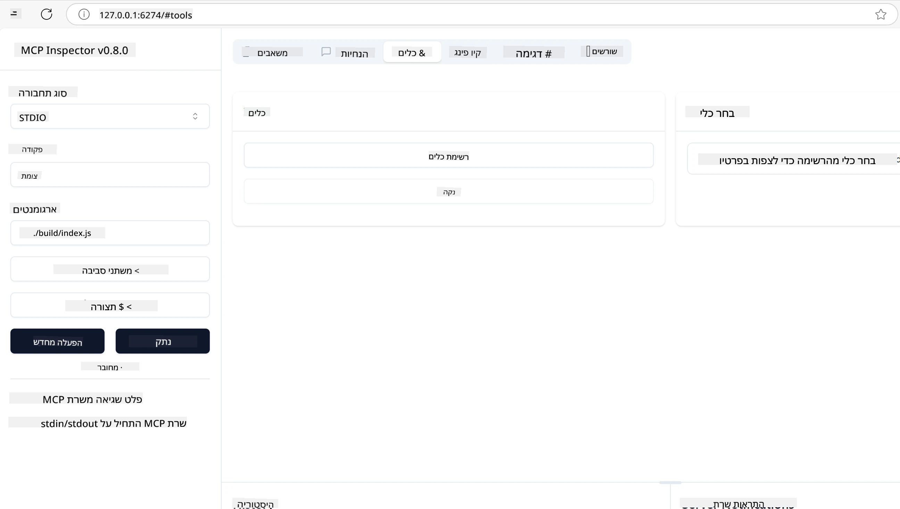
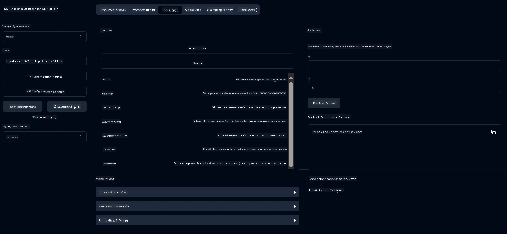
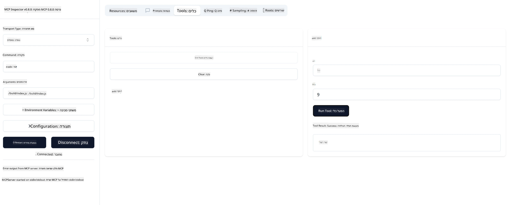

# התחלה עם MCP

> [!NOTE]
> דוגמת HTTP בג'אווה בשיעור זה משתמשת בהעברת HTTP+SSE מיושנת ו
> מיועדת ל-SDK התואם ל-MCP `2025-11-25`. עבור שרתים מרוחקים חדשים, השתמש
> בהעברת Streamable HTTP `2026-07-28` ואמת תמיכה ב-SDK שלך.

ברוכים הבאים לצעדים הראשונים שלך עם פרוטוקול הקשר למודל (MCP)! בין אם אתה חדש ב-MCP או מחפש להעמיק את הבנתך, מדריך זה ילווה אותך בתהליך ההתקנה והפיתוח החיוני. תגלה כיצד MCP מאפשר אינטגרציה חלקה בין מודלים של בינה מלאכותית ליישומים, ותלמד כיצד להכין במהירות את הסביבה שלך לבניית ולטסט פתרונות המונעים על ידי MCP.

> סיכום; אם אתה בונה אפליקציות AI, אתה יודע שאתה יכול להוסיף כלים ומשאבים אחרים ל-LLM שלך (מודל שפה גדול), כדי להפוך את ה-LLM לידע יותר. אך אם ממקמים את הכלים והמשאבים האלה בשרת, היישום ויכולות השרת ניתנים לשימוש על ידי כל לקוח עם/בלי LLM.

## סקירה כללית

שיעור זה מספק הדרכה פרקטית על הגדרת סביבות MCP ובניית יישומי MCP ראשונים. תלמד כיצד להגדיר את הכלים והמסגרות הנדרשות, לבנות שרתי MCP בסיסיים, ליצור יישומים מארחים ולבדוק את היישומים שלך.

פרוטוקול הקשר למודל (MCP) הוא פרוטוקול פתוח שמסטנדרט כיצד יישומים מספקים הקשר ל-LLMs. חשבו על MCP כמו יציאת USB-C ליישומי AI - הוא מספק דרך סטנדרטית לחבר מודלים של AI למקורות נתונים וכלים שונים.

## יעדי הלמידה

בסיום שיעור זה, תוכל:

- להגדיר סביבות פיתוח ל-MCP ב-C#, Java, Python, TypeScript, ו-Rust
- לבנות ולפרוס שרתי MCP בסיסיים עם תכונות מותאמות אישית (משאבים, תבניות, וכלים)
- ליצור יישומים מארחים שמתחברים לשרתי MCP
- לבדוק ולפתור באגים ביישומי MCP

## הגדרת סביבת MCP שלך

לפני שאתה מתחיל לעבוד עם MCP, חשוב להכין את סביבת הפיתוח שלך ולהבין את זרימת העבודה הבסיסית. חלק זה ינחה אותך בשלבי ההתקנה הראשונית כדי להבטיח התחלה חלקה עם MCP.

### דרישות מוקדמות

לפני שמתחילים בפיתוח MCP, וודא שיש ברשותך:

- **סביבת פיתוח**: עבור שפת התכנות שבחרת (C#, Java, Python, TypeScript או Rust)
- **IDE/עורך**: Visual Studio, Visual Studio Code, IntelliJ, Eclipse, PyCharm או כל עורך קוד מודרני
- **מנהל חבילות**: NuGet, Maven/Gradle, pip, npm/yarn או Cargo
- **מפתחות API**: עבור כל שירותי AI שאתה מתכנן להשתמש בהם ביישומי המארח שלך

## מבנה בסיסי של שרת MCP

שרת MCP כולל בדרך כלל:

- **הגדרות שרת**: קביעת יציאה, אימות והגדרות נוספות
- **משאבים**: נתונים והקשר הנגישים ל-LLMs
- **כלים**: פונקציות שהמודלים יכולים לקרוא להן
- **תבניות**: תבניות ליצירת או מניסוח טקסט

להלן דוגמה מפושטת ב-TypeScript:

```typescript
import { McpServer, ResourceTemplate } from "@modelcontextprotocol/sdk/server/mcp.js";
import { StdioServerTransport } from "@modelcontextprotocol/sdk/server/stdio.js";
import { z } from "zod";

// ליצור שרת MCP
const server = new McpServer({
  name: "Demo",
  version: "1.0.0"
});

// להוסיף כלי נוסף
server.tool("add",
  { a: z.number(), b: z.number() },
  async ({ a, b }) => ({
    content: [{ type: "text", text: String(a + b) }]
  })
);

// להוסיף מקור ברכה דינמית
server.resource(
  "file",
  // הפרמטר 'list' שולט כיצד המקור מציג את הקבצים הזמינים. הגדרת הפרמטר כלא מוגדר מבטלת את ההצגה עבור מקור זה.
  new ResourceTemplate("file://{path}", { list: undefined }),
  async (uri, { path }) => ({
    contents: [{
      uri: uri.href,
      text: `File, ${path}!`
    }]
  })
);

// להוסיף מקור קובץ שקורא את תוכן הקובץ
server.resource(
  "file",
  new ResourceTemplate("file://{path}", { list: undefined }),
  async (uri, { path }) => {
    let text;
    try {
      text = await fs.readFile(path, "utf8");
    } catch (err) {
      text = `Error reading file: ${err.message}`;
    }
    return {
      contents: [{
        uri: uri.href,
        text
      }]
    };
  }
);

server.prompt(
  "review-code",
  { code: z.string() },
  ({ code }) => ({
    messages: [{
      role: "user",
      content: {
        type: "text",
        text: `Please review this code:\n\n${code}`
      }
    }]
  })
);

// להתחיל לקבל הודעות ב-stdin ולשלוח הודעות ב-stdout
const transport = new StdioServerTransport();
await server.connect(transport);
```

בקוד הקודם אנחנו:

- מייבאים את המחלקות הנחוצות מ-SDK של MCP ב-TypeScript.
- יוצרים ומגדירים מופע חדש של שרת MCP.
- רושמים כלי מותאם אישית (`calculator`) עם פונקציית מטפל.
- מפעילים את השרת להקשבה לבקשות MCP נכנסות.

## בדיקות ופתרון תקלות

לפני שתתחיל לבדוק את שרת ה-MCP שלך, חשוב להבין את הכלים הזמינים ואת הטכניקות המומלצות לפתרון תקלות. בדיקה יעילה מבטיחה שהשרת שלך מתנהג כפי שצפוי ומסייעת לך לזהות ולפתור בעיות במהירות. הסעיף הבא מפרט גישות מומלצות לאימות יישום ה-MCP שלך.

MCP מספק כלים שיעזרו לך בבדיקה ופתרון תקלות של השרתים שלך:

- **כלי Inspector**, ממשק גרפי שמאפשר לך להתחבר לשרת שלך ולבדוק את הכלים, התבניות והמשאבים.
- **curl**, ניתן גם להתחבר לשרת שלך באמצעות כלי שורת הפקודה כמו curl או לקוחות אחרים שיכולים ליצור ולהריץ פקודות HTTP.

### שימוש ב-MCP Inspector

ה-[MCP Inspector](https://github.com/modelcontextprotocol/inspector) הוא כלי בדיקה חזותי שעוזר לך:

1. **לגלות את יכולות השרת**: לזהות באופן אוטומטי משאבים, כלים ותבניות זמינים
2. **לבדוק הרצת כלים**: לנסות פרמטרים שונים ולראות תגובות בזמן אמת
3. **לראות מטא-נתוני שרת**: לבדוק מידע על השרת, סכימות והגדרות

```bash
# דוגמת TypeScript, התקנה והרצת MCP Inspector
npx @modelcontextprotocol/inspector node build/index.js
```

כאשר תריץ את הפקודות הנ"ל, ה-MCP Inspector יפעל ממשק דפדפן מקומי. תוכל לצפות בלוח בקרה המציג את שרתי MCP הרשומים שלך, הכלים, המשאבים והתבניות הזמינים. הממשק מאפשר לבדוק אינטראקטיבית הרצת כלים, לבדוק מטא-נתוני שרת, ולראות תגובות בזמן אמת, מה שמקל על אימות ופתרון תקלות ביישומי שרת MCP שלך.

להלן צילום מסך של איך זה יכול להיראות:



## בעיות נפוצות בהגדרה ופתרונות

| בעיה | פתרון אפשרי |
|-------|-------------------|
| חיבור נדחה | בדוק אם השרת פועל והפורט נכון |
| שגיאות בהרצת כלי | בדוק ולידציה לפרמטרים וטיפול בשגיאות |
| כשל אימות | אמת מפתחות API והרשאות |
| שגיאות ולידציה בסכימה | וודא שהפרמטרים תואמים לסכימה שהוגדרה |
| השרת לא מתחיל | בדוק סתירות בפורט או תלות חסרה |
| שגיאות CORS | הגדר כותרות CORS נכונות לבקשות חוצות מקור |
| בעיות אימות | אמת תוקף אסימון והרשאות |

## פיתוח מקומי

לפיתוח ובדיקה מקומית, ניתן להריץ שרתי MCP ישירות במכונה שלך:

1. **הפעל את תהליך השרת**: הרץ את יישום שרת ה-MCP שלך
2. **הגדר רשת**: וודא שהשרת נגיש בפורט הצפוי
3. **התחבר ללקוחות**: השתמש בכתובות חיבור מקומיות כמו `http://localhost:3000`

```bash
# דוגמה: הרצת שרת MCP של TypeScript במחשב המקומי
npm run start
# השרת פועל בכתובת http://localhost:3000
```

## בניית שרת MCP ראשון

כיסינו [מושגים עיקריים](../../01-CoreConcepts/README.md) בשיעור קודם, עכשיו הגיע הזמן ליישם את הידע.

### מה שרת יכול לעשות

לפני שנתחיל לכתוב קוד, נזכיר לעצמנו מה שרת יכול לעשות:

שרת MCP יכול למשל:

- לגשת לקבצים ומסדי נתונים מקומיים
- להתחבר ל-APIs מרוחקים
- לבצע חישובים
- להשתלב עם כלים ושירותים נוספים
- לספק ממשק משתמש לאינטראקציה

מצוין, עכשיו כשאנחנו יודעים מה אפשר לעשות עבורו, נתחיל בקידוד.

## תרגיל: יצירת שרת

ליצירת שרת, עליך לעקוב אחרי השלבים הללו:

- התקן את ה-SDK של MCP.
- צור פרויקט והגדר את מבנה הפרויקט.
- כתוב את קוד השרת.
- בדוק את השרת.

### -1- צור פרויקט

#### TypeScript

```sh
# צור ספריית פרויקט ואתחל פרויקט npm
mkdir calculator-server
cd calculator-server
npm init -y
```

#### Python

```sh
# צור תיקיית פרויקט
mkdir calculator-server
cd calculator-server
# פתח את התיקייה ב-Visual Studio Code - דלג על שלב זה אם אתה משתמש בסביבת פיתוח אחרת
code .
```

#### .NET

```sh
dotnet new console -n McpCalculatorServer
cd McpCalculatorServer
```

#### Java

עבור Java, צור פרויקט Spring Boot:

```bash
curl https://start.spring.io/starter.zip \
  -d dependencies=web \
  -d javaVersion=21 \
  -d type=maven-project \
  -d groupId=com.example \
  -d artifactId=calculator-server \
  -d name=McpServer \
  -d packageName=com.microsoft.mcp.sample.server \
  -o calculator-server.zip
```

חלץ את קובץ ה-zip:

```bash
unzip calculator-server.zip -d calculator-server
cd calculator-server
# אופציונלי להסיר את הבדיקה שלא בשימוש
rm -rf src/test/java
```

הוסף את התצורה המלאה הבאה לקובץ *pom.xml* שלך:

```xml
<?xml version="1.0" encoding="UTF-8"?>
<project xmlns="http://maven.apache.org/POM/4.0.0"
    xmlns:xsi="http://www.w3.org/2001/XMLSchema-instance"
    xsi:schemaLocation="http://maven.apache.org/POM/4.0.0 http://maven.apache.org/xsd/maven-4.0.0.xsd">
    <modelVersion>4.0.0</modelVersion>
    
    <!-- Spring Boot parent for dependency management -->
    <parent>
        <groupId>org.springframework.boot</groupId>
        <artifactId>spring-boot-starter-parent</artifactId>
        <version>3.5.0</version>
        <relativePath />
    </parent>

    <!-- Project coordinates -->
    <groupId>com.example</groupId>
    <artifactId>calculator-server</artifactId>
    <version>0.0.1-SNAPSHOT</version>
    <name>Calculator Server</name>
    <description>Basic calculator MCP service for beginners</description>

    <!-- Properties -->
    <properties>
        <java.version>21</java.version>
        <maven.compiler.source>21</maven.compiler.source>
        <maven.compiler.target>21</maven.compiler.target>
    </properties>

    <!-- Spring AI BOM for version management -->
    <dependencyManagement>
        <dependencies>
            <dependency>
                <groupId>org.springframework.ai</groupId>
                <artifactId>spring-ai-bom</artifactId>
                <version>1.0.0-SNAPSHOT</version>
                <type>pom</type>
                <scope>import</scope>
            </dependency>
        </dependencies>
    </dependencyManagement>

    <!-- Dependencies -->
    <dependencies>
        <dependency>
            <groupId>org.springframework.ai</groupId>
            <artifactId>spring-ai-starter-mcp-server-webflux</artifactId>
        </dependency>
        <dependency>
            <groupId>org.springframework.boot</groupId>
            <artifactId>spring-boot-starter-actuator</artifactId>
        </dependency>
        <dependency>
         <groupId>org.springframework.boot</groupId>
         <artifactId>spring-boot-starter-test</artifactId>
         <scope>test</scope>
      </dependency>
    </dependencies>

    <!-- Build configuration -->
    <build>
        <plugins>
            <plugin>
                <groupId>org.springframework.boot</groupId>
                <artifactId>spring-boot-maven-plugin</artifactId>
            </plugin>
            <plugin>
                <groupId>org.apache.maven.plugins</groupId>
                <artifactId>maven-compiler-plugin</artifactId>
                <configuration>
                    <release>21</release>
                </configuration>
            </plugin>
        </plugins>
    </build>

    <!-- Repositories for Spring AI snapshots -->
    <repositories>
        <repository>
            <id>spring-milestones</id>
            <name>Spring Milestones</name>
            <url>https://repo.spring.io/milestone</url>
            <snapshots>
                <enabled>false</enabled>
            </snapshots>
        </repository>
        <repository>
            <id>spring-snapshots</id>
            <name>Spring Snapshots</name>
            <url>https://repo.spring.io/snapshot</url>
            <releases>
                <enabled>false</enabled>
            </releases>
        </repository>
    </repositories>
</project>
```

#### Rust

```sh
mkdir calculator-server
cd calculator-server
cargo init
```

### -2- הוסף תלותים

עכשיו כשיצרת את הפרויקט, נמשיך ונוסיף תלותים:

#### TypeScript

```sh
# אם לא מותקן כבר, התקן את TypeScript באופן גלובלי
npm install typescript -g

# התקן את MCP SDK ואת Zod לאימות סכמות
npm install @modelcontextprotocol/sdk zod
npm install -D @types/node typescript
```

#### Python

```sh
# צור סביבה וירטואלית והתקן את התלויות
python -m venv venv
venv\Scripts\activate
pip install "mcp[cli]"
```

#### Java

```bash
cd calculator-server
./mvnw clean install -DskipTests
```

#### Rust

```sh
cargo add rmcp --features server,transport-io
cargo add serde
cargo add tokio --features rt-multi-thread
```

### -3- צור קבצי פרויקט

#### TypeScript

פתח את הקובץ *package.json* והחלף את התוכן הבא כדי להבטיח שתוכל לבנות ולהריץ את השרת:

```json
{
  "name": "calculator-server",
  "version": "1.0.0",
  "main": "index.js",
  "type": "module",
  "scripts": {
    "build": "tsc",
    "start": "npm run build && node ./build/index.js",
  },
  "keywords": [],
  "author": "",
  "license": "ISC",
  "description": "A simple calculator server using Model Context Protocol",
  "dependencies": {
    "@modelcontextprotocol/sdk": "^1.16.0",
    "zod": "^3.25.76"
  },
  "devDependencies": {
    "@types/node": "^24.0.14",
    "typescript": "^5.8.3"
  }
}
```

צור קובץ *tsconfig.json* עם התוכן הבא:

```json
{
  "compilerOptions": {
    "target": "ES2022",
    "module": "Node16",
    "moduleResolution": "Node16",
    "outDir": "./build",
    "rootDir": "./src",
    "strict": true,
    "esModuleInterop": true,
    "skipLibCheck": true,
    "forceConsistentCasingInFileNames": true
  },
  "include": ["src/**/*"],
  "exclude": ["node_modules"]
}
```

צור ספרייה לקוד המקור שלך:

```sh
mkdir src
touch src/index.ts
```

#### Python

צור קובץ *server.py*

```sh
touch server.py
```

#### .NET

התקן את חבילות ה-NuGet הנדרשות:

```sh
dotnet add package ModelContextProtocol --prerelease
dotnet add package Microsoft.Extensions.Hosting
```

#### Java

עבור פרויקטים ב-Java Spring Boot, מבנה הפרויקט נוצר אוטומטית.

#### Rust

עבור Rust, קובץ *src/main.rs* נוצר ברירת מחדל כשאתה מריץ `cargo init`. פתח את הקובץ ומחק את הקוד המוגדר.

### -4- צור קוד שרת

#### TypeScript

צור קובץ *index.ts* והוסף את הקוד הבא:

```typescript
import { McpServer, ResourceTemplate } from "@modelcontextprotocol/sdk/server/mcp.js";
import { StdioServerTransport } from "@modelcontextprotocol/sdk/server/stdio.js";
import { z } from "zod";
 
// יצירת שרת MCP
const server = new McpServer({
  name: "Calculator MCP Server",
  version: "1.0.0"
});
```

עכשיו יש לך שרת, אבל הוא לא עושה הרבה, נתקן את זה.

#### Python

```python
# server.py
from mcp.server.fastmcp import FastMCP

# צור שרת MCP
mcp = FastMCP("Demo")
```

#### .NET

```csharp
using Microsoft.Extensions.DependencyInjection;
using Microsoft.Extensions.Hosting;
using Microsoft.Extensions.Logging;
using ModelContextProtocol.Server;
using System.ComponentModel;

var builder = Host.CreateApplicationBuilder(args);
builder.Logging.AddConsole(consoleLogOptions =>
{
    // Configure all logs to go to stderr
    consoleLogOptions.LogToStandardErrorThreshold = LogLevel.Trace;
});

builder.Services
    .AddMcpServer()
    .WithStdioServerTransport()
    .WithToolsFromAssembly();
await builder.Build().RunAsync();

// add features
```

#### Java

עבור Java, צור את רכיבי השרת המרכזיים. תחילה, שנה את מחלקת האפליקציה הראשית:

*src/main/java/com/microsoft/mcp/sample/server/McpServerApplication.java*:

```java
package com.microsoft.mcp.sample.server;

import org.springframework.ai.tool.ToolCallbackProvider;
import org.springframework.ai.tool.method.MethodToolCallbackProvider;
import org.springframework.boot.SpringApplication;
import org.springframework.boot.autoconfigure.SpringBootApplication;
import org.springframework.context.annotation.Bean;
import com.microsoft.mcp.sample.server.service.CalculatorService;

@SpringBootApplication
public class McpServerApplication {

    public static void main(String[] args) {
        SpringApplication.run(McpServerApplication.class, args);
    }
    
    @Bean
    public ToolCallbackProvider calculatorTools(CalculatorService calculator) {
        return MethodToolCallbackProvider.builder().toolObjects(calculator).build();
    }
}
```

צור את שירות המחשבון *src/main/java/com/microsoft/mcp/sample/server/service/CalculatorService.java*:

```java
package com.microsoft.mcp.sample.server.service;

import org.springframework.ai.tool.annotation.Tool;
import org.springframework.stereotype.Service;

/**
 * Service for basic calculator operations.
 * This service provides simple calculator functionality through MCP.
 */
@Service
public class CalculatorService {

    /**
     * Add two numbers
     * @param a The first number
     * @param b The second number
     * @return The sum of the two numbers
     */
    @Tool(description = "Add two numbers together")
    public String add(double a, double b) {
        double result = a + b;
        return formatResult(a, "+", b, result);
    }

    /**
     * Subtract one number from another
     * @param a The number to subtract from
     * @param b The number to subtract
     * @return The result of the subtraction
     */
    @Tool(description = "Subtract the second number from the first number")
    public String subtract(double a, double b) {
        double result = a - b;
        return formatResult(a, "-", b, result);
    }

    /**
     * Multiply two numbers
     * @param a The first number
     * @param b The second number
     * @return The product of the two numbers
     */
    @Tool(description = "Multiply two numbers together")
    public String multiply(double a, double b) {
        double result = a * b;
        return formatResult(a, "*", b, result);
    }

    /**
     * Divide one number by another
     * @param a The numerator
     * @param b The denominator
     * @return The result of the division
     */
    @Tool(description = "Divide the first number by the second number")
    public String divide(double a, double b) {
        if (b == 0) {
            return "Error: Cannot divide by zero";
        }
        double result = a / b;
        return formatResult(a, "/", b, result);
    }

    /**
     * Calculate the power of a number
     * @param base The base number
     * @param exponent The exponent
     * @return The result of raising the base to the exponent
     */
    @Tool(description = "Calculate the power of a number (base raised to an exponent)")
    public String power(double base, double exponent) {
        double result = Math.pow(base, exponent);
        return formatResult(base, "^", exponent, result);
    }

    /**
     * Calculate the square root of a number
     * @param number The number to find the square root of
     * @return The square root of the number
     */
    @Tool(description = "Calculate the square root of a number")
    public String squareRoot(double number) {
        if (number < 0) {
            return "Error: Cannot calculate square root of a negative number";
        }
        double result = Math.sqrt(number);
        return String.format("√%.2f = %.2f", number, result);
    }

    /**
     * Calculate the modulus (remainder) of division
     * @param a The dividend
     * @param b The divisor
     * @return The remainder of the division
     */
    @Tool(description = "Calculate the remainder when one number is divided by another")
    public String modulus(double a, double b) {
        if (b == 0) {
            return "Error: Cannot divide by zero";
        }
        double result = a % b;
        return formatResult(a, "%", b, result);
    }

    /**
     * Calculate the absolute value of a number
     * @param number The number to find the absolute value of
     * @return The absolute value of the number
     */
    @Tool(description = "Calculate the absolute value of a number")
    public String absolute(double number) {
        double result = Math.abs(number);
        return String.format("|%.2f| = %.2f", number, result);
    }

    /**
     * Get help about available calculator operations
     * @return Information about available operations
     */
    @Tool(description = "Get help about available calculator operations")
    public String help() {
        return "Basic Calculator MCP Service\n\n" +
               "Available operations:\n" +
               "1. add(a, b) - Adds two numbers\n" +
               "2. subtract(a, b) - Subtracts the second number from the first\n" +
               "3. multiply(a, b) - Multiplies two numbers\n" +
               "4. divide(a, b) - Divides the first number by the second\n" +
               "5. power(base, exponent) - Raises a number to a power\n" +
               "6. squareRoot(number) - Calculates the square root\n" + 
               "7. modulus(a, b) - Calculates the remainder of division\n" +
               "8. absolute(number) - Calculates the absolute value\n\n" +
               "Example usage: add(5, 3) will return 5 + 3 = 8";
    }

    /**
     * Format the result of a calculation
     */
    private String formatResult(double a, String operator, double b, double result) {
        return String.format("%.2f %s %.2f = %.2f", a, operator, b, result);
    }
}
```

**רכיבים אופציונליים לשירות מוכן לפרודקשן:**

צור תצורת הפעלה *src/main/java/com/microsoft/mcp/sample/server/config/StartupConfig.java*:

```java
package com.microsoft.mcp.sample.server.config;

import org.springframework.boot.CommandLineRunner;
import org.springframework.context.annotation.Bean;
import org.springframework.context.annotation.Configuration;

@Configuration
public class StartupConfig {
    
    @Bean
    public CommandLineRunner startupInfo() {
        return args -> {
            System.out.println("\n" + "=".repeat(60));
            System.out.println("Calculator MCP Server is starting...");
            System.out.println("SSE endpoint: http://localhost:8080/sse");
            System.out.println("Health check: http://localhost:8080/actuator/health");
            System.out.println("=".repeat(60) + "\n");
        };
    }
}
```

צור בקרה לבריאות *src/main/java/com/microsoft/mcp/sample/server/controller/HealthController.java*:

```java
package com.microsoft.mcp.sample.server.controller;

import org.springframework.http.ResponseEntity;
import org.springframework.web.bind.annotation.GetMapping;
import org.springframework.web.bind.annotation.RestController;
import java.time.LocalDateTime;
import java.util.HashMap;
import java.util.Map;

@RestController
public class HealthController {
    
    @GetMapping("/health")
    public ResponseEntity<Map<String, Object>> healthCheck() {
        Map<String, Object> response = new HashMap<>();
        response.put("status", "UP");
        response.put("timestamp", LocalDateTime.now().toString());
        response.put("service", "Calculator MCP Server");
        return ResponseEntity.ok(response);
    }
}
```

צור מטפל בשגיאות *src/main/java/com/microsoft/mcp/sample/server/exception/GlobalExceptionHandler.java*:

```java
package com.microsoft.mcp.sample.server.exception;

import org.springframework.http.HttpStatus;
import org.springframework.http.ResponseEntity;
import org.springframework.web.bind.annotation.ExceptionHandler;
import org.springframework.web.bind.annotation.RestControllerAdvice;

@RestControllerAdvice
public class GlobalExceptionHandler {

    @ExceptionHandler(IllegalArgumentException.class)
    public ResponseEntity<ErrorResponse> handleIllegalArgumentException(IllegalArgumentException ex) {
        ErrorResponse error = new ErrorResponse(
            "Invalid_Input", 
            "Invalid input parameter: " + ex.getMessage());
        return new ResponseEntity<>(error, HttpStatus.BAD_REQUEST);
    }

    public static class ErrorResponse {
        private String code;
        private String message;

        public ErrorResponse(String code, String message) {
            this.code = code;
            this.message = message;
        }

        // גטרים
        public String getCode() { return code; }
        public String getMessage() { return message; }
    }
}
```

צור באנר מותאם אישית *src/main/resources/banner.txt*:

```text
_____      _            _       _             
 / ____|    | |          | |     | |            
| |     __ _| | ___ _   _| | __ _| |_ ___  _ __ 
| |    / _` | |/ __| | | | |/ _` | __/ _ \| '__|
| |___| (_| | | (__| |_| | | (_| | || (_) | |   
 \_____\__,_|_|\___|\__,_|_|\__,_|\__\___/|_|   
                                                
Calculator MCP Server v1.0
Spring Boot MCP Application
```

</details>

#### Rust

הוסף את הקוד הבא לראש קובץ *src/main.rs*. זה מייבא את הספריות והמודולים הנדרשים לשרת MCP שלך.

```rust
use rmcp::{
    handler::server::{router::tool::ToolRouter, tool::Parameters},
    model::{ServerCapabilities, ServerInfo},
    schemars, tool, tool_handler, tool_router,
    transport::stdio,
    ServerHandler, ServiceExt,
};
use std::error::Error;
```

שרת המחשבון יהיה פשוט שיכול לחבר שני מספרים יחד. בוא ניצור מבנה לייצוג בקשת מחשבון.

```rust
#[derive(Debug, serde::Deserialize, schemars::JsonSchema)]
pub struct CalculatorRequest {
    pub a: f64,
    pub b: f64,
}
```

לאחר מכן, צור מבנה שייצג את שרת המחשבון. מבנה זה יחזיק את מזהה הכלים, שמשמש לרישום כלים.

```rust
#[derive(Debug, Clone)]
pub struct Calculator {
    tool_router: ToolRouter<Self>,
}
```

עכשיו, נוכל לממש את מבנה `Calculator` כדי ליצור מופע חדש של השרת ולממש את מטפל השרת לספק מידע על השרת.

```rust
#[tool_router]
impl Calculator {
    pub fn new() -> Self {
        Self {
            tool_router: Self::tool_router(),
        }
    }
}

#[tool_handler]
impl ServerHandler for Calculator {
    fn get_info(&self) -> ServerInfo {
        ServerInfo {
            instructions: Some("A simple calculator tool".into()),
            capabilities: ServerCapabilities::builder().enable_tools().build(),
            ..Default::default()
        }
    }
}
```

בסוף, עלינו לממש את הפונקציה העיקרית כדי להפעיל את השרת. פונקציה זו תיצור מופע של מבנה `Calculator` ותשרת אותו דרך קלט/פלט סטנדרטי.

```rust
#[tokio::main]
async fn main() -> Result<(), Box<dyn Error>> {
    let service = Calculator::new().serve(stdio()).await?;
    service.waiting().await?;
    Ok(())
}
```

השרת כעת מוגדר לספק מידע בסיסי על עצמו. בשלב הבא נוסיף כלי לביצוע חיבור.

### -5- הוספת כלי ומשאב

הוסף כלי ומשאב על ידי הוספת הקוד הבא:

#### TypeScript

```typescript
server.tool(
  "add",
  { a: z.number(), b: z.number() },
  async ({ a, b }) => ({
    content: [{ type: "text", text: String(a + b) }]
  })
);

server.resource(
  "greeting",
  new ResourceTemplate("greeting://{name}", { list: undefined }),
  async (uri, { name }) => ({
    contents: [{
      uri: uri.href,
      text: `Hello, ${name}!`
    }]
  })
);
```

הכלי שלך מקבל פרמטרים `a` ו-`b` ומריץ פונקציה שמפיקה תגובה בצורה:

```typescript
{
  contents: [{
    type: "text", content: "some content"
  }]
}
```

המשאב שלך נגיש דרך המחרוזת "greeting" ומקבל פרמטר `name` ומפיק תגובה דומה לכלי:

```typescript
{
  uri: "<href>",
  text: "a text"
}
```

#### Python

```python
# הוסף כלי חיבור
@mcp.tool()
def add(a: int, b: int) -> int:
    """Add two numbers"""
    return a + b


# הוסף מקור ברכה דינמי
@mcp.resource("greeting://{name}")
def get_greeting(name: str) -> str:
    """Get a personalized greeting"""
    return f"Hello, {name}!"
```

בקוד הקודם הגדרנו:

- כלי `add` שלוקח פרמטרים `a` ו-`b`, שניהם מספרים שלמים.
- משאב בשם `greeting` שלוקח פרמטר `name`.

#### .NET

הוסף זאת לקובץ Program.cs שלך:

```csharp
[McpServerToolType]
public static class CalculatorTool
{
    [McpServerTool, Description("Adds two numbers")]
    public static string Add(int a, int b) => $"Sum {a + b}";
}
```

#### Java

הכלים כבר נוצרו בשלב הקודם.

#### Rust

הוסף כלי חדש בתוך בלוק `impl Calculator`:

```rust
#[tool(description = "Adds a and b")]
async fn add(
    &self,
    Parameters(CalculatorRequest { a, b }): Parameters<CalculatorRequest>,
) -> String {
    (a + b).to_string()
}
```

### -6- קוד סופי

בוא נוסיף את הקוד האחרון שנדרש כדי שהשרת יוכל להתחיל:

#### TypeScript

```typescript
// התחלת קבלת הודעות מ-stdin ושליחת הודעות ל-stdout
const transport = new StdioServerTransport();
await server.connect(transport);
```

הנה הקוד המלא:

```typescript
// index.ts
import { McpServer, ResourceTemplate } from "@modelcontextprotocol/sdk/server/mcp.js";
import { StdioServerTransport } from "@modelcontextprotocol/sdk/server/stdio.js";
import { z } from "zod";

// ליצור שרת MCP
const server = new McpServer({
  name: "Calculator MCP Server",
  version: "1.0.0"
});

// להוסיף כלי חיבור
server.tool(
  "add",
  { a: z.number(), b: z.number() },
  async ({ a, b }) => ({
    content: [{ type: "text", text: String(a + b) }]
  })
);

// להוסיף משאב ברכה דינמי
server.resource(
  "greeting",
  new ResourceTemplate("greeting://{name}", { list: undefined }),
  async (uri, { name }) => ({
    contents: [{
      uri: uri.href,
      text: `Hello, ${name}!`
    }]
  })
);

// להתחיל לקבל הודעות ב-stdin ולשלוח הודעות ב-stdout
const transport = new StdioServerTransport();
server.connect(transport);
```

#### Python

```python
# server.py
from mcp.server.fastmcp import FastMCP

# יצירת שרת MCP
mcp = FastMCP("Demo")


# הוספת כלי חיבור
@mcp.tool()
def add(a: int, b: int) -> int:
    """Add two numbers"""
    return a + b


# הוספת משאב ברכה דינמית
@mcp.resource("greeting://{name}")
def get_greeting(name: str) -> str:
    """Get a personalized greeting"""
    return f"Hello, {name}!"

# בלוק ביצוע ראשי - זה נדרש כדי להפעיל את השרת
if __name__ == "__main__":
    mcp.run()
```

#### .NET

צור קובץ Program.cs עם התוכן הבא:

```csharp
using Microsoft.Extensions.DependencyInjection;
using Microsoft.Extensions.Hosting;
using Microsoft.Extensions.Logging;
using ModelContextProtocol.Server;
using System.ComponentModel;

var builder = Host.CreateApplicationBuilder(args);
builder.Logging.AddConsole(consoleLogOptions =>
{
    // Configure all logs to go to stderr
    consoleLogOptions.LogToStandardErrorThreshold = LogLevel.Trace;
});

builder.Services
    .AddMcpServer()
    .WithStdioServerTransport()
    .WithToolsFromAssembly();
await builder.Build().RunAsync();

[McpServerToolType]
public static class CalculatorTool
{
    [McpServerTool, Description("Adds two numbers")]
    public static string Add(int a, int b) => $"Sum {a + b}";
}
```

#### Java

מחלקת האפליקציה הראשית המלאה שלך צריכה להיראות כך:

```java
// McpServerApplication.java
package com.microsoft.mcp.sample.server;

import org.springframework.ai.tool.ToolCallbackProvider;
import org.springframework.ai.tool.method.MethodToolCallbackProvider;
import org.springframework.boot.SpringApplication;
import org.springframework.boot.autoconfigure.SpringBootApplication;
import org.springframework.context.annotation.Bean;
import com.microsoft.mcp.sample.server.service.CalculatorService;

@SpringBootApplication
public class McpServerApplication {

    public static void main(String[] args) {
        SpringApplication.run(McpServerApplication.class, args);
    }
    
    @Bean
    public ToolCallbackProvider calculatorTools(CalculatorService calculator) {
        return MethodToolCallbackProvider.builder().toolObjects(calculator).build();
    }
}
```

#### Rust

הקוד הסופי עבור שרת Rust צריך להיראות כך:

```rust
use rmcp::{
    ServerHandler, ServiceExt,
    handler::server::{router::tool::ToolRouter, tool::Parameters},
    model::{ServerCapabilities, ServerInfo},
    schemars, tool, tool_handler, tool_router,
    transport::stdio,
};
use std::error::Error;

#[derive(Debug, serde::Deserialize, schemars::JsonSchema)]
pub struct CalculatorRequest {
    pub a: f64,
    pub b: f64,
}

#[derive(Debug, Clone)]
pub struct Calculator {
    tool_router: ToolRouter<Self>,
}

#[tool_router]
impl Calculator {
    pub fn new() -> Self {
        Self {
            tool_router: Self::tool_router(),
        }
    }
    
    #[tool(description = "Adds a and b")]
    async fn add(
        &self,
        Parameters(CalculatorRequest { a, b }): Parameters<CalculatorRequest>,
    ) -> String {
        (a + b).to_string()
    }
}

#[tool_handler]
impl ServerHandler for Calculator {
    fn get_info(&self) -> ServerInfo {
        ServerInfo {
            instructions: Some("A simple calculator tool".into()),
            capabilities: ServerCapabilities::builder().enable_tools().build(),
            ..Default::default()
        }
    }
}

#[tokio::main]
async fn main() -> Result<(), Box<dyn Error>> {
    let service = Calculator::new().serve(stdio()).await?;
    service.waiting().await?;
    Ok(())
}
```

### -7- בדוק את השרת

הפעל את השרת עם הפקודה הבאה:

#### TypeScript

```sh
npm run build
```

#### Python

```sh
mcp run server.py
```

> לשימוש ב-MCP Inspector, השתמש ב-`mcp dev server.py` שמפעיל אוטומטית את Inspector ומספק את אסימון המפגש הפרוקסי הנדרש. אם משתמשים ב-`mcp run server.py`, יש להפעיל ידנית את Inspector ולהגדיר את החיבור.

#### .NET

וודא שאתה בתיקיית הפרויקט שלך:

```sh
cd McpCalculatorServer
dotnet run
```

#### Java

```bash
./mvnw clean install -DskipTests
java -jar target/calculator-server-0.0.1-SNAPSHOT.jar
```

#### Rust

הרץ את הפקודות הבאות לעיצוב והרצת השרת:

```sh
cargo fmt
cargo run
```

### -8- הרצה באמצעות ה-Inspector

ה-Inspector הוא כלי מצוין שיכול להפעיל את השרת שלך ומאפשר לך להתחבר אליו כדי לבדוק שהוא עובד. בוא נתחיל אותו:

> [!NOTE]
> זה יכול להיראות שונה בשדה "command" כי הוא מכיל את הפקודה להרצת שרת עם זמן הריצה הספציפי שלך/

#### TypeScript

```sh
npx @modelcontextprotocol/inspector node build/index.js
```

או הוסף זאת ל-*package.json* שלך כך: `"inspector": "npx @modelcontextprotocol/inspector node build/index.js"` ואז הרץ `npm run inspector`

#### Python

Python עוטף כלי Node.js שנקרא inspector. ניתן להפעיל את הכלי כך:

```sh
mcp dev server.py
```


עם זאת, הוא לא מממש את כל השיטות הזמינות על הכלי, לכן מומלץ להריץ את כלי ה-Node.js ישירות כפי שמפורט למטה:

```sh
npx @modelcontextprotocol/inspector mcp run server.py
```

אם אתה משתמש בכלי או ב-IDE שמאפשרים להגדיר פקודות וארגומנטים להרצת סקריפטים, 
וודא להגדיר `python` בשדה `Command` ואת `server.py` כ-`Arguments`. זה מבטיח שהסקריפט ירוץ כראוי.

#### .NET

ודא שאתה בתיקיית הפרויקט שלך:

```sh
cd McpCalculatorServer
npx @modelcontextprotocol/inspector dotnet run
```

#### Java

ודא ששרת המחשבונים פועל
הרץ את הכלי לבדיקת השרת:

```cmd
npx @modelcontextprotocol/inspector
```

בממשק האינטרנטי של הכלי:

1. בחר "SSE" כסוג ההעברה
2. הגדר את ה-URL ל: `http://localhost:8080/sse`
3. לחץ על "Connect"



**כעת אתה מחובר לשרת**
**סעיף בדיקת השרת ב-Java הושלם כעת**

הסעיף הבא הוא על אינטראקציה עם השרת.

עליך לראות את ממשק המשתמש הבא:


1. התחבר לשרת על ידי בחירת כפתור ה-Connect
  לאחר שתתחבר לשרת, עליך לראות כעת את הפרטים הבאים:

  

1. בחר "Tools" ו-"listTools", עליך לראות את "Add", בחר ב-"Add" ומלא את ערכי הפרמטרים.

  עליך לראות את התגובה הבאה, כלומר תוצאה מכלי ה-"add":

  

מזל טוב, הצלחת ליצור ולהפעיל את השרת הראשון שלך!

#### Rust

כדי להריץ את שרת ה-Rust עם MCP Inspector CLI, השתמש בפקודה הבאה:

```sh
npx @modelcontextprotocol/inspector cargo run --cli --method tools/call --tool-name add --tool-arg a=1 b=2
```

### ערכות פיתוח רשמיות (SDKs)

MCP מספק ערכות פיתוח רשמיות למספר שפות:

- [C# SDK](https://github.com/modelcontextprotocol/csharp-sdk) - מתוחזק בשיתוף עם מיקרוסופט
- [Java SDK](https://github.com/modelcontextprotocol/java-sdk) - מתוחזק בשיתוף עם Spring AI
- [TypeScript SDK](https://github.com/modelcontextprotocol/typescript-sdk) - מימוש רשמי של TypeScript
- [Python SDK](https://github.com/modelcontextprotocol/python-sdk) - מימוש רשמי של Python
- [Kotlin SDK](https://github.com/modelcontextprotocol/kotlin-sdk) - מימוש רשמי של Kotlin
- [Swift SDK](https://github.com/modelcontextprotocol/swift-sdk) - מתוחזק בשיתוף עם Loopwork AI
- [Rust SDK](https://github.com/modelcontextprotocol/rust-sdk) - מימוש רשמי של Rust

## נקודות מפתח

- הקמת סביבת פיתוח ל-MCP היא פשוטה עם ערכות פיתוח ספציפיות לשפות
- בניית שרתי MCP כוללת יצירה ורישום של כלים עם סכימות ברורות
- בדיקות וניפוי שגיאות הם הכרחיים למימושי MCP אמינים

## דוגמאות

- [מחשבוני Java](../samples/java/calculator/README.md)
- [מחשבוני .NET](../../../../03-GettingStarted/samples/csharp)
- [מחשבוני JavaScript](../samples/javascript/README.md)
- [מחשבוני TypeScript](../samples/typescript/README.md)
- [מחשבוני Python](../../../../03-GettingStarted/samples/python)
- [מחשבוני Rust](../../../../03-GettingStarted/samples/rust)

## משימה

צור שרת MCP פשוט עם כלי שבחרת:

1. מימש את הכלי בשפה המועדפת עליך (.NET, Java, Python, TypeScript או Rust).
2. הגדר פרמטרי קלט וערכי החזרה.
3. הפעל את כלי הבדיקה כדי לוודא שהשרת פועל כמצופה.
4. בדוק את המימוש עם קלטים שונים.

## פתרון

[פתרון](./solution/README.md)

## משאבים נוספים

- [בניית סוכנים באמצעות Model Context Protocol ב-Azure](https://learn.microsoft.com/azure/developer/ai/intro-agents-mcp)
- [MCP מרחוק עם Azure Container Apps (Node.js/TypeScript/JavaScript)](https://learn.microsoft.com/samples/azure-samples/mcp-container-ts/mcp-container-ts/)
- [סוכן .NET OpenAI MCP](https://learn.microsoft.com/samples/azure-samples/openai-mcp-agent-dotnet/openai-mcp-agent-dotnet/)

## מה הלאה

הלאה: [התחלת עבודה עם לקוחות MCP](../02-client/README.md)

---

<!-- CO-OP TRANSLATOR DISCLAIMER START -->
**כתב ויתור**:
מסמך זה תורגם באמצעות שירות תרגום אוטומטי [Co-op Translator](https://github.com/Azure/co-op-translator). למרות שאנו שואפים לדיוק, יש לקחת בחשבון שתרגומים אוטומטיים עלולים להכיל שגיאות או אי-דיוקים. יש להחשיב את המסמך המקורי בשפתו הטבעית כמקור הסמכות. למידע קריטי מומלץ להשתמש בתרגום מקצועי על ידי מתרגם אדם. אנו לא אחראים לכל אי-הבנה או פירוש שגוי הנובע מהשימוש בתרגום זה.
<!-- CO-OP TRANSLATOR DISCLAIMER END -->