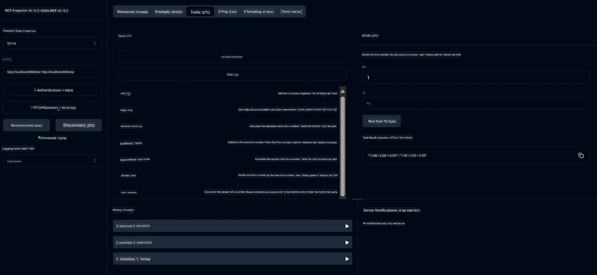

# שירות מחשבון בסיסי MCP

> [!NOTE]
> פתרון ה-Java הזה משתמש בתשתית HTTP+SSE המורשת ומיועד ל-SDK
> התואם ל-MCP `2025-11-25`. הוא נשמר כדי להתאים לקוד הקורס;
> שרתים מרוחקים חדשים צריכים להשתמש בתמיכה ב-Streamable HTTP `2026-07-28`.

שירות זה מספק פעולות מחשבון בסיסיות באמצעות פרוטוקול הקשר למודל (MCP) באמצעות Spring Boot עם תחבורת WebFlux. הוא מעוצב כדוגמה פשוטה למתחילים הלומדים על מימושי MCP.

למידע נוסף, ראו את תיעוד ההפניה של [MCP Server Boot Starter](https://docs.spring.io/spring-ai/reference/api/mcp/mcp-server-boot-starter-docs.html).


## שימוש בשירות

השירות חושף את נקודות הקצה הבאות ב-API דרך פרוטוקול MCP:

- `add(a, b)`: חיבור של שני מספרים יחד
- `subtract(a, b)`: חיסור המספר השני מהראשון
- `multiply(a, b)`: כפל של שני מספרים
- `divide(a, b)`: חילוק המספר הראשון בשני (עם בדיקה עבור אפס)
- `power(base, exponent)`: חישוב חזקת מספר
- `squareRoot(number)`: חישוב שורש ריבועי (עם בדיקה למספר שלילי)
- `modulus(a, b)`: חישוב השארית בחילוק
- `absolute(number)`: חישוב הערך המוחלט

## תלות

הפרויקט מצריך את התלויות המרכזיות הבאות:

```xml
<dependency>
    <groupId>org.springframework.ai</groupId>
    <artifactId>spring-ai-starter-mcp-server-webflux</artifactId>
</dependency>
```

## בניית הפרויקט

בנו את הפרויקט באמצעות Maven:
```bash
./mvnw clean install -DskipTests
```

## הרצת השרת

### שימוש ב-Java

```bash
java -jar target/calculator-server-0.0.1-SNAPSHOT.jar
```

### שימוש ב-MCP Inspector

MCP Inspector הוא כלי מועיל לאינטראקציה עם שירותי MCP. כדי להשתמש בו עם שירות המחשבון הזה:

1. **התקן והפעל את MCP Inspector** בחלון טרמינל חדש:
   ```bash
   npx @modelcontextprotocol/inspector
   ```

2. **גש לממשק האינטרנט** על ידי לחיצה על כתובת ה-URL שמוצגת באפליקציה (בדרך כלל http://localhost:6274)

3. **הגדר את החיבור**:
   - הגדר את סוג התחבורה ל-"SSE"
   - הגדר את כתובת ה-URL לנקודת הקצה SSE של השרת שלך: `http://localhost:8080/sse`
   - לחץ על "Connect"

4. **השתמש בכלים**:
   - לחץ על "List Tools" כדי לראות את פעולות המחשבון הזמינות
   - בחר כלי ולחץ על "Run Tool" כדי להפעיל פעולה



---

<!-- CO-OP TRANSLATOR DISCLAIMER START -->
**כתב ויתור**:
מסמך זה תורגם באמצעות שירות תרגום אוטומטי [Co-op Translator](https://github.com/Azure/co-op-translator). למרות שאנו שואפים לדיוק, יש לקחת בחשבון שתרגומים אוטומטיים עלולים להכיל שגיאות או אי-דיוקים. יש להחשיב את המסמך המקורי בשפתו הטבעית כמקור הסמכות. למידע קריטי מומלץ להשתמש בתרגום מקצועי על ידי מתרגם אדם. אנו לא אחראים לכל אי-הבנה או פירוש שגוי הנובע מהשימוש בתרגום זה.
<!-- CO-OP TRANSLATOR DISCLAIMER END -->