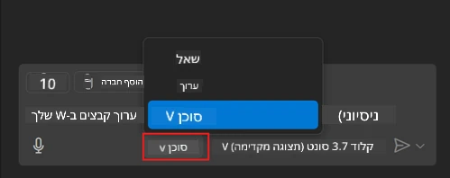
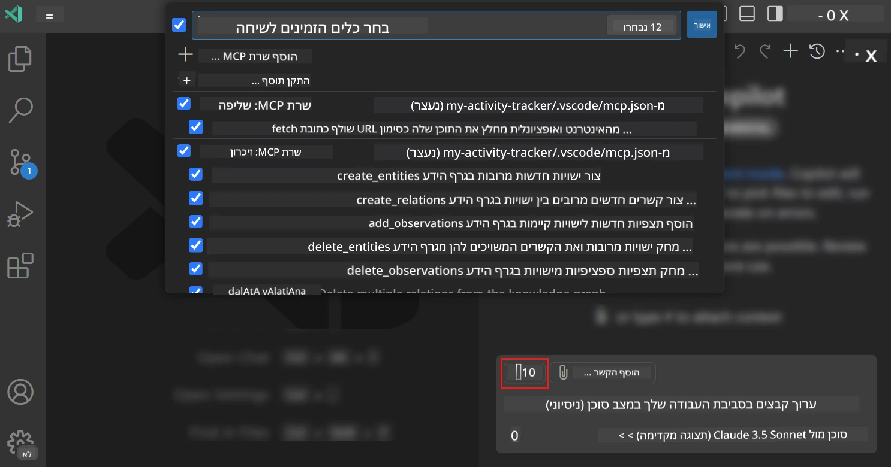
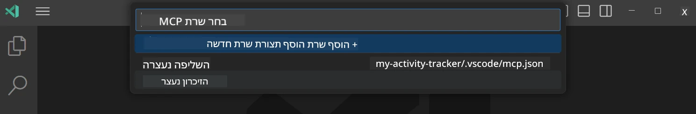
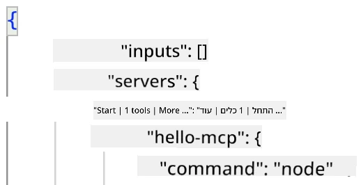
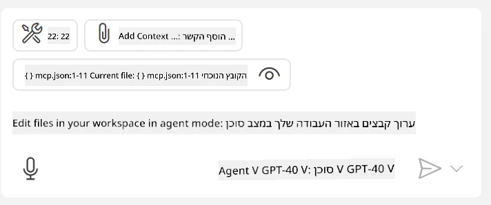
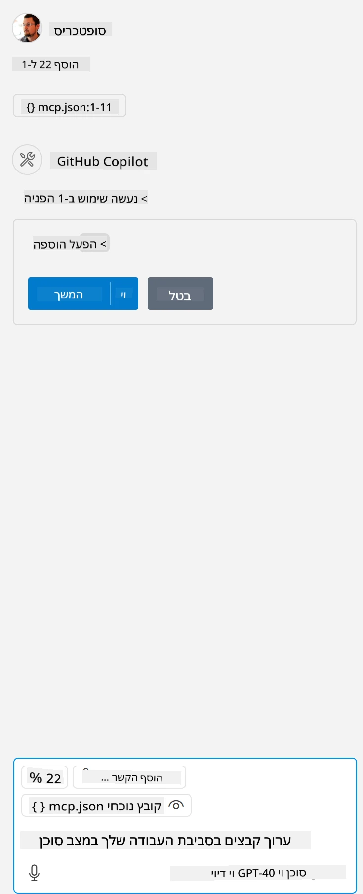

# צריכת שרת ממצב סוכן GitHub Copilot  

ל-Visual Studio Code ו-GitHub Copilot יש אפשרות לפעול כלקוח ולצרוך שרת MCP. אולי תהית למה נרצה לעשות זאת? ובכן, המשמעות היא שכל הפיצ'רים שיש לשרת MCP כעת ניתנים לשימוש מתוך סביבת הפיתוח שלך. דמיין שאתה מוסיף למשל את שרת MCP של GitHub, זה יכול לאפשר שליטה ב-GitHub דרך הנחיות בשפה על פני הקלדת פקודות ספציפיות בטרמינל. או דמיין כל דבר שיכול לשפר את חוויית המפתח שלך, הכל נשלט בשפה טבעית. עכשיו אתה מתחיל להבין את היתרון, נכון?  

## סקירה כללית  

שיעור זה יכסה כיצד להשתמש ב-Visual Studio Code ובמצב סוכן של GitHub Copilot כלקוח עבור שרת MCP שלך.  

## מטרות הלמידה  

עד סוף השיעור הזה תוכל:  

- לצרוך שרת MCP דרך Visual Studio Code.  
- להריץ יכולות כגון כלים דרך GitHub Copilot.  
- להגדיר את Visual Studio Code כדי לאתר ולנהל את שרת MCP שלך.  

## שימוש  

ניתן לשלוט על שרת MCP בשתי דרכים שונות:  

- ממשק משתמש, נראה כיצד זה מתבצע בהמשך הפרק.  
- טרמינל, ניתן לשלוט דרך הטרמינל באמצעות הקובץ ההרצה `code`:  

  כדי להוסיף שרת MCP לפרופיל המשתמש שלך, השתמש באפשרות שורת הפקודה --add-mcp וספק את הקונפיגורציה JSON של השרת בצורה {\"name\":\"server-name\",\"command\":...}.  

  ```
  code --add-mcp "{\"name\":\"my-server\",\"command\": \"uvx\",\"args\": [\"mcp-server-fetch\"]}"
  ```

### צילומי מסך  

  
  
  

בוא נדבר יותר על האופן שבו אנו משתמשים בממשק הוויזואלי בחלקים הבאים.  

## גישה  

כך אנו צריכים לגשת לנושא ברמה גבוהה:  

- לקבוע קובץ למציאת שרת MCP שלנו.  
- להפעיל/להתחבר לשרת כדי לקבל את רשימת היכולות שלו.  
- להשתמש ביכולות אלה דרך ממשק העברת ההודעות של GitHub Copilot.  

מצוין, עכשיו כשאנו מבינים את הזרימה, בואו ננסה להשתמש בשרת MCP דרך Visual Studio Code בתרגיל.  

## תרגיל: צריכת שרת  

בתרגיל זה, נגדיר את Visual Studio Code לאתר את שרת MCP שלך כך שניתן יהיה להשתמש בו דרך ממשק העברת ההודעות של GitHub Copilot.  

### -0- שלב מקדים, הפעלת גילוי שרת MCP  

ייתכן שתצטרך להפעיל גילוי שרתי MCP.  

1. עבור אל `File -> Preferences -> Settings` ב-Visual Studio Code.  

1. חפש "MCP" והפעל את `chat.mcp.discovery.enabled` בקובץ settings.json.  

### -1- צור קובץ קונפיגורציה  

התחל ביצירת קובץ קונפיגורציה בשורש הפרויקט שלך, תזדקק לקובץ בשם MCP.json ושם תאחסן אותו בתיקייה בשם .vscode. זה צריך להיראות כך:  

```text
.vscode
|-- mcp.json
```
  
לאחר מכן, נראה כיצד ניתן להוסיף רשומת שרת.  

### -2- הגדר שרת  

הוסף את התוכן הבא ל-*mcp.json*:  

```json
{
    "inputs": [],
    "servers": {
       "hello-mcp": {
           "command": "node",
           "args": [
               "build/index.js"
           ]
       }
    }
}
```
  
דוגמה פשוטה למעלה להדגמת הפעלת שרת ב-Node.js, עבור סביבות ריצה אחרות ציין את הפקודה הנכונה להפעלת השרת באמצעות `command` ו-`args`.  

### -3- הפעל את השרת  

כעת, לאחר שהוספת רשומה, הפעל את השרת:  

1. אתר את הרשומה שלך ב-*mcp.json* וודא שאתה רואה את סמל "הפעל":  

    

1. לחץ על סמל "הפעל", עליך לראות שהאייקון של הכלים בממשק שיחת GitHub Copilot יגדיל את מספר הכלים הזמינים. אם תלחץ על האייקון של הכלים, תראה רשימה של כלים רשומים. תוכל לסמן/לבטל את כל אחד לפי רצונך בשימוש של GitHub Copilot ככלי עזר להקשר:  

    

1. כדי להריץ כלי, הכנס הנחיה שאתה יודע שתתאים לתיאור של אחד הכלים שלך, למשל הנחיה כמו "הוסף 22 ל-1":  

    

  אמור להופיע תגובה עם הערך 23.  

## משימה  

נסה להוסיף רשומת שרת לקובץ *mcp.json* שלך וודא שאתה יכול להפעיל/להפסיק את השרת. וודא שאתה יכול גם לתקשר עם הכלים בשרת שלך דרך ממשק שיחת GitHub Copilot.  

## פתרון  

[פתרון](./solution/README.md)  

## נקודות מרכזיות  

הנקודות המרכזיות מפרק זה הן:  

- Visual Studio Code הוא לקוח מעולה שמאפשר לך לצרוך מספר שרתי MCP וכלים שלהם.  
- ממשק שיחת GitHub Copilot הוא האופן שבו אתה מתקשר עם השרתים.  
- ניתן לבקש מהמשתמש להזין קלט כגון מפתחות API שניתן להעביר לשרת MCP בעת קביעת רשומת השרת בקובץ *mcp.json*.  

## דוגמאות  

- [מחשבון Java](../samples/java/calculator/README.md)  
- [מחשבון .Net](../../../../03-GettingStarted/samples/csharp)  
- [מחשבון JavaScript](../samples/javascript/README.md)  
- [מחשבון TypeScript](../samples/typescript/README.md)  
- [מחשבון Python](../../../../03-GettingStarted/samples/python)  

## משאבים נוספים  

- [מסמכי Visual Studio](https://code.visualstudio.com/docs/copilot/chat/mcp-servers)  

## מה הלאה  

- הבא: [יצירת שרת stdio](../05-stdio-server/README.md)  

---

<!-- CO-OP TRANSLATOR DISCLAIMER START -->
**כתב ויתור**:
מסמך זה תורגם באמצעות שירות תרגום אוטומטי [Co-op Translator](https://github.com/Azure/co-op-translator). למרות שאנו שואפים לדיוק, יש לקחת בחשבון שתרגומים אוטומטיים עלולים להכיל שגיאות או אי-דיוקים. יש להחשיב את המסמך המקורי בשפתו הטבעית כמקור הסמכות. למידע קריטי מומלץ להשתמש בתרגום מקצועי על ידי מתרגם אדם. אנו לא אחראים לכל אי-הבנה או פירוש שגוי הנובע מהשימוש בתרגום זה.
<!-- CO-OP TRANSLATOR DISCLAIMER END -->