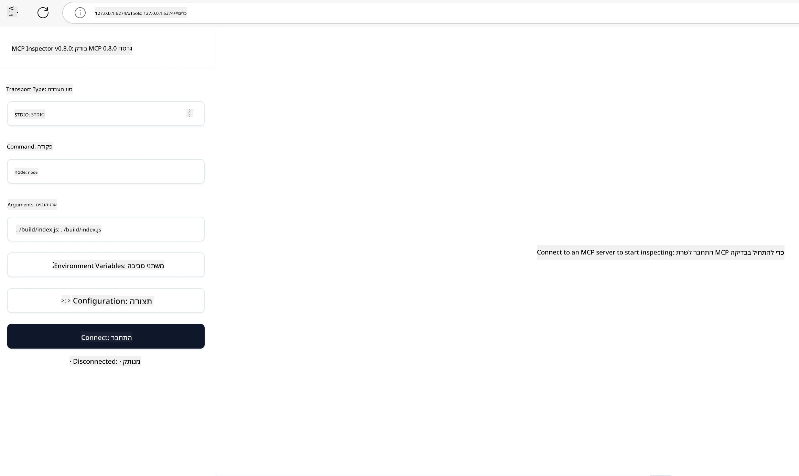

## בדיקה ופתרון תקלות

לפני שתתחיל לבדוק את שרת MCP שלך, חשוב להבין את הכלים הזמינים ואת שיטות העבודה המומלצות לפתרון תקלות. בדיקה יעילה מבטיחה שהשרת שלך מתנהג כמצופה ועוזרת לך לזהות ולהתמודד במהירות עם בעיות. הסעיף הבא מפרט גישות מומלצות לאימות היישום שלך של MCP.

## סקירה

שיעור זה מכסה כיצד לבחור את גישת הבדיקה הנכונה ואת כלי הבדיקה היעיל ביותר.

## מטרות למידה

בסיום שיעור זה, תוכל:

- לתאר גישות שונות לבדיקה.
- להשתמש בכלים שונים כדי לבדוק את הקוד שלך ביעילות.

## בדיקת שרתי MCP

MCP מספק כלים שיעזרו לך לבדוק ולפתור תקלות בשרתים שלך:

- **MCP Inspector**: כלי שורת פקודה שניתן להפעילו גם ככלי CLI וגם ככלי ויזואלי.
- **בדיקה ידנית**: ניתן להשתמש בכלי כמו curl להרצת בקשות ווב, אך כל כלי שמסוגל להריץ HTTP יספיק.
- **בדיקות יחידה**: ניתן להשתמש במסגרת בדיקות מועדפת כדי לבדוק תכונות של השרת והלקוח.

### שימוש ב-MCP Inspector

כבר תיארנו את השימוש בכלי זה בשיעורים קודמים, אך נרחיב עליו בקצרה. זהו כלי שנבנה ב-Node.js ואתה יכול להשתמש בו באמצעות הפעלת הקובץ הניתן להרצה `npx` אשר יוריד ויתקין את הכלי זמנית וינקה את עצמו לאחר סיום הרצת הבקשה שלך.

ה-[MCP Inspector](https://github.com/modelcontextprotocol/inspector) עוזר לך:

- **לגלות יכולות שרת**: לזהות אוטומטית משאבים, כלים והנחיות זמינים
- **לבחון הרצת כלים**: לנסות פרמטרים שונים ולראות תגובות בזמן אמת
- **לצפות במטה-נתוני שרת**: לבדוק מידע על השרת, סכימות וקונפיגורציות

הרצה טיפוסית של הכלי נראית כך:

```bash
npx @modelcontextprotocol/inspector node build/index.js
```

הפקודה שלמעלה מפעילה MCP וממשק ויזואלי שלה ומשיקה ממשק רשת מקומי בדפדפן שלך. ניתן לצפות ללוח בקרה המציג את שרתי ה-MCP הרשומים שלך, הכלים, המשאבים וההנחיות הזמינים להם. הממשק מאפשר לך לבדוק בצורה אינטראקטיבית הרצת כלים, לבדוק את המטה-נתונים של השרת ולצפות בתגובות בזמן אמת, מה שמקל על אימות ופתרון תקלות של יישומי שרת MCP.

כך זה יכול להיראות: 

ניתן גם להפעיל את הכלי במצב CLI, במידה וכן יש להוסיף את התכונה `--cli`. הנה דוגמה להרצת הכלי במצב "CLI" שמציגה את כל הכלים בשרת:

```sh
npx @modelcontextprotocol/inspector --cli node build/index.js --method tools/list
```

### בדיקה ידנית

מלבד הפעלת כלי המפקח לבדיקת יכולות השרת, גישה דומה היא להריץ לקוח התומך ב-HTTP, למשל curl.

עם curl, ניתן לבדוק ישירות שרתי MCP באמצעות בקשות HTTP:

```bash
# דוגמה: מטה-נתוני שרת בדיקה
curl http://localhost:3000/v1/metadata

# דוגמה: הפעלת כלי
curl -X POST http://localhost:3000/v1/tools/execute \
  -H "Content-Type: application/json" \
  -d '{"name": "calculator", "parameters": {"expression": "2+2"}}'
```

כפי שניתן לראות בדוגמה שלמעלה לשימוש ב-curl, אתה מבצע בקשת POST להפעיל כלי באמצעות מטען (payload) הכולל את שם הכלי ואת הפרמטרים שלו. השתמש בגישה המתאימה לך ביותר. כלים בשורת הפקודה בדרך כלל מהירים יותר לשימוש ומתאימים לכתיבת סקריפטים, דבר שעשוי להיות שימושי בסביבת CI/CD.

### בדיקות יחידה

צור בדיקות יחידה לכלים ולמשאבים שלך כדי לוודא שהם פועלים כמצופה. הנה דוגמת קוד בדיקה.

```python
import pytest

from mcp.server.fastmcp import FastMCP
from mcp.shared.memory import (
    create_connected_server_and_client_session as create_session,
)

# סמן את כל המודול לבדיקה אסינכרונית
pytestmark = pytest.mark.anyio


async def test_list_tools_cursor_parameter():
    """Test that the cursor parameter is accepted for list_tools.

    Note: FastMCP doesn't currently implement pagination, so this test
    only verifies that the cursor parameter is accepted by the client.
    """

 server = FastMCP("test")

    # צור כמה כלים לבדיקה
    @server.tool(name="test_tool_1")
    async def test_tool_1() -> str:
        """First test tool"""
        return "Result 1"

    @server.tool(name="test_tool_2")
    async def test_tool_2() -> str:
        """Second test tool"""
        return "Result 2"

    async with create_session(server._mcp_server) as client_session:
        # בדיקה ללא פרמטר סמן (הושמט)
        result1 = await client_session.list_tools()
        assert len(result1.tools) == 2

        # בדיקה עם סמן=None
        result2 = await client_session.list_tools(cursor=None)
        assert len(result2.tools) == 2

        # בדיקה עם סמן כמחרוזת
        result3 = await client_session.list_tools(cursor="some_cursor_value")
        assert len(result3.tools) == 2

        # בדיקה עם סמן מחרוזת ריקה
        result4 = await client_session.list_tools(cursor="")
        assert len(result4.tools) == 2
    
```

הקוד שלמעלה עושה את הדברים הבאים:

- מנצל את מסגרת pytest המאפשרת ליצור בדיקות כפונקציות ולהשתמש בהצהרות assert.
- יוצר שרת MCP עם שני כלים שונים.
- משתמש בהצהרת `assert` כדי לוודא שקריטריונים מסוימים מתקיימים.

עיין ב-[הקובץ המלא כאן](https://github.com/modelcontextprotocol/python-sdk/blob/main/tests/client/test_list_methods_cursor.py)

בהינתן הקובץ שלמעלה, אפשר לבדוק את השרת שלך כדי לוודא שהיכולות נוצרות כראוי.

כל ערכות הפיתוח הגדולות (SDKs) כוללות סעיפי בדיקות דומים כך שניתן להתאים לרuntime שבחרת.

## דוגמאות

- [מחשבון Java](../samples/java/calculator/README.md)
- [מחשבון .Net](../../../../03-GettingStarted/samples/csharp)
- [מחשבון JavaScript](../samples/javascript/README.md)
- [מחשבון TypeScript](../samples/typescript/README.md)
- [מחשבון Python](../../../../03-GettingStarted/samples/python)

## משאבים נוספים

- [Python SDK](https://github.com/modelcontextprotocol/python-sdk)

## מה הלאה

- הבא: [פריסה](../09-deployment/README.md)

---

<!-- CO-OP TRANSLATOR DISCLAIMER START -->
**כתב ויתור**:  
מסמך זה תורגם באמצעות שירות תרגום בינה מלאכותית [Co-op Translator](https://github.com/Azure/co-op-translator). למרות שאנו שואפים לדיוק, יש לקחת בחשבון כי תרגומים אוטומטיים עלולים להכיל שגיאות או אי-דיוקים. יש לראות במסמך המקורי בשפתו המקורית כמקור הרשמי והמהימן. למידע קריטי מומלץ לעשות שימוש בתרגום מקצועי על ידי אדם. אנו לא נושאים באחריות עבור אי-הבנות או פרשנויות שגויות הנובעות משימוש בתרגום זה.
<!-- CO-OP TRANSLATOR DISCLAIMER END -->