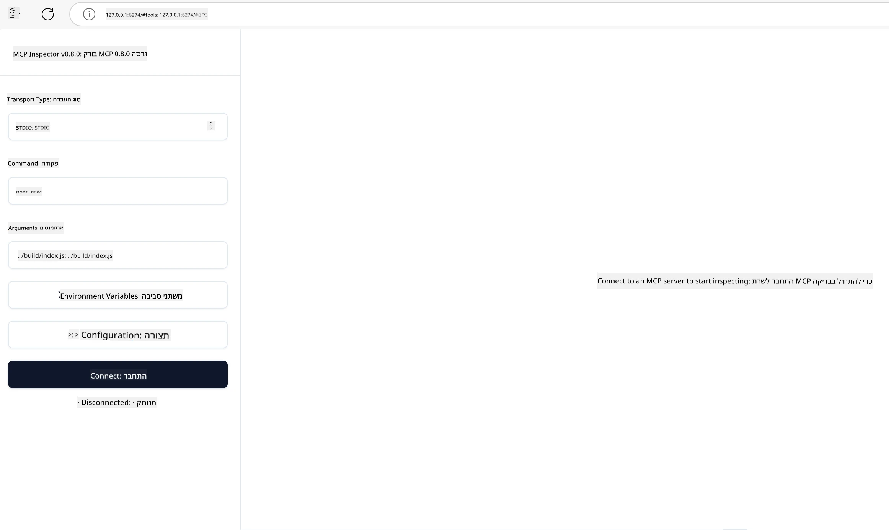

## בדיקות וניפוי שגיאות

לפני שאתה מתחיל לבדוק את שרת MCP שלך, חשוב להבין את הכלים הזמינים ואת שיטות העבודה המומלצות לניפוי שגיאות. בדיקות יעילות מבטיחות שהשרת שלך פועל כפי שצופה ועוזרות לך לזהות ולפתור בעיות במהירות. הסעיף הבא מתאר גישות מומלצות לאימות יישום MCP שלך.

## סקירה כללית

השיעור הזה מסביר כיצד לבחור את גישת הבדיקה הנכונה ואת כלי הבדיקה היעיל ביותר.

## מטרות הלימוד

בסוף השיעור הזה תוכל:

- לתאר גישות שונות לביצוע בדיקות.
- להשתמש בכלים שונים כדי לבדוק את הקוד שלך ביעילות.


## בדיקת שרתי MCP

MCP מספק כלים שיעזרו לך לבדוק ולנטרל שגיאות בשרתים שלך:

- **MCP Inspector**: כלי שורת פקודה שניתן להריץ גם ככלי CLI וגם ככלי חזותי.
- **בדיקות ידניות**: ניתן להשתמש בכלי כמו curl להפעיל בקשות רשת, אבל כל כלי שיכול להריץ HTTP יעבוד.
- **בדיקות יחידה**: ניתן להשתמש במסגרת הבדיקה המועדפת עליך כדי לבדוק תכונות של השרת והלקוח.

### שימוש ב-MCP Inspector

תיארנו את השימוש בכלי זה בשיעורים קודמים אך נדבר עליו מעט ברמה גבוהה. זהו כלי שנבנה ב-Node.js, ואתה יכול להשתמש בו על ידי קריאה לקובץ ההרצה `npx` שירד ויתקין את הכלי באופן זמני ויסיר אותו לאחר סיום הרצת הבקשה שלך.

ה-[MCP Inspector](https://github.com/modelcontextprotocol/inspector) עוזר לך:

- **לגלות יכולות של השרת**: לזהות באופן אוטומטי משאבים, כלים והנחיות זמינות
- **להריץ את כלי הבדיקה**: לנסות פרמטרים שונים ולראות תגובות בזמן אמת
- **לבדוק מטא-נתוני השרת**: לבחון מידע על השרת, סכימות והגדרות

ריצה טיפוסית של הכלי נראית כך:

```bash
npx @modelcontextprotocol/inspector node build/index.js
```

הפקודה לעיל מפעילה MCP ואת הממשק החזותי שלו ומשיקה ממשק רשת מקומי בדפדפן שלך. תוכל לצפות ללוח בקרה המציג את שרתי MCP הרשומים שלך, את הכלים, המשאבים וההנחיות הזמינים להם. הממשק מאפשר לך לבדוק אינטראקטיבית את הרצת הכלים, לבדוק את מטא-נתוני השרת ולצפות בתגובות בזמן אמת, מה שמקל על אימות וניפוי שגיאות ביישומי שרת MCP שלך.

כך זה יכול להיראות: 

ניתן גם להפעיל את הכלי במצב CLI שבו מוסיפים את התכונה `--cli`. הנה דוגמה להרצת הכלי במצב "CLI" שמציגה את כל הכלים בשרת:

```sh
npx @modelcontextprotocol/inspector --cli node build/index.js --method tools/list
```

### בדיקות ידניות

מעבר להרצת כלי המפקח לבדיקת יכולות השרת, גישה דומה היא להפעיל לקוח שיכול להשתמש ב-HTTP כמו למשל curl.

עם curl, תוכל לבדוק שרתי MCP ישירות באמצעות בקשות HTTP:

```bash
# דוגמה: מטא-דטה של שרת בדיקה
curl http://localhost:3000/v1/metadata

# דוגמה: הפעלת כלי
curl -X POST http://localhost:3000/v1/tools/execute \
  -H "Content-Type: application/json" \
  -d '{"name": "calculator", "parameters": {"expression": "2+2"}}'
```

כפי שניתן לראות מהשימוש ב-curl למעלה, אתה משתמש בבקשת POST כדי להפעיל כלי באמצעות גוף בקשה הכולל את שם הכלי והפרמטרים שלו. השתמש בגישה המתאימה לך ביותר. כלים בקו הפקודה נוטים להיות מהירים יותר לשימוש ומתאימים לתסריטאציה, דבר שיכול להיות שימושי בסביבת CI/CD.

### בדיקות יחידה

צור בדיקות יחידה לכלים ולמשאבים שלך כדי לוודא שהם פועלים כפי שצופה. הנה קוד בדיקה לדוגמה.

```python
import pytest

from mcp.server.fastmcp import FastMCP
from mcp.shared.memory import (
    create_connected_server_and_client_session as create_session,
)

# סמנו את כל המודול לבדיקות אסינכרוניות
pytestmark = pytest.mark.anyio


async def test_list_tools_cursor_parameter():
    """Test that the cursor parameter is accepted for list_tools.

    Note: FastMCP doesn't currently implement pagination, so this test
    only verifies that the cursor parameter is accepted by the client.
    """

 server = FastMCP("test")

    # יצירת כמה כלי בדיקה
    @server.tool(name="test_tool_1")
    async def test_tool_1() -> str:
        """First test tool"""
        return "Result 1"

    @server.tool(name="test_tool_2")
    async def test_tool_2() -> str:
        """Second test tool"""
        return "Result 2"

    async with create_session(server._mcp_server) as client_session:
        # בדיקה ללא פרמטר סמן (הושמט)
        result1 = await client_session.list_tools()
        assert len(result1.tools) == 2

        # בדיקה עם סמן=None
        result2 = await client_session.list_tools(cursor=None)
        assert len(result2.tools) == 2

        # בדיקה עם סמן כמחרוזת
        result3 = await client_session.list_tools(cursor="some_cursor_value")
        assert len(result3.tools) == 2

        # בדיקה עם סמן מחרוזת ריקה
        result4 = await client_session.list_tools(cursor="")
        assert len(result4.tools) == 2
    
```

הקוד שלמעלה עושה את הדברים הבאים:

- משתמש במסגרת pytest שמאפשרת ליצור בדיקות כפונקציות ולהשתמש בביטויי assert.
- יוצר שרת MCP עם שני כלים שונים.
- משתמש ב`assert` כדי לבדוק שקריטריונים מסוימים מתקיימים.

עיין ב-[הקובץ המלא כאן](https://github.com/modelcontextprotocol/python-sdk/blob/main/tests/client/test_list_methods_cursor.py)

בהתחשב בקובץ שלמעלה, תוכל לבדוק את השרת שלך כדי לוודא שהיכולות נוצרות כראוי.

כל ערכות הפיתוח הגדולות כוללות סעיפי בדיקות דומים ולכן תוכל להתאים לסביבת הריצה שבחרת.

## דוגמאות

- [מחשבון Java](../samples/java/calculator/README.md)
- [מחשבון .Net](../../../../03-GettingStarted/samples/csharp)
- [מחשבון JavaScript](../samples/javascript/README.md)
- [מחשבון TypeScript](../samples/typescript/README.md)
- [מחשבון Python](../../../../03-GettingStarted/samples/python)

## משאבים נוספים

- [Python SDK](https://github.com/modelcontextprotocol/python-sdk)

## מה הלאה

- הבא: [פריסה](../09-deployment/README.md)

---

<!-- CO-OP TRANSLATOR DISCLAIMER START -->
**כתב ויתור**:
מסמך זה תורגם באמצעות שירות תרגום אוטומטי [Co-op Translator](https://github.com/Azure/co-op-translator). למרות שאנו שואפים לדיוק, יש לקחת בחשבון שתרגומים אוטומטיים עלולים להכיל שגיאות או אי-דיוקים. יש להחשיב את המסמך המקורי בשפתו הטבעית כמקור הסמכות. למידע קריטי מומלץ להשתמש בתרגום מקצועי על ידי מתרגם אדם. אנו לא אחראים לכל אי-הבנה או פירוש שגוי הנובע מהשימוש בתרגום זה.
<!-- CO-OP TRANSLATOR DISCLAIMER END -->