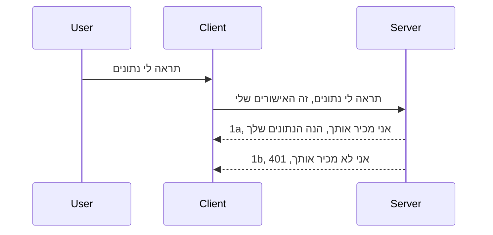

# אימות פשוט

MCP SDKs תומכות בשימוש ב-OAuth 2.1, שהיא תהליך די מורכב הכולל מושגים כמו שרת אימות, שרת משאבים, שליחת אישורים, קבלת קוד, החלפת הקוד בטוקן נושא הרשאות עד שניתן לקבל סוף סוף את נתוני המשאב. אם אינך רגיל ל-OAuth, שהוא דבר מצוין ליישום, זה רעיון טוב להתחיל עם רמת אימות בסיסית ולבנות למה שיש יותר ויותר אבטחה. לכן קיים הפרק הזה, כדי לבנות אותך לאימות מתקדם יותר.

## אימות, למה אנו מתכוונים?

אימות הוא קיצור של אימות והרשאה. הרעיון הוא שעלינו לעשות שני דברים:

- **אימות**, שהוא תהליך של קביעת אם אנו מרשים לאדם להיכנס לבית שלנו, שהוא זכאי להיות "כאן", כלומר שיש לו גישה לשרת המשאבים שלנו שבו פועלות הפונקציות של שרת MCP שלנו.
- **הרשאה**, הוא תהליך של מציאת אם למשתמש צריכה להיות גישה למשאבים ספציפיים שהוא מבקש, למשל הזמנות אלו או מוצרים אלו, או אם מותר לו לקרוא את התוכן אך לא למחוק, כדוגמה אחרת.

## אישורים: איך אנו מספרים למערכת מי אנחנו

ובכן, רוב מפתחי האינטרנט מתחילים לחשוב במונחים של מתן אישור לשרת, בדרך כלל סוד שאומר אם מותר להם להיות כאן "אימות". אישור זה בדרך כלל הוא גרסה מקודדת ב-base64 של שם משתמש וסיסמה או מפתח API שמזהה באופן ייחודי משתמש ספציפי.

הדבר כולל שליחה דרך כותרת שנקראת "Authorization" כך:

```json
{ "Authorization": "secret123" }
```
  
זה בדרך כלל נקרא אימות בסיסי. איך הזרימה כולה עובדת אז הוא כך:


עכשיו כשאנחנו מבינים איך זה עובד מבחינת זרימה, איך אנו מיישמים את זה? ובכן, רוב שרתי האינטרנט מכילים מושג שנקרא middleware, חתיכת קוד שרצה כחלק מהבקשה שיכולה לוודא את האישורים, ואם האישורים תקינים ניתן לתת לבקשה לעבור. אם הבקשה אינה מכילה אישורים תקינים אז תקבל שגיאת אימות. בוא נראה איך ניתן לממש זאת:

**Python**

```python
class AuthMiddleware(BaseHTTPMiddleware):
    async def dispatch(self, request, call_next):

        has_header = request.headers.get("Authorization")
        if not has_header:
            print("-> Missing Authorization header!")
            return Response(status_code=401, content="Unauthorized")

        if not valid_token(has_header):
            print("-> Invalid token!")
            return Response(status_code=403, content="Forbidden")

        print("Valid token, proceeding...")
       
        response = await call_next(request)
        # הוסף כותרות לקוח כלשהן או שינוי בתגובה בצורה כלשהי
        return response


starlette_app.add_middleware(CustomHeaderMiddleware)
```
  
כאן יש לנו:

- יצרנו middleware בשם `AuthMiddleware` שבו מתודה `dispatch` מופעלת על ידי שרת האינטרנט.
- הוספנו את ה-middleware לשרת האינטרנט:

    ```python
    starlette_app.add_middleware(AuthMiddleware)
    ```
  
- כתבנו לוגיקת ולידציה שבודקת אם כותרת Authorization קיימת ואם הסוד שנשלח תקין:

    ```python
    has_header = request.headers.get("Authorization")
    if not has_header:
        print("-> Missing Authorization header!")
        return Response(status_code=401, content="Unauthorized")

    if not valid_token(has_header):
        print("-> Invalid token!")
        return Response(status_code=403, content="Forbidden")
    ```
  
    אם הסוד נוכח ותקין, אז אנו מאפשרים לבקשה לעבור על ידי קריאה ל- `call_next` ומחזירים את התגובה.

    ```python
    response = await call_next(request)
    # הוסף כותרות לקוח כלשהן או שנה את התגובה בצורה כלשהי
    return response
    ```
  
איך זה עובד הוא שאם נעשתה בקשת ווב לשרת, ה-middleware יופעל ובהתאם למימוש שלו, או ייתן לבקשה לעבור או יוחזר שגיאה שמציינת שללקוח אין הרשאה להמשיך.

**TypeScript**

כאן ניצור middleware במסגרת הפופולרית Express ונתפס את הבקשה לפני שהיא מגיעה לשרת MCP. הנה הקוד לכך:

```typescript
function isValid(secret) {
    return secret === "secret123";
}

app.use((req, res, next) => {
    // 1. האם כותרת האישור קיימת?
    if(!req.headers["Authorization"]) {
        res.status(401).send('Unauthorized');
    }
    
    let token = req.headers["Authorization"];

    // 2. בדוק את התוקף.
    if(!isValid(token)) {
        res.status(403).send('Forbidden');
    }

   
    console.log('Middleware executed');
    // 3. מעביר את הבקשה לשלב הבא בצינור הבקשות.
    next();
});
```
  
בקוד זה אנחנו:

1. בודקים אם כותרת Authorization קיימת מלכתחילה, אם לא, אנו שולחים שגיאה 401.
2. מוודאים שהאישור/טוקן תקין, אם לא, אנו שולחים שגיאה 403.
3. לבסוף מעבירים את הבקשה בצינור הבקשות ומחזירים את המשאב המבוקש.

## תרגיל: מימוש אימות

בואו ניקח את הידע שלנו וננסה ליישם אותו. הנה התוכנית:

שרת 

- יצירת שרת אינטרנט ואינסטנס MCP.
- מימוש middleware לשרת.

לקוח 

- שליחת בקשת ווב עם אישור דרך הכותרת.

### -1- יצירת שרת אינטרנט ואינסטנס MCP

בשלב הראשון, אנו צריכים ליצור את אינסטנס שרת האינטרנט ואת שרת ה-MCP.

**Python**

כאן אנו יוצרים אינסטנס של שרת MCP, יוצרים אפליקציית starlette ומארחים אותה עם uvicorn.

```python
# יצירת שרת MCP

app = FastMCP(
    name="MCP Resource Server",
    instructions="Resource Server that validates tokens via Authorization Server introspection",
    host=settings["host"],
    port=settings["port"],
    debug=True
)

# יצירת אפליקציית ווב starlette
starlette_app = app.streamable_http_app()

# הפעלת האפליקציה באמצעות uvicorn
async def run(starlette_app):
    import uvicorn
    config = uvicorn.Config(
            starlette_app,
            host=app.settings.host,
            port=app.settings.port,
            log_level=app.settings.log_level.lower(),
        )
    server = uvicorn.Server(config)
    await server.serve()

run(starlette_app)
```
  
בקוד זה אנו:

- יוצרים את שרת MCP.
- בונים את אפליקציית starlette מתוך שרת MCP, `app.streamable_http_app()`.
- מארחים ומפעילים את אפליקציית האינטרנט באמצעות uvicorn `server.serve()`.

**TypeScript**

כאן אנו יוצרים אינסטנס של שרת MCP.

```typescript
const server = new McpServer({
      name: "example-server",
      version: "1.0.0"
    });

    // ... להגדיר משאבי שרת, כלים, והנחיות ...
```
  
יצירת שרת MCP זה תצטרך להיעשות במסגרת הגדרת הנתיב POST /mcp שלנו, אז ניקח את הקוד הנ"ל ונזיז אותו כך:

```typescript
import express from "express";
import { randomUUID } from "node:crypto";
import { McpServer } from "@modelcontextprotocol/sdk/server/mcp.js";
import { StreamableHTTPServerTransport } from "@modelcontextprotocol/sdk/server/streamableHttp.js";
import { isInitializeRequest } from "@modelcontextprotocol/sdk/types.js"

const app = express();
app.use(express.json());

// מפה לאחסון תחבורה לפי מזהה מושב
const transports: { [sessionId: string]: StreamableHTTPServerTransport } = {};

// טיפול בבקשות POST לתקשורת מלקוח לשרת
app.post('/mcp', async (req, res) => {
  // בדיקת קיום מזהה מושב
  const sessionId = req.headers['mcp-session-id'] as string | undefined;
  let transport: StreamableHTTPServerTransport;

  if (sessionId && transports[sessionId]) {
    // שימוש חוזר בתחבורה קיימת
    transport = transports[sessionId];
  } else if (!sessionId && isInitializeRequest(req.body)) {
    // בקשת אתחול חדשה
    transport = new StreamableHTTPServerTransport({
      sessionIdGenerator: () => randomUUID(),
      onsessioninitialized: (sessionId) => {
        // אחסון התחבורה לפי מזהה מושב
        transports[sessionId] = transport;
      },
      // הגנת DNS rebinding מושבתת כברירת מחדל כדי לשמור על תאימות לאחור. אם אתה מפעיל שרת זה
      // באופן מקומי, ודא שאתה מגדיר את:
      // enableDnsRebindingProtection: true,
      // allowedHosts: ['127.0.0.1'],
    });

    // ניקוי התחבורה כאשר היא נסגרת
    transport.onclose = () => {
      if (transport.sessionId) {
        delete transports[transport.sessionId];
      }
    };
    const server = new McpServer({
      name: "example-server",
      version: "1.0.0"
    });

    // ... הקמת משאבי שרת, כלים והנחיות ...

    // התחברות לשרת MCP
    await server.connect(transport);
  } else {
    // בקשה לא חוקית
    res.status(400).json({
      jsonrpc: '2.0',
      error: {
        code: -32000,
        message: 'Bad Request: No valid session ID provided',
      },
      id: null,
    });
    return;
  }

  // טיפול בבקשה
  await transport.handleRequest(req, res, req.body);
});

// מטפל שניתן להשתמש בו מחדש לבקשות GET ו-DELETE
const handleSessionRequest = async (req: express.Request, res: express.Response) => {
  const sessionId = req.headers['mcp-session-id'] as string | undefined;
  if (!sessionId || !transports[sessionId]) {
    res.status(400).send('Invalid or missing session ID');
    return;
  }
  
  const transport = transports[sessionId];
  await transport.handleRequest(req, res);
};

// טיפול בבקשות GET להודעות משרת ללקוח דרך SSE
app.get('/mcp', handleSessionRequest);

// טיפול בבקשות DELETE לסיום מושב
app.delete('/mcp', handleSessionRequest);

app.listen(3000);
```
  
כעת אתה רואה איך יצירת שרת ה-MCP הועברה לתוך `app.post("/mcp")`.

בוא נמשיך לשלב הבא של יצירת ה-middleware כדי שנוכל לאמת את האישורים הנכנסים.

### -2- מימוש middleware לשרת

נעבור לחלק ה-middleware הבא. כאן ניצור middleware שמחפש אישור בכותרת `Authorization` ומאמת אותו. אם זה מקובל, הבקשה תמשיך לעשות את מה שהיא צריכה (למשל: לרשום כלים, לקרוא משאב או כל פונקציונליות MCP שהלקוח ביקש).

**Python**

כדי ליצור את ה-middleware, אנו צריכים ליצור מחלקה שיורשת מ- `BaseHTTPMiddleware`. יש שני חלקים מעניינים:

- הבקשה `request`, שאנו קוראים ממנה את מידע הכותרות.
- `call_next` הפונקציה שעלינו להפעיל אם הלקוח הביא אישור שאנו מקבלים.

ראשית, עלינו לטפל במקרה שבו כותרת `Authorization` חסרה:

```python
has_header = request.headers.get("Authorization")

# אין כותרת, נכשל עם 401, אחרת ממשיכים.
if not has_header:
    print("-> Missing Authorization header!")
    return Response(status_code=401, content="Unauthorized")
```
  
כאן אנו שולחים הודעת 401 לא מורשה כי הלקוח נכשל באימות.

בהמשך, אם הוגש אישור, עלינו לבדוק את תקינותו כך:

```python
 if not valid_token(has_header):
    print("-> Invalid token!")
    return Response(status_code=403, content="Forbidden")
```
  
שים לב שאנו שולחים הודעת 403 אסור למעלה. בוא נראה את ה-middleware המלא למטה שמממש הכל שציינו למעלה:

```python
class AuthMiddleware(BaseHTTPMiddleware):
    async def dispatch(self, request, call_next):

        has_header = request.headers.get("Authorization")
        if not has_header:
            print("-> Missing Authorization header!")
            return Response(status_code=401, content="Unauthorized")

        if not valid_token(has_header):
            print("-> Invalid token!")
            return Response(status_code=403, content="Forbidden")

        print("Valid token, proceeding...")
        print(f"-> Received {request.method} {request.url}")
        response = await call_next(request)
        response.headers['Custom'] = 'Example'
        return response

```
  
מצוין, אבל מה לגבי הפונקציה `valid_token`? הנה היא למטה:
:

```python
# אל תשתמש בפרודקשן - שפר את זה !!
def valid_token(token: str) -> bool:
    # הסר את הקידומת "Bearer "
    if token.startswith("Bearer "):
        token = token[7:]
        return token == "secret-token"
    return False
```
  
ברור שזה צריך להשתפר.

חשוב: אסור לך לעולם לשים סודות כאלה בקוד. יש לקחת את הערך להשוואה ממקור נתונים או מספק שירותי זהות (IDP) או עדיף - לתת ל-IDP לבצע את האימות.

**TypeScript**

כדי לממש זאת עם Express, עלינו לקרוא ל-metoda `use` שלוקחת פונקציות middleware.

נדרש:

- להתקשר למשתנה הבקשה כדי לבדוק את האישורים שהועברו בפרופרטי `Authorization`.
- לוודא את תקינות האישורים, ואם הם כאלו, לאפשר לבקשה להמשיך ולבצע את בקשת MCP של הלקוח (למשל: רשימת כלים, קריאת משאב וכו').

כאן בודקים אם כותרת ה-`Authorization` קיימת ואם לא, אנו עוצרים את הבקשה מלעבור:

```typescript
if(!req.headers["authorization"]) {
    res.status(401).send('Unauthorized');
    return;
}
```
  
אם הכותרת לא נשלחה מלכתחילה, תקבל שגיאה 401.

בהמשך, אנו בודקים אם האישורים תקינים, ואם לא, אנו שוב עוצרים את הבקשה אך עם הודעה שונה מעט:

```typescript
if(!isValid(token)) {
    res.status(403).send('Forbidden');
    return;
} 
```
  
שים לב שעכשיו אתה מקבל שגיאת 403.

הנה הקוד המלא:

```typescript
app.use((req, res, next) => {
    console.log('Request received:', req.method, req.url, req.headers);
    console.log('Headers:', req.headers["authorization"]);
    if(!req.headers["authorization"]) {
        res.status(401).send('Unauthorized');
        return;
    }
    
    let token = req.headers["authorization"];

    if(!isValid(token)) {
        res.status(403).send('Forbidden');
        return;
    }  

    console.log('Middleware executed');
    next();
});
```
  
הגדרנו את שרת האינטרנט לקבל middleware שמאמת את האישורים שהלקוח שולח אלינו. מה עם הלקוח עצמו?

### -3- שליחת בקשת ווב עם אישור דרך הכותרת

עלינו לוודא שהלקוח מעביר את האישורים דרך הכותרת. מאחר ואנו הולכים להשתמש בלקוח MCP לכך, עלינו להבין איך עושים זאת.

**Python**

ללקוח עלינו להעביר כותרת עם האישורים כך:

```python
# אל תקבע את הערך בקוד עצמו, תשתמש לפחות במשתנה סביבה או באחסון בטוח יותר
token = "secret-token"

async with streamablehttp_client(
        url = f"http://localhost:{port}/mcp",
        headers = {"Authorization": f"Bearer {token}"}
    ) as (
        read_stream,
        write_stream,
        session_callback,
    ):
        async with ClientSession(
            read_stream,
            write_stream
        ) as session:
            await session.initialize()
      
            # TODO, מה שתרצה שיבוצע בצד הלקוח, לדוגמה רשום כלים, הפעל כלים וכדומה
```
  
שים לב איך אנו ממלאים את הפרופרטי `headers` כך: ` headers = {"Authorization": f"Bearer {token}"}`.

**TypeScript**

אפשר לפתור זאת בשני שלבים:

1. למלא אובייקט קונפיגורציה עם האישורים שלנו.
2. להעביר את אובייקט הקונפיגורציה להובלה (transport).

```typescript

// אל תקודד את הערך כאן כך. לפחות הגדר אותו כמשתנה סביבה והשתמש במשהו כמו dotenv (במצב פיתוח).
let token = "secret123"

// להגדיר עצם אפשרויות הובלת לקוח
let options: StreamableHTTPClientTransportOptions = {
  sessionId: sessionId,
  requestInit: {
    headers: {
      "Authorization": "secret123"
    }
  }
};

// להעביר את עצם האפשרויות להובלה
async function main() {
   const transport = new StreamableHTTPClientTransport(
      new URL(serverUrl),
      options
   );
```
  
כאן למעלה רואים איך היה צורך ליצור אובייקט `options` ולמקם את הכותרות תחת פרופרטי `requestInit`.

חשוב: איך משפרים את זה מכאן? ובכן, היישום הנוכחי כולל בעיות. ראשית, העברת אישור כזה היא בסיכון גדול אלא אם לפחות יש לך HTTPS. גם אז, ניתן לגנוב את האישורים ולכן צריך מערכת שמאפשרת להשיב את הטוקן בקלות ולבצע בדיקות נוספות כמו מאיפה בעולם הטוקן מגיע, האם הבקשה מתבצעת לעיתים קרובות מדי (התנהגות רובוטית), בקיצור, יש הרבה חששות.

עם זאת, צריך לומר, עבור API פשוט מאוד שבו אינך רוצה שאף אחד יקרא ל-API שלך בלי להיות מאומת, מה שיש כאן הוא התחלה טובה.

עם זאת, ננסה לחזק את האבטחה מעט על ידי שימוש בפורמט סטנדרטי כמו JSON Web Token, הידוע גם בשם JWT או "ג'יי או טי" טוקנים.

## JSON Web Tokens, JWT

אם כן, אנו מנסים לשפר את העניינים מעבר לשליחת אישורים פשוטים. מה הן השיפורים המיידיים שאנו זוכים להם באימוץ JWT?

- **שיפורי אבטחה**. באימות בסיסי, אתה שולח שוב ושוב את שם המשתמש והסיסמה כמטען מקודד ב-base64 (או מפתח API), מה שמגדיל את הסיכון. עם JWT, אתה שולח את שם המשתמש והסיסמה ומקבל טוקן בתמורה, והטוקן גם מוגבל בזמן ולכן יפוג. JWT מאפשר לך בקלות להשתמש בבקרת גישה מדויקת עם תפקידים, תחומים והרשאות.
- **חוסר מדינתיות וקנה מידה**. JWTs מכילים את כל המידע בתוך עצמם ומבטלים את הצורך באחסון במהלך צד השרת. הטוקן ניתן גם לאימות מקומי.
- **אינטרופרביליות ופדרציה**. JWT הוא מרכזי ל-Open ID Connect ומשמש עם ספקי זהות ידועים כמו Entra ID, Google Identity ו- Auth0. הם גם מאפשרים שימוש ב-single sign on והכל הופך לפי-ארגוני.
- **מודולריות וגמישות**. JWTs יכולים לשמש גם עם API Gateways כמו Azure API Management, NGINX ועוד. הם תומכים בתסריטי אימות ותקשורת בין שרתים כולל חיקוי והסמכה.
- **ביצועים ואחסון במטמון**. JWTs יכולים להישמר במטמון לאחר דקוד, מה שמפחית את הצורך בניתוח חוזר. זה עוזר במיוחד עם אפליקציות בעלות תנועה גבוהה, שכן יש שיפור בתפוקה ופחות עומס על התשתית.
- **תכונות מתקדמות**. הם גם תומכים באינטראוספקציה (בדיקת תקפות בשרת) ובבטלנות (הפיכת טוקן ללא תקף).

עם כל יתרונות אלה, בוא נראה איך ניתן לקחת את היישום שלנו לרמה הבאה.

## המרה מאימות בסיסי ל-JWT

אז, השינויים הרחבים שנצטרך לבצע הם:

- **ללמוד לבנות טוקן JWT** ולהכינו למשלוח מהלקוח לשרת.
- **לאמת טוקן JWT**, ואם תקין, לאפשר ללקוח לקבל את המשאבים שלנו.
- **אחסון מאובטח של הטוקן**. איך אנו מאחסנים טוקן זה.
- **הגנת הנתיבים**. עלינו להגן על הנתיבים, במקרה שלנו - להגן על הנתיבים ופונקציות MCP מסוימות.
- **הוספת טוקני רענון**. להבטיח שניצור טוקנים קצרים ברי חיים אך גם טוקני רענון ארוכי טווח שיכולים לשמש לרכישת טוקנים חדשים אם פגו. בנוסף להבטיח שיש נקודת קצה לרענון ואסטרטגיית סיבוב.

### -1- בניית טוקן JWT

קודם כל, לטוקן JWT יש את החלקים הבאים:

- **header**, האלגוריתם שבו נעשה שימוש וסוג הטוקן.
- **payload**, תביעות, כמו sub (המשתמש או הישות שהטוקן מייצג. בתרחיש אימות זה בדרך כלל מזהה משתמש), exp (מתי הוא פג), role (התפקיד).
- **signature**, חתום עם סוד או מפתח פרטי.

לשם כך, עלינו לבנות את הכותרת, את ה-payload ואת הטוקן המקודד.

**Python**

```python

import jwt
import jwt
from jwt.exceptions import ExpiredSignatureError, InvalidTokenError
import datetime

# מפתח סודי המשמש לחתום על ה-JWT
secret_key = 'your-secret-key'

header = {
    "alg": "HS256",
    "typ": "JWT"
}

# מידע המשתמש וטענותיו וזמן התפוגה
payload = {
    "sub": "1234567890",               # נושא (מזהה משתמש)
    "name": "User Userson",                # טענה מותאמת אישית
    "admin": True,                     # טענה מותאמת אישית
    "iat": datetime.datetime.utcnow(),# נוצר בתאריך
    "exp": datetime.datetime.utcnow() + datetime.timedelta(hours=1)  # מועד תפוגה
}

# קידוד אותו
encoded_jwt = jwt.encode(payload, secret_key, algorithm="HS256", headers=header)
```
  
בקוד שלמעלה:

- הגדרנו כותרת שמשתמשת ב-HS256 כאלגוריתם והגדרנו את הסוג להיות JWT.
- בנינו payload שמכיל נושא או מזהה משתמש, שם משתמש, תפקיד, מתי הונפק ומתי יפוג, וכך מממשים את רכיב התוקף בזמן שהזכרנו קודם.

**TypeScript**

כאן נצטרך כמה תלותיות שיעזרו לנו לבנות את טוקן ה-JWT.

תלותיות  

```sh

npm install jsonwebtoken
npm install --save-dev @types/jsonwebtoken
```
  
כעת כשיש לנו את זה, בוא נבנה את הכותרת, ה-payload ובאמצעותם ניצור את הטוקן המקודד.

```typescript
import jwt from 'jsonwebtoken';

const secretKey = 'your-secret-key'; // השתמש במשתני סביבה בפרודקשן

// הגדר את העומס
const payload = {
  sub: '1234567890',
  name: 'User usersson',
  admin: true,
  iat: Math.floor(Date.now() / 1000), // הונפק ב
  exp: Math.floor(Date.now() / 1000) + 60 * 60 // פג תוקף בעוד שעה
};

// הגדר את הכותרת (אופציונלי, jsonwebtoken קובע ברירות מחדל)
const header = {
  alg: 'HS256',
  typ: 'JWT'
};

// צור את הטוקן
const token = jwt.sign(payload, secretKey, {
  algorithm: 'HS256',
  header: header
});

console.log('JWT:', token);
```
  
טוקן זה:

חתום באמצעות HS256  
תקף לשעה אחת  
כולל תביעות כמו sub, name, admin, iat, ו-exp.

### -2- אימות טוקן

נצטרך גם לאמת טוקן, דבר שיש לעשות בשרת כדי לוודא שהדבר שהלקוח שולח לנו הוא אכן תקין. יש הרבה בדיקות שצריך לבצע כאן, מהווידוא מבנה הטוקן ועד להבנת התקפותיות שלו. מומלץ גם לבצע בדיקות נוספות כדי לראות אם המשתמש קיים במערכת ועוד.

כדי לאמת טוקן, צריך לפענח אותו כדי לקרוא אותו ואז להתחיל לבדוק את תקפותו:

**Python**

```python

# פענח ואמת את ה-JWT
try:
    decoded = jwt.decode(token, secret_key, algorithms=["HS256"])
    print("✅ Token is valid.")
    print("Decoded claims:")
    for key, value in decoded.items():
        print(f"  {key}: {value}")
except ExpiredSignatureError:
    print("❌ Token has expired.")
except InvalidTokenError as e:
    print(f"❌ Invalid token: {e}")

```
  
בקוד זה, אנו קוראים ל- `jwt.decode` עם הטוקן, מפתח הסוד והאלגוריתם שנבחר כקלט. שים לב שאנו משתמשים בבלוק try-catch כי כשל באימות יגרום לזריקת שגיאה.

**TypeScript**

כאן עלינו לקרוא ל- `jwt.verify` כדי לקבל גרסה מפוענחת של הטוקן שנוכל לנתח הלאה. אם הקריאה הזו נכשלת, המשמעות היא שמבנה הטוקן שגוי או שהוא כבר לא תקף.

```typescript

try {
  const decoded = jwt.verify(token, secretKey);
  console.log('Decoded Payload:', decoded);
} catch (err) {
  console.error('Token verification failed:', err);
}
```
  
הערה: כפי שהוזכר קודם, מומלץ לבצע בדיקות נוספות כדי לוודא שהטוקן מתייחס למשתמש במערכת שלנו ולהבטיח שלמשתמש יש את הזכויות שהוא טוען כי יש לו.

לאחר מכן, בואו נבחן בקרת גישה מבוססת תפקיד, הידועה גם כ-RBAC.
## הוספת בקרת גישה מבוססת תפקידים

הרעיון הוא שאנחנו רוצים לבטא שתפקידים שונים מקבלים הרשאות שונות. לדוגמה, אנחנו מניחים שמנהל יכול לעשות הכל, שמשתמש רגיל יכול לקרוא ולכתוב, שאורח יכול רק לקרוא. לכן, הנה כמה רמות הרשאה אפשריות:

- Admin.Write  
- User.Read  
- Guest.Read  

בואו נבחן איך אפשר ליישם בקרת גישה כזו עם middleware. ניתן להוסיף middleware לפרויקט לכל נתיב בנפרד וגם לכל הנתיבים.

**Python**

```python
from starlette.middleware.base import BaseHTTPMiddleware
from starlette.responses import JSONResponse
import jwt

# אל תשמור את הסוד בקוד, זה רק למטרות הדגמה. קרא אותו ממקום בטוח.
SECRET_KEY = "your-secret-key" # שים את זה במשתנה סביבה
REQUIRED_PERMISSION = "User.Read"

class JWTPermissionMiddleware(BaseHTTPMiddleware):
    async def dispatch(self, request, call_next):
        auth_header = request.headers.get("Authorization")
        if not auth_header or not auth_header.startswith("Bearer "):
            return JSONResponse({"error": "Missing or invalid Authorization header"}, status_code=401)

        token = auth_header.split(" ")[1]
        try:
            decoded = jwt.decode(token, SECRET_KEY, algorithms=["HS256"])
        except jwt.ExpiredSignatureError:
            return JSONResponse({"error": "Token expired"}, status_code=401)
        except jwt.InvalidTokenError:
            return JSONResponse({"error": "Invalid token"}, status_code=401)

        permissions = decoded.get("permissions", [])
        if REQUIRED_PERMISSION not in permissions:
            return JSONResponse({"error": "Permission denied"}, status_code=403)

        request.state.user = decoded
        return await call_next(request)


```
  
יש כמה דרכים שונות להוסיף את ה-middleware כמו למטה:

```python

# אפשרות 1: הוסף middleware בזמן בניית אפליקציית starlette
middleware = [
    Middleware(JWTPermissionMiddleware)
]

app = Starlette(routes=routes, middleware=middleware)

# אפשרות 2: הוסף middleware לאחר שאפליקציית starlette כבר נבנתה
starlette_app.add_middleware(JWTPermissionMiddleware)

# אפשרות 3: הוסף middleware לכל מסלול
routes = [
    Route(
        "/mcp",
        endpoint=..., # מטפל
        middleware=[Middleware(JWTPermissionMiddleware)]
    )
]
```
  
**TypeScript**

אנחנו יכולים להשתמש ב-`app.use` וב-middleware שרץ עבור כל הבקשות.

```typescript
app.use((req, res, next) => {
    console.log('Request received:', req.method, req.url, req.headers);
    console.log('Headers:', req.headers["authorization"]);

    // 1. בדוק אם כותרת האישור נשלחה

    if(!req.headers["authorization"]) {
        res.status(401).send('Unauthorized');
        return;
    }
    
    let token = req.headers["authorization"];

    // 2. בדוק אם הטוקן תקף
    if(!isValid(token)) {
        res.status(403).send('Forbidden');
        return;
    }  

    // 3. בדוק אם משתמש הטוקן קיים במערכת שלנו
    if(!isExistingUser(token)) {
        res.status(403).send('Forbidden');
        console.log("User does not exist");
        return;
    }
    console.log("User exists");

    // 4. אמת שהטוקן כולל את ההרשאות הנכונות
    if(!hasScopes(token, ["User.Read"])){
        res.status(403).send('Forbidden - insufficient scopes');
    }

    console.log("User has required scopes");

    console.log('Middleware executed');
    next();
});

```
  
יש כמה דברים שאנחנו יכולים לאפשר ל-middleware שלנו לעשות ושהוא אמור לעשות, כלומר:

1. לבדוק אם כותרת ה-authorization קיימת  
2. לבדוק אם הטוקן תקין, אנחנו קוראים ל-`isValid` שהיא פונקציה שכתבנו שבודקת שלמות ותוקף של טוקן JWT.  
3. לוודא שהמשתמש קיים במערכת שלנו, כדאי לבדוק זאת.  

   ```typescript
    // משתמשים בבסיס הנתונים
   const users = [
     "user1",
     "User usersson",
   ]

   function isExistingUser(token) {
     let decodedToken = verifyToken(token);

     // יש לבדוק אם המשתמש קיים בבסיס הנתונים
     return users.includes(decodedToken?.name || "");
   }
   ```
  
    למעלה יצרנו רשימה מאוד פשוטה בשם `users`, שלמעשה אמורה להיות בבסיס הנתונים.

4. בנוסף, יש לבדוק שהטוקן מכיל את ההרשאות הנכונות.

   ```typescript
   if(!hasScopes(token, ["User.Read"])){
        res.status(403).send('Forbidden - insufficient scopes');
   }
   ```
  
    בקוד שלמעלה מה-middleware, אנחנו בודקים שהטוקן מכיל הרשאת User.Read, אם לא - נשלח שגיאה 403. מטה מצויה פונקציית העזר `hasScopes`.

   ```typescript
   function hasScopes(scope: string, requiredScopes: string[]) {
     let decodedToken = verifyToken(scope);
    return requiredScopes.every(scope => decodedToken?.scopes.includes(scope));
  }  
   ```

Have a think which additional checks you should be doing, but these are the absolute minimum of checks you should be doing.

Using Express as a web framework is a common choice. There are helpers library when you use JWT so you can write less code.

- `express-jwt`, helper library that provides a middleware that helps decode your token.
- `express-jwt-permissions`, this provides a middleware `guard` that helps check if a certain permission is on the token.

Here's what these libraries can look like when used:

```typescript
const express = require('express');
const jwt = require('express-jwt');
const guard = require('express-jwt-permissions')();

const app = express();
const secretKey = 'your-secret-key'; // put this in env variable

// Decode JWT and attach to req.user
app.use(jwt({ secret: secretKey, algorithms: ['HS256'] }));

// Check for User.Read permission
app.use(guard.check('User.Read'));

// multiple permissions
// app.use(guard.check(['User.Read', 'Admin.Access']));

app.get('/protected', (req, res) => {
  res.json({ message: `Welcome ${req.user.name}` });
});

// Error handler
app.use((err, req, res, next) => {
  if (err.code === 'permission_denied') {
    return res.status(403).send('Forbidden');
  }
  next(err);
});

```
  
כעת ראיתם איך middleware יכול לשמש גם לאימות וגם לאישור, אבל מה לגבי MCP, האם זה משנה את האופן שבו אנו עושים אימות? בואו נגלה בחלק הבא.

### -3- הוספת RBAC ל-MCP

כבר ראיתם איך ניתן להוסיף RBAC דרך middleware, אך ל-MCP אין דרך פשוטה להוסיף RBAC לפי תכונה. אז מה עושים? פשוט מוסיפים קוד שבמקרה הזה בודק אם הלקוח מורשה לקרוא לכלי ספציפי:

יש לכם כמה אפשרויות כיצד להשיג RBAC לפי תכונה, הנה כמה מהן:

- הוספת בדיקה עבור כל כלי, משאב, או prompt שאתם רוצים לבדוק את רמת ההרשאה.

   **python**

   ```python
   @tool()
   def delete_product(id: int):
      try:
          check_permissions(role="Admin.Write", request)
      catch:
        pass # הלקוח נכשל באישור, הרם שגיאת אישור
   ```
  
   **typescript**

   ```typescript
   server.registerTool(
    "delete-product",
    {
      title: Delete a product",
      description: "Deletes a product",
      inputSchema: { id: z.number() }
    },
    async ({ id }) => {
      
      try {
        checkPermissions("Admin.Write", request);
        // לעשות, לשלוח מזהה ל-productService והזנת מרחוק
      } catch(Exception e) {
        console.log("Authorization error, you're not allowed");  
      }

      return {
        content: [{ type: "text", text: `Deletected product with id ${id}` }]
      };
    }
   );
   ```
  

- שימוש בגישת שרת מתקדמת ומטפלי בקשות כדי לצמצם את מספר המקומות שבהם יש לבצע את הבדיקה.

   **Python**

   ```python
   
   tool_permission = {
      "create_product": ["User.Write", "Admin.Write"],
      "delete_product": ["Admin.Write"]
   }

   def has_permission(user_permissions, required_permissions) -> bool:
      # user_permissions: רשימת ההרשאות שיש למשתמש
      # required_permissions: רשימת ההרשאות הנדרשות לכלי
      return any(perm in user_permissions for perm in required_permissions)

   @server.call_tool()
   async def handle_call_tool(
     name: str, arguments: dict[str, str] | None
   ) -> list[types.TextContent]:
    # הנח ש- request.user.permissions היא רשימת ההרשאות של המשתמש
     user_permissions = request.user.permissions
     required_permissions = tool_permission.get(name, [])
     if not has_permission(user_permissions, required_permissions):
        # העלה שגיאה "אין לך הרשאה להפעיל את הכלי {name}"
        raise Exception(f"You don't have permission to call tool {name}")
     # המשך וקרא לכלי
     # ...
   ```   
     

   **TypeScript**

   ```typescript
   function hasPermission(userPermissions: string[], requiredPermissions: string[]): boolean {
       if (!Array.isArray(userPermissions) || !Array.isArray(requiredPermissions)) return false;
       // החזר אמת אם למשתמש יש לפחות הרשאה אחת נדרשת
       
       return requiredPermissions.some(perm => userPermissions.includes(perm));
   }
  
   server.setRequestHandler(CallToolRequestSchema, async (request) => {
      const { params: { name } } = request;
  
      let permissions = request.user.permissions;
  
      if (!hasPermission(permissions, toolPermissions[name])) {
         return new Error(`You don't have permission to call ${name}`);
      }
  
      // תמשיך..
   });
   ```
  
   שימו לב, יהיה עליכם לוודא שה-middleware שלכם מצמיד טוקן מפוענח למאפיין user של הבקשה כך שהקוד שלמעלה יהיה פשוט.

### סיכום

כעת שדיברנו על איך להוסיף תמיכה ב-RBAC באופן כללי ול-MCP בפרט, הגיע הזמן לנסות ליישם אבטחה בעצמכם כדי לוודא שהבנתם את המושגים שהוצגו לכם.

## מטלה 1: בניית שרת MCP ולקוח MCP באמצעות אימות בסיסי

כאן תיישמו את מה שלמדתם לגבי שליחת אישורים דרך הכותרות.

## פתרון 1

[פתרון 1](./code/basic/README.md)

## מטלה 2: שדרוג הפתרון מהמטלה 1 לשימוש ב-JWT

קחו את הפתרון הראשון אך הפעם נשפר אותו.

במקום להשתמש ב-Basic Auth, נעבוד עם JWT.

## פתרון 2

[פתרון 2](./solution/jwt-solution/README.md)

## אתגר

הוסיפו RBAC לכל כלי כפי שתואר בסעיף "הוספת RBAC ל-MCP".

## סיכום

מקווים שלמדתם הרבה בפרק זה, מאבטחה לא קיימת בכלל, דרך אבטחה בסיסית, JWT ואיך ניתן להוסיף זאת ל-MCP.

בנינו בסיס חזק עם JWT מותאמים אישית, אך ככל שאנחנו מגדילים את היקף העבודה, אנחנו נעים לכיוון מודל זהות מבוסס סטנדרטים. אימוץ IdP כמו Entra או Keycloak מאפשר לנו להעביר את נושא הנפקת הטוקנים, אימותם וניהול מחזור חייהם לפלטפורמה אמינה — וכך להתמקד בלוגיקת האפליקציה ובחוויה למשתמש.

לנושא זה יש לנו פרק מתקדם יותר על Entra בכתובת [מדריך Entra](../../05-AdvancedTopics/mcp-security-entra/README.md)

## מה הלאה

- הבא: [הקמת מארחים ל-MCP](../12-mcp-hosts/README.md)

---

<!-- CO-OP TRANSLATOR DISCLAIMER START -->
**אחריות**:  
מסמך זה תורגם באמצעות שירות תרגום מבוסס בינה מלאכותית [Co-op Translator](https://github.com/Azure/co-op-translator). למרות שאנו שואפים לדיוק, יש לקחת בחשבון כי תרגומים אוטומטיים עלולים להכיל שגיאות או אי-דיוקים. המסמך המקורי בשפתו הטבעית נחשב למקור הסמכותי. למידע קריטי מומלץ להשתמש בשירותי תרגום מקצועיים של אנשים. אנו אינם אחראים לכל אי הבנה או פרשנות שגויה הנובעת מהשימוש בתרגום זה.
<!-- CO-OP TRANSLATOR DISCLAIMER END -->