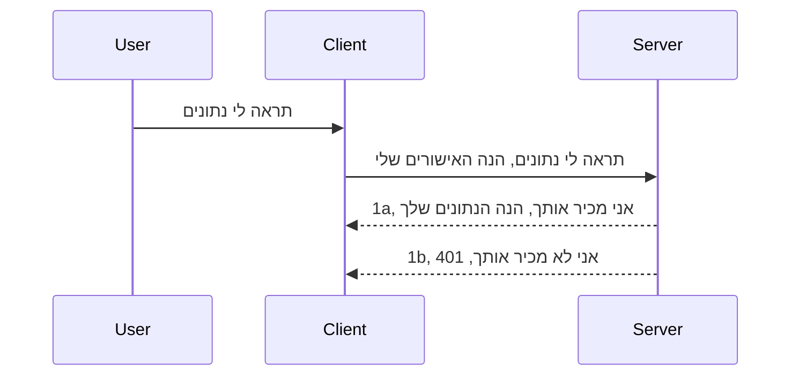

# אימות פשוט

ערכות הפיתוח של MCP תומכות בשימוש ב-OAuth 2.1, שזו תהליך די מורכב הכולל מושגים כמו שרת אימות, שרת משאבים, שליחת אישורים, קבלת קוד, החלפת הקוד בטוקן נושא הרשאה עד לקבלת נתוני המשאב. אם אינך רגיל ל-OAuth, שזה דבר נהדר ליישום, כדאי להתחיל ברמה בסיסית של אימות ולבנות זאת לדרגת אבטחה טובה יותר. זו הסיבה שקיים הפרק הזה, בכדי לבנות אותך לאימות מתקדם יותר.

## אימות, למה אנו מתכוונים?

אימות הוא קיצור ל-authentication ו-authorization. הרעיון הוא שעלינו לעשות שני דברים:

- **Authentication**, תהליך קביעת אם ניתן לאפשר לאדם להיכנס לבית שלנו, שיש לו זכות להיות "כאן", כלומר גישה לשרת המשאבים שלנו שבו תכונות שרת ה-MCP שלנו פועלות.
- **Authorization**, תהליך קביעת אם למשתמש אמורה להיות גישה למשאבים הספציפיים שהוא מבקש, לדוגמה הזמנות אלו או מוצרים אלו, או האם מותר לו לקרוא תוכן אך לא למחוק, כדוגמה נוספת.

## אישורים: איך אנו מזהים את עצמנו למערכת

ובכן, רוב מפתחי האתרים חושבים במונחים של מתן אישור לשרת, בדרך כלל סוד שאומר אם מותר להם להיות כאן "Authentication". אישור זה בדרך כלל הוא גרסה מקודדת ב-base64 של שם משתמש וסיסמה או מפתח API שמזהה משתמש ספציפי.

זה כרוך בשליחתו דרך כותרת שנקראת "Authorization" כך:

```json
{ "Authorization": "secret123" }
```

זה מכונה בדרך כלל אימות בסיסי. איך התהליך כולו עובד אז הוא כך:


```mermaid
sequenceDiagram
   participant User
   participant Client
   participant Server

   User->>Client: תראה לי נתונים
   Client->>Server: תראה לי נתונים, הנה האישורים שלי
   Server-->>Client: 1a, אני מכיר אותך, הנה הנתונים שלך
   Server-->>Client: 1b, אני לא מכיר אותך, 401 
```

עכשיו כשאנחנו מבינים איך זה עובד מבחינת זרימה, איך מיישמים את זה? ובכן, מרבית שרתי האינטרנט תומכים במושג שנקרא middleware, חתיכת קוד שרצה במסגרת הבקשה ויכולה לאמת אישורים, ואם הם תקפים היא מאפשרת לבקשה להמשיך. אם אין אישורים תקפים, מקבלים שגיאת אימות. בואו נראה איך זה ניתן ליישום:

**Python**

```python
class AuthMiddleware(BaseHTTPMiddleware):
    async def dispatch(self, request, call_next):

        has_header = request.headers.get("Authorization")
        if not has_header:
            print("-> Missing Authorization header!")
            return Response(status_code=401, content="Unauthorized")

        if not valid_token(has_header):
            print("-> Invalid token!")
            return Response(status_code=403, content="Forbidden")

        print("Valid token, proceeding...")
       
        response = await call_next(request)
        # הוסף כותרות לקוח מותאמות אישית או שנה את התגובה בדרך כלשהי
        return response


starlette_app.add_middleware(CustomHeaderMiddleware)
```

כאן יש לנו:

- יצרנו middleware בשם `AuthMiddleware` שבו מתודת `dispatch` מופעלת על ידי שרת האינטרנט.
- הוספנו את ה-middleware לשרת האינטרנט:

    ```python
    starlette_app.add_middleware(AuthMiddleware)
    ```

- כתבנו לוגיקה של אימות שבודקת אם כותרת Authorization קיימת ואם הסוד שנשלח תקף:

    ```python
    has_header = request.headers.get("Authorization")
    if not has_header:
        print("-> Missing Authorization header!")
        return Response(status_code=401, content="Unauthorized")

    if not valid_token(has_header):
        print("-> Invalid token!")
        return Response(status_code=403, content="Forbidden")
    ```

   אם הסוד נמצא ותקף, אנו מאפשרים לבקשה לעבור על ידי קריאה ל- `call_next` ומחזירים את התגובה.

    ```python
    response = await call_next(request)
    # הוסף כותרות לקוח כלשהן או שנה את התגובה בדרך כלשהי
    return response
    ```

איך זה עובד הוא שאם מתבצעת בקשת רשת אל השרת, ה-middleware יופעל ובהינתן היישום שלו, הוא או יאפשר לבקשה לעבור או יחזיר שגיאה שמצביעה שהלקוח אינו מורשה להמשיך.

**TypeScript**

כאן אנו יוצרים middleware עם המסגרת הפופולרית Express ומעקבים אחר הבקשה לפני שהיא מגיעה לשרת MCP. הנה הקוד לכך:

```typescript
function isValid(secret) {
    return secret === "secret123";
}

app.use((req, res, next) => {
    // 1. האם כותרת האימות קיימת?
    if(!req.headers["Authorization"]) {
        res.status(401).send('Unauthorized');
    }
    
    let token = req.headers["Authorization"];

    // 2. בדוק את התוקף.
    if(!isValid(token)) {
        res.status(403).send('Forbidden');
    }

   
    console.log('Middleware executed');
    // 3. מעביר את הבקשה לשלב הבא בצינור הבקשות.
    next();
});
```

בקוד זה אנו:

1. בודקים אם כותרת Authorization קיימת מלכתחילה, אם לא, שולחים שגיאה 401.
2. מוודאים שהאישור/טוקן תקף, אם לא, שולחים שגיאה 403.
3. לבסוף, ממשיכים עם הבקשה בצינור ובעקבותיה מחזירים את המשאב המבוקש.

## תרגיל: יישום אימות

בואו ניקח את הידע שלנו וננסה ליישם זאת. הנה התכנית:

שרת

- צור שרת אינטרנט ואינסטנס של MCP.
- יישם middleware עבור השרת.

לקוח

- שלח בקשת רשת עם אישור דרך כותרת.

### -1- צור שרת אינטרנט ואינסטנס של MCP

> [!WARNING]
> דוגמת TypeScript למטה מיועדת ל-MCP `2025-11-25`. היא עוקבת אחרי התחבורה
> לפי `mcp-session-id` ואינה דוגמה לתחבורה זרם `2026-07-28` הנוכחי. ב-MCP
> `2026-07-28` הוסרו ה-handshake initialize ומזהה הפרוטוקול; יישומים חדשים
> משתמשים בבקשות עצמאיות. ראו
> [מה השתנה ב-MCP: המפרט 2026-07-28](../../01-CoreConcepts/mcp-2026-07-28.md).

בשלב הראשון שלנו, עלינו ליצור את האינסטנס של שרת האינטרנט ושרת MCP.

**Python**

כאן אנו יוצרים אינסטנס של שרת MCP, יוצרים אפליקציית web מבוססת starlette ומארחים אותה עם uvicorn.

```python
# יצירת שרת MCP

app = FastMCP(
    name="MCP Resource Server",
    instructions="Resource Server that validates tokens via Authorization Server introspection",
    host=settings["host"],
    port=settings["port"],
    debug=True
)

# יצירת אפליקציית ווב starlette
starlette_app = app.streamable_http_app()

# הפעלת האפליקציה דרך uvicorn
async def run(starlette_app):
    import uvicorn
    config = uvicorn.Config(
            starlette_app,
            host=app.settings.host,
            port=app.settings.port,
            log_level=app.settings.log_level.lower(),
        )
    server = uvicorn.Server(config)
    await server.serve()

run(starlette_app)
```

בקוד זה אנו:

- יוצרים את שרת ה-MCP.
- בונים את אפליקציית ה-starlette מתוך שרת ה-MCP, `app.streamable_http_app()`.
- מארחים ומפעילים את אפליקציית ה-web באמצעות uvicorn עם `server.serve()`.

**TypeScript**

כאן אנו יוצרים אינסטנס של שרת MCP.

```typescript
const server = new McpServer({
      name: "example-server",
      version: "1.0.0"
    });

    // ... להגדיר משאבי שרת, כלים והנחיות ...
```

יצירת שרת ה-MCP הזו תצטרך לקרות בתוך הגדרת המסלול POST /mcp, אז נזיז את הקוד שלמעלה כך:

```typescript
import express from "express";
import { randomUUID } from "node:crypto";
import { McpServer } from "@modelcontextprotocol/sdk/server/mcp.js";
import { StreamableHTTPServerTransport } from "@modelcontextprotocol/sdk/server/streamableHttp.js";
import { isInitializeRequest } from "@modelcontextprotocol/sdk/types.js"

const app = express();
app.use(express.json());

// מפה לאחסון תחבורה לפי מזהה סשן
const transports: { [sessionId: string]: StreamableHTTPServerTransport } = {};

// טיפול בבקשות POST לתקשורת מלקוח לשרת
app.post('/mcp', async (req, res) => {
  // בדיקה למזהה סשן קיים
  const sessionId = req.headers['mcp-session-id'] as string | undefined;
  let transport: StreamableHTTPServerTransport;

  if (sessionId && transports[sessionId]) {
    // שימוש חוזר בתחבורה קיימת
    transport = transports[sessionId];
  } else if (!sessionId && isInitializeRequest(req.body)) {
    // בקשת אתחול חדשה
    transport = new StreamableHTTPServerTransport({
      sessionIdGenerator: () => randomUUID(),
      onsessioninitialized: (sessionId) => {
        // אחסון התחבורה לפי מזהה סשן
        transports[sessionId] = transport;
      },
      // הגנת DNS rebinding מושבתת כברירת מחדל לצורך תאימות לאחור. אם אתם מריצים את השרת הזה
      // במחשב מקומי, ודאו להגדיר:
      // enableDnsRebindingProtection: true,
      // allowedHosts: ['127.0.0.1'],
    });

    // ניקוי התחבורה כשהיא נסגרת
    transport.onclose = () => {
      if (transport.sessionId) {
        delete transports[transport.sessionId];
      }
    };
    const server = new McpServer({
      name: "example-server",
      version: "1.0.0"
    });

    // ... הגדרת משאבי שרת, כלים, והנחיות ...

    // התחברות לשרת MCP
    await server.connect(transport);
  } else {
    // בקשה לא חוקית
    res.status(400).json({
      jsonrpc: '2.0',
      error: {
        code: -32000,
        message: 'Bad Request: No valid session ID provided',
      },
      id: null,
    });
    return;
  }

  // טיפול בבקשה
  await transport.handleRequest(req, res, req.body);
});

// מטפל רב פעמי לבקשות GET ו-DELETE
const handleSessionRequest = async (req: express.Request, res: express.Response) => {
  const sessionId = req.headers['mcp-session-id'] as string | undefined;
  if (!sessionId || !transports[sessionId]) {
    res.status(400).send('Invalid or missing session ID');
    return;
  }
  
  const transport = transports[sessionId];
  await transport.handleRequest(req, res);
};

// טיפול בבקשות GET להודעות מהשרת ללקוח דרך SSE
app.get('/mcp', handleSessionRequest);

// טיפול בבקשות DELETE לסיום סשן
app.delete('/mcp', handleSessionRequest);

app.listen(3000);
```

עכשיו רואים כיצד יצירת שרת ה-MCP הועברה לתוך `app.post("/mcp")`.

נעבור לשלב הבא של יצירת ה-middleware כדי שנוכל לאמת את האישור שמגיע.

### -2- יישום middleware עבור השרת

נעבור עכשיו לחלק של ה-middleware. כאן ניצור middleware שמחפש אישור בכותרת `Authorization` ומאמת אותו. אם הוא מקובל, הבקשה תמשיך ותבצע את הפעולה הנדרשת (למשל רשימת כלים, קריאת משאב או כל פונקציונליות MCP שהלקוח ביקש).

**Python**

כדי ליצור את ה-middleware, אנו צריכים ליצור מחלקה שיורשת מ- `BaseHTTPMiddleware`. יש שני פרטים מעניינים:

- הבקשה `request` , שדרכה קוראים את פרטי הכותרת.
- `call_next` הקריאה החוזרת שאנו צריכים להפעיל אם הלקוח הביא אישור שאנו מקבלים.

ראשית, יש לטפל במקרה שלחסר כותרת `Authorization`:

```python
has_header = request.headers.get("Authorization")

# אין כותרת, נכשל עם 401, אחרת להמשיך.
if not has_header:
    print("-> Missing Authorization header!")
    return Response(status_code=401, content="Unauthorized")
```

כאן אנו שולחים הודעת 401 unauthorized מכיוון שהלקוח נכשל באימות.

לאחר מכן, אם נשלח אישור, יש לבדוק את תקפותו כך:

```python
 if not valid_token(has_header):
    print("-> Invalid token!")
    return Response(status_code=403, content="Forbidden")
```

שימו לב שאנו שולחים הודעת 403 forbidden למעלה. בואו נראה את ה-middleware המלא למטה שמממש את כל מה שציינו:

```python
class AuthMiddleware(BaseHTTPMiddleware):
    async def dispatch(self, request, call_next):

        has_header = request.headers.get("Authorization")
        if not has_header:
            print("-> Missing Authorization header!")
            return Response(status_code=401, content="Unauthorized")

        if not valid_token(has_header):
            print("-> Invalid token!")
            return Response(status_code=403, content="Forbidden")

        print("Valid token, proceeding...")
        print(f"-> Received {request.method} {request.url}")
        response = await call_next(request)
        response.headers['Custom'] = 'Example'
        return response

```

מצוין, אבל מה לגבי הפונקציה `valid_token`? הנה היא למטה:

```python
# אל תשתמש בפרודקשן - לשפר את זה !!
def valid_token(token: str) -> bool:
    # הסר את הקידומת "Bearer "
    if token.startswith("Bearer "):
        token = token[7:]
        return token == "secret-token"
    return False
```

כמובן שזה צריך להשתפר.

חשוב: אסור לך לעולם לשים סודות כאלה בקוד. רצוי לקבל את הערך להשוואה ממקור נתונים או מספק שירותי זהות (IDP), או עוד טוב, לתת ל-IDP לבצע את האימות.

**TypeScript**

כדי ליישם זאת עם Express, אנו צריכים לקרוא למתודת `use` שלוקחת פונקציות middleware.

עלינו לבצע:

- אינטראקציה עם משתנה הבקשה כדי לבדוק את האישור שנשלח בתכונה `Authorization`.
- לאמת את האישור, ואם הוא תקף, לאפשר לבקשה להמשיך ולהפעיל את בקשת MCP של הלקוח (למשל רשימת כלים, קריאת משאב או כל דבר שקשור ל-MCP).

כאן, אנו בודקים אם כותרת `Authorization` קיימת ואם לא, עוצרים את הבקשה מלהמשיך:

```typescript
if(!req.headers["authorization"]) {
    res.status(401).send('Unauthorized');
    return;
}
```

אם הכותרת לא נשלחה מלכתחילה, תקבל 401.

לאחר מכן, אנו בודקים אם אישור תקף, ואם לא, אנו שוב עוצרים את הבקשה אך עם הודעה שונה במקצת:

```typescript
if(!isValid(token)) {
    res.status(403).send('Forbidden');
    return;
} 
```

שימו לב שעכשיו מקבלים שגיאה 403.

הנה הקוד המלא:

```typescript
app.use((req, res, next) => {
    console.log('Request received:', req.method, req.url, req.headers);
    console.log('Headers:', req.headers["authorization"]);
    if(!req.headers["authorization"]) {
        res.status(401).send('Unauthorized');
        return;
    }
    
    let token = req.headers["authorization"];

    if(!isValid(token)) {
        res.status(403).send('Forbidden');
        return;
    }  

    console.log('Middleware executed');
    next();
});
```

הגדרנו את שרת האינטרנט לקבל middleware שיבדוק את האישור שהלקוח מקווה לשלוח לנו. מה עם הלקוח עצמו?

### -3- שלח בקשת רשת עם אישור דרך הכותרת

עלינו לוודא שהלקוח מעביר את האישור דרך הכותרת. מכיוון שנשתמש בלקוח MCP לשם כך, עלינו להבין איך עושים זאת.

**Python**

עבור הלקוח, עלינו להעביר כותרת עם האישור שלנו כך:

```python
# אל תקודד את הערך ישירות, כדאי שיהיה לפחות במשתנה סביבה או באחסון מאובטח יותר
token = "secret-token"

async with streamablehttp_client(
        url = f"http://localhost:{port}/mcp",
        headers = {"Authorization": f"Bearer {token}"}
    ) as (
        read_stream,
        write_stream,
        session_callback,
    ):
        async with ClientSession(
            read_stream,
            write_stream
        ) as session:
            await session.initialize()
      
            # TODO ,מה שאתה רוצה שייעשה בצד הלקוח, לדוגמה, רשימת כלים, קריאת כלים וכו'
```

שימו לב שאנו ממלאים את תכונת `headers` כך ` headers = {"Authorization": f"Bearer {token}"}`.

**TypeScript**

נוכל לפתור זאת בשני שלבים:

1. מלאו אובייקט קונפיגורציה עם האישור שלנו.
2. העבירו את אובייקט הקונפיגורציה לתחבורה.

```typescript

// אל תתכנת את הערך בצורה קשיחה כפי שמוצג כאן. לפחות תגדיר אותו כמשתנה סביבה ותשתמש במשהו כמו dotenv (במצב פיתוח).
let token = "secret123"

// הגדר אובייקט אפשרויות תחבורה ללקוח
let options: StreamableHTTPClientTransportOptions = {
  sessionId: sessionId,
  requestInit: {
    headers: {
      "Authorization": "secret123"
    }
  }
};

// העבר את אובייקט האפשרויות לתחבורה
async function main() {
   const transport = new StreamableHTTPClientTransport(
      new URL(serverUrl),
      options
   );
```

כאן למעלה רואים איך נאלצנו ליצור אובייקט `options` ולמקם את הכותרות תחת תכונת `requestInit`.

חשוב: איך משפרים זאת מכאן? ובכן, ליישום הנוכחי יש כמה בעיות. ראשית, שליחת אישורים כזו היא מסוכנת למדי אלא אם יש לפחות HTTPS. אפילו אז, האישור עלול להיגנב, ולכן יש צורך במערכת שבה ניתן לבטל בקלות את הטוקן ולהוסיף בדיקות נוספות כמו מאיזה מקום בעולם הוא נשלח, האם הבקשה מתבצעת בתדירות גבוהה מאוד (התנהגות של בוט), בקיצור, יש פה מגוון חששות.

יש לציין שזה התחלה טובה עבור APIs מאוד פשוטים שבהם אינך רוצה שאף אחד יפנה ל-API שלך מבלי להיות מאומת.

עם זאת, בואו ננסה לחזק את האבטחה קצת על ידי שימוש בפורמט סטנדרטי כמו JSON Web Token, המכונה גם JWT או "JOT".

## JSON Web Tokens, JWT

אז, אנו מנסים לשפר דברים מעבר לשליחת אישורים פשוטים. אילו שיפורים מיידיים אנו מקבלים באימוץ JWT?

- **שיפורי אבטחה**. באימות בסיסי, אתה שולח את שם המשתמש והסיסמה כטוקן מקודד ב-base64 (או את מפתח ה-API) שוב ושוב, וזה מגדיל את הסיכון. עם JWT, אתה שולח את שם המשתמש והסיסמה ומקבל טוקן בתמורה, והוא גם מוגבל בזמן כלומר פג תוקף. JWT מאפשר שליטה מורכבת יותר על גישה באמצעות תפקידים, תחומי פעולה והרשאות.
- **חוסר מדיניות מדינה וקנה מידה**. JWTs הם עצמאיים, נושאים את כל המידע על המשתמש ומבטלים את הצורך באחסון מושב בצד שרת. הטוקן ניתן גם לאימות מקומי.
- **אינטראופרביליות ופדרציה**. JWTs הוא מרכזי ב-Open ID Connect ומשמש עם ספקי זהות מוכרים כמו Entra ID, Google Identity ו-Auth0. הם גם מאפשרים שימוש ב-single sign on ועוד, מה שהופך אותו לרמת ארגון.
- **מודולריות וגמישות**. JWTs גם מתאימים לשימוש עם API Gateways כמו Azure API Management, NGINX ועוד. הם גם תומכים בתרחישי אימות ושירות-לשרתי כולל העמדת פנים ותרחישי הרשאה.
- **ביצועים ומטמון**. JWTs יכולים להישמר במטמון לאחר דקוד, מה שמפחית את הצורך בפירוש. זה עוזר במיוחד לאפליקציות עם תנועה גבוהה כי משפר את הקצב ומפחית את העומס בתשתית.
- **תכונות מתקדמות**. הם גם תומכים באינטרוספקציה (בדיקת תקפות בשרת) ובביטול (הפיכת טוקן לבלתי תקף).

עם כל היתרונות האלו, בואו נראה איך נוכל לקחת את היישום שלנו לשלב הבא.

## הפיכת אימות בסיסי ל-JWT

אז, השינויים שעלינו לעשות ברמת מאקרו הם:

- **ללמוד לבנות טוקן JWT** ולהכינו לשליחה מלקוח לשרת.
- **לאמת טוקן JWT**, ואם תקף, לאפשר ללקוח לקבל את המשאבים שלנו.
- **אחסון מאובטח של הטוקן**. איך אנו מאחסנים את הטוקן הזה.
- **הגנת המסלולים**. יש להגן על המסלולים, במקרה שלנו להגן על מסלולים ותכונות ספציפיות של MCP.
- **הוספת טוקני ריענון**. לדאוג שניצור טוקנים קצרים זמן חיים אבל גם טוקני ריענון ארוכי חיים שיכולים לשמש לקבלת טוקנים חדשים במידה והם פג תוקף. לוודא שיש נקודת קצה לריענון ואסטרטגיית סיבוב.

### -1- בניית טוקן JWT

ראשית, טוקן JWT מכיל את החלקים הבאים:

- **header**, אלגוריתם משומש וסוג הטוקן.
- **payload**, נתונים, כמו sub (המשתמש או הישות שהטוקן מייצג. בתרחיש אימות זה בדרך כלל מזהה המשתמש), exp (מתי פג תוקפו), role (התפקיד).
- **signature**, חתום עם סוד או מפתח פרטי.

לשם כך, נצטרך לבנות את הכותרת, הנתונים והטוקן המקודד.

**Python**

```python

import jwt
import jwt
from jwt.exceptions import ExpiredSignatureError, InvalidTokenError
import datetime

# מפתח סודי המשמש לחתימה על JWT
secret_key = 'your-secret-key'

header = {
    "alg": "HS256",
    "typ": "JWT"
}

# מידע המשתמש, התביעות שלו וזמן תפוגה
payload = {
    "sub": "1234567890",               # נושא (מזהה משתמש)
    "name": "User Userson",                # תביעה מותאמת אישית
    "admin": True,                     # תביעה מותאמת אישית
    "iat": datetime.datetime.utcnow(),# הונפק ב
    "exp": datetime.datetime.utcnow() + datetime.timedelta(hours=1)  # פג תוקף
}

# לקודד את זה
encoded_jwt = jwt.encode(payload, secret_key, algorithm="HS256", headers=header)
```

בקוד שלמעלה:

- הגדרנו כותרת המשתמשת ב-HS256 כאלגוריתם ובסוג JWT.
- בנינו payload שמכיל נושא או מזהה משתמש, שם משתמש, תפקיד, מועד ההנפקה ומועד התפוגה, באופן שמממש את ההיבט של מגבלת הזמן שהזכרנו קודם.

**TypeScript**

כאן נצטרך כמה תלותיות שיעזרו לנו לבנות את טוקן ה-JWT.

תלותיות

```sh

npm install jsonwebtoken
npm install --save-dev @types/jsonwebtoken
```

כעת כשיש לנו את זה במקום, ניצור את הכותרת, ה-payload ובאמצעותם את הטוקן המקודד.

```typescript
import jwt from 'jsonwebtoken';

const secretKey = 'your-secret-key'; // השתמש במשתני סביבה בפרודקשן

// הגדר את המטען
const payload = {
  sub: '1234567890',
  name: 'User usersson',
  admin: true,
  iat: Math.floor(Date.now() / 1000), // נערך בשעה
  exp: Math.floor(Date.now() / 1000) + 60 * 60 // פג תוקף בעוד שעתיים
};

// הגדר את הכותרת (אופציונלי, jsonwebtoken מגדיר ברירות מחדל)
const header = {
  alg: 'HS256',
  typ: 'JWT'
};

// צור את הטוקן
const token = jwt.sign(payload, secretKey, {
  algorithm: 'HS256',
  header: header
});

console.log('JWT:', token);
```

הטוקן הזה:

חתום באמצעות HS256
תקף לשעה אחת
כולל תביעות כמו sub, name, admin, iat, ו-exp.

### -2- אימות טוקן

נצטרך גם לאמת טוקן, משהו שצריך לעשות בשרת כדי לוודא שמה שהלקוח שולח תקין. יש בדיקות רבות שצריך לעשות כאן מהמבנה ועד לתוקף. מומלץ להוסיף בדיקות נוספות כמו האם המשתמש נמצא במערכת שלך ועוד.

לאמת טוקן, אנו צריכים לפרק אותו (decode) כדי לקרוא אותו ואחר כך להתחיל לבדוק תקפות:

**Python**

```python

# לפענח ולאמת את ה-JWT
try:
    decoded = jwt.decode(token, secret_key, algorithms=["HS256"])
    print("✅ Token is valid.")
    print("Decoded claims:")
    for key, value in decoded.items():
        print(f"  {key}: {value}")
except ExpiredSignatureError:
    print("❌ Token has expired.")
except InvalidTokenError as e:
    print(f"❌ Invalid token: {e}")

```


בקוד זה, אנו קוראים ל-`jwt.decode` תוך שימוש בטוקן, במפתח הסודי ובאלגוריתם שנבחר כקלט. שימו לב כיצד אנו משתמשים במבנה try-catch מכיוון שצעדי אימות שנכשלו גורמים לזריקת שגיאה.

**TypeScript**

כאן עלינו לקרוא ל-`jwt.verify` כדי לקבל גרסה מפוענחת של הטוקן שנוכל לנתח הלאה. אם הקריאה הזו נכשלת, זה אומר שמבנה הטוקן שגוי או שהוא כבר לא תקף.

```typescript

try {
  const decoded = jwt.verify(token, secretKey);
  console.log('Decoded Payload:', decoded);
} catch (err) {
  console.error('Token verification failed:', err);
}
```

הערה: כפי שהוזכר קודם, עלינו לבצע בדיקות נוספות כדי לוודא שהטוקן מצביע על משתמש במערכת שלנו וכדי לוודא שלמשתמש יש את ההרשאות שהוא טוען שיש לו.

לאחר מכן, בואו נסתכל על בקרת גישה מבוססת תפקידים, הידועה גם כ-RBAC.

## הוספת בקרת גישה מבוססת תפקידים

הרעיון הוא שברצוננו להביע כי לתפקידים שונים יש הרשאות שונות. לדוגמה, אנו מניחים שמנהל יכול לעשות הכל, ומשתמש רגיל יכול לקרוא/לכתוב, ואורח יכול רק לקרוא. לכן, הנה כמה רמות הרשאה אפשריות:

- Admin.Write 
- User.Read
- Guest.Read

בואו נבחן כיצד ניתן ליישם בקרת שכזו באמצעות תוכנת ביניים (middleware). ניתן להוסיף תוכנת ביניים לכל מסלול ספציפי וגם לכל המסלולים.

**Python**

```python
from starlette.middleware.base import BaseHTTPMiddleware
from starlette.responses import JSONResponse
import jwt

# אל תכלול את הסוד בקוד כמו זה, זה לצורכי הדגמה בלבד. קרא אותו ממקום בטוח.
SECRET_KEY = "your-secret-key" # שים את זה במשתנה סביבה
REQUIRED_PERMISSION = "User.Read"

class JWTPermissionMiddleware(BaseHTTPMiddleware):
    async def dispatch(self, request, call_next):
        auth_header = request.headers.get("Authorization")
        if not auth_header or not auth_header.startswith("Bearer "):
            return JSONResponse({"error": "Missing or invalid Authorization header"}, status_code=401)

        token = auth_header.split(" ")[1]
        try:
            decoded = jwt.decode(token, SECRET_KEY, algorithms=["HS256"])
        except jwt.ExpiredSignatureError:
            return JSONResponse({"error": "Token expired"}, status_code=401)
        except jwt.InvalidTokenError:
            return JSONResponse({"error": "Invalid token"}, status_code=401)

        permissions = decoded.get("permissions", [])
        if REQUIRED_PERMISSION not in permissions:
            return JSONResponse({"error": "Permission denied"}, status_code=403)

        request.state.user = decoded
        return await call_next(request)


```

יש כמה דרכים שונות להוסיף את תוכנת הביניים כפי שמוצג למטה:

```python

# אפשרות 1: הוסף middleware בעת בניית אפליקציית starlette
middleware = [
    Middleware(JWTPermissionMiddleware)
]

app = Starlette(routes=routes, middleware=middleware)

# אפשרות 2: הוסף middleware לאחר שאפליקציית starlette כבר נוצרה
starlette_app.add_middleware(JWTPermissionMiddleware)

# אפשרות 3: הוסף middleware לכל מסלול בנפרד
routes = [
    Route(
        "/mcp",
        endpoint=..., # מטפל
        middleware=[Middleware(JWTPermissionMiddleware)]
    )
]
```

**TypeScript**

ניתן להשתמש ב-`app.use` ותוכנת ביניים שתפעל עבור כל הבקשות.

```typescript
app.use((req, res, next) => {
    console.log('Request received:', req.method, req.url, req.headers);
    console.log('Headers:', req.headers["authorization"]);

    // 1. בדוק אם כותרת ההרשאה נשלחה

    if(!req.headers["authorization"]) {
        res.status(401).send('Unauthorized');
        return;
    }
    
    let token = req.headers["authorization"];

    // 2. בדוק אם הטוקן תקין
    if(!isValid(token)) {
        res.status(403).send('Forbidden');
        return;
    }  

    // 3. בדוק אם משתמש הטוקן קיים במערכת שלנו
    if(!isExistingUser(token)) {
        res.status(403).send('Forbidden');
        console.log("User does not exist");
        return;
    }
    console.log("User exists");

    // 4. אמת שהטוקן מכיל את ההרשאות הנכונות
    if(!hasScopes(token, ["User.Read"])){
        res.status(403).send('Forbidden - insufficient scopes');
    }

    console.log("User has required scopes");

    console.log('Middleware executed');
    next();
});

```

יש כמה דברים שאנחנו יכולים לתת לתוכנת הביניים שלנו והיא צריכה לעשות, כלומר:

1. לבדוק אם כותרת האישור (authorization header) קיימת
2. לבדוק אם הטוקן תקף, נקרא ל-`isValid` שהיא שיטה שכתבנו שבודקת שלמות ותקפות של טוקן JWT.
3. לאמת שהמשתמש קיים במערכת שלנו, עלינו לבדוק זאת.

   ```typescript
    // משתמשים בבסיס הנתונים
   const users = [
     "user1",
     "User usersson",
   ]

   function isExistingUser(token) {
     let decodedToken = verifyToken(token);

     // יש לעשות, לבדוק אם המשתמש קיים בבסיס הנתונים
     return users.includes(decodedToken?.name || "");
   }
   ```

למעלה, יצרנו רשימת `users` פשוטה מאוד, שצריכה להיות במסד נתונים כמובן.

4. בנוסף, עלינו לוודא שלטוקן יש את ההרשאות הנכונות.

   ```typescript
   if(!hasScopes(token, ["User.Read"])){
        res.status(403).send('Forbidden - insufficient scopes');
   }
   ```

בקוד למעלה מתוכנת הביניים, אנו בודקים שהטוקן מכיל הרשאת User.Read, ואם לא, אנחנו שולחים שגיאה 403. להלן שיטת העזר `hasScopes`.

   ```typescript
   function hasScopes(scope: string, requiredScopes: string[]) {
     let decodedToken = verifyToken(scope);
    return requiredScopes.every(scope => decodedToken?.scopes.includes(scope));
  }
   ```

Have a think which additional checks you should be doing, but these are the absolute minimum of checks you should be doing.

Using Express as a web framework is a common choice. There are helpers library when you use JWT so you can write less code.

- `express-jwt`, helper library that provides a middleware that helps decode your token.
- `express-jwt-permissions`, this provides a middleware `guard` that helps check if a certain permission is on the token.

Here's what these libraries can look like when used:

```typescript
const express = require('express');
const jwt = require('express-jwt');
const guard = require('express-jwt-permissions')();

const app = express();
const secretKey = 'your-secret-key'; // put this in env variable

// Decode JWT and attach to req.user
app.use(jwt({ secret: secretKey, algorithms: ['HS256'] }));

// Check for User.Read permission
app.use(guard.check('User.Read'));

// multiple permissions
// app.use(guard.check(['User.Read', 'Admin.Access']));

app.get('/protected', (req, res) => {
  res.json({ message: `Welcome ${req.user.name}` });
});

// Error handler
app.use((err, req, res, next) => {
  if (err.code === 'permission_denied') {
    return res.status(403).send('Forbidden');
  }
  next(err);
});

```

עכשיו ראיתם כיצד ניתן להשתמש בתוכנת ביניים הן לאימות והן לאישור, מה לגבי MCP? האם זה משנה את האופן שבו אנו עושים את האימות? בואו נגלה בסעיף הבא.

### -3- הוספת RBAC ל-MCP

עד כה ראיתם כיצד ניתן להוסיף RBAC באמצעות תוכנת ביניים, אך עבור MCP אין דרך פשוטה להוסיף RBAC לכל תכונה בנפרד, אז מה נעשה? טוב, פשוט נוסיף קוד כזה שמוודא במקרה זה שללקוח יש את הזכויות לקרוא לכלי ספציפי:

יש לכם כמה אפשרויות שונות כיצד להשיג RBAC לכל תכונה, הנה כמה:

- הוספת בדיקה עבור כל כלי, משאב, או פרומפט בו יש צורך לבדוק רמת הרשאה.

   **python**

   ```python
   @tool()
   def delete_product(id: int):
      try:
          check_permissions(role="Admin.Write", request)
      catch:
        pass # הלקוח נכשל באישור, להעלות שגיאת הרשאה
   ```

   **typescript**

   ```typescript
   server.registerTool(
    "delete-product",
    {
      title: Delete a product",
      description: "Deletes a product",
      inputSchema: { id: z.number() }
    },
    async ({ id }) => {
      
      try {
        checkPermissions("Admin.Write", request);
        // יש לעשות, לשלוח מזהה ל-productService ול-remote entry
      } catch(Exception e) {
        console.log("Authorization error, you're not allowed");  
      }

      return {
        content: [{ type: "text", text: `Deletected product with id ${id}` }]
      };
    }
   );
   ```


- שימוש בגישה מתקדמת של השרת ומטפלי בקשות כדי למזער את כמות המקומות בהם עליכם לבצע את הבדיקה.

   **Python**

   ```python
   
   tool_permission = {
      "create_product": ["User.Write", "Admin.Write"],
      "delete_product": ["Admin.Write"]
   }

   def has_permission(user_permissions, required_permissions) -> bool:
      # user_permissions: רשימת ההרשאות שיש למשתמש
      # required_permissions: רשימת ההרשאות הנדרשות לכלי
      return any(perm in user_permissions for perm in required_permissions)

   @server.call_tool()
   async def handle_call_tool(
     name: str, arguments: dict[str, str] | None
   ) -> list[types.TextContent]:
    # הנח ש-request.user.permissions היא רשימת ההרשאות של המשתמש
     user_permissions = request.user.permissions
     required_permissions = tool_permission.get(name, [])
     if not has_permission(user_permissions, required_permissions):
        # העלה שגיאה "אין לך הרשאה לקרוא לכלי {name}"
        raise Exception(f"You don't have permission to call tool {name}")
     # המשך וקרא לכלי
     # ...
   ```   
   

   **TypeScript**

   ```typescript
   function hasPermission(userPermissions: string[], requiredPermissions: string[]): boolean {
       if (!Array.isArray(userPermissions) || !Array.isArray(requiredPermissions)) return false;
       // החזר אמת אם למשתמש יש לפחות הרשאה אחת דרושה
       
       return requiredPermissions.some(perm => userPermissions.includes(perm));
   }
  
   server.setRequestHandler(CallToolRequestSchema, async (request) => {
      const { params: { name } } = request;
  
      let permissions = request.user.permissions;
  
      if (!hasPermission(permissions, toolPermissions[name])) {
         return new Error(`You don't have permission to call ${name}`);
      }
  
      // המשך..
   });
   ```

שימו לב, יהיה עליכם לוודא שתוכנת הביניים שלך מייחסת טוקן מפוענח למאפיין user של הבקשה כך שהקוד שלמעלה יהיה פשוט.

### לסיכום

עכשיו שדיברנו כיצד להוסיף תמיכה ב-RBAC בכלל וב-MCP בפרט, הגיע הזמן לנסות ליישם אבטחה בעצמכם כדי לוודא שהבנתם את המושגים שהוצגו לכם.

## משימה 1: בניית שרת MCP ולקוח MCP תוך שימוש באימות בסיסי

כאן תיישמו את מה שלמדתם לגבי שליחת פרטי הזדהות דרך כותרות.

## פתרון 1

[פתרון 1](./code/basic/README.md)

## משימה 2: שידרוג הפתרון ממשימה 1 לשימוש ב-JWT

קחו את הפתרון הראשון, אך הפעם, בואו נשפר אותו.

במקום להשתמש באימות בסיסי, נשתמש ב-JWT.

## פתרון 2

[פתרון 2](./solution/jwt-solution/README.md)

## אתגר

הוסיפו את ה-RBAC לכלי שתיארנו בסעיף "הוספת RBAC ל-MCP".

## סיכום

אנו מקווים שלמדתם רבות בפרק זה, מאבטחה שאינה קיימת כלל, ועד לאבטחה בסיסית, JWT וכיצד ניתן להוסיף זאת ל-MCP.

בנינו בסיס יציב עם JWT מותאמים אישית, אבל ככל שהיקף גדל, אנו פונים למודל זהות מבוסס תקנים. אימוץ ספק זהויות כמו Entra או Keycloak מאפשר לנו להעביר את ניהול הונפקות הטוקנים, האימות וניהול מחזור החיים לפלטפורמה אמינה — ובכך להתמקד בלוגיקת האפליקציה ובחוויית המשתמש.

לשם כך, יש לנו פרק מתקדם יותר על Entra [בקישור הבא](../../05-AdvancedTopics/mcp-security-entra/README.md)

## מה הלאה

- הלאה: [הגדרת מארחי MCP](../12-mcp-hosts/README.md)

---

<!-- CO-OP TRANSLATOR DISCLAIMER START -->
**כתב ויתור**:
מסמך זה תורגם באמצעות שירות תרגום אוטומטי [Co-op Translator](https://github.com/Azure/co-op-translator). למרות שאנו שואפים לדיוק, יש לקחת בחשבון שתרגומים אוטומטיים עלולים להכיל שגיאות או אי-דיוקים. יש להחשיב את המסמך המקורי בשפתו הטבעית כמקור הסמכות. למידע קריטי מומלץ להשתמש בתרגום מקצועי על ידי מתרגם אדם. אנו לא אחראים לכל אי-הבנה או פירוש שגוי הנובע מהשימוש בתרגום זה.
<!-- CO-OP TRANSLATOR DISCLAIMER END -->