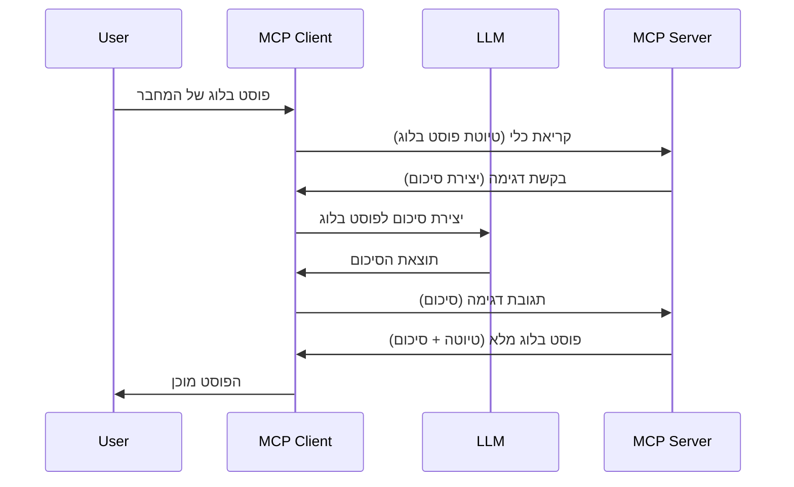

> [!WARNING]
> דגימה מיושנת ב-MCP `2026-07-28`. לקח זה נשמר ליישומים ישנים.
> שרתים חדשים צריכים להשתלב ישירות עם API של ספק LLM.


# דגימה - להעביר תכונות ללקוח

> דגימה נשארת במפרט `2026-07-28` לצורך תאימות והיא
> זכאית להסרה במהדורה הראשונה שתשחרר בתאריך או אחרי ה-28 ביולי,
> 2027. דוגמאות בלימוד זה עשויות להשתמש ב-API של SDK שמיישם `2025-11-25`.
> ראה [מה השתנה ב-MCP: מפרט 2026-07-28](../../01-CoreConcepts/mcp-2026-07-28.md).

ביישומים ישנים, דגימה מאפשרת לשרת MCP לבקש עזרה מ-LLM
מנוהל על ידי הלקוח. ביישומים חדשים, קריאה לספק LLM שנבחר
ישירות במקום זאת.

בואו נחקור כמה מקרים של שימוש ואיך לבנות פתרון הכולל דגימה.

## סקירה כללית

בלימוד זה, אנו מתמקדים בהסבר מתי והיכן להשתמש בדגימה ואיך להגדירה.

## מטרות הלמידה

בפרק זה, נבצע את הדברים הבאים:

- להסביר מהי דגימה ומתי להשתמש בה.
- להראות איך להגדיר דגימה ב-MCP.
- לספק דוגמאות לפעולת דגימה.

## מהי דגימה ולמה להשתמש בה?

דגימה היא תכונה מתקדמת הפועלת באופן הבא:



### בקשת דגימה

טוב, עכשיו יש לנו מבט כללי על תרחיש סביר, בואו נדבר על בקשת הדגימה שהשרת שולח חזרה ללקוח. כך עשויה להיראות בקשה כזו בפורמט JSON-RPC:

```json
{
  "jsonrpc": "2.0",
  "id": 1,
  "method": "sampling/createMessage",
  "params": {
    "messages": [
      {
        "role": "user",
        "content": {
          "type": "text",
          "text": "Create a blog post summary of the following blog post: <BLOG POST>"
        }
      }
    ],
    "modelPreferences": {
      "hints": [
        {
          "name": "claude-3-sonnet"
        }
      ],
      "intelligencePriority": 0.8,
      "speedPriority": 0.5
    },
    "systemPrompt": "You are a helpful assistant.",
    "maxTokens": 100
  }
}
```

יש כמה נקודות שכדאי להדגיש כאן:

- הפקודה, תחת content -> text, היא הפקודה שלנו שהיא הוראה ל-LLM לסכם תוכן פוסט בלוג.

- **modelPreferences**. קטע זה הוא רק העדפה, המלצה על הקונפיגורציה שיש להשתמש בה עם ה-LLM. המשתמש יכול לבחור אם לקבל את ההמלצות או לשנותן. במקרה זה יש המלצות על דגם לשימוש, מהירות ועדיפות אינטליגנציה.
- **systemPrompt**, זוהי פקודת מערכת רגילה שנותנת ל-LLM שלך אישיות ומכילה הנחיות.
- **maxTokens**, זהו מאפיין נוסף המשמש לציון כמה טוקנים מומלץ להשתמש במשימה זו.

### תגובת דגימה

תגובה זו היא מה שלקוח MCP בסוף שולח חזרה לשרת MCP והיא תוצאת הקריאה של הלקוח ל-LLM, המתנה לתגובה ואז בניית ההודעה הזו. כך היא עשויה להיראות ב-JSON-RPC:

```json
{
  "jsonrpc": "2.0",
  "id": 1,
  "result": {
    "role": "assistant",
    "content": {
      "type": "text",
      "text": "Here's your abstract <ABSTRACT>"
    },
    "model": "gpt-5",
    "stopReason": "endTurn"
  }
}
```

שים לב שהתשובה היא תקציר של פוסט הבלוג בדיוק כפי שביקשנו. שים לב גם שהדגם שבו השתמשו אינו מה שביקשנו אלא "gpt-5" במקום "claude-3-sonnet". זה ממחיש שהמשתמש יכול לשנות את דעתו לגבי מה להשתמש ושהבקשה שלך לדגימה היא המלצה.

טוב, עכשיו כשהבנו את הזרימה העיקרית, ומשימה שימושית לכך היא "יצירת פוסט בלוג + תקציר", בואו נראה מה צריך לעשות כדי שזה יפעל.

### סוגי הודעות

הודעות דגימה אינן מוגבלות רק לטקסט, אלא ניתן לשלוח גם תמונות וקול. כך פורמט ה-JSON-RPC נראה שונה:

**טקסט**

```json
{
  "type": "text",
  "text": "The message content"
}
```

**תוכן תמונה**

```json
{
  "type": "image",
  "data": "base64-encoded-image-data",
  "mimeType": "image/jpeg"
}
```

**תוכן שמע**

```json
{
  "type": "audio",
  "data": "base64-encoded-audio-data",
  "mimeType": "audio/wav"
}
```

> Note: למצב הנוכחי והנחיות מעבר, ראה את
> [תיעוד דגימה מיושן](https://modelcontextprotocol.io/specification/2026-07-28/client/sampling).

## איך להגדיר דגימה בלקוח

> הערה: אם אתה רק בונה שרת, אין צורך לעשות הרבה כאן.

בלקוח, יש לציין את התכונה הבאה כך:

```json
{
  "capabilities": {
    "sampling": {}
  }
}
```

זה ייקלט כאשר הלקוח שתבחר יאתחל קשר עם השרת.

## דוגמה לדגימה בפעולה - יצירת פוסט בלוג

בואו נכתוב שרת דגימה ביחד, נצטרך לבצע את הדברים הבאים:

1. ליצור כלי על השרת.
1. הכלי הזה צריך ליצור בקשת דגימה
1. הכלי צריך להמתין לקבלת תשובת דגימה מהלקוח.
1. אז צריך לייצר את תוצאת הכלי.

בואו נראה את הקוד שלב אחר שלב:

### -1- צור את הכלי

**python**

```python
@mcp.tool()
async def create_blog(title: str, content: str, ctx: Context[ServerSession, None]) -> str:
    """Create a blog post and generate a summary"""

```

### -2- צור בקשת דגימה

הרחב את הכלי שלך עם הקוד הבא:

**python**

```python
post = BlogPost(
        id=len(posts) + 1,
        title=title,
        content=content,
        abstract=""
    )

prompt = f"Create an abstract of the following blog post: title: {title} and draft: {content} "

result = await ctx.session.create_message(
        messages=[
            SamplingMessage(
                role="user",
                content=TextContent(type="text", text=prompt),
            )
        ],
        max_tokens=100,
)

```

### -3- המתן לתגובה והחזר את התגובה

**python**

```python
post.abstract = result.content.text

posts.append(post)

# החזר את המוצר השלם
return json.dumps({
    "id": post.title,
    "abstract": post.abstract
})
```

### -4- קוד מלא

**python**

```python
from starlette.applications import Starlette
from starlette.routing import Mount, Host

from mcp.server.fastmcp import Context, FastMCP

from mcp.server.session import ServerSession
from mcp.types import SamplingMessage, TextContent

import json


from uuid import uuid4
from typing import List
from pydantic import BaseModel


mcp = FastMCP("Blog post generator")

# אפליקציה = FastAPI()

posts = []

class BlogPost(BaseModel):
    id: int
    title: str
    content: str
    abstract: str

posts: List[BlogPost] = []

@mcp.tool()
async def create_blog(title: str, content: str, ctx: Context[ServerSession, None]) -> str:
    """Create a blog post and generate a summary"""

    post = BlogPost(
        id=len(posts) + 1,
        title=title,
        content=content,
        abstract=""
    )

    prompt = f"Create an abstract of the following blog post: title: {title} and draft: {content} "

    result = await ctx.session.create_message(
        messages=[
            SamplingMessage(
                role="user",
                content=TextContent(type="text", text=prompt),
            )
        ],
        max_tokens=100,
    )

    post.abstract = result.content.text

    posts.append(post)

    # החזר את הפוסט בלוג המלא
    return json.dumps({
        "id": post.title,
        "abstract": post.abstract
    })

if __name__ == "__main__":
    print("Starting server...")
    # mcp.הפעל()
    mcp.run(transport="streamable-http")

# הפעל את האפליקציה עם: python server.py
```

### -5- בדיקתו ב-Visual Studio Code

כדי לבדוק זאת ב-Visual Studio Code, בצע את השלבים הבאים:

1. הפעל את השרת בטרמינל
1. הוסף אותו ל-*mcp.json* (ודא שהוא מופעל) למשל כך:

   ```json
   "servers": {
      "blog-server": {
        "type": "http",
        "url": "http://localhost:8000/mcp"
      }
   }
   ```

1. הקלד פקודה:

   ```text
   create a blog post named "Where Python comes from", the content is "Python is actually named after Monty Python Flying Circus"
   ```

1. אפשר לדגימה לקרות. בפעם הראשונה שתבדוק זאת יופיע לך דיאלוג נוסף שעליך לקבל, ואז תראה את הדיאלוג הרגיל שמבקש להריץ כלי

1. בדוק את התוצאות. תראה את התוצאות מוצגות יפה ב-GitHub Copilot Chat אבל תוכל גם לבדוק את תגובת ה-JSON הגולמית.

**בונוס**. ל-Visual Studio Code יש תמיכה מעולה לדגימה. ניתן להגדיר גישת דגימה על השרת המותקן שלך כך:

1. עבור לסעיף ההרחבות.
1. בחר באייקון גלגל שיניים של השרת המותקן ב-"MCP SERVERS - INSTALLED".
1 בחר "Configure Model Access", כאן תוכל לבחור אילו דגמים GitHub Copilot יכול להשתמש בהם בעת ביצוע דגימה. תוכל גם לראות את כל בקשות הדגימה שהתרחשו לאחרונה על ידי בחירה ב-"Show Sampling requests".

## משימה

במשימה זו, תבנה דגימה שונה במקצת, כלומר אינטגרציית דגימה התומכת ביצירת תיאור מוצר. הנה התרחיש שלך:

**תרחיש**: העובד במחלקת שירות ב-e-commerce זקוק לעזרה, לוקח יותר מדי זמן ליצור תיאורי מוצר. לכן, עליך לבנות פתרון שבו תוכל לקרוא לכלי "create_product" עם "title" ו-"keywords" כארגומנטים, והוא ייצר מוצר מלא כולל שדה "description" שישתף על ידי LLM של הלקוח.

טיפ: השתמש במה שלמדת קודם לבנות את השרת והכלי שלו באמצעות בקשת דגימה.

## פתרון

[פתרון](./solution/README.md)

## נקודות מפתח

דגימה היא תכונה חזקה שמאפשרת לשרת להעביר משימות ללקוח כשהוא זקוק לעזרת LLM.

## מה הלאה

- [פרק 4 - יישום מעשי](../../04-PracticalImplementation/README.md)

---

<!-- CO-OP TRANSLATOR DISCLAIMER START -->
**כתב ויתור**:
מסמך זה תורגם באמצעות שירות תרגום אוטומטי [Co-op Translator](https://github.com/Azure/co-op-translator). למרות שאנו שואפים לדיוק, יש לקחת בחשבון שתרגומים אוטומטיים עלולים להכיל שגיאות או אי-דיוקים. יש להחשיב את המסמך המקורי בשפתו הטבעית כמקור הסמכות. למידע קריטי מומלץ להשתמש בתרגום מקצועי על ידי מתרגם אדם. אנו לא אחראים לכל אי-הבנה או פירוש שגוי הנובע מהשימוש בתרגום זה.
<!-- CO-OP TRANSLATOR DISCLAIMER END -->