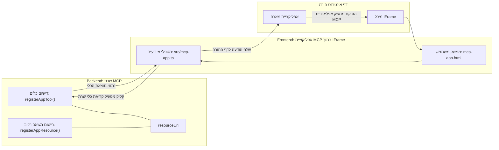
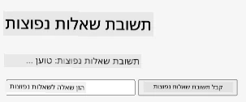
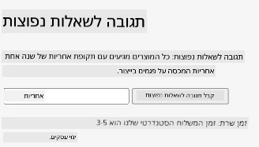
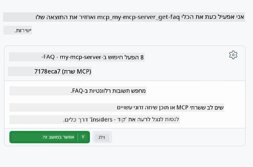
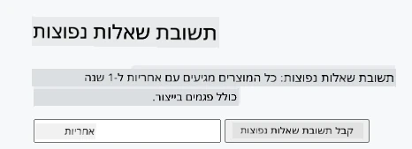

# אפליקציות MCP

אפליקציות MCP הן פרדיגמה חדשה ב-MCP. הרעיון הוא שלא רק מגיבים עם מידע חוזר מקריאת כלי, אלא גם מספקים מידע על איך יש לקיים אינטראקציה עם המידע הזה. זאת אומרת שתוצאות הכלי עכשיו יכולות להכיל מידע על ממשק המשתמש. למה נרצה את זה? נו, חשבו איך אתם עושים דברים היום. סביר להניח שאתם צורכים את התוצאות של MCP Server על ידי הצבת סוג של פרונטאנד מולה, שזה קוד שאתם צריכים לכתוב ולתחזק. לפעמים זה מה שרוצים, אבל לפעמים יהיה מצוין אם תוכלו רק להביא קטע מידע שהוא עצמאי שיש לו הכל מהנתונים ועד לממשק המשתמש.

## סקירה כללית

שיעור זה מספק הדרכה מעשית על אפליקציות MCP, איך להתחיל איתן ואיך לשלב אותן באפליקציות הווב הקיימות שלכם. אפליקציות MCP הן תוספת חדשה מאוד לסטנדרט MCP.

## יעדי הלמידה

בסיום שיעור זה, תוכלו:

- להסביר מה הן אפליקציות MCP.
- מתי להשתמש באפליקציות MCP.
- לבנות ולשלב אפליקציות MCP משלכם.

## אפליקציות MCP - איך זה עובד

הרעיון עם אפליקציות MCP הוא לספק תגובה שהיא בעצם קומפוננטה שהופכת להיות מוצגת. קומפוננטה כזו יכולה להכיל גם חזותיות וגם אינטראקטיביות, כמו לחיצות כפתור, קלט משתמש ועוד. נתחיל בצד השרת וב-MCP Server שלנו. כדי ליצור קומפוננטת אפליקציית MCP צריך ליצור כלי וגם את משאב האפליקציה. שני חצאים אלה מחוברים באמצעות resourceUri. 

הנה דוגמה. ננסה להמחיש מה מעורב ואיזה חלק עושה מה:

```text
server.ts -- responsible for registering tools and the component as a UI component
src/
  mcp-app.ts -- wiring up event handlers
mcp-app.html -- the user interface
```

החזות הזו מתארת את הארכיטקטורה ליצירת קומפוננטה והלוגיקה שלה.


ננסה עכשיו לתאר את האחריות מבחינת backend ו-frontend בהתאמה.

### ה-backend

יש כאן שני דברים שצריך להשלים:

- רישום הכלים שאנו רוצים לקיים איתם אינטראקציה.
- הגדרת הקומפוננטה.

**רישום הכלי**

```typescript
registerAppTool(
    server,
    "get-time",
    {
      title: "Get Time",
      description: "Returns the current server time.",
      inputSchema: {},
      _meta: { ui: { resourceUri } }, // מקשר כלי זה למשאב ממשק המשתמש שלו
    },
    async () => {
      const time = new Date().toISOString();
      return { content: [{ type: "text", text: time }] };
    },
  );

```

הקוד הקודם מתאר את ההתנהגות, שם הוא מציג כלי בשם `get-time`. הוא לא מקבל קלט אבל בסופו של דבר מייצר את השעה הנוכחית. יש לנו את היכולת להגדיר `inputSchema` לכלים כשצריך לקבל קלט משתמש.

**רישום הקומפוננטה**

באותו הקובץ, צריך גם לרשום את הקומפוננטה:

```typescript
const resourceUri = "ui://get-time/mcp-app.html";

// רושם את המשאב, שמחזיר את קובץ ה-HTML/JavaScript המארוז לממשק המשתמש.
registerAppResource(
  server,
  resourceUri,
  resourceUri,
  { mimeType: RESOURCE_MIME_TYPE },
  async () => {
    const html = await fs.readFile(path.join(DIST_DIR, "mcp-app.html"), "utf-8");

    return {
    contents: [
        { uri: resourceUri, mimeType: RESOURCE_MIME_TYPE, text: html },
    ],
    };
  },
);
```

שימו לב לאופן בו מוזכר `resourceUri` כדי לחבר את הקומפוננטה עם הכלים שלה. מעניין גם ה-callback שבו אנו טוענים את קובץ ה-UI ומחזירים את הקומפוננטה.

### ה-front-end של הקומפוננטה

כמו ה-backend, יש כאן שני חלקים:

- פרונטאנד שנכתב ב-HTML טהור.
- קוד שמטפל באירועים ומה לעשות, למשל קריאה לכלים או שליחת הודעות לחלון האב.

**ממשק משתמש**

בואו נסתכל על ממשק המשתמש.

```html
<!-- mcp-app.html -->
<!DOCTYPE html>
<html lang="en">
  <head>
    <meta charset="UTF-8" />
    <title>Get Time App</title>
  </head>
  <body>
    <p>
      <strong>Server Time:</strong> <code id="server-time">Loading...</code>
    </p>
    <button id="get-time-btn">Get Server Time</button>
    <script type="module" src="/src/mcp-app.ts"></script>
  </body>
</html>
```

**חיבור אירועים**

החלק האחרון הוא חיבור האירועים. זאת אומרת לזהות איזה חלק ב-UI שלנו צריך מטפלי אירועים ומה לעשות אם האירועים מתרחשים:

```typescript
// mcp-app.ts

import { App } from "@modelcontextprotocol/ext-apps";

// קבל הפניות אל אלמנטים
const serverTimeEl = document.getElementById("server-time")!;
const getTimeBtn = document.getElementById("get-time-btn")!;

// צור מופע אפליקציה
const app = new App({ name: "Get Time App", version: "1.0.0" });

// טיפול בתוצאות הכלי מהשרת. הגדר לפני `app.connect()` כדי למנוע
// החמצת תוצאת הכלי ההתחלתית.
app.ontoolresult = (result) => {
  const time = result.content?.find((c) => c.type === "text")?.text;
  serverTimeEl.textContent = time ?? "[ERROR]";
};

// חבר את לחצן ההקלקה
getTimeBtn.addEventListener("click", async () => {
  // `app.callServerTool()` מאפשר לממשק המשתמש לבקש נתונים מעודכנים מהשרת
  const result = await app.callServerTool({ name: "get-time", arguments: {} });
  const time = result.content?.find((c) => c.type === "text")?.text;
  serverTimeEl.textContent = time ?? "[ERROR]";
});

// התחבר למארח
app.connect();
```

כפי שניתן לראות למעלה, זה קוד רגיל לחיבור אלמנטים ב-DOM לאירועים. שווה לציין את הקריאה ל-`callServerTool` שבסופו של דבר קוראת לכלי בצד ה-backend.

## התמודדות עם קלט משתמש

עד כה ראינו קומפוננטה שיש לה כפתור שאם לוחצים עליו קוראת לכלי. נראה אם אפשר להוסיף עוד אלמנטים ל-UI כמו שדה קלט ולשלוח ארגומנטים לכלי. ניישם פונקציונליות של FAQ. כך זה אמור לעבוד:

- יהיה כפתור ושדה קלט שבו המשתמש מקליד מילת מפתח לחיפוש לדוגמה "Shipping". זה יפעיל כלי בצד ה-backend שמבצע חיפוש בנתוני ה-FAQ.
- כלי שתומך בחיפוש ה-FAQ שצוין.

נתחיל בהוספת התמיכה הנדרשת ל-backend:

```typescript
const faq: { [key: string]: string } = {
    "shipping": "Our standard shipping time is 3-5 business days.",
    "return policy": "You can return any item within 30 days of purchase.",
    "warranty": "All products come with a 1-year warranty covering manufacturing defects.",
  }

registerAppTool(
    server,
    "get-faq",
    {
      title: "Search FAQ",
      description: "Searches the FAQ for relevant answers.",
      inputSchema: zod.object({
        query: zod.string().default("shipping"),
      }),
      _meta: { ui: { resourceUri: faqResourceUri } }, // מקשר את הכלי הזה למשאב ממשק המשתמש שלו
    },
    async ({ query }) => {
      const answer: string = faq[query.toLowerCase()] || "Sorry, I don't have an answer for that.";
      return { content: [{ type: "text", text: answer }] };
    },
  );
```

מה שרואים כאן הוא איך ממלאים את `inputSchema` ונותנים לו סכמת `zod` כך:

```typescript
inputSchema: zod.object({
  query: zod.string().default("shipping"),
})
```

בסכמה למעלה אנו מצהירים שיש לנו פרמטר קלט שנקרא `query` שהוא אופציונלי עם ערך ברירת מחדל של "shipping". 

אוקיי, נמשיך ל-*mcp-app.html* כדי לראות איזה UI אנחנו צריכים ליצור לזה:

```html
<div class="faq">
    <h1>FAQ response</h1>
    <p>FAQ Response: <code id="faq-response">Loading...</code></p>
    <input type="text" id="faq-query" placeholder="Enter FAQ query" />
    <button id="get-faq-btn">Get FAQ Response</button>
  </div>
```

מצוין, עכשיו יש לנו אלמנט קלט וכפתור. נעבור ל-*mcp-app.ts* כדי לחבר את האירועים הללו:

```typescript
const getFaqBtn = document.getElementById("get-faq-btn")!;
const faqQueryInput = document.getElementById("faq-query") as HTMLInputElement;

getFaqBtn.addEventListener("click", async () => {
  const query = faqQueryInput.value;
  const result = await app.callServerTool({ name: "get-faq", arguments: { query } });
  const faq = result.content?.find((c) => c.type === "text")?.text;
  faqResponseEl.textContent = faq ?? "[ERROR]";
});
```

בקוד למעלה עשינו:

- יצירת הפניות לאלמנטים מעניינים בממשק המשתמש.
- טיפול בלחיצה על כפתור כדי לפרסר את ערך אלמנט הקלט וגם לקרוא ל-`app.callServerTool()` עם `name` ו-`arguments` כאשר האחרון מעביר את `query` כערך.

מה שקורה בפועל כשקוראים ל-`callServerTool` זה שהיא שולחת הודעה לחלון האב והחלון הזה בסופו של דבר קורא את MCP Server.

### נסו את זה

כשננסה זאת כעת אמור להופיע:



וכאן כאשר מנסים עם קלט כמו "warranty"



להריץ את הקוד הזה, כנסו ל-[מדור הקוד](./code/README.md)

## בדיקה ב-Visual Studio Code

Visual Studio Code תומך היטב באפליקציות MVP וזה כנראה אחד הדרכים הקלות ביותר לבדוק את אפליקציות ה-MCP שלכם. כדי להשתמש ב-Visual Studio Code, הוסיפו רשומת שרת ל-*mcp.json* כך:

```json
"my-mcp-server-7178eca7": {
    "url": "http://localhost:3001/mcp",
    "type": "http"
  }
```

לאחר מכן הפעלו את השרת, תוכלו לתקשר עם אפליקציית ה-MVP שלכם דרך חלון הצ'אט בתנאי שיש לכם מותקן GitHub Copilot.

בהפעלת הפקודה דרך הפרומפט, למשל "#get-faq":



ובדיוק כמו בהרצה בדפדפן, זה מציג באותה צורה כך:



## משימה

צרו משחק אבן נייר ומספריים. הוא צריך לכלול את הדברים הבאים:

ממשק משתמש:

- רשימת בחירה נפתחת עם אפשרויות
- כפתור לשליחת הבחירה
- תווית שמראה מי בחר מה ומי ניצח

שרת:

- צריך להיות כלי rock paper scissors שלוקח "choice" כקלט. הוא גם צריך להציג בחירת מחשב ולקבוע את המנצח

## פתרון

[פתרון](./assignment/README.md)

## סיכום

למדנו על פרדיגמה חדשה זו של אפליקציות MCP. זוהי פרדיגמה חדשה שמאפשרת לשרת MCP להביע דעה לא רק על הנתונים אלא גם איך להציג אותם.

בנוסף, למדנו שאפליקציות MCP מתארחות בתוך IFrame וכדי לתקשר עם שרתי MCP הן צריכות לשלוח הודעות לאפליקציית הווב האב. קיימות כמה ספריות הן ל-JavaScript נקי והן ל-React ועוד שמקלות על תקשורת זו.

## נקודות מפתח

הנה מה שלמדתם:

- אפליקציות MCP הן סטנדרט חדש שיכול להיות שימושי כשרוצים לשלוח גם נתונים וגם תכונות UI.
- אפליקציות מסוג זה פועלות בתוך IFrame מסיבות אבטחה.

## מה הלאה

- [פרק 4](../../04-PracticalImplementation/README.md)

---

<!-- CO-OP TRANSLATOR DISCLAIMER START -->
**כתב ויתור**:
מסמך זה תורגם באמצעות שירות התרגום האוטומטי [Co-op Translator](https://github.com/Azure/co-op-translator). למרות שאנו שואפים לדייק, יש להיות מודעים לכך שתרגומים אוטומטיים עלולים להכיל שגיאות או אי-דיוקים. המסמך המקורי בשפת המקור שלו נחשב למקור הסמכותי. למידע קריטי מומלץ לתרגם על ידי מתרגם אנושי מקצועי. אנו לא נושאים באחריות לכל אי-הבנה או פרשנות שגויה הנובעת מהשימוש בתרגום זה.
<!-- CO-OP TRANSLATOR DISCLAIMER END -->