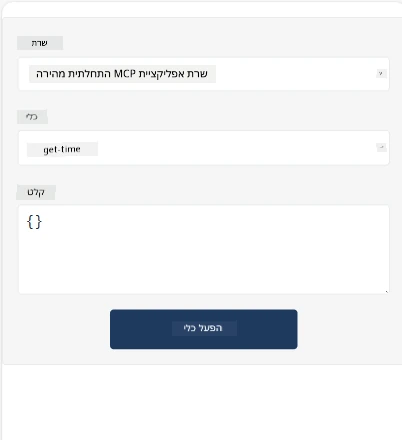
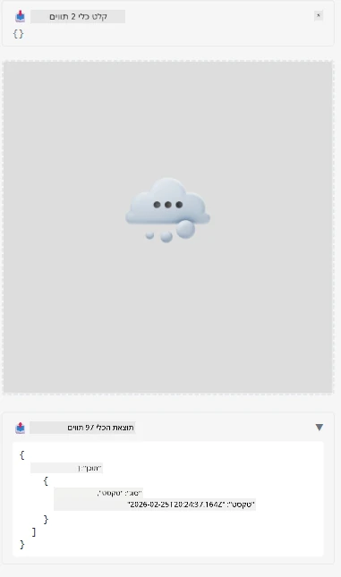

הנה דוגמה המציגה את אפליקציית MCP

## התקנה

1. נווט לתיקיית *mcp-app*
1. הרץ `npm install`, זה אמור להתקין את התלויות של ה־frontend וה־backend

אמת את הידור ה־backend על ידי הרצת:

```sh
npx tsc --noEmit
```

לא אמור להיות פלט אם הכל תקין.

## הפעלת ה־backend

> זה דורש קצת עבודה נוספת אם אתה במחשב Windows מכיוון שפתרון אפליקציות MCP משתמש בספריית `concurrently` להרצה שצריך למצוא לה תחליף. הנה השורה הבעייתית ב־*package.json* של אפליקציית MCP:

    ```json
    "start": "concurrently \"cross-env NODE_ENV=development INPUT=mcp-app.html vite build --watch\" \"tsx watch main.ts\""
    ```

לאפליקציה זו שני חלקים, חלק backend וחלק host.

הפעל את ה־backend בכך שתקרא:

```sh
npm start
```

זה אמור להפעיל את ה־backend בכתובת `http://localhost:3001/mcp`.

> שים לב, אם אתה ב־Codespace, ייתכן שתצטרך להגדיר שהפורט יהיה גלוי לציבור. בדוק שאתה יכול להגיע לנקודת הקצה בדפדפן דרך https://<שם הקודספייס>.app.github.dev/mcp

## אפשרות 1 - בדוק את האפליקציה ב־Visual Studio Code

כדי לבדוק את הפתרון ב־Visual Studio Code, עשה את הפעולות הבאות:

- הוסף רשומת שרת ל־`mcp.json` כך:

    ```json
    {
        "servers": {
            "my-mcp-server-7178eca7": {
                "url": "http://localhost:3001/mcp",
                "type": "http"
            }
        },
        "inputs": []
    }
    ```

1. לחץ על כפתור "start" ב־*mcp.json*
1. ודא שחלון הצ'אט פתוח והקלד `get-faq`, אמור להופיע תוצאה כך:

    

## אפשרות 2 - בדוק את האפליקציה עם host

הריפו <https://github.com/modelcontextprotocol/ext-apps> מכיל מספר hosts שונים שניתן להשתמש בהם כדי לבדוק את אפליקציות ה־MVP שלך.

נציג כאן שתי אפשרויות שונות:

### מכונה מקומית

- נווט לתיקיית *ext-apps* לאחר ששכפלת את הריפו.

- התקן את התלויות

   ```sh
   npm install
   ```

- בחלון טרמינל נפרד, נווט לתיקיית *ext-apps/examples/basic-host*

    > אם אתה ב־Codespace, עליך לנווט ל־serve.ts ולשורה 27 להחליף את http://localhost:3001/mcp בכתובת ה־URL של הקודספייס שלך עבור ה־backend, לדוגמה https://psychic-xylophone-657rpjgvxpc5g64-3001.app.github.dev/mcp

- הפעל את ה־host:

    ```sh
    npm start
    ```

    זה אמור לחבר את ה־host ל־backend ותראה את האפליקציה רצה כך:

    

### Codespace

נדרשת עבודה נוספת כדי להפעיל סביבה של Codespace. כדי להשתמש ב־host דרך Codespace:

- ראה את תיקיית *ext-apps* ונווט אל *examples/basic-host*.
- הרץ `npm install` להתקנת התלויות
- הרץ `npm start` כדי להפעיל את ה־host.

## בדוק את האפליקציה

נסה את האפליקציה כך:

- בחר בלחצן "Call Tool" ותראה את התוצאות כך:

    

מצוין, הכל עובד.

---

<!-- CO-OP TRANSLATOR DISCLAIMER START -->
**הצהרת ויתור**:  
מסמך זה תורגם באמצעות שירות תרגום מבוסס בינה מלאכותית [Co-op Translator](https://github.com/Azure/co-op-translator). למרות שאנו שואפים לדיוק, יש לקחת בחשבון כי תרגומים אוטומטיים עשויים לכלול שגיאות או אי-דיוקים. יש להסתמך במסמך המקורי בשפה המקורית כמקור המוסמך והמהימן. עבור מידע קריטי, מומלץ להשתמש בתרגום מקצועי על ידי מתרגם אנושי. אנו לא נישא באחריות לכל אי-הבנה או פירוש שגוי הנובעים משימוש בתרגום זה.
<!-- CO-OP TRANSLATOR DISCLAIMER END -->