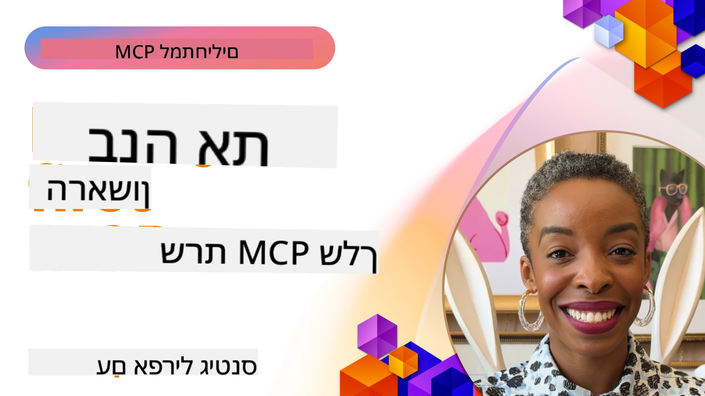

## להתחלה  

_(לחץ על התמונה לעיל לצפייה בווידאו של השיעור)_

חלק זה מורכב ממספר שיעורים:

- **1 השרת הראשון שלך**, בשיעור הראשון הזה תלמד כיצד ליצור את השרת הראשון שלך ולבדוק אותו עם כלי הבודק, דרך חשובה לבדוק ולתקן את השרת שלך, [לשיעור](01-first-server/README.md)

- **2 לקוח**, בשיעור זה תלמד כיצד לכתוב לקוח שיכול להתחבר לשרת שלך, [לשיעור](02-client/README.md)

- **3 לקוח עם LLM**, דרך טובה אף יותר לכתיבת לקוח היא על ידי הוספת LLM אליה כדי שיוכל "לנהל משא ומתן" עם השרת שלך על מה לעשות, [לשיעור](03-llm-client/README.md)

- **4 צריכת שרת במצב סוכן GitHub Copilot ב-Visual Studio Code**. כאן, אנו מסתכלים על הפעלת שרת MCP שלנו מתוך Visual Studio Code, [לשיעור](04-vscode/README.md)

- **5 שרת תחבורה stdio** תחבורת stdio היא התקן המומלץ לתקשורת מקומית בין שרת ללקוח MCP, המספקת תקשורת בטוחה מבוססת תהליכונים עם בידוד תהליכים מובנה [לשיעור](05-stdio-server/README.md)

- **6 סטרימינג HTTP עם MCP (HTTP סטרימבילי)**. למד על תעבורת סטרימינג HTTP מודרנית (הגישה המומלצת עבור שרתי MCP מרוחקים לפי [מפרט MCP 2025-11-25](https://spec.modelcontextprotocol.io/specification/2025-11-25/basic/transports/#streamable-http)), התראות התקדמות, וכיצד לממש שרתי ולקוחות MCP בקנה מידה בזמן אמת בעזרת HTTP סטרימבילי. [לשיעור](06-http-streaming/README.md)

- **7 שימוש ב-AI Toolkit עבור VSCode** לצריכת ובדיקת לקוחות ושרתים של MCP [לשיעור](07-aitk/README.md)

- **8 בדיקות**. כאן נתמקד במיוחד כיצד ניתן לבדוק את השרת והלקוח שלנו באופנים שונים, [לשיעור](08-testing/README.md)

- **9 פריסה**. פרק זה יבחן דרכים שונות לפריסת פתרונות MCP שלך, [לשיעור](09-deployment/README.md)

- **10 שימוש מתקדם בשרת**. פרק זה עוסק בשימוש מתקדם בשרת, [לשיעור](./10-advanced/README.md)

- **11 אימות**. פרק זה מכסה כיצד להוסיף אימות פשוט, מאימות בסיסי ועד שימוש ב-JWT ו-RBAC. מומלץ להתחיל כאן ואז לעיין בנושאים מתקדמים בפרק 5 ולבצע חיזוק אבטחה נוסף לפי ההמלצות בפרק 2, [לשיעור](./11-simple-auth/README.md)

- **12 מארחי MCP**. הגדר ושימוש בקליינטים פופולריים למארח MCP כולל Claude Desktop, Cursor, Cline, ו-Windsurf. למד סוגי תקשורת וטיפול בתקלות, [לשיעור](./12-mcp-hosts/README.md)

- **13 בודק MCP**. איתור שגיאות ובדיקת שרתי MCP שלך בצורה אינטראקטיבית באמצעות כלי בודק MCP. למד לטפל בכלים, משאבים, והודעות פרוטוקול, [לשיעור](./13-mcp-inspector/README.md)

- **14 דגימה**. צור שרתי MCP שמשתפים פעולה עם לקוחות MCP במשימות הקשורות ל-LLM. [לשיעור](./14-sampling/README.md)

- **15 אפליקציות MCP**. בניית שרתי MCP המגיבים גם עם הוראות ממשק משתמש, [לשיעור](./15-mcp-apps/README.md)

פרוטוקול הקשר למודל (Model Context Protocol - MCP) הוא פרוטוקול פתוח שמסטנדרט כיצד יישומים מספקים הקשר ל-LLMs. חשבו על MCP כעל יציאת USB-C ליישומי AI - הוא מספק דרך סטנדרטית לחבר מודלים של AI למקורות נתונים וכלים שונים.

## מטרות הלמידה

בסיום שיעור זה, תוכל:

- להקים סביבות פיתוח עבור MCP ב-C#, Java, Python, TypeScript, ו-JavaScript
- לבנות ולפרוס שרתי MCP בסיסיים עם תכונות מותאמות אישית (משאבים, הנחיות, וכלים)
- ליצור יישומי מארח שמתחברים לשרתי MCP
- לבדוק ולתקן יישומי MCP
- להבין אתגרים נפוצים בהגדרות ועל הפתרונות להם
- לחבר את יישומי MCP לשירותי LLM פופולריים

## הקמת סביבת MCP שלך

לפני שתתחיל לעבוד עם MCP, חשוב להכין את סביבת הפיתוח ולהבין את זרימת העבודה הבסיסית. חלק זה ינחה אותך בשלבי ההגדרה הראשוניים כדי להבטיח התחלה חלקה עם MCP.

### דרישות מקדימות

לפני שקופצים לפיתוח עם MCP, ודא שיש לך:

- **סביבת פיתוח**: לשפה שבחרת (C#, Java, Python, TypeScript, או JavaScript)
- **IDE/עורך**: Visual Studio, Visual Studio Code, IntelliJ, Eclipse, PyCharm, או כל עורך קוד מודרני
- **מנהל חבילות**: NuGet, Maven/Gradle, pip, או npm/yarn
- **מפתחות API**: לכל שירותי AI שבהם מתכנן להשתמש ביישומי המארח שלך

### ערכות פיתוח רשמיות (SDKs)

בפרקים הקרובים תראה פתרונות שבנויים בשפות Python, TypeScript, Java ו-.NET. להלן כל ערכות הפיתוח הרשמיות הנתמכות.

MCP מספק ערכות פיתוח רשמיות עבור שפות מרובות (בהתאם ל-[מפרט MCP 2025-11-25](https://spec.modelcontextprotocol.io/specification/2025-11-25/)):
- [C# SDK](https://github.com/modelcontextprotocol/csharp-sdk) - מנוהל בשיתוף עם מיקרוסופט
- [Java SDK](https://github.com/modelcontextprotocol/java-sdk) - מנוהל בשיתוף עם Spring AI
- [TypeScript SDK](https://github.com/modelcontextprotocol/typescript-sdk) - מימוש TypeScript רשמי
- [Python SDK](https://github.com/modelcontextprotocol/python-sdk) - מימוש Python רשמי (FastMCP)
- [Kotlin SDK](https://github.com/modelcontextprotocol/kotlin-sdk) - מימוש Kotlin רשמי
- [Swift SDK](https://github.com/modelcontextprotocol/swift-sdk) - מנוהל בשיתוף עם Loopwork AI
- [Rust SDK](https://github.com/modelcontextprotocol/rust-sdk) - מימוש Rust רשמי
- [Go SDK](https://github.com/modelcontextprotocol/go-sdk) - מימוש Go רשמי

## נקודות מפתח

- הקמת סביבת פיתוח MCP פשוטה עם ערכות פיתוח לשפה ספציפית
- בניית שרתי MCP כוללת יצירת כלים והרשמתם עם סכימות ברורות
- לקוחות MCP מתחברים לשרתים ולמודלים כדי לנצל יכולות מורחבות
- בדיקות ותיקונים הם חיוניים למימושי MCP אמינים
- אפשרויות פריסה נעות מפיתוח מקומי לפתרונות מבוססי ענן

## תרגול

יש לנו סט של דוגמאות שמוסיפות לתרגילים שתראה בכל פרקי החלק הזה. בנוסף לכל פרק יש תרגילים ומשימות משלו

- [מחשבון Java](./samples/java/calculator/README.md)
- [מחשבון .Net](../../../03-GettingStarted/samples/csharp)
- [מחשבון JavaScript](./samples/javascript/README.md)
- [מחשבון TypeScript](./samples/typescript/README.md)
- [מחשבון Python](../../../03-GettingStarted/samples/python)

## משאבים נוספים

- [בניית סוכנים באמצעות Model Context Protocol ב-Azure](https://learn.microsoft.com/azure/developer/ai/intro-agents-mcp)
- [MCP מרוחק עם Azure Container Apps (Node.js/TypeScript/JavaScript)](https://learn.microsoft.com/samples/azure-samples/mcp-container-ts/mcp-container-ts/)
- [סוכן MCP OpenAI ב-.NET](https://learn.microsoft.com/samples/azure-samples/openai-mcp-agent-dotnet/openai-mcp-agent-dotnet/)

## מה הלאה

התחל עם השיעור הראשון: [יצירת שרת MCP ראשון שלך](01-first-server/README.md)

לאחר שסיימת מודול זה, המשך אל: [מודול 4: מימוש מעשי](../04-PracticalImplementation/README.md)

---

<!-- CO-OP TRANSLATOR DISCLAIMER START -->
**כתב גילוי דעת**:  
מסמך זה תורגם באמצעות שירות תרגום מבוסס בינה מלאכותית [Co-op Translator](https://github.com/Azure/co-op-translator). אף שאנו שואפים לדיוק, יש לקחת בחשבון שתרגומים אוטומטיים עלולים להכיל שגיאות או אי-דיוקים. יש להסתמך על המסמך המקורי בשפתו הילידית כמקור המוסמך. עבור מידע קריטי מומלץ תרגום מקצועי על ידי אדם. איננו נושאים באחריות על כל אי-הבנות או פרשנויות מוטעות הנובעות מהשימוש בתרגום זה.
<!-- CO-OP TRANSLATOR DISCLAIMER END -->