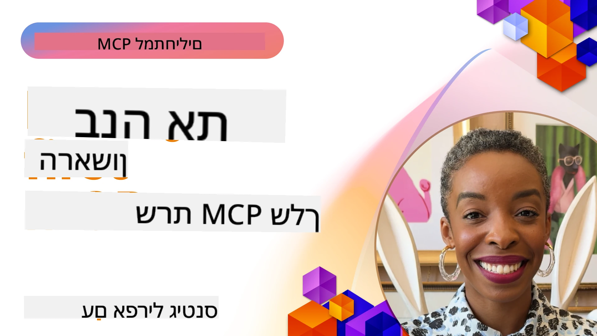

## התחלה  

_(לחץ על התמונה למעלה לצפייה בסרטון של השיעור הזה)_

קטע זה מורכב ממספר שיעורים:

- **1 השרת הראשון שלך**, בשיעור הראשון הזה תלמד כיצד ליצור את השרת הראשון שלך ולבדוק אותו באמצעות כלי הבודק, דרך חשובה לבחון ולתקן תקלות בשרת שלך, [לשיעור](01-first-server/README.md)

- **2 לקוח**, בשיעור זה תלמד כיצד לכתוב לקוח שיכול להתחבר לשרת שלך, [לשיעור](02-client/README.md)

- **3 לקוח עם LLM**, דרך טובה יותר לכתוב לקוח היא להוסיף לו LLM כדי שיוכל "לנהל משא ומתן" עם השרת שלך על מה לעשות, [לשיעור](03-llm-client/README.md)

- **4 צריכת מצב סוכן GitHub Copilot ב-Visual Studio Code במצב שרת MCP**. כאן נסתכל על הרצת שרת MCP מתוך Visual Studio Code, [לשיעור](04-vscode/README.md)

- **5 שרת תקשורת stdio** תקשורת stdio היא התקן המומלץ לתקשורת מקומית בין שרת ללקוח MCP, ומספקת תקשורת מאובטחת מבוססת תת-תהליכים עם בידוד תהליכים מובנה [לשיעור](05-stdio-server/README.md)

- **6 שידור HTTP עם MCP (HTTP סטרימינג)**. למד על הפרוטוקול הסטנדרטי
	להעברת מרוחקת ב-[MCP Specification 2026-07-28](https://modelcontextprotocol.io/specification/2026-07-28/basic/transports/streamable-http),
	בנוסף ליישום הישן מבוסס מושבים שמוצג בשיעור.
	[לשיעור](06-http-streaming/README.md)

- **7 שימוש בכלי AI Toolkit ל-VSCode** לצריכה ובדיקת לקוחות ושרתים של MCP [לשיעור](07-aitk/README.md)

- **8 בדיקות**. כאן נתמקד במיוחד כיצד ניתן לבדוק את השרת והלקוח שלנו בדרכים שונות, [לשיעור](08-testing/README.md)

- **9 פריסה**. פרק זה יבחן דרכים שונות לפריסת פתרונות MCP שלך, [לשיעור](09-deployment/README.md)

- **10 שימוש מתקדם בשרת**. פרק זה מכסה שימוש מתקדם בשרת, [לשיעור](./10-advanced/README.md)

- **11 אימות**. פרק זה מכסה כיצד להוסיף אימות פשוט, מאימות בסיסי ועד לשימוש ב-JWT ו-RBAC. מומלץ להתחיל כאן ואז להמשיך לנושאים מתקדמים בפרק 5 ולבצע החמרות אבטחה נוספות לפי המלצות בפרק 2, [לשיעור](./11-simple-auth/README.md)

- **12 מארחי MCP**. הגדר ושימוש בלקוחות מארחים פופולריים של MCP כולל Claude Desktop, Cursor, Cline ו-Windsurf. למד סוגי תקשורת ופתרון תקלות, [לשיעור](./12-mcp-hosts/README.md)

- **13 בודק MCP**. ניתוח ובדיקת שרתי MCP שלך באופן אינטראקטיבי בעזרת כלי MCP Inspector. למד לפתור תקלות בכלים, משאבים והודעות פרוטוקול, [לשיעור](./13-mcp-inspector/README.md)

- **14 דגימה**. למד את פרימיטיב הדגימה הישן לתאריך `2025-11-25` ו
	כיצד להעביר עיצובים חדשים לאינטגרציה ישירה עם ספק LLM. דגימה
	מנוטרלת ב-MCP `2026-07-28`. [לשיעור](./14-sampling/README.md)

- **15 אפליקציות MCP**. בניית שרתי MCP שגם מגיבים עם הוראות ממשק משתמש, [לשיעור](./15-mcp-apps/README.md)

פרוטוקול הקשר למודל (MCP) הוא פרוטוקול פתוח שמסטנדרט כיצד אפליקציות מספקות הקשר למודלים גדולים של שפה (LLMs). חשבו על MCP כמו יציאת USB-C לאפליקציות AI - הוא מספק דרך סטנדרטית לחבר מודלים של AI למקורות נתונים וכלים שונים.

## מטרות הלמידה

בסיום השיעור הזה תוכל:

- להגדיר סביבת פיתוח ל-MCP ב-C#, Java, Python, TypeScript ו-JavaScript
- לבנות ולפרוס שרתי MCP בסיסיים עם תכונות מותאמות אישית (משאבים, פרומים וכלים)
- ליצור אפליקציות מארחות שמתחברות לשרתי MCP
- לבדוק ולתקן יישומי MCP
- להבין אתגרים נפוצים בהגדרה ופתרונותיהם
- לחבר יישומי MCP שלך לשירותי LLM פופולריים

## הגדרת סביבת MCP שלך

לפני שתתחיל לעבוד עם MCP, חשוב להכין את סביבת הפיתוח שלך ולהבין את זרימת העבודה הבסיסית. קטע זה ינחה אותך בשלבי ההגדרה הראשוניים כדי להבטיח התחלה חלקה עם MCP.

### דרישות מוקדמות

לפני שתצלול לפיתוח MCP, ודא שיש לך:

- **סביבת פיתוח**: עבור השפה שבחרת (C#, Java, Python, TypeScript או JavaScript)
- **IDE/עורך**: Visual Studio, Visual Studio Code, IntelliJ, Eclipse, PyCharm או כל עורך קוד מודרני
- **מנהל חבילות**: NuGet, Maven/Gradle, pip או npm/yarn
- **מפתחות API**: עבור כל שירותי AI שתכננת להשתמש בהם באפליקציות המארחות שלך

### ערכות פיתוח רשמיות (SDKs)

בפרקים הקרובים תראה פתרונות שנבנו באמצעות Python, TypeScript,
Java ו-.NET. הנה ה-SDKs הרשמיים.

תמיכת SDK עבור MCP `2026-07-28` מתפתחת לתוך שפות בנפרד.
לפני הרצת דוגמה, בדוק את גרסת החבילה והערות השחרור של ה-SDK
עבור עדכוני הפרוטוקול הנתמכים. ראה את
[רשימת ה-SDK הרשמית](https://modelcontextprotocol.io/docs/sdk):
- [C# SDK](https://github.com/modelcontextprotocol/csharp-sdk) - מתוחזק בשיתוף פעולה עם Microsoft
- [Java SDK](https://github.com/modelcontextprotocol/java-sdk) - מתוחזק בשיתוף פעולה עם Spring AI
- [TypeScript SDK](https://github.com/modelcontextprotocol/typescript-sdk) - היישום הרשמי ב-TypeScript
- [Python SDK](https://github.com/modelcontextprotocol/python-sdk) - היישום הרשמי בפייתון (FastMCP)
- [Kotlin SDK](https://github.com/modelcontextprotocol/kotlin-sdk) - היישום הרשמי בקוטלין
- [Swift SDK](https://github.com/modelcontextprotocol/swift-sdk) - מתוחזק בשיתוף פעולה עם Loopwork AI
- [Rust SDK](https://github.com/modelcontextprotocol/rust-sdk) - היישום הרשמי ב-Rust
- [Go SDK](https://github.com/modelcontextprotocol/go-sdk) - היישום הרשמי ב-Go

## נקודות עיקריות להבנה

- הגדרת סביבת פיתוח MCP היא פשוטה באמצעות SDKs ספציפיים לשפות
- בניית שרתי MCP כוללת יצירה והרשמה של כלים עם סכימות ברורות
- לקוחות MCP מתחברים לשרתי ומודלים לניצול יכולות מורחבות
- בדיקות ותיקון תקלות הם חיוניים ליישומים אמינים של MCP
- אפשרויות פריסה נעות מפיתוח מקומי ועד פתרונות מבוססי ענן

## תרגול

יש לנו אוסף דוגמאות שמ ergänzt את התרגילים שתראו בכל הפרקים בחלק זה. בנוסף, לכל פרק יש גם את התרגילים והמשימות שלו

- [מחשבון Java](./samples/java/calculator/README.md)
- [מחשבון .NET](../../../03-GettingStarted/samples/csharp)
- [מחשבון JavaScript](./samples/javascript/README.md)
- [מחשבון TypeScript](./samples/typescript/README.md)
- [מחשבון Python](../../../03-GettingStarted/samples/python)

## משאבים נוספים

- [בניית סוכנים באמצעות Model Context Protocol ב-Azure](https://learn.microsoft.com/azure/developer/ai/intro-agents-mcp)
- [MCP מרוחק עם Azure Container Apps (Node.js/TypeScript/JavaScript)](https://learn.microsoft.com/samples/azure-samples/mcp-container-ts/mcp-container-ts/)
- [סוכן MCP ב-.NET OpenAI](https://learn.microsoft.com/samples/azure-samples/openai-mcp-agent-dotnet/openai-mcp-agent-dotnet/)

## מה הלאה

התחילו עם השיעור הראשון: [יצירת שרת MCP ראשון שלך](01-first-server/README.md)

לאחר שסיימתם את המודול הזה, המשיכו ל: [מודול 4: יישום מעשי](../04-PracticalImplementation/README.md)

---

<!-- CO-OP TRANSLATOR DISCLAIMER START -->
**כתב ויתור**:
מסמך זה תורגם באמצעות שירות תרגום אוטומטי [Co-op Translator](https://github.com/Azure/co-op-translator). למרות שאנו שואפים לדיוק, יש לקחת בחשבון שתרגומים אוטומטיים עלולים להכיל שגיאות או אי-דיוקים. יש להחשיב את המסמך המקורי בשפתו הטבעית כמקור הסמכות. למידע קריטי מומלץ להשתמש בתרגום מקצועי על ידי מתרגם אדם. אנו לא אחראים לכל אי-הבנה או פירוש שגוי הנובע מהשימוש בתרגום זה.
<!-- CO-OP TRANSLATOR DISCLAIMER END -->