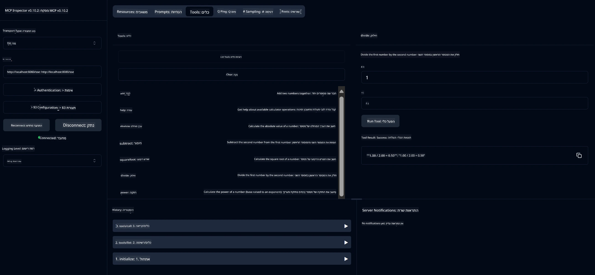

# שירות מחשבון בסיסי MCP

> [!NOTE]
> דוגמה זו משתמשת בפרוטוקול הישן HTTP+SSE ומיועדת ל-SDK תואם
> ל-MCP ב-`2025-11-25`. שרתים חדשים צריכים להשתמש בתמיכה ב-HTTP סטרימינג
> בגרסה `2026-07-28`.

שירות זה מספק פעולות מחשבון בסיסיות דרך פרוטוקול Model Context Protocol (MCP) בשימוש עם Spring Boot ו-WebFlux כתחבורה. הוא מיועד כדוגמה פשוטה למתחילים הלומדים על יישומי MCP.

למידע נוסף, ראה את התיעוד של [MCP Server Boot Starter](https://docs.spring.io/spring-ai/reference/api/mcp/mcp-server-boot-starter-docs.html).

## סקירה כללית

השירות מדגים:
- תמיכה ב-SSE (אירועים שנשלחים מהשרת)
- רישום אוטומטי של כלים באמצעות ההערה `@Tool` של Spring AI
- פונקציות מחשבון בסיסיות:
  - חיבור, חיסור, כפל, חילוק
  - חישוב חזקות ושורש ריבועי
  - מודולו (שארית) וערך מוחלט
  - פונקציית עזרה לתיאורי פעולות

## תכונות

שירות המחשבון מציע את היכולות הבאות:

1. **פעולות אריתמטיות בסיסיות**:
   - הצגה של שני מספרים
   - חיסור של מספר אחד מהשני
   - כפל של שני מספרים
   - חילוק של מספר אחד באחר (עם בדיקת אפס)

2. **פעולות מתקדמות**:
   - חישוב חזקה (העלאת בסיס למעריך)
   - חישוב שורש ריבועי (עם בדיקת מספר שלילי)
   - חישוב מודולו (שארית)
   - חישוב ערך מוחלט

3. **מערכת עזרה**:
   - פונקציית עזרה מובנית המפרטת את כל הפעולות הזמינות

## שימוש בשירות

השירות מציג את נקודות הקצה API הבאות דרך פרוטוקול MCP:

- `add(a, b)`: חיבור שני מספרים
- `subtract(a, b)`: חיסור המספר השני מהראשון
- `multiply(a, b)`: כפל של שני מספרים
- `divide(a, b)`: חילוק המספר הראשון בשני (עם בדיקת אפס)
- `power(base, exponent)`: חישוב חזקה של מספר
- `squareRoot(number)`: חישוב שורש ריבועי (עם בדיקת מספר שלילי)
- `modulus(a, b)`: חישוב השארית בחילוק
- `absolute(number)`: חישוב ערך מוחלט
- `help()`: קבלת מידע על הפעולות הזמינות

## לקוח בדיקה

דוגמת לקוח פשוטה כלולה בחבילת `com.microsoft.mcp.sample.client`. מחלקת `SampleCalculatorClient` מדגימה את הפעולות הזמינות של שירות המחשבון.

## שימוש בלקוח LangChain4j

הפרויקט כולל לקוח דוגמה של LangChain4j ב-`com.microsoft.mcp.sample.client.LangChain4jClient` המדגים כיצד לשלב את שירות המחשבון עם LangChain4j ודגמי GitHub:

### דרישות מוקדמות

1. **הגדרת טוקן GitHub**:
   
   לשימוש בדגמי ה-AI של GitHub (כמו phi-4), נדרש טוקן גישה אישי מ-GitHub:

   a. עבור להגדרות החשבון שלך ב-GitHub: https://github.com/settings/tokens
   
   b. לחץ על "Generate new token" → "Generate new token (classic)"
   
   c. תן לטוקן שם תיאורי
   
   d. בחר את ההרשאות הבאות:
      - `repo` (שליטה מלאה על מאגרים פרטיים)
      - `read:org` (קריאה של חברות בארגון ובקבוצות, קריאת פרויקטים בארגון)
      - `gist` (יצירת gist)
      - `user:email` (גישה לכתובות הדואר האלקטרוני של המשתמש (קריאה בלבד))
   
   e. לחץ על "Generate token" והעתק את הטוקן החדש
   
   f. הגדר אותו כמשתנה סביבה:
      
      ב-Windows:
      ```
      set GITHUB_TOKEN=your-github-token
      ```
      
      ב-macOS/Linux:
      ```bash
      export GITHUB_TOKEN=your-github-token
      ```

   g. להגדרה קבועה, הוסף אותו למשתני הסביבה דרך הגדרות המערכת

2. הוסף את התלות LangChain4j GitHub לפרויקט שלך (כבר כלול ב-pom.xml):
   ```xml
   <dependency>
       <groupId>dev.langchain4j</groupId>
       <artifactId>langchain4j-github</artifactId>
       <version>${langchain4j.version}</version>
   </dependency>
   ```

3. ודא ששירות המחשבון רץ ב-`localhost:8080`

### הרצת לקוח LangChain4j

דוגמה זו מדגימה:
- התחברות לשרת MCP של המחשבון דרך תחבורת SSE
- שימוש ב-LangChain4j ליצירת בוט שיחה המשתמש בפעולות המחשבון
- אינטגרציה עם דגמי AI של GitHub (כעת משתמשים בדגם phi-4)

הלקוח שולח את שאילתות הדוגמה הבאות להדגמת הפונקציונליות:
1. חישוב סכום של שני מספרים
2. מציאת שורש ריבועי של מספר
3. קבלת מידע עזרה על פעולות המחשבון הזמינות

הרץ את הדוגמה ובדוק את פלט הקונסולה כדי לראות כיצד מודל ה-AI משתמש בכלי המחשבון כדי להשיב על השאילתות.

### הגדרת דגם GitHub

לקוח LangChain4j מוגדר להשתמש בדגם phi-4 של GitHub עם ההגדרות הבאות:

```java
ChatLanguageModel model = GitHubChatModel.builder()
    .apiKey(System.getenv("GITHUB_TOKEN"))
    .timeout(Duration.ofSeconds(60))
    .modelName("phi-4")
    .logRequests(true)
    .logResponses(true)
    .build();
```

לשימוש בדגמי GitHub אחרים, פשוט שנה את פרמטר `modelName` לדגם נתמך אחר (למשל "claude-3-haiku-20240307", "llama-3-70b-8192", וכו').

## תלותים

הפרויקט דורש את התלותים המרכזיים הבאים:

```xml
<!-- For MCP Server -->
<dependency>
    <groupId>org.springframework.ai</groupId>
    <artifactId>spring-ai-starter-mcp-server-webflux</artifactId>
</dependency>

<!-- For LangChain4j integration -->
<dependency>
    <groupId>dev.langchain4j</groupId>
    <artifactId>langchain4j-mcp</artifactId>
    <version>${langchain4j.version}</version>
</dependency>

<!-- For GitHub models support -->
<dependency>
    <groupId>dev.langchain4j</groupId>
    <artifactId>langchain4j-github</artifactId>
    <version>${langchain4j.version}</version>
</dependency>
```

## בניית הפרויקט

בניית הפרויקט באמצעות Maven:
```bash
./mvnw clean install -DskipTests
```

## הרצת השרת

### שימוש ב-Java

```bash
java -jar target/calculator-server-0.0.1-SNAPSHOT.jar
```

### שימוש ב-MCP Inspector

MCP Inspector הוא כלי שימושי לאינטראקציה עם שירותי MCP. לשימוש בו עם שירות המחשבון הזה:

1. **התקן והרץ את MCP Inspector** בחלון טרמינל חדש:
   ```bash
   npx @modelcontextprotocol/inspector
   ```

2. **גש לממשק המשתמש דרך דפדפן** על ידי לחיצה על כתובת ה-URL שמופיעה באפליקציה (בדרך כלל http://localhost:6274)

3. **הגדר את החיבור**:
   - הגדר את סוג התחבורה ל-"SSE"
   - הגדר את ה-URL לנקודת הקצה SSE של השרת שלך: `http://localhost:8080/sse`
   - לחץ על "Connect"

4. **השתמש בכלים**:
   - לחץ על "List Tools" כדי לראות את פעולות המחשבון הזמינות
   - בחר כלי ולחץ על "Run Tool" לביצוע פעולה



### שימוש ב-Docker

הפרויקט כולל Dockerfile לפריסה מכולתית:

1. **בנה את תמונת Docker**:
   ```bash
   docker build -t calculator-mcp-service .
   ```

2. **הרץ את מכולת Docker**:
   ```bash
   docker run -p 8080:8080 calculator-mcp-service
   ```

זה י:
- יבנה תמונת Docker רב-שלבית עם Maven 3.9.9 ו-Eclipse Temurin 24 JDK
- ייצור תמונת מכולה אופטימלית
- יפותח השירות בפורט 8080
- יפעיל את שירות המחשבון MCP בתוך המכולה

תוכל לגשת לשירות דרך `http://localhost:8080` לאחר שהמכולה רצה.

## פתרון בעיות

### בעיות נפוצות עם טוקן GitHub

1. **בעיות הרשאת טוקן**: אם אתה מקבל שגיאת 403 Forbidden, בדוק שהטוקן שלך כולל את ההרשאות הנכונות כפי שמפורט בדרישות המוקדמות.

2. **טוקן לא נמצא**: אם אתה מקבל שגיאה "No API key found", ודא שמשתנה הסביבה GITHUB_TOKEN מוגדר כראוי.

3. **הגבלת קצב**: ל-API של GitHub יש מגבלות קצב. אם נתקלת בשגיאת הגבלת קצב (קוד סטטוס 429), המתן כמה דקות לפני ניסיון נוסף.

4. **פג תוקף טוקן**: לטוקנים של GitHub יש תוקף. אם אתה מקבל שגיאות אימות לאחר זמן מה, צור טוקן חדש ועדכן את משתנה הסביבה.

אם דרושה עזרה נוספת, בדוק את [התיעוד של LangChain4j](https://github.com/langchain4j/langchain4j) או את [התיעוד של GitHub API](https://docs.github.com/en/rest).

---

<!-- CO-OP TRANSLATOR DISCLAIMER START -->
**כתב ויתור**:
מסמך זה תורגם באמצעות שירות תרגום אוטומטי [Co-op Translator](https://github.com/Azure/co-op-translator). למרות שאנו שואפים לדיוק, יש לקחת בחשבון שתרגומים אוטומטיים עלולים להכיל שגיאות או אי-דיוקים. יש להחשיב את המסמך המקורי בשפתו הטבעית כמקור הסמכות. למידע קריטי מומלץ להשתמש בתרגום מקצועי על ידי מתרגם אדם. אנו לא אחראים לכל אי-הבנה או פירוש שגוי הנובע מהשימוש בתרגום זה.
<!-- CO-OP TRANSLATOR DISCLAIMER END -->