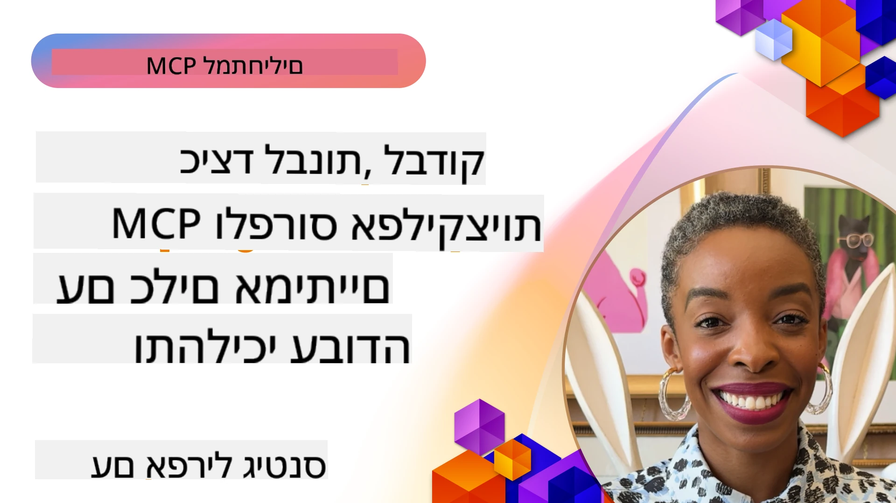

# יישום מעשי

[](https://youtu.be/vCN9-mKBDfQ)

_(לחץ על התמונה למעלה לצפייה בסרטון של השיעור הזה)_

יישום מעשי הוא המקום שבו כוח פרוטוקול ההקשר של המודל (MCP) הופך מוחשי. בעוד שהבנת התיאוריה והארכיטקטורה מאחורי MCP חשובה, הערך האמיתי מתגלה כשאתה מיישם את המושגים האלה לבניית, בדיקה ופריסה של פתרונות לפתירת בעיות אמיתיות. פרק זה גשר בין ידע קונספטואלי ופיתוח מעשי, ומנחה אותך בתהליך הבאת אפליקציות מבוססות MCP לחיים.

בין אם אתה מפתח עוזרים אינטליגנטים, משלב AI בזרימות עבודה עסקיות או בונה כלים מותאמים אישית לעיבוד נתונים, MCP מספקת בסיס גמיש. העיצוב שלה שאינו תלוי בשפה ו-SDKs רשמיים לשפות תכנות פופולריות הופכים אותה לנגישה לטווח רחב של מפתחים. באמצעות ניצול ה-SDKs האלה, תוכל במהירות ליצור אב-טיפוס, לחזור על הפתרונות ולסקל אותם בפלטפורמות וסביבות שונות.

במדורים הבאים תמצא דוגמאות מעשיות, קוד לדוגמה ואסטרטגיות פריסה שמדגימות כיצד ליישם MCP ב-C#, Java עם Spring, TypeScript, JavaScript ו-Python. תלמד גם כיצד לדבג ולבדוק את שרתי ה-MCP שלך, לנהל ממשקי API ולפרוס פתרונות לענן באמצעות Azure. משאבים מעשיים אלה מיועדים להאיץ את הלמידה שלך ולעזור לך לבנות בביטחון אפליקציות MCP יציבות ומוכנות לייצור.

## סקירה כללית

שיעור זה מתמקד בהיבטים מעשיים של יישום MCP בשפות תכנות שונות. נחקור כיצד להשתמש ב-SDK של MCP ב-C#, Java עם Spring, TypeScript, JavaScript ו-Python כדי לבנות אפליקציות יציבות, לדבג ולבדוק שרתי MCP, וליצור משאבים, תבניות וכלים לשימוש חוזר.

## מטרות הלמידה

בסיום שיעור זה תוכל:

- ליישם פתרונות MCP באמצעות SDK רשמיים בשפות תכנות שונות
- לדבג ולבדוק שרתי MCP בצורה שיטתית
- ליצור ולהשתמש בתכונות שרת (משאבים, תבניות וכלים)
- לעצב זרימות עבודה יעילות ל-MCP למשימות מורכבות
- לאופטם יישומי MCP לביצועים ואמינות

## משאבים רשמיים של SDK

פרוטוקול ההקשר של המודל מציע SDK רשמיים למספר שפות (תואם ל-[MCP Specification 2025-11-25](https://spec.modelcontextprotocol.io/specification/2025-11-25/)):

- [C# SDK](https://github.com/modelcontextprotocol/csharp-sdk)
- [Java עם Spring SDK](https://github.com/modelcontextprotocol/java-sdk) **הערה:** דורש תלות ב-[Project Reactor](https://projectreactor.io). (ראה [דיון 246](https://github.com/orgs/modelcontextprotocol/discussions/246).)
- [TypeScript SDK](https://github.com/modelcontextprotocol/typescript-sdk)
- [Python SDK](https://github.com/modelcontextprotocol/python-sdk)
- [Kotlin SDK](https://github.com/modelcontextprotocol/kotlin-sdk)
- [Go SDK](https://github.com/modelcontextprotocol/go-sdk)

## עבודה עם SDK של MCP

חלק זה מספק דוגמאות מעשיות ליישום MCP בשפות תכנות שונות. ניתן למצוא קוד לדוגמה בתיקיית `samples` הממוינת לפי שפה.

### דוגמאות זמינות

מאגר הקוד כולל [יישומים לדוגמה](../../../04-PracticalImplementation/samples) בשפות הבאות:

- [C#](./samples/csharp/README.md)
- [Java עם Spring](./samples/java/containerapp/README.md)
- [TypeScript](./samples/typescript/README.md)
- [JavaScript](./samples/javascript/README.md)
- [Python](./samples/python/README.md)

כל דוגמה מדגימה מושגי מפתח ודפוסי יישום של MCP לשפה ואקוסיסטם ספציפיים.

### מדריכים מעשיים

מדריכים נוספים ליישום מעשי של MCP:

- [פגינציה וקבוצות תוצאות גדולות](./pagination/README.md) - טיפול בפגינציה מבוססת סמן לכלים, משאבים ונתונים גדולים

## תכונות מרכזיות של השרת

שרתי MCP יכולים ליישם כל שילוב של התכונות הבאות:

### משאבים

משאבים מספקים הקשר ונתונים לשימוש המשתמש או מודל ה-AI:

- מאגרי מסמכים
- בסיסי ידע
- מקורות נתונים מובנים
- מערכות קבצים

### תבניות

תבניות הן הודעות וזרימות עבודה מוכנות מראש למשתמשים:

- תבניות שיחה מוגדרות מראש
- דפוסי אינטראקציה מודרכים
- מבני דיאלוג מיוחדים

### כלים

כלים הם פונקציות שהמודל AI יכול להפעיל:

- כלי עיבוד נתונים
- אינטגרציות API חיצוניות
- יכולות חישוב
- פונקציונליות חיפוש

## דוגמאות יישום: יישום ב-C#

מאגר ה-SDK הרשמי של C# מכיל מספר דוגמאות הממחישות היבטים שונים של MCP:

- **לקוח MCP בסיסי**: דוגמה פשוטה המדגימה כיצד ליצור לקוח MCP ולהפעיל כלים
- **שרת MCP בסיסי**: יישום שרת מינימלי עם רישום כלים בסיסי
- **שרת MCP מתקדם**: שרת מלא תכונות עם רישום כלים, אימות וטיפול בשגיאות
- **אינטגרציה עם ASP.NET**: דוגמאות המדגימות אינטגרציה עם ASP.NET Core
- **דפוסי יישום לכלים**: דפוסים שונים ליישום כלים עם רמות מורכבות שונות

ה-SDK של MCP ל-C# נמצא בבדיקה וממשקי ה-API עשויים להשתנות. נעדכן את הבלוג הזה בהתפתחויות ה-SDK.

### תכונות מפתח

- [C# MCP Nuget ModelContextProtocol](https://www.nuget.org/packages/ModelContextProtocol)
- בניית [שרת MCP ראשון שלך](https://devblogs.microsoft.com/dotnet/build-a-model-context-protocol-mcp-server-in-csharp/).

לכל דוגמאות היישום ב-C# בקר ב-[מאגר דוגמאות ה-SDK הרישמי של C#](https://github.com/modelcontextprotocol/csharp-sdk)

## דוגמאות יישום: Java עם Spring

ה-SDK של Java עם Spring מציע אפשרויות יישום MCP יציבות עם תכונות ברמת ארגוניות.

### תכונות מפתח

- אינטגרציה עם Spring Framework
- בטיחות סוג חזקה
- תמיכה בתכנות תגובתי (Reactive)
- טיפול שגיאות מקיף

לדוגמת יישום מלאה ב-Java עם Spring, ראה [דוגמה ב-Java עם Spring](samples/java/containerapp/README.md) בספריית הדוגמאות.

## דוגמאות יישום: JavaScript

ה-SDK של JavaScript מספק גישה קלה וגמישה ליישום MCP.

### תכונות מפתח

- תמיכה ב-Node.js ודפדפן
- API מבוסס Promises
- אינטגרציה קלה עם Express ומסגרות אחרות
- תמיכה ב-WebSocket לייצור זרם

לדוגמת יישום מלאה ב-JavaScript, ראה [דוגמה ב-JavaScript](samples/javascript/README.md) בספריית הדוגמאות.

## דוגמאות יישום: Python

ה-SDK של Python מציע גישה פייתונית ליישום MCP עם אינטגרציות מצוינות למסגרות ML.

### תכונות מפתח

- תמיכה ב-async/await עם asyncio
- אינטגרציה עם FastAPI
- רישום כלי פשוט
- אינטגרציה מקורית עם ספריות ML פופולריות

לדוגמת יישום מלאה ב-Python, ראה [דוגמה ב-Python](samples/python/README.md) בספריית הדוגמאות.

## ניהול API

Azure API Management היא תשובה מצוינת לשאלה כיצד לאבטח שרתי MCP. הרעיון הוא להציב מופע של Azure API Management מול שרת ה-MCP שלך ולאפשר לו לטפל בתכונות שברצונך להפעיל כגון:

- הגבלת קצב
- ניהול טוקנים
- ניטור
- איזון עומסים
- אבטחה

### דוגמה ב-Azure

הנה דוגמה ב-Azure שעושה בדיוק את זה, כלומר [יצירת שרת MCP ואבטחתו עם Azure API Management](https://github.com/Azure-Samples/remote-mcp-apim-functions-python).

ראה כיצד מתרחש תהליך האישור בתמונה למטה:


בתמונה שלעיל, מתרחש:

- אימות/הרשאה מתבצעים באמצעות Microsoft Entra.
- Azure API Management פועל כשער ומשתמש במדיניות לניהול והכוונת התנועה.
- Azure Monitor מתעד את כל הבקשות לניתוח נוסף.

#### תהליך האישור

בוא נבחן ביתר פירוט את תהליך האישור:


#### מפרט האישור של MCP

למידע נוסף על [מפרט האישור של MCP](https://spec.modelcontextprotocol.io/specification/2025-11-25/basic/authorization/)

## פרוס שרת MCP מרוחק ב-Azure

בוא נראה אם נוכל לפרוס את הדוגמה שהזכרנו קודם:

1. שכפל את המאגר

    ```bash
    git clone https://github.com/Azure-Samples/remote-mcp-apim-functions-python.git
    cd remote-mcp-apim-functions-python
    ```

1. רשום את ספק המשאבים `Microsoft.App`.

   - אם אתה משתמש ב-Azure CLI, הרץ `az provider register --namespace Microsoft.App --wait`.
   - אם אתה משתמש ב-Azure PowerShell, הרץ `Register-AzResourceProvider -ProviderNamespace Microsoft.App`. לאחר מכן הרץ `(Get-AzResourceProvider -ProviderNamespace Microsoft.App).RegistrationState` אחרי זמן להמשך בדיקת סטטוס הרישום.

1. הרץ את הפקודה [azd](https://aka.ms/azd) הזאת לספק את שירות ניהול ה-API, אפליקציית הפונקציה (עם הקוד) וכל שאר המשאבים הנדרשים ב-Azure

    ```shell
    azd up
    ```

    פקודות אלו אמורות לפרוס את כל המשאבים בענן ב-Azure

### בדיקת השרת שלך עם MCP Inspector

1. בחלון טרמינל חדש, התקן והפעל את MCP Inspector

    ```shell
    npx @modelcontextprotocol/inspector
    ```

    אמור להופיע לך ממשק דומה ל:

    

1. לחץ CTRL ופתח את אפליקציית הרשת MCP Inspector מה-URL המוצג (למשל [http://127.0.0.1:6274/#resources](http://127.0.0.1:6274/#resources))
1. הגדר את סוג התעבורה ל-`SSE`
1. הגדר את כתובת ה-URL לנקודת הקצה SSE של ניהול ה-API שלך שמוצגת לאחר `azd up` ולחץ **Connect**:

    ```shell
    https://<apim-servicename-from-azd-output>.azure-api.net/mcp/sse
    ```

1. **רשום כלים**. לחץ על כלי ו**הפעל כלי**.  

אם כל השלבים עבדו, אתה אמור להיות מחובר לשרת ה-MCP והצלחת להפעיל כלי.

## שרתי MCP עבור Azure

[Remote-mcp-functions](https://github.com/Azure-Samples/remote-mcp-functions-dotnet): קבוצת מאגרים אלו הם תבניות התחלה מהירה לבניית ופריסת שרתי MCP מרוחקים מותאמים אישית באמצעות Azure Functions עם Python, C# .NET או Node/TypeScript.

הדוגמאות מספקות פתרון מלא המאפשר למפתחים:

- בנייה והרצה מקומית: פיתוח ודיבוג שרת MCP על מחשב מקומי
- פריסה ל-Azure: פריסה פשוטה לענן בפשטות עם פקודת azd up
- חיבור מלקוחות: חיבור לשרת MCP מלקוחות שונים כולל מצב סוכן Copilot ב-VS Code וכלי MCP Inspector

### תכונות מפתח

- אבטחה כברירת מחדל: שרת MCP מאובטח באמצעים ו-HTTPS
- אפשרויות אימות: תומך ב-OAuth בעזרת אימות מובנה ו/או ניהול API
- בידוד רשת: מאפשר בידוד רשת באמצעות רשתות וירטואליות של Azure (VNET)
- ארכיטקטורת Serverless: משתמש ב-Azure Functions לביצועים סקלביליים ומונחי אירועים
- פיתוח מקומי: תמיכה מקיפה בפיתוח ודיבוג מקומי
- פריסה פשוטה: תהליך פריסה יעיל ל-Azure

המאגר כולל את כל קבצי התצורה, קוד המקור והגדרות התשתית הדרושות כדי להתחיל במהירות עם יישום שרת MCP מוכן לייצור.

- [Azure Remote MCP Functions Python](https://github.com/Azure-Samples/remote-mcp-functions-python) - דוגמת יישום של MCP באמצעות Azure Functions עם Python

- [Azure Remote MCP Functions .NET](https://github.com/Azure-Samples/remote-mcp-functions-dotnet) - דוגמת יישום של MCP באמצעות Azure Functions עם C# .NET

- [Azure Remote MCP Functions Node/Typescript](https://github.com/Azure-Samples/remote-mcp-functions-typescript) - דוגמת יישום של MCP באמצעות Azure Functions עם Node/TypeScript.

## נקודות עיקריות

- SDKs של MCP מספקים כלים ספציפיים לשפה ליישום פתרונות MCP יציבים
- תהליך הדיבוג והבדיקה קריטי לאפליקציות MCP אמינות
- תבניות תזמון לשימוש חוזר מנגישות אינטראקציות AI עקביות
- זרימות עבודה מעוצבות היטב יכולות לתזמר משימות מורכבות באמצעות כלים מרובים
- יישום פתרונות MCP דורש התייחסות לאבטחה, ביצועים וטיפול בשגיאות

## תרגיל

עצב זרימת עבודה מעשית של MCP שמטפלת בבעיה אמיתית בתחומך:

1. זיהוי 3-4 כלים שיהיו שימושיים לפתרון הבעיה הזו
2. צור דיאגרמת זרימת עבודה המראית כיצד כלים אלה מתקשרים ביניהם
3. יישם גרסה בסיסית של אחד הכלים בשפה המועדפת עליך
4. צור תבנית תזמון שתעזור למודל להשתמש בכלי שלך ביעילות

## משאבים נוספים

---

## מה הלאה

הבא: [נושאים מתקדמים](../05-AdvancedTopics/README.md)

---

<!-- CO-OP TRANSLATOR DISCLAIMER START -->
**הצהרת אחריות**:  
מסמך זה תורגם תוך שימוש בשירות תרגום מבוסס בינה מלאכותית [Co-op Translator](https://github.com/Azure/co-op-translator). למרות שאנו שואפים לדיוק, נדרשת הזהירות שכן תרגומים אוטומטיים עלולים להכיל שגיאות או אי דיוקים. המסמך המקורי בשפתו הטבעית ייחשב כמקור הרשמי והמוסמך. למידע קריטי מומלץ להיעזר בתרגום מקצועי שנעשה על ידי אדם. אנו לא נושאים באחריות לכל אי הבנה או פרשנות שגויה הנובעות משימוש בתרגום זה.
<!-- CO-OP TRANSLATOR DISCLAIMER END -->